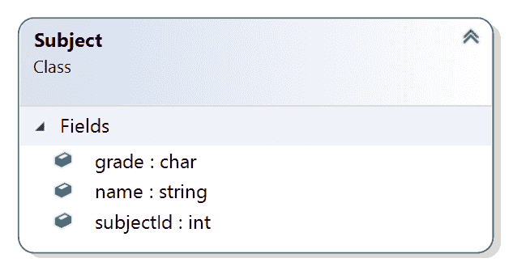
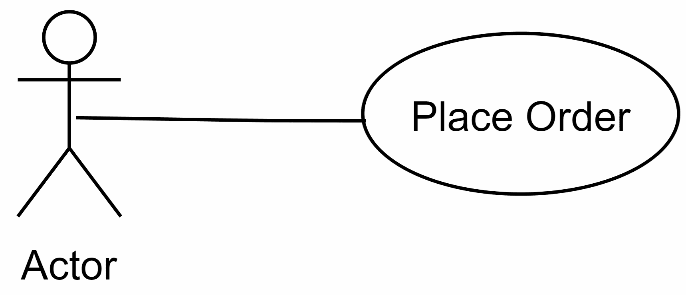
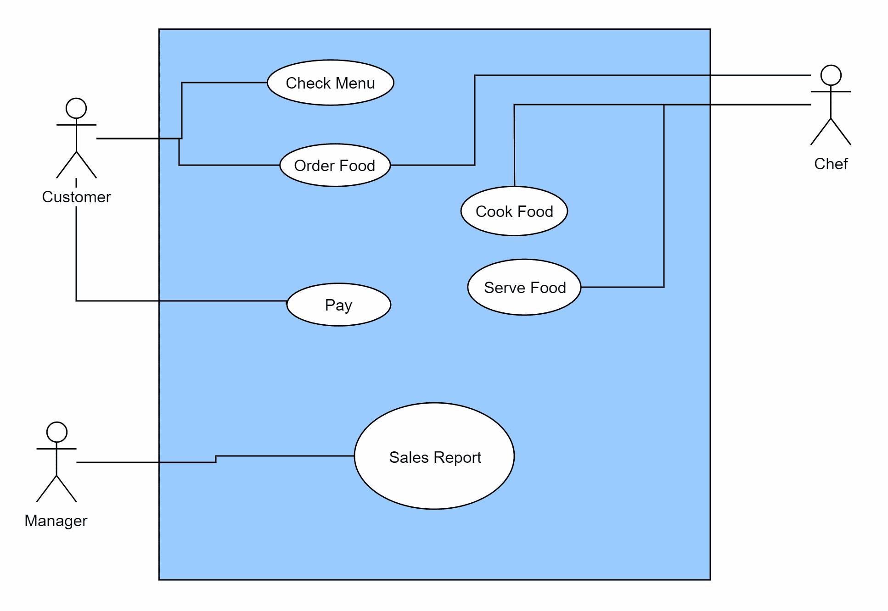
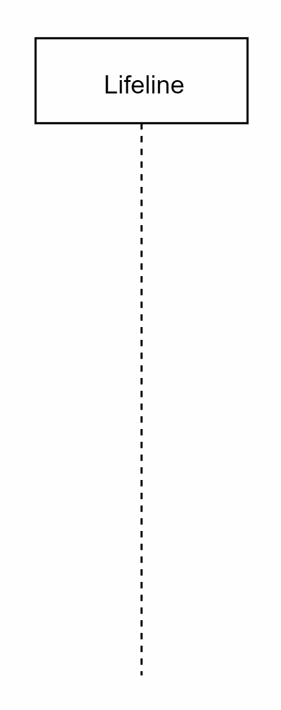
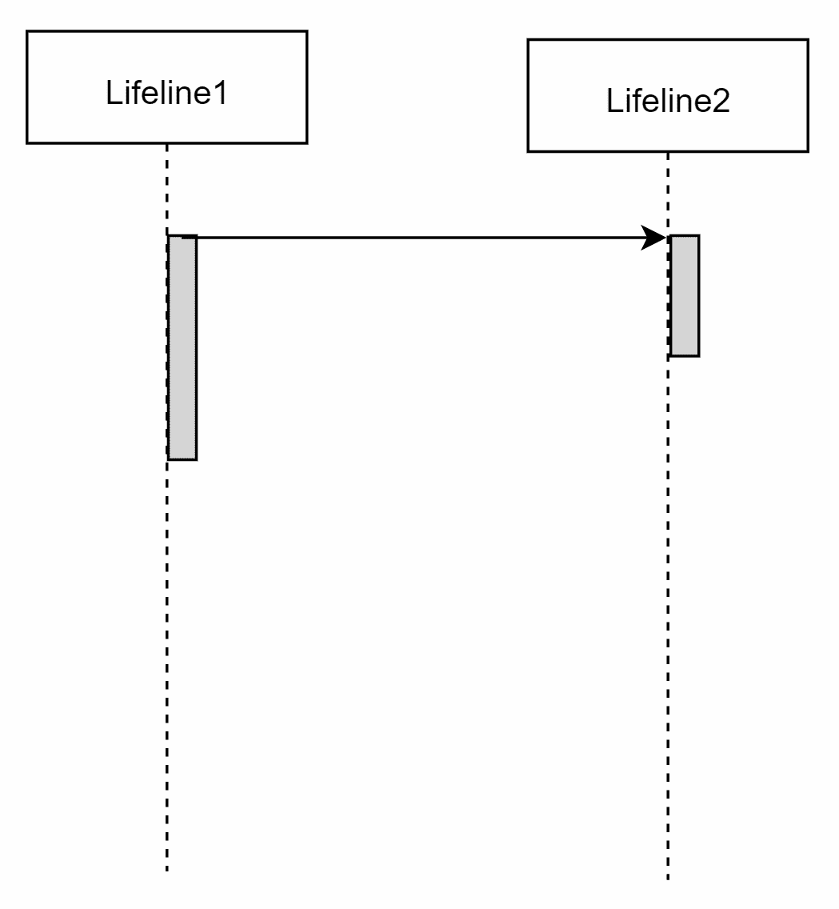
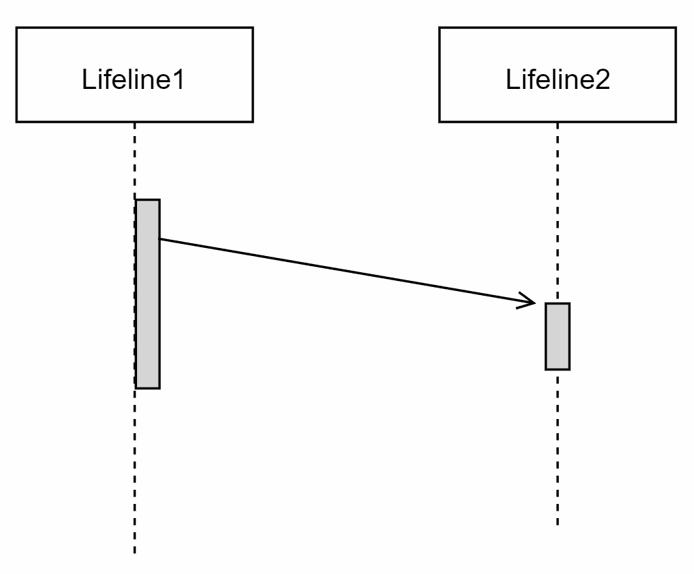
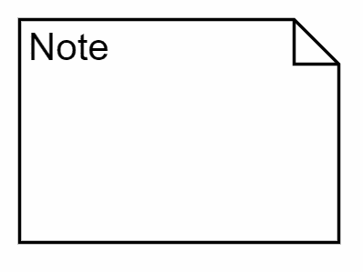

# 第八章：软件建模和设计

随着土木工程的出现和大型结构的创建，建模和设计实践变得非常重要。软件开发也是如此。如今，软件无处不在：在你的电脑、手机、电视、汽车等等。随着软件的使用范围扩大，软件开发变得越来越复杂和昂贵，需要时间和金钱。

软件建模和设计是软件开发生命周期的重要部分。如果你有一个想法，计划开始一个软件项目，你应该做的第一件事是设计和建模软件，而不是直接开始编写代码。这将为你提供软件的高层视图，并有机会以便于扩展和修改的方式设计架构。如果你不事先进行建模，可能会陷入需要重构软件架构的情况，这可能非常昂贵。

本章将涵盖的主题如下：

+   设计图的重要性

+   不同的**统一建模语言**（**UML**）图

+   类图

+   用例图

+   序列图

# 设计图的重要性

UML 是一种设计语言，是用于软件建模和设计的标准语言。它最初由 Grady Booch，Ivar Jacobson 和 James Rumbaugh 于 1994-1995 年在 Rational Software 开发。1997 年，**对象管理组**（**OMG**）将其采纳为建模的标准语言。后来，2005 年，**国际标准化组织**（**ISO**）批准 UML 作为 ISO 标准，自那时起，它已被每个软件社区采用。

UML 图允许开发人员向其他人传达软件设计。这是一种具有一套规则的语言，鼓励简单的交流。如果你学会了阅读 UML，你就能理解任何用 UML 编写的软件模型。用普通英语解释软件模型将会非常困难。

# 不同的 UML 图

有许多类型的 UML 图，但在本章中我们只讨论最重要的几种。UML 图分为以下两个主要类别：

+   结构图

+   行为图

以下列表显示了属于结构图类别的图表：

+   类图

+   组件图

+   组合结构图

+   部署图

+   对象图

+   包图

+   配置文件图

行为图包括以下内容：

+   活动图

+   通信图

+   交互概述图

+   序列图

+   状态图

+   时序图

+   用例图

# 类图

类图是一种结构图，主要用于提供面向对象软件的设计。该图表演示了软件的结构，类的属性和方法，以及系统中类之间的关系。它可用于开发和文档编写；软件开发人员经常使用该图表快速了解代码，并帮助其他开发人员理解系统。它也偶尔被公司业务方面的员工使用。

以下是类图的三个主要部分：

+   类名

+   属性部分

+   方法部分

类图由不同的类组成，表示为方框或矩形。矩形通常分为上述部分。第一部分包含类的名称，第二部分包含属性，第三部分包含方法。

让我们来看一个类图的例子：

在这里，我们可以看到一个名为`Car`的类，如顶部框所示。在下面，我们有该类的属性。我们可以看到`color`是一个属性的名称，前面有一个`+`号，表示它是一个公共变量。我们还可以看到变量名称旁边有一个`:`（冒号），这是一个分隔符。冒号后面给出的内容表示变量的类型。在这种情况下，我们可以看到`color`变量是`string`类型。下一个属性是`company`，也是`string`类型的变量。它前面有一个`-`号，表示它是一个私有变量。第三个属性是`fuel`，我们可以看到这是一个`integer`类型的私有变量。

如果我们查看属性下面，我们会看到`Car`类的方法。我们可以看到它有三个方法：`move(direction: string)`，`IsFuelEmpty()`和`RefilFuel(litre: int)`。与属性一样，我们可以看到方法后面有一个`:`（冒号）。在这种情况下，冒号后面给出的类型是方法的返回类型。第一个方法`move`不返回任何东西，所以类型是 void。在`IsFuelEmpty()`方法中，返回类型是布尔值，第三个方法也是如此。这里要注意的另一件事是方法的参数，它们放在方法名后的括号中。例如，`move`方法有一个名为`direction`的`string`类型参数。`RefilFuel(litre: int)`方法有一个`int`类型参数，即`litre`。

在前面的例子中，我们看到了类在类图中的表示。通常，一个系统有多个相互关联的类。类图也展示了类之间的关系，这给观察者提供了系统对象关系的完整图景。在第四章中，*对象协作*，我们学习了面向对象软件中类和对象之间的不同关系。现在让我们看看如何使用类图表示这些不同的对象关系。

# 继承

**继承**是一种类似于另一个类的关系，就像 BMW i8 Roadster 是一种汽车一样。这种关系使用一条线和一个空心箭头表示。箭头从类指向超类，如下图所示：

# 关联

关联关系是对象之间最基本的关系。当一个对象与另一个对象有某种逻辑或物理关系时，称为**关联关系**。它由一条线和一个箭头表示。如果两侧都有箭头，表示双向关系。关联的一个例子可能是以下内容：

# 聚合

**聚合** **关系**是一种特殊类型的关联关系。这种关系通常被称为**拥有** **关系**。当一个类包含另一个类/对象时，这是一种聚合关系。这是用一条线和一个空心菱形表示的。例如，一辆车有一个轮胎。轮胎和车有一个聚合关系，如下图所示：

# 组合

当一个类包含另一个类，并且依赖类不能没有超类而存在时，这是一种**组合关系**。例如，银行账户不能没有银行而存在，如下图所示：

# 依赖

当一个类有一个依赖类，但是这个类本身不依赖于它自己的依赖类时，这些类之间的关系被称为**依赖关系**。在依赖关系中，依赖类的任何改变对其所依赖的类没有任何影响。但是如果它所依赖的类发生变化，依赖类将会受到影响。

这种关系用虚线表示，末端有一个箭头。例如，让我们想象一下我们手机上有一个主题。如果我们改变主题，手机的图标会改变，所以图标对主题有依赖。这种关系在下面的图中显示：

# 类图的一个例子

让我们来看一个项目的类图的例子。在这里，我们有一些成绩管理软件，被学校的老师和学生使用。这个软件允许老师更新特定学生在不同学科的成绩。它也允许学生查看他们的成绩。对于这个软件，我们有以下的类：

+   `Person`:

人员类图

+   老师：

老师类图

+   `Student`:

学生类图

+   `Subject`:

学科类图

在这里，我们使用 Visual Studio 生成我们的类图，所以箭头可能不匹配前面部分给出的箭头。如果你使用其他绘图软件绘制你的类图，或者你手绘，那么请使用前面部分指定的箭头。

让我们来看下面的完整类图：

在这里，我们可以看到我们有一个`Person`类，有两个属性，`FirstName`和`LastName`。`Student`和`Teacher`类继承了`Person`类，所以我们可以看到箭头是空心的。`Student`类有两个属性，`email`和`studentId`。它还有一个名为`GetExamGrade`的方法（string subject），它接受学科的名称并返回`char`类型的成绩。我们可以看到另一个类`Subject`与`Student`有合成关系。`Student`有一个学科列表，而`Subject`类有三个属性，`grade`，`name`和`subjectId`。`Teacher`类有一个`email`，`phoneNumber`和`teacherId`，它们分别是`string`，`string`和`int`类型。`Teacher`类与`Student`类有一个关联关系，因为老师有一组学生在他们下面。`Teacher`类还有一个名为`GiveExamGrade`的方法，它接受三个参数，`studentId`，`subject`和`grade`。这个方法将设置学生学科的成绩。

仅仅通过查看类图，我们就可以清楚地了解系统。我们知道学科与学生的关系，以及学生与老师的关系。我们还知道一个学科对象不能没有学生对象存在，因为它们有合成关系。这就是类图的美妙之处。

# 用例图

**用例图**是在软件开发中非常常用的行为图。这个图的主要目的是说明软件的功能使用。它包含了系统的用例，并且可以用来提供功能的高层视图，甚至是软件的非常具体的低级模块。通常对于一个系统，会有多个用例图，专注于系统的不同层次。用例图不应该用来显示系统的实现细节；它们被开发出来只是为了显示系统的功能需求。用例图对于业务人员来传达他们从系统中需要什么非常有用。

用例图的四个主要部分如下列表所示：

+   角色

+   用例

+   通信链接

+   系统边界

# 角色

用例图中的角色不一定是一个人，而是系统的用户。它可以是一个人，另一个系统，甚至是系统的另一个模块。角色的可视表示如下图所示：

角色负责提供输入。它向系统提供指令，系统会相应地工作。角色所做的每一个动作都有一个目的。用例图向我们展示了一个角色可以做什么，以及角色的期望是什么。

# 用例

用例图的视觉部分或表示被称为**用例**。这代表了系统的功能。角色将执行一个用例来实现一个目标。用例由一个带有功能名称的椭圆表示。例如，在餐厅应用程序中，*下订单*可能是一个用例。我们可以表示如下：

# 通信链接

**通信链接**是从角色到用例的简单线条。这个链接用于显示角色与特定用例的关系。角色无法访问所有用例，因此在显示哪些用例可以被哪个角色访问时，通信链接非常重要。让我们看一个通信链接的例子，如下图所示：

# 系统边界

**系统边界**主要用于显示系统的范围。能够确定哪些用例属于我们的系统，哪些不属于是很重要的。在用例图中，我们只关注我们系统中的用例。在大型系统中，如果这些模块足够独立，可以独立运行，那么系统的每个模块有时会被视为一个边界。这通常用一个包含用例的矩形框来表示。角色不是系统的一部分，因此角色将在系统边界之外，如下图所示：

# 用例图的一个例子

让我们现在想象一下，我们有一个餐厅系统，顾客可以点餐。厨师准备食物，经理跟踪销售情况，如下图所示：

从上图可以看出，我们有三个角色（顾客、厨师和经理）。我们还有不同的用例——查看菜单、点餐、烹饪食物、上菜、支付和销售报告，这些用例与一个或多个角色相连。**顾客**参与了查看菜单、点餐和支付用例。厨师必须访问点餐以了解订单情况。厨师还参与了烹饪食物和上菜用例。与厨师和顾客不同，经理能够查看餐厅的销售报告。

通过查看这个用例图，我们能够确定系统的功能。它不会给出任何实现细节，但我们可以很容易地看到系统的概述。

# 序列图

序列图是行为图中的一种交互图。顾名思义，它显示了系统活动的顺序。通过查看序列图，您可以确定在特定时间段内发生了哪些活动，以及接下来发生了哪些活动。它使我们能够理解系统的流程。它表示的活动可能是用户与系统之间的交互，两个系统之间的交互，或者系统与子系统之间的交互。

序列图的水平轴显示时间从左到右流逝，而垂直轴显示活动的流程。不同的活动以顺序的方式放置在图中。序列图不一定显示时间流逝的持续时间，而是显示从一个活动到另一个活动的步骤。

在接下来的部分中，我们将看一下序列图中使用的符号。

# 一个参与者

序列图中的参与者与用例图中的参与者非常相似。它可以是用户、另一个系统，甚至是用户组。参与者不是系统的一部分，而是在外部执行命令。不同的操作是在接收用户命令时执行的。参与者用一个棒状图表示，如下图所示：

# 一个生命线

序列图中的生命线是系统的一个实体或元素。每个生命线都有自己的逻辑和任务要完成。通常，一个系统有多个生命线，并且命令是从一个生命线传递到另一个生命线的。

一个生命线由一个从底部发出的带有垂直线的框表示，如下图所示：

# 一个激活

激活是生命线上的一个小矩形框。这个激活框代表了一个活动处于活动状态的时刻。框的顶部代表活动的开始，框的底部代表活动的结束。

让我们看看在图中是什么样子的：

# 一个呼叫消息

一个呼叫消息表示生命线之间的交互。它从左到右流动，并且以一条箭头表示在线的末端，如下图所示。一个消息呼叫代表了一些信息或触发下一个生命线的触发器：

# 一个返回消息

序列图中的正常消息流是从左到右的，因为这代表了动作命令；然而，有时消息会返回给调用者。一个返回消息从右到左流动，并且以一个带箭头头的虚线表示，如下图所示：

# 一个自消息

有时，消息是从一个生命线传递到它自己，比如内部通信。它将以与消息呼叫类似的方式表示，但是它不是指向另一个活动或另一个生命线，而是返回到相同生命线的相同活动，如下图所示：

# 一个递归消息

当发送一个自消息用于递归目的时，它被称为递归消息。在同一时间线上为此目的绘制另一个小活动，如下图所示：

# 一个创建消息

这种类型的消息不是普通的消息，比如一个呼叫消息。当一个生命线由另一个生命线创建时，会使用一个创建消息，如下图所示：

# 一个销毁消息

当从一个活动发送一个销毁消息到一个生命线时，意味着接下来的生命线不会被执行，流程将停止，如下图所示。它被称为销毁消息，因为它销毁了活动流程：

# 一个持续消息

我们使用一个持续消息来显示当一个活动将消息传递给下一个活动时有一个时间持续。它类似于一个呼叫消息，但是是向下倾斜的，如下图所示：

# 一个注释

备注用于包含与元素或操作相关的任何必要备注。它没有特定的规则。可以将其放置在适合清楚表示事件的任何位置。任何类型的信息都可以写在备注中。备注表示如下：

# 序列图示例

学习任何东西的最佳方法是通过查看其示例。让我们来看一个简单餐厅系统的序列图示例：

在这里，我们可以看到客户首先从 UI 请求菜单。UI 将请求传递给控制器，然后控制器将请求传递给经理。经理获取菜单并回应控制器。控制器回应 UI，UI 在显示器上显示菜单。

客户选择商品后，订单逐步传递给经理。经理调用另一个方法来准备食物，并向客户发送响应，通知他们订单已收到。食物准备好后，将其送到客户那里。客户收到食物后，支付账单并领取付款收据。

通过查看序列图，我们可以看到流程中涉及的不同活动。系统是如何一步一步地工作的非常清楚。这种类型的图表在展示系统流程方面非常有用，非常受欢迎。

# 摘要

在本章中，您学习了如何使用 UML 图表对软件进行建模和设计的基础知识。这对每个软件开发人员来说都非常重要，因为我们需要能够与企业进行沟通，反之亦然。您还会发现，当与其他开发人员或软件架构师讨论系统时，这些图表也很有用。在本章中，我们没有涵盖所有可用于建模和设计软件的不同图表，因为这超出了本书的范围。在本章中，我们涵盖了类图、用例图和序列图。我们看到了每个图表的一个示例，并了解了如何绘制它们。

在下一章中，我们将学习如何使用 Visual Studio。我们将看到一些技巧和窍门，这些将帮助您在使用 Visual Studio 时提高生产力。
