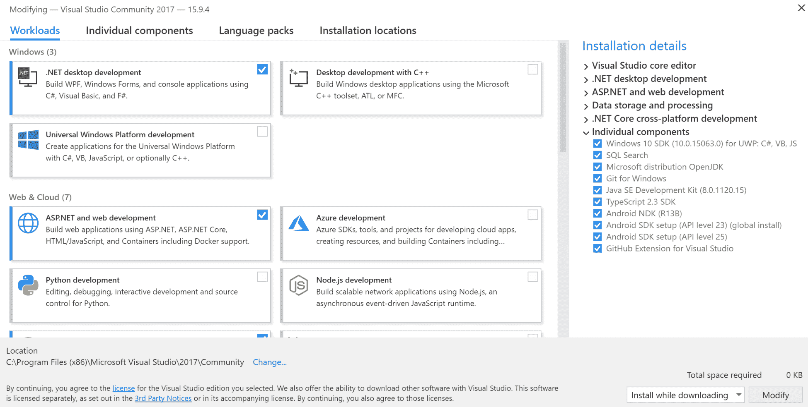
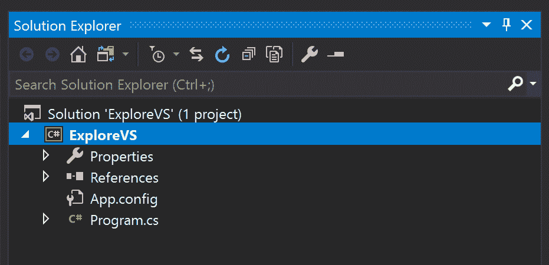
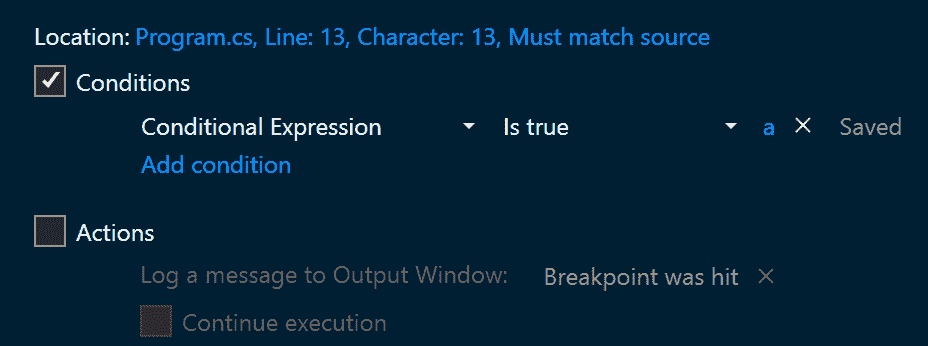
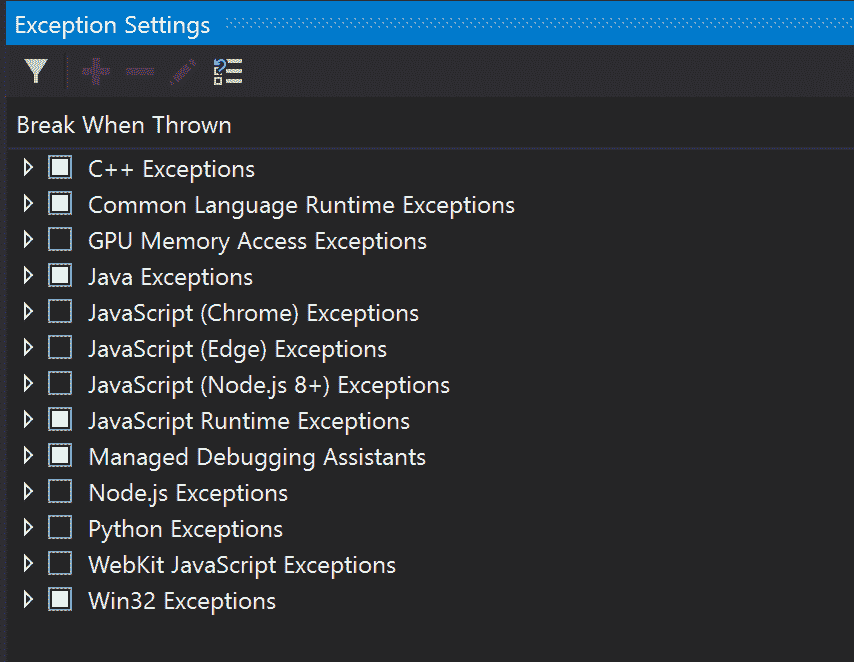
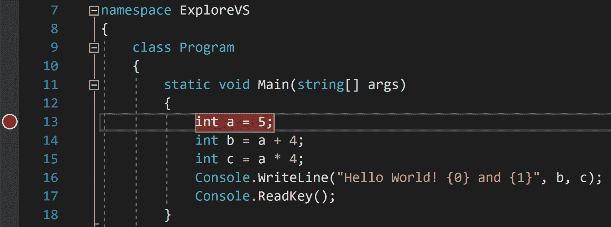
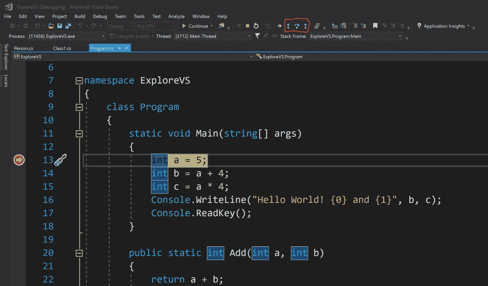
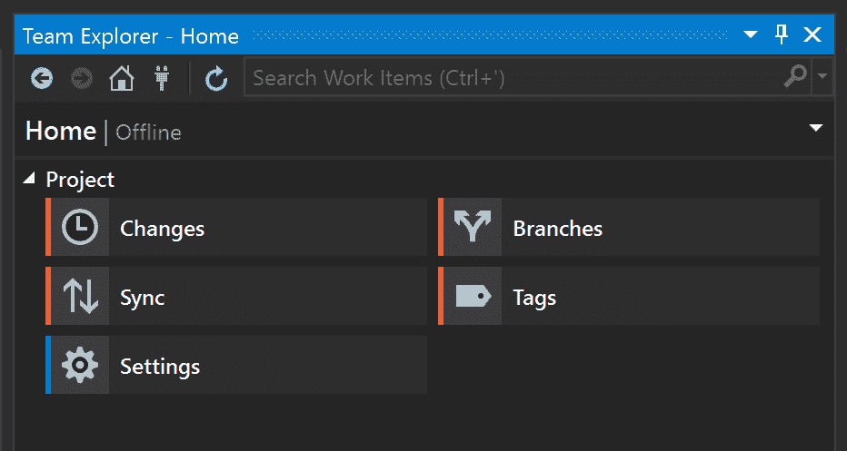

# 第九章：Visual Studio 和相关工具

Visual Studio 是微软的**集成开发环境**（**IDE**）。它是一种计算机软件，可以用来编写、调试和执行代码。Visual Studio 是行业中最受欢迎的 IDE 之一，主要用于.NET 应用程序。由于它来自微软，因此使.NET 开发变得非常简单和顺畅。您可以使用 Visual Studio 进行其他编程语言，但我不能保证它会是最有用的选择；然而，对于像我这样的 C#开发人员来说，这是最好的 IDE。作为开发人员，我大部分时间都在 Visual Studio 中度过。

在撰写本书时，Visual Studio 的最新版本是 Visual Studio 2017。微软推出了不同版本的 Visual Studio。其中之一是社区版，是免费的。还有另外两个版本：Visual Studio 专业版和 Visual Studio 企业版。专业版和企业版是收费的，更适合大型项目。在本书中，我们将探讨社区版的功能，因为它是免费的，并且具有足够的功能来满足本书的目的。

在本章中，我们将学习 Visual Studio 的特性。我们将涵盖以下主题：

+   Visual Studio 项目类型和模板

+   Visual Studio 编辑器和不同的窗口

+   调试窗口

+   断点、调用堆栈跟踪和监视

+   Visual Studio 中的 Git

+   重构和代码优化技术

# Visual Studio 项目类型和模板

Visual Studio 是与微软相关技术堆栈的最佳 IDE。无论您是计划为 Windows 开发桌面应用程序还是为 Windows Server 开发 Web 应用程序，都可以使用 Visual Studio。使用 Visual Studio 的最佳部分是，如果您没有使用它，IDE 将帮助您完成许多常见任务，否则您将不得不手动执行这些任务。例如，如果您计划使用 ASP.NET **Model-View-Controller**（**MVC**）创建 Web 应用程序，Visual Studio 可以为您提供 MVC 应用程序的模板。您可以从模板开始，并根据您的要求进行修改。如果没有这个，您将不得不下载包，创建文件夹，并为应用程序设置 Web 配置。要充分利用 Visual Studio，您必须了解它提供的不同项目和模板，以便加快开发过程。

让我们来看看 Visual Studio 提供的不同项目类型。打开 Visual Studio 后，如果单击“新建项目”，将弹出以下窗口：

在左侧，我们可以看到项目的主要类别：最近、已安装和在线。在“最近”选项卡中，您可以看到最近使用过的项目类型，因此您不必每次都搜索常用的项目类型。在“已安装”选项卡中，您将找到已经安装在计算机上的项目类型。安装 Visual Studio 时，您可以选择要安装哪些工作负载。

在安装 Visual Studio 时会出现的工作负载窗口如下所示：

您选择的工作负载选项与安装的项目类型直接相关。在“在线”选项卡下，您将找到在安装 Visual Studio 时未安装的项目。Visual Studio 提供了许多项目模板，这就是为什么它们不会一次全部安装的原因。

现在，如果我们展开“已安装”选项卡，我们将看到不同的编程语言显示为子选项卡：Visual C#、Visual Basic、Visual C++等。由于本书涉及 C#，我们将只关注 Visual C#区域，如下面的屏幕截图所示：

如果我们展开 Visual C#选项卡，我们将看到与更具体类型的项目相关的更多选项卡，例如 Windows 桌面、Web、.NET Core、测试等。但是，如果我们专注于窗口的中间部分，我们将看到不同的项目模板，例如 Windows 窗体应用程序（.NET Framework）、控制台应用程序（.NET Core）、控制台应用程序（.NET Framework）、类库（.NET 标准）、类库（.NET Framework）、ASP .NET Core Web 应用程序、ASP.NET Web 应用程序（.NET Framework）等。在窗口的右侧，我们可以看到您在中间窗格中选择的项目模板的简短描述，如下图所示：

让我们来看一下 Visual Studio 2017 中提供的一些最常见的项目模板：

+   **控制台应用程序：** 用于创建命令行应用程序的项目。这种类型的项目有两种不同的类型：一个用于.NET Core，另一个用于.NET Framework。

+   **类库：** 如果您正在开发可以用作另一个项目的扩展代码的类库项目，则可以使用此模板。在 Visual Studio 2017 中，您再次获得两个选项：一个用于.NET 标准，另一个用于.NET Framework。

+   **ASP.NET Core Web 应用程序：** 用于使用.NET Core 的 Web 应用程序。您可以使用此类型的项目创建 MVC、Web API 和 SPA 应用程序。

+   **ASP.NET Web 应用程序（.NET Framework）：** 此项目模板用于使用.NET Framework 开发 Web 应用程序。与 ASP.NET Core Web 应用程序模板类似，使用此项目模板，您可以选择 MVC、Web API 或 SPA 项目。

+   **WCF 服务器应用程序：** 您可以使用此项目类型来创建**Windows 通信基础**（**WCF**）服务。

+   **WPF 应用程序（.NET Framework）：** 如果您正在创建**Windows 演示基础**（**WPF**）项目，可以选择此模板。

+   **单元测试项目（.NET Framework）：** 这是一个用于单元测试的项目。如果您创建此项目，您将获得一个预制的测试类，并且您可以使用它来编写您的单元测试。

还有许多其他可供.NET 开发人员使用的项目模板。如果您确定应用程序的目的，最好从项目模板开始，而不是从空白模板开始。

# Visual Studio 编辑器和不同的窗口

Visual Studio 不像简单的文本编辑器。它有许多工具和功能，因此可能有点压倒性。但是，要开始，您不需要了解每个工具和功能：您只需要基础知识。随着您对其了解的增加，您可以充分利用其功能，使您的生活更轻松，提高您的生产力。在本章的后面，我们还将学习一些非常有用的键盘快捷键。我们首先来看一下基础知识。

# 编辑器窗口

在 Visual Studio 中创建或打开项目后，您将看到一个屏幕，看起来像下面的截图所示，除非您有不同的环境设置。在左侧，显示代码的窗口称为**编辑器窗口**。这是您将编写代码的窗口。这个编辑器窗口非常智能；当文件在编辑器中打开时，它会出现在左上角。如果有多个文件打开，活动文件将具有蓝色背景，而非活动文件将是黑色，如下图所示：

行号显示在每行代码的左侧，代码以不同的颜色表示。蓝色的单词是 C#中的保留关键字，白色的文本是您的活动可修改的代码，绿色的文本表示类名，橙色的文本表示字符串文本。Visual Studio 中还有一些其他颜色、下划线标记和符号可帮助您更好地理解代码。如果您正在阅读本书的黑白副本，我建议您打开 Visual Studio 并编写代码以检查颜色表示。例如，看看以下屏幕截图中的`using`语句。除了`System`命名空间外，所有其他命名空间都是较暗的颜色，这意味着这些命名空间在此文件中尚未使用。`System`命名空间是明亮的白色，因为我们在代码中使用了`Console.WriteLine()`方法，该方法属于`System`命名空间。您还可以看到代码左侧带有-符号的方框，下面有一条水平线。这显示了代码折叠选项。

您可以轻松折叠代码以更清晰地查看特定代码：

从左花括号到右花括号的虚线显示了括号覆盖的区域。因此，即使您没有将左右花括号放在同一垂直线上，您也能够看到这些花括号覆盖的行，如下面的屏幕截图所示：

编辑器窗口还有一些其他有用的功能，如**智能感知**和**重构**。智能感知在编写代码时建议其他选项或组件的更多细节，包括代码完成、有关代码的信息、代码的使用和代码要求。例如，如果您正在编写`Console`，它将建议您可能想要编写的不同选项，并告诉您该特定代码的作用以及如何使用它，如下面的屏幕截图所示。在学习不同方法及其用法时，这非常有帮助：

不同的控制台方法

重构意味着改进代码而不改变其功能。本章后面，我们将详细讨论重构。

编辑器窗口中另一个非常有趣的功能是快速操作，它是所选代码行左侧的灯泡。它建议 Visual Studio 认为您应该更改有关该特定代码行的内容。您还可以使用此功能重构代码。例如，如果我们在编写`Console`的过程中停下来看看灯泡，它将在灯泡底部显示一个红色叉，这意味着这行代码无效，Visual Studio 有一些建议。让我们看看它推荐了什么，以及我们是否可以使用它来修复我们的代码。

如果我们点击气泡，它将显示您在以下屏幕截图中可以看到的选项。从那里，将“Conso”更改为“Console”是我们要执行的选项。如果我们点击它，Visual Studio 将为您修复代码：

让我们看看如何使用快速操作重构我们的代码。如果我们尝试创建一个在代码库中不存在的类的对象，它会显示一个带有红色叉的气泡。如果您查看选项，您会看到 Visual Studio 正在询问是否应该为您创建一个类，如下面的屏幕截图所示：

编辑器窗口中还有许多其他功能可使您作为开发人员的生活更加高效。我建议您尝试更多这些功能，并阅读更多文档以了解更多。

# 解决方案资源管理器

如果您看一下 Visual Studio 右侧，您将看到一个名为 Solution Explorer 的窗口。这是 Visual Studio 中非常重要的窗口；它显示了您正在工作的解决方案中的文件和文件夹。在 Visual Studio 中，解决方案就像是不同项目的包装器。这个术语可能有点令人困惑，因为我们通常会使用“项目”这个词来标识特定的工作。在 Visual Studio 中，解决方案被创建为包装器，项目被创建在解决方案中。一个解决方案中可以有多个项目。这种分解有助于创建模块化应用程序。在这个 Solution Explorer 窗口中，您可以看到解决方案中有哪些项目，项目中有哪些文件。

您可以展开或最小化项目和文件夹以获得更好的视图，如下面的屏幕截图所示：

在上面的屏幕截图中，您可以看到我们有一个名为 ExploreVS 的解决方案，里面有一个名为 ExploreVS 的项目。这里项目和解决方案的名称相同，因为在创建解决方案时，我们选择使用相同的名称。如果需要，您可以为解决方案和项目使用不同的名称。

在 Solution Explorer 窗口中，您可以右键单击解决方案并轻松添加另一个项目。如果要将文件或文件夹添加到项目中，可以右键单击并添加。在下面的屏幕截图中，您可以看到我们已经将另一个名为 TestApp 的项目添加到解决方案中，以及在 ExploreVS 项目中添加了一个名为 Person 的类。您还可以看到解决方案名称旁边包含的项目数量。Solution Explorer 中还有一个搜索选项，可以在大型解决方案中轻松搜索文件，以及一些其他功能隐藏在顶部的图标后面。圆形箭头刷新 Solution Explorer。其旁边的堆叠框折叠项目以获得解决方案的高级视图。之后，具有三个文档的图标显示 Solution Explorer 中的所有文档。这是必要的，因为并非每个文件都始终可供查看，Visual Studio 给我们提供了将文件从解决方案中排除的选项。这不会从文件系统中删除文件，而只是在解决方案中忽略它。然后，在该图标旁边，我们有一个查看代码的图标，它将在代码编辑器中打开代码。我们还有一个属性图标，它将显示文件或项目的属性。

在左侧，我们有主页图标，它将带您到主页面板。旁边是解决方案和文件夹切换器。如果单击它，您将看到文件系统的文件夹，而不是解决方案，如下面的屏幕截图所示：

# 输出窗口

输出窗口对于开发人员来说是非常重要的窗口，因为所有构建和调试的日志和输出都可以在这里查看。如果构建应用程序失败，您可以使用输出窗口找出问题所在并解决问题。如果构建成功运行，您将在输出窗口中收到构建成功的消息，如下面的屏幕截图所示：

您可以在此窗口中查看不同类型的日志，例如版本控制日志。要更改选项，请转到“显示输出来源”旁边的下拉菜单，并查看特定输出的日志。您可以通过单击具有水平线和红色叉的图标来清除日志，并使用下一个图标切换换行功能。 

# 调试窗口

调试是软件开发的非常重要的部分。当您编写一些代码时，很有可能您的代码不会第一次构建。即使它构建了，您可能也得不到预期的结果。这就是调试派上用场的地方。如果您使用文本编辑器，调试一些代码可能会很困难，因为普通的文本编辑器不提供任何调试工具，因此您可能需要使用控制台。然而，Visual Studio 为调试提供了一些出色的工具和功能，这可以让您的工作效率大大提高。要找到这些工具，请从 Visual Studio 菜单栏中转到“调试”菜单，然后单击“窗口”，如下面的屏幕截图所示：

从此列表中，我们可以看到不同的窗口如下：

+   断点

+   异常设置

+   输出

+   显示诊断工具

+   立即

+   Python 调试交互

# 断点窗口

断点窗口列出了您在代码库中放置的断点。它显示有关标签、条件、过滤器、文件名、函数名和代码库中的其他属性的信息，如下面的屏幕截图所示：

如果您不了解断点的标签、条件和操作，让我们简要地看一下它们的列表：

+   标签：您可以为断点命名或给断点添加标签，以便轻松识别其目的。您可以右键单击断点，然后选择“编辑标签”以添加标签或从以前的标签中选择，如下面的屏幕截图所示：

+   条件：您可以在断点上设置条件。这意味着只有在这些条件为真时，断点才会停止。要向断点添加条件，请右键单击断点，然后单击“条件”，如下面的屏幕截图所示：

+   操作：与条件一样，您可以向断点添加操作。操作的一个示例可能是在日志系统或控制台中写入。

断点窗口还具有一些其他功能。您可以删除解决方案的所有断点，禁用或启用断点，导入或导出断点，转到断点的代码位置，或搜索断点。

# 异常设置

异常设置窗口显示可用的不同异常。如果打开窗口，您将看到异常列表和每个项目旁边的复选框。如果要在 Visual Studio 中使调试器中断该异常，请选中复选框，如下面的代码所示：

# 输出

我们已经在前一节讨论了输出窗口。您可以在输出窗口中输出不同的值，以检查它们是否正确。您可以在输出窗口中读取有关异常的信息，以了解更多关于异常的信息，如下面的屏幕截图所示：

# 诊断工具

诊断工具窗口将显示应用程序的性能。您可以检查它使用了多少内存和 CPU，以及其他一些与性能相关的数字，如下面的屏幕截图所示：

# 立即窗口

立即窗口可帮助您在运行应用程序时调试变量、方法和其他代码短语的值。您可以手动检查运行程序的某一点上不同变量的值。您可以通过在此窗口中执行方法来检查方法的返回值。在下面的屏幕截图中，您可以看到我们将值`1`设置为名为`x`的`int`变量。然后，我们执行一个名为`Add(x,5)`的方法，该方法返回两个数字的和。在这里，我们将`x`和`5`作为参数传递，并得到`6`作为返回值：

# Python 调试器窗口

使用 Python 调试器窗口，您可以在 Visual Studio 中运行您正在工作的应用程序上的 Python 脚本。由于本书与 Python 编程语言无关，我们不会详细讨论此窗口。

# 断点、调用堆栈跟踪和监视

在前一节中，我们看了在 Visual Studio 中用于调试的窗口。现在我们将详细看一些很酷的功能——断点、调用堆栈跟踪和监视。

# 断点

**断点**不是 C#编程语言的功能，而是 Visual Studio 自带的调试器的功能。断点是您想要暂停调试器以检查代码的代码中的一个位置。在 Visual Studio 中，断点可以在代码编辑器窗口的左侧窗格中找到。要添加断点，请单击适当的代码行，将出现一个代表断点的红色球。您还可以使用*F9*键（或功能 9 键）作为切换断点的键盘快捷键。

下面的屏幕截图显示了 Visual Studio 中断点的外观：

在您设置断点之后，调试器将在该位置暂停，并为您提供查看数据的选项。当调试器在断点处暂停时，您可以选择 Step Into、Step Over 或 Step Out 来浏览代码，如顶部栏中的箭头所示。在圆圈中，您将看到一个箭头指示调试器当前指向的位置，如下面的屏幕截图所示：

断点的主要目的是检查数据，并查看特定代码在运行时的反应。Visual Studio 提供了一种非常简单的方法来使用断点调试代码。

# 调用堆栈跟踪

调用堆栈是调试应用程序时非常有用的窗口。它显示应用程序的流程，并告诉您已调用哪些方法以达到某一点。例如，如果您有一个可以由两个不同来源调用的方法，那么通过查看调用堆栈，您可以轻松地确定哪个来源调用了该方法，并更好地了解程序流程。

# 监视窗口

监视窗口是 Visual Studio 中调试的另一个非常有用的功能。在您的代码库中，您可能会遇到需要检查特定变量值的情况。每次悬停查看值都很耗时。相反，您可以将这些变量添加到监视列表中，并在 Visual Studio 中保持监视窗口打开，以查看这些变量在那一刻的值。

在下面的屏幕截图中，您可以看到监视窗口是如何用来监视变量值的：

# Visual Studio 中的 Git

版本控制现在是软件开发的必要部分。无论项目大小如何，版本控制对每个软件应用程序都是必不可少的。有许多版本控制系统可用，但 Git 是最流行的。对于远程存储库，您可以使用 Microsoft Team Foundation Server、Microsoft Azure、GitHub 或任何其他远程存储库。由于 GitHub 也是最受欢迎的远程存储库，我们将在本节中看一下如何将其与 Visual Studio 集成。

目前，默认情况下，Visual Studio 没有与 GitHub 连接的功能，因此您必须使用扩展。要获取扩展，转到工具|扩展和更新。然后，在在线类别中搜索 GitHub。您将看到一个名为 Github Extension for Visual Studio 的扩展，如下面的屏幕截图所示。安装扩展并重新启动 Visual Studio：

现在，如果你打开 Team Explorer 窗口，你可以看到 GitHub 的一个部分。输入你的 GitHub 凭据并连接，如下截图所示。连接确认后，你就可以通过 Visual Studio 与 GitHub 进行通信了：

你可以从 Visual Studio 创建或克隆存储库，并继续提交代码并将其推送到 GitHub 的远程存储库。你还可以在 Visual Studio 中执行所有主要的 Git 任务。你可以创建分支，推送和拉取代码，并发送拉取请求。

下面的截图显示了 Visual Studio Team Explorer 窗口中的 Git 面板：

能够使用 IDE 处理版本控制而无需使用任何外部软件非常有用。你也不需要使用 CLI 进行版本控制。

# 重构和代码优化技术

如果你不了解重构的概念，我建议你进行进一步的研究；这是一个非常有趣的话题，对于软件开发的质量至关重要。基本上，重构是指修改现有代码以改进代码而不改变其功能的过程。

Visual Studio 提供了一些出色的重构功能和工具。我们将在接下来的部分中看一些这些功能。

# 重命名

你可以使用 Visual Studio 的重命名功能来更改方法、字段、属性、类或其他任何内容的名称，如下截图所示。要做到这一点，选中实体，然后按两次*Ctrl + R*。或者，转到编辑|重构|重命名。通过这种方式更改名称后，它将在使用的任何地方更新。这个简单的重构步骤允许你随时更改名称：

# 更改方法签名

假设你有一个在解决方案中多处使用的方法。现在，如果你更改该方法的参数，你的代码将在你修复每处使用该方法之前都会出错。手动操作这样做很耗时，而且很可能会产生错误。Visual Studio 提供了一个重构功能，可以用来在代码中使用的地方重构方法签名，如下截图所示。

如果你想要更改方法中的参数顺序，你可以使用*Ctrl + R*和*Ctrl + O*，或者点击编辑|重构|重新排序参数。要从方法中删除参数，你可以使用*Ctrl + R*和*Ctrl + V*，或者点击编辑|重构|删除参数：

建议始终使用 Visual Studio 重构工具，而不是手动重构。

# 封装字段

你可以使用 Visual Studio 重构工具将字段转换为属性，而不是手动操作。选中字段，然后按*Ctrl + R*和*Ctrl + E*，或者转到编辑|重构|封装字段。

这将更改代码中使用变量的所有位置，如下截图所示：

# 提取方法

如果你看到一段代码，认为它应该在一个方法中，你可以使用提取方法重构来提取选定的代码，并为其创建一个新的方法，如下截图所示。重构工具非常智能，它还可以确定方法是否应该返回特定的值。要做到这一点，选择要提取到方法中的代码，然后按下*Ctrl + R*和*Ctrl + M*，或者转到编辑|重构|提取方法：

Visual Studio 中还有许多其他重构功能。这里不可能覆盖所有内容；我建议你查看 Visual Studio 文档以获取更多信息。

# 摘要

Visual Studio 是 C#开发人员的必备工具；正确理解它将提高您的生产力。在本章中，我们讨论了与 Visual Studio 相关的各种概念，包括其项目和模板，不同的编辑器和窗口，以及其调试功能。我们还研究了断点、调用堆栈跟踪和监视窗口，以及如何利用这些来优化调试过程。之后，我们探讨了 Git 和 GitHub 与 Visual Studio 的集成。最后，我们谈到了 Visual Studio 中可用的不同重构功能。在一本书的一章中很难涵盖与这样一个非凡的集成开发环境相关的所有概念；我建议您尝试使用它并进一步探索，以便学会如何以最佳方式使用它。在下一章中，我们将讨论数据库和 ADO.NET。
