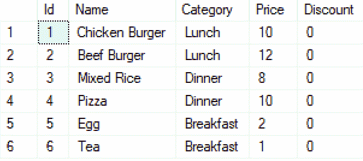
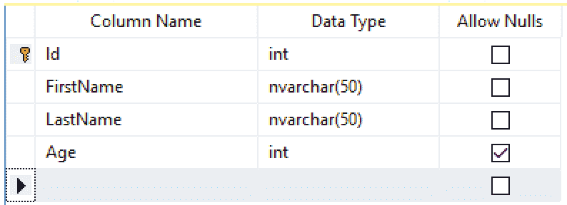
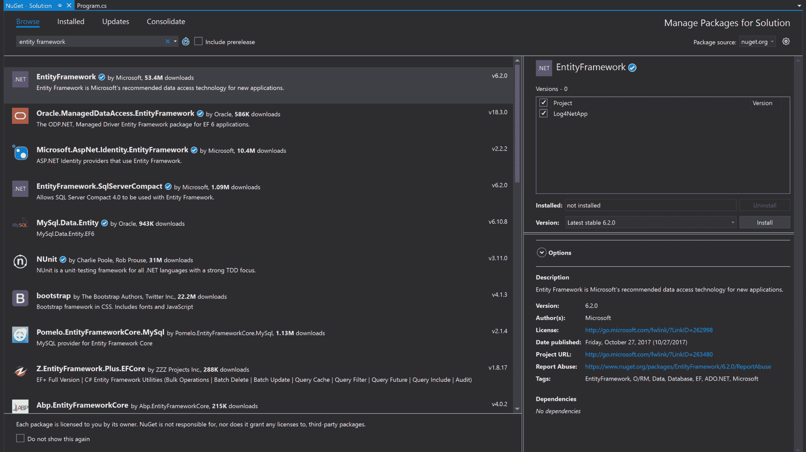

# 第十章：使用示例探索 ADO.NET

如果您有任何与 Web 开发的经验，您可能听说过 ASP.NET，这是一个用于 Web 开发的框架。同样，如果您以前在.NET 项目中使用过数据库，您应该听说过或使用过 ADO.NET。ADO.NET 是一个类似于 ASP.NET 的框架，但是与 Web 开发不同，这个框架用于与数据库相关的工作。**ActiveX Data Object**（**ADO**）是微软创建的一个旧技术，但是演变为 ADO.NET 是非凡的。ADO.NET 包含可以用于轻松与数据库管理系统（如 SQL Server 或 Oracle）建立连接的类和方法。不仅如此，它还提供了帮助在数据库中执行命令的方法和对象，比如 select、insert、update 和 delete。

我们需要一个单独的框架来进行数据库连接和活动，因为在开发应用程序时可以使用许多不同的数据库系统。数据库是应用程序的一个非常重要的部分；应用程序需要数据，数据需要存储在数据库中。由于数据库如此重要且有如此多的数据库可用，开发人员要编写所有必要的代码将会非常困难。当我们可以编写可重用的代码时，写入单独的代码片段是不值得的。这就是为什么微软推出了 ADO.NET 框架。这个框架有不同的数据提供程序、数据集、数据适配器和与数据库相关的各种其他东西。

本章将涵盖以下主题：

+   ADO.NET 的基础知识

+   `DataProvider`、`Connection`、Command、`DataReader`和`DataAdapter`

+   连接 SQL Server 数据库和 Oracle 数据库

+   存储过程

+   实体框架

+   SQL 中的事务

# ADO.NET 的基础知识

要了解 ADO.NET，我们需要知道应用程序如何与数据库交互。然后，我们需要了解 ADO.NET 如何支持这个过程。让我们先学习一些重要的概念。

# 数据提供程序

ADO.NET 中有不同类型的数据提供程序。最流行的数据提供程序是 SQL Server、**Open Database Connectivity**（**ODBC**）、**Object Linking and Embedding Database**（**OLE DB**）和**Java Database Connectivity**（**JDBC**）。这些数据提供程序具有非常相似的代码结构，这使得开发人员的生活变得更加轻松。如果您以前使用过其中一个，您将能够在不太困难的情况下使用其他任何一个。这些数据提供程序可以分为不同的组件：连接、命令、DataReader 和 DataAdapter。

# 连接对象

连接是一个组件，用于与数据库建立连接以在数据库上执行命令。无论您想连接哪个数据库，都可以使用 ADO.NET。即使没有特定的数据提供程序用于特定的数据库，您也可以使用 OLE DB 数据提供程序与任何数据库连接。这个连接对象有一个名为`connectionstring`的属性。这是连接的最重要的元素之一。`connection`字符串是一个包含数据的键值对的字符串。例如，`connection`字符串包含有关数据库所在服务器、数据库名称、用户凭据以及一些其他信息。如果数据库在同一台计算机上，您必须使用`localhost`作为服务器。`ConnectionString`包含数据库名称和授权数据，例如访问数据库所需的用户名和密码。让我们看一个 SQL Server 的`connectionString`的例子：

```cs
SqlConnection con = new SqlConnection();
Con.connectionString = "Data Source=localhost; database=testdb; Integrated Security=SSPI";
```

在这里，`Data Source`是服务器名称，因为数据库位于同一台计算机中。`connection`字符串中的`database`关键字保存了数据库的名称，在这个例子中是`testdb`。您会在一些`connection`字符串中看到`Initial Catalog`而不是`connection`字符串中的`database`关键字用于存储数据库的名称。您可以在`connection`字符串中使用`Initial Catalog`或`database`来指定数据库的名称。我们在这里的`connectionString`属性的最后一部分是`Integrated Security`，它用作身份验证。如果将其设置为`TRUE`或`SSPI`，这意味着您正在指示程序使用 Windows 身份验证来访问数据库。如果您有特定的数据库用户要使用，您可以通过在`connection`字符串中添加`user`关键字和`password`关键字来指定。您还可以提供一些其他数据，包括连接超时和连接超时。这个`connection`字符串包含了所需的最少信息。

# Command 对象

Command 对象用于向数据库发出指令。每个数据提供程序都有其自己的`command`对象，该对象继承自`DbCommand`对象。SQL 数据提供程序中的`command`对象是`SqlCommand`，而 OLE DB 提供程序具有`OleDbCommand`对象。命令对象用于执行任何类型的 SQL 语句，如`SELECT`，`UPDATE`，`INSERT`或`DELETE`。命令对象还可以执行存储过程。稍后在*使用存储过程*部分，我们将看看如何做到这一点。它们还有一些方法，用于让编译器知道我们正在执行的命令类型。例如，`ExecuteReader`方法在数据库中查询并返回一个`DataReader`对象：

```cs
using System.Data.SqlClient;
using System;
using System.Data;

public class Program
{
    public static void Main()
    {
        string connectionString = "Data source = localhost;Initial Catalog=  TestDBForBook;Integrated Security = SSPI;";
        SqlConnection conn = new SqlConnection(connectionString);
        string sql = "SELECT * FROM Person";
        SqlCommand command = new SqlCommand(sql, conn);
        conn.Open();
        SqlDataReader reader = command.ExecuteReader();
        while (reader.Read())
        {
            Console.WriteLine("FirstName " + reader[1] + " LastName " +  reader[2]);
        }
        conn.Close();
    }
}
```

输出如下：


数据库表如下所示：


`ExecuteNonQuery`是另一个主要用于执行非查询方法的方法，例如`INSERT`，`UPDATE`和`DELETE`。当您向数据库中插入一些数据时，您不会在数据库中查询任何内容，您只是想要插入数据。更新和删除也是一样。`ExecuteNonQuery`方法返回一个`INT`值，表示命令影响了数据库中多少行。例如，如果您在`Person`表中插入一个人，您将在表中插入一行新数据，因此只有一行受到影响。该方法将因此向您返回`1`。

让我们看看`ExecuteNonQuery()`方法的示例代码：

```cs
using System.Data.SqlClient;
using System;
using System.Data;
public class Program
{
    public static void Main()
    {
        string connectionString = "Data source = localhost;Initial Catalog=  TestDBForBook;Integrated Security = SSPI;";
        SqlConnection conn = new SqlConnection(connectionString);
        string sql = "INSERT INTO Person (FirstName, LastName, Age) VALUES  ('John', 'Nash', 34)";
        SqlCommand command = new SqlCommand(sql, conn);
        conn.Open();
        int rowsAffected = command.ExecuteNonQuery();
        conn.Close();
        Console.WriteLine("Number of rows inserted: " + rowsAffected);
    }
}
```

输出如下：


假设您想要更新 John Nash 先生的`Age`。当您执行`UPDATE`查询时，它将只影响表的一行，因此它将返回`1`。但是，例如，如果您执行一个条件匹配多个不同行的查询，它将更新所有行并返回受影响的总行数。看看以下示例。在这里，我们有一个`Food`表，其中有不同的食物项目。每个项目都有一个类别：


在这里，我们可以看到任何食物项目都没有折扣。假设我们现在想要在每个早餐项目上打 5%的折扣。要更改`Discount`值，您将需要执行`UPDATE`命令来更新所有行。从表中，我们可以看到表中有两个早餐项目。如果我们运行一个带有条件的`UPDATE`命令，该条件仅适用于`Category= 'Breakfast'`，它应该影响两行。让我们看看这个过程的 C#代码。我们将在这里使用`ExecuteNonQuery`命令：

```cs
using System.Data.SqlClient;
using System;
using System.Data;
public class Program
{
    public static void Main()
    {
        string connectionString = "Data source = localhost;Initial Catalog=  TestDBForBook;Integrated Security = SSPI;";
        SqlConnection conn = new SqlConnection(connectionString);
        string sql = "UPDATE Food SET Discount = 5 WHERE Category = 'Breakfast'";
        SqlCommand command = new SqlCommand(sql, conn);
        conn.Open();
        int rowsAffected = command.ExecuteNonQuery();
        conn.Close();
        Console.WriteLine("Number of rows inserted: " + rowsAffected);
    }
}
```

输出如下：


从输出中我们可以看到影响了`2`行。现在，让我们看看数据库表：



我们可以看到有两行被更改了。

如果您使用`ExecuteNonQuery`方法执行`DELETE`命令，它将返回受影响的行数。如果结果为`0`，这意味着您的命令未成功执行。

`SQLCommand`对象中还有许多其他方法。`ExecuteScalar`从查询中返回一个标量值。`ExecuteXMLReader`返回一个`XmlReader`对象。还有其他以异步方式工作的方法。所有这些方法的工作方式都类似于这里显示的示例。

命令对象中有一个名为`CommandType`的属性。`CommandType`是一个枚举类型，表示命令的提供方式。枚举值为`Text`，`StoredProcedure`和`TableDirect`。如果选择文本，SQL 命令将直接在数据源中执行为 SQL 查询。在`StoredProcedure`中，您可以设置参数并执行`storedprocedures`以在数据库中执行命令。默认情况下，值设置为`TEXT`。这就是为什么在之前的示例中，我们没有设置`CommandType`的值。

# DataReader 对象

DataReader 对象提供了一种从数据库中读取仅向前流的行的方法。与其他对象一样，DataReader 是数据提供程序的对象。每个数据提供程序都有不同的 DataReader 对象，这些对象继承自`DbDataReader`。当您执行`ExecuteReader`命令时，它会返回一个`DataReader`对象。您可以处理此`DataReader`对象以收集您查询的数据。如果您正在使用 SQL Server 作为您的数据库，您应该使用`SqlDataReader`对象。`SqlDataReader`有一个名为`Read()`的方法，当您在`DataReader`对象中有可用数据时，它将返回`true`。如果`SqlDataReader`对象中没有数据，`Read()`方法将返回`false`。首先检查`Read()`方法是否为`true`，然后读取数据是一种常见的做法。以下示例显示了如何使用`SqlDataReader`：

```cs
using System.Data.SqlClient;
using System;
using System.Data;

public class Program
{
    public static void Main()
    {
        string connectionString = "Data source = localhost;Initial Catalog=  TestDBForBook;Integrated Security = SSPI;";
        SqlConnection conn = new SqlConnection(connectionString);
        string sql = "SELECT * FROM Person";
        SqlCommand command = new SqlCommand(sql, conn);
        conn.Open();
        SqlDataReader reader = command.ExecuteReader();
        while (reader.Read())
        {
            Console.WriteLine("FirstName " + reader[1] + " LastName " +  reader[2]);
        }
        conn.Close();
    }
}
```

在这里，`command.ExecuteReader()`方法返回一个`SqlDataReader`对象，它保存了查询的结果：

```cs
SELECT * FROM Person
```

首先，我们将返回的对象保存在一个名为**reader**的变量中，它是`SqlDataReader`类型。然后，我们检查它的`Read()`方法是否为`true`。如果是，我们执行以下语句：

```cs
Console.WriteLine("FirstName " + reader[1] + " LastName " +  reader[2]);
```

在这里，读取器作为一个数组在工作，并且我们按顺序从索引中获取数据库表列的值。正如我们从数据库中的以下表结构中看到的那样，它有四列，Id，FirstName，LastName 和 Age：



这些列将依次映射。`reader[0]`指的是 Id 列，`reader[1]`指的是 FirstName 列，依此类推。

我们写的语句将打印出 FirstName 列的值，在那里它会找到`reader[1]`。然后它将打印出 LastName 列的值，在那里它会找到`reader[2]`。

如果这个数组索引对您来说很困惑，如果您想要更可读性，可以自由地使用命名索引而不是数字：

```cs
Console.WriteLine("FirstName " + reader["FirstName"] + " LastName " +  reader["LastName"])
```

这将打印相同的内容。我们没有使用`reader[1]`，而是写成了`reader["FirstName"]`，这样更清楚地表明我们正在访问哪一列。如果您使用这种方法，请确保名称拼写正确。

# DataAdapter

`DataAdapter`是从数据源读取和使用数据的另一种方式。DataAdapter 为您提供了一种直接将数据存储到数据集中的简单方法。您还可以使用 DataAdapter 将数据从数据集写回数据源。每个提供程序都有自己的 DataAdapter。例如，SQL 数据提供程序有`SqlDataAdapter`。

# 连接到各种数据库

让我们看一些使用 ADO.NET 连接到不同数据库的示例。如果使用 ADO.NET，您最有可能使用的数据库系统是 SQL Server 数据库，因为在使用 Microsoft 堆栈时这是最佳匹配。但是，如果使用其他源，也不会降低性能或遇到问题。让我们看看如何使用 ADO.NET 连接到其他数据库。

# SQL Server

要连接到 SQL Server，我们需要在 ADO.NET 中使用 SQL Server 提供程序。看一下以下代码：

```cs
using System.Data.SqlClient;
using System;
using System.Data;
public class Program
{
    public static void Main()
    {
        string connectionString = "Data source = localhost;Initial Catalog= TestDBForBook;Integrated Security = SSPI;";
        SqlConnection conn = new SqlConnection(connectionString);
        string sql = "SELECT * FROM Person";
        SqlCommand command = new SqlCommand(sql, conn);
        conn.Open();
        SqlDataReader reader = command.ExecuteReader();
        while (reader.Read())
        {
            Console.WriteLine("FirstName " + reader["FirstName"] + " LastName " +  reader["LastName"]);
        }
        conn.Close();
    }
}
```

# Oracle 数据库

要连接到 Oracle 数据库，我们需要在 ADO.NET 中使用 ODBC 提供程序。看一下以下代码：

```cs
using System.Data.SqlClient;
using System;
using System.Data;
using System.Data.Odbc;
public class Program
{
    public static void Main()
    {
        string connectionString = "Data Source=Oracle9i;User ID=*****;Password=*****;";
        OdbcConnection odbcConnection = new OdbcConnection(connectionString);
        string sql = "SELECT * FROM Person";
        OdbcCommand odbcCommand = new OdbcCommand(sql, odbcConnection);
        odbcConnection.Open();
        OdbcDataReader odbcReader = odbcCommand.ExecuteReader();
        while (odbcReader.Read())
        {
            Console.WriteLine("FirstName " + odbcReader["FirstName"] + " LastName  " + odbcReader["LastName"]);
        }
        odbcConnection.Close();
    }
}
```

# 使用 DataReaders 和 DataAdapters

`DataReaders`和`DataAdapter`是数据提供程序的核心对象。这些是 ADO.NET 提供的一些最重要的功能。让我们看看如何使用这些对象。

# DataReaders

每个提供程序都有数据读取器。在底层，所有类都执行相同的操作。`SqlDataReader`，`OdbcDataReader`和`OleDbDataReader`都实现了`IDataReader`接口。DataReader 的主要用途是在数据来自流时从数据源读取数据。让我们看看数据读取器具有的不同属性：

| **属性** | **描述** |
| --- | --- |
| `Depth` | 行的嵌套深度 |
| `FieldCount` | 返回行中的列数 |
| `IsClosed` | 如果`DataReader`已关闭，则返回`TRUE` |
| `Item` | 返回列的值 |
| `RecordsAffected` | 受影响的行数 |

DataReader 具有以下方法：

| **方法** | **描述** |
| --- | --- |
| `Close` | 此方法将关闭`DataReader`对象。 |
| `Read` | 此方法将读取`DataReader`中的下一个数据片段。 |
| `NextResult` | 此方法将将头移动到下一个结果。 |
| `GetString`，`GetChar`等 | `GetString`方法将以字符串格式返回值。`GetChar`将以`Char`格式返回值。还有其他方法将以特定类型返回值。 |

以下代码片段显示了`DataReader`的示例：

```cs
using System;
using System.Collections.Generic;
using System.Text;
using System.Data.SqlClient;
namespace CommandTypeEnumeration
{
    class Program
    {
        static void Main(string[] args)
        {
            // Create a connection string
            string ConnectionString = "Integrated Security = SSPI; " +
            "Initial Catalog= Northwind; " + " Data source = localhost; ";
            string SQL = "SELECT * FROM Customers";
            // create a connection object
            SqlConnection conn = new SqlConnection(ConnectionString);
            // Create a command object
            SqlCommand cmd = new SqlCommand(SQL, conn);
            conn.Open();
            // Call ExecuteReader to return a DataReader
            SqlDataReader reader = cmd.ExecuteReader();
            Console.WriteLine("customer ID, Contact Name, " + "Contact Title, Address ");
            Console.WriteLine("=============================");
            while (reader.Read())
            {
                Console.Write(reader["CustomerID"].ToString() + ", ");
                Console.Write(reader["ContactName"].ToString() + ", ");
                Console.Write(reader["ContactTitle"].ToString() + ", ");
                Console.WriteLine(reader["Address"].ToString() + ", ");
            }
            //Release resources
            reader.Close();
            conn.Close();
        }
    }
}

```

# DataAdapters

DataAdapters 的工作原理类似于断开连接的 ADO.NET 对象和数据源之间的桥梁。这意味着它们帮助建立连接并在数据库中执行命令。它们还将查询结果映射回断开连接的 ADO.NET 对象。Data Adapters 使用`DataSet`或`DataTable`在从数据源检索数据后存储数据。`DataAdapter`有一个名为`Fill()`的方法，它从数据源收集数据并填充`DataSet`或`DataTable`。如果要检索模式信息，可以使用另一个名为`FillSchema()`的方法。另一个名为`Update()`的方法将`DataSet`或`DataTable`中所做的所有更改传输到数据源。

使用数据适配器的好处之一是不会将有关连接、数据库、表、列或与数据源相关的任何其他信息传递给断开连接的对象。因此，在向外部源传递值时使用是安全的。

# 使用存储过程

**存储过程**是存储在数据库中以便重用的 SQL 语句批处理。ADO.NET 支持存储过程，这意味着我们可以使用 ADO.NET 调用数据库中的存储过程并从中获取结果。向存储过程传递参数（可以是输入或输出参数）是非常常见的做法。ADO.NET 命令对象具有参数，这些参数是参数类型的对象。根据提供程序的不同，参数对象会发生变化，但它们都遵循相同的基本原则。让我们看看如何在 ADO.NET 中使用存储过程而不是普通的 SQL 语句。

要使用存储过程，应在`SQLCommand`中传递的 SQL 字符串应为存储过程的名称：

```cs
string ConnectionString = "Integrated Security = SSPI;Initial Catalog=Northwind;Data source=localhost;";
SqlConnection conn = new SqlConnection(ConnectionString);
String sql = “InsertPerson”;
SqlCommand command = new SqlCommand(sql, conn);
```

我们通常按以下方式向存储过程传递参数：

```cs
using System.Data.SqlClient;
using System;
using System.Data;

public class Program
{
    public static void Main()
    {
        string ConnectionString = "Integrated Security = SSPI; Initial Catalog= Northwind; Data source = localhost; ";
        SqlConnection conn = new SqlConnection(ConnectionString);
 String sql = "InsertPerson";
 SqlCommand command = new SqlCommand(sql, conn);
 command.CommandType = CommandType.StoredProcedure;
 SqlParameter param = command.Parameters.Add("@FirstName", SqlDbType.NVarChar, 11);
 param.Value = "Raihan";
 param = command.Parameters.Add("@LastName", SqlDbType.NVarChar, 11);
 param.Value = "Taher";
 conn.Open();
 int rowsAffected = command.ExecuteNonQuery();
 conn.Close();
```

```cs

 Console.WriteLine(rowsAffected);
    }
}
```

现在让我们看一下存储过程，以了解参数的使用方式：

```cs
CREATE procedure InsertPerson (
@FirstName nvarchar (11),
@LastName nvarchar (11)
)
AS
INSERT INTO Person (FirstName, LastName) VALUES (@FirstName, @LastName);
GO
```

# 使用 Entity Framework

**Entity Framework**（**EF**）是由 Microsoft 开发的**对象关系映射器**（**ORM**）框架。它是为.NET 开发人员开发的，以便使用实体对象轻松地与数据库一起工作。它位于后端代码或业务逻辑与数据库之间。它允许开发人员使用应用程序语言 C#编写代码与数据库交互。这意味着不需要手动使用和编写 ADO.NET 代码，而我们在前面的部分中所做的。EF 具有不同类型的命令，用于普通 SQL 命令。EF 命令看起来非常类似于 C#代码，将使用后台的 SQL 与数据库通信。它可以与任何类型的数据源通信，因此您无需担心为每个 DBMS 设置或编写不同的代码。

# 在 Entity Framework 中，什么是实体？

实体是应用程序域中的一个类，也包括在派生的`DbContext`类中作为`DbSet`属性。实体在执行时被转换为表，实体的属性被转换为列：

```cs
public class Student{
}

public class StudentClass{
}

public class Teacher{
}

public class SchoolContext : DbContext {
    public SchoolContext(){}
    public DbSet<Student> Students { get; set; }
    public DbSet<StudentClass> StudentClasses { get; set; }
    public DbSet<Teacher> Teachers { get; set; }
}
```

# 不同类型的实体属性

让我们看看实体可以具有哪些不同类型的属性：

+   标量属性

+   导航属性。这些包括以下内容：

+   引用导航属性

+   集合导航属性

# 标量属性

这些属性直接在数据库中用作列。它们用于在数据库中保存和查询。让我们看一个这些属性的示例：

```cs
public class Student{
    public int StudentID { get; set; }
    public string StudentName { get; set; }
    public DateTime? DateOfBirth { get; set; }
    public byte[]  Photo { get; set; }
    public decimal Height { get; set; }
    public float Weight { get; set; }

    public StudentAddress StudentAddress { get; set; }
    public Grade Grade { get; set; }
}
```

以下属性是标量属性：

```cs
public int StudentID { get; set; }
public string StudentName { get; set; }
public DateTime? DateOfBirth { get; set; }
public byte[]  Photo { get; set; }
public decimal Height { get; set; }
public float Weight { get; set; }
```

# 导航属性

这种类型的属性表示实体之间的关系。它们与特定列没有直接关联。导航属性有两种类型：

+   **引用导航属性：**如果另一个实体类型用作属性，则称为引用导航属性

+   **集合导航属性：**如果实体被包括为集合类型，则称为集合导航属性

导航属性的一个示例如下：

```cs
public Student Student { get; set; }
public ICollection<Student> Students { get; set; }
```

在这里，`Student`是一个引用导航属性，`Students`是一个集合导航属性。

现在让我们看看使用 EF 的两种方法：**代码优先方法**和**数据库优先方法**。

# 代码优先方法

这可以被认为类似于领域驱动设计。在这种方法中，您编写实体对象和域，然后使用域使用 EF 生成数据库。使用实体对象中的不同属性，EF 可以理解要对数据库执行的操作以及如何执行。例如，如果您希望模型中的特定属性被视为主键，可以使用数据注释或流畅 API 指示 EF 在创建数据库中的表时将此列视为主键。

# 数据库优先方法

在这种方法中，您首先创建数据库，然后要求 EF 为您生成实体。您在数据库级别进行所有更改，而不是在后端应用程序中的实体中进行更改。在这里，EF 的工作方式与代码优先方法不同。在数据库优先方法中，EF 通过数据库表和列生成 C#类模型，其中每个列都被视为属性。EF 还负责不同数据库表之间的关系，并在生成的模型中创建相同类型的关系。

# 使用 Entity Framework

这两种方法都有其好处，但代码优先方法在开发人员中更受欢迎，因为您不必过多处理数据库，而是更多地在 C#中工作。

EF 不会默认随.NET 框架一起提供。您必须从 NuGet 软件包管理器下载库并将其安装在您正在使用的项目中。要下载和安装实体框架，您可以打开 Nuget 软件包管理器控制台并编写以下命令：

```cs
Install-Package EntityFramework
```

此命令将在您的项目中下载并安装 Entity Framework：


如果您不熟悉**包管理器控制台**，也可以使用 GUI 的**解决方案包管理器**窗口来安装实体框架。转到**浏览**选项卡，搜索**Entity Framework**。您将在搜索结果的顶部看到它。单击它并在您的项目中安装它。



使用 Nuget 包管理器安装 Entity Framework

在本书中，我们更专注于 C#，因此我们将更仔细地看一下代码优先方法，而不是数据库优先方法。在代码优先方法中，由于我们不会触及数据库代码，因此我们需要以一种可以在创建数据库时遵循的方式创建我们的实体对象。在创建了数据库表之后，如果我们想要更新表或更改表，我们需要使用迁移。数据库迁移会创建数据库的新实例，并在新实例中应用新的更改。通过使用迁移，更容易操作数据库。

现在让我们更多地了解一下 EF 的历史和流程。它首次发布于 2008 年，与.NET 3.5 一起。在撰写本书时，EF 的最新版本是版本 6。EF 还有一个称为**Entity Framework Core**的.NET Core 版本。这两个框架都是开源的。当您在项目中安装实体框架并编写**POCO**类（**Plain Old CLR Object**）时，该 POCO 类将被实体框架使用。首先，EF 从中创建**Entity Data Model**（**EDM**）。稍后将使用此 EDM 来保存和查询数据库。**语言集成查询**（**LINQs**）和 SQL 都可以用来向 EF 发出指令。当一个实体对象在 EDM 中使用时，它会被跟踪。当它被更新时，数据库也会被更新。

我们可以使用`SaveChanges()`方法来执行数据库中的插入、更新和删除操作。对于异步编程，使用`SaveChangesAsync()`方法。为了获得更好的查询体验，EF 具有一级缓存，因此当执行重复查询时，EF 会从缓存中返回结果，而不是去数据库中收集相同的结果。

EF API 主要做四件事：

+   将类映射到数据库模式

+   将 LINQ 转换为实体查询到 SQL 并执行它们

+   跟踪更改

+   在数据库中保存更改

EF 将实体对象和上下文类转换为 EDM，并且 EDM 在数据库中使用。例如，假设我们有以下类：

```cs
public class Person {
    public int PersonId { get; set; }
    public string FirstName { get; set; }
    public string LastName { get; set; }
}
```

EF 将其转换为 EDM，如下所示：

```cs
Table Name: Person
PersonId(PK,int,not null)
FirstName (nvarchar(50),null)
LastName (nvarchar(50),null)
```

然后，这个 EDM 将用于创建或更新`Person`数据库表。

# SQL 中的交易

事务是一个单独的工作单元，要么完成整个工作，要么回滚到其先前的状态。事务不能在工作的中间停止。这是一个非常重要的特性，用于处理敏感数据。事务的最佳用途之一是处理转账过程。当一个人向另一个人的账户转账一些钱时，如果在过程中发生任何错误，整个过程应该被取消或回滚。

SQL 中交易的四个属性：**原子、一致、隔离和持久**（**ACID**）。

# 原子

原子意味着组中的所有语句必须被执行。如果组中的语句之一没有被执行，那么没有一个语句应该被执行。整个语句组应该作为一个单一单元工作。

# 一致

当执行事务时，数据库应该从一个状态达到另一个状态。我们称初始点为起点，执行后的点为终点。在事务中，起点和终点应该是清晰的。如果事务成功，数据库状态应该在终点，否则应该在起点。保持这种一致性就是这个属性的作用。

# 隔离

作为事务一部分的一组语句应该与另一个事务或手动语句中的其他语句隔离开来。当一个事务正在运行时，如果另一个语句改变了特定的数据，整个事务将产生错误的数据。当一个事务运行时，所有其他外部语句都不被允许在数据库中运行在特定的数据上。

# 持久

一组语句执行后，结果需要存储在一个永久的位置。如果在事务中间发生错误，这些语句可以被回滚，数据库回到之前的位置。

事务在 SQL 中扮演着非常重要的角色，因此 SQL 数据提供程序提供了`SQLTransaction`类，可以用于使用 ADO.NET 执行事务。

# 总结

数据是软件应用程序的一个非常重要的部分。为了维护数据，我们需要一种数据库来以结构化的方式存储数据，以便可以轻松地检索、保存、更新和删除数据。我们的软件能够与数据源通信以使用数据是至关重要的。ADO.NET 框架为.NET 开发人员提供了这种功能。学习和理解 ADO.NET 是任何.NET 开发人员的基本要求之一。在本章中，我们涵盖了 ADO.NET 元素的基础知识，如`DataProvider`、`Connection`、`Command`、`DataReader`和`DataAdapter`。我们还学习了如何使用 ADO.NET 连接到 SQL Server 数据库和 Oracle 数据库。我们讨论了存储过程，并解释了实体框架是什么以及如何使用它。

在下一章中，我们将讨论一个非常有趣的话题：反射。
