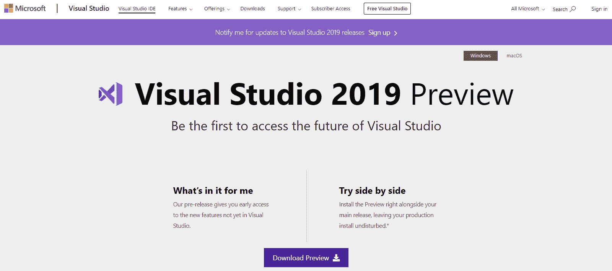
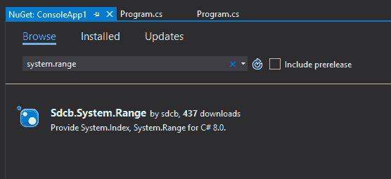

# 第十一章：C# 8 的新功能

几十年来，我们见证了各种各样的编程语言的发展。有些现在几乎已经消亡，有些被少数公司使用，而其他一些在市场上占据主导地位多年。C#属于第三类。C#的第一个版本发布于 2000 年。当 C#发布时，许多人说它是 Java 的克隆。然而，随着时间的推移，C#变得更加成熟，并开始占据市场主导地位。这尤其适用于微软技术栈，C#无疑是第一编程语言。随着每一个新版本的发布，微软都引入了令人惊叹的功能，使语言变得非常强大。

在 2018 年底，微软宣布了一些令人兴奋的功能将在 C# 8 中可用。在我写作本书时，C# 8 仍未正式发布，因此我无法保证所有这些功能将在最终版本中可用。然而，这些功能很有可能在最终版本中可用。在本章中，我们将看看这些功能，并试图理解语言如何演变成一个非凡的编程语言。让我们来看看我们将要讨论的功能：

+   可空引用类型

+   异步流

+   范围和索引

+   接口成员的默认实现

+   Switch 表达式

+   目标类型的新表达式

# 环境设置

要执行本章的代码，你需要**Visual Studio 2019**。在我写作本书时，Visual Studio 2019 尚未正式发布。然而，预览版本已经可用，要执行本章的代码，你至少需要 Visual Studio 2019 预览版。另一件需要记住的事情是，在测试本章的代码时，要创建**.NET Core**控制台应用程序项目。

要下载 Visual Studio 2019 预览版，请访问此链接：[`visualstudio.microsoft.com/vs/preview/`](https://visualstudio.microsoft.com/vs/preview/)。



Visual Studio 2019 预览下载页面

# 可空引用类型

如果你在编写 C#代码时曾遇到异常，很可能是空引用异常。空引用异常是程序员在开发应用程序时最常见的异常之一，因此 C#语言开发团队努力使其更易于理解。

在 C#中，有两种类型的数据：**值类型**和**引用类型**。当你创建值类型时，它们通常有默认值，而引用类型默认为 null。Null 意味着内存地址不指向任何其他内存地址。当程序试图查找引用但找不到时，会抛出异常。作为开发人员，我们希望发布无异常的软件，因此我们尽量在代码中处理所有异常；然而，有时在开发应用程序时很难找到空引用异常。

在 C# 8 中，语言开发团队提出了可空引用类型的概念，这意味着你可以使引用类型可空。如果这样做，编译器将不允许你将 null 赋给非可空引用变量。如果你使用 Visual Studio，当你尝试将 null 值赋给非可空引用变量时，你也会收到警告。

由于这是一个新功能，不在旧版本的 C#中可用。C#编程语言团队提出了通过编写一小段代码来启用该功能的想法，以便旧系统不会崩溃。你可以为整个项目或单个文件启用此功能。

要在代码文件中启用可空引用类型，你必须在源代码顶部放置以下代码：

```cs
#nullable enable

```

让我们看一个可空引用类型的例子：

```cs
class Hello {
    public string name;
    name = null;
    Console.WriteLine($"Hello {name}");
}
```

如果你运行上面的代码，当尝试打印该语句时会得到一个异常。尝试使用以下代码启用可空引用类型：

```cs
#nullable enable

class Hello {
    public string name;
    name = null;
    Console.WriteLine($"Hello {name}");
}
```

上面的代码会显示一个警告，指出名称不能为空。为了使其可行，你必须将代码更改如下：

```cs
#nullable enable

class Hello {
    public string? name;
    name = null;
    Console.WriteLine($"Hello {name}");
}
```

通过将字符串名称更改为`nullable`，你告诉编译器可以将该字段设置为可空。

# 异步流

如果你在 C#中使用异步方法，你可能会注意到返回流是不可能的，或者很难通过现有的特性实现。然而，这将是一个有用的特性，可以使开发任务变得更简单。这就是为什么 C# 8 引入了一个新的接口叫做`IAsyncEnumerable`。通过这个新的接口，可以返回异步数据流。让我再详细解释一下。

在异步流之前，在 C#编程语言中，异步方法不能返回数据流，它只能返回单个值。

让我们看一个不使用异步流的代码示例：

```cs
using System;
using System.Collections.Generic;
using System.Linq;
using System.Text;
using System.Threading.Tasks;
namespace ExploreVS
{
 class Program
 {
 public static void Main(string[] args)
 {
 var numbers = GetNumbersAsync();
 foreach(var n in GetSumOfNums(numbers))
 {
 Console.WriteLine(n);
 }
 Console.ReadKey();
 }
 public static IEnumerable<int> GetNumbersAsync()
 {
 List<int> a = new List<int>();
 a.Add(1);
 a.Add(2);
 a.Add(3);
 a.Add(4);
 return a;
 }
 public static IEnumerable<int> GetSumOfNums(IEnumerable<int> nums)
 {
 var sum = 0;
 foreach(var num in nums)
 {
 sum += num;
 yield return sum;
 }
 }

 }
}
```

通过异步流，现在可以使用`IAsyncEnumerable`返回数据流。让我们看一下下面的代码：

```cs
using System;
using System.Collections.Generic;
using System.Linq;
using System.Text;
using System.Threading.Tasks;
namespace ExploreVS
{
 class Program
 {
 public static async void Main(string[] args)
 {
 var numbers = GetNumbersAsync();
 await foreach(var n in GetSumOfNums(numbers))
 {
 Console.WriteLine(n);
 }
 Console.ReadKey();
 }
 public static IEnumerable<int> GetNumbersAsync()
 {
 List<int> a = new List<int>();
 a.Add(1);
 a.Add(2);
 a.Add(3);
 a.Add(4);
 return a;
 }
 public static async IAsyncEnumerable<int> GetSumOfNums(IAsyncEnumerable<int> nums)
 {
 var sum = 0;
 await foreach(var num in nums)
 {
 sum += num;
 yield return sum;
 }
 }

 }
}
```

从上面的例子中，我们可以看到如何使用 C#的这个新特性来返回异步流。

# 范围和索引

C# 8 带来了范围，它允许你获取数组或字符串的一部分。在此之前，如果你想要获取数组的前三个数字，你必须遍历数组并使用条件来找出你想要使用的值。让我们看一个例子：

```cs
using System;
namespace ConsoleApp6
{
    class Program
    {
        static void Main(string[] args)
        {
            var numbers = new int[] { 1, 2, 3, 4, 5 };
            foreach (var n in numbers)
            {
                if(numbers[3] == n) { break; } 
                Console.WriteLine(n);
            }
            Console.ReadKey();
        }
    }
}
```

通过范围，你可以轻松地切片数组并获取你想要的值，就像下面的代码所示：

```cs
using System;
namespace ConsoleApp6
{
 class Program
 {
 static void Main(string[] args)
 {
 var numbers = new int[] { 1, 2, 3, 4, 5 };
 foreach (var n in numbers[0..3])
 {
 Console.WriteLine(n);
 }
 Console.ReadKey();
 }
 }
}
```

在上面的例子中，我们可以看到在`foreach`循环中给出了一个范围(`[0..3]`)。这意味着我们应该只取数组中索引 0 到索引 3 的值。

还有其他切片数组的方法。你可以使用`^`来表示索引应该向后取值。例如，如果你想要获取从第二个元素到倒数第二个元素的值，你可以使用`[1..¹]`。如果你应用这个范围，你将得到`2, 3, 4`。

让我们看一下下面的代码中范围的使用：

```cs
using System;
namespace ConsoleApp6
{
 class Program
 {
 static void Main(string[] args)
 {
 var numbers = new int[] { 1, 2, 3, 4, 5 };
 foreach (var n in numbers[1..¹])
 {
 Console.WriteLine(n);
 }
 Console.ReadKey();
 }
 }
}
```

当运行上面的代码时，你需要在你的项目中使用一个特殊的 Nuget 包。这个包的名称是`Sdcb.System.Range`。要安装这个包，你可以在 Visual Studio 中的 Nuget 包管理器中安装它。



安装 Sdcb.System.Range Nuget 包

如果你仍然遇到构建错误，有可能是你的项目仍在使用 C# 7，要升级到 C# 8，你可以将鼠标悬停在被红色下划线标记的地方，然后点击弹出的灯泡。然后，Visual Studio 会询问你是否要在你的项目中使用 C# 8。你需要点击“将此项目升级到 C#语言版本'8.0 *beta*'”。这将把你的项目从 C# 7 升级到 C# 8，然后你就可以运行你的代码了。


图：将项目升级到 C# 8

# 接口成员的默认实现

我们都知道，在 C#中，接口没有任何方法实现；它们只包含方法签名。然而，在 C# 8 中，接口允许有实现的方法。如果需要，这些方法可以被类重写。接口方法也可以访问修饰符，比如 public、virtual、protected 或 internal。默认情况下，访问级别被设置为 virtual，除非它被固定为 sealed 或 private。

还有一件重要的事情要注意。接口中还不允许使用属性或字段。这意味着接口方法不能在方法中使用任何实例字段。接口方法可以接受参数作为输入并使用它们，但不能使用实例变量。让我们看一个接口方法的例子：

```cs
using System;
namespace ConsoleApp7
{
 class Program
 {
 static void Main(string[] args)
 {
 IPerson person = new Person();
 person.PrintName("John", "Nash");
 Console.ReadKey();
 }
 }
 public class Person : IPerson
 {
 }
 public interface IPerson
 {
 public void PrintName(string FirstName, string LastName)
 {
 Console.WriteLine($"{FirstName} {LastName}");
 }
 }
}
```

在撰写本书时，这个功能在 C# 8 预览版本中还不可用。这仍然被标记为一个拟议的功能，但希望它会在最终发布中实现。因此，即使您使用 Visual Studio 2019 预览版本，上面给出的代码可能也无法工作。

# Switch 表达式

多年来，我们一直在使用 switch 语句。每当我们想到或听到 switch 时，我们会想到 case 和 break。然而，C# 8 将通过引入 switch 表达式来迫使我们改变这种思维方式。这意味着 switch 语句将不再与过去一样。

让我们看看我们以前的`switch`语句是什么样子的：

```cs
using System;
namespace ConsoleApp7
{
    class Program
    {
        static void Main(string[] args)
        {
            string person = "nash";
            switch (person)
            {
                case "john":
                    Console.WriteLine("Hi from john!");
                    break;
                case "smith":
                    Console.WriteLine("Hi from smith!");
                    break;
                case "nash":
                    Console.WriteLine("Hi from nash!");
                    break;
                case "harrold":
                    Console.WriteLine("Hi from harrold!");
                    break;
                default:
                    Console.WriteLine("Hi from None!");
                    break;
            }
            Console.ReadKey();
        }
    }
}
```

通过新的方法，我们不会在`switch`后面将`person`放在括号中，而是将`switch`放在`person`变量的右侧，不需要`case`关键字。让我们看看我们如何以新的方式使用`switch`表达式：

```cs
{
 "john" j => Console.WriteLine("Hi from john!"),
 "smith" s => Console.WriteLine("Hi from smith!"),
 "nash" n => Console.WriteLine("Hi from nash!"),
 "harrold" h => Console.WriteLine("Hi from harrold!"),
 _ => Console.WriteLine("Hi from None!")
};
```

在这里，我们还可以看到，对于默认情况，我们只使用下划线(`_`)。

# 目标类型的新表达式

在 C# 8 中，另一个新功能是目标类型的新表达式。这个功能将使代码赋值更加清晰。让我们从一个示例代码开始，我们在其中创建了一个带有值的字典：

```cs
person switch
Dictionary<string, List<int>> student = new Dictionary<string, List<int>> {
   { "john", new List<int>() { 98, 75 } }
};
```

有了目标类型的新表达式，前面的代码可以这样写：

```cs
Dictionary<string, List<int>> student = new() {
   { "john", new() { 98, 75 } }
};
```

当您放置`new()`时，变量将采用左侧的类型并创建一个新的实例。

# 总结

每当微软宣布推出新版本的 C#编程语言时，我都会对他们带来了什么感到兴奋，而每一次，我都对结果感到印象深刻。C# 8 也不例外。特别是可空引用类型是一个令人惊叹的功能，因为它可以防止一个非常常见的异常。异步流是另一个很棒的功能，特别适用于物联网的开发。范围、接口成员、switch 表达式以及其他所有的新增功能都是朝着重大进步迈出的小步。这些新功能使开发人员的生活变得更加轻松，并通过减少软件崩溃为企业带来了好处。在下一章中，我们将讨论设计原则和不同的设计模式。
