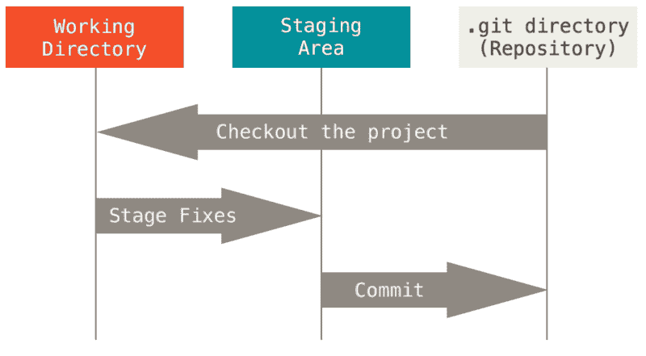
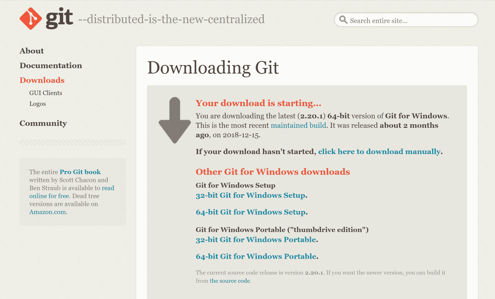
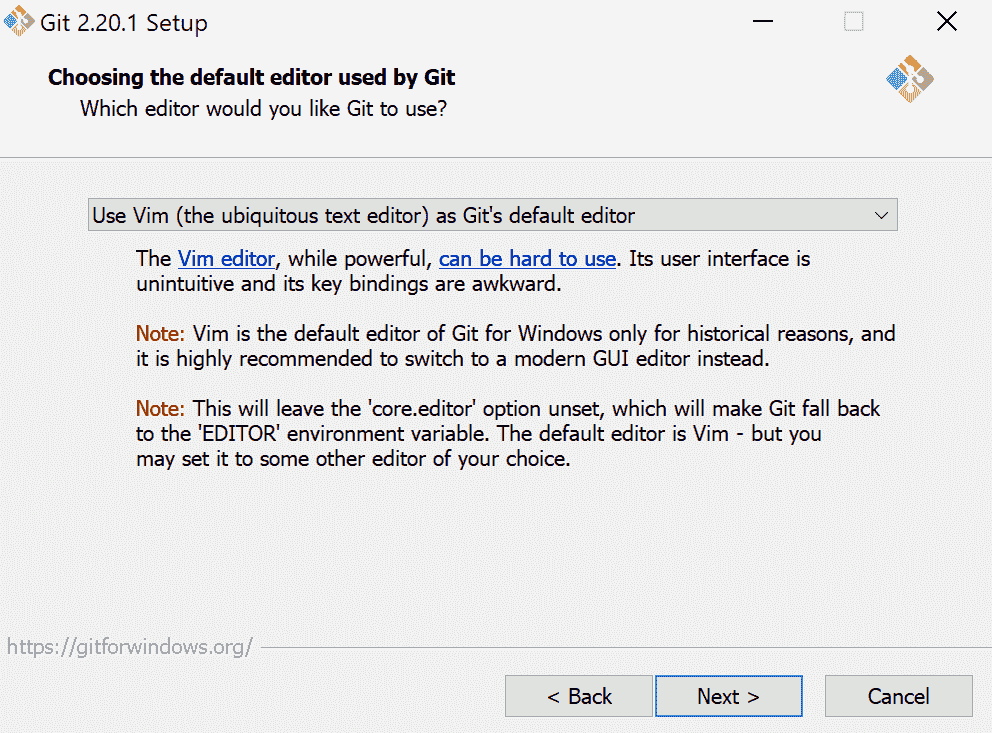
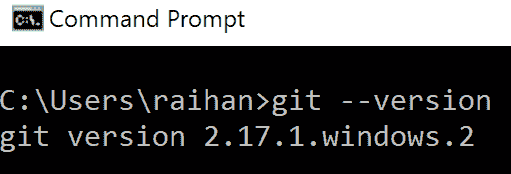
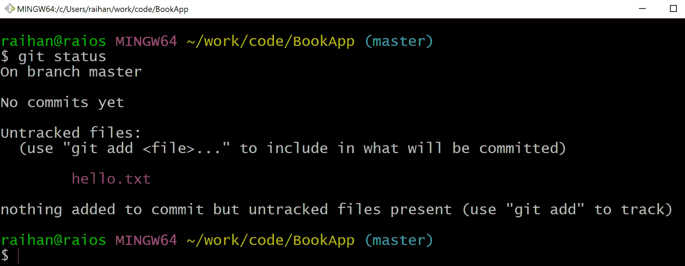
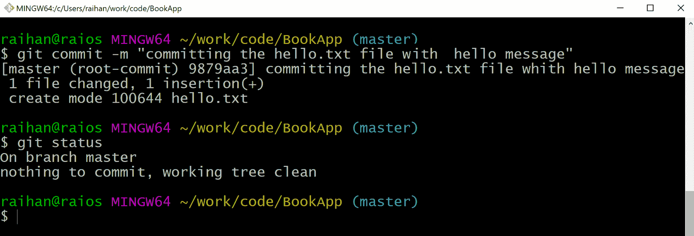
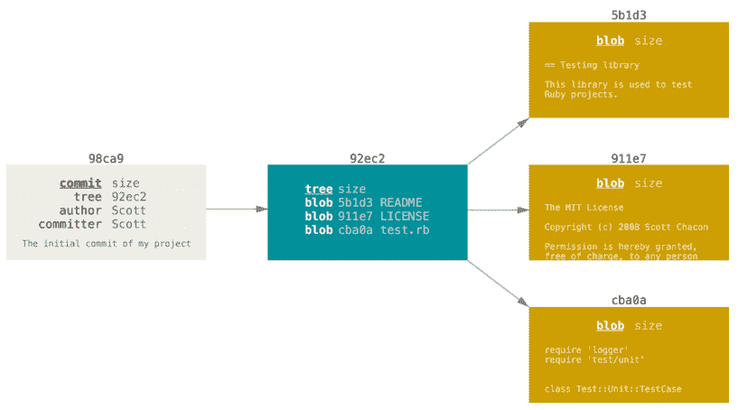
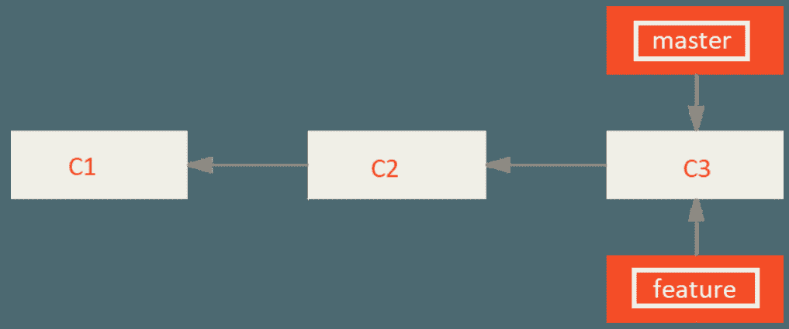

# 第十六章：Git - 版本控制系统

如今，软件开发已经达到了一个新的水平。它不再仅仅涉及编写代码——软件开发人员现在还必须熟悉一系列重要的工具。没有这些工具，要在团队中工作或高效工作就变得非常困难。版本控制就是其中之一。在众多可用的版本控制系统中，Git 是最流行和最强大的。Git 版本控制已经在行业中存在了相当长的时间，但最近已经成为几乎所有软件公司的一部分。了解 Git 现在对开发人员来说是必不可少的。在本章中，我们将学习关于 Git 版本控制系统的知识。让我们来看看我们将要涵盖的主题：

+   什么是版本控制系统？

+   Git 的工作原理

+   在 Windows 中安装 Git

+   Git 的基础知识

+   Git 中的分支

# 什么是版本控制？

版本控制系统是在开发过程中跟踪软件代码更改的系统或应用程序。软件开发人员过去会通过将代码复制到另一个文件夹或机器中来保留他们的代码备份。如果开发人员或生产机器崩溃，他们可以从备份中取出代码并运行。然而，手动保留和维护备份是麻烦的，容易出错，并且备份系统容易受损。因此，开发人员开始寻找一个能够保护他们代码的系统或应用程序。

版本控制在多个程序员一起工作的情况下也很有用。过去，程序员必须要么在不同的文件上工作以避免冲突，要么在一段时间后仔细地合并代码。手动合并代码是非常危险和耗时的。

在版本控制系统中，代码文件中的每个更改实际上都是代码的一个新版本。在软件行业中，有许多版本控制系统可用，包括 Git、Subversion、Mercurial 和 Perforce。Git 是最流行的版本控制系统，由软件开发者 Linus Torvalds 开发。它是一个非常出色的应用程序，现在几乎在世界上的每个软件公司中使用。

# Git 的工作原理

Git 的主要任务是跟踪代码版本并允许开发人员在必要时返回到任何以前的状态。这是通过对每个版本进行快照并在本地文件存储系统中维护来完成的。与其他系统不同，Git 使用本地文件存储来存储快照，这意味着即使没有互联网连接，也可以在本地使用 Git。有了本地版本的 Git，你几乎可以做任何你可以在连接互联网的 Git 版本中做的事情。

在你的项目中安装 Git 之后，你可以选择你的文件系统中想要保留在 Git 版本控制下的目录。通常，Git 中的一个项目或目录被称为**仓库**。一个仓库可能包含不同的项目，一个项目，或者只是一些项目文件，这取决于你想要在 Git 版本控制中保留什么。你可以有两种方式在本地机器上拥有一个 Git 仓库。你可以自己初始化一个 Git 仓库，或者你可以从远程服务器克隆一个仓库。无论哪种方式，你都会在创建或克隆仓库的同一个文件夹中创建一个名为`.git`的文件夹。这个`.git`文件是本地存储文件，所有与该仓库相关的信息都将存储在那里。Git 以非常高效的方式存储数据，因此即使有大量的快照，文件也不会变得很大。

Git 中有三种主要状态，我们将在接下来的章节中探讨：

+   修改

+   暂存

+   提交

# 修改

当您初始化了一个 Git 仓库，然后添加一个新文件或编辑一个现有文件时，该特定文件将在 Git 中标记为已修改。这意味着该文件包含了 Git 在其本地存储/数据库中已存储的快照中的一些更改。例如，如果您在 Git 仓库中创建一个 C#控制台应用程序项目，那么该解决方案的所有文件都将被标记为已修改，因为它们都不在 Git 仓库历史记录中。

# 暂存

在 Git 中，暂存指的是准备提交的文件。为了防止不需要的文件意外提交到 Git 存储库中，Git 在已修改和已提交之间引入了这一步骤。当您将文件标记为已暂存时，这意味着您希望在下一次提交中提交这些文件。这也为您提供了编辑文件并不使其处于已暂存状态的选项，以便更改不会保存在存储库中。如果您想在本地机器上应用一些配置，但不希望这些更改出现在存储库中，这个功能非常方便。

# 已提交

已提交状态是指文件的一个版本已保存在本地数据库中。这意味着已经拍摄并存储在 Git 历史记录中以供将来参考。在远程处理存储库时，您将推送的代码实际上只是已提交的代码。

让我们看一下下面的图表，以了解这些状态之间的流程：



# 在 Windows 上安装 Git

Git 最初是为基于 Linux 或 Unix 的操作系统开发的。当它在流行度上升并且 Windows 用户开始要求 Git 时，推出了 Git for Windows。在 Windows 上安装 Git 现在是一个非常简单的过程。要安装 Git，请转到[`git-scm.com/download/win`](https://git-scm.com/download/win)。

您将被带到以下截图所示的页面：



Git for Windows 应该会自动开始下载。如果没有开始，您可以点击网站上给出的链接。下载文件将是一个可执行文件，因此要开始安装，请执行可执行文件。在安装过程中，如果您不确定选择什么，这里最好的选择是保持一切默认。

以下截图显示了可以安装哪些组件：


有一个部分可以选择用于 Git 的默认编辑器。所选择的默认编辑器是 Vim，如下截图所示。如果您不习惯使用 Vim，可以将其更改为您喜欢的编辑器：



按照步骤。安装 Git 后，要测试安装是否成功，请转到命令行或 PowerShell 并输入以下内容：

```cs
git --version
```

您应该看到类似以下的输出：



如果您能看到版本号，这意味着安装成功了。

# Git 的基础知识

如前所述，Git 最初是为 Linux 系统开发的，这就是为什么使用这个工具的主要方式是通过命令行。在 Windows 上，我们不像 Linux 或 Unix 用户那样经常使用命令行，但使用它可以让您访问 Git 的所有功能。对于 Windows，有一些 GUI 工具可以用于 Git 操作，但它们通常有一些限制。由于命令行是 Git 的首选方法，因此本书中只涵盖命令行命令。

# Git 配置

`git config`命令是用于配置 Git 设置的命令。Git 的最小设置是设置用户名和电子邮件地址。您可以为每个 Git 仓库单独配置，也可以全局配置设置。如果您全局设置配置，您就不必每次初始化 Git 仓库时都配置电子邮件地址和用户名。如果有必要，您可以在每个仓库中覆盖这些设置。

要配置您的电子邮件地址和用户名，请运行以下命令：

```cs
git config user.name = "john"
git config user.email = "john@example.com"
```

如果您想要全局设置配置，您需要添加`--global`关键字，如下所示：

```cs
git config --global user.name = "john"
git config --global user.email = "john@example.com"
```

如果您想查看其他全局配置设置的可用性，可以使用以下命令：

```cs
git config --list
```

然后您可以更改您想要更改的设置。

# Git 初始化

如果您有一个当前尚未使用 Git 版本控制的项目，可以使用以下命令初始化项目：

```cs
git init
```

当您运行上述命令时，您在计算机上安装的 Git 程序会在项目目录中创建一个`.git`目录，并开始跟踪该项目的源代码。在新项目中初始化 Git 后，所有文件都显示为已修改，您必须将这些文件暂存以提交这些更改。

# Git 克隆

如果您想要使用位于远程服务器上的项目，您必须克隆该项目。要克隆项目，您必须使用以下命令：

```cs
git clone [repo-url]
```

例如，如果您想要克隆 Angular 项目，您必须输入以下内容：

```cs
git clone https://github.com/angular/angular.git
```

当您将存储库克隆到本地环境时，将下载`.git`文件夹。这包括提交历史、分支、标签和远程服务器中包含的所有其他信息。基本上是远程服务器版本的副本。如果您在本地副本中提交更改，然后将其推送到远程存储库，则您的本地副本将与远程副本同步。

# Git 状态

在工作时，您会想要检查当前代码的状态。这意味着找出哪些文件被修改了，哪些文件被暂存了。您可以使用以下命令获取所有这些信息：

```cs
git status
```

让我们来看一个例子。如果我们向项目中添加一个名为`hello.txt`的新文件，并且该文件被 Git 跟踪，并检查其状态，我们将看到如下内容：



在这里，我们可以看到一个名为`hello.txt`的文件位于`未跟踪`文件下，这意味着该文件尚未被 Git 跟踪。`git status`命令还会告诉您当前所在的分支。在这种情况下，我们在`master`分支中。

# Git 添加

`git add`命令是一个将修改的文件/文件夹添加到 Git 跟踪系统的命令。这意味着这些文件和文件夹将被暂存。命令如下：

```cs
git add <file-name/folder-name>
```

让我们继续我们的例子，看看当我们在 Git 中添加`hello.txt`文件时会发生什么。为此，我们将执行以下命令：

```cs
git add hello.txt
```

输出如下：


在这里，我们看到了关于**换行符**（**LF**）和**回车换行符**（**CR+LF**）的警告，这些是某种格式。替换的原因是我们在这里使用的是 Windows 操作系统，但目前我们不需要担心这个问题。这里的重点是文件已经被正确暂存。现在，如果我们检查状态，我们将看到以下内容：


在这里，我们可以看到`hello.txt`文件被放置在`要提交的更改`部分。这意味着该文件已经被暂存。

在一个真实的项目中，您可能会在暂存文件之前同时处理多个不同的文件。逐个添加文件或者用逗号分隔的方式写入文件名可能会非常繁琐。如果您希望将所有修改过的文件都暂存，可以使用以下命令将所有文件添加到暂存区域：

```cs
git add *
```

# Git 提交

`git commit`命令用于将代码提交到 Git 历史记录中。这意味着对代码基础进行快照，并将其存储在 Git 数据库中以供将来参考。要提交文件/文件夹，您必须使用以下命令：

```cs
git commit
```

如果执行上述代码，将打开为 Git 设置的默认编辑器，并要求您输入提交的消息。还有一种更简洁的方法。如果要直接输入提交的消息，可以运行以下命令：

```cs
git commit -m "your message"
```

现在让我们提交我们的`hello.txt`文件到我们的 Git 存储库。为此，我们将运行以下命令：

```cs
git commit -m "committing the hello.txt file with hello message" 
```

输出应如下屏幕截图所示：


成功提交后，将看到`1 file changed, 1 insertion(+)`。如果再次检查状态，将看到没有要提交的内容，如下面的屏幕截图所示：



# Git log

要检查存储库中进行了哪些提交，可以使用以下命令：

```cs
git log
```

输出将如下所示：


从日志中，我们可以看到目前只有一个提交。我们可以看到提交的哈希值，即紧跟在`commit`后面的数字。我们可以看到`commit`是由`Raihan Taher`在`master`分支上进行的。我们还可以在日志中看到`commit`的消息。这是一个非常有用的命令，可以检查已提交了什么。

# Git remote

`git remote`命令用于查看是否与远程存储库建立了连接。如果运行以下命令，将显示远程存储库的名称。通常，远程名称设置为`Origin`。您可以有多个远程存储库。让我们看看这个命令：

```cs
git remote
```

如果我们执行此命令，将看不到任何内容，因为还没有远程存储库，如下面的屏幕截图所示：


让我们添加一个远程存储库。我们将使用 GitHub 作为我们的远程服务器。在 GitHub 上创建存储库后，我复制了该存储库的 URL。我们将把它添加到我们的本地存储库。为此，我们使用以下命令：

```cs
git remote add <remote-name> <repository-link-remote>
```

在我们的示例中，命令如下：

```cs
git remote add origin https://github.com/raihantaher/bookgitexample.git
```

添加了远程存储库后，如果执行`git remote`，将看到`origin`被列为远程存储库，如下面的屏幕截图所示：


如果要查看有关远程存储库的更多详细信息，可以执行以下命令：

```cs
git remote -v
```

这将显示您添加的远程存储库的 URL，如下面的屏幕截图所示：


# Git push

当您想要将本地提交上传或推送到远程服务器时，可以使用以下命令：

```cs
git push <remote-repo-name> <local-branch-name>
```

以下是如何使用此命令的示例：

```cs
git push origin master
```

执行此命令后，如果推送成功，将看到以下消息：


# Git pull

`git pull`命令用于从远程存储库获取最新的代码。由于 Git 是一个分布式版本控制系统，多人可以在一个项目上工作，所以有可能其他人已经用最新的代码更新了远程服务器。要访问最新的代码，请运行以下命令：

```cs
git pull <remote-repo-name> <local-branch-name>
```

以下是如何使用此代码的示例：

```cs
git pull origin master
```

如果运行此代码，将弹出以下消息：


这意味着我们的本地存储库与远程存储库保持同步。如果远程存储库中有新的提交，`git pull`命令将把这些更改拉到我们的本地存储库，并指示已拉取更改。

# Git fetch

`git fetch`命令与`git pull`命令非常相似，但是当您使用`git fetch`时，代码将从远程存储库获取到本地存储库，但不会与您的代码合并。在检查了远程代码后，如果您想要将其与本地代码合并，您必须显式运行`git merge`命令。执行此操作的命令如下：

```cs
git fetch <remote-repo>
```

如果您运行上述命令，远程存储库中的所有分支将被更新。如果您指定一个本地分支，只有该分支将被更新：

```cs
git fetch <remote-repo> <local-branch>
```

让我们尝试在我们的示例代码中执行`git fetch`命令：

```cs
git fetch origin master
```

您将看到以下输出：


# 在 Git 中分支

分支通常被认为是 Git 的最佳功能之一。分支使 Git 与所有其他版本控制系统不同。它非常强大且易于使用。在我们学习不同的分支命令之前，让我简要解释一下 Git 如何处理提交，因为这将帮助您理解 Git 分支。在 Git 中，我们已经知道每个提交都有一个唯一的哈希值，并且该哈希值存储在 Git 数据库中。使用哈希值，每个提交都存储了先前提交的哈希值，这被称为该提交的父提交。除此之外，还存储了另一个哈希值，该哈希值存储了在该提交上暂存的文件，以及提交消息和提交者和作者的信息。对于存储库的第一个提交，父提交为空。

以下图显示了 Git 中哈希的示例：



我们将提交中的所有信息称为快照。如果我们做了三次提交，我们可以说我们有**快照 A**，**快照 B**和**快照 C**，如下图所示，依次排列：


默认情况下，当您初始化本地 Git 存储库时，会创建一个名为`master`的分支。这是大多数开发人员将其视为 Git 树中的主要分支的分支。这是可选的；您可以将任何分支视为主分支或生产分支，因为所有分支具有相同的能力和功能。如果您从**快照 C**（**提交 3**或**C3**简称）创建一个名为`feature`的分支，分支将从**C3**（**提交 3**）开始，并且测试分支上的下一个提交将将 C3 视为父提交。

以下图显示了分支：



**HEAD**是一个指向活动提交或分支的指针。这对开发人员以及 Git 版本控制是一个指示器。当您进行新的提交时，HEAD 将移动到最新的提交，因为这是将作为下一个提交的父提交创建的快照。

# 创建分支

现在让我们来看一下在 Git 中创建分支的命令。创建分支非常容易，因为它不会将整个代码库复制到一个新的位置，而是只保持与 Git 树的关系。有几种创建分支的方法，但最常见的方法如下：

```cs
git branch feature
```

在命令行上应该如下所示：


# 查看可用分支

要查看本地 Git 存储库中有哪些分支可用，可以输入以下命令：

```cs
git branch
```

执行上述代码后，您应该看到以下输出：


我们可以看到我们的本地存储库中有两个分支。一个是`master`分支，另一个是`feature`分支。`*`字符表示 HEAD 指向的位置。

# 切换分支

在前面的示例中，我们看到，即使创建了 feature 分支，HEAD 仍然指向 master。切换到另一个分支的命令如下：

```cs
git checkout <branch-name>
```

在我们的示例中，如果我们想从`master`切换到`feature`分支，我们必须输入以下命令：

```cs
git checkout feature
```

输出如下：


运行命令后，我们可以看到 Git 已经切换到了`feature`分支。现在我们可以再次运行`git branch`命令来查看 HEAD 指向的位置，如下截图所示：


很可能，当你创建一个分支时，你会想立即在该分支上工作，所以有一个快捷方式可以创建一个分支然后切换到它，如下代码所示：

```cs
git checkout -b newFeature
```

# 删除一个分支

要删除一个分支，你需要执行以下命令：

```cs
git branch -d feature
```

如果分支成功删除，你应该会看到类似下面截图中显示的消息：


# 在 Git 中合并

合并一个分支到另一个分支，你需要使用`merge`命令。记住，你需要在你要将代码合并的分支上执行该命令，而不是在将要被合并的分支上，或者其他任何分支上。命令如下：

```cs
git merge newFeature
```

输出应该如下：


# 总结

在本章中，我们学习了一个与 C#编程语言不直接相关，但对 C#开发人员来说仍然是一个必不可少的工具的概念。微软最近收购了 GitHub，这是基于 Git 的最大远程代码仓库网站，并将大多数微软的 IDEs/编辑器与之集成，包括最新的代码编辑器 Visual Code。这显示了 Git 对我们行业有多么重要。我相信每个开发人员，无论是新手还是资深人员，都应该为他们的代码使用版本控制。如果你不使用 Git，你可以使用市场上的任何其他版本控制系统。然而，Git 是最好的，即使你在工作中没有使用 Git，我也建议你在个人项目中使用它。Git 命令非常简单，所以你只需要练习几次就能完全理解它。

下一章有点不同。我们将看一些在面试中常被问到的问题。
