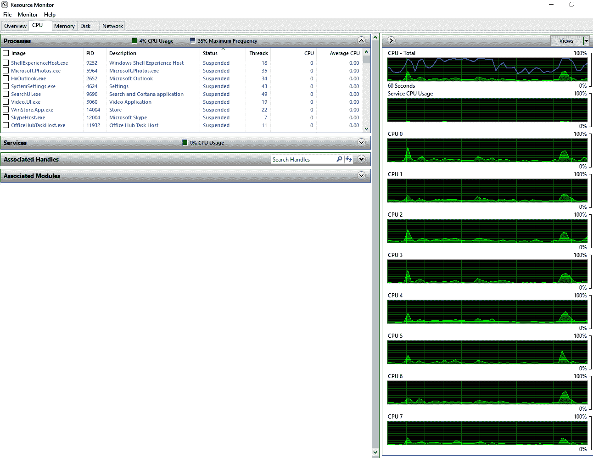
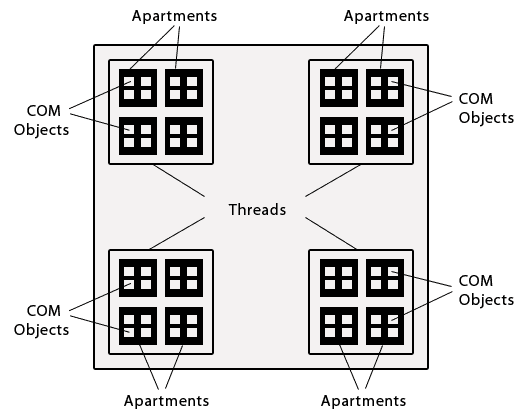
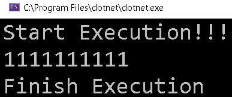
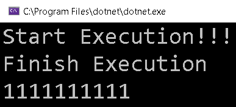
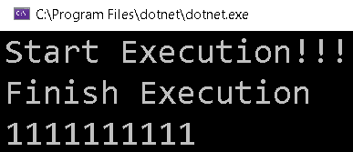
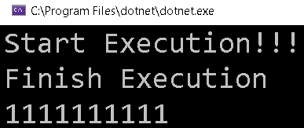

# 第一章：并行编程简介

自.NET 开始就支持并行编程，并自.NET 框架 4.0 引入**任务并行库**（**TPL**）以来，它已经获得了牢固的基础。

多线程是并行编程的一个子集，也是编程中最不被理解的方面之一；许多新开发人员很难理解。C#自诞生以来已经发生了很大的变化。它不仅对多线程有很强的支持，还对异步编程有很强的支持。C#的多线程可以追溯到 C# 1.0。C#主要是同步的，但从 C# 5.0 开始增加了强大的异步支持，使其成为应用程序程序员的首选。而多线程只涉及如何在进程内并行化，而并行编程还涉及进程间通信的场景。

在 TPL 引入之前，我们依赖于`Thread`、`BackgroundWorker`和`ThreadPool`来提供多线程能力。在 C# v1.0 时，它依赖于线程来分割工作并释放**用户界面**（**UI**），从而使用户能够开发响应式应用程序。这个模型现在被称为经典线程。随着时间的推移，这个模型为另一个编程模型让路，称为 TPL，它依赖于任务，并且在内部仍然使用线程。

在本章中，我们将学习各种概念，这些概念将帮助您从头开始学习编写多线程代码。

我们将涵盖以下主题：

+   多核计算的基本概念，从介绍与**操作系统**（**OS**）相关的概念和进程开始。

+   线程以及多线程和多任务之间的区别

+   编写并行代码的优缺点以及并行编程有用的场景

# 技术要求

本书中演示的所有示例都是在使用 C# 8 的 Visual Studio 2019 中创建的。所有源代码都可以在 GitHub 上找到：[`github.com/PacktPublishing/Hands-On-Parallel-Programming-with-C-8-and-.NET-Core-3/tree/master/Chapter01`](https://github.com/PacktPublishing/Hands-On-Parallel-Programming-with-C-8-and-.NET-Core-3/tree/master/Chapter01)。

# 为多核计算做准备

在本节中，我们将介绍操作系统的核心概念，从进程开始，线程所在和运行的地方。然后，我们将考虑随着硬件能力的引入，多任务处理是如何演变的，这使得并行编程成为可能。之后，我们将尝试理解使用代码创建线程的不同方式。

# 进程

通俗地说，*进程*一词指的是正在执行的程序。然而，在操作系统方面，进程是内存中的地址空间。无论是 Windows、Web 还是移动应用程序，每个应用程序都需要进程来运行。进程为程序提供安全性，防止其他在同一系统上运行的程序意外访问分配给另一个程序的数据。它们还提供隔离，使得程序可以独立于其他程序和底层操作系统启动和停止。

# 有关操作系统的更多信息

应用程序的性能在很大程度上取决于硬件的质量和配置。这包括以下内容：

+   CPU 速度

+   RAM 的数量

+   硬盘速度（5400/7200 RPM）

+   磁盘类型，即 HDD 或 SSD

在过去的几十年里，我们已经看到了硬件技术的巨大飞跃。例如，微处理器过去只有一个核心，即一个**中央处理单元**（**CPU**）的芯片。到了世纪之交，我们看到了多核处理器的出现，这是具有两个或更多处理器的芯片，每个处理器都有自己的缓存。

# 多任务处理

多任务处理是指计算机系统同时运行多个进程（应用程序）的能力。系统可以运行的进程数量与系统中的核心数量成正比。因此，单核处理器一次只能运行一个任务，双核处理器一次可以运行两个任务，四核处理器一次可以运行四个任务。如果我们将 CPU 调度的概念加入其中，我们可以看到 CPU 通过基于 CPU 调度算法进行调度或切换来同时运行更多应用程序。

# 超线程

**超线程**（**HT**）技术是英特尔开发的专有技术，它改进了在 x86 处理器上执行的计算的并行化。它首次在 2002 年的至强服务器处理器中引入。HT 启用的单处理器芯片运行具有两个虚拟（逻辑）核心，并且能够同时执行两个任务。以下图表显示了单核和多核芯片之间的区别：


以下是一些处理器配置的示例以及它们可以执行的任务数量：

+   **单核芯片的单处理器**：一次一个任务

+   **HT 启用的单核芯片的单处理器**：一次两个任务

+   **双核芯片的单处理器**：一次两个任务

+   **HT 启用的双核芯片的单处理器**：一次四个任务

+   **四核芯片的单处理器**：一次四个任务

+   **HT 启用的四核芯片的单处理器**：一次八个任务

以下是 HT 启用的四核处理器系统的 CPU 资源监视器的屏幕截图。在右侧，您可以看到有八个可用的 CPU：



您可能想知道，仅通过从单核处理器转换到多核处理器，您可以提高计算机的性能多少。在撰写本文时，大多数最快的超级计算机都是基于**多指令，多数据**（**MIMD**）架构构建的，这是迈克尔·J·弗林在 1966 年提出的计算机架构分类之一。

让我们试着理解这个分类。

# 弗林的分类

弗林根据并发指令（或控制）流和数据流的数量将计算机架构分为四类：

+   **单指令，单数据（SISD）**：在这种模型中，有一个单一的控制单元和一个单一的指令流。这些系统只能一次执行一个指令，没有任何并行处理。所有单核处理器机器都基于 SISD 架构。

+   **单指令，多数据（SIMD）**：在这种模型中，我们有一个单一的指令流和多个数据流。相同的指令流并行应用于多个数据流。这在猜测性方法的场景中很方便，其中我们有多个数据的多个算法，我们不知道哪一个会更快。它为所有算法提供相同的输入，并在多个处理器上并行运行它们。

+   **多指令，单数据（MISD）**：在这种模型中，多个指令在一个数据流上操作。因此，可以并行地在相同的数据源上应用多个操作。这通常用于容错和航天飞行控制计算机。

+   **多指令，多数据（MIMD）**：在这种模型中，正如名称所示，我们有多个指令流和多个数据流。因此，我们可以实现真正的并行，其中每个处理器可以在不同的数据流上运行不同的指令。如今，大多数计算机系统都使用这种架构。

现在我们已经介绍了基础知识，让我们把讨论转移到线程上。

# 线程

线程是进程内的执行单元。在任何时候，程序可能由一个或多个线程组成，以获得更好的性能。基于 GUI 的 Windows 应用程序，如传统的**Windows Forms**（**WinForms**）或**Windows Presentation Foundation**（**WPF**），都有一个专用线程来管理 UI 和处理用户操作。这个线程也被称为 UI 线程或**前台线程**。它拥有所有作为 UI 一部分创建的控件。

# 线程的类型

有两种不同类型的托管线程，即前台线程和后台线程。它们之间的区别如下：

+   **前台线程：**对应用程序的生命周期有直接影响。只要有前台线程存在，应用程序就会继续运行。

+   **后台线程：**对应用程序的生命周期没有影响。应用程序退出时，所有后台线程都会被终止。

一个应用程序可以包含任意数量的前台或后台线程。在活动状态下，前台线程保持应用程序运行；也就是说，应用程序的生命周期取决于前台线程。当最后一个前台线程停止或中止时，应用程序将完全停止。应用程序退出时，系统会停止所有后台线程。

# 公寓状态

理解线程的另一个重要方面是公寓状态。这是线程内部的一个区域，**组件对象模型**（**COM**）对象驻留在其中。

COM 是一个面向对象的系统，用于创建用户可以交互的二进制软件，并且是分布式和跨平台的。COM 已被用于创建 Microsoft OLE 和 ActiveX 技术。

你可能知道，所有的 Windows 窗体控件都是基于 COM 对象封装的。每当你创建一个.NET WinForms 应用程序时，实际上是在托管 COM 组件。线程公寓是应用程序进程内的一个独立区域，用于创建 COM 对象。以下图表展示了线程公寓和 COM 对象之间的关系：



正如你从前面的图表中所看到的，每个线程都有线程公寓，COM 对象驻留在其中。

一个线程可以属于两种公寓状态之一：

+   **单线程公寓**（**STA**）：底层 COM 对象只能通过单个线程访问

+   **多线程公寓**（**MTA**）：底层 COM 对象可以同时通过多个线程访问

以下列表突出了关于线程公寓状态的一些重要点：

+   进程可以有多个线程，可以是前台或后台。

+   每个线程可以有一个公寓，可以是 STA 或 MTA。

+   每个公寓都有一个并发模型，可以是单线程或多线程的。我们也可以通过编程方式改变线程状态。

+   一个应用程序可能有多个 STA，但最多只能有一个 MTA。

+   STA 应用程序的一个示例是 Windows 应用程序，MTA 应用程序的一个示例是 Web 应用程序。

+   COM 对象是在公寓中创建的。一个 COM 对象只能存在于一个线程公寓中，公寓不能共享。

通过在主方法上使用`STAThread`属性，可以强制应用程序以 STA 模式启动。以下是一个传统 WinForm 的`Main`方法的示例：

```cs
static class Program
{
    /// <summary>
    /// The main entry point for the application.
    /// </summary>
    [STAThread]
    static void Main()
    {
        Application.EnableVisualStyles();
        Application.SetCompatibleTextRenderingDefault(false);
        Application.Run(new Form1());
    }
}
```

`STAThread`属性也存在于 WPF 中，但对用户隐藏。以下是编译后的`App.g.cs`类的代码，可以在 WPF 项目编译后的`obj/Debug`目录中找到：

```cs
/// <summary>
    /// App
    /// </summary>
    public partial class App : System.Windows.Application {

        /// <summary>
        /// InitializeComponent
        /// </summary>
        [System.Diagnostics.DebuggerNonUserCodeAttribute()]
        [System.CodeDom.Compiler.GeneratedCodeAttribute(
         "PresentationBuildTasks", "4.0.0.0")]
        public void InitializeComponent() {

            #line 5 "..\..\App.xaml"
            this.StartupUri = new System.Uri("MainWindow.xaml", 
             System.UriKind.Relative);

            #line default
            #line hidden
        }

        /// <summary>
        /// Application Entry Point.
        /// </summary>
        [System.STAThreadAttribute()]
        [System.Diagnostics.DebuggerNonUserCodeAttribute()]
        [System.CodeDom.Compiler.GeneratedCodeAttribute(
         "PresentationBuildTasks", "4.0.0.0")]
        public static void Main() {
            WpfApp1.App app = new WpfApp1.App();
            app.InitializeComponent();
            app.Run();
        }
    }
```

正如你所看到的，`Main`方法被`STAThread`属性修饰。

# 多线程

在.NET 中实现代码的并行执行是通过多线程实现的。一个进程（或应用程序）可以利用任意数量的线程，取决于其硬件能力。每个应用程序，包括控制台、传统的 WinForms、WPF，甚至 Web 应用程序，默认情况下都是由单个线程启动的。我们可以通过在需要时以编程方式创建更多线程来轻松实现多线程。

多线程通常使用称为**线程调度器**的调度组件来运行，该组件跟踪线程何时应该在进程内运行。创建的每个线程都被分配一个`System.Threading.ThreadPriority`，可以具有以下有效值之一。`Normal`是分配给任何线程的默认优先级：

+   `最高`

+   `AboveNormal`

+   `Normal`

+   `BelowNormal`

+   `Lowest`

在进程内运行的每个线程都根据线程优先级调度算法由操作系统分配一个时间片。每个操作系统可以有不同的运行线程的调度算法，因此在不同的操作系统中执行顺序可能会有所不同。这使得更难以排除线程错误。最常见的调度算法如下：

1.  找到具有最高优先级的线程并安排它们运行。

1.  如果有多个具有最高优先级的线程，则每个线程被分配固定的时间片段来执行。

1.  一旦最高优先级的线程执行完毕，低优先级线程开始被分配时间片，可以开始执行。

1.  如果创建了一个新的最高优先级线程，则低优先级线程将再次被推迟。

时间片切换是指在活动线程之间切换执行。它可以根据硬件配置而变化。单核处理器机器一次只能运行一个线程，因此线程调度器执行时间片切换。时间片的大小很大程度上取决于 CPU 的时钟速度，但在这种系统中仍然无法通过多线程获得很多性能提升。此外，上下文切换会带来性能开销。如果分配给线程的工作跨越多个时间片，那么线程需要在内存中切换进出。每次切换出时，它都需要捆绑和保存其状态（数据），并在切换回时重新加载。

**并发**是一个主要用于多核处理器的概念。多核处理器具有更多可用的 CPU，因此不同的线程可以同时在不同的 CPU 上运行。更多的处理器意味着更高的并发度。

程序中可以有多种方式创建线程。这些包括以下内容：

+   线程类

+   线程池类

+   `BackgroundWorker`类

+   异步委托

+   TPL

我们将在本书的过程中深入介绍异步委托和 TPL，但在本章中，我们将解释剩下的三种方法。

# 线程类

创建线程的最简单和最简单的方法是通过`Thread`类，该类定义在`System.Threading`命名空间中。这种方法自.NET 1.0 版本以来一直在使用，并且在.NET 核心中也可以使用。要创建一个线程，我们需要传递一个线程需要执行的方法。该方法可以是无参数或带参数的。框架提供了两个委托来包装这些函数：

+   `System.Threading.ThreadStart`

+   `System.Threading.ParameterizedThreadStart`

我们将通过示例学习这两个概念。在向您展示如何创建线程之前，我将尝试解释同步程序的工作原理。之后，我们将介绍多线程，以便了解异步执行的方式。创建线程的示例如下：

```cs
using System;
namespace Ch01
{
    class _1Synchronous
    {
        static void Main(string[] args)
        {
            Console.WriteLine("Start Execution!!!");

            PrintNumber10Times();
            Console.WriteLine("Finish Execution");
            Console.ReadLine();
        }
        private static void PrintNumber10Times()
        {
            for (int i = 0; i < 10; i++)
            {
                Console.Write(1);
            }
            Console.WriteLine();
        }
    }
}
```

在上述代码中，一切都在主线程中运行。我们从`Main`方法中调用了`PrintNumber10Times`方法，由于`Main`方法是由主 GUI 线程调用的，代码是同步运行的。如果代码运行时间很长，这可能会导致无响应的行为，因为主线程在执行期间将会很忙。

代码的输出如下：



在以下时间表中，我们可以看到一切都发生在**主线程**中：


前面的图表显示了在`Main`线程上的顺序代码执行。

现在，我们可以通过创建一个线程来使程序成为多线程。主线程打印在`Main`方法中编写的语句：

```cs
using System;
namespace Ch01
{
    class _2ThreadStart
    {
        static void Main(string[] args)
        {
            Console.WriteLine("Start Execution!!!");

            //Using Thread without parameter
            CreateThreadUsingThreadClassWithoutParameter();
            Console.WriteLine("Finish Execution");
            Console.ReadLine();
        }
        private static void CreateThreadUsingThreadClassWithoutParameter()
        {
            System.Threading.Thread thread;
            thread = new System.Threading.Thread(new 
             System.Threading.ThreadStart(PrintNumber10Times));
            thread.Start();
        }
        private static void PrintNumber10Times()
        {
            for (int i = 0; i < 10; i++)
            {
                Console.Write(1);
            }
            Console.WriteLine();
        }
    }
}            
```

在上述代码中，我们已经将`PrintNumber10Times()`的执行委托给了通过`Thread`类创建的新线程。`Main`方法中的`Console.WriteLine`语句仍然通过主线程执行，但`PrintNumber10Times`不是通过子线程调用的。

代码的输出如下**：**



此过程的时间表如下。您可以看到`Console.WriteLine`在**主线程**上执行，而循环在**子线程**上执行：


前面的图表是多线程执行的一个示例。

如果我们比较输出，我们可以看到程序在主线程中完成所有操作，然后开始打印数字 10 次。在这个例子中，操作非常小，因此以确定的方式工作。然而，如果在**完成执行**被打印之前，主线程中有耗时的语句，结果可能会有所不同。我们将在本章后面详细了解多线程的工作原理以及它与 CPU 速度和数字的关系，以充分理解这个概念。

以下是另一个示例，向您展示如何使用`System.Threading.ParameterizedThreadStart`委托将数据传递给线程：

```cs
using System;
namespace Ch01
{
    class _3ParameterizedThreadStart
    {
        static void Main(string[] args)
        {
            Console.WriteLine("Start Execution!!!");
            //Using Thread with parameter
            CreateThreadUsingThreadClassWithParameter();
            Console.WriteLine("Finish Execution");
            Console.ReadLine();
        }
        private static void CreateThreadUsingThreadClassWithParameter()
        {
            System.Threading.Thread thread;
            thread = new System.Threading.Thread(new        
             System.Threading.ParameterizedThreadStart(PrintNumberNTimes));
            thread.Start(10);
        }
        private static void PrintNumberNTimes(object times)
        {
            int n = Convert.ToInt32(times);
            for (int i = 0; i < n; i++)
            {
                Console.Write(1);
            }
            Console.WriteLine();
        }
    }
}
```

上述代码的输出如下**：**



使用`Thread`类有一些优点和缺点。让我们试着理解它们。

# 线程的优缺点

`Thread`类具有以下优点：

+   线程可用于释放主线程。

+   线程可用于将任务分解为可以并发执行的较小单元。

`Thread`类具有以下缺点：

+   使用更多线程，代码变得难以调试和维护。

+   线程创建会在内存和 CPU 资源方面对系统造成负担。

+   我们需要在工作方法内部进行异常处理，因为任何未处理的异常都可能导致程序崩溃。

# 线程池类

线程创建在内存和 CPU 资源方面是昂贵的操作。平均而言，每个线程消耗大约 1 MB 的内存和几百微秒的 CPU 时间。应用程序性能是一个相对的概念，因此通过创建大量线程不一定会提高性能。相反，创建大量线程有时可能会严重降低应用程序性能。我们应该始终根据目标系统的 CPU 负载，即系统上运行的其他程序，来创建一个最佳数量的线程。这是因为每个程序都会获得 CPU 的时间片，然后将其分配给应用程序内部的线程。如果创建了太多线程，它们可能无法在被换出内存之前完成任何有益的工作，以便将时间片给其他具有相似优先级的线程。

找到最佳线程数可能会很棘手，因为它可能因系统配置和同时在系统上运行的应用程序数量而异。在一个系统上可能是最佳数量的东西可能会对另一个系统产生负面影响。与其自己找到最佳线程数，不如将其留给**公共语言运行时**（**CLR**）。CLR 有一个算法来确定基于任何时间点的 CPU 负载的最佳数量。它维护一个线程池，称为`ThreadPool`。`ThreadPool`驻留在一个进程中，每个应用程序都有自己的线程池。线程池的优势在于它维护了一个最佳数量的线程，并将它们分配给一个任务。当工作完成时，线程将返回到池中，可以分配给下一个工作项，从而避免创建和销毁线程的成本。

以下是在`ThreadPool`中可以创建的不同框架内的最佳线程数列表：

+   .NET Framework 2.0 中每核 25 个

+   .NET Framework 3.5 中每核 250 个

+   在 32 位环境中的.NET Framework 4.0 中为 1,023

+   .NET Framework 4.0 及以后版本中每核 32,768 个，以及 64 位环境中的.NET core

在与投资银行合作时，我们遇到了一个场景，一个交易流程几乎需要 1,800 秒来同步预订近 1,000 笔交易。在尝试了各种最佳数量后，我们最终切换到`ThreadPool`并使流程多线程化。使用.NET Framework 2.0 版本，应用程序在接近 72 秒内完成。使用 3.5 版本，同一应用程序在几秒内完成。这是一个典型的例子，使用提供的框架而不是重新发明轮子。通过更新框架，您可以获得所需的性能提升。

我们可以通过调用`ThreadPool.QueueUserWorkItem`来通过`ThreadPool`创建一个线程，如下例所示。

这是我们想要并行调用的方法：

```cs
private static void PrintNumber10Times(object state)
{
    for (int i = 0; i < 10; i++)
    {
        Console.Write(1);
    }
    Console.WriteLine();
}
```

以下是我们如何使用`ThreadPool.QueueUserWorkItem`创建一个线程，同时传递`WaitCallback`委托：

```cs
private static void CreateThreadUsingThreadPool()
{
    ThreadPool.QueueUserWorkItem(new WaitCallback(PrintNumber10Times));
}
```

这是`Main`方法中的一个调用：

```cs
using System;
using System.Threading;

namespace Ch01
{
    class _4ThreadPool
    {
        static void Main(string[] args)
        {
            Console.WriteLine("Start Execution!!!");
            CreateThreadUsingThreadPool();
            Console.WriteLine("Finish Execution");
            Console.ReadLine();
        }
    }
}
```

上述代码的输出如下：



每个线程池都维护最小和最大线程数。可以通过调用以下静态方法来修改这些值：

+   `ThreadPool.SetMinThreads`

+   `ThreadPool.SetMaxThreads`

通过`System.Threading`创建一个线程。`Thread`类不属于`ThreadPool`。

让我们看看使用`ThreadPool`类的优点和缺点以及何时避免使用它。

# 优点、缺点以及何时避免使用 ThreadPool

`ThreadPool`的优点如下：

+   线程可以用来释放主线程。

+   线程由 CLR 以最佳方式创建和维护。

`ThreadPool`的缺点如下：

+   随着线程数量的增加，代码变得难以调试和维护。

+   我们需要在工作方法内部进行异常处理，因为任何未处理的异常都可能导致程序崩溃。

+   需要从头开始编写进度报告、取消和完成逻辑。

以下是我们应该避免使用`ThreadPool`的原因：

+   当我们需要一个前台线程时。

+   当我们需要为线程设置显式优先级时。

+   当我们有长时间运行或阻塞的任务时。在池中有大量阻塞的线程将阻止新任务启动，因为`ThreadPool`中每个进程可用的线程数量有限。

+   如果我们需要 STA 线程，因为`ThreadPool`线程默认为 MTA。

+   如果我们需要为任务分配一个独特的标识来专门提供一个线程，因为我们无法为`ThreadPool`线程命名。

# BackgroundWorker

`BackgroundWorker`是.NET 提供的一个构造，用于从`ThreadPool`创建更可管理的线程。在解释基于 GUI 的应用程序时，我们看到`Main`方法被装饰了`STAThread`属性。这个属性保证了控件的安全性，因为控件是在线程所拥有的单元中创建的，不能与其他线程共享。在 Windows 应用程序中，有一个主执行线程，它拥有 UI 和控件，这在应用程序启动时创建。它负责接受用户输入，并根据用户的操作来绘制或重新绘制 UI。为了获得良好的用户体验，我们应该尽量使 UI 不受线程的影响，并将所有耗时的任务委托给工作线程。通常分配给工作线程的一些常见任务如下：

+   从服务器下载图像

+   与数据库交互

+   与文件系统交互

+   与 Web 服务交互

+   复杂的本地计算

正如您所看到的，这些大多数是**输入/输出**（**I/O**）操作。I/O 操作由 CPU 执行。当我们调用封装 I/O 操作的代码时，执行从线程传递到 CPU，CPU 执行任务。当任务完成时，操作的结果将返回给调用线程。这段时间从传递权杖到接收结果是线程的无活动期，因为它只需等待操作完成。如果这发生在主线程中，应用程序将变得无响应。因此，将这些任务委托给工作线程是有意义的。在响应式应用程序方面仍然有一些挑战需要克服。让我们看一个例子。

**案例研究**：

我们需要从流数据的服务中获取数据。我们希望更新用户工作完成的百分比。一旦工作完成，我们需要向用户更新所有数据。

**挑战**：

服务调用需要时间，因此我们需要将调用委托给工作线程，以避免 UI 冻结。

**解决方案**：

`BackgroundWorker`是`System.ComponentModel`中提供的一个类，可以用来创建一个利用`ThreadPool`的工作线程，正如我们之前讨论的那样。这意味着它以一种高效的方式工作。`BackgroundWorker`还支持进度报告和取消，除了通知操作的结果。

这种情况可以通过以下代码进一步解释：

```cs
using System;
using System.ComponentModel;
using System.Text;
using System.Threading;

namespace Ch01
{
    class _5BackgroundWorker
    {
        static void Main(string[] args)
        {
            var backgroundWorker = new BackgroundWorker();
            backgroundWorker.WorkerReportsProgress = true;
            backgroundWorker.WorkerSupportsCancellation = true;
            backgroundWorker.DoWork += SimulateServiceCall;
            backgroundWorker.ProgressChanged += ProgressChanged;
            backgroundWorker.RunWorkerCompleted += 
              RunWorkerCompleted;
            backgroundWorker.RunWorkerAsync();
            Console.WriteLine("To Cancel Worker Thread Press C.");
            while (backgroundWorker.IsBusy)
            {
                if (Console.ReadKey(true).KeyChar == 'C')
                {
                    backgroundWorker.CancelAsync();
                }
            }
        }
        // This method executes when the background worker finishes 
        // execution
        private static void RunWorkerCompleted(object sender, 
          RunWorkerCompletedEventArgs e)
        {
            if (e.Error != null)
            {
                Console.WriteLine(e.Error.Message);
            }
            else
                Console.WriteLine($"Result from service call 
                 is {e.Result}");
        }

        // This method is called when background worker want to 
        // report progress to caller
        private static void ProgressChanged(object sender, 
          ProgressChangedEventArgs e)
        {
            Console.WriteLine($"{e.ProgressPercentage}% completed");
        }

        // Service call we are trying to simulate
        private static void SimulateServiceCall(object sender, 
          DoWorkEventArgs e)
        {
            var worker = sender as BackgroundWorker;
            StringBuilder data = new StringBuilder();
            //Simulate a streaming service call which gets data and 
            //store it to return back to caller
            for (int i = 1; i <= 100; i++)
            {
                //worker.CancellationPending will be true if user 
                //press C
                if (!worker.CancellationPending)
                {
                    data.Append(i);
                    worker.ReportProgress(i);
                    Thread.Sleep(100);
                    //Try to uncomment and throw error
                    //throw new Exception("Some Error has occurred");
                }
               else
                {
                    //Cancels the execution of worker
                    worker.CancelAsync();
                }
            }
            e.Result = data;
        }
    }
}
```

`BackgroundWorker`提供了对原始线程的抽象，为用户提供了更多的控制和选项。使用`BackgroundWorker`的最好之处在于它使用了**基于事件的异步模式**（**EAP**），这意味着它能够比原始线程更有效地与代码交互。代码多多少少是不言自明的。为了引发进度报告和取消事件，您需要将以下属性设置为`true`：

```cs
backgroundWorker.WorkerReportsProgress = true;
backgroundWorker.WorkerSupportsCancellation = true;
```

您需要订阅`ProgressChanged`事件以接收进度，`DoWork`事件以传递需要由线程调用的方法，以及`RunWorkerCompleted`事件以接收线程执行的最终结果或任何错误消息：

```cs
backgroundWorker.DoWork += SimulateServiceCall;
backgroundWorker.ProgressChanged += ProgressChanged;
backgroundWorker.RunWorkerCompleted += RunWorkerCompleted;
```

设置好这些之后，您可以通过调用以下命令来调用工作线程：

```cs
backgroundWorker.RunWorkerAsync();
```

在任何时候，您都可以通过调用`backgroundWorker.CancelAsync()`方法来取消线程的执行，这会在工作线程上设置`CancellationPending`属性。我们需要编写一些代码来不断检查这个标志，并优雅地退出。

如果没有异常，线程执行的结果可以通过设置以下内容返回给调用者：

```cs
e.Result = data;
```

如果程序中有任何未处理的异常，它们会被优雅地返回给调用者。我们可以通过将其包装成`RunWorkerCompletedEventArgs`并将其作为参数传递给`RunWorkerCompleted`事件处理程序来实现这一点。

我们将在下一节讨论使用`BackgroundWorker`的优缺点。

# 使用 BackgroundWorker 的优缺点

使用`BackgroundWorker`的优点如下：

+   线程可以用来释放主线程。

+   线程由`ThreadPool`类的 CLR 以最佳方式创建和维护。

+   优雅和自动的异常处理。

+   使用事件支持进度报告、取消和完成逻辑。

使用`BackgroundWorker`的缺点是，使用更多线程后，代码变得难以调试和维护。

# 多线程与多任务处理

我们已经看到了多线程和多任务处理的工作原理。两者都有优缺点，您可以根据具体的用例选择使用。以下是一些多线程可能有用的示例：

+   **如果您需要一个易于设置和终止的系统**：当您有一个具有大量开销的进程时，多线程可能很有用。使用线程，您只需复制线程堆栈。然而，创建一个重复的进程意味着在单独的内存空间中重新创建整个数据过程。

+   **如果您需要快速任务切换**：在进程中，CPU 缓存和程序上下文可以在线程之间轻松维护。然而，如果必须将 CPU 切换到另一个进程，它必须重新加载。

+   **如果您需要与其他线程共享数据**：进程内的所有线程共享相同的内存池，这使它们更容易共享数据以比较进程。如果进程想要共享数据，它们需要 I/O 操作和传输协议，这是昂贵的。

在本节中，我们讨论了多线程和多任务处理的基础知识，以及在较早版本的.NET 中用于创建线程的各种方法。在下一节中，我们将尝试了解一些可以利用并行编程技术的场景。

# 并行编程可能有用的场景

以下是并行编程可能有用的场景：

+   **为基于 GUI 的应用程序创建响应式 UI**：我们可以将所有繁重和耗时的任务委托给工作线程，从而允许 UI 线程处理用户交互和 UI 重绘任务。

+   **处理同时请求**：在服务器端编程场景中，我们需要处理大量并发用户。我们可以创建一个单独的线程来处理每个请求。例如，我们可以使用`ThreadPool`和为命中服务器的每个请求分配一个线程的 ASP.NET 请求模型。然后，线程负责处理请求并向客户端返回响应。在客户端场景中，我们可以通过多线程调用多个互斥的 API 调用来节省时间。

+   **充分利用 CPU 资源**：使用多核处理器时，如果不使用多线程，通常只有一个核被利用，而且负担过重。通过创建多个线程，每个线程在单独的 CPU 上运行，我们可以充分利用 CPU 资源。以这种方式分享负担会提高性能。这对于长时间运行和复杂计算非常有用，可以通过分而治之的策略更快地执行。

+   **推测性方法**：涉及多个算法的场景，例如对一组数字进行排序，我们希望尽快获得排序好的集合。唯一的方法是将输入传递给所有算法并并行运行它们，先完成的算法被接受，而其余的被取消。

# 并行编程的优缺点

多线程导致并行性，具有自己的编程和缺陷。现在我们已经掌握了并行编程的基本概念，了解其优缺点非常重要。

并行编程的好处：

+   **性能提升**：由于任务分布在并行运行的线程中，我们可以实现更好的性能。

+   **改进的 GUI 响应性**：由于任务执行非阻塞 I/O，这意味着 GUI 线程始终空闲以接受用户输入。这会导致更好的响应性。

+   **任务的同时和并行发生**：由于任务并行运行，我们可以同时运行不同的编程逻辑。

+   通过利用资源更好地使用缓存存储和更好地利用 CPU 资源。任务可以在不同的核心上运行，从而确保最大化吞吐量。

并行编程也有以下缺点：

+   **复杂的调试和测试过程**：没有良好的多线程工具支持，调试线程不容易，因为不同的线程并行运行。

+   **上下文切换开销**：每个线程都在分配给它的时间片上工作。一旦时间片到期，就会发生上下文切换，这也会浪费资源。

+   **死锁发生的机会很高**：如果多个线程在共享资源上工作，我们需要应用锁来实现线程安全。如果多个线程同时锁定并等待共享资源，这可能导致死锁。

+   **编程困难**：与同步版本相比，使用代码分支，并行程序可能更难编写。

+   **结果不可预测**：由于并行编程依赖于 CPU 核心，因此在不同配置的机器上可能会得到不同的结果。

我们应该始终明白并行编程是一个相对的概念，对别人有效的方法未必对你有效。建议你实施这种方法并自行验证。

# 总结

在本章中，我们讨论了并行编程的场景、好处和陷阱。计算机系统在过去几十年里从单核处理器发展到多核处理器。芯片中的硬件已经启用了 HT，从而提高了现代系统的性能。

在开始并行编程之前，了解与操作系统相关的基本概念，如进程、任务以及多线程和多任务之间的区别，是一个好主意。

在下一章中，我们将完全专注于 TPL 及其相关实现的讨论。然而，在现实世界中，仍然有很多依赖于旧构造的遗留代码，因此对这些代码的了解将会很有用。

# 问题

1.  多线程是并行编程的一个超集。

1.  正确

1.  错误

1.  在启用超线程的单处理器双核机器上会有多少个核心？

1.  2

1.  4

1.  8

1.  当应用程序退出时，所有前台线程也会被终止。在应用程序退出时不需要单独的逻辑来关闭前台线程。

1.  正确

1.  错误

1.  当线程尝试访问它没有拥有/创建的控件时会抛出哪个异常？

1.  `ObjectDisposedException`

1.  `InvalidOperationException`

1.  `CrossThreadException`

1.  哪个提供了取消支持和进度报告？

1.  `线程`

1.  `BackgroundWorker`

1.  `ThreadPool`
