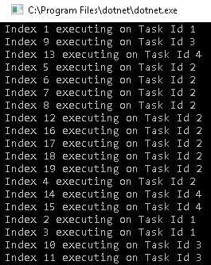
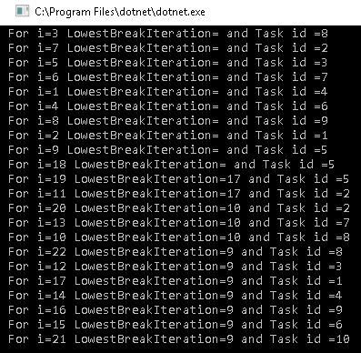
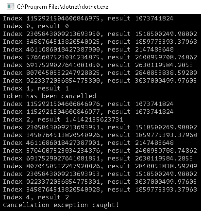

# 第三章：实现数据并行性

到目前为止，我们已经了解了并行编程、任务和任务并行性的基础知识。在本章中，我们将涵盖并行编程的另一个重要方面，即处理数据的并行执行：数据并行性。虽然任务并行性为每个参与线程创建了一个单独的工作单元，但数据并行性创建了一个由源集合中的每个参与线程执行的共同任务。这个源集合被分区，以便多个线程可以同时对其进行处理。因此，了解数据并行性对于从循环/集合中获得最大性能至关重要。

在本章中，我们将讨论以下主题：

+   在并行循环中处理异常

+   在并行循环中创建自定义分区策略

+   取消循环

+   理解并行循环中的线程存储

# 技术要求

要完成本章，您应该对 TPL 和 C#有很好的理解。本章的源代码可在 GitHub 上找到：[`github.com/PacktPublishing/Hands-On-Parallel-Programming-with-C-8-and-.NET-Core-3/tree/master/Chapter03`](https://github.com/PacktPublishing/Hands-On-Parallel-Programming-with-C-8-and-.NET-Core-3/tree/master/Chapter03)。

# 从顺序循环转换为并行循环

TPL 通过`System.Threading.Tasks.Parallel`类支持数据并行性，该类提供了`For`和`Foreach`循环的并行实现。作为开发人员，您不需要担心同步或创建任务，因为这由并行类处理。这种语法糖使您可以轻松地编写并行循环，方式类似于您一直在编写顺序循环。

以下是一个顺序`for`循环的示例，它通过将交易对象发布到服务器来预订交易：

```cs
foreach (var trade in trades)
{
    Book(trade);
}
```

由于循环是顺序的，完成循环所需的总时间是预订一笔交易所需的时间乘以交易的总数。这意味着随着交易数量的增加，循环会变慢，尽管交易预订时间保持不变。在这里，我们处理的是大量数据。由于我们将在服务器上预订交易，并且所有服务器都支持多个请求，将这个循环从顺序循环转换为并行循环是有意义的，因为这将给我们带来显著的性能提升。

可以将先前的代码转换为并行代码，如下所示：

```cs
Parallel.ForEach(trades, trade => Book(trade));
```

在运行并行循环时，TPL 对源集合进行分区，以便循环可以同时在多个部分上执行。任务的分区是由`TaskScheduler`类完成的，该类在创建分区时考虑系统资源和负载。我们还可以创建一个**自定义分区器**或**调度器**，正如我们将在本章的*创建自定义分区策略*部分中看到的。

数据并行性表现更好，如果分区单元是独立的。通过一种称为减少的技术，我们还可以创建依赖分区单元，以最小的性能开销将一系列操作减少为标量值。有三种方法可以将顺序代码转换为并行代码：

+   使用`Parallel.Invoke`方法

+   使用`Parallel.For`方法

+   使用`Parallel.ForEach`方法

让我们试着了解`Parallel`类可以用于展示数据并行性的各种方式。

# 使用 Parallel.Invoke 方法

这是以并行方式执行一组操作的最基本方式，也是并行`for`和`foreach`循环的基础。`Parallel.Invoke`方法接受一个操作数组作为参数并执行它们，尽管它不能保证操作将并行执行。在使用`Parallel.Invoke`时有一些重要的要点需要记住：

+   并行性不能保证。操作是并行执行还是按顺序执行将取决于`TaskScheduler`。

+   `Parallel.Invoke`不能保证传递的操作的顺序。

+   它会阻塞调用线程，直到所有的动作都完成。

`Parallel.Invoke`的语法如下：

```cs
public static void Invoke(
  params Action[] actions
)
```

我们可以传递一个动作或一个 lambda 表达式，如下例所示：

```cs
try
{
    Parallel.Invoke(() => Console.WriteLine("Action 1"),
    new Action(() => Console.WriteLine("Action 2")));
}
catch(AggregateException aggregateException)
{
    foreach (var ex in aggregateException.InnerExceptions)
    {
        Console.WriteLine(ex.Message);
    }
}
Console.WriteLine("Unblocked");
Console.ReadLine();         
```

`Invoke`方法的行为就像一个附加的子任务，因为它被阻塞，直到所有的动作都完成。所有的异常都被堆叠在`System.AggregateException`中，并抛出给调用者。在前面的代码中，由于没有异常，我们将看到以下输出：


我们可以使用`Task`类来实现类似的效果，尽管与`Parallel.Invoke`的工作方式相比，这可能看起来非常复杂：

```cs
Task.Factory.StartNew(() => {
     Task.Factory.StartNew(() => Console.WriteLine("Action 1"),        
     TaskCreationOptions.AttachedToParent);
     Task.Factory.StartNew(new Action(() => Console.WriteLine("Action 2"))
                        , TaskCreationOptions.AttachedToParent);
                        });
```

`Invoke`方法的行为就像一个附加的子任务，因为它被阻塞，直到所有的动作都完成。所有的异常都被堆叠在`System.AggregateException`中，并抛出给调用者。

# 使用 Parallel.For 方法

`Parallel.For`是顺序`for`循环的一个变体，不同之处在于迭代是并行运行的。`Parallel.For`返回`ParallelLoopResult`类的一个实例，一旦循环执行完成，它提供了循环完成状态。我们还可以检查`ParallelLoopResult`的`IsCompleted`和`LowestBreakIteration`属性，以找出方法是否已完成或取消，或者用户是否已调用了 break。以下是可能的情况：

| `IsCompleted` | `LowestBreakIteration` | **原因** |
| --- | --- | --- |
| True | N/A | 运行完成 |
| False | Null | 循环在匹配前停止 |
| False | 非空整数值 | 在循环中调用 Break |

`Parallel.For`方法的基本语法如下：

```cs
public static ParallelLoopResult For
{
    Int fromIncalme,
    Int toExclusiveme,            
    Action<int> action
}
```

这个例子如下所示：

```cs
Parallel.For (1, 100, (i) => Console.WriteLine(i));
```

如果你不想取消、中断或维护任何线程本地状态，并且执行顺序不重要，这种方法可能很有用。例如，想象一下我们想要计算今天在一个目录中创建的文件的数量。代码如下：

```cs
int totalFiles = 0;
var files = Directory.GetFiles("C:\\");
Parallel.For(0, files.Length, (i) =>
     {
       FileInfo fileInfo = new FileInfo(files[i]);
       if (fileInfo.CreationTime.Day == DateTime.Now.Day)                                                                          
        Interlocked.Increment(ref totalFiles);
     });
Console.WriteLine($"Total number of files in C: drive are {files.Count()} and  {totalFiles} files were created today.");
```

这段代码迭代了`C:`驱动器中的所有文件，并计算了今天创建的文件的数量。以下是我机器上的输出：


在下一节中，我们将尝试理解`Parallel.ForEach`方法，它提供了`ForEach`循环的并行变体。

对于一些集合，根据循环的语法和正在进行的工作的类型，顺序执行可能更快。

# 使用 Parallel.ForEach 方法

这是`ForEach`循环的一个变体，其中迭代可以并行运行。源集合被分区，然后工作被安排在多个线程上运行。`Parallel.ForEach`适用于通用集合，并且像`for`循环一样返回`ParallelLoopResult`。

`Parallel.ForEach`循环的基本语法如下：

```cs
Parallel.ForEach<TSource>(
    IEnumerable<TSource> Source,                                     
    Action<TSource> body
)
```

这个例子如下所示。我们有一个需要监视的端口列表。我们还需要更新它们的状态：

```cs
List<string> urls = new List<string>() {"www.google.com" , "www.yahoo.com","www.bing.com" };
Parallel.ForEach(urls, url =>
{
    Ping pinger = new Ping();
     Console.WriteLine($"Ping Url {url} status is {pinger.Send(url).Status} 
      by Task {Task.CurrentId}");
});
```

在前面的代码中，我们使用了`System.Net.NetworkInformation.Ping`类来 ping 一个部分，并在控制台上显示状态。由于这些部分是独立的，如果代码并行执行并且顺序也不重要，我们可以实现很好的性能。

以下屏幕截图显示了前面代码的输出：


并行性可能会使单核处理器上的应用程序变慢。我们可以通过使用并行度来控制并行操作中可以利用多少核心，接下来我们将介绍这个。

# 理解并行度

到目前为止，我们已经学习了数据并行性如何使我们能够在系统的多个核心上并行运行循环，从而有效利用可用的 CPU 资源。您应该知道还有另一个重要的概念，可以用来控制您想要在循环中创建多少任务。这个概念叫做并行度。这是一个指定可以由并行循环创建的最大任务数的数字。您可以通过一个名为`MaxDegreeOfParallelism`的属性来设置并行度，这是`ParallelOptions`类的一部分。以下是`Parallel.For`的语法，您可以通过它传递`ParallelOptions`实例：

```cs
public static ParallelLoopResult For(
        int fromInclusive,
        int toExclusive,
        ParallelOptions parallelOptions,
        Action<int> body
)
```

以下是`Parallel.For`和`Parallel.ForEach`方法的语法，您可以通过它传递`ParallelOptions`实例：

```cs
public static ParallelLoopResult ForEach<TSource>(
        IEnumerable<TSource> source,
        ParallelOptions parallelOptions,
        Action<TSource> body
)
```

并行度的默认值为 64，这意味着并行循环可以通过创建这么多任务来利用系统中多达 64 个处理器。我们可以修改这个值来限制任务的数量。让我们通过一些例子来理解这个概念。

让我们看一个`MaxDegreeOfParallelism`设置为`4`的`Parallel.For`循环的例子：

```cs
Parallel.For(1, 20, new ParallelOptions { MaxDegreeOfParallelism = 4 }, index =>
             {
                 Console.WriteLine($"Index {index} executing on Task Id 
                  {Task.CurrentId}");
             });
```

输出如下：



正如您所看到的，循环由四个任务执行，分别用任务 ID 1、2、3 和 4 表示。

这是一个`MaxDegreeOfParallelism`设置为`4`的`Parallel.ForEach`循环的例子：

```cs
var items = Enumerable.Range(1, 20); 
Parallel.ForEach(items, new ParallelOptions { MaxDegreeOfParallelism = 4 }, item =>
           {
               Console.WriteLine($"Index {item} executing on Task Id 
                {Task.CurrentId}");
           });
```

输出如下：


正如您所看到的，这个循环由四个任务执行，分别用任务 ID 1、2、3 和 4 表示。

我们应该修改这个设置以适应高级场景，例如我们知道运行的算法不能跨越超过一定数量的处理器。如果我们同时运行多个算法并且希望限制每个算法只利用一定数量的处理器，我们也应该修改这个设置。接下来，我们将学习如何通过引入分区策略的概念在集合中创建自定义分区。

# 创建自定义分区策略

分区是数据并行性中的另一个重要概念。为了在源集合中实现并行性，它需要被分割成称为范围或块的较小部分，这些部分可以被各个线程同时访问。没有分区，循环将串行执行。分区器可以分为两类，我们也可以创建自定义分区器。这些类别如下：

+   范围分区

+   块分区

让我们详细讨论这些。

# 范围分区

这种类型的分区主要用于长度预先已知的集合。顾名思义，每个线程都会得到一系列元素来处理，或者源集合的起始和结束索引。这是分区的最简单形式，在某种程度上非常高效，因为每个线程都会执行其范围而不会覆盖其他线程。虽然在创建范围时会有一些性能损失，但没有同步开销。这种类型的分区在每个范围中的元素数量相同时效果最佳，这样它们将花费相似的时间来完成。对于不同数量的元素，一些任务可能会提前完成并处于空闲状态，而其他任务可能在范围内有很多待处理的元素。

# 块分区

这种类型的分区主要用于`LinkedList`等集合，其中长度事先不知道。分块分区在您有不均匀的集合的情况下提供更多的负载平衡。每个线程都会挑选一块元素进行处理，然后再回来挑选其他线程尚未挑选的另一块。块的大小取决于分区器的实现，并且有同步开销来确保分配给两个线程的块不包含重复项。

我们可以更改`Parallel.ForEach`循环的默认分区策略，以执行自定义的分块分区，如下例所示：

```cs
var source = Enumerable.Range(1, 100).ToList();
OrderablePartitioner<Tuple<int,int>> orderablePartitioner= Partitioner.Create(1, 100);
Parallel.ForEach(orderablePartitioner, (range, state) =>
            {
              var startIndex = range.Item1;
              var endIndex = range.Item2;
              Console.WriteLine($"Range execution finished on task 
               {Task.CurrentId} with range 
               {startRange}-{endRange}");
            });
```

在前面的代码中，我们使用`OrderablePartitioner`类在一系列项目（这里是从`1`到`100`）上创建了分块分区器。我们将分区器传递给`ForEach`循环，其中每个块都传递给一个线程并执行。输出如下：


到目前为止，我们对并行循环的工作原理有了很好的理解。现在，我们需要讨论一些高级概念，以便更多地了解如何控制循环执行；也就是说，如何根据需要停止循环。

# 取消循环

我们在顺序循环中使用了`break`和`continue`等结构；`break`用于通过完成当前迭代并跳过其余部分来跳出循环，而`continue`则跳过当前迭代并移动到其余的迭代。这些结构可以使用，因为顺序循环由单个线程执行。在并行循环的情况下，我们不能使用`break`和`continue`关键字，因为它们在多个线程或任务上运行。要中断并行循环，我们需要使用`ParallelLoopState`类。要取消循环，我们需要使用`CancellationToken`和`ParallelOptions`类。

在本节中，我们将讨论取消循环所需的选项：

+   `Parallel.Break`

+   `ParallelLoopState.Stop`

+   `CancellationToken`

让我们开始吧！

# 使用 Parallel.Break 方法

`Parallel.Break`试图模仿顺序执行的结果。让我们看看如何从并行循环中`break`。在以下代码中，我们需要搜索一个数字列表以查找特定数字。当找到匹配项时，我们需要中断循环的执行：

```cs
     var numbers = Enumerable.Range(1, 1000);
     int numToFind = 2;
     Parallel.ForEach(numbers, (number, parallelLoopState) =>
     {
           Console.Write(number + "-");
           if (number == numToFind)
           {
                Console.WriteLine($"Calling Break at {number}");
                parallelLoopState.Break();
           }
      });       
```

如前面的代码所示，循环应该在找到数字`2`之前运行。使用顺序循环，它将在第二次迭代时精确中断。对于并行循环，由于迭代在多个任务上运行，实际上会打印出大于 2 的值，如下面的输出所示：


为了跳出循环，我们调用了`parallelLoopState.Break()`，它试图模仿顺序循环中实际`break`关键字的行为。当任何一个核心遇到`Break()`方法时，它将在**`ParallelLoopState`**对象的`LowestBreakIteration`属性中设置一个迭代号。这成为可以执行的最大数字或最后一个迭代。所有其他任务将继续迭代，直到达到这个数字。

通过并行运行迭代来连续调用`Break`方法，进一步减少`LowestBreakIteration`，如下面的代码所示：

```cs
            var numbers = Enumerable.Range(1, 1000);
            Parallel.ForEach(numbers, (i, parallelLoopState) =>
            {
                Console.WriteLine($"For i={i} LowestBreakIteration =     
                  {parallelLoopState.LowestBreakIteration} and 
                  Task id ={Task.CurrentId}");
                if (i >= 10)
                {
                    parallelLoopState.Break();
                }
            });
```

当我们在 Visual Studio 中运行前面的代码时，我们会得到以下输出：



在这里，我们在多核处理器上运行代码。正如您所看到的，许多迭代得到了`LowestBreakIteration`的空值，因为代码是在多个核上执行的。在第 17 次迭代时，一个核心调用了`Break()`方法，并将`LowestBreakIteration`的值设置为 17。在第 10 次迭代时，另一个核心调用`Break()`并进一步将数字减少到 10。后来，在第 9 次迭代时，另一个核心调用了`Break()`，并进一步将数字减少到 9。

# 使用 ParallelLoopState.Stop

如果你不想模仿顺序循环的结果，而是想尽快退出循环，你可以调用`ParallelLoopState.Stop`。就像我们用`Break()`方法一样，所有并行运行的迭代在循环退出之前都会完成：

```cs
var numbers = Enumerable.Range(1, 1000);
Parallel.ForEach(numbers, (i, parallelLoopState) =>
         {
                Console.Write(i + " ");
                if (i % 4 == 0)
                {
                    Console.WriteLine($"Loop Stopped on {i}");
                    parallelLoopState.Stop();
                }
         });
```

在 Visual Studio 中运行上述代码时，输出如下：


正如你所看到的，一个核心在第 4 次迭代时调用了`Stop`，另一个核心在第 8 次迭代时调用了`Stop`，第三个核心在第 12 次迭代时调用了`Stop`。迭代 3 和 10 仍然执行，因为它们已经被安排执行。

# 使用 CancellationToken 取消循环

与普通任务一样，我们可以使用`CancellationToken`类来取消`Parallel.For`和`Parallel.ForEach`循环。当我们取消令牌时，循环将完成当前可能并行运行的迭代，但不会开始新的迭代。一旦现有的迭代完成，并行循环会抛出`OperationCanceledException`。

让我们举个例子来看看。首先，我们将创建一个取消令牌源：

```cs
CancellationTokenSource cancellationTokenSource = new CancellationTokenSource();
```

然后，我们将创建一个在五秒后取消令牌的任务：

```cs
Task.Factory.StartNew(() =>
{
    Thread.Sleep(5000);
    cancellationTokenSource.Cancel();
    Console.WriteLine("Token has been cancelled");
});
```

之后，我们将通过传递取消令牌来创建一个并行选项对象：

```cs
ParallelOptions loopOptions = new ParallelOptions()
{
    CancellationToken = cancellationTokenSource.Token
};
```

接下来，我们将运行一个持续时间超过五秒的操作：

```cs
try
{
    Parallel.For(0, Int64.MaxValue, loopOptions, index =>
    {
        Thread.Sleep(3000);
        double result = Math.Sqrt(index);
        Console.WriteLine($"Index {index}, result {result}");
    });
}
catch (OperationCanceledException)
{
    Console.WriteLine("Cancellation exception caught!");
}
```

在 Visual Studio 中运行上述代码时，输出如下：



正如你所看到的，即使取消令牌已被调用，预定的迭代仍然会执行。希望这能让你对我们如何根据程序要求取消循环有一个很好的理解。并行编程的另一个重要方面是存储的概念。我们将在下一节讨论这个问题。

# 理解并行循环中的线程存储

默认情况下，所有并行循环都可以访问全局变量。然而，访问全局变量会带来同步开销，因此在可能的情况下，最好使用线程范围的变量。我们可以创建一个**线程本地**或**分区本地**变量来在并行循环中使用。

# 线程本地变量

线程本地变量就像特定任务的全局变量。它们的生命周期跨越循环要执行的迭代次数。

在下面的例子中，我们将使用`for`循环来查看线程本地变量。在`Parallel.For`循环的情况下，会创建多个任务来运行迭代。假设我们需要通过并行循环找出 60 个数字的总和。

举个例子，假设有四个任务，每个任务有 15 次迭代。实现这一点的一种方法是创建一个全局变量。每次迭代后，运行的任务都应该更新全局变量。这将需要同步开销。对于四个任务，将会有四个对每个任务私有的线程本地变量。任务将更新变量，并且最后更新的值可以返回给调用程序，然后可以用来更新全局变量。

以下是要遵循的步骤：

1.  创建一个包含 60 个数字的集合，其中每个项目的值都等于索引：

```cs
var numbers = Enumerable.Range(1, 60);
```

1.  创建一个完成的操作，一旦任务完成了所有分配的迭代，就会执行。该方法将接收线程本地变量的最终结果，并将其添加到全局变量`sumOfNumbers`中：

```cs
long sumOfNumbers = 0;
Action<long> taskFinishedMethod = (taskResult) => 
{
    Console.WriteLine($"Sum at the end of all task iterations for task 
     {Task.CurrentId} is {taskResult}");
    Interlocked.Add(ref sumOfNumbers, taskResult);
};
```

1.  创建一个`For`循环。前两个参数是`startIndex`和`endIndex`。第三个参数是一个委托，为线程本地变量提供种子值。这是一个需要任务执行的操作。在我们的例子中，我们只是将索引分配给`subtotal`，这是我们的线程本地变量。

假设有一个任务*TaskA*，它获取索引从 1 到 5 的迭代。*TaskA*将这些迭代相加为 1+2+3+4+5。这等于 15，将作为任务的结果返回，并作为参数传递给`taskFinishedMethod`：

```cs
Parallel.For(0,numbers.Count(), 
                         () => 0,
                         (j, loop, subtotal) =>
                         {
                              subtotal += j;
                              return subtotal;
                         },
                         taskFinishedMethod
);
Console.WriteLine($"The total of 60 numbers is {sumOfNumbers}");
```

在 Visual Studio 中运行上述代码时，输出如下：


请记住，输出可能因可用核心数量不同而在不同的机器上有所不同。

# 分区本地变量

这类似于线程本地变量，但适用于分区。正如您所知，`ForEach`循环将源集合分成多个分区。每个分区将有其自己的分区本地变量副本。对于线程本地变量，每个线程只有一个变量副本。然而，在这里，由于单个线程上可以运行多个分区，因此每个线程可以有多个副本。

首先，我们需要创建一个`ForEach`循环。第一个参数是源集合，即数字。第二个参数是为线程本地变量提供种子值的委托。第三个参数是任务需要执行的操作。在我们的情况下，我们只是将索引分配给`subtotal`，这是我们的线程本地变量。

为了理解，假设有一个任务*TaskA*，它获取索引从 1 到 5 的迭代。*TaskA*将这些迭代相加，即 1+2+3+4+5。这等于 15，将作为任务的结果返回，并作为参数传递给`taskFinishedMethod`。

以下是代码：

```cs
Parallel.ForEach<int, long>(numbers,
    () => 0, // method to initialize the local variable
    (j, loop, subtotal) => // Action performed on each iteration
    {
        subtotal += j; //Subtotal is Thread local variable
        return subtotal; // value to be passed to next iteration
    },
    taskFinishedMethod);
Console.WriteLine($"The total of 60 numbers is {sumOfNumbers}");
```

同样，在这种情况下，输出将因可用核心数量不同而在不同的机器上有所不同。

# 总结

在本章中，我们详细介绍了使用 TPL 实现任务并行性。我们首先介绍了如何使用 TPL 提供的一些内置方法，如`Parallel.Invoke`、`Parallel.For`和`Parallel.ForEach`，将顺序循环转换为并行循环。接下来，我们讨论了如何通过了解并行度和分区策略来充分利用可用的 CPU 资源。然后，我们讨论了如何使用内置构造（如取消标记、`Parallel.Break`和`ParallelLoopState.Stop`）取消并跳出并行循环。在本章末尾，我们讨论了 TPL 中可用的各种线程存储选项。

TPL 提供了一些非常令人兴奋的选项，我们可以通过`For`和`ForEach`循环的并行实现来实现数据并行性。除了`ParallelOptions`和`ParallelLoopState`等功能外，我们还可以在不丢失太多同步开销的情况下实现显著的性能优势和控制。

在下一章中，我们将看到并行库的另一个令人兴奋的特性，称为**PLINQ**。

# 问题

1.  以下哪个不是 TPL 中提供`for`循环的正确方法？

1.  `Parallel.Invoke`

1.  `Parallel.While`

1.  `Parallel.For`

1.  `Parallel.ForEach`

1.  哪个不是默认的分区策略？

1.  批量分区

1.  范围分区

1.  块分区

1.  并行度的默认值是多少？

1.  1

1.  64

1.  `Parallel.Break`保证一旦执行就立即返回。

1.  真

1.  假

1.  一个线程能看到另一个线程的线程本地或分区本地值吗？

1.  是

1.  不
