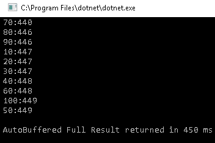
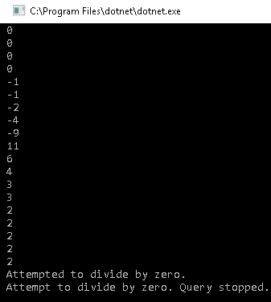
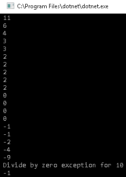

# 第四章：使用 PLINQ

PLINQ 是**Language Integrate Query**（LINQ）的并行实现。PLINQ 首次在.NET Framework 4.0 中引入，此后已经变得功能丰富。在 LINQ 之前，开发人员很难从各种数据源（如 XML 或数据库）中获取数据，因为每个源都需要不同的技能。LINQ 是一种语言语法，依赖于.NET 委托和内置方法来查询或修改数据，而无需担心学习低级任务。

在本章中，我们将首先了解.NET 中的 LINQ 提供程序。随着 PLINQ 成为程序员的首选，我们将涵盖其各种编程方面，以及与之相关的一些缺点。最后，我们将了解影响 PLINQ 性能的因素。

我们将涵盖以下主题：

+   .NET 中的 LINQ 提供程序

+   编写 PLINQ 查询

+   在 PLINQ 中保持顺序

+   PLINQ 中的合并选项

+   在 PLINQ 中处理异常

+   组合并行和顺序查询

+   PLINQ 的缺点

+   PLINQ 中的加速

# 技术要求

要完成本章，您应该对 TPL 和 C#有很好的了解。本章的源代码可在 GitHub 上找到[`github.com/PacktPublishing/Hands-On-Parallel-Programming-with-C-8-and-.NET-Core-3/tree/master/Chapter04`](https://github.com/PacktPublishing/Hands-On-Parallel-Programming-with-C-8-and-.NET-Core-3/tree/master/Chapter04)。

# .NET 中的 LINQ 提供程序

LINQ 是一组 API，帮助我们更轻松地处理 XML、对象和数据库。LINQ 有许多提供程序，包括以下常用的：

+   对象的 LINQ：LINQ 到对象允许开发人员查询内存中的对象，如数组、集合、泛型类型等。它返回一个`IEnumerable`，支持排序、过滤、分组、排序和聚合函数等功能。其功能在`System.Linq`命名空间中定义。

+   LINQ 到 XML：LINQ 到 XML 允许开发人员查询或修改 XML 数据源。它在`System.Xml.Linq`命名空间中定义。

+   LINQ 到 ADO.NET：LINQ 到 ADO.NET 不是一个技术，而是一组技术，允许开发人员查询或修改关系数据源，如 SQL Server、MySQL 或 Oracle。

+   LINQ 到 SQL：也称为 DLINQ。DLINQ 使用对象关系映射（ORM），是微软支持但不再增强的传统技术。它仅适用于 SQL Server，并允许用户将数据库表映射到.NET 类。它还有一个适配器，类似于开发人员接口到数据库。

+   LINQ 到数据集：这允许开发人员查询或修改内存中的数据集。它与 ADO.NET 支持的任何数据库一起工作。

+   实体的 LINQ：这是最先进和最受追捧的技术。它允许开发人员使用任何关系数据库，包括 SQL Server、Oracle、IBM Db2 和 MySQL。LINQ to entities 还支持 ORM。

+   PLINQ：也称为 PLINQ。PLINQ 是对象的 LINQ 的并行实现。LINQ 查询是顺序执行的，对于大量计算操作来说可能非常慢。PLINQ 通过在多个线程上调度任务，并且可选地在多个核心上运行，支持查询的并行执行。

.NET 支持使用`AsParallel()`方法将 LINQ 无缝转换为 PLINQ。PLINQ 是进行大量计算操作的非常好的选择。它通过将源数据分成块，然后由运行在多个核心上的不同线程执行来工作。PLINQ 还支持 XLINQ 和 LINQ 到对象。

# 编写 PLINQ 查询

要理解 PLINQ 查询，我们需要先了解`ParallelEnumerable`类。一旦我们了解了`ParallelEnumerable`类，我们将学习如何编写并行查询。

# 介绍 ParallelEnumerable 类

`ParallelEnumerable`类位于`System.Linq`命名空间和`System.Core`程序集中。

除了支持 LINQ 定义的大多数标准查询操作符之外，`ParallelEnumerable`类还支持许多额外的支持并行执行的方法：

+   `AsParallel()`: 这是并行化所需的种子方法。

+   `AsSequential()`:通过改变并行行为，启用并行查询的顺序执行。

+   `AsOrdered()`: 默认情况下，PLINQ 不保留任务执行和结果返回的顺序。我们可以通过调用`AsOrdered()`方法来保留这个顺序。

+   `AsUnordered()`:这是`ParallelQuery`的默认行为，可以通过`AsOrdered()`方法覆盖。我们可以通过调用这个方法将行为从有序改为无序。

+   `ForAll()`:启用并行执行查询。

+   `Aggregate()`: 这个方法可以用来聚合并行查询中各个线程本地分区的结果。

+   `WithDegreesOfParallelism()`:使用这个方法，我们可以指定用于并行化查询执行的最大处理器数量。

+   `WithParallelOption()`:使用这个方法，我们可以缓冲并行查询产生的结果。

+   `WithExecutionMode()`:使用这个方法，我们可以强制查询的并行执行，或者让 PLINQ 决定查询是否需要以顺序或并行方式执行。

我们将通过代码示例在本章后面学习更多关于这些方法的内容。这里值得一提的是一个非常方便的工具叫做 LINQPad。LINQPad 帮助我们学习关于 LINQ/PLINQ 查询，因为它有 500 多个可用的示例和连接到各种数据源的能力。您可以从[`www.linqpad.net/`](https://www.linqpad.net/)下载它。

# 我们的第一个 PLINQ 查询

假设我们想要找到所有可以被三整除的数字。

首先，我们定义一个范围为 100,000 的数字：

```cs
var range = Enumerable.Range(1, 100000);
```

要顺序找到所有可以被三整除的数字，使用以下 LINQ 查询：

```cs
var resultList = range.Where(i => i % 3 == 0).ToList();
```

以下是使用`AsParallel`方法的相同查询的并行版本，但使用方法语法：

```cs
 var resultList = range.AsParallel().Where(i => i % 3 == 0).ToList();

```

以下是在 LINQ 中使用查询语法选项的相同版本：

```cs
var resultList = (from i in range.AsParallel()
                  where i % 3 == 0
                  select i).ToList();
```

以下是完整的代码：

```cs
var range = Enumerable.Range(1, 100000);
//Here is sequential version
var resultList = range.Where(i => i % 3 == 0).ToList();
Console.WriteLine($"Sequential: Total items are {resultList.Count}");
//Here is Parallel Version using .AsParallel method
resultList = range.AsParallel().Where(i => i % 3 == 0).ToList();
resultList = (from i in range.AsParallel()
 where i % 3 == 0
 select i).ToList();
 Console.WriteLine($"Parallel: Total items are {resultList.Count}" ); 
Console.WriteLine($"Parallel: Total items are {resultList.Count}");

```

这将产生以下输出：


# 在进行并行执行时保留 PLINQ 中的顺序

PLINQ 并行执行工作项，并且默认情况下不关心保留项目的顺序以提高并行查询的性能。然而，有时重要的是项目按照它们在源集合中的顺序执行。例如，想象一下，您正在向服务器发送多个请求以按块下载文件，然后在客户端合并这些块以重新创建文件。由于文件是分部分下载的，每个部分都需要按正确的顺序下载和合并。在并行执行项目时保留顺序对性能有直接影响，因为我们需要在整个分区中保留原始顺序，并在合并项目时确保顺序一致。

我们可以通过在源集合上使用`AsOrdered()`方法来覆盖默认行为并打开顺序保留。如果在任何时候，我们想要关闭顺序保留，我们可以调用`AsUnOrdered()`方法。

让我们看一个例子：

```cs
var range = Enumerable.Range(1, 10);
Console.WriteLine("Sequential Ordered"); 
range.ToList().ForEach(i => Console.Write(i + "-"));
```

这段代码是顺序的，所以当我们运行它时，我们得到以下输出：


我们可以使用`AsParallel()`方法制作一个并行版本：

```cs
Console.WriteLine("Parallel Unordered");
var unordered = range.AsParallel().Select(i => i).ToList();
unordered.ForEach(i => Console.WriteLine(i));
```

上面的代码是并行执行的，但是顺序全乱了：


为了兼顾并行执行和顺序，我们可以修改代码如下：

```cs
var range = Enumerable.Range(1, 10);
Console.WriteLine("Parallel Ordered");
var ordered = range.AsParallel().AsOrdered().Select(i => i).ToList();                            ordered.ForEach(i => Console.WriteLine(i));
```

以下是输出：


如您所见，当我们调用`AsOrdered()`方法时，它会并行执行所有工作项，同时保留原始顺序，而在默认情况下，顺序未被保留。使用`AsOrdered()`方法的性能影响巨大，因为顺序在执行的每个步骤中都得到恢复。

# 使用 AsUnOrdered()方法进行顺序执行

一旦我们在 PLINQ 上调用了`AsOrdered`，查询将会顺序执行。可能会有一些情况，我们希望在一定时间内按顺序执行查询，但之后改为无序以获得性能。

假设我们想要生成前 100 个数字的平方，我们可以并行执行如下：

```cs
  var range = Enumerable.Range(100, 10000);
  var ordered = range.AsParallel().AsOrdered().Take(100).Select(i => i * i);
```

我们需要`AsOrdered()`来获取前 100 个数字。问题在于`Select`查询也将按顺序执行。我们可以通过结合`AsOrdered()`和`AsUnOrdered()`来提高性能：

```cs
var range = Enumerable.Range(100, 10000);
var ordered = range.AsParallel().AsOrdered().Take(100).AsUnordered().Select(i => i * i).ToList();
```

现在，前 100 个项目将并行按顺序检索。之后，查询将在不保留任何顺序的情况下执行。

# PLINQ 中的合并选项

正如我们之前提到的，当我们创建并行查询时，源集合被分区，以便多个任务可以同时处理部分。一旦查询完成，结果就需要合并，以便它们可以提供给消费线程。根据查询运算符，可以指定如何显式合并结果，使用`ParallelMergeOperation`枚举和`WithMergeOption()`扩展方法。

让我们看看我们可以使用的各种合并选项。

# 使用 NotBuffered 合并选项

并发任务的结果不会被缓冲。一旦任何任务完成，它们就会将结果返回给消费线程：

```cs
var range = ParallelEnumerable.Range(1, 100);
Stopwatch watch = null;
ParallelQuery<int> notBufferedQuery = range.WithMergeOptions(ParallelMergeOptions.NotBuffered)
                                           .Where(i => i % 10 == 0)
                                           .Select(x => {
                                                     Thread.SpinWait(1000);
                                                     return x;
                                                        });
watch = Stopwatch.StartNew();
foreach (var item in notBufferedQuery)
{
    Console.WriteLine( $"{item}:{watch.ElapsedMilliseconds}");
}
Console.WriteLine($"\nNotBuffered Full Result returned in {watch.ElapsedMilliseconds} ms");
```

输出如下：


# 使用 AutoBuffered 合并选项

并发任务的结果被缓冲，并且缓冲区定期提供给消费线程。根据集合的大小，可能会返回多个缓冲区。使用此选项，消费线程需要等待更长时间才能获得第一个结果。这也是默认选项。

考虑以下代码：

```cs
var range = ParallelEnumerable.Range(1, 100);
Stopwatch watch = null;
ParallelQuery<int> query = range.WithMergeOptions(ParallelMergeOptions.AutoBuffered)
                                .Where(i => i % 10 == 0)
                                .Select(x => {
                                             Thread.SpinWait(1000);
                                             return x;
                                             });
watch = Stopwatch.StartNew();
foreach (var item in query)
{
    Console.WriteLine($"{item}:{watch.ElapsedMilliseconds}");
}
Console.WriteLine($"\nAutoBuffered Full Result returned in {watch.ElapsedMilliseconds} ms");
watch.Stop();
```

输出如下：



# 使用 FullyBuffered 合并选项

并发任务的结果在提供给消费线程之前完全缓冲。这提高了整体性能，尽管获得第一个结果所需的时间会更长：

```cs
var range = ParallelEnumerable.Range(1, 100);
Stopwatch watch = null;
ParallelQuery<int> fullyBufferedQuery = range.WithMergeOptions(ParallelMergeOptions.FullyBuffered)
                                .Where(i => i % 10 == 0)
                                .Select(x => {
                                              Thread.SpinWait(1000);
                                              return x;
                                              });
watch = Stopwatch.StartNew();
foreach (var item in fullyBufferedQuery)
{
    Console.WriteLine($"{item}:{watch.ElapsedMilliseconds}");
}
Console.WriteLine($"\nFullyBuffered Full Result returned in {watch.ElapsedMilliseconds} ms");
watch.Stop();
```

输出如下：


并非所有查询运算符都支持所有合并模式。以下是一些运算符及其限制的列表：


此信息可在[`msdn.microsoft.com/en-us/library/dd997424(v=vs.110).aspx`](http://msdn.microsoft.com/en-us/library/dd997424(v=vs.110).aspx)找到。

除了前面的运算符外，`ForAll()`始终为`NotBuffered`，`OrderBy`始终为`FullyBuffered`。如果在这些运算符上指定了任何自定义合并选项，则它们将被忽略。

# 使用 PLINQ 抛出和处理异常

与其他并行原语一样，每当 PLINQ 遇到异常时，都会抛出`System.AggregateException`。异常处理在很大程度上取决于您的设计。您可能希望程序尽快失败，或者您可能希望所有异常都返回给调用者。

在以下示例中，我们将在`try`-`catch`块中包装一个并行查询。当查询引发异常时，它将传播回调用者，包装在`System.AggregateException`中：

```cs
var range = ParallelEnumerable.Range(1, 20);
ParallelQuery<int> query= range.Select(i => i / (i - 10)).WithDegreeOfParallelism(2);
try
{
    query.ForAll(i => Console.WriteLine(i));
}
catch (AggregateException aggregateException)
{
    foreach (var ex in aggregateException.InnerExceptions)
    {
        Console.WriteLine(ex.Message);
        if (ex is DivideByZeroException)
            Console.WriteLine("Attempt to divide by zero. Query 
             stopped.");
    }
}
```

输出如下：



我们还可以在委托内部指定一个`try`-`catch`块，这样可以尽快通知我们有关错误条件。它还可以用于一种情况，即我们只想记录异常并通过在异常情况下提供默认值作为查询结果来继续查询的执行：

```cs
var range = ParallelEnumerable.Range(1, 20);
Func<int, int> selectDivision = (i) =>
{
    try
    {
        return  i / (i - 10);
    }
    catch (DivideByZeroException ex)
    {
        Console.WriteLine($"Divide by zero exception for {i}");
        return -1;
    }
};
ParallelQuery<int> query = range.Select(i => selectDivision(i)).WithDegreeOfParallelism(2);
try
{
    query.ForAll(i => Console.WriteLine(i));
}
catch (AggregateException aggregateException)
{
    foreach (var ex in aggregateException.InnerExceptions)
    {
        Console.WriteLine(ex.Message);
        if (ex is DivideByZeroException)
            Console.WriteLine("Attempt to divide by zero. Query stopped.");
    }
}
```

输出如下：



异常处理对于维护应用程序中的正确流程以及通知用户应用程序中的错误条件非常重要。通过适当的异常处理和日志记录，我们可以在生产环境中排除应用程序错误。在下一节中，我们将讨论如何合并并行和顺序查询。

# 合并并行和顺序 LINQ 查询

我们已经讨论了使用`AsParallel()`创建并行查询的用法。有时，我们可能希望按顺序执行操作。我们可以使用`AsSequential()`方法强制 PLINQ 按顺序操作。一旦这个方法应用到任何并行查询中，后续的操作将按顺序执行。考虑以下代码：

```cs
var range = Enumerable.Range(1, 1000);
range.AsParallel().Where(i => i % 2 == 0).AsSequential().Where(i => i % 8 == 0).AsParallel().OrderBy(i => i);
```

这里，第一个`Where`类，`Where(i => i % 2 == 0)`，将并行执行。然而，第二个`Where`类，`Where(i => i % 8 == 0)`，将顺序执行。`OrderBy`也将切换到并行执行模式。

如下图所示：


现在，我们应该对如何合并同步和并行 LINQ 查询有了一个很好的了解。在下一节中，我们将学习如何取消 PLINQ 查询以节省 CPU 资源。

# 取消 PLINQ 查询

我们可以使用`CancellationTokenSource`和`CancellationToken`类取消 PLINQ 查询。取消令牌通过`WithCancellation`子句传递给 PLINQ 查询，然后我们可以调用`CancellationToken.Cancel`来取消查询操作。当查询被取消时，会抛出`OperationCancelledException`。

操作如下：

1.  创建一个取消令牌源：

```cs
CancellationTokenSource cs = new CancellationTokenSource();
Create a task that starts immediately and cancel the token after 4 seconds
     Task cancellationTask = Task.Factory.StartNew(() =>
            {
                Thread.Sleep(4000);
                cs.Cancel();
            });
```

1.  将 PLINQ 查询包装在`try`块内：

```cs
try
       {
           var result = range.AsParallel()
             .WithCancellation(cs.Token)
             .Select(number => number)
             .ToList();
       }
```

1.  添加两个`catch`块；一个用于捕获`OperationCanceledException`，另一个用于捕获`AggregateException`：

```cs
     catch (OperationCanceledException ex)
            {
                Console.WriteLine(ex.Message);
            }
            catch (AggregateException ex)
            {
                foreach (var inner in ex.InnerExceptions)
                {
                    Console.WriteLine(inner.Message);
                }
            }
```

1.  将范围设置为一个非常大的值，需要超过四秒才能执行：

```cs
            var range = Enumerable.Range(1,1000000);
```

1.  运行代码。四秒后，我们将看到以下输出：


并行编程有其自己的注意事项。在下一节中，我们将介绍使用 PLINQ 编写并行代码的缺点。

# 使用 PLINQ 的并行编程的缺点

在大多数情况下，PLINQ 的性能要比其非并行对应的 LINQ 快得多。然而，与将 LINQ 并行化相关的分区和合并会带来一些性能开销。在使用 PLINQ 时，我们需要考虑以下一些事项：

1.  **并不总是并行更快**：并行化是一种开销。除非你的源集合很大或者它有计算密集型操作，否则按顺序执行操作更有意义。始终测量顺序和并行查询的性能，以做出明智的决定。

1.  **避免涉及原子性的 I/O 操作**：所有涉及写入文件系统、数据库、网络或共享内存位置的 I/O 操作都应该避免在 PLINQ 内部进行。这是因为这些方法不是线程安全的，因此使用它们可能会导致异常。一个解决方案是使用同步原语，但这也会严重降低性能。

1.  **你的查询可能并不总是并行运行**：在 PLINQ 中进行并行化是 CLR 做出的决定。即使我们在查询中调用了`AsParallel()`方法，也不能保证它会采用并行路径，可能会顺序运行。

# 了解影响 PLINQ 性能的因素（加速）

PLINQ 的主要目的是通过将任务拆分并并行执行来加速查询执行。然而，有许多因素可能会影响 PLINQ 的性能。这些因素包括与分块和分区相关的同步开销，以及来自线程的调度和收集结果的开销。PLINQ 在*令人愉快地并行*的场景中表现最佳，其中线程不必共享状态，也不必担心执行顺序。*令人愉快地并行*是理想的，但由于工作的性质，不一定总是可行的。让我们试着了解可能影响 PLINQ 性能的因素。

# 并行度

有了更多的核心可供我们使用，我们可以实现显著的性能提升，因为 TPL 确保多个任务可以在多个核心上并发执行。性能的提升可能不是指数级的，因此在调整性能时，我们应该尝试在具有多个核心的不同系统上运行并比较结果。

# 合并选项

我们可以在结果经常变化且用户希望尽快看到结果而不必等待的情况下显著改善用户体验。PLINQ 的默认选项是缓冲结果，然后合并并将其返回给用户。我们可以通过选择适当的合并选项来修改此行为。

# 分区类型

我们应该始终检查我们的工作项是平衡的还是不平衡的。对于不平衡的工作项场景，可以引入自定义分区器来提高性能。

# 决定何时使用 PLINQ 保持顺序

我们应该始终计算每个工作项和整个操作的计算成本，以便决定是保持顺序还是转移到并行。并行查询可能并不总是快速的，因为存在分区、调度等额外开销：

*计算成本 = 执行 1 个工作项的成本 * 总工作项数*

并行查询可以在每个项目的计算成本增加时提供显著的性能提升。然而，如果性能提升非常低，那么按顺序执行查询是有意义的。

PLINQ 决定是按顺序还是并行执行取决于查询中操作符的组合。简单来说，如果查询中有以下任何一个操作符，PLINQ 可能决定按顺序运行查询：

+   `Take`、`TakeWhile`、`Skip`、`SkipWhile`、`First`、`Last`、`Concat`、`Zip`或`ElementAt`

+   索引的`Where`和`Select`，它们分别是`Where`和`Select`的重载

以下代码演示了使用索引的`Where`和`Select`：

```cs
IEnumerable<int> query =
    numbers.AsQueryable()
    .Where((number, index) => number <= index * 10);
IEnumerable<bool> query =
    range.AsQueryable()
    .Select((number, index) => number <= index * 10);
```

# 操作顺序

与无序集合相比，PLINQ 在性能上提供了更好的表现，因为使集合按顺序执行会带来性能成本。这种性能成本包括分区、调度和收集结果，以及调用`GroupJoin`和过滤器。作为开发人员，您应该考虑何时使用`AsOrdered()`。

# ForAll 与调用 ToArray()或 ToList()的区别

当我们调用`ToList()`或`ToArray()`或在循环中枚举结果时，我们强制 PLINQ 将所有并行线程的结果合并为单个数据结构。这是一种性能开销。如果我们只是想对一组项目执行一些操作，最好使用`ForAll()`方法。

# 强制并行

PLINQ 并不保证每次都进行并行执行。它可能决定按顺序执行，这取决于查询的类型。我们可以使用`WithExecutionMode`方法来控制这一点。`WithExecutionMode`是一个作用于`ParallelQuery`类型对象的扩展方法。它以`ParallelExecutionMode`作为参数，这是一个枚举。`ParallelExecutionMode`的默认值让 PLINQ 决定最佳的执行模式。我们可以使用`ForceParallelism`选项强制执行模式为并行：

```cs
var range = Enumerable.Range(1, 10);
var squares = range.AsParallel().WithExecutionMode
(ParallelExecutionMode.ForceParallelism).Select(i => i * i);
squares.ToList().ForEach(i => Console.Write(i + "-"));
```

# 生成序列

在整本书中，我们使用`Enumerable.Range()`方法来生成一系列数字。我们也可以使用`ParallelEnumerable`类来并行生成数字。让我们对`Enumerable`和`ParallelEnumerable`类进行一个简单的测试比较：

```cs
Stopwatch watch = Stopwatch.StartNew();
IEnumerable<int> parallelRange = ParallelEnumerable.Range(0, 5000).Select(i => i);
watch.Stop();
Console.WriteLine($"Time elapsed {watch.ElapsedMilliseconds}");
Stopwatch watch2 = Stopwatch.StartNew();
IEnumerable<int> range = Enumerable.Range(0, 5000);
watch2.Stop();
Console.WriteLine($"Time elapsed {watch2.ElapsedMilliseconds}");
Console.ReadLine();
```

输出如下：


如你所见，`ParallelEnumerable`比`Enumerable`更快地创建了一个范围。

在类似的情况下，我们可能希望生成一定数量的数字。我们可以使用`ParallelEnumerable.Repeat()`方法来实现这种情况，如下所示：

```cs
IEnumerable<int> rangeRepeat = ParallelEnumerable.Repeat(1, 5000);
```

现在我们已经了解了影响 PLINQ 性能的因素，我们已经到达了本章的结尾。现在，让我们总结一下我们学到的东西。

# 摘要

在本章中，我们讨论了 LINQ 的基础知识，然后继续了解如何使用 PLINQ 编写并行查询。我们了解到 PLINQ 可以很好地提高整个应用程序的性能，但重要的是要记住它的缺点。作为程序员，通过编写 LINQ 和 PLINQ 查询并比较它们的性能，权衡你的选择总是一个好主意。

在下一章中，我们将学习如何使用同步原语来保持数据的一致性和状态，当数据在多个线程之间共享时。

# 问题

1.  哪个 LINQ 提供程序对关系对象有更好的支持？

1.  LINQ 到 SQL

1.  实体的 LINQ

1.  我们可以通过使用`AsParallel()`轻松将 LINQ 转换为并行 LINQ。

1.  真

1.  假

1.  在 PLINQ 中无法在有序和无序执行之间切换。

1.  真

1.  假

1.  其中一个允许并发任务的结果被缓冲并定期提供给消费线程？

1.  完全缓冲

1.  自动缓冲

1.  非缓冲

1.  如果在任务内执行以下代码，将抛出哪个异常？

```cs
int i=5;
i = i/i -5;
```

1.  1.  `AggregateException`

1.  `DivideByZeroException`
