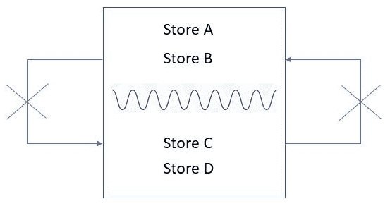
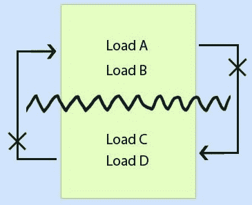
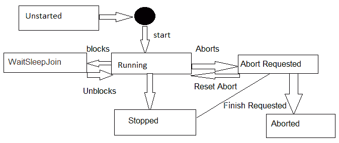
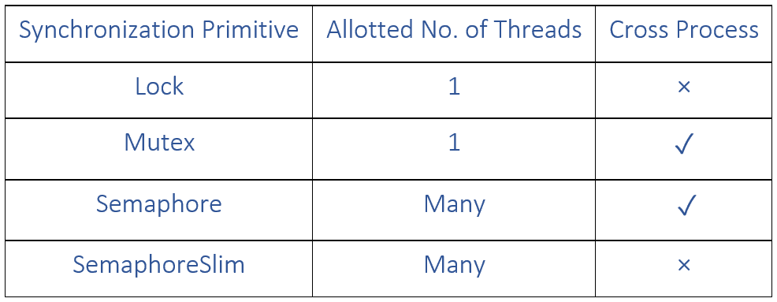
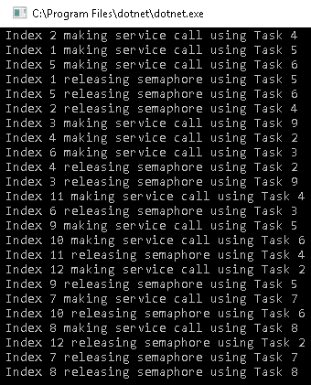
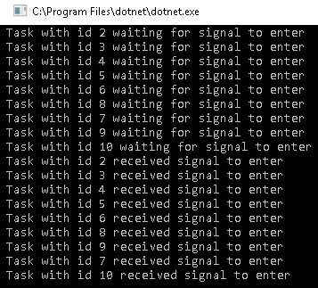
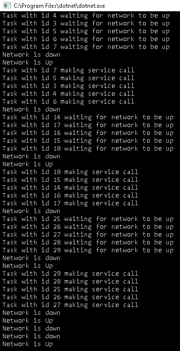
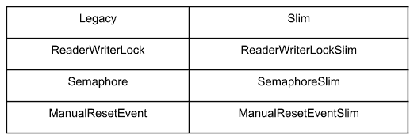
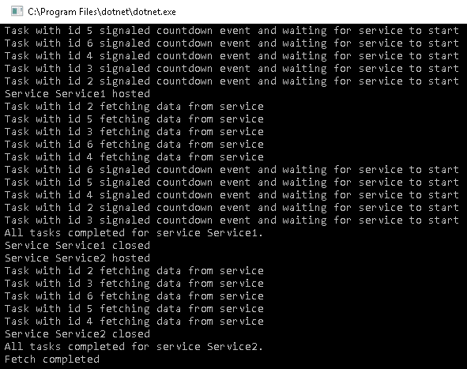
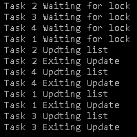

# 第五章：同步原语

在上一章中，我们讨论了并行编程的潜在缺陷之一是同步开销。当我们将工作分解为由多个工作项处理的任务时，就会出现需要同步每个线程的结果的情况。我们讨论了线程本地存储和分区本地存储的概念，可以在一定程度上解决这个同步问题。然而，仍然需要同步线程，以便我们可以将数据写入共享内存位置，并执行 I/O 操作。

在本章中，我们将讨论.NET Framework 和 TPL 提供的同步原语。

在本章中，我们将涵盖以下主题：

+   同步原语

+   原子操作

+   锁原语

+   信号原语

+   轻量级同步原语

+   屏障和倒计时事件

通过本章结束时，您将对.NET Framework 提供的各种锁定和信号原语有很好的理解，包括一些轻量级同步原语，应尽可能在需要同步的地方使用。

# 技术要求

要完成本章，您应该对 TPL 有很好的理解，主要是并行循环。本章的源代码可在 GitHub 上找到：[`github.com/PacktPublishing/Hands-On-Parallel-Programming-with-C-8-and-.NET-Core-3/tree/master/Chapter05`](https://github.com/PacktPublishing/Hands-On-Parallel-Programming-with-C-8-and-.NET-Core-3/tree/master/Chapter05)。

# 什么是同步原语？

在理解同步原语之前，我们需要了解临界区。临界区是线程执行路径的一部分，必须受到保护，以维护一些不变量。临界区本身不是同步原语，但依赖于同步原语。

同步原语是由底层平台（操作系统）提供的简单软件机制。它们有助于在内核中进行多线程处理。同步原语内部使用低级原子操作和内存屏障。这意味着同步原语的用户不必担心自己实现锁和内存屏障。一些常见的同步原语示例包括锁、互斥锁、条件变量和信号量。监视器是一种更高级的同步工具，它在内部使用其他同步原语。

.NET Framework 提供了一系列同步原语，用于处理线程之间的交互，以及避免潜在的竞争条件。同步原语可以大致分为五类：

+   原子操作

+   锁定

+   信号

+   轻量级同步类型

+   `SpinWait`

在接下来的章节中，我们将讨论每个类别及其各自的低级原语。

# 原子操作

Interlocked 类封装了同步原语，并用于为跨线程共享的变量提供原子操作。它提供了`Increment`、`Decrement`、`Add`、`Exchange`和`CompareExchange`等方法。

考虑以下代码，它尝试在并行循环中递增一个计数器：

```cs
Parallel.For(1, 1000, i =>
       {
           Thread.Sleep(100);
           _counter++;
       });
       Console.WriteLine($"Value for counter should be 999 and 
        is {_counter}");
```

如果我们运行此代码，将会看到以下输出：


如您所见，预期值和实际值不匹配。这是因为线程之间存在竞争条件，这是因为线程想要从一个变量中读取一个值，而该值尚未被提交。

我们可以使用`Interlocked`类修改上述代码，使其线程安全，如下所示：

```cs
Parallel.For(1, 1000, i =>
       {
           Thread.Sleep(100);
           Interlocked.Increment(ref _counter);
       });
       Console.WriteLine($"Value for counter should be 999 and 
        is {_counter}");
```

预期输出如下：


同样，我们可以使用`Interlocked.Decrement(ref _counter)`以线程安全的方式减少值。

以下代码显示了完整的操作列表：

```cs
 //_counter becomes 1
Interlocked.Increment(ref _counter);
// _counter becomes 0
Interlocked.Decrement(ref _counter);
// Add: _counter becomes 2 
Interlocked.Add(ref _counter, 2);
//Subtract: _counter becomes 0
Interlocked.Add(ref _counter, -2);
// Reads 64 bit field 
Console.WriteLine(Interlocked.Read(ref _counter)); 
// Swaps _counter value with 10 
Console.WriteLine(Interlocked.Exchange(ref _counter, 10));
//Checks if _counter is 10 and if yes replace with 100 
Console.WriteLine(Interlocked.CompareExchange(ref _counter, 100, 10)); 
// _counter becomes 100
```

除了前面的方法，.NET Framework 4.5 中还添加了两个新方法：`Interlocked.MemoryBarrier()`和`Interlocked.MemoryBarrierProcessWide()`。

在下一节中，我们将学习更多关于.NET 中的内存屏障。

# .NET 中的内存屏障

单核处理器和多核处理器上的线程模型工作方式不同。在单核处理器上，只有一个线程获得 CPU 时间片，而其他线程则等待它们的轮次。这确保了每当一个线程访问内存（用于加载和存储）时，它都是按正确的顺序进行的。这个模型也被称为**顺序一致性模型**。在多核处理器系统中，多个线程同时运行。在这些系统中，无法保证顺序一致性，因为硬件或**即时**（**JIT**）编译器可能会重新排序内存指令以提高性能。内存指令也可能会因为缓存、加载推测或延迟存储操作而进行重新排序以提高性能。

加载推测的示例如下：

```cs
a=b;
```

存储操作的示例如下：

```cs
c=1;
```

当编译器遇到加载和存储语句时，并不总是按照它们被编写的顺序执行。编译器会进行一些重新排序以获得性能上的好处。让我们试着更多地了解重新排序。

# 什么是重新排序？

对于给定的代码语句序列，编译器可以选择按照接收到的顺序执行它们，或者重新排序它们以提高性能，如果多个线程正在处理相同的代码。例如，看一下以下代码：

```cs
a = b;
c = 1;
```

前面的代码可以被重新排序并以以下顺序执行给另一个线程：

```cs
c = 1;
a = b;
```

对于具有弱内存模型的多核处理器（如英特尔 Itanium 处理器），代码重新排序是一个问题。然而，对于单核处理器来说，由于顺序一致性模型，它没有影响。代码被重组，以便另一个线程可以利用或存储已经在内存中的指令。代码重新排序可以由硬件或 JIT 编译器来完成。为了保证代码重新排序，我们需要某种**内存屏障**。

# 内存屏障的类型

内存屏障确保屏障上方或下方的任何代码语句都不会越过屏障，从而强制执行代码的顺序。有三种类型的内存屏障：

+   **存储（写入）内存屏障：**存储内存屏障确保不允许存储操作越过屏障。它对加载操作没有影响；这些操作仍然可以被重新排序。实现此效果的等效 CPU 指令是**SFENCE**：



+   **加载（读取）内存屏障：**加载屏障确保不允许加载操作越过屏障，但对存储操作不做任何强制。实现此效果的等效 CPU 指令是**LFENCE**：



+   **完整内存屏障：**完整内存屏障通过不允许存储或加载操作越过内存屏障来确保顺序。实现此效果的等效 CPU 指令是**MFENCE**。完整内存屏障的行为通常由.NET 同步构造实现，例如以下内容：

+   `Task.Start`、`Task.Wait`和`Task.Continuation`

+   `Thread.Sleep`、`Thread.Join`、`Thread.SpinWait`、`Thread.VolatileRead`和`Thread.VolatileWrite`

+   `Thread.MemoryBarrier`

+   `Lock`、`Monitor.Enter`和`Monitor.Exit`

+   `Interlocked`类的操作

`Volatile`关键字和`Volatile`类方法提供了半屏障。.NET Framework 提供了一些内置模式，使用类中的`Volatile`字段，如`Lazy<T>`和`LazyInitializer`。我们将在第七章中进一步讨论这些，*使用延迟初始化提高性能*。

# 使用构造避免代码重排序

我们可以使用`Thread.MemoryBarrier`避免重排序，如下面的代码所示：

```cs
static int a = 1, b = 2, c = 0;
private static void BarrierUsingTheadBarrier()
{
    b = c;
    Thread.MemoryBarrier();
    a = 1;
}
```

`Thread.MemoryBarrier`创建一个不允许加载或存储操作通过的完整屏障。它已经包装在`Interlocked.MemoryBarrier`中，因此可以将相同的代码编写如下：

```cs
private static void BarrierUsingInterlockedBarrier()
       {
           b = c;
           Interlocked.MemoryBarrier();
           a = 1;
       }
```

如果我们想创建一个进程范围和系统范围的屏障，我们可以使用.NET Core 2.0 中引入的`Interlocked.MemoryBarrierProcessWide`。这是对`FlushProcessWriteBuffer` Windows API 或 Linux 内核上的`sys_membarrier`的包装：

```cs
private static void BarrierUsingInterlockedProcessWideBarrier()
{
    b = c;
    Interlocked.MemoryBarrierProcessWide();
    a = 1;
}
```

前面的例子向我们展示了如何创建一个进程范围的屏障。现在，让我们来看看锁定原语是什么。

# 锁定原语简介

锁可以用来限制对受保护资源的访问，只允许单个线程或一组线程。为了能够有效地实现锁定，我们需要识别可以通过锁定原语保护的适当的临界区。

# 锁定的工作原理

当我们对共享资源应用锁时，执行以下步骤：

1.  一个线程或一组线程通过获取锁来访问共享资源。

1.  无法访问锁定的其他线程进入等待状态。

1.  一旦锁被一个线程释放，另一个线程就会获取它，并开始执行。

要理解锁定原语，我们需要了解各种线程状态，以及阻塞和自旋等概念。

# 线程状态

在线程的生命周期的任何时刻，我们都可以使用线程的`ThreadState`属性查询线程状态。线程可以处于以下任一状态：

+   `未启动`：线程已被 CLR 创建，但尚未调用`System.Threading.Thread.Start`方法。

+   `运行`：线程已通过调用`Thread.Start`启动。它不在等待任何未决操作。

+   `WaitSleepJoin`：由于调用`Wait()`、`Sleep()`或`Join()`方法，线程处于阻塞状态。

+   `停止请求`：线程已被请求停止。

+   `已停止`：线程已停止执行。

+   `中止请求`：在线程上调用了`Abort()`方法，但线程尚未被中止，因为它正在等待`ThreadAbortException`来尝试终止它。

+   `中止`：线程已被中止。

+   `暂停请求`：由于调用`Suspend`方法，线程被请求暂停。

+   `已暂停`：线程已被暂停。

+   `后台`：线程在后台执行。

让我们尝试探索线程从初始状态`未启动`到最终状态`已停止`的过程：



当 CLR 创建线程时，它处于`未启动`状态。当外部线程调用`Thread.Start()`方法时，它从`未启动`状态转换到`运行`状态。从`运行`状态，线程可以转换到以下状态：

+   `WaitSleepJoin`

+   `中止请求`

+   `已停止`

当线程处于`WaitSleepJoin`状态时，就说它被阻塞了。被阻塞的线程的执行被暂停，因为它正在等待一些外部条件的满足，这可能是一些 CPU 绑定的 I/O 操作或其他线程的结果。一旦被阻塞，线程立即放弃 CPU 时间片，并且在满足阻塞条件之前不使用处理器时间片。在这一点上，线程被解除阻塞。阻塞和解除阻塞构成了性能开销，因为这需要 CPU 进行上下文切换。

线程可以在以下事件中解除阻塞：

+   如果满足阻塞条件

+   通过在被阻塞的线程上调用`Thread.Interrupt`

+   通过使用`Thread.Abort`中止线程

+   当达到指定的超时时间

# 阻塞与自旋

阻塞的线程放弃处理器时间片段一段时间。这通过使其可用于其他线程来提高性能，但会产生上下文切换的开销。在线程必须被阻塞一段时间的情况下，这是很好的。如果等待时间较短，选择自旋而不放弃处理器时间片段是有意义的。例如，以下代码简单地无限循环：

```cs
while(!done);
```

这只是一个空的`while`循环，检查一个布尔变量。当等待结束时，变量将被设置为 false，循环可以中断。虽然这会浪费处理器时间，但如果等待时间不是很长，它可以显著提高性能。.NET Framework 提供了一些特殊的构造，我们将在本章后面讨论，比如`SpinWait`和`SpinLock`。

让我们尝试通过代码示例了解一些锁定原语。

# 锁，互斥锁和信号量

锁和互斥锁是锁定构造，只允许一个线程访问受保护的资源。锁是一个使用另一个更高级别的同步类`Monitor`的快捷实现。

信号量是一种锁定构造，允许指定数量的线程访问受保护的资源。锁只能在进程内部同步访问，但如果我们需要访问系统级资源或共享内存，我们实际上需要跨多个进程同步访问。互斥锁允许我们通过提供内核级别的锁来跨进程同步访问资源。

以下表格提供了这些构造的功能比较：



正如我们所看到的，**Lock**和**Mutex**只允许单线程访问共享资源，而**Semaphore**和**SemaphoreSlim**可以用于允许多个线程共享的资源。此外，**Lock**和**SemaphoreSlim**只能在进程内部工作，而**Mutex**和**Semaphore**具有进程范围的锁。

# 锁

让我们考虑以下代码，试图将一个数字写入文本文件：

```cs
var range = Enumerable.Range(1, 1000);
Stopwatch watch = Stopwatch.StartNew();
       for (int i = 0; i < range.Count(); i++)
       {
           Thread.Sleep(10);
           File.AppendAllText("test.txt", i.ToString());
       }
       watch.Stop();
       Console.WriteLine($"Total time to write file is 
        {watch.ElapsedMilliseconds}");
```

当我们运行上述代码时，输出如下：


正如你所看到的，任务由 1,000 个工作项组成，每个工作项大约需要 10 毫秒来执行。任务所花费的时间是 1,000 乘以 10，即 10,000 毫秒。我们还需要考虑执行 I/O 所花费的时间，因此总时间为 11,949。

让我们尝试使用`AsParallel()`和`AsOrdered()`子句并行化这个任务，如下所示：

```cs
range.AsParallel().AsOrdered().ForAll(i =>
{
    Thread.Sleep(10);
    File.AppendAllText ("test.txt", i.ToString());
});
```

当我们尝试运行这段代码时，我们会得到以下错误信息：`System.IO.IOException**:** 'The process cannot access the file …\test.txt' because it is being used by another process.'`。

实际发生的情况是，文件是一个共享资源，具有临界区，因此只允许原子操作。在并行代码中，我们有多个线程实际上尝试写入文件并导致异常的情况。我们需要确保代码尽可能快地并行运行，但在写入文件时也保持原子性。我们需要使用锁语句修改上述代码。

首先，声明一个`static`引用类型变量。在我们的例子中，我们使用`object`类型的变量。我们需要一个引用类型变量，因为锁只能应用于堆内存：

```cs
static object _locker = new object ();
```

接下来，我们修改`ForAll()`方法内的代码，包括一个`lock`：

```cs
range.AsParallel().AsOrdered().ForAll(i =>
       {
           lock (_locker)
           {
               Thread.Sleep(10);
               File.WriteAllText("test.txt", i.ToString());
           }
       });
```

现在，当我们运行这段代码时，不会出现任何异常，但任务所花费的时间实际上比顺序执行的时间更长：


这里出了什么问题？锁通过确保只有一个线程被允许访问易受攻击的代码来确保原子性，但这会带来阻塞等待锁被释放的线程的开销。我们称之为愚蠢的锁。我们可以稍微修改程序，只锁定关键部分以提高性能，同时保持原子性，如下所示：

```cs
range.AsParallel().AsOrdered().ForAll(i =>
       {
           Thread.Sleep(10);
           lock (_locker)
           {
               File.WriteAllText("test.txt", i.ToString());
           }
       });
```

以下是上述代码的输出：


正如你所看到的，通过混合同步和并行化，我们取得了显著的收益。我们可以使用另一个锁原语来实现类似的结果，即`Monitor`类。

锁实际上是一种简写语法，用于在`try`-`catch`块中包装`Monitor.Enter()`和`Monitor.Exit()`以实现原子性。因此，可以将相同的代码编写如下：

```cs
range.AsParallel().AsOrdered().ForAll(i =>
{
    Thread.Sleep(10);
    Monitor.Enter(_locker);
    try
    {
        File.WriteAllText("test.txt", i.ToString());
    }
    finally
    {
        Monitor.Exit(_locker);
    }
});
```

此代码的输出如下：


# 互斥体

上述代码适用于单个实例应用程序，因为任务在进程内运行，锁实际上锁定了进程内的内存屏障。如果我们运行应用程序的多个实例，两个应用程序将拥有自己的静态数据成员的副本，因此将锁定自己的内存屏障。这将允许每个进程中的一个线程实际进入临界区并尝试写入文件。这将导致以下`System.IO.IOException**:** 'The process cannot access the file …\test.txt' because it is being used by another process.'`。

为了能够将锁应用于共享资源，我们可以使用`mutex`类在内核级别应用锁。与锁类似，互斥体只允许一个线程访问受保护的资源，但也可以跨进程工作，因此只允许系统中的一个线程访问受保护的资源，而不管执行的进程数量如何。

互斥体可以是命名的或未命名的。未命名的互斥体的工作方式类似于锁，不能跨进程工作。

首先，我们将创建一个未命名的`Mutex`：

```cs
private static Mutex mutex = new Mutex();
```

然后，我们将修改前面的并行代码，以便我们可以像使用锁一样使用`Mutex`：

```cs
range.AsParallel().AsOrdered().ForAll(i =>
       {
           Thread.Sleep(10);
           mutex.WaitOne();
           File.AppendAllText("test.txt", i.ToString());
           mutex.ReleaseMutex(); 
       });
```

上述代码的输出如下：


使用`Mutex`类，我们可以调用`WaitHandle.WaitOne()`方法来锁定临界区，并使用`ReleaseMutex()`来解锁临界区。关闭或处理互斥体会自动释放它。

上述程序运行良好，但如果我们尝试在多个实例上运行它，它将抛出一个`IOException`。为此，我们可以创建一个`namedMutex`，如下所示：

```cs
private static Mutex namedMutex = new Mutex(false,"ShaktiSinghTanwar");
```

在调用`WaitOne()`时，我们可以选择指定一个超时，以便在等待一定时间内等待信号，然后解除阻塞。下面是一个示例：

```cs
namedMutex.WaitOne(3000);
```

如果未收到信号，上述互斥体将在三秒后解除阻塞。

锁和互斥体只能从获取它们的线程中释放。

# 信号量

锁，互斥体和监视器只允许一个线程访问受保护的资源。然而，有时我们需要允许多个线程能够访问共享资源。这些情况包括资源池化场景和限流场景。与锁或互斥体不同，`semaphore`是线程不可知的，这意味着任何线程都可以调用`semaphore`的释放。就像互斥体一样，它也可以跨进程工作。

典型的`semaphore`构造函数如下：


如你所见，它接受两个参数：`initialCount`，指定最初允许进入的线程数，以及`maximumCount`，指定可以进入的总线程数。

假设我们有一个远程服务，每个客户端只允许三个并发连接，并且需要一秒来处理一个请求，如下所示：

```cs
private static void DummyService(int i)
       {
           Thread.Sleep(1000);
       }
```

我们有一个方法，其中有 1,000 个工作项需要使用参数调用服务。我们需要并行处理一个任务，但也要确保在任何时候最多只有三次对服务的调用。我们可以通过创建一个最大计数为`3`的`信号量`来实现这一点：

```cs
Semaphore semaphore = new Semaphore(3,3);
```

现在，我们可以编写一些代码，可以模拟并行进行 1,000 次请求，但每次只能进行三次，使用以下`信号量`：

```cs
   range.AsParallel().AsOrdered().ForAll(i =>
            {
                semaphore.WaitOne();
                Console.WriteLine($"Index {i} making service call using 
                 Task {Task.CurrentId}" );
                //Simulate Http call
                CallService(i);
                Console.WriteLine($"Index {i} releasing semaphore using 
                  Task {Task.CurrentId}");
                semaphore.Release();
            });
```

这的输出如下：



正如您所看到的，三个线程进入并调用服务，而其他线程则等待锁被释放。一旦一个线程释放锁，另一个线程进入，但只有在任何时候有三个线程在临界区内。

信号量有两种类型：本地和全局。我们将在下面讨论这些。

# 本地信号量

本地`信号量`是在使用的应用程序中本地的。任何没有名称创建的`信号量`都将被创建为本地`信号量`，如下所示：

```cs
Semaphore semaphore = new Semaphore(1,10);
```

# 全局信号量

全局`信号量`是全局的，因为它应用于内核或系统级别的锁原语。任何使用名称创建的`信号量`都将被创建为全局`信号量`，如下所示：

```cs
Semaphore semaphore = new Semaphore(1,10,”Globalsemaphore”);
```

如果创建一个只有一个线程的`信号量`，它将起到锁的作用。

# 读写锁

`ReaderWriterLock`类定义了一个支持多个读取器和一次写入器的锁。这在共享资源经常被许多线程读取但不经常更新的情况下非常方便。.NET Framework 提供了两个读写锁类：`ReaderWriterLock`和`ReaderWriterLockSlim`。`ReaderWriterLock`现在几乎已经过时，因为它可能会导致潜在的死锁、降低性能、复杂的递归规则以及锁的升级或降级。我们将在本章后面更详细地讨论`ReaderWriterLockSlim`。

# 信号量原语介绍

并行编程的一个重要方面是任务协调。在创建任务时，您可能会遇到生产者/消费者场景，其中一个线程（消费者）正在等待另一个线程（生产者）更新共享资源。由于消费者不知道生产者何时会更新共享资源，它不断轮询共享资源，这可能导致竞争条件。轮询在处理这些情况时效率非常低。最好使用.NET Framework 提供的信号量原语。使用信号量原语，消费者线程暂停，直到它收到来自生产者线程的信号。让我们讨论一些常见的信号量原语，如`Thread.Join`，`WaitHandles`和`EventWaitHandlers`。

# 线程加入

这是我们可以使一个线程等待另一个线程的信号的最简单方法。`Thread.Join`是阻塞的，这意味着调用线程会被阻塞，直到加入的线程完成。可选地，我们可以指定一个超时，一旦超时到达，允许被阻塞的线程退出其阻塞状态。

在下面的代码中，我们将创建一个模拟长时间运行任务的子线程。完成后，它将更新名为`result`的本地变量的输出。程序应该在控制台上打印结果`10`。让我们尝试运行代码：

```cs
int result = 0;
Thread childThread = new Thread(() =>
{
    Thread.Sleep(5000);
    result = 10;
});
childThread.Start();
Console.WriteLine($"Result is {result}");
```

前面代码的输出如下：


我们期望的结果是`10`，但实际上是`0`。这是因为主线程在子线程完成执行之前就已经运行，我们可以通过在子线程上调用`Join()`来阻塞主线程，从而实现期望的行为，如下所示：

```cs
int result = 0;
Thread childThread = new Thread(() =>
{
    Thread.Sleep(5000);
    result = 10;
});
childThread.Start();
childThread.Join();
Console.WriteLine($"Result is {result}");
```

如果现在再次运行代码，我们将在等待五秒钟后看到期望的输出，主线程在此期间被阻塞：


# EventWaitHandle

`System.Threading.EventWaitHandle`类表示线程的同步事件。它作为`AutoResetEvent`和`ManualResetEvent`类的基类。我们可以通过调用`Set()`或`SignalAndWait()`来发出`EventWaitHandle`的信号。`EventWaitHandle`类没有任何线程关联性，因此可以被任何线程发出信号。让我们更多地了解`AutoResetEvent`和`ManualResetEvent`。

# AutoResetEvent

这是指自动重置的`WaitHandle`类。一旦它们被重置，它们允许一个线程通过创建的屏障。一旦线程通过，它们会再次被设置，从而阻塞线程直到下一个信号。

在以下示例中，我们试图以线程安全的方式找出 10 个数字的总和，而不使用锁。

首先，创建一个初始状态为非信号或`false`的`AutoResetEvent`。这意味着所有线程都应该等待直到收到信号。如果将初始状态设置为信号或`true`，第一个线程将通过，而其他线程将等待信号：

```cs
AutoResetEvent autoResetEvent = new AutoResetEvent(false);
```

接下来，创建一个发出信号的任务，使用`autoResetEvent.Set()`方法每秒发出 10 次信号：

```cs
Task signallingTask = Task.Factory.StartNew(() => {
    for (int i = 0; i < 10; i++)
    {
        Thread.Sleep(1000);
        autoResetEvent.Set();
    }
});
```

声明一个变量 sum 并将其初始化为`0`：

```cs
int sum = 0;
```

创建一个并行的`for`循环，创建 10 个任务。每个任务将立即开始并等待一个信号进入，因此在`autoResetEvent.WaitOne()`语句处阻塞。每秒钟，一个信号将被发送，一个线程将进入并更新`sum`：

```cs
 Parallel.For(1, 10, (i) => {
     Console.WriteLine($"Task with id {Task.CurrentId} waiting for 
      signal to enter");
     autoResetEvent.WaitOne();
     Console.WriteLine($"Task with id {Task.CurrentId} received 
      signal to enter");
     sum += i;
 });
```

输出如下：



如您所见，所有 10 个任务最初都被阻塞，每秒接收到信号后释放一个。

# ManualResetEvent

这是指需要手动重置的等待句柄。与`AutoResetEvent`不同，它只允许一个线程通过每个信号，`ManualResetEvent`允许线程继续通过，直到再次设置。让我们尝试使用一个简单的例子来理解这一点。

在以下示例中，我们需要并行地以每批 5 个的方式进行 15 次服务调用，每批之间延迟 2 秒。在进行服务调用时，我们需要确保系统连接到网络。为了模拟网络状态，我们将创建两个任务：一个信号网络关闭，一个信号网络开启。

首先，我们将创建一个初始状态为*关闭*的手动重置事件：

```cs
ManualResetEvent manualResetEvent = new ManualResetEvent(false);
```

接下来，我们将创建两个任务，通过每两秒触发一次网络*关闭*事件（阻塞所有网络调用）和每五秒触发一次网络*开启*事件（允许所有网络调用通过）来模拟网络的开启和关闭：

```cs
Task signalOffTask = Task.Factory.StartNew(() => {
           while (true)
           {
               Thread.Sleep(2000);
               Console.WriteLine("Network is down");
               manualResetEvent.Reset();
           }
       });
       Task signalOnTask = Task.Factory.StartNew(() => {
           while (true)
           {
               Thread.Sleep(5000);
               Console.WriteLine("Network is Up");
               manualResetEvent.Set();
           }
       });
```

如您从前面的代码中看到的，我们每五秒发出一次手动重置事件的信号，使用`manualResetEvent.Set()`。我们每两秒关闭一次它，使用`manualResetEvent.Reset()`。以下代码进行实际的服务调用：

```cs
for (int i = 0; i < 3; i++)
       {
           Parallel.For(0, 5, (j) => {
               Console.WriteLine($"Task with id {Task.CurrentId} waiting 
                for network to be up");
               manualResetEvent.WaitOne();
               Console.WriteLine($"Task with id {Task.CurrentId} making 
                service call");
               DummyServiceCall();
           });
           Thread.Sleep(2000);
       }
```

如您从前面的代码中看到的，我们创建了一个`for`循环，每次迭代创建五个任务，两次迭代之间的休眠间隔为两秒。

在进行服务调用之前，我们通过调用`manualResetEvent.WaitOne();`等待网络启动。

如果我们运行上述代码，将收到以下输出：



如您所见，五个任务立即启动并立即阻塞等待网络启动。五秒后，当网络启动时，我们使用`Set()`方法发出信号，所有五个线程通过进行服务调用。这将在`for`循环的每次迭代中重复。

# WaitHandles

`System.Threading.WaitHandle`是从`MarshalByRefObject`类继承的类，用于同步运行在应用程序中的线程。使用等待句柄来阻塞和发出信号以同步线程。线程可以通过调用`WaitHandle`类的任何方法来阻塞。它们根据所选的信号构造的类型而被释放。`WaitHandle`类的方法如下：

+   `WaitOne`：阻塞调用线程，直到它从等待的等待句柄接收到信号。

+   `WaitAll`：阻塞调用线程，直到它从等待的所有等待句柄接收到信号。

以下是一个示例，向我们展示了`WaitAll`的工作原理：

```cs
public static bool WaitAll (System.Threading.WaitHandle[] waitHandles, TimeSpan timeout, bool exitContext);
```

以下是一个示例，利用两个线程模拟两个不同的服务调用。两个线程将并行执行，但在打印总和到控制台之前将在`WaitHandle.WaitAll(waitHandles)`处等待：

```cs
static int _dataFromService1 = 0;
static int _dataFromService2 = 0;
private static void WaitAll()
{
    List<WaitHandle> waitHandles = new List<WaitHandle>
       {
            new AutoResetEvent(false),
            new AutoResetEvent(false)
       };
    ThreadPool.QueueUserWorkItem(new WaitCallback
     (FetchDataFromService1), waitHandles.First());
    ThreadPool.QueueUserWorkItem(new WaitCallback
     (FetchDataFromService2), waitHandles.Last());
    //Waits for all the threads (waitHandles) to call the .Set() 
    //method 
    //i.e. wait for data to be returned from both service
    WaitHandle.WaitAll(waitHandles.ToArray());
    Console.WriteLine($"The Sum is 
     {_dataFromService1 + _dataFromService2}");
}
private static void FetchDataFromService1(object state)
{
    Thread.Sleep(1000);
    _dataFromService1 = 890;
    var autoResetEvent = state as AutoResetEvent;
    autoResetEvent.Set();
}
private static void FetchDataFromService2(object state)
{
    Thread.Sleep(1000);
    _dataFromService2 = 3;
    var autoResetEvent = state as AutoResetEvent;
    autoResetEvent.Set();
}
```

上述代码的输出如下：


+   `WaitAny`：阻塞调用线程，直到它从等待的任何等待句柄接收到信号。

以下是`WaitAny`方法的签名：

```cs
public static int WaitAny (System.Threading.WaitHandle[] waitHandles);
```

以下是一个示例，利用两个线程执行项目搜索。两个线程将并行执行，并且程序在`WaitHandle.WaitAny(waitHandles)`方法中等待任何一个线程完成执行，然后将项目索引打印到控制台。

我们有两种方法，二分搜索和线性搜索，使用二进制和线性算法执行搜索。我们希望尽快从这两种方法中获得结果。我们可以通过使用`AutoResetEvent`进行信号传递，并将结果存储在`findIndex`和`winnerAlgo`全局变量中：

```cs
 static int findIndex = -1;
 static string winnerAlgo = string.Empty; 
 private static void BinarySearch(object state)
 {
     dynamic data = state;
     int[] x = data.Range;
     int valueToFind = data.ItemToFind;
     AutoResetEvent autoResetEvent = data.WaitHandle 
      as AutoResetEvent;
     //Search for item using .NET framework built in Binary Search
     int foundIndex = Array.BinarySearch(x, valueToFind);
     //store the result globally
     Interlocked.CompareExchange(ref findIndex, foundIndex, -1);
     Interlocked.CompareExchange(ref winnerAlgo, "BinarySearch", 
      string.Empty);
     //Signal event
     autoResetEvent.Set();
 }

 public static void LinearSearch( object state)
 {
     dynamic data = state;
     int[] x = data.Range;
     int valueToFind = data.ItemToFind;
     AutoResetEvent autoResetEvent = data.WaitHandle as AutoResetEvent;
     int foundIndex = -1;
     //Search for item linearly using for loop
     for (int i = 0; i < x.Length; i++)
     {
         if (valueToFind == x[i])
         {
             foundIndex = i;
         }
     }
     //store the result globally
     Interlocked.CompareExchange(ref findIndex, foundIndex, -1); 
     Interlocked.CompareExchange(ref winnerAlgo, "LinearSearch", 
       string.Empty); 
     //Signal event
     autoResetEvent.Set();
 }

```

以下代码使用`ThreadPool`并行调用两种算法：

```cs
 private static void AlgoSolverWaitAny()
 {
     WaitHandle[] waitHandles = new WaitHandle[]
     {
     new AutoResetEvent(false),
     new AutoResetEvent(false)
     };
     var itemToSearch = 15000;
     var range = Enumerable.Range(1, 100000).ToArray(); 
     ThreadPool.QueueUserWorkItem(new WaitCallback    
      (LinearSearch),new {Range = range,ItemToFind =           
      itemToSearch, WaitHandle= waitHandles[0] });
     ThreadPool.QueueUserWorkItem(new WaitCallback(BinarySearch), 
      new { Range = range, ItemToFind =         
      itemToSearch, WaitHandle = waitHandles[1] });
     WaitHandle.WaitAny(waitHandles);
     Console.WriteLine($"Item found at index {findIndex} and faster 
      algo is {winnerAlgo}" );
 }
```

+   SignalAndWait：此方法用于在等待句柄上调用`Set()`并为另一个等待句柄调用`WaitOne`。在多线程环境中，此方法可用于释放一个线程，然后重置以等待下一个线程：

```cs
public static bool SignalAndWait (System.Threading.WaitHandle toSignal, System.Threading.WaitHandle toWaitOn);
```

# 轻量级同步原语

.NET Framework 还提供了轻量级的同步原语，其性能优于其对应物。它们尽可能避免依赖内核对象，如等待句柄，因此只在进程内工作。当线程的等待时间较短时，应使用这些原语。我们可以将它们分为两类，在本节中我们将介绍这两类。

# Slim 锁

Slim 锁是传统同步原语的精简实现，可以通过减少开销来提高性能。

以下表格显示了传统同步原语及其精简对应物：



让我们尝试更多地了解 Slim 锁。

# ReaderWriterLockSlim

`ReaderWriterLockSlim`是`ReaderWriterLock`的轻量级实现。它表示一个锁，可用于以允许多个线程共享读取访问的方式管理受保护的资源，同时只允许一个线程写入访问。

以下示例使用`ReaderWriterLockSlim`来保护由三个读取线程和一个写入线程共享的列表上的访问：

```cs
static ReaderWriterLockSlim _readerWriterLockSlim = new ReaderWriterLockSlim();
static List<int> _list = new List<int>();
private static void ReaderWriteLockSlim()
{
    Task writerTask = Task.Factory.StartNew( WriterTask);
    for (int i = 0; i < 3; i++)
    {
        Task readerTask = Task.Factory.StartNew(ReaderTask);
    }
}
static void WriterTask()
{
    for (int i = 0; i < 4; i++)
    {
        try 
            {
            _readerWriterLockSlim.EnterWriteLock();
            Console.WriteLine($"Entered WriteLock on Task {Task.CurrentId}");
            int random = new Random().Next(1, 10);
            _list.Add(random);
            Console.WriteLine($"Added {random} to list on Task {Task.CurrentId}");
            Console.WriteLine($"Exiting WriteLock on Task {Task.CurrentId}");
            }
        finally
            {
             _readerWriterLockSlim.ExitWriteLock();
            }

        Thread.Sleep(1000);
    }
}
static void ReaderTask()
{
    for (int i = 0; i < 2; i++)
    {
       _readerWriterLockSlim.EnterReadLock();
       Console.WriteLine($"Entered ReadLock on Task {Task.CurrentId}"); 
       Console.WriteLine($"Items: {_list.Select(j=>j.ToString ()).Aggregate((a, b) => 
       a + "," + b)} on Task {Task.CurrentId}"); 
       Console.WriteLine($"Exiting ReadLock on Task {Task.CurrentId}"); 
        _readerWriterLockSlim.ExitReadLock();
        Thread.Sleep(1000);
    }
}
```

此代码的输出如下：


# SemaphoreSlim

`SemaphoreSlim`是`semaphore`的轻量级实现。它限制对受保护资源的访问，以供多个线程使用。

以下是本章前面展示的`semaphore`程序的精简版本：

```cs
 private static void ThrottlerUsingSemaphoreSlim()
        {
            var range = Enumerable.Range(1, 12);
            SemaphoreSlim semaphore = new SemaphoreSlim(3, 3);
            range.AsParallel().AsOrdered().ForAll(i =>
            {
                try
                {
                    semaphore.Wait();
                    Console.WriteLine($"Index {i} making service call using Task {Task.CurrentId}");
                    //Simulate Http call
                    CallService(i);
                    Console.WriteLine($"Index {i} releasing semaphore using Task {Task.CurrentId}");
                }
                finally
                {
                    semaphore.Release();
                }
            });
        }
        private static void CallService(int i)
        {
            Thread.Sleep(1000);
        }
```

我们可以看到这里的区别，除了用`SemaphoreSlim`替换`Semaphore`类之外，我们现在有了`Wait()`方法，而不是`WaitOne()`。这样做更有意义，因为我们允许多个线程通过。

另一个重要的区别是`SemaphoreSlim`总是作为本地`semaphore`创建，而`semaphore`可以全局创建。

# 手动重置事件 Slim

`ManualResetEventSlim`是`ManualResetEvent`的轻量级实现。它比`ManualResetEvent`具有更好的性能和更少的开销。

我们可以按照以下语法创建对象，就像`ManualResetEvent`一样：

```cs
ManualResetEventSlim manualResetEvent = new ManualResetEventSlim(false);
```

就像其他 slim 对应物一样，这里的一个主要区别是我们用`Wait()`替换了`WaitOne()`方法。

您可以尝试运行一些`ManualResetEvent`演示代码，通过进行上述更改并查看是否有效。

# 屏障和倒计时事件

.NET Framework 具有一些内置的信号原语，可以帮助我们同步多个线程，而无需编写大量的同步逻辑。所有同步都由提供的数据结构在内部处理。在本节中，让我们讨论两个非常重要的信号原语：`CountDownEvent`和`Barrier`：

+   **CountDownEvent**：`System.Threading.CountDownEvent`类指的是当其计数变为 0 时被触发的事件。

+   **屏障**：`Barrier`类允许多个线程在没有主线程控制它们的情况下运行。它创建了一个障碍，参与的线程必须在其中等待，直到所有线程都到达。`Barrier`非常适用于需要并行和分阶段进行工作的情况。

# 使用 Barrier 和 CountDownEvent 的案例研究

举个例子，假设我们需要从动态托管的两个服务中获取数据。在从服务一获取数据之前，我们需要托管它。一旦数据被获取，就需要关闭它。只有在服务一关闭后，我们才能启动服务二并从中获取数据。需要尽快获取数据。让我们创建一些代码来满足这种情况的要求。

创建一个有`5`个参与者的`Barrier`：

```cs
static Barrier serviceBarrier = new Barrier(5);
```

创建两个`CountdownEvents`，当六个线程通过它时将触发服务的启动或关闭。五个工作任务将参与其中，还有一个任务将管理服务的启动或关闭：

```cs
static CountdownEvent serviceHost1CountdownEvent = new CountdownEvent(6);
static CountdownEvent serviceHost2CountdownEvent = new CountdownEvent(6);
```

最后，创建另一个计数为`5`的`CountdownEvent`。这指的是在事件被触发之前可以通过的线程数。当所有工作任务执行完成时，`CountdownEvent`将被触发：

```cs
static CountdownEvent finishCountdownEvent = new CountdownEvent(5);
```

这是我们的`serviceManagerTask`实现：

```cs
     Task serviceManager = Task.Factory.StartNew(() =>
            {
                //Block until service name is set by any of thread
                while (string.IsNullOrEmpty(_serviceName))
                    Thread.Sleep(1000);
                string serviceName = _serviceName;
                HostService(serviceName);
                //Now signal other threads to proceed making calls to service1
                serviceHost1CountdownEvent.Signal();
                //Wait for worker tasks to finish service1 calls                                    
                serviceHost1CountdownEvent.Wait();
                //Block until service name is set by any of thread
                while (_serviceName != "Service2")
                    Thread.Sleep(1000);
                Console.WriteLine($"All tasks completed for service {serviceName}.");
                //Close current service and start the other service
                CloseService(serviceName);
                HostService(_serviceName);
                //Now signal other threads to proceed making calls to service2
                serviceHost2CountdownEvent.Signal();
                serviceHost2CountdownEvent.Wait();
                //Wait for worker tasks to finish service2 calls
                finishCountdownEvent.Wait();
                CloseService(_serviceName);
                Console.WriteLine($"All tasks completed for service {_serviceName}.");
            });
```

这是工作任务执行的方法：

```cs
        private static void GetDataFromService1And2(int j)
        {
            _serviceName = "Service1";
            serviceHost1CountdownEvent.Signal();
            Console.WriteLine($"Task with id {Task.CurrentId} signalled countdown event and waiting for   
            service to start");
            //Waiting for service to start
            serviceHost1CountdownEvent.Wait();
            Console.WriteLine($"Task with id {Task.CurrentId} fetching data from service ");
            serviceBarrier.SignalAndWait();
            //change servicename
            _serviceName = "Service2";
            //Signal Countdown event
            serviceHost2CountdownEvent.Signal();
            Console.WriteLine($"Task with id {Task.CurrentId} signalled countdown event and waiting for 
            service to start");
            serviceHost2CountdownEvent.Wait();
            Console.WriteLine($"Task with id {Task.CurrentId} fetching data from service ");
            serviceBarrier.SignalAndWait();
            //Signal Countdown event
            finishCountdownEvent.Signal();
        }
    //Finally make worker tasks
     for (int i = 0; i < 5; ++i)
            {
                int j = i;
                tasks[j] = Task.Factory.StartNew(() =>
                {
                    GetDataFromService1And2(j);
                });
            }
            Task.WaitAll(tasks);
            Console.WriteLine("Fetch completed");
```

上述代码的输出如下：



在本节中，我们已经看了一些内置的信号原语，这些原语可以帮助我们更轻松地进行代码同步，而无需作为开发人员锁定自己。阻塞仍然会带来性能成本，因为它涉及上下文切换。在下一节中，我们将看一些旋转技术，可以帮助消除上下文切换的开销。

# SpinWait

在本章的开头，我们提到对于较小的等待时间，旋转比阻塞更有效。旋转具有较少的与上下文切换和转换相关的内核开销。

我们可以按照以下方式创建`SpinWait`对象：

```cs
var spin = new SpinWait();
```

然后，无论我们需要进行`spin`，我们都可以调用以下命令：

```cs
spin.SpinOnce();
```

# SpinLock

如果获取锁的等待时间非常短，锁和互锁原语可能会显著降低性能。`SpinLock`提供了一种轻量级、低级别的替代锁定方法。`SpinLock`是一个值类型，因此如果我们想在多个地方使用相同的对象，我们需要通过引用传递它。出于性能原因，即使`SpinLock`甚至还没有获取锁，它也会让出线程的时间片，以便垃圾收集器可以有效工作。默认情况下，`SpinLock`不支持线程跟踪，这意味着确定哪个线程已经获取了锁。但是，这个特性可以被打开。这只建议用于调试，而不是用于生产，因为它会降低性能。

创建一个`SpinLock`对象如下：

```cs
 static SpinLock _spinLock = new SpinLock();
```

创建一个将被各个线程调用并更新全局静态列表的方法：

```cs
 static List<int> _itemsList = new List<int>();
        private static void SpinLock(int number)
        {
            bool lockTaken = false;
            try
            {
                Console.WriteLine($"Task {Task.CurrentId} Waiting for lock");                                
 _spinLock.Enter(ref lockTaken);                Console.WriteLine($"Task {Task.CurrentId} Updating list");
                _itemsList.Add(number);
            }
            finally
            {
                if (lockTaken)
                {
                    Console.WriteLine($"Task {Task.CurrentId} Exiting Update");
                    _spinLock.Exit(false);
                }
            }
        }
```

正如你所看到的，锁是使用`_spinLock.Enter(ref lockTaken)`获取的，并且通过`_spinLock.Exit(false)`释放。在这两个语句之间的所有内容将在所有线程之间同步执行。

让我们在一个并行循环中调用这个方法：

```cs
Parallel.For(1, 5, (i) => SpinLock(i));
```

如果我们使用锁定原语，这里是同步的输出：



作为一个经验法则，如果我们有小任务，可以通过自旋完全避免上下文切换。

# 摘要

在本章中，我们已经了解了.NET Core 提供的同步原语。如果要编写并行代码并确保其正确性，同步原语是必不可少的，即使多个线程在处理它。同步原语会带来性能开销，建议尽可能使用它们的精简版本。

我们还学习了信号原语，当线程需要处理一些外部事件时，这些原语非常有用。我们还讨论了屏障和倒计时事件，它们帮助我们避免代码同步问题，而无需编写额外的逻辑。最后，我们介绍了一些自旋技术，它们消除了由阻塞代码引起的性能开销，即`SpinLock`和`SpinWait`。

在下一章中，我们将了解.NET Core 提供的各种数据结构。这些数据结构是自动同步的，同时也是并行的。

# 问题

1.  这些中哪个可以用于跨进程同步？

1.  锁

1.  `Interlocked.Increment`

1.  `Interlocked.MemoryBarrierProcessWide`

1.  以下哪个不是有效的内存屏障？

1.  读取内存屏障

1.  半内存屏障

1.  完整内存屏障

1.  读取和执行内存屏障

1.  我们不能从以下哪种状态恢复线程？

1.  等待、休眠、加入

1.  暂停

1.  `中止`

1.  一个无名的`信号量`可以提供同步的地方？

1.  进程内部

1.  跨进程

1.  这些结构中哪个支持跟踪线程？

1.  `SpinWait`

1.  `SpinLock`
