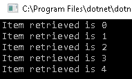
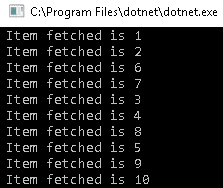

# 第六章：使用并发集合

在上一章中，我们看到了一些并行编程的实现，其中需要保护资源免受多个线程的并发访问。同步原语很难实现。通常，共享资源是一个需要多个线程读写的集合。由于集合可以以各种方式访问（例如使用`Enumerate`、`Read`、`Write`、`Sort`或`Filter`），因此使用原语编写具有受控同步的自定义集合变得棘手。因此，一直存在着对线程安全集合的需求。

在本章中，我们将学习 C#中可用的各种编程构造，这些构造有助于并行开发。以下是本章将涵盖的高级主题：

+   并发集合简介

+   多生产者/消费者场景

# 技术要求

您应该对 TPL 和 C#有很好的理解。本章的源代码可在 GitHub 上找到：[`github.com/PacktPublishing/Hands-On-Parallel-Programming-with-C-8-and-.NET-Core-3/tree/master/Chapter06`](https://github.com/PacktPublishing/Hands-On-Parallel-Programming-with-C-8-and-.NET-Core-3/tree/master/Chapter06)。

# 并发集合简介

从.NET Framework 4 开始，.NET 中添加了许多线程安全的集合。还添加了一个新的命名空间`System.Threading.Concurrent`。其中包括以下构造：

+   `IProducerConsumerCollection<T>`

+   `BlockingCollection<T>`

+   `ConcurrentDictionary<TKey,TValue>`

在使用上述结构时，不需要任何额外的同步，读取和更新都可以原子地完成。

在集合方面，线程安全并不是一个全新的概念。即使在旧的集合中，如`ArrayList`和`Hashtable`，也暴露了`Synchronized`属性，这使得可以以线程安全的方式访问这些集合。然而，这会带来性能损失，因为为了使集合线程安全，每次读取或更新操作都会将整个集合包装在锁内。

并发集合包装了轻量级、精简的同步原语，如`SpinLock`、`SpinWait`、`SemaphoreSlim`和`CountDownEvent`，因此使它们对核心的负担较轻。正如我们已经知道的，对于较短的等待时间，自旋比阻塞更有效。此外，如果等待时间增加，内置算法会将较轻的锁转换为内核锁。

# 引入 IProducerConsumerCollection<T>

生产者和消费者集合是提供了高效的无锁替代品的集合，例如`Stack<T>`和`Queue<T>`。任何生产者或消费者集合都必须允许用户添加和删除项目。.NET Framework 提供了`IProducerConsumerCollection<T>`接口，表示线程安全的堆栈、队列和包。以下是实现该接口的类：

+   `ConcurrentQueue<T>`

+   `ConcurrentStack<T>`

+   `ConcurrentBag<T>`

接口提供了两个重要的方法：`TryAdd`和`TryTake`。`TryAdd`的语法如下：

```cs
bool TryAdd (T item); 
```

`TryAdd`方法添加一个项目并返回`true`。如果添加项目时出现任何问题，它将返回`false`。

`TryTake`的语法如下：

```cs
bool TryTake (out T item);
```

`TryTake`方法移除一个项目并返回`true`。如果移除项目时出现任何问题，它将返回`false`。

# 使用 ConcurrentQueue<T>

并发队列可用于解决应用程序编程中的生产者/消费者场景。在生产者/消费者编程模式中，一个或多个线程生成数据，一个或多个线程消费数据。这会导致线程之间的竞争条件。我们可以通过以下方法解决这个问题：

+   使用队列

+   使用`ConcurrentQueue<T>`

根据哪个线程（生产者/消费者）负责添加/消费数据，生产者-消费者模式可以分为以下几种：

+   **纯生产者-消费者**，一个线程只能生产数据或只能消费数据，但不能两者兼而有之

+   **混合生产者-消费者**，任何线程都可以同时生产或消费数据

让我们首先尝试使用队列解决生产者-消费者问题。

# 使用队列解决生产者-消费者问题

在这个例子中，我们将使用`System.Collections`命名空间中定义的队列来创建生产者和消费者场景。将有多个任务尝试读取或写入队列，我们需要确保读取和写入是原子的：

1.  让我们首先创建`queue`并用一些数据填充它：

```cs
Queue<int> queue = new Queue<int>();
for (int i = 0; i < 500; i++) 
{
    queue.Enqueue(i);
}
```

1.  声明一个变量来保存最终结果：

```cs
int sum = 0;
```

1.  接下来，我们将创建一个并行循环，使用多个任务从队列中读取项目，并以线程安全的方式将总和添加到之前声明的 sum 变量中：

```cs
Parallel.For(0, 500, (i) =>
{
    int localSum = 0;
    int localValue;
    while (queue.TryDequeue(out localValue))
    {
        Thread.Sleep(10);
        localSum += localValue;
    }
    Interlocked.Add(ref sum, localSum);
});  
Console.WriteLine($"Calculated Sum is {sum} and should be {Enumerable.Range(0, 500).Sum()}");
```

如果我们运行程序，将得到以下输出。正如你所看到的，由于任务在尝试并发读取时发生了竞争条件，这不是预期的输出：


为了使前面的程序线程安全，我们可以通过修改并行循环代码来锁定关键部分，如下所示：

```cs
Parallel.For(0, 500, (i) =>
{
    int localSum = 0;
    int localValue;
    Monitor.Enter(_locker);
    while (cq.TryDequeue(out localValue))
    {
       Thread.Sleep(10);
       localSum += localValue;
    }
    Monitor.Exit(_locker);
    Interlocked.Add(ref sum, localSum);
});
```

同样，在更复杂的情况下，我们需要同步对并行代码中暴露给队列的所有读/写点。如果我们运行前面的代码，将得到以下输出：


正如你所看到的，一切都如预期的那样工作，尽管在频繁读取或写入的情况下，会有额外的同步开销，可能导致死锁。

# 使用并发队列解决问题

我们可以通过使用`System.Collections.Concurrent.ConcurrentQueue`类来解决生产者-消费者问题，这是一个线程安全的队列版本。让我们通过使用并发队列修改前面的代码，如下所示：

```cs
private static void ProducerConsumerUsingConcurrentQueues()
{
    // Create a Queue.
    ConcurrentQueue<int> cq = new ConcurrentQueue<int>();
    // Populate the queue.
    for (int i = 0; i < 500; i++){
        cq.Enqueue(i);
    }
    int sum = 0;
    Parallel.For(0, 500, (i) =>
    {
        int localSum = 0;
        int localValue;
        while (cq.TryDequeue(out localValue))
        {
            Thread.Sleep(10);
            localSum += localValue;
        }
        Interlocked.Add(ref sum, localSum);
    });
    Console.WriteLine($"outerSum = {sum}, should be {Enumerable.Range(0, 500).Sum()}");
}
```

正如你所看到的，我们刚刚在我们之前编写的代码中用`ConcurrentQueue<int>`替换了`Queue<int>`，这带来了同步开销。使用`ConcurrentQueue`，我们不必担心其他同步原语。

如果我们运行前面的代码，将得到以下输出：


就像`Queue<T>`一样，`ConcurrentQueue<T>`也以**先进先出**（**FIFO**）模式工作。

# 性能考虑 - Queue<T>与 ConcurrentQueue<T>

我们应该在以下情况下使用`ConcurrentQueue`，在这些情况下它比队列具有轻微或非常大的性能优势：

+   在纯生产者-消费者场景中，每个项目的处理时间非常低

+   在纯生产者-消费者场景中，只有一个专用生产者线程和一个专用消费者线程的情况

+   在纯生产者-消费者场景以及混合生产者-消费者场景中，处理时间为 500 **FLOPS**（**每秒浮点运算次数**）或更多

在混合生产者-消费者场景中，每个项目的处理时间较低时，我们应该使用队列而不是并发队列，以获得更好的性能。

# 使用 ConcurrentStack<T>

`ConcurrentStack<T>`是`Stack<T>`的并发版本，并实现了`IProducerConsumerCollection<T>`接口。我们可以从栈中推送或弹出项目，它以**后进先出**（**LIFO**）格式工作。它不涉及内核级锁定，而是依赖于自旋和比较和交换操作来消除任何争用。

以下是`ConcurrentStack<T>`类的一些重要方法：

+   `Clear`：从集合中移除所有元素

+   `Count`：返回集合中的元素数

+   `IsEmpty`：如果集合为空，则返回`true`

+   `Push (T item)`：向集合中添加一个元素

+   `TryPop (out T result)`:从集合中移除一个元素，并在移除项目时返回`true`；否则返回`false`

+   `PushRange (T [] items)`:原子性地向集合中添加一系列项目

+   `TryPopRange (T [] items)`:从集合中移除一系列项目

让我们看看如何创建一个并发堆栈实例。

# 创建一个并发堆栈

我们可以创建一个并发堆栈实例，并按以下方式添加项目：

```cs
ConcurrentStack<int> concurrentStack = new ConcurrentStack<int>();
concurrentStack.Push (1);
concurrentStack.PushRange(new[] { 1,2,3,4,5});
```

我们可以按以下方式从堆栈中获取项目：

```cs
int localValue;
concurrentStack.TryPop(out localValue)
concurrentStack.TryPopRange (new[] { 1,2,3,4,5});
```

以下是创建并发堆栈、添加项目并并行迭代项目的完整代码：

```cs
private static void ProducerConsumerUsingConcurrentStack()
{
    // Create a Queue.
    ConcurrentStack<int> concurrentStack = new ConcurrentStack<int>();
    // Populate the queue.
    for (int i = 0; i < 500; i++){
        concurrentStack.Push(i);
    }
    concurrentStack.PushRange(new[] { 1,2,3,4,5});
    int sum = 0;
    Parallel.For(0, 500, (i) =>
    {
        int localSum = 0;
        int localValue;
        while (concurrentStack.TryPop(out localValue))
        {
            Thread.Sleep(10);
            localSum += localValue;
        }
        Interlocked.Add(ref sum, localSum);
    });
    Console.WriteLine($"outerSum = {sum}, should be 124765");
}
```

输出如下：


# 使用 ConcurrentBag<T>

`ConcurrentBag<T>`是一个无序集合，不像`ConcurrentStack`和`ConcurrentQueues`，它在存储和检索项目时会对项目进行排序。`ConcurrentBag<T>`针对同一线程既作为生产者又作为消费者的场景进行了优化。`ConcurrentBag`支持工作窃取算法，并为每个线程维护一个本地队列。

以下代码创建`ConcurrentBag`并向其中添加或获取项目：

```cs
ConcurrentBag<int> concurrentBag = new ConcurrentBag<int>();
//Add item to bag
concurrentBag.Add(10);
int item;
//Getting items from Bag
concurrentBag.TryTake(out item)
```

完整代码如下：

```cs
static ConcurrentBag<int> concurrentBag = new ConcurrentBag<int>();
private static void ConcurrentBackDemo()
{
    ManualResetEventSlim manualResetEvent = new ManualResetEventSlim(false);
    Task producerAndConsumerTask = Task.Factory.StartNew(() =>
    {
        for (int i = 1; i <= 3; ++i)
        {
            concurrentBag.Add(i);
        }
        //Allow second thread to add items
        manualResetEvent.Wait();
        while (concurrentBag.IsEmpty == false)
        {
            int item;
            if (concurrentBag.TryTake(out item))
            {
                Console.WriteLine($"Item is {item}");
            }
        }
    });
    Task producerTask = Task.Factory.StartNew(() =>
    {
        for (int i = 4; i <= 6; ++i)
        {
            concurrentBag.Add(i);
        }
        manualResetEvent.Set();
    });
}
```

输出如下：


正如您所知，每个线程都有一个线程本地队列。项目 1、2 和 3 被添加到`producerAndConsumerTask`的本地队列中，项目 4、5 和 6 被添加到`producerTask`的本地队列中。当`producerAndConsumerTask`添加了项目后，我们等待`producerTask`完成推送其项目。一旦所有项目都被推送，`producerAndConsumerTask`开始检索项目。由于它已经推送了 1、2 和 3，这些项目在本地队列中，它将首先处理这些项目，然后再移动到`producerTask`的本地队列。

# 使用 BlockingCollection<T>

`BlockingCollection<T>`类是一个线程安全的集合，实现了`IProduceConsumerCollection<T>`接口。我们可以同时向集合中添加或移除项目，而不必担心同步问题，因为这些问题会被自动处理。会有两个线程：生产者和消费者。生产者线程将生成数据，我们可以限制生产者线程在进入休眠模式并被阻塞之前可以生产的最大项目数。消费者线程将消耗数据，并在集合为空时被阻塞。当生产者线程解除阻塞并消费者线程从集合中移除一些项目时，消费者线程将被解除阻塞。当生产者线程向集合中添加一些数据时，消费者线程将被解除阻塞。

阻塞集合有两个重要方面：

+   **边界**：这意味着我们可以将集合限制为最大值，之后不再能添加新对象，生产者线程进入休眠模式。

+   **阻塞**：这意味着当集合为空时，我们可以阻塞消费者线程。

让我们看看如何创建阻塞集合。

# 创建 BlockingCollection<T>

以下代码创建一个新的`BlockingCollection`，在创建 10 个项目后，它进入阻塞状态，然后由消费者线程消耗项目：

```cs
BlockingCollection<int> blockingCollection = new BlockingCollection<int>(10);
```

可以按以下方式向集合中添加项目：

```cs
blockingCollection.Add(1);
blockingCollection.TryAdd(3, TimeSpan.FromSeconds(1))
```

可以按以下方式从集合中移除项目：

```cs
int item = blockingCollection.Take();
blockingCollection.TryTake(out item, TimeSpan.FromSeconds(1))
```

当没有更多项目可添加时，生产者线程调用`CompleteAdding()`方法。这个方法会将集合的`IsAddingComplete`属性设置为`true`。

当集合为空且`IsAddingComplete`也为`true`时，消费者线程使用`IsCompleted`属性。这表明所有项目都已被处理，生产者将不再添加任何项目。

完整代码如下：

```cs
BlockingCollection<int> blockingCollection = new BlockingCollection<int>(10);
Task producerTask = Task.Factory.StartNew(() =>
{
    for (int i = 0; i < 5; ++i)
    {
        blockingCollection.Add(i);
    }
    blockingCollection.CompleteAdding();
});
Task consumerTask = Task.Factory.StartNew(() =>
{
    while (!blockingCollection.IsCompleted)
    {
        int item = blockingCollection.Take();
        Console.WriteLine($"Item retrieved is {item}");
    }
});
Task.WaitAll(producerTask, consumerTask);
```

输出如下：



现在，在介绍了并发集合之后，在下一节中，我们将尝试将生产者-消费者场景推进，并了解如何处理多个生产者/消费者。

# 多个生产者-消费者场景

在本节中，我们将看到当存在多个生产者和消费者线程时，阻塞集合是如何工作的。为了理解，我们将创建两个生产者和一个消费者。生产者线程将生产项目。一旦所有生产者线程都调用了`CompleteAdding`，消费者将开始从集合中读取项目：

1.  让我们从创建一个带有多个生产者的阻塞集合开始：

```cs
BlockingCollection<int>[] produceCollections = new BlockingCollection<int>[2];
produceCollections[0] = new BlockingCollection<int>(5);
produceCollections[1] = new BlockingCollection<int>(5);
```

1.  接下来，我们将创建两个生产者任务，它们将向生产者添加项目：

```cs
Task producerTask1 = Task.Factory.StartNew(() =>
{
    for (int i = 1; i <= 5; ++i)
    {
        produceCollections[0].Add(i);
        Thread.Sleep(100);
    }
    produceCollections[0].CompleteAdding();
});
Task producerTask2 = Task.Factory.StartNew(() =>
{
    for (int i = 6; i <= 10; ++i)
    {
        produceCollections[1].Add(i);
        Thread.Sleep(200);
    }
    produceCollections[1].CompleteAdding();
});
```

1.  最后，我们将编写消费者逻辑，尝试从两个生产者集合中消费项目，一旦项目可用即开始：

```cs
while (!produceCollections[0].IsCompleted || !produceCollections[1].IsCompleted)
{
 int item;
 BlockingCollection<int>.TryTakeFromAny(produceCollections, out item, TimeSpan.FromSeconds(1));
 if (item != default(int))
 {
 Console.WriteLine($"Item fetched is {item}");
 }
}
```

从前面的代码方法中可以看出，`TryTakeFromAny`尝试从多个生产者中读取项目，并在项目可用时返回。

输出如下：



在编程中，我们经常遇到需要并发存储数据作为键值对的情况。为此，`ConcurrentDictionary`集合非常方便，我们将在下一节介绍它。

# 使用 ConcurrentDictionary<TKey,TValue>

`ConcurrentDictionary<TKey,TValue>`表示线程安全的字典。它用于以线程安全的方式保存可以读取或写入的键值对。

`ConcurrentDictionary`可以按以下方式创建：

```cs
ConcurrentDictionary<int, int> concurrentDictionary = new ConcurrentDictionary<int, int>();
```

可以按以下方式向字典中添加项目：

```cs
concurrentDictionary.TryAdd(i, i * i);
string value = (i * i).ToString();
// Add item if not exist or else update
concurrentDictionary.AddOrUpdate(i, value,(key, val) => (key * key).ToString()); 
//Fetches item with key 5 or if not exist than add key 5 with value 25
concurrentDictionary.GetOrAdd(5, "25");
```

可以按以下方式从字典中移除项目：

```cs
string value;
concurrentDictionary.TryRemove(5, out value);
```

可以按以下方式更新字典中的项目：

```cs
//If a key with a value of 25 is found, it will be updated to have a value of 30      concurrentDictionary.TryUpdate(5, "30","25");
```

在下面的代码中，我们将创建两个生产者线程，它们将向字典中添加项目。生产者将创建一些重复的项目，字典将确保它们以线程安全的方式添加，而不会抛出重复键错误。生产者线程完成后，消费者将使用`keys`或`values`属性读取所有项目：

```cs
ConcurrentDictionary<int, string> concurrentDictionary = new ConcurrentDictionary<int, string>();
Task producerTask1 = Task.Factory.StartNew(() => 
{
    for (int i = 0; i < 20; i++)
    {
        Thread.Sleep(100);
        concurrentDictionary.TryAdd(i, (i * i).ToString());
    }
});
Task producerTask2 = Task.Factory.StartNew(() => 
{
    for (int i = 10; i < 25; i++)
    {
        concurrentDictionary.TryAdd(i, (i * i).ToString());
    }
});
Task producerTask3 = Task.Factory.StartNew(() => 
{
    for (int i = 15; i < 20; i++)
    {
        Thread.Sleep(100);
        concurrentDictionary.AddOrUpdate(i, (i * i).ToString(),(key, value) 
         => (key * key).ToString());
    }
});
Task.WaitAll(producerTask1, producerTask2);            
Console.WriteLine("Keys are {0} ", string.Join(",", concurrentDictionary.Keys.Select(c => c.ToString()).ToArray()));
```

输出如下：


在本节中，我们了解了并发集合在生产者-消费者场景中是非常方便的。使用并发集合，代码可以正确地处理多个任务，而无需自定义同步开销。

# 摘要

在本章中，我们讨论了.NET Framework 中的线程安全集合。并发集合位于`System.Collection.Concurrent`命名空间中，用于编程中的各种用例提供了各种集合。一些常见的用例需要包括字典、列表、包等的集合。

我们还讨论了生产者和消费者场景，其中一些线程生产数据，同时其他线程消费数据。通常，在这些场景中存在竞争条件，但并发集合可以有效地处理它们。

在下一章中，我们将学习通过延迟初始化模式来提高并行代码的性能。

# 问题

1.  以下哪个不是并发集合？

1.  `ConcurrentQueue<T>`

1.  `ConcurrentBag<T>`

1.  `ConcurrentStack<T>`

1.  `ConcurrentList<T>`

1.  当一个线程只能生产数据，另一个线程只能消费数据，而不能同时进行时，这种安排是什么？

1.  纯生产者-消费者

1.  混合生产者-消费者

1.  在纯生产者-消费者场景中，如果项目的处理时间较短，队列的性能将最佳。

1.  真

1.  假

1.  哪个不是`ConcurrentStack`的成员？

1.  `Push`

1.  `TryPop`

1.  `TryPopRange`

1.  `TryPush`
