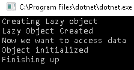
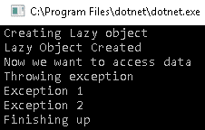
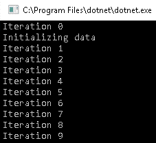
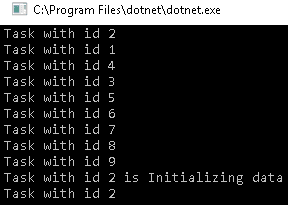

# 第七章：使用懒惰初始化提高性能

在上一章中，我们讨论了 C#中线程安全的并发集合。并发集合有助于提高并行代码的性能，而不需要开发人员担心同步开销。

在本章中，我们将讨论一些更多的概念，这些概念有助于改善代码的性能，既可以使用自定义实现，也可以使用内置结构。以下是本章将讨论的主题：

+   懒惰初始化概念介绍

+   介绍`System.Lazy<T>`

+   如何处理懒惰模式下的异常

+   使用线程本地存储进行懒惰初始化

+   通过懒惰初始化减少开销

让我们通过引入懒惰初始化模式开始。

# 技术要求

读者应该对 TPL 和 C#有很好的理解。本章的源代码可在 GitHub 上找到：[`github.com/PacktPublishing/-Hands-On-Parallel-Programming-with-C-8-and-.NET-Core-3/tree/master/Chapter07`](https://github.com/PacktPublishing/-Hands-On-Parallel-Programming-with-C-8-and-.NET-Core-3/tree/master/Chapter07)。

# 介绍懒惰初始化概念

懒加载是应用程序编程中常用的设计模式，其中我们推迟对象的创建，直到在应用程序中实际需要它。正确使用懒加载模式可以显著提高应用程序的性能。

这种模式的常见用法之一可以在缓存旁路模式中看到。我们使用缓存旁路模式来创建对象，这些对象的创建在资源或内存方面都很昂贵。我们不是多次创建它们，而是创建一次并将它们缓存以供将来使用。当对象的初始化从构造函数移动到方法或属性时，这种模式就成为可能。只有在代码首次调用方法或属性时，对象才会被初始化。然后它将被缓存以供后续调用。看一下以下代码示例，它在构造函数中初始化底层数据成员：

```cs
 class _1Eager
 {
     //Declare a private variable to hold data
     Data _cachedData;
     public _1Eager()
     {
         //Load data as soon as object is created
         _cachedData = GetDataFromDatabase();
     }
     public Data GetOrCreate()
     {
         return _cachedData;
     }
     //Create a dummy data object every time this method gets called
     private Data GetDataFromDatabase()
     {
         //Dummy Delay
         Thread.Sleep(5000);
         return new Data();
     }
 }

```

前面的代码问题在于，即使只有通过调用`GetOrCreate()`方法才能访问底层对象，但底层数据在对象创建时就被初始化了。在某些情况下，程序甚至可能不会调用该方法，因此会浪费内存。

懒加载可以完全使用自定义代码实现，如下面的代码示例所示：

```cs
 class _2SimpleLazy
 {
    //Declare a private variable to hold data
     Data _cachedData;

     public _2SimpleLazy()
     {
         //Removed initialization logic from constructor
         Console.WriteLine("Constructor called");
     }

     public Data GetOrCreate()
     {
         //Check is data is null else create and store for later use
         if (_cachedData == null)
         {
             Console.WriteLine("Initializing object");
             _cachedData = GetDataFromDatabase();
         }        
         Console.WriteLine("Data returned from cache");
         //Returns cached data
         return _cachedData;
     }

     private Data GetDataFromDatabase()
     {
         //Dummy Delay
         Thread.Sleep(5000);
         return new Data();
     }
 }
```

从前面的代码中可以看出，我们将初始化逻辑从构造函数移出到`GetOrCreate()`方法中，该方法在返回给调用者之前检查项目是否在缓存中。如果缓存中不存在，数据将被初始化。

以下是调用前面方法的代码：

```cs
public static void Main(){
    _2SimpleLazy lazy = new _2SimpleLazy();
     var data = lazy.GetOrCreate();
     data = lazy.GetOrCreate();
}
```

输出如下：


前面的代码虽然懒惰，但可能存在多重加载的问题。这意味着如果多个线程同时调用`GetOrCreate()`方法，数据库的调用可能会运行多次。

可以通过引入锁定来改进，如下面的代码示例所示。对于缓存旁路模式，使用另一种模式，双重检查锁定，是有意义的：

```cs
 class _2ThreadSafeSimpleLazy
 {
     Data _cachedData;
     static object _locker = new object();

     public Data GetOrCreate()
     {
         //Try to Load cached data
         var data = _cachedData;
         //If data not created yet
         if (data == null)
         {
             //Lock the shared resource
             lock (_locker)
             {
                 //Second try to load data from cache as it might have been 
                 //populate by another thread while current thread was 
                 // waiting for lock
                 data = _cachedData;
                 //If Data not cached yet
                 if (data == null)
                 {
                     //Load data from database and cache for later use
                     data = GetDataFromDatabase();
                     _cachedData = data;
                 }
             }
         }
         return _cachedData;
     }

     private Data GetDataFromDatabase()
     {
         //Dummy Delay
         Thread.Sleep(5000);
         return new Data();
     }
     public void ResetCache()
     {
         _cachedData = null;
     }
 }

```

前面的代码是自解释的。我们可以看到从头开始创建懒惰模式是复杂的。幸运的是，.NET Framework 提供了懒惰模式的数据结构。

# 引入 System.Lazy<T>

.NET Framework 提供了`System.Lazy<T>`类，具有懒惰初始化的所有好处，而无需担心同步开销。使用`System.Lazy<T>`创建的对象直到首次访问时才被延迟创建。通过前面部分解释的自定义懒惰代码，我们可以看到，我们将初始化部分从构造函数移动到方法/属性以支持懒惰初始化。使用`Lazy<T>`，我们不需要修改任何代码。

在 C#中有多种实现延迟初始化模式的方法。其中包括以下内容：

+   封装在构造函数中的构造逻辑

+   将构造逻辑作为委托传递给`Lazy<T>`

在接下来的部分，我们将深入了解这些情景。

# 封装在构造函数中的构造逻辑

让我们首先尝试使用封装构造逻辑的类来实现延迟初始化模式。假设我们有一个`Data`类：

```cs
 class DataWrapper
 {
     public DataWrapper()
     {
         CachedData = GetDataFromDatabase();
         Console.WriteLine("Object initialized");
     }
     public Data CachedData { get; set; }
     private Data GetDataFromDatabase()
     {
         //Dummy Delay
         Thread.Sleep(5000);
         return new Data();
     }
 }
```

如您所见，初始化发生在构造函数内部。如果我们正常使用这个类，使用以下代码，对象在创建`DataWrapper`对象时被初始化：

```cs
 DataWrapper dataWrapper = new DataWrapper();

```

输出如下：


可以使用`Lazy<T>`将上述代码转换如下：

```cs
 Console.WriteLine("Creating Lazy object");
 Lazy<DataWrapper> lazyDataWrapper = new Lazy<DataWrapper>();
 Console.WriteLine("Lazy Object Created");
 Console.WriteLine("Now we want to access data");
 var data = lazyDataWrapper.Value.CachedData;
 Console.WriteLine("Finishing up");
```

如您所见，我们将对象包装在延迟类中，而不是直接创建对象。在访问`Lazy`对象的`Value`属性之前，构造函数不会被调用，如下面的输出所示：



# 将构造逻辑作为委托传递给 Lazy<T>

对象通常不包含构造逻辑，因为它们只是简单的数据模型。我们需要在首次访问延迟对象时获取数据，同时还要传递获取数据的逻辑。这可以通过`System.Lazy<T>`的另一个重载来实现，如下所示：

```cs
 class _5LazyUsingDelegate
 {
     public Data CachedData { get; set; }
     static Data GetDataFromDatabase()
     {
         Console.WriteLine("Fetching data");
         //Dummy Delay
         Thread.Sleep(5000);
         return new Data();
     }
 }
```

在以下代码中，我们通过传递`Func<Data>`委托来创建一个`Lazy<Data>`对象：

```cs
 Console.WriteLine("Creating Lazy object");
 Func<Data> dataFetchLogic = new Func<Data>(()=> GetDataFromDatabase());
 Lazy<Data> lazyDataWrapper = new Lazy<Data>(dataFetchLogic);
 Console.WriteLine("Lazy Object Created");
 Console.WriteLine("Now we want to access data");
 var data = lazyDataWrapper.Value;
 Console.WriteLine("Finishing up");
```

从上面的代码中可以看出，我们将`Func<T>`传递给`Lazy<T>`构造函数。逻辑在第一次访问`Lazy<T>`实例的`Value`属性时被调用，如下面的输出所示：


除了对.NET 中的延迟对象进行构造和使用有一个好的理解之外，我们还需要了解如何处理延迟初始化模式中的异常！让我们看看下一节。

# 使用延迟初始化模式处理异常

Lazy 对象是不可变的。这意味着它们总是返回与初始化时相同的实例。我们已经看到可以将初始化逻辑传递给`Lazy<T>`，并且可以在底层对象的构造函数中有初始化逻辑。如果构造/初始化逻辑有错误并抛出异常会发生什么？在这种情况下，`Lazy<T>`的行为取决于`LazyThreadSafetyMode`枚举的值和您选择的`Lazy<T>`构造函数。在使用延迟模式时，有许多处理异常的方法。其中一些如下：

+   在初始化过程中不会发生异常

+   在异常缓存的情况下进行初始化时发生随机异常

+   不缓存异常

在接下来的部分，我们将深入了解这些情景。

# 在初始化过程中不会发生异常

初始化逻辑只运行一次，并且对象被缓存以便在后续访问`Value`属性时返回。我们在前面的部分已经看到了这种行为，解释了`Lazy<T>`。

# 在异常缓存的情况下进行初始化时发生随机异常

在这种情况下，由于底层对象没有被创建，所以初始化逻辑将在每次调用`Value`属性时运行。这在构造逻辑依赖于外部因素（如调用外部服务时的互联网连接）的情况下非常有用。如果互联网暂时中断，那么初始化调用将失败，但后续调用可以返回数据。默认情况下，`Lazy<T>`将为所有带参数的构造函数实现缓存异常，但不会为不带参数的构造函数实现缓存异常。

让我们尝试理解当`Lazy<T>`初始化逻辑抛出随机异常时会发生什么：

1.  首先，我们使用`GetDataFromDatabase()`函数提供的初始化逻辑创建`Lazy<Data>`，如下所示：

```cs
Func<Data> dataFetchLogic = new Func<Data>(() => GetDataFromDatabase());
Lazy<Data> lazyDataWrapper = new Lazy<Data>(dataFetchLogic);
```

1.  接下来，我们访问`Lazy<Data>`的`Value`属性，这将执行初始化逻辑并抛出异常，因为计数器的值为`0`：

```cs
 try
 {
     data = lazyDataWrapper.Value;
     Console.WriteLine("Data Fetched on Attempt 1");
 }
 catch (Exception)
 {
     Console.WriteLine("Exception 1");
 }
```

1.  接下来，我们将计数器加一，然后再次尝试访问`Value`属性。根据逻辑，这次应该返回`Data`对象，但我们看到代码再次抛出异常：

```cs
 class _6_1_ExceptionsWithLazyWithCaching
 {
     static int counter = 0;
     public Data CachedData { get; set; }
     static Data GetDataFromDatabase()
     {
         if ( counter == 0)
         {
             Console.WriteLine("Throwing exception");
             throw new Exception("Some Error has occurred");
         }
         else
         {
             return new Data();
         }
     }

     public static void Main()
     {
         Console.WriteLine("Creating Lazy object");
         Func<Data> dataFetchLogic = new Func<Data>(() => 
          GetDataFromDatabase());
         Lazy<Data> lazyDataWrapper = new 
          Lazy<Data>(dataFetchLogic);
         Console.WriteLine("Lazy Object Created");
         Console.WriteLine("Now we want to access data");
         Data data = null;
         try
         {
             data = lazyDataWrapper.Value;
             Console.WriteLine("Data Fetched on Attempt 1");
         }
         catch (Exception)
         {
             Console.WriteLine("Exception 1");
         }
         try
         {
             counter++;
             data = lazyDataWrapper.Value;
             Console.WriteLine("Data Fetched on Attempt 1");
         }
         catch (Exception)
         {
             Console.WriteLine("Exception 2");
             // throw;
         }
         Console.WriteLine("Finishing up");
         Console.ReadLine();
     }
 }
```

如您所见，即使我们将计数器增加了一次，异常仍然被抛出第二次。这是因为异常值被缓存，并在下次访问`Value`属性时返回。输出如下所示：



上述行为与通过将`System.Threading.LazyThreadSafetyMode.None`作为第二个参数创建`Lazy<T>`相同：

```cs
Lazy<Data> lazyDataWrapper = new Lazy<Data>(dataFetchLogic,System.Threading.LazyThreadSafetyMode.None);
```

# 不缓存异常

让我们将上述代码中`Lazy<Data>`的初始化更改为以下内容：

```cs
Lazy<Data> lazyDataWrapper = new Lazy<Data>(dataFetchLogic,System.Threading.LazyThreadSafetyMode.PublicationOnly);

```

这将允许初始化逻辑在不同线程中多次运行，直到其中一个线程成功运行初始化而没有任何错误。如果在多线程场景中的初始化过程中任何线程抛出错误，则由已完成的线程创建的基础对象的所有实例都将被丢弃，并且异常将传播到`Value`属性。在单线程的情况下，当再次访问`Value`属性时，初始化逻辑重新运行时会返回异常。异常不会被缓存。

输出如下：


在了解了延迟初始化模式处理异常的方法之后，现在让我们学习一下使用线程本地存储进行延迟初始化。

# 使用线程本地存储进行延迟初始化

在多线程编程中，我们经常希望创建一个局部于线程的变量，这意味着每个线程都将拥有数据的自己的副本。这对于所有局部变量都成立，但全局变量始终在各个线程之间共享。在旧版本的.NET 中，我们使用`ThreadStatic`属性使静态变量表现为线程本地变量。然而，这并不是绝对可靠的，并且在初始化方面效果不佳。如果我们初始化一个`ThreadStatic`变量，那么只有第一个线程获得初始化的值，而其余线程获得变量的默认值，在整数的情况下为 0。可以使用以下代码进行演示：

```cs
 [ThreadStatic]
 static int counter = 1;
 public static void Main()
 {
     for (int i = 0; i < 10; i++)
     {
         Task.Factory.StartNew(() => Console.WriteLine(counter));
     }
     Console.ReadLine();
 }

```

在上面的代码中，我们使用值为`1`的静态`counter`变量进行初始化，并将其线程静态化，以便每个线程都可以拥有自己的副本。为了演示目的，我们创建了 10 个任务，打印计数器的值。根据逻辑，所有线程应该打印 1，但如下输出所示，只有一个线程打印 1，其余线程打印 0：


.NET Framework 4 提供了`System.Threading.ThreadLocal<T>`作为`ThreadStatic`的替代方案，并且更像`Lazy<T>`。使用`ThreadLocal<T>`，我们可以创建一个可以通过传递初始化函数进行初始化的线程本地变量，如下所示：

```cs
 static ThreadLocal<int> counter = new ThreadLocal<int>(() => 1);
 public static void Main()
 {
     for (int i = 0; i < 10; i++)
     {
         Task.Factory.StartNew(() => Console.WriteLine($"Thread with 
          id {Task.CurrentId} has counter value as {counter.Value}"));
     }
     Console.ReadLine();
 }
```

输出如预期的那样：


`Lazy<T>`和`ThreadLocal<T>`之间的区别如下：

+   每个线程都使用自己的私有数据初始化`ThreadLocal`变量，而在`Lazy<T>`的情况下，初始化逻辑只运行一次。

+   与`Lazy<T>`不同，`ThreadLocal<T>`中的`Value`属性是可读/写的。

+   在没有任何初始化逻辑的情况下，默认值`T`将被分配给`ThreadLocal`变量。

# 通过延迟初始化减少开销

`Lazy<T>`通过包装底层对象使用了一定程度的间接性。这可能会导致计算和内存问题。为了避免包装对象，我们可以使用`Lazy<T>`类的静态变体，即`LazyInitializer`类。

我们可以使用`LazyInitializer.EnsureInitialized`来初始化通过引用传递的数据成员以及初始化函数，就像我们使用`Lazy<T>`一样。

该方法可以通过多个线程调用，但一旦值被初始化，它将作为所有线程的结果使用。为了演示起见，我在初始化逻辑中添加了一行到控制台。虽然循环运行 10 次，但初始化将仅在单线程执行一次：

```cs
 static Data _data;
 public static void Main()
 {
     for (int i = 0; i < 10; i++)
     {
         Console.WriteLine($"Iteration {i}");
         // Lazily initialize _data
         LazyInitializer.EnsureInitialized(ref _data, () =>
         {
             Console.WriteLine("Initializing data");
             // Returns value that will be assigned in the ref parameter.
             return new Data();
         });
     }
     Console.ReadLine();
 }
```

以下是输出：



这对于顺序执行是很好的。让我们尝试修改代码并通过多个线程运行它：

```cs
static Data _data;
static void Initializer()
{
     LazyInitializer.EnsureInitialized(ref _data, () =>
     {
         Console.WriteLine($"Task with id {Task.CurrentId} is 
          Initializing data");
         // Returns value that will be assigned in the ref parameter.
         return new Data();
     });

    public static void Main()
     {
         Parallel.For(0, 10, (i) => Initializer());
         Console.ReadLine();
     }
}
```

以下是输出：


如您所见，使用多个线程会出现竞争条件，所有线程最终都会初始化数据。我们可以通过修改程序来避免这种竞争条件：

```cs
 static Data _data;
 static bool _initialized;
 static object _locker = new object();
 static void Initializer()
 {
     Console.WriteLine("Task with id {0}", Task.CurrentId);
     LazyInitializer.EnsureInitialized(ref _data,ref _initialized, 
      ref _locker, () =>
     {
         Console.WriteLine($"Task with id {Task.CurrentId} is 
          Initializing data");
         // Returns value that will be assigned in the ref parameter.
         return new Data();
     });
 }
 public static void Main()
 {
     Parallel.For(0, 10, (i) => Initializer());
     Console.ReadLine();
 }
```

从上面的代码中可以看出，我们使用了`EnsureInitialized`方法的一个重载，并传递了一个布尔变量和一个`SyncLock`对象作为参数。这将确保初始化逻辑只能由一个线程执行，如下面的输出所示：



在本节中，我们讨论了如何通过利用另一个内置的静态变体`Lazy<T>`，即`LazyInitializer`类，来解决与`Lazy<T>`相关的开销问题。

# 总结

在本章中，我们讨论了延迟加载的各个方面，以及.NET Framework 提供的数据结构，使延迟加载更容易实现。

延迟加载可以通过减少内存占用和节省计算资源来显著提高应用程序的性能，因为它可以阻止重复初始化。我们可以选择使用`Lazy<T>`从头开始创建延迟加载，也可以使用静态的`LazyInitializer`类来避免复杂性。通过最佳的线程存储使用和良好的异常处理逻辑，这些工具对开发人员来说确实是很好的工具。

在下一章中，我们将开始讨论 C#中可用的异步编程方法。

# 问题

1.  延迟初始化总是涉及在构造函数中创建对象。

1.  True

1.  False

1.  在延迟初始化模式中，对象的创建被推迟，直到实际需要它。

1.  True

1.  False

1.  哪个选项可以用来创建不缓存异常的延迟对象？

1.  `LazyThreadSafetyMode.DoNotCacheException`

1.  `LazyThreadSafetyMode.PublicationOnly`

1.  哪个属性可以用来创建一个只对线程本地的变量？

1.  `ThreadLocal`

1.  `ThreadStatic`

1.  两者
