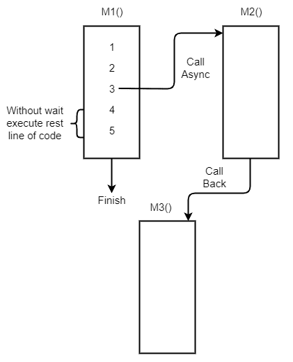

# 第八章：异步编程简介

在之前的章节中，我们已经看到并行编程是如何工作的。并行性是关于创建称为工作单元的小任务，可以由一个或多个应用程序线程同时执行。由于线程在应用程序进程内运行，它们在使用委托通知调用线程完成后通知调用线程。

在本章中，我们将首先介绍同步代码和异步代码之间的区别。然后，我们将讨论何时使用异步代码以及何时避免使用它。我们还将讨论异步模式如何随时间演变。最后，我们将看到并行编程中的新特性如何帮助我们解决异步代码的复杂性。

在本章中，我们将涵盖以下主题：

+   同步与异步代码

+   何时使用异步编程

+   何时避免异步编程

+   使用异步代码可以解决的问题

+   C#早期版本中的异步模式

# 技术要求

要完成本章，您应该对 TPL 和 C#有很好的理解。本章的源代码可在 GitHub 上找到[`github.com/PacktPublishing/Hands-On-Parallel-Programming-with-C-8-and-.NET-Core-3/tree/master/Chapter08`](https://github.com/PacktPublishing/Hands-On-Parallel-Programming-with-C-8-and-.NET-Core-3/tree/master/Chapter08)。

# 程序执行的类型

在任何时刻，程序流程可以是同步的，也可以是异步的。同步代码编写和维护更容易，但会带来性能开销和 UI 响应性问题。异步代码可以提高整个应用程序的性能和响应性，但反过来，编写、调试和维护都更加困难。

我们将在以下子章节中详细了解程序执行的同步和异步方式。

# 理解同步程序执行

在同步执行的情况下，控制永远不会移出调用线程。代码一次执行一行，当调用函数时，调用线程会等待函数执行完成后再执行下一行代码。同步编程是最常用的编程方法，由于过去几年 CPU 性能的提高，它运行良好。随着处理器速度更快，代码完成得更快。

通过并行编程，我们已经看到可以创建多个可以并发运行的线程。我们可以启动许多线程，但也可以通过调用`Thread.Join`和`Task.Wait`等结构使主程序流程同步。让我们看一个同步代码的例子：

1.  我们通过调用`M1()`方法启动应用程序线程。

1.  在第 3 行，`M1()`同步调用`M3()`。

1.  调用`M2()`方法的时刻，控制执行转移到`M1()`方法。

1.  一旦被调用的方法（`M2`）完成，控制返回到主线程，执行`M1()`中的其余代码，即第 4 和第 5 行。

1.  在第 5 行对`M2`的调用也是同样的情况。当`M2`完成时，第 6 行执行。

以下是同步代码执行的图解表示：


在接下来的部分，我们将尝试更多地了解编写异步代码，这将帮助我们比较两种程序流程。

# 理解异步程序执行

异步模型允许我们同时执行多个任务。如果我们异步调用一个方法，该方法将在后台执行，而调用的线程立即返回并执行下一行代码。异步方法可能会创建线程，也可能不会，这取决于我们处理的任务类型。当异步方法完成时，它通过回调将结果返回给程序。异步方法可以是 void，这种情况下我们不需要指定回调。

以下是一个图表，显示了一个调用者线程执行`M1()`方法，该方法调用了一个名为`M2()`的异步方法：



与以前的方法相反，在这里，调用者线程不等待`M2()`完成。如果需要利用`M2()`的任何输出，需要将其放入其他方法，比如`M3()`。这是发生的事情：

1.  在执行`M1()`时，调用者线程对`M2()`进行异步调用。

1.  调用者线程在调用`M2()`时提供回调函数，比如`M3()`。

1.  调用者线程不等待`M2()`完成，而是完成`M1()`中的其余代码（如果有的话）。

1.  `M2()`将由 CPU 立即在一个单独的线程中执行，或者在以后的某个日期执行。

1.  一旦`M2()`完成，将调用`M3()`，`M3()`接收来自`M2()`的输出并对其进行处理。

正如您所看到的，理解同步程序的执行很容易，而异步代码则带有代码分支。我们将学习如何使用`async`和`await`关键字在第九章中减轻这种复杂性，*异步、等待和基于任务的异步编程基础*。

# 何时使用异步编程

有许多情况下会使用**直接内存访问**（**DMA**）来访问主机系统或进行 I/O 操作（如文件、数据库或网络访问），这是 CPU 而不是应用程序线程进行处理。在前面的情况下，调用线程调用 I/O API 并等待任务完成，从而进入阻塞状态。当 CPU 完成任务时，线程将解除阻塞并完成方法的其余部分。

使用异步方法，我们可以提高应用程序的性能和响应能力。我们还可以通过不同的线程执行一个方法。

# 编写异步代码

异步编程对 C#来说并不是什么新鲜事。我们过去在较早版本的 C#中使用`Delegate`类的`BeginInvoke`方法以及使用`IAsyncResult`接口实现来编写异步代码。随着 TPL 的引入，我们开始使用`Task`类编写异步代码。从 C# 5.0 开始，开发人员编写异步代码的首选选择是使用`async`和`await`关键字。

我们可以以以下方式编写异步代码：

+   使用`Delegate.BeginInvoke()`方法

+   使用`Task`类

+   使用`IAsyncResult`接口

+   使用`async`和`await`关键字

在接下来的章节中，我们将通过代码示例详细讨论每个内容，除了`async`和`await`关键字 - 第九章专门讨论它们！

# 使用 Delegate 类的 BeginInvoke 方法

在.NET Core 中不再支持使用`Delegate.BeginInvoke`，但是我们将在这里讨论它，以便与较早版本的.NET 向后兼容。

我们可以使用`Delegate.BeginInvoke`方法异步调用任何方法。如果需要将一些任务从 UI 线程移动到后台以提高 UI 的性能，可以这样做。

让我们以`Log`方法为例。以下代码以同步方式工作并写入日志。为了演示，日志记录代码已被删除，并替换为一个虚拟的 5 秒延迟，之后`Log`方法将在控制台打印一行：

这是一个虚拟的`Log`方法，需要 5 秒才能完成：

```cs
private static void Log(string message)
{
    //Simulate long running method
    Thread.Sleep(5000);
    //Log to file or database
    Console.WriteLine("Logging done");
}
```

这是从`Main`方法调用`Log`方法：

```cs
  static void Main(string[] args)
  {
     Console.WriteLine("Starting program");
     Log("this information need to be logged");
     Console.WriteLine("Press any key to exit");
     Console.ReadLine();
  }       
```

很明显，写日志需要 5 秒的延迟太长了。由于我们不希望从`Log`方法中得到任何输出（将控制台输出仅用于演示目的），因此将其异步调用并立即将响应返回给调用者是有意义的。

以下是当前程序的输出：


我们可以在前面的方法中添加一个`Log`方法调用。然后，我们可以将`Log`方法调用包装在一个委托中，并在委托上调用`BeginInvoke`方法，如下所示：

```cs
//Log("this information need to be logged");
Action logAction = new Action(()=> Log("this information need to be logged"));                 logAction.BeginInvoke(null,null);
```

这次，当我们执行代码时，我们将在较早版本的.NET 中看到异步行为。然而，在.NET Core 中，代码在运行时会出现以下错误消息：

`System.PlatformNotSupportedException: 'Operation is not supported on this platform.'`

在.NET Core 中，不再支持将同步方法包装成异步委托，原因有两个：

+   异步委托使用基于`IAsyncResult`的异步模式，这在.NET Core 基类库中不受支持。

+   在.NET Core 中，没有`System.Runtime.Remoting`，因此无法使用异步委托。

# 使用 Task 类

在.NET Core 中实现异步编程的另一种方法是使用`System.Threading.Tasks.Task`类，正如我们之前提到的。前面的代码可以改为以下内容：

```cs
// Log("this information need to be logged");
Task.Factory.StartNew(()=> Log("this information need to be logged"));
```

这将为我们提供所需的输出，而不会改变当前代码流的太多内容：


我们在第二章中讨论了`Task`，*任务并行性*。`Task`类为我们提供了一种非常强大的实现基于任务的异步模式的方法。

# 使用 IAsyncResult 接口

`IAsyncResult`接口已经被用来在早期版本的 C#中实现异步编程。以下是一些在较早版本的.NET 中运行良好的示例代码：

1.  首先，我们创建一个`AsyncCallback`，当异步方法完成时将执行它。

```cs
AsyncCallback callback = new AsyncCallback(MyCallback);
```

1.  然后，我们创建一个委托，该委托将使用传递的参数执行`Add`方法。完成后，它将执行由`AsyncCallBack`包装的回调方法：

```cs
SumDelegate d = new SumDelegate(Add);
d.BeginInvoke(100, 200, callback, state);
```

1.  当调用`MyCallBack`方法时，它会返回`IAsyncResult`实例。要获取底层结果、状态和回调，我们需要将`IAsyncResult`实例转换为`AsyncResult`：

```cs
AsyncResult ar = (AsyncResult)result;
```

1.  一旦我们有了`AsyncResult`，我们就可以调用`EndInvoke`来获取`Add`方法返回的值：

```cs
int i = d.EndInvoke(result);
```

以下是完整的代码：

```cs
using System.Runtime.Remoting.Messaging;
public delegate int SumDelegate(int x, int y);

static void Main(string[] args)
{
    AsyncCallback callback = new AsyncCallback(MyCallback);
    int state = 1000;
    SumDelegate d = new SumDelegate(Add);
    d.BeginInvoke(100, 200, callback, state);
    Console.WriteLine("Press any key to exit");
    Console.ReadLine();
}
public static int Add(int a, int b)
{
    return a + b;
}
public static void MyCallback(IAsyncResult result)
{
    AsyncResult ar = (AsyncResult)result;
    SumDelegate d = (SumDelegate)ar.AsyncDelegate;
    int state = (int)ar.AsyncState;
    int i = d.EndInvoke(result);
    Console.WriteLine(i);
    Console.WriteLine(state);
    Console.ReadLine();
}
```

不幸的是，.NET Core 不支持`System.Runtime.Remoting`，因此前面的代码在.NET Core 中不起作用。我们只能对所有`IAsyncResult`场景使用基于任务的异步模式：

```cs
FileInfo fi = new FileInfo("test.txt");
            byte[] data = new byte[fi.Length];
            FileStream fs = new FileStream("test.txt", FileMode.Open, FileAccess.Read, FileShare.Read, data.Length, true);
            // We still pass null for the last parameter because
            // the state variable is visible to the continuation delegate.
            Task<int> task = Task<int>.Factory.FromAsync(
                    fs.BeginRead, fs.EndRead, data, 0, data.Length, null);
            int result = task.Result;
            Console.WriteLine(result);
```

前面的代码使用`FileStream`类从文件中读取数据。`FileStream`实现了`IAsyncResult`，因此支持`BeginRead`和`EndRead`方法。然后，我们使用`Task.Factory.FromAsync`方法来包装`IAsyncResult`并返回数据。

# 何时不使用异步编程

异步编程在创建响应式 UI 和提高应用程序性能方面非常有益。然而，有些情况下应避免使用异步编程，因为它可能降低性能并增加代码的复杂性。在接下来的小节中，我们将讨论一些最好不要使用异步编程的情况。

# 在单个没有连接池的数据库中

在只有一个没有启用连接池的数据库服务器的情况下，异步编程将没有任何好处。无论是同步还是异步调用，长时间的连接和多个请求都会导致性能瓶颈。

# 当代码易于阅读和维护很重要时

在使用`IAsyncResult`接口时，我们必须将源方法分解为两个方法：`BeginMethodName`和`EndMethodName`。以这种方式改变逻辑可能需要很多时间和精力，并且会使代码难以阅读、调试和维护。

# 用于简单和短暂的操作

我们需要考虑代码在同步运行时所花费的时间。如果时间不长，保持代码同步是有意义的，因为将代码改为异步会带来一些性能损失，对于小的收益来说并不划算。

# 对于有大量共享资源的应用程序

如果您的应用程序使用大量共享资源，例如全局变量或系统文件，保持代码同步是有意义的；否则，我们将减少性能的好处。与共享资源一样，我们需要应用可以减少多线程性能的同步原语。有时，单线程应用程序可能比多线程应用程序更高效。

# 您可以使用异步代码解决的问题

让我们看看一些情况，异步编程可以帮助改善应用程序的响应性和应用程序和服务器的性能。一些情况如下：

+   日志记录和审计：日志记录和审计是应用程序的横切关注点。如果您自己编写日志记录和审计的代码，那么对服务器的调用会变慢，因为它们需要写回日志。我们可以使日志记录和审计异步化，并且在可能的情况下应该使实现无状态。这将确保回调可以在静态上下文中返回，以便在响应返回到浏览器时调用可以继续执行。

+   服务调用：Web 服务调用和数据库调用可以是异步的，因为一旦我们调用服务/数据库，控制权就离开当前应用程序并转到 CPU，进行网络调用。调用线程进入阻塞状态。一旦服务调用的响应返回，CPU 接收并触发一个事件。调用线程解除阻塞并开始进一步执行。作为一种模式，您可能已经看到所有服务代理都返回异步方法。

+   创建响应式 UI：在程序中可能存在这样的情况，用户点击按钮保存数据。保存数据可能涉及多个小任务：从 UI 读取数据到模型，连接到数据库，并调用数据库更新数据。这可能需要很长时间，如果这些调用在 UI 线程上进行，那么线程将被阻塞直到完成。这意味着用户在调用返回之前无法在 UI 上执行任何操作。通过进行异步调用，我们可以改善用户体验。

+   CPU 密集型应用程序：随着.NET 中新技术和支持的出现，我们现在可以在.NET 中编写机器学习、ETL 处理和加密货币挖掘代码。这些任务对 CPU 要求很高，因此将这些程序设置为异步是有意义的。

**C#早期版本中的异步模式** 在.NET 的早期版本中，支持了两种模式来执行 I/O 密集型和计算密集型操作：

+   **异步编程模型**（**APM**）

+   **基于事件的异步模式**（**EAP**）

我们在第二章中详细讨论了这两种方法，*任务并行性*。我们还学习了如何将这些传统实现转换为基于任务的异步模式。

现在，让我们回顾一下本章涵盖的内容。

# 总结

在本章中，我们讨论了什么是异步编程，以及为什么编写异步代码是有意义的。我们还讨论了可以实现异步编程的场景以及应该避免的场景。最后，我们介绍了在 TPL 中实现的各种异步模式。

如果正确使用，异步编程可以通过有效利用线程来显著提高服务器端应用程序的性能。它还可以提高桌面/移动应用程序的响应性。

在下一章中，我们将讨论.NET Framework 提供的异步编程原语。

# 问题

1.  ________ 代码更容易编写、调试和维护。

1.  同步

1.  异步

1.  在什么场景下应该使用异步编程？

1.  文件 I/O

1.  带有连接池的数据库

1.  网络 I/O

1.  没有连接池的数据库

1.  哪种方法可以用来编写异步代码？

1.  Delegate.BeginInvoke

1.  任务

1.  IAsyncResult

1.  以下哪种不能用于在.NET Core 中编写异步代码？

1.  IAsyncResult

1.  任务
