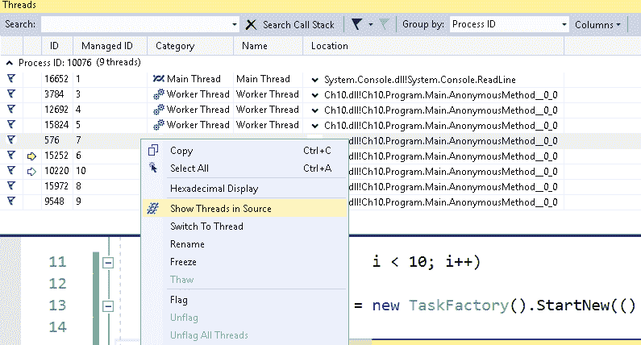
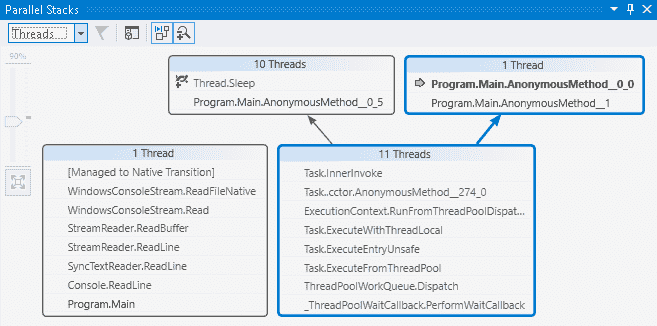
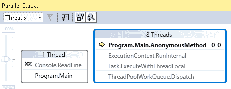
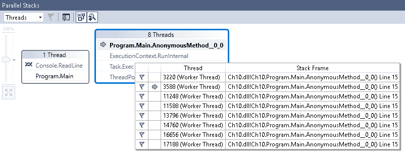
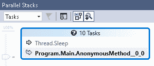

# 第十章：使用 Visual Studio 调试任务

并行编程可以提高应用程序的性能和响应能力，但有时结果并不如预期。与并行/异步代码相关的常见问题是性能和正确性。

性能意味着执行结果很慢。正确性意味着结果不如预期（这可能是由于竞争条件）。处理多个并发任务时的另一个重大问题是死锁。调试多线程代码始终是一个挑战，因为在调试时线程会不断切换。在处理基于 GUI 的应用程序时，找出运行我们代码的线程也很重要。

在本章中，我们将解释如何使用 Visual Studio 中可用的工具来调试线程，包括“线程”窗口、“任务”窗口和并发可视化器。

本章将涵盖以下主题：

+   使用 VS 2019 进行调试

+   如何调试线程

+   使用并行任务窗口

+   使用并行堆栈窗口进行调试

+   使用并发可视化器

# 技术要求

在开始本章之前，需要先了解线程、任务、Visual Studio 和并行编程。

您可以在 GitHub 的以下链接中检查相关源代码：[`github.com/PacktPublishing/-Hands-On-Parallel-Programming-with-C-8-and-.NET-Core-3/tree/master/Chapter10`](https://github.com/PacktPublishing/-Hands-On-Parallel-Programming-with-C-8-and-.NET-Core-3/tree/master/Chapter10)。

# 使用 VS 2019 进行调试

Visual Studio 提供了许多内置工具，以帮助解决上述的调试和故障排除问题。本章将讨论以下一些工具：

+   线程窗口

+   并行堆栈窗口

+   并行监视窗口

+   调试位置工具栏

+   并发可视化器（截至撰写本文时仅适用于 VS 2017）

+   GPU 线程窗口

在接下来的章节中，我们将尝试深入了解所有这些工具。

# 如何调试线程

在使用多个线程时，找出在特定时间执行的线程变得很重要。这使我们能够解决跨线程问题以及竞争条件。使用“线程”窗口，我们可以在调试时检查和处理线程。在 Visual Studio IDE 中调试代码时，当您触发断点时，线程窗口提供一个包含有关活动线程信息的表格。

现在，让我们探讨如何使用 Visual Studio 调试线程：

1.  在 Visual Studio 中编写以下代码：

```cs
for (int i = 0; i < 10; i++) 
           {
               Task task = new TaskFactory().StartNew(() =>
                {
                 Console.WriteLine($"Thread with Id 
                  {Thread.CurrentThread.ManagedThreadId}");
                });
           }
```

1.  通过在`Console.Writeline`语句上按下*F9*来创建断点。

1.  通过按下*F5*以调试模式运行应用程序。应用程序将创建线程并开始执行。当触发断点时，我们将从工具栏的调试|窗口|线程窗口中打开线程窗口：


.NET 环境捕获了许多关于线程的信息，这些信息以列的形式显示。黄色箭头标识了当前正在执行的线程。

一些列包括以下内容：

+   **标记**：如果我们想跟踪特定线程，可以对其进行标记。这可以通过点击旗标图标来完成。

+   ID：显示为每个线程分配的唯一标识号。

+   托管 ID：显示为每个线程分配的托管标识号。

+   类别：每个线程被分配一个唯一的类别，这有助于我们确定它是 GUI 线程（主线程）还是工作线程。

+   名称：显示每个线程的名称，或显示为<无名称>。

+   位置：这有助于确定线程的执行位置。我们可以深入了解完整的调用堆栈。

我们可以通过点击旗标图标来标记我们想要监视的线程。要仅查看已标记的线程，可以在线程窗口中点击“仅显示已标记的线程”选项：


线程窗口的另一个很酷的功能是，我们可以冻结我们认为在调试过程中可能引起问题的线程，以监视应用程序的行为。即使系统有足够的资源可用，冻结后，线程也不会开始执行冻结的线程。冻结后，线程进入暂停状态：


在调试过程中，我们还可以通过右键单击线程窗口中的线程或双击线程来切换执行到另一个线程：



Visual Studio 还支持使用并行堆栈窗口调试任务。我们将在下一节中看看这个。

# 使用并行堆栈窗口

并行堆栈窗口是调试线程和任务的一个很好的工具，这是在 Visual Studio 的较新版本中引入的。我们可以通过导航到调试|窗口|并行堆栈来在调试时打开并行堆栈窗口。



从前面的截图中可以看出，在并行堆栈窗口上有各种视图，我们可以在这些视图上切换。我们将在下一个主题中学习如何使用并行堆栈窗口和这些视图进行调试。

# 使用并行堆栈窗口进行调试

并行堆栈窗口有一个下拉菜单，有两个选项。我们可以在这些选项之间切换，以在并行堆栈窗口中获得几个视图。这些视图包括以下内容：

+   线程视图

+   任务视图

让我们在接下来的部分详细检查这些视图。

# 线程视图

线程视图显示了在调试应用程序时运行的所有线程的调用堆栈：



黄色箭头显示了代码当前执行的位置。悬停在并行堆栈窗口中的任何方法上会打开带有有关当前正在执行的线程信息的线程窗口：



我们可以通过双击它切换到任何其他方法：


我们还可以切换到方法视图以查看完整的调用堆栈：


方法视图非常适用于调试调用堆栈，以查找在任何时间点传递给方法的值。

# 任务视图

如果我们在代码中使用任务并行库创建`System.Threading.Tasks.Task`对象，我们应该使用任务视图：



如下截图所示，当前有 10 个正在执行的任务，每个任务都显示了当前的执行行。

通过悬停在任何方法上，可以看到所有运行任务的状态：


任务窗口帮助我们分析应用程序中由于方法调用缓慢或死锁而引起的性能问题。

# 使用并行监视窗口进行调试

当我们想要在不同的线程上查看变量的值时，我们可以使用并行监视窗口。考虑以下代码：

```cs
for (int i = 0; i < 10; i++)
{
    Task task = new Task(() =>
     {
         for (int j = 0; j < 100; j++)
         {
             Thread.Sleep(100);
         }
         Console.WriteLine($"Thread with Id 
          {Thread.CurrentThread.ManagedThreadId}");
     });
    task.Start();
}
```

此代码创建多个任务，每个任务运行 100 次迭代的`for`循环。在每次迭代中，线程休眠 100 毫秒。我们允许代码运行一段时间，然后触发断点。我们可以使用并行监视窗口看到所有这些操作。我们可以从调试|窗口|并行监视中打开并行监视窗口。我们可以打开四个这样的窗口，每个窗口一次只能监视一个变量值在不同任务上的值：


从前面的代码中可以看出，我们想要监视 j 的值。因此，我们在第三列的标题中写入 j 并按*Enter*键。这将 j 添加到此处显示的监视窗口中，我们可以看到所有线程/任务上的 j 的值。

# 使用并发可视化器

并发可视化器是 Visual Studio 工具集合中非常方便的一个补充。它不会默认随 Visual Studio 一起发布，但可以从 Visual Studio Marketplace 下载：[`marketplace.visualstudio.com`](https://marketplace.visualstudio.com)。

这是一个非常高级的工具，可以用于排除复杂的线程问题，比如性能瓶颈、线程争用问题、检查 CPU 利用率、跨核心线程迁移以及重叠 I/O 的区域。

并发可视化器仅支持 Windows/console 项目，不适用于 Web 项目。让我们考虑在控制台应用程序中的以下代码：

```cs
Action computeAction = () =>
{
int i = 0;
    while (true)
    {
        i = 1 * 1;
    }
};
Task.Run(() => computeAction());
Task.Run(() => computeAction());
Task.Run(() => computeAction());
Task.Run(() => computeAction());
```

在上述代码中，我们创建了四个任务，这些任务会无限期地运行计算任务，比如 1*1。然后我们会在`while`循环内设置断点并打开并发可视化器。

现在，我们将从 Visual Studio 运行上述代码，并在代码运行时，单击“附加到进程...”，如下面的屏幕截图所示：


您首先需要为您的 Visual Studio 版本安装并发可视化器。Visual Studio 2017 的并发可视化器可以在这里找到：[`marketplace.visualstudio.com/items?itemName=VisualStudioProductTeam.ConcurrencyVisualizer2017#overview`](https://marketplace.visualstudio.com/items?itemName=VisualStudioProductTeam.ConcurrencyVisualizer2017#overview)。

一旦附加，并发可视化器将停止分析。我们将让应用程序运行一段时间，以便它可以收集足够的数据进行审查，然后停止分析器生成视图。

默认情况下，这将打开利用视图，这是并发可视化器中存在的三个视图之一。另外两个是线程和核心视图。我们将在下一节中探索利用视图。

# 利用视图

利用视图显示了所有处理器上的系统活动。这是并发分析器停止分析时的快照：


正如您在上图中所看到的，有四个核心的 CPU 负载达到了 100%。这由绿色表示。这个视图通常用于获得并发状态的高级概述。

# 线程视图

线程视图提供了对当前系统状态的非常详细的分析。通过这个视图，我们可以确定线程是在执行还是在因 I/O 和同步等问题而阻塞：


这个视图在识别和修复系统中的性能瓶颈方面非常有帮助。因此，我们可以清楚地识别实际执行所花费的时间以及处理同步问题所花费的时间。

# 核心视图

核心视图可用于识别线程执行核心切换的次数：


正如您在上图中所看到的，我们的四个线程（ID 为 12112、1604、16928 和 4928）几乎 60%的时间在核心之间进行上下文切换。

掌握了并发可视化器中存在的所有三个视图的理解，我们已经结束了本章。现在，让我们总结一下我们学到的东西。

# 摘要

在本章中，我们讨论了如何使用线程窗口调试多线程应用程序，以监视.NET 环境捕获的无数信息。我们还学习了如何通过使用标志线程、在线程之间切换、在并行堆栈窗口中打开线程和任务视图、打开多个并行观察窗口以及观察一次多个任务上的单变量值来更好地了解应用程序。

除此之外，我们还探索了并发可视化器，这是一个用于排除仅支持 Windows/console 项目的复杂线程问题的高级工具。

在下一章中，我们将学习如何为并行和异步代码编写单元测试用例，以及与此相关的问题。此外，我们还将了解设置模拟对象涉及的挑战以及如何解决这些问题。

# 问题

1.  在 Visual Studio 中调试线程时，哪个不是有效窗口？

1.  并行线程

1.  并行堆栈

1.  GPU 线程

1.  并行监视

1.  我们可以通过标记来跟踪调试特定的线程。

1.  正确

1.  错误

1.  并行监视窗口中哪个不是有效视图？

1.  任务

1.  进程

1.  线程

1.  我们如何检查线程的调用堆栈？

1.  方法视图

1.  任务视图

1.  以下哪个不是并发可视化器的有效视图？

1.  线程视图

1.  核心视图

1.  进程视图

# 进一步阅读

您可以在以下链接中阅读有关并行编程和调试技术的信息：

+   [`www.packtpub.com/application-development/c-multithreaded-and-parallel-programming`](https://www.packtpub.com/application-development/c-multithreaded-and-parallel-programming)

+   [`www.packtpub.com/application-development/net-45-parallel-extensions-cookbook`](https://www.packtpub.com/application-development/net-45-parallel-extensions-cookbook)
