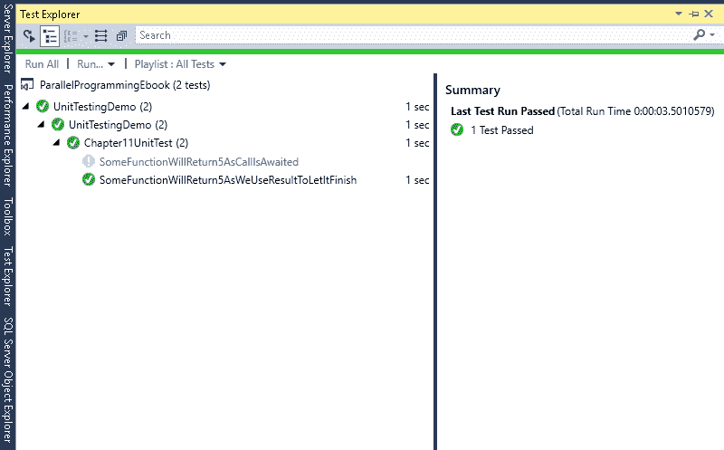

# 第十一章：为并行和异步代码编写单元测试用例

在本章中，我们将介绍如何为并行和异步代码编写单元测试用例。编写单元测试用例是编写健壮代码的重要方面，当你与大型团队合作时，这样的代码更易于维护。

有了新的 CI/CD 平台，使运行单元测试用例成为构建过程的一部分变得更容易。这有助于在非常早期发现问题。编写集成测试也是有意义的，这样我们可以评估不同组件是否正确地一起工作。虽然在 Visual Studio 的社区和专业版本中会发现更多功能，但只有 Visual Studio 企业版支持分析单元测试用例的代码覆盖率。

在本章中，我们将涵盖以下主题：

+   了解为异步代码编写单元测试用例的问题

+   为并行和异步代码编写单元测试用例

+   使用 Moq 模拟异步代码的设置

+   使用测试工具

# 技术要求

学习如何使用 Visual Studio 支持的框架编写单元测试用例需要对单元测试和 C#有基本的了解。本章的源代码可以在 GitHub 上找到：[`github.com/PacktPublishing/Hands-On-Parallel-Programming-with-C-8-and-.NET-Core-3/tree/master/Chapter11`](https://github.com/PacktPublishing/Hands-On-Parallel-Programming-with-C-8-and-.NET-Core-3/tree/master/Chapter11)。

# 使用.NET Core 进行单元测试

.NET Core 支持三种编写单元测试的框架，即 MSTest、NUnit 和 xUnit，如下截图所示：


最初，编写测试用例的首选框架是 NUnit。然后，MSTest 被添加到 Visual Studio 中，然后 xUnit 被引入到.NET Core 中。与 NUnit 相比，xUnit 是一个非常精简的版本，并帮助用户编写干净的测试并利用新功能。xUnit 的一些好处如下：

+   它很轻量级。

+   它使用了新功能。

+   它改进了测试隔离。

+   xUnit 的创建者也来自微软，是微软内部使用的工具。

+   `Setup`和`TearDown`属性已被构造函数和`System.IDisposable`取代，从而迫使开发人员编写干净的代码。

单元测试用例只是一个简单的返回`void`的函数，用于测试函数逻辑并根据预定义的一组输入验证输出。为了使函数被识别为测试用例，必须使用`[Fact]`属性进行修饰，如下所示：

```cs
[Fact]
public void SomeFunctionWillReturn5AsWeUseResultToLetItFinish()
{
    var result = SomeFunction().Result;
    Assert.Equal(5, result);
}
```

要运行此测试用例，我们需要右键单击代码中的函数，然后单击“运行测试”或“调试测试”：


测试用例的执行输出可以在测试资源管理器窗口中看到：



虽然这相当简单，但为并行和异步代码编写单元测试用例是具有挑战性的。我们将在下一节中详细讨论这个问题。

# 了解为异步代码编写单元测试用例的问题

异步方法返回一个需要等待以获得结果的`Task`。如果不等待，方法将立即返回，而不会等待异步任务完成。考虑以下方法，我们将使用它来编写一个使用 xUnit 的单元测试用例：

```cs
private async Task<int> SomeFunction()
{
    int result =await Task.Run(() =>
    {
        Thread.Sleep(1000);
        return 5;
    });           
    return result;
}
```

该方法在延迟 1 秒后返回一个常量值 5。由于该方法使用了`Task`，我们使用了`async`和`await`关键字来获得预期的结果。以下是一个非常简单的测试用例，我们可以使用 MSTest 来测试这个方法：

```cs
[TestMethod]
public async void SomeFunctionShouldFailAsExpectedValueShouldBe5AndNot3()
{
    var result = await SomeFunction();
    Assert.AreEqual(3, result);
 }
```

如您所见，该方法应该失败，因为预期的返回值是 3，而方法返回的是 5。然而，当我们运行这个测试时，它通过了：


这里发生的情况是，由于该方法标记为异步，当遇到`await`关键字时立即返回。当返回一个任务时，它被视为在将来的某个时间点运行，但由于测试用例没有失败而返回，测试框架将其标记为通过。这是一个重大问题，因为这意味着即使任务抛出异常，测试也会通过。

可以稍微不同地编写前面的测试用例以使其在 MSTest 中运行：

```cs
[TestMethod]
public void SomeFunctionWillReturn5AsWeUseResultToLetItFinish()
{
    var result = SomeFunction().Result;
    Assert.AreEqual(3, result);
}
```

可以使用 xUnit 编写相同的单元测试用例如下：

```cs
[Fact]
public void SomeFunctionWillReturn5AsWeUseResultToLetItFinish()
{
    var result = SomeFunction().Result;
    Assert.Equal(5, result);
}
```

当我们运行前面的 xUnit 测试用例时，它会成功运行。但是，这段代码的问题在于它是一个阻塞测试用例，这可能会对我们的测试套件的性能产生重大影响。更好的单元测试用例如下所示：

```cs
[Fact]
public async void SomeFunctionWillReturn5AsCallIsAwaited()
{
    var result = await SomeFunction();
    Assert.Equal(5, result);
}
```

最初，并非每个单元测试框架都支持异步单元测试用例，正如我们在 MSTest 的情况下所见。但是，它们受到 xUnit 和 NUnit 的支持。前面的测试用例再次返回成功。

可以使用 NUnit 编写上述单元测试用例如下：

```cs
[Test]
public async void SomeFunctionWillReturn5AsCallIsAwaited()
{
    var result = await SomeFunction();
    Assert.AreEqual(3, result);
}
```

与前面的代码相比，这里有一些区别。`[Fact]`属性被`[Test]`替换，而`Assert.Equal`被`Assert.AreEqual`替换。然而，当您尝试在 Visual Studio 中运行前面的测试用例时，您将看到一个错误：`"消息：异步测试方法必须具有非 void 返回类型"`。因此，对于 NUnit，方法需要更改如下：

```cs
[Test]
public async Task SomeFunctionWillReturn5AsCallIsAwaited()
{
    var result = await SomeFunction();
    Assert.AreEqual(3, result);
}
```

唯一的区别是`void`被`Task`替换。

在本节中，我们已经看到了在使用为单元测试提供的各种框架时可能会遇到的问题。现在，让我们看看如何编写更好的单元测试用例。

# 编写并行和异步代码的单元测试用例

在上一节中，我们学习了如何为异步代码编写单元测试用例。在本节中，我们将讨论为异常情况编写单元测试用例。考虑以下方法：

```cs
private async Task<float> GetDivisionAsync(int number , int divisor)
{
    if (divisor == 0)
    {
        throw new DivideByZeroException();
    }
    int result = await Task.Run(() =>
    {
        Thread.Sleep(1000);
        return number / divisor;
    });
    return result;
}
```

前面的方法以异步方式返回两个数字的除法结果。如果除数为 0，则该方法会抛出`DivideByZero`异常。我们需要两种类型的测试用例来覆盖这两种情况：

+   检查成功的结果

+   当除数为 0 时检查异常结果

# 检查成功的结果

测试用例如下所示：

```cs
[Test]
public async Task GetDivisionAsyncShouldReturnSuccessIfDivisorIsNotZero()
{
    int number = 20;
    int divisor = 4;
    var result = await GetDivisionAsync(number, divisor);
    Assert.AreEqual(result, 5);
}
```

如您所见，预期结果是`5`。当我们运行测试时，它将在测试资源管理器中显示为成功。

# 当除数为 0 时检查异常结果

我们可以使用`Assert.ThrowsAsync<>`方法为抛出异常的方法编写测试用例：

```cs
[Test]
public void GetDivisionAsyncShouldCheckForExceptionIfDivisorIsNotZero()
{
    int number = 20;
    int divisor = 0;
    Assert.ThrowsAsync<DivideByZeroException>(async () => 
     await GetDivisionAsync(number, divisor));
}
```

如您所见，我们在异步调用`GetDivisionAsync`方法时使用`Assert.ThrowsAsync<DivideByZeroException>`进行断言。由于我们将`divisor`传递为`0`，该方法将抛出异常，断言将保持为真。

# 使用 Moq 模拟异步代码的设置

模拟对象是单元测试的一个非常重要的方面。您可能知道，单元测试是关于一次测试一个模块；任何外部依赖都被假定为正常工作。

有许多可用于.NET 的模拟框架，包括以下内容：

+   NSubstitute（在.NET Core 中不受支持）

+   Rhino Mocks（在.NET Core 中不受支持）

+   Moq（在.NET Core 中受支持）

+   NMock3（在.NET Core 中不受支持）

为了演示，我们将使用 Moq 来模拟我们的服务组件。

在本节中，我们将创建一个包含异步方法的简单服务。然后，我们将尝试为调用该服务的方法编写单元测试用例。让我们考虑一个服务接口：

```cs
public interface IService
{
    Task<string> GetDataAsync();
}
```

正如我们所见，接口有一个`GetDataAsync()`方法，以异步方式获取数据。以下代码片段显示了一个控制器类，该类利用一些依赖注入框架来访问服务实例：

```cs
class Controller
{
    public Controller (IService service)
    {
        Service = service;
    }
    public IService Service { get; }
    public async Task DisplayData()
    {
        var data =await Service.GetDataAsync();
        Console.WriteLine(data);
    }
}
```

前面的`Controller`类还公开了一个名为`DisplayData()`的异步方法，该方法从服务中获取数据并将其写入控制台。当我们尝试为前述方法编写单元测试用例时，我们将遇到的第一个问题是，在没有任何具体实现的情况下，我们无法创建服务实例。即使我们有具体的实现，我们也应该避免调用实际的服务方法，因为这更适合集成测试用例而不是单元测试用例。在这里，Mocking 来拯救我们。

让我们尝试使用 Moq 为前述方法编写一个单元测试用例：

1.  我们需要安装`Moq`作为 NuGet 包。

1.  添加其命名空间如下：

```cs
using Moq;
```

1.  创建一个模拟对象，如下所示：

```cs
var serviceMock = new Mock<IService>();
```

1.  设置返回虚拟数据的模拟对象。可以使用`Task.FromResult`方法来实现，如下所示：

```cs
serviceMock.Setup(s => s.GetDataAsync()).Returns(
                Task.FromResult("Some Dummy Value"));
```

1.  接下来，我们需要通过传递刚刚创建的模拟对象来创建一个控制器对象：

```cs
var controller = new Controller(serviceMock.Object);
```

以下是`DisplayData()`方法的一个简单测试用例：

```cs
 [Test]
        public async System.Threading.Tasks.Task DisplayDataTestAsync()
        {
            var serviceMock = new Mock<IService>();
            serviceMock.Setup(s => s.GetDataAsync()).Returns(
                Task.FromResult("Some Dummy Value"));
            var controller = new Controller(serviceMock.Object);
            await controller.DisplayData();
        }
```

上述代码显示了我们如何为模拟对象设置数据。为模拟对象设置数据的另一种方法是通过`TaskCompletionSource`类，如下所示：

```cs
[Test]
public async Task DisplayDataTestAsyncUsingTaskCompletionSource()
{
    // Create a mock service
    var serviceMock = new Mock<IService>();
    string data = "Some Dummy Value";
    //Create task completion source
    var tcs = new TaskCompletionSource<string>();
    //Setup completion source to return test data
    tcs.SetResult(data);
    //Setup mock service object to return Task underlined by tcs 
    //when GetDataAsync method of service is called
    serviceMock.Setup(s => s.GetDataAsync()).Returns(tcs.Task);
    //Pass mock service instance to Controller
    var controller = new Controller(serviceMock.Object);
    //Call DisplayData method of controller asynchronously
    await controller.DisplayData();
}
```

由于企业项目中测试用例的数量可能会大幅增长，因此需要能够查找和执行测试用例。在下一节中，我们将讨论一些在 Visual Studio 中可以帮助我们管理测试用例执行过程的常见测试工具。

# 测试工具

在 Visual Studio 中运行测试或查看测试执行结果的最重要工具之一是 Test Explorer。我们在本章开头简要介绍了 Test Explorer。Test Explorer 的一个关键特性是能够并行运行测试用例。如果您的系统有多个核心，您可以轻松利用并行性来更快地运行测试用例。这可以通过在 Test Explorer 中点击“Run Tests in parallel”工具栏按钮来实现：


根据您的 Visual Studio 版本，Microsoft 还提供了一些额外的支持。一个有用的工具是使用**Intellitest**自动生成单元测试用例的选项。Intellitest 分析您的源代码并自动生成测试用例、测试数据和测试套件。尽管 Intellitest 尚不支持.NET Core，但它适用于.NET Framework 的其他版本。它很可能会在未来的 Visual Studio 升级中得到支持。

# 摘要

在本章中，我们学习了为异步方法编写单元测试用例，这有助于实现健壮的代码，支持大型团队，并适应新的 CI/CD 平台，有助于在非常早期发现问题。我们首先介绍了在编写并行和异步代码的单元测试用例时可能遇到的一些问题，以及如何使用正确的编码实践来减轻这些问题。然后，我们继续学习了 Mocking，这是单元测试的一个非常重要的方面。

我们了解到 Moq 支持.NET Core，并且.NET Core 发展非常迅速；很快将支持所有主要的模拟框架。还解释了编写测试用例的所有步骤，包括安装 Moq 作为 NuGet 包和为模拟对象设置数据。最后，我们探讨了一个重要的测试工具 Test Explorer 的功能，我们可以使用它来编写更干净的测试用例，并且如何并行运行单元测试用例以加快执行速度。

在下一章中，我们将介绍 IIS 和 Kestrel 在.NET Core Web 应用程序开发环境中的概念和角色。

# 问题

1.  以下哪个不是 Visual Studio 中支持的单元测试框架？

1.  JUnit

1.  NUnit

1.  xUnit

1.  MSTest

1.  我们如何检查单元测试用例的输出？

1.  通过使用 Task Explorer 窗口

1.  通过使用 Test Explorer 窗口

1.  当测试框架是 xUnit 时，您可以将哪些属性应用于测试方法？

1.  事实

1.  TestMethod

1.  测试

1.  您如何验证抛出异常的测试用例的成功？

1.  `Assert.AreEqual(ex, typeof(Exception)`

1.  `Assert.IsException`

1.  `Assert.ThrowAsync<T>`

1.  这些模拟框架中哪些受到.NET Core 的支持？

1.  NSubstitute

1.  Moq

1.  Rhino Mocks

1.  NMock

# 进一步阅读

您可以在以下网页上了解并行编程和单元测试技术：

+   [`www.packtpub.com/application-development/c-multithreaded-and-parallel-programming`](https://www.packtpub.com/application-development/c-multithreaded-and-parallel-programming)

+   [`www.packtpub.com/application-development/net-45-parallel-extensions-cookbook`](https://www.packtpub.com/application-development/net-45-parallel-extensions-cookbook)
