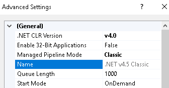
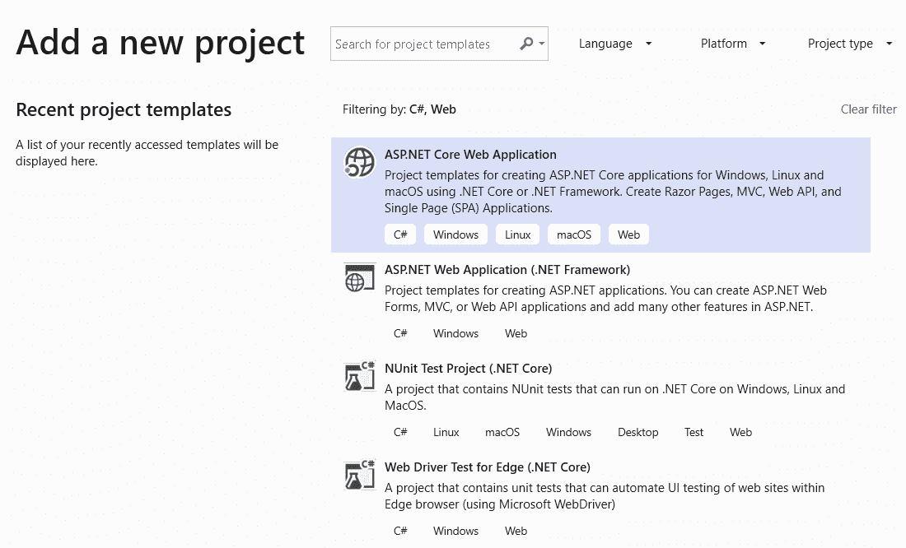
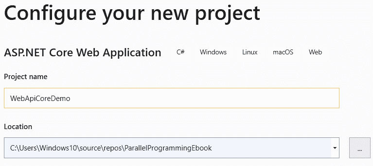
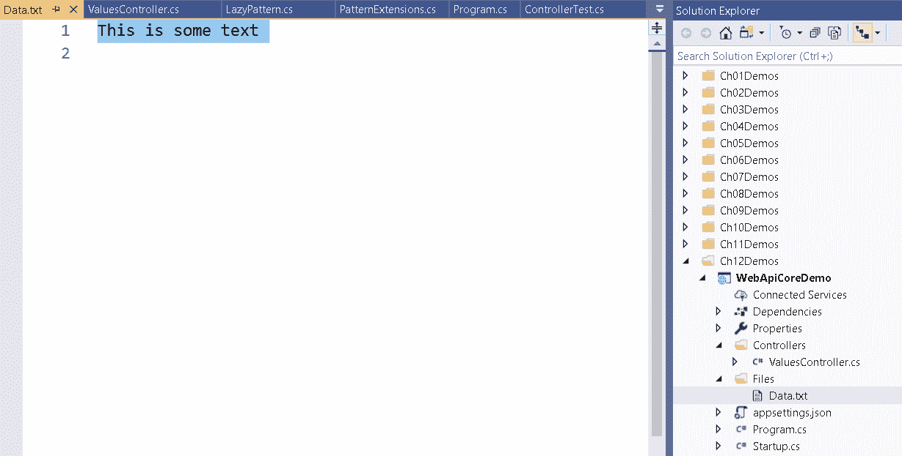

# 第十二章：ASP.NET Core 中的 IIS 和 Kestrel

在上一章中，我们讨论了为并行和异步代码编写单元测试用例。我们还讨论了在 Visual Studio 中可用的三个单元测试框架：MSUnit、NUnit 和 xUnit。

在本章中，我们将介绍线程模型如何与**Internet Information Services**（**IIS**）和 Kestrel 一起工作。我们还将看看我们可以做出哪些各种调整，以充分利用服务器上的资源。我们将介绍 Kestrel 的工作模型，以及在创建微服务时如何利用并行编程技术。

在本章中，我们将涵盖以下主题：

+   IIS 线程模型和内部结构

+   Kestrel 线程模型和内部结构

+   在微服务中线程的最佳实践介绍

+   在 ASP.NET MVC Core 中介绍异步

+   异步流（在.NET Core 3.0 中新增）

让我们开始吧。

# 技术要求

需要对服务器工作原理有很好的理解，这样你才能理解本章。在开始本章之前，你还应该了解线程模型。本章的源代码可在 GitHub 上找到：[`github.com/PacktPublishing/-Hands-On-Parallel-Programming-with-C-8-and-.NET-Core-3/tree/master/Chapter12`](https://github.com/PacktPublishing/-Hands-On-Parallel-Programming-with-C-8-and-.NET-Core-3/tree/master/Chapter12)。

# IIS 线程模型和内部结构

顾名思义，这些是在 Windows 系统上使用的服务，用于通过互联网连接您的 Web 应用程序与其他系统，使用 HTTP、TCP、Web 套接字等一系列协议。

在本节中，我们将讨论**IIS 线程模型**的工作原理。IIS 的核心是**CLR 线程池**。要理解 IIS 如何服务用户请求，了解 CLR 线程池如何添加和删除线程是非常重要的。

部署到 IIS 的每个应用程序都被分配一个唯一的工作进程。每个工作进程都有两个线程池：**工作线程池**和**IOCP**（即**I/O 完成端口**）线程池：

+   每当我们使用传统的`ThreadPool.QueueUserWorkItem`或**TPL**创建新的线程池线程时，ASP.NET 运行时都会利用工作线程进行处理。

+   每当进行任何 I/O 操作，即数据库调用、文件读写或对另一个 Web 服务的网络调用时，ASP.NET 运行时都会利用 IOCP 线程。

默认情况下，每个处理器都有一个工作线程和一个 IOCP 线程。因此，双核 CPU 默认情况下会有两个工作线程和两个 IOCP 线程。`ThreadPool`会根据负载和需求不断添加和删除线程。IIS 为每个接收到的请求分配一个线程。这使得每个请求在与服务器同时到达的其他请求的情况下都有不同的上下文。线程的责任是满足请求，并生成并将响应发送回客户端。

如果可用的线程池线程数量少于服务器在任何时间接收到的请求数，那么这些请求将开始排队。稍后，线程池将使用两种重要的算法之一生成线程，这两种算法分别称为*爬坡*和*避免饥饿*。线程的创建不是瞬间完成的，通常需要从`ThreadPool`知道线程短缺开始到 500 毫秒。让我们试着理解`ThreadPool`用来生成线程的这两种算法。

# 避免饥饿

在这个算法中，`ThreadPool`不断监视队列，如果没有进展，它就会不断地将新线程加入队列。

# 爬坡

在这个算法中，`ThreadPool`试图最大限度地利用尽可能少的线程来实现吞吐量。

使用默认设置运行 IIS 将对性能产生重大影响，因为默认情况下，每个处理器只有一个工作线程可用。我们可以通过修改`machine.config`文件中的配置元素来增加此设置。

```cs
<configuration>  
    <system.web>     
        <processModel minWorkerThreads="25" minIoThreads="25" />  
    </system.web> 
</configuration>
```

如您所见，我们将最小工作线程和 IOCP 线程增加到了 25。随着更多请求的到来，将创建额外的线程。这里需要注意的一点是，由于每个请求都分配了一个唯一的线程，我们应该避免编写阻塞代码。有了阻塞代码，就不会有空闲线程。一旦线程池耗尽，请求将开始排队。IIS 每个应用程序池只能排队最多 1,000 个请求。我们可以通过更改`machine.config`文件中的`requestQueueLimit`应用程序设置来修改这一点。

要修改所有应用程序池的设置，我们需要添加`applicationPool`元素并设置所需的值：

```cs
<system.web>
  <applicationPool
    maxConcurrentRequestPerCPU="5000"
    maxConcurrentThreadsPerCPU="0"
    requestQueueLimit="5000" />
</system.web>
```

要修改单个应用程序池的设置，我们需要在 IIS 中导航到特定应用程序池的高级设置。如下截图所示，我们可以更改队列长度属性以修改每个应用程序池可以排队的请求数量：



作为开发人员的良好编码实践，为了减少争用问题并避免服务器上的队列，我们应该尝试对任何阻塞 I/O 代码使用`async`/`await`关键字。这将减少服务器上的争用问题，因为线程不会被阻塞，并返回到线程池以服务其他请求。

# Kestrel 线程模型和内部

IIS 一直是托管.NET 应用程序的最流行服务器，但它与 Windows 操作系统绑定在一起。随着越来越多的云提供商出现和非 Windows 云托管选项变得更加便宜，需要一个跨平台托管服务器。微软推出了 Kestrel 作为托管 ASP.NET Core 应用程序的跨平台 Web 服务器。如果我们创建和运行 ASP.NET Core 应用程序，Kestrel 是默认的 Web 服务器。Kestrel 是开源的，使用基于事件驱动的异步 I/O 服务器。Kestrel 不是一个完整的 Web 服务器，建议在 IIS 和 Nginx 等功能齐全的 Web 服务器后面使用。

当 Kestrel 最初推出时，它是基于`libuv`库的，这个库也是开源的。在.NET 中使用`libuv`并不是什么新鲜事，可以追溯到 ASP.NET 5。`libuv`专门为异步 I/O 操作构建，并使用单线程事件循环模型。该库还支持在 Windows、macOS 和 Linux 上进行跨平台异步套接字操作。您可以在 GitHub 上查看其进展并下载`libuv`的源代码以进行自定义实现。

`libuv`在 Kestrel 中仅用于支持异步 I/O。除 I/O 操作外，Kestrel 中进行的所有其他工作仍然由.NET 工作线程使用托管代码完成。创建 Kestrel 的核心思想是提高服务器的性能。该堆栈非常强大且可扩展。Kestrel 中的`libuv`仅用作传输层，并且由于出色的抽象，它也可以被其他网络实现替换。Kestrel 还支持运行多个事件循环，因此比 Node.js 更可靠。使用的事件循环数量取决于计算机上的逻辑处理器数量，以及一个线程运行一个事件循环。我们还可以在创建主机时通过代码配置此数字。

以下是`Program.cs`文件的摘录，该文件存在于所有 ASP.NET Core 项目中：

```cs
public class Program
{
    public static void Main(string[] args)
    {
        CreateWebHostBuilder(args).Build().Run();
    }
    public static IWebHostBuilder CreateWebHostBuilder(string[] args) =>    
     WebHost.CreateDefaultBuilder(args).UseStartup<Startup>();
    }
```

正如您将看到的，Kestrel 服务器基于构建器模式，并且可以使用适当的包和扩展方法添加功能。在接下来的部分中，我们将学习如何修改不同版本的.NET Core 的 Kestrel 设置。

# ASP.NET Core 1.x

我们可以使用名为`UseLibuv`的扩展方法来设置线程计数。我们可以通过设置`ThreadCount`属性来实现，如下面的代码所示：

```cs
public static IWebHostBuilder CreateWebHostBuilder(string[] args) =>
            WebHost.CreateDefaultBuilder(args)
            .UseLibuv(opts => opts.ThreadCount = 4)
            .UseStartup<Startup>();
```

`WebHost`已在.NET Core 3.0 中被通用主机所取代。以下是 ASP.NET Core 3.0 的代码片段：

```cs
public static IHostBuilder CreateHostBuilder(string[] args) =>
            Host.CreateDefaultBuilder(args)
                .ConfigureWebHostDefaults(webBuilder =>
                {
                    webBuilder.UseStartup<Startup>();
                });
```

# ASP.NET Core 2.x

从 ASP.NET 2.1 开始，Kestrel 已经替换了`libuv`的默认传输方式，改为了托管套接字。因此，如果您将项目从 ASP.NET Core 升级到 ASP.NET 2.x 或 3.x，并且仍然想使用`libuv`，则需要添加`Microsoft.AspNetCore.Server.Kestrel.Transport.Libuv` NuGet 包以使代码正常工作。

Kestrel 目前支持以下场景：

+   HTTPS

+   不透明升级，用于启用 Web 套接字（[`github.com/aspnet/websockets`](https://github.com/aspnet/websockets)）

+   Nginx 后面的 Unix 套接字用于高性能

+   HTTP/2（目前在 macOS 上不受支持）

由于 Kestrel 是基于套接字构建的，您可以使用`Host`上的`ConfigureLimits`方法来配置它们的连接限制：

```cs
Host.CreateDefaultBuilder(args)
.ConfigureKestrel((context, options) =>
{
    options.Limits.MaxConcurrentConnections = 100;
    options.Limits.MaxConcurrentUpgradedConnections = 100;
}
```

如果我们将`MaxConcurrentConnections`设置为 null，则默认连接限制是无限的。

# 引入微服务中线程的最佳实践

微服务是用于创建非常高性能和可扩展的后端服务的最流行的软件设计模式。与为整个应用程序构建一个服务不同，创建了多个松散耦合的服务，每个服务负责一个功能。根据功能的负载，可以单独扩展或缩减每个服务。因此，在设计微服务时，您使用的线程模型的选择变得非常重要。

微服务可以是无状态的或有状态的。无状态和有状态之间的选择对性能有影响。对于无状态服务，请求可以以任何顺序进行处理，而不考虑当前请求之前或之后发生了什么，而对于有状态服务，所有请求都应按特定顺序进行处理，如队列。这可能会对性能产生影响。由于微服务是异步的，我们需要编写一些逻辑来确保请求按正确的顺序和状态进行处理，并且在每个请求之后与下一个消息进行通信。微服务也可以是单线程或多线程的，这种选择与状态结合起来可以真正改善或降低性能，并且在规划服务时应该经过深思熟虑。

微服务设计方法可以分为以下几类：

+   单线程-单进程微服务

+   单线程-多进程微服务

+   多线程-单进程微服务

我们将在接下来的部分中更详细地了解这些设计方法。

# 单线程-单进程微服务

这是微服务的最基本设计。微服务在单个 CPU 核心的单个线程上运行。对于来自客户端的每个新请求，都会创建一个新线程，从而生成一个新进程。这会带走连接池缓存的好处。在与数据库一起工作时，每个新进程都会创建一个新的连接池。此外，由于一次只能创建一个进程，因此只能为一个客户端提供服务。

单线程-单进程微服务的缺点包括资源浪费以及在负载增加时服务的吞吐量不会增加。

# 单线程-多进程微服务

微服务在单个线程上运行，但可以生成多个进程，从而提高它们的吞吐量。由于为每个客户端创建了一个新进程，我们无法在连接到数据库时利用连接池。有一些第三方环境，如 Zend、OpCache 和 APC，提供跨进程的操作码缓存。

单线程-多进程微服务方法的优点是在负载上提高了吞吐量，但请注意我们无法利用连接池。

# 多线程-单进程

微服务在多个线程上运行，有一个长期运行的单个进程。使用相同的数据库，我们可以利用连接池，并在需要时限制连接的数量。单进程的问题在于所有线程将使用共享资源，并可能出现资源争用问题。

多线程-单进程方法的优点是提高了无状态服务的性能，而缺点是在共享资源时可能会出现同步问题。

# 异步服务

通过解耦微服务之间的通信，我们可以避免与各种应用组件集成时的性能问题。必须通过设计异步创建微服务才能实现这种解耦。

# 专用线程池

如果应用程序流程要求我们连接到各种微服务，那么为这些任务创建专用线程池更有意义。使用单个线程池，如果一个服务开始出现问题，那么池中的所有线程都可能耗尽。这可能会影响微服务的性能。这种模式也被称为**Bulkheads**模式。下图显示了两个使用共享连接池的微服务。如您所见，两个微服务都使用了共享连接池：


下图显示了两个使用专用线程池的微服务：


在下一节中，我们将介绍如何在 ASP.NET MVC 核心中使用异步。

# 在 ASP.NET MVC 核心中引入异步

`async`和`await`是代码标记，帮助我们使用 TPL 编写异步代码。它们有助于保持代码结构，并使其在后台异步处理代码的同时看起来同步。

我们在第九章中介绍了`async`和`await`，*异步、等待和基于任务的异步编程基础*。

现在，让我们使用 ASP.NET Core 3.0 和 VS 2019 预览创建一个异步 Web API。该 API 将从服务器读取文件：

1.  打开 Visual Studio 2019，将呈现以下屏幕。在 VS 2019 中创建一个新的 ASP.NET Core Web 应用程序项目，如下图所示：



1.  给项目取一个名字，并指定想要创建的位置：



1.  选择项目类型，在我们的情况下是 API，然后点击创建：


1.  现在，在我们的项目中创建一个名为`Files`的新文件夹，并添加一个名为`data.txt`的文件，其中包含以下内容：



1.  接下来，我们将修改`ValuesController.cs`中的`Get`方法，如下所示：

```cs
[HttpGet]
public ActionResult<IEnumerable<string>> Get()
{
    var filePath = System.IO.Path.Combine(
     HostingEnvironment.ContentRootPath,"Files","data.txt");
    var text = System.IO.File.ReadAllText(filePath);
    return Content(text);
}
```

这是一个从服务器读取文件并将内容作为字符串返回给用户的简单方法。这段代码的问题在于，当调用`File.ReadAllText`时，调用线程将被阻塞，直到文件完全读取。现在我们知道，我们的服务器响应将是进行异步调用，如下所示：

```cs
[HttpGet]
public async Task<ActionResult<IEnumerable<string>>> GetAsync()
{
    var filePath = System.IO.Path.Combine(
      HostingEnvironment.ContentRootPath, "Files", "data.txt");
    var text = await System.IO.File.ReadAllTextAsync(filePath);
    return Content(text);
}
```

ASP.NET Core Web API 支持并行编程的所有新特性，包括异步，正如我们从前面的代码示例中看到的。

# 异步流

.NET Core 3.0 还引入了异步流支持。`IAsyncEnumerable<T>`是`IEnumerable<T>`的异步版本。这一新功能允许开发人员在`IAsyncEnumerable<T>`上等待`foreach`循环以消耗流中的元素，并使用`yield`返回流以产生元素。

这在我们想要异步迭代元素并对迭代的元素执行一些计算操作的场景中非常重要。随着现在更加注重大数据（作为流式输出可用），选择支持高数据量的*异步*流更有意义，同时通过有效地利用线程使服务器响应。

已添加了两个新接口来支持异步流**：**

```cs
public interface IAsyncEnumerable<T>
{
  public IAsyncEnumerator<T> GetEnumerator();
}
public interface IAsyncEnumerator<out T>
{
  public T Current { get; }
  public Task<bool> MoveNextAsync();
}
```

从`IAsyncEnumerator`的定义中可以看出，`MoveNext`已经变成了异步的。这有两个好处：

+   很容易在`Task<bool>`上缓存`Task<T>`，这样就会减少内存分配

+   现有的集合只需要添加一个额外的方法来支持异步行为

让我们尝试使用一些示例代码来异步枚举奇数索引的数字，以便理解这一点。

这是一个自定义的枚举器：

```cs
class OddIndexEnumerator : IAsyncEnumerator<int>
{
    List<int> _numbers;
    int _currentIndex = 1;
    public OddIndexEnumerator(IEnumerable<int> numbers)
    {
        _numbers = numbers.ToList();
    }
    public int Current
    {
        get
        {
            Task.Delay(2000);
            return _numbers[_currentIndex];
        }
    }
    public ValueTask DisposeAsync()
    {
        return new ValueTask(Task.CompletedTask);
    }
    public ValueTask<bool> MoveNextAsync()
    {
        Task.Delay(2000);
        if (_currentIndex < _numbers.Count() - 2)
        {
            _currentIndex += 2;
            return new ValueTask<bool>(Task.FromResult<bool>(true));
        }
        return new ValueTask<bool>(Task.FromResult<bool>(false));
    }
}
```

从我们在前面的代码中定义的`MoveNextAsync()`方法中可以看出，这个方法从奇数索引（即索引 1）开始，并持续读取奇数索引的项目。

以下是我们的集合，它使用我们之前创建的自定义枚举逻辑，并实现了`IAsyncEnumerable<T>`接口的`GetAsyncEnumerator()`方法，以返回我们创建的`OddIndexEnumerator`枚举器：

```cs
class CustomAsyncIntegerCollection : IAsyncEnumerable<int>
{
    List<int> _numbers;
    public CustomAsyncIntegerCollection(IEnumerable<int> numbers)
    {
        _numbers = numbers.ToList();
    }
    public IAsyncEnumerator<int> GetAsyncEnumerator(
     CancellationToken cancellationToken = default)
    {
        return new OddIndexEnumerator(_numbers);
    }
}
```

这是我们的魔术扩展方法，它将我们的自定义集合转换为`AsyncEnumerable`。正如你所看到的，它适用于任何实现`IEnumerable<int>`的集合，并使用`CustomAsyncIntegerCollection`包装底层集合，而`CustomAsyncIntegerCollection`又实现了`IAsyncEnumerable<T>`：

```cs
public static class CollectionExtensions
{
    public static IAsyncEnumerable<int> AsEnumerable(this 
     IEnumerable<int> source) => new CustomAsyncIntegerCollection(source);
}
```

一旦所有部分就位，我们就可以创建一个返回异步流的方法。我们可以通过使用`yield`关键字来查看项目是如何生成的：

```cs
static async IAsyncEnumerable<int> GetBigResultsAsync()
{
    var list = Enumerable.Range(1, 20);
    await foreach (var item in list.AsEnumerable())
    {
        yield return item;
    }
}
```

以下代码调用了流。在这里，我们调用了`GetBigResultsAsync()`方法，该方法在`foreach`循环内返回`IAsyncEnumerable<int>`，然后异步迭代它：

```cs
async static Task Main(string[] args)
{
    await foreach (var dataPoint in GetBigResultsAsync())
    {
        Console.WriteLine(dataPoint);
    }
    Console.WriteLine("Hello World!");
}
```

以下是前面代码的输出。如你所见，它在集合中生成了奇数索引的数字**：**


在本节中，我们介绍了异步流，这使得我们能够在不阻塞调用线程的情况下并行迭代集合，这是自 TPL 引入以来一直缺少的功能。

现在，让我们看看本章涵盖了什么。

# 总结

在本章中，我们讨论了 IIS 线程模型，并通过从.NET Core 2.0 使用`libuv`到.NET Core 2.1 开始管理套接字来对.NET Core 服务器的实现进行更改。我们还讨论了改进 IIS、Kestrel 以及一些线程池算法（如饥饿避免和爬坡）的方法。我们介绍了微服务的概念以及在微服务中使用的各种线程模式，如单线程-单进程微服务、单线程-多进程微服务和多线程-单进程微服务。

我们还讨论了在 ASP.NET MVC Core 3.0 中使用异步的过程，并介绍了.NET Core 3.0 中异步流的新概念及其用法。异步流在大数据场景中非常方便，因为由于数据的快速涌入，服务器的负载可能会很大。

在下一章中，我们将学习一些常用的并行和异步编程模式。这些模式将增强我们对并行编程的理解。

# 问题

1.  哪一个用于托管 Web 应用程序？

1.  `IWebHostBuilder`

1.  `IHostBuilder`

1.  以下哪种`ThreadPool`算法试图最大化吞吐量，同时尽量使用较少的线程？

1.  爬山

1.  饥饿避免

1.  哪种不是有效的微服务设计方法？

1.  单线程-单进程

1.  单线程-多进程

1.  多线程-单进程

1.  多线程-多进程

1.  在新版本的.NET Core 中，我们可以等待`foreach`循环。

1.  真

1.  假
