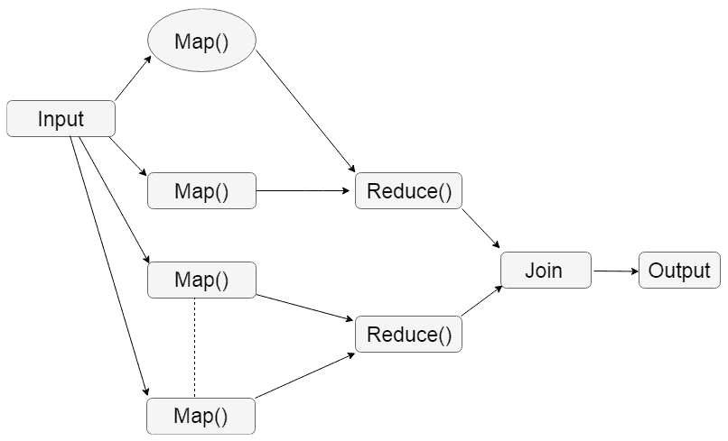
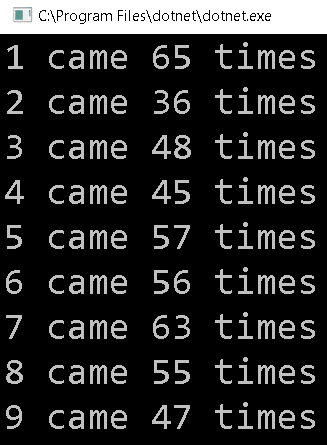
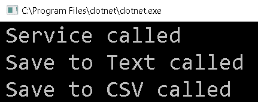

# 第十三章：并行编程中的模式

在上一章中，我们介绍了 IIS 和 Kestrel 中的线程模型，以及如何优化它们以提高性能，以及.NET Core 3.0 中一些新的异步特性支持。

在本章中，我们将介绍并行编程模式，并专注于理解并行代码问题场景以及使用并行编程/异步技术解决这些问题。

尽管并行编程技术中使用了许多模式，但我们将限制自己解释最重要的模式。

本章中，我们将涵盖以下主题：

+   `MapReduce`

+   聚合

+   分支/合并

+   推测处理

+   懒惰

+   共享状态

# 技术要求

为了理解本章内容，需要具备 C#和并行编程的知识。本章的源代码可以在 GitHub 上找到：[`github.com/PacktPublishing/-Hands-On-Parallel-Programming-with-C-8-and-.NET-Core-3/tree/master/Chapter13`](https://github.com/PacktPublishing/-Hands-On-Parallel-Programming-with-C-8-and-.NET-Core-3/tree/master/Chapter13)。

# MapReduce 模式

`MapReduce`模式是为了处理大数据问题而引入的，例如跨服务器集群的大规模计算需求。该模式也可以在单核机器上使用。

`MapReduce`程序由两个任务组成：**map**和**reduce**。`MapReduce`程序的输入作为一组键值对传递，输出也以此形式接收。

要实现这种模式，我们需要首先编写一个`map`函数，该函数以数据（键/值对）作为单个输入值，并将其转换为另一组中间数据（键/值对）。然后用户编写一个`reduce`函数，该函数以`map`函数的输出（键/值对）作为输入，并将数据与包含任意行数据的较小数据集组合。

让我们看看如何使用 LINQ 实现基本的`MapReduce`模式，并将其转换为基于 PLINQ 的实现。

# 使用 LINQ 实现 MapReduce

以下是`MapReduce`模式的典型图形表示。输入经过各种映射函数，每个函数返回一组映射值作为输出。然后，这些值被`Reduce()`函数分组和合并以创建最终输出：



按照以下步骤使用 LINQ 实现`MapReduce`模式：

1.  首先，我们需要编写一个`map`函数，它以单个输入值返回一组映射值。我们可以使用 LINQ 的`SelectMany`函数来实现这一点。

1.  然后，我们需要根据中间键对数据进行分组。我们可以使用 LINQ 的`GroupBy`方法来实现这一点。

1.  最后，我们需要一个`reduce`方法，它将以中间键作为输入。它还将采用相应的值集合并产生输出。我们可以使用`SelectMany`来实现这一点。

1.  我们的最终`MapReduce`模式现在将如下所示：

```cs
public static IEnumerable<TResult> MapReduce<TSource, TMapped, TKey, TResult>(
this IEnumerable<TSource> source,
Func<TSource, IEnumerable<TMapped>> map,
Func<TMapped, TKey> keySelector,
Func<IGrouping<TKey, TMapped>, IEnumerable<TResult>> reduce)
{
return source.SelectMany(map) .GroupBy(keySelector) .SelectMany(reduce); }
```

1.  现在，我们可以改变输入和输出，使其适用于`ParallelQuery<T>`而不是`IEnumerable<T>`，如下所示：

```cs
public static ParallelQuery<TResult> MapReduce<TSource, TMapped, TKey, TResult>(
this ParallelQuery<TSource> source,
Func<TSource, IEnumerable<TMapped>> map,
Func<TMapped, TKey> keySelector,
Func<IGrouping<TKey, TMapped>, IEnumerable<TResult>> reduce)
{
return source.SelectMany(map)
.GroupBy(keySelector)
.SelectMany(reduce);
}
```

以下是在.NET Core 中使用自定义实现的`MapReduce`的示例。程序在范围内生成一些正数和负数的随机数。然后，它应用一个 map 来过滤掉任何正数，并按数字对它们进行分组。最后，它应用`reduce`函数返回一个数字列表，以及它们的计数：

```cs
private static void MapReduceTest()
{
    //Maps only positive number from list
    Func<int, IEnumerable<int>> mapPositiveNumbers = number =>
    {
        IList<int> positiveNumbers = new List<int>();
        if (number > 0)
            positiveNumbers.Add( number);
            return positiveNumbers;
    };
    // Group results together
    Func<int, int> groupNumbers = value => value;
    //Reduce function that counts the occurrence of each number
    Func<IGrouping<int, int>,IEnumerable<KeyValuePair<int, int>>> 
     reduceNumbers =  grouping => new[] {                                 
        new KeyValuePair<int, int>( grouping.Key, grouping.Count()) 
    };
    // Generate a list of random numbers between -10 and 10
    IList<int> sourceData = new List<int>();
    var rand = new Random();
    for (int i = 0; i < 1000; i++)
    {
        sourceData.Add(rand.Next(-10, 10));
    }
    // Use MapReduce function
    var result = sourceData.AsParallel().MapReduce(mapPositiveNumbers,
                                                    groupNumbers,
                                                    reduceNumbers);
    // process the results
    foreach (var item in result)
    {
       Console.WriteLine($"{item.Key} came {item.Value} times" );
    }
}
```

以下是我们在 Visual Studio 中运行上述程序代码后收到的输出摘录。如您所见，它迭代提供的列表并找到数字出现的次数：



在下一节中，我们将讨论另一个常见且重要的并行设计模式，称为聚合。而`MapReduce`模式充当过滤器，聚合只是将输入的所有数据组合在一起，并以另一种格式放置。

# 聚合

聚合是并行应用程序中常用的设计模式。在并行程序中，数据被分成单元，以便可以通过多个线程在多个核心上处理。在某些时候，需要从所有相关来源组合数据，然后才能呈现给用户。这就是聚合的作用。

现在，让我们探讨聚合的需求以及 PLINQ 提供的内容。

聚合的一个常见用例如下。在这里，我们尝试迭代一组值，执行一些操作，并将结果返回给调用者：

```cs
var output = new List<int>();
var input = Enumerable.Range(1, 50);
Func<int,int> action = (i) => i * i;
foreach (var item in input)
{
    var result = action(item);
    output.Add(result);
}
```

上述代码的问题是输出不是线程安全的。因此，为了避免跨线程问题，我们需要使用同步原语：

```cs
var output = new List<int>();
var input = Enumerable.Range(1, 50);
Func<int, int> action = (i) => i * i;
Parallel.ForEach(input, item =>
{
    var result = action(item);
    lock (output) 
        output.Add(result);
});
```

上面的代码在每个项目的计算量较小时运行良好。然而，随着每个项目的计算量增加，获取和释放锁的成本也会增加。这会导致性能下降。在这里，我们讨论的并发集合在这里发挥了作用。使用并发集合，我们不必担心同步。以下代码片段使用并发集合：

```cs
var input = Enumerable.Range(1, 50);
Func<int, int> action = (i) => i * i;
var output = new ConcurrentBag<int>();
Parallel.ForEach(input, item =>
{
    var result = action(item);
    output.Add(result);
});
```

PLINQ 还定义了帮助聚合和处理同步的方法。其中一些方法是 `ToArray`、`ToList`、`ToDictionary` 和 `ToLookup`：

```cs
var input = Enumerable.Range(1, 50);
Func<int, int> action = (i) => i * i;
var output = input.AsParallel()
             .Select(item => action(item))
             .ToList();
```

在上面的代码中，`ToList()` 方法负责聚合所有数据，同时处理同步。TPL 中有一些实现模式，并内置在编程语言中。其中之一是 fork/join 模式，我们将在下面讨论。

# fork/join 模式

在 fork/join 模式中，工作被 *forked*（分割）成一组可以异步执行的任务。稍后，分叉的工作按照要求和并行化的范围以相同顺序或不同顺序进行合并。在本书中，当我们讨论愉快的并行循环时，已经看到了一些 fork/join 模式的常见示例。fork/join 的一些实现如下：

+   `Parallel.For`

+   `Parallel.ForEach`

+   `Parallel.Invoke`

+   `System.Threading.CountdownEvent`

利用这些框架提供的方法有助于更快地开发，而开发人员无需担心同步开销。这些模式导致高吞吐量。为了实现高吞吐量和减少延迟，另一个称为推测处理的模式被广泛使用。

# 推测处理模式

推测处理模式是另一种并行编程模式，依赖于高吞吐量来减少延迟。这在存在多种执行任务的方式但用户不知道哪种方式会最快返回结果的情况下非常有用。这种方法为每种可能的方法创建一个任务，然后在处理器上执行。首先完成的任务被用作输出，忽略其他任务（它们可能仍然成功完成，但速度较慢）。

以下是典型的 `SpeculativeInvoke` 表示。它接受 `Func<T>` 数组作为参数，并并行执行它们，直到其中一个返回：

```cs
public static T SpeculativeInvoke<T>(params Func<T>[] functions)
{
    return SpeculativeForEach(functions, function => function());
}
```

以下方法并行执行传递给它的每个操作，并通过调用 `ParallelLoopState.Stop()` 方法来跳出并行循环，一旦任何被调用的实现成功执行：

```cs
public static TResult SpeculativeForEach<TSource, TResult>(
                        IEnumerable<TSource> source,
                        Func<TSource, TResult> body)
{
    object result = null;
    Parallel.ForEach(source, (item, loopState) =>
    {
        result = body(item);
        loopState.Stop();
    });
    return (TResult)result;
}
```

以下代码使用两种不同的逻辑来计算 5 的平方。我们将两种方法都传递给 `SpeculativeInvoke` 方法，并尽快打印 `result`：

```cs
Func<string> Square = () => {
                Console.WriteLine("Square Called");
                return $"Result From Square is {5 * 5}";
                };
Func<string> Square2 = () =>
             {
                 Console.WriteLine("Square2 Called");
                 var square = 0;
                 for (int j = 0; j < 5; j++)
                 {
                     square += 5;
                 }
                 return $"Result From Square2 is {square}";
             };
string result = SpeculativeInvoke(Square, Square2);
Console.WriteLine(result);
```

以下是上述代码的输出：


正如你将看到的，两种方法都会完成，但只有第一个完成的执行的输出会返回给调用者。创建太多任务可能会对系统内存产生不利影响，因为需要分配和保留更多的变量在内存中。因此，只有在实际需要时分配对象变得非常重要。我们的下一个模式可以帮助我们实现这一点。

# 懒惰模式

懒惰是应用程序开发人员用来提高应用程序性能的另一种编程模式。懒惰是指延迟计算直到实际需要。在最佳情况下，可能根本不需要计算，这有助于不浪费计算资源，从而提高整个系统的性能。懒惰评估在计算机领域并不新鲜，LINQ 大量使用*延迟加载*。LINQ 遵循延迟执行模型，在这个模型中，查询直到我们使用一些迭代器函数调用`MoveNext()`时才被执行。

以下是一个线程安全的懒惰单例模式的示例，它利用一些繁重的计算操作进行创建，因此是延迟的：

```cs
public class LazySingleton<T> where T : class
    {
        static object _syncObj = new object();
        static T _value;
        private LazySingleton()
        {
        }
        public static T Value
        {
            get
            {
                if (_value == null)
                {
                    lock (_syncObj)
                    {
                        if (_value == null)
                            _value = SomeHeavyCompute();
                    }
                }
                return _value;
            }
        }
        private static T SomeHeavyCompute() { return default(T); }
    }
```

通过调用`LazySingleton<T>`类的`Value`属性来创建一个懒惰对象。懒惰保证对象直到调用`Value`属性时才被创建。一旦创建，单例实现确保在后续调用时返回相同的对象。对`_value`的空值检查避免在后续调用时创建锁，从而节省一些内存 I/O 操作并提高性能。

我们可以通过使用`System.Lazy<T>`来避免编写太多的代码，如下面的代码示例所示：

```cs
public class MyLazySingleton<T>
{
    //Declare a Lazy<T> instance with initialization 
    //function (SomeHeavyCompute) 
    static Lazy<T> _value = new Lazy<T>();
    //Value property to return value of Lazy instance when 
    //actually required by code
    public T Value { get { return _value.Value; } }
    //Initialization function
    private static T SomeHeavyCompute() 
    { 
        return default(T); 
    }
}
```

在使用异步编程时，我们可以结合`Lazy<T>`和 TPL 的力量来取得显著的结果。

以下是使用`Lazy<T>`和`Task<T>`来实现懒惰和异步行为的示例：

```cs
var data = new Lazy<Task<T>>(() => Task<T>.Factory.StartNew(SomeHeavyCompute));
```

我们可以通过`data.Value`属性访问底层的`Task`。底层的懒惰实现将确保每次调用`data.Value`属性时返回相同的任务实例。这在你不想启动许多线程，只想启动一个可能执行一些异步处理的单个线程的情况下非常有用。

考虑以下代码片段，它从服务中获取数据，并将其保存到 Excel 或 CSV 文件中，使用两种不同的线程实现：

```cs
public static string GetDataFromService()
{
    Console.WriteLine("Service called");
    return "Some Dummy Data";
}
```

以下是两个示例方法，其中的逻辑可以保存为文本或 CSV 格式：

```cs
public static void SaveToText(string data)
{
    Console.WriteLine("Save to Text called");
    //Save to Text
}
public static void SaveToCsv(string data)
{
    Console.WriteLine("Save to CSV called");
    //Save to CSV
}
```

以下代码显示了我们如何将服务调用包装在`lazy`中，并确保只有在需要时才进行一次服务调用，而输出可以异步使用。正如你所看到的，我们已经将延迟初始化方法包装为一个任务，使用`Task.Factory.StartNew(GetDataFromService)`：

```cs
 //
 Lazy<Task<string>> lazy = new Lazy<Task<string>>(
  Task.Factory.StartNew(GetDataFromService));
  lazy.Value.ContinueWith((s)=> SaveToText(s.Result));
  lazy.Value.ContinueWith((s) => SaveToCsv(s.Result));
```

以下是前述代码的输出：



正如你所看到的，服务只被调用了一次。每当需要创建对象时，懒惰模式对开发人员来说是一个值得考虑的建议。当我们创建多个任务时，我们面临与资源同步相关的问题。在这些情况下，对共享状态模式的理解非常有用。

# 共享状态模式

我们在第五章中介绍了这些模式的实现，*同步原语*。

并行应用程序必须不断处理共享状态问题。应用程序将具有一些数据成员，在多线程环境中访问时需要受到保护。处理共享状态问题有许多方法，例如使用`同步`、`隔离`和`不可变性`。同步可以使用.NET Framework 提供的同步原语来实现，并且还可以对共享数据成员提供互斥。不可变性保证数据成员只有一个状态，永远不会改变。因此，相同的状态可以在线程之间共享而不会出现任何问题。隔离处理每个线程都有自己的数据成员副本。

现在，让我们总结一下本章学到的内容。

# 总结

在本章中，我们介绍了并行编程的各种模式，并提供了每种模式的示例。虽然不是详尽无遗的列表，但这些模式可以成为并行应用程序编程开发人员的良好起点。

简而言之，我们讨论了`MapReduce`模式、推测处理模式、懒惰模式和聚合模式。我们还介绍了一些实现模式，比如分支/合并和共享状态模式，这两种模式都在.NET Framework 库中用于并行编程。

在下一章中，我们将介绍分布式内存管理，并重点了解共享内存模型以及分布式内存模型。我们还将讨论各种类型的通信网络及其具有示例实现的属性。

# 问题

1.  以下哪个不是分支/合并模式的实现？

1.  `System.Threading.Barrier`

1.  `System.Threading.Countdown`

1.  `Parallel.For`

1.  `Parallel.ForEach`

1.  以下哪个是 TPL 中懒惰模式的实现？

1.  `Lazy<T>`

1.  懒惰单例

1.  `LazyInitializer`

1.  哪种模式依赖于实现高吞吐量以减少延迟？

1.  懒惰

1.  共享状态

1.  推测处理

1.  如果您需要从列表中过滤数据并返回单个输出，可以使用哪种模式？

1.  聚合

1.  `MapReduce`
