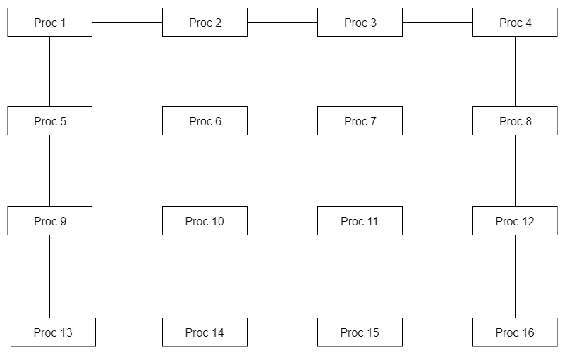
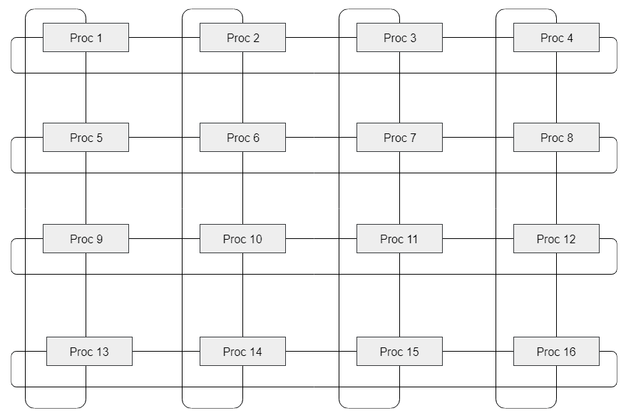

# 第十四章：分布式内存管理

在过去的二十年中，行业已经看到了一个向大数据和机器学习架构的转变，这些架构涉及尽可能快地处理 TB / PB 级别的数据。随着计算能力变得更加便宜，需要使用多个处理器来加速处理规模更大的数据。这导致了分布式计算。分布式计算是指通过某种网络/分发中间件连接的计算机系统的安排。所有连接的系统共享资源，并通过中间件协调它们的活动，以便它们以最终用户感知为单个系统的方式工作。由于现代应用程序的巨大容量和吞吐量要求，需要分布式计算。一些典型的示例场景，其中单个系统无法满足计算需求，需要在计算机网格上分布的情况如下：

+   谷歌每年至少进行 1500 亿次搜索。

+   物联网设备向事件中心发送多个 TB 的数据。

+   数据仓库在最短的时间内接收和计算 TB 级别的记录。

在本章中，我们将讨论分布式内存管理和分布式计算的需求。我们还将了解分布式系统中如何通过通信网络传递消息，以及各种类型的通信网络。

本章将涵盖以下主题：

+   分布式系统的优势

+   共享内存模型与分布式内存模型

+   通信网络的类型

+   通信网络的属性

+   探索拓扑结构

+   使用消息传递编程来编程分布式内存机器

+   集合

# 技术要求

要完成本章，您需要了解在 C 和 C# Windows 平台 API 调用编程中的编程知识。

# 分布式系统简介

我们已经在本书中讨论了分布式计算的工作原理。在本节中，我们将尝试通过一个在数组上工作的小例子来理解分布式计算。

假设我们有一个包含 1040 个元素的数组，我们想找出所有数字的总和：

```cs
a = [1,2,3, 4...., n]
```

如果将数字相加所需的总时间为 x（假设所有数字都很大），并且我们希望尽快计算它们，我们可以利用分布式计算。我们将数组分成多个数组（假设有四个数组），每个数组包含原始元素数量的 25％，并将每个数组发送到不同的处理器以计算总和，如下所示：


在这种安排中，将所有数字相加所需的总时间减少到（x/4 + d）或（x/处理器数量 + d），其中 d 是从所有处理器收集总和并将它们相加以获得最终结果所需的时间。

分布式系统的一些优势如下：

+   系统可以在没有任何硬件限制的情况下扩展到任何级别

+   没有单点故障，使它们更具容错性

+   高度可用

+   处理大数据问题时非常高效

分布式系统经常与并行系统混淆，但它们之间有微妙的区别。**并行系统**是一种多处理器的排列，它们大多放置在单个容器中，但有时也放置在多个容器中。**分布式系统**则由多个处理器组成（每个处理器都有自己的内存和 I/O 设备），它们通过网络连接在一起，实现数据交换。

# 共享与分布式内存模型

为了实现高性能，多处理器和多计算机架构已经发展。使用多处理器架构，多个处理器共享一个公共内存，并通过读/写共享内存进行通信。使用多计算机，多台不共享单个物理内存的计算机通过传递消息进行通信。**分布式共享内存**（**DSM**）处理在物理、非共享（分布式）架构中共享内存。

让我们分别看看它们，并谈论它们的区别。

# 共享内存模型

在共享内存模型的情况下，多个处理器共享单个公共内存空间。由于多个处理器共享内存空间，需要一些同步措施来避免数据损坏和竞争条件。正如我们在本书中所看到的，同步会带来性能开销。以下是共享内存模型的示例表示。如您所见，排列中有**n**个处理器，所有这些处理器都可以访问一个共享的内存块：


共享内存模型的特点如下：

+   所有处理器都可以访问整个内存块。内存块可以是由内存模块组成的单个内存块，如下图所示：


+   处理器通过在主内存中创建共享变量来相互通信。

+   并行化的效率在很大程度上取决于服务总线的速度。

+   由于服务总线的速度，系统只能扩展到 n 个处理器。

共享内存模型也被称为**对称多处理**（**SMP**）模型，因为所有处理器都可以访问所有可用的内存块。

# 分布式内存模型

在分布式内存模型的情况下，内存空间不再跨处理器共享。事实上，处理器不共享共同的物理位置；相反，它们可以远程放置。每个处理器都有自己的私有内存空间和 I/O 设备。数据存储在处理器之间而不是单个内存中。每个处理器可以处理自己的本地数据，但要访问存储在其他处理器内存中的数据，它们需要通过通信网络连接。数据通过**消息传递**在处理器之间传递，使用*发送消息*和*接收消息*指令。以下是分布式内存模型的图示表示：


上图描述了每个处理器及其自己的内存空间，并通过 I/O 接口与**通信网络**进行交互。让我们试着了解分布式系统中可以使用的各种通信网络类型。

# 通信网络的类型

通信网络是连接典型计算机网络中的两个或多个节点的链路。通信网络分为两类：

+   静态通信网络

+   动态通信网络

让我们来看看两者。

# 静态通信网络

静态通信网络包含链接，如下图所示：


链接用于连接节点，从而创建一个完整的通信网络，其中任何节点都可以与任何其他节点通信。

# 动态通信网络

动态通信网络具有链接和交换机，如下图所示：


交换机是具有输入/输出端口的设备，并将输入数据重定向到输出端口。这意味着路径是动态的。如果一个处理器想要向另一个处理器发送数据，就需要通过交换机进行，如前图所示。

# 通信网络的属性

在设计通信网络时，我们需要考虑以下特性：

+   拓扑

+   路由算法

+   交换策略

+   流量控制

让我们更详细地看看这些特性。

# 拓扑

拓扑指的是节点（桥接器、交换机和基础设备）的连接方式。一些常见的拓扑包括交叉开关、环形、2D 网格、3D 网格、更高维网格、2D 环、3D 环、更高维环、超立方体、树、蝴蝶、完美洗牌和蜻蜓。

在交叉开关拓扑的情况下，网络中的每个节点都连接到每个其他节点（尽管它们可能不是直接连接的）。因此，消息可以通过多条路由传递，以避免任何冲突。以下是一个典型的交叉开关拓扑：


在网状拓扑或者常被称为网状网络的情况下，节点直接连接到彼此，而不依赖于网络中的其他节点。这样，所有节点都可以独立地中继信息。网状可以是部分连接或完全连接的。以下是一个典型的完全连接的网状：


我们将在本章后面更详细地讨论拓扑，在*探索拓扑*部分。

# 路由算法

路由是通过网络发送信息包以使其到达预定节点的过程。路由可以是自适应的，即它通过不断从相邻节点获取信息来响应网络拓扑的变化，也可以是非自适应的，即它们是静态的，并且在网络引导时将路由信息下载到节点。需要选择路由算法以确保没有死锁。例如，在 2D 环中，所有路径都从东到西和从北到南，以避免任何死锁情况。我们将在本章后面更详细地讨论 2D 环。

# 交换策略

选择适当的交换策略可以提高网络的性能。最突出的两种交换策略如下：

+   **电路交换**：在电路交换中，整个消息的完整路径被保留，比如电话。在电话网络上开始通话时，需要在呼叫方和被呼叫方之间建立专用电路，并且在整个通话期间电路保持不变。

+   **分组交换**：在分组交换中，消息被分成单独路由的数据包，比如互联网。在成本效益方面，它比电路交换要好得多，因为链路的成本是由用户共享的。分组交换主要用于异步场景，比如发送电子邮件或文件传输。

# 流量控制

流量控制是网络确保数据包在发送方和接收方之间高效、无误地传输的过程。在网络拓扑的情况下，发送方和接收方的速度可能不同，这可能导致瓶颈或在某些情况下丢失数据包。通过流量控制，我们可以在网络拥塞时做出决策。一些策略包括临时将数据存储到缓冲区中、将数据重新路由到其他节点、指示源节点暂停传输、丢弃数据等。以下是一些常见的流量控制算法：

+   **停止等待**：整个消息被分成部分。发送方将一部分发送给接收方，并等待在特定时间段（超时）内收到确认。一旦发送方收到确认，就发送消息的下一部分。

+   **滑动窗口**：接收方为发送方分配一个传输窗口来发送消息。当窗口已满时，发送方必须停止传输，以便接收方可以处理消息并通知下一个传输窗口。当接收方将数据存储在缓冲区中并且只能接收缓冲区容量时，这种方法效果最好。

# 探索拓扑

到目前为止，我们已经看过一些完整的通信网络，其中每个处理器都可以直接与其他处理器通信，而不需要任何交换机。当处理器数量较少时，这种排列效果很好，但如果需要增加处理器数量，就会变得非常麻烦。还有其他各种性能拓扑可供使用。在测量拓扑中的图的性能时有两个重要方面：

+   **图的直径**：节点之间的最长路径。

+   **二分带宽**：将网络分成两个相等的部分的最小切割的带宽。这对于每个处理器都需要与其他处理器通信的网络非常重要。

以下是一些网络拓扑的示例。

# 线性和环形拓扑

这些拓扑结构与 1D 数组配合得很好。在线性拓扑的情况下，所有处理器都按线性排列，有一个输入和输出流，而在环形拓扑的情况下，处理器形成一个回路返回到起始处理器。

让我们更详细地看一下它们。

# 线性数组

所有处理器都按线性排列，如下图所示：


这种排列将具有以下直径和二分带宽的值：

+   直径= n-1，其中 n 是处理器的数量

+   二分带宽= 1

# 环形或环面

所有处理器都处于环形排列中，信息从一个处理器流向另一个处理器，然后回到起始处理器。然后，这形成一个环，如下图所示：


这种排列将具有以下直径和二分带宽的值：

+   直径= n/2，其中 n 是处理器的数量

+   二分带宽= 2

# 网格和环形

这些拓扑结构与 2D 和 3D 数组配合得很好。让我们更详细地看一下它们。

# 2D 网格

在网格的情况下，节点直接连接到彼此，而不依赖于网络中的其他节点。所有节点都处于 2D 网格排列中，如下图所示：



这种排列将具有以下直径和二分带宽的值：

+   直径= 2 * ( sqrt ( n ) – 1 )，其中 n 是处理器的数量

+   二分带宽= sqrt( n )

# 2D 环面

所有处理器都按 2D 环排列，如下图所示：



这种排列将具有以下直径和二分带宽的值：

+   直径= sqrt( n )，其中 n 是处理器的数量

+   二分带宽= 2 * sqrt(n)

# 使用消息传递编程分布式内存机器

在本节中，我们将讨论如何使用 Microsoft 的消息传递接口（MPI）编程分布式内存机器。

MPI 是一个标准的、可移植的系统，专为分布式和并行系统开发。它定义了一组基本函数，这些函数由并行硬件供应商用于支持分布式内存通信。在接下来的章节中，我们将讨论使用 MPI 相对于旧的消息传递库的优势，并解释如何安装和运行一个简单的 MPI 程序。

# 为什么使用 MPI？

MPI 的一个优点是 MPI 例程可以从各种语言中调用，如 C、C++、C#、Java、Python 等。与旧的消息传递库相比，MPI 具有高度的可移植性，MPI 例程针对它们应该运行的每一块硬件进行了速度优化。

# 在 Windows 上安装 MPI

MPI 可以从[`www.open-mpi.org/software/ompi/v1.10/`](https://www.open-mpi.org/software/ompi/v1.10/)下载并安装为 ZIP 文件。

或者，您可以从[`github.com/Microsoft/Microsoft-MPI/releases`](https://github.com/Microsoft/Microsoft-MPI/releases)下载 Microsoft 版本的 MPI。

# 使用 MPI 的示例程序

以下是一个简单的`HelloWorld`程序，我们可以使用 MPI 来运行。该程序在延迟两秒后打印代码正在执行的处理器编号。相同的代码可以在多个处理器上运行（我们可以指定处理器数量）。

让我们在 Visual Studio 中创建一个新的控制台应用程序项目，并在`Program.cs`文件中编写以下代码：

```cs
[DllImport("Kernel32.dll"), SuppressUnmanagedCodeSecurity]
public static extern int GetCurrentProcessorNumber();

static void Main(string[] args)
{
    Thread.Sleep(2000);
    Console.WriteLine($"Hello {GetCurrentProcessorNumber()} Id");
}
```

`GetCurrentProcessorNumber()`是一个实用函数，可以给出我们的代码正在执行的处理器编号。正如您从前面的代码中看到的，这并没有什么神奇之处-它作为一个单线程运行，并打印`Hello`和当前处理器编号。

我们将从*在 Windows 上安装 MPI*部分提供的 Microsoft MPI 链接中安装`msmpisetup.exe`。安装完成后，我们需要从命令提示符中执行以下命令：

```cs
C:\Program Files\Microsoft MPI\Bin>mpiexec.exe -n 5 “path to executable “
```

在这里，`n`表示我们希望程序在其上运行的处理器数量。

以下是前面代码的输出：


正如您所看到的，我们可以使用 MPI 在多个处理器上运行相同的程序。

# 基本的发送/接收使用

MPI 是一个 C++实现，微软网站上的大部分文档只能用 C++访问。然而，很容易创建一个.NET 编译包装器并在我们的任何项目中使用它。也有一些第三方.NET 实现可用于 MPI，但遗憾的是，目前还没有.NET Core 实现的支持。

以下是`MPI_Send`函数的语法，它将一个数据缓冲区发送到另一个处理器：

```cs
int MPIAPI MPI_Send(
  _In_opt_ void         *buf, //pointer to buffer containing Data to send
           int          count, //Number of elements in buffer
           MPI_Datatype datatype,//Datatype of element in buffer
           int          dest, //rank of destination process
           int          tag, //tag to distinguish between messages
           MPI_Comm     comm //Handle to communicator
);
```

当缓冲区可以安全重用时，该方法将返回。

以下是`MPU_Recv`函数的语法，它将从另一个处理器接收一个数据缓冲区：

```cs
int MPIAPI MPI_Recv(
  _In_opt_ void         *buf,
           int          count,
           MPI_Datatype datatype,
           int          source,
           int          tag,
           MPI_Comm     comm,
  _Out_    MPI_Status   *status //Returns MPI_SUCCESS  or the error code.
);
```

该方法在缓冲区被接收之前不会返回。

以下是使用发送和接收函数的典型示例：

```cs
#include “mpi.h”
#include <iostream> int main( int argc, char *argv[]) { int rank, buffer; MPI::Init(argv, argc); rank = MPI::COMM_WORLD.Get_rank(); // Process 0 sends data as buffer and Process 1 receives data as buffer if (rank == 0) { buffer = 999999; MPI::COMM_WORLD.Send( &buffer, 1, MPI::INT, 1, 0 ); } else if (rank == 1) { MPI::COMM_WORLD.Recv( &buffer, 1, MPI::INT, 0, 0 ); std::cout << “Data Received “ << buf << “\n”; } MPI::Finalize(); return 0; }
```

通过 MPI 运行时，通信器将发送数据，该数据将由另一个处理器中的接收函数接收。

# 集合

集合，顾名思义，是一种通信方法，其中通信器中的所有处理器都参与其中。集合帮助我们完成这些任务。用于此目的的两种主要使用的集合方法如下：

+   `MPI_BCAST`：这个函数将数据从一个（根）进程分发到通信器中的另一个处理器

+   `MPI_REDUCE`：这个函数将从通信器中的所有处理器中合并数据，并将其返回给根进程

现在我们了解了集合，我们已经到达了本章的结尾，也是本书的结尾。现在，是时候看看我们学到了什么了！

# 总结

在本章中，我们讨论了分布式内存管理实现。我们学习了分布式内存管理模型，如共享内存和分布式内存处理器，以及它们的实现。最后，我们讨论了 MPI 是什么以及如何利用它。我们还讨论了通信网络和实现高效网络的各种设计考虑。现在，您应该对网络拓扑、路由算法、交换策略和流量控制有很好的理解。

在本书中，我们已经涵盖了.NET Core 3.1 中可用的各种编程构造，以实现并行编程。如果正确使用，并行编程可以极大地提高应用程序的性能和响应能力。.NET Core 3.1 中可用的新功能和语法确实使编写/调试和维护并行代码变得更加容易。我们还讨论了在 TPL 出现之前我们如何编写多线程代码，以进行比较。

通过新的异步编程构造（async 和 await），我们学习了如何充分利用非阻塞 I/O，同时程序流程是同步的。然后，我们讨论了诸如异步流和异步主方法之类的新功能，这些功能可以帮助我们更轻松地编写异步代码。我们还讨论了 Visual Studio 中的并行工具支持，可以帮助我们更好地调试代码。最后，我们讨论了如何为并行代码编写单元测试用例，以使我们的代码更加健壮。

然后，我们通过介绍分布式编程技术以及如何在.NET Core 中使用它们来结束了这本书。

# 问题

1.  ____________ 是将多处理器放置在单个容器中，但有时也放置在彼此紧邻的多个容器中的一种安排。

1.  在动态通信网络的情况下，任何节点都可以向任何其他节点发送数据。

1.  真

1.  假

1.  以下哪些是通信网络的特征？

1.  拓扑

1.  切换策略

1.  流量控制

1.  共享内存

1.  在分布式内存模型的情况下，内存空间在处理器之间共享。

1.  真

1.  假

1.  电路切换可以用于异步场景。

1.  真

1.  假
