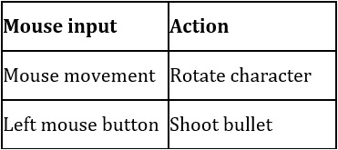
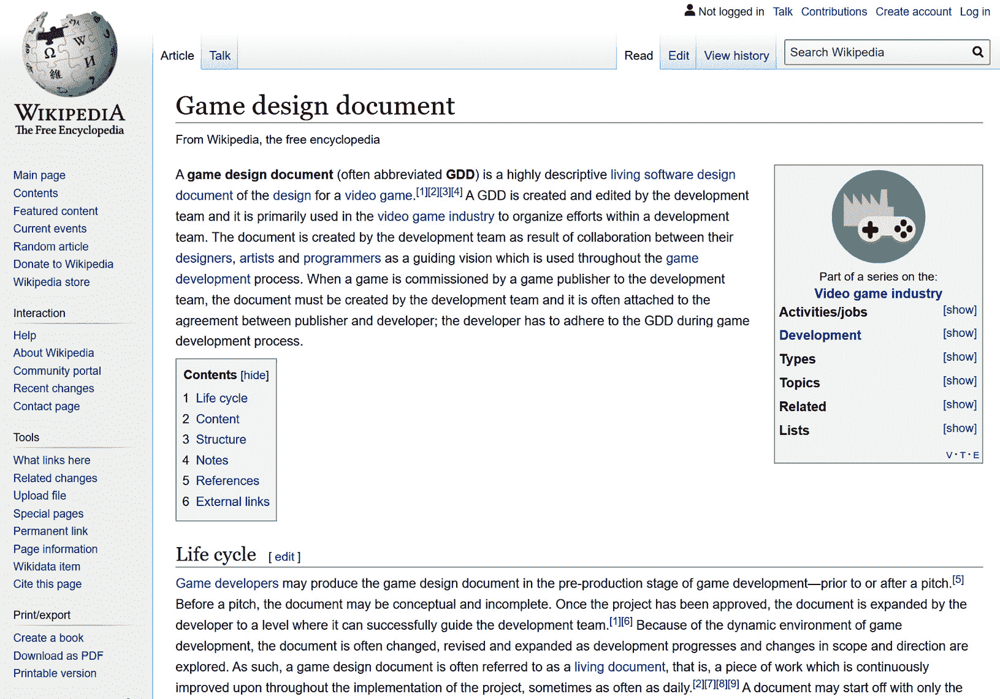

# 第一章：*第一章*：从零开始设计游戏

欢迎来到本书的第一章！我相信你和我一样对使用 Unity 进行游戏开发的惊人旅程充满期待。我们将分四部分来接触游戏开发。首先，我们将讨论游戏开发的基础知识，涉及如何在编码之前设计游戏等主题，然后我们将使用 Unity 原型制作一个简单的第一关。然后，我们将深入图形学，找出一个好游戏的外观和感觉。之后，我们将学习如何通过脚本使一切运动起来；最后，我们将看到你如何完成并发布你的游戏。在阅读各章节时，你将把每个概念应用到一个完整的游戏项目中，因此你将以一个完全功能的射击游戏结束本书。

在这一章中，我们将设计我们的游戏《超级射手》。这个阶段被称为前期制作，我们将创建一个开发计划。我们的游戏设计将包括我们想要在游戏中拥有的所有功能：玩家角色、非玩家角色、游戏资产、动画等等。我们将使用屏幕模拟以及叙述来记录我们游戏的设计。我们将在这个过程中讨论有关使用 Unity 开发我们的游戏所需的所有设计工作的相关概念。我们将讨论在整个本章中我们将要做的所有设计工作所需的文档。

具体来说，我们将在本章中研究以下概念：

+   游戏概念

+   游戏角色

+   游戏玩法

+   难度平衡

+   文档

# 游戏概念

为什么不直接开始开发我们的游戏而不是先设计它呢？这个问题源自于开发游戏的兴奋，特别是使用 Unity 游戏引擎。所有的游戏都始于一个想法。这个想法被转化为设计，而这个设计是开发和最终游戏的基础。

游戏的设计就像房子的蓝图。你不会考虑在没有蓝图的情况下建造房子，同样，开发游戏而不先设计它也是一个同样糟糕的主意。这样做的原因是为了节省时间和挫折。对于更大的项目，浪费的时间也意味着不必要的资金支出。

想象一下，你雇佣了一个由 12 名开发人员、动画师和艺术家组成的项目团队。如果你分享了你的游戏想法，他们会有足够的信息吗？他们会做出很棒的东西，但没有一个统一的游戏组件吗？我们在游戏设计中所做的一切就是在一开始尽可能多地记录，以便开发过程是有目的的。毫无疑问，在开发过程中，你将不断修改你的游戏设计，因此拥有一个坚实的起点对你的成功至关重要。

我们的游戏设计将作为我们游戏外观的基础，玩家的目标是什么，游戏玩法是什么，以及支持用户操作、动画、音频、人工智能和胜利条件。这是需要考虑的很多内容，也强调了将游戏想法转化为游戏设计的重要性。

在整本书中，我们将涵盖一系列组件。然而，在本节中，我们将涵盖以下列表中出现的组件：

+   游戏想法

+   输入控制

+   胜利和失败

所以，让我们更详细地看看每个组件。

游戏想法

我们《超级射手》游戏的基本概念是，它将是一个 3D 游戏，以未来英雄士兵为玩家角色。角色必须与敌方士兵作战。这些敌人打算摧毁我们英雄的基地，以及任何阻挡他们的人，包括我们的英雄。他将有一定数量的子弹需要跟踪。

既然我们已经大致知道游戏将会是什么样子，让我们来谈谈玩家将如何控制角色。

## 输入控制

考虑玩家如何与我们的游戏互动是很重要的。玩家将使用标准的控制方式来控制我们的英雄。玩家期望游戏中实施用户控制的行业规范。因此，我们默认的用户输入控制组合，如下截图所示，将包括键盘和鼠标：

图 1.1 - 控制方案

我们将配置和编程我们的游戏，以便键盘的用户输入与下表中显示的键和动作配对相匹配：

图 1.2 - 键映射

鼠标也将是用户输入的重要来源。我们将使用鼠标实现两个组件，如下表所示：

图 1.3 - 鼠标映射

左鼠标按钮将是我们的动作按钮。我们需要确保只有当玩家剩下一个或多个子弹时才会射击子弹。

这就是我们处理输入的方式，但有时我们需要结束游戏会话！让我们谈谈玩家如何获胜和失败。

## 获胜和失败

我们的获胜条件是当所有敌人波都被消灭时。玩家可以输掉游戏的两种不同方式。第一个失败条件是当基地生命值变为**0**时。第二个失败条件是如果英雄的生命值变为**0**。

通过这个简短的描述，你可以知道有几件事情需要跟踪，包括以下内容：

+   剩余波数

+   我们基地的生命值

+   我们英雄的生命值

现在，我们已经定义了所谓的游戏“核心循环”（开始一个关卡，玩它，赢/输它，然后重复）。让我们深入探讨具体细节，从我们的角色开始。

# 游戏角色

我们的游戏将包含几个对象，但只有两种游戏角色。第一个游戏角色是我们的英雄，将由玩家控制。第二种游戏角色是敌人。他们是由人工智能控制的非玩家角色。让我们更仔细地看看这两个角色。

## 英雄

玩家将扮演我们游戏的主角英雄。这是一个我们将导入并在游戏中使用的角色。那么，我们的英雄玩家角色能做什么呢？我们已经知道我们将能够使用键盘和鼠标输入的组合在游戏环境中移动他们。我们也知道左鼠标按钮 - 我们的动作按钮 - 会让他射击子弹。

重要提示：

因为英雄是由人类玩家控制，所以被称为玩家角色。

我们将为英雄实现以下动画：

+   **空闲**：当角色没有被玩家移动时，将播放此动画。

+   **奔跑**：当角色被玩家移动时，将播放此动画。

+   **射击**：这是一个会让英雄射击子弹的动画。

这是我们的玩家。现在，让我们讨论我们的敌人角色。

## 敌人

我们游戏的反派将是敌人士兵。我们将控制他们在游戏中的数量和位置。我们还将通过人工智能控制他们的行为。敌人将直奔基地，一旦到达那里，他们将开始破坏它。我们将确定我们的基地被完全摧毁需要多长时间。

信息框：

因为敌人是由人工智能控制而不是人类玩家，所以被称为非玩家角色。

我们将为敌人士兵实现以下动画：

+   **奔跑**：当敌人看到英雄时，他们将向英雄奔跑，并在靠近玩家足够近时停下来开始攻击。

+   **攻击**：当敌人靠近攻击基地或玩家时，将播放此动画。

+   **死亡**：当敌人被玩家击败时，将播放此动画。

我们需要仔细的规划和脚本编写来创建所需的敌人行为。敌人的数量和位置是我们需要做出的决定。

这定义了我们角色的细节。现在，让我们讨论游戏将如何进行，看看具体的细节。

# 游戏玩法

游戏将从玩家位于游戏世界中心开始。由玩家控制的英雄需要保卫基地免受敌人的攻击。为了击退敌人，英雄将拥有一定数量的子弹。目标是在基地被完全摧毁之前击败所有的敌人。

让我们看看我们将如何实现所有这些。本节涵盖了以下游戏组件：

+   游戏世界布局

+   起始条件

+   结束条件

+   积分系统

+   **头顶显示**（**HUD**）

我们将涵盖每个前面的组件，并讨论它们如何改变游戏体验。让我们从游戏世界的设计开始谈起。

## 游戏世界布局

我们将创建我们的基地环境，其中包括大型金属地板砖、墙壁、敌人生成的门，以及屏幕底部的基地建筑，敌人需要到达并开始攻击它。

这是我们游戏世界的形状的模拟：

图 1.4 - 基地布局

在前面的模拟中有四个基本的事物，列举如下：

+   **墙**：无法穿透的屏障，防止玩家走出游戏区域。

+   **门**：与墙壁一样坚固，也将作为敌人的生成位置。敌人将在它们的后面生成，并可以穿过它们进入我们的基地区域。

+   **玩家起始**：英雄的起始位置。

+   基地建设：我们的基地。敌人必须足够接近才能攻击它。

随着我们基地级别设计的完成，让我们讨论玩家如何以温和的方式进入这个世界。

## 起始条件

当我们的游戏首次启动时，我们将设置几个起始条件。以下是这些条件的列表：

+   敌人生成点（门）的数量和位置

+   英雄持有的子弹数量

+   基地的位置

让我们看看每个这些起始条件：

+   第一个起始条件是敌人的生成位置。正如您在我们之前的模拟中看到的，游戏中将有几个可能的生成点（门）。我们将编写一个脚本，以便每次在随机位置生成敌人的波数。每一波都会增加敌人的数量，增加难度。

+   玩家持有的子弹数量必须经过仔细考虑。它需要足够大，以在敌人耗尽之前击败敌人。

+   我们的第三个和最后一个起始条件是基地的位置。正如您从前面的截图中看到的，它位于门的对面 - 因此，敌人必须穿过它们之间的整个空间，给玩家一个攻击他们的机会。

我们已经定义了敌人生成规则以及玩家如何玩游戏。现在，让我们谈谈游戏将如何结束，看看具体的实现方式。

## 结束条件

到目前为止，我们已经确定了游戏中要跟踪的几个组件。让我们记住它们 - 它们如下：

+   剩余波数

+   基地健康

+   玩家健康

根据我们之前对游戏结束条件的决定，我们可以应用以下数学检查来确定游戏是否结束以及结果是什么。每个游戏结束条件都列在下表中，以及结果：

图 1.5 - 游戏结束条件

为了实现这三个游戏结束条件，我们知道我们必须跟踪波数、玩家健康和基地健康。这是必须的。

现在我们有了一个完整的游戏，让我们考虑如何通过实现一个经典的积分系统使其更有价值。

## 积分系统

由于我们正在跟踪涉及数字的关键信息，这使得我们可以轻松实现一个积分系统。例如，每次消灭一个敌人，我们可以给玩家 50 分，或者每次敌人损害基地时我们也可以扣分。在我们的情况下，我们将只在敌人被杀时给分，但如果您愿意，可以随意扩展这个领域。

现在，我们有几个玩家需要了解的系统，但是目前玩家没有任何方法可以对其做出知情决策。因此，让我们看看如何使用 HUD 来改进。

## HUD

我们决定在游戏过程中跟踪信息，这些信息不仅在计算得分和游戏结束时有价值。玩家会希望看到这些信息，因为它往往会提供动力，并增加游戏的乐趣。因此，我们将为玩家创建一个 HUD，并动态更新游戏中的数据。

信息框：

HUD 是屏幕上始终存在的信息视觉层。

这是我们超级射手游戏中 HUD 的模拟图：

图 1.6 – UI 布局

正如您所看到的，我们的 HUD 有几个组件，如下：

+   **英雄生命值**：经典的生命值条，让我们可以直观地看到剩余的生命值。我们选择条形图而不是数字，因为在激烈战斗中更容易看到，而不是读取数字。

+   **英雄头像**：生命值条旁边的图像，只是为了展示我们英雄的面孔。

+   **得分**：我们已经获得的分数。

+   **子弹**：剩余的子弹数量。玩家必须经常检查这个数字，以避免用尽子弹。

+   **剩余波次/敌人**：关于当前波次和游戏状态的信息，只是让玩家知道游戏何时结束，在此过程中给他们施加一些压力。

+   **基地生命值**：另一个重要的信息。足够大，让玩家注意到基地正在受到攻击，并在这种情况下采取行动。

最后，我们有一个完全成熟的游戏，有很多关于它将如何行为的规则和规范，我们现在可以开始创建我们的游戏。然而，有一个好的实践是：平衡游戏永远不会太早。

# 难度平衡

确定游戏难度时需要考虑很多因素。如果太难，玩家会失去兴趣，如果游戏太容易，可能不会吸引目标受众。一些游戏包括供用户选择的难度级别。其他游戏有多个级别，每个级别难度逐渐增加。为了实现我们期望的难度平衡，我们必须应对几个问题。

在本节中，我们首先将看一些与难度平衡相关的问题，然后是我们的实施计划。

## 难度平衡问题

我们需要在游戏设计中考虑很多关于我们游戏的问题。回顾本节中的问题将帮助我们了解即使是像我们这样简单的游戏也必须应对的问题，以实现期望的难度平衡。

以下是第一组问题，与我们游戏中难度的整体实施有关：

+   我们是否应该有玩家可选择的不同难度级别？

+   每个难度级别会有什么具体不同？

+   我们是否应该有多个游戏级别，每个级别难度增加？

+   每个游戏级别会有什么具体不同？

考虑以下关于我们游戏中敌人的问题：

+   每个波次应该生成多少敌人？

+   敌人应在多远的距离内意识到英雄？

+   敌人每次攻击应对玩家造成多少伤害？

+   敌人可以忍受多少伤害才会死亡？

以下列出的下一组问题涉及我们的可玩角色，英雄：

+   角色应该有多少生命？

+   角色应该从单个敌人的攻击中受到多少伤害？

+   角色应该能够超越敌人吗？

我们还需要考虑基地和子弹在我们的游戏中。以下是我们将在游戏中实施的这些游戏资产的一些问题。对于基地，问题如下：

+   敌人摧毁基地需要多少次攻击？

+   一波中产生的敌人的理想最大数量是多少？

+   门和基地应该在游戏环境中的哪里？

现在，让我们讨论子弹的情况下的问题，如下所示：

+   玩家应该以什么速度用尽子弹？

+   玩家可以拥有的子弹的最大数量是多少？

+   子弹会对敌人造成多少伤害？

正如你所看到的，我们需要回答几个问题作为我们设计的一部分。一些问题可能看起来多余，因为它们涉及游戏中的多个组件。现在，让我们回答其中一些。

## 实施计划

根据上一节中提出的问题，我们必须想出一些答案。所以，让我们在这里做到这一点。我们的第一组决策集中在整体游戏概念上，如下所示：

+   实施一个游戏级别。

+   为用户提供三种游戏难度设置：`简单`，`普通`和`困难`。

现在我们决定创建三个游戏级别，我们必须确定它们将如何不同。这可以通过使用矩阵轻松管理。当我们填写矩阵时，我们将能够记录大多数先前列出的问题的答案。这就是我们将称之为难度实施矩阵的东西。

图 1.7 - 每个级别的难度通过

还将有一组决策，不会根据用户选择的难度级别而改变。以下是这些决策的列表：

+   敌人的攻击性不会改变。我们将对它们进行脚本编写，以便如果它们意识到英雄，它们将攻击他。

+   我们将为敌人建立一个相当小的视野范围，这样英雄可以轻松地溜过它们，也许更重要的是，超过它们。

+   重生将在游戏模型中先前确定的生成点之间随机进行。

重要的是要考虑到这是第一次平衡调整，我们肯定会根据我们进行游戏实施时进行的测试进行更改。

现在，我们可以说游戏设计已经完成了，还是可以吗？实际上，游戏设计永远不会结束；随着游戏的开发，它将不断发展，但让我们把这个留到以后。现在，让我们谈谈如何用文档与团队中的每个人沟通我们伟大的想法。

# 文档

现在我们已经涵盖了游戏的所有主要方面，重要的是要准备好与他人分享。通过这本书，你可能会独自工作，但在现实生产中，你可能会与他人合作，因此分享你的愿景是你需要获得的关键技能，以创造成功的游戏。你不仅会与队友分享你的愿景，还会与希望投资你的游戏项目的潜在投资者分享。在本节中，我们将提供关于如何将游戏信息正确格式化为可理解文件的建议。

## 游戏设计文件（GDD）

这个文件基本上是你的游戏圣经。它包含了游戏的所有方面的分解，每个方面都有关于不同游戏系统应该如何工作的详细解释。在这里，你将把我们之前在实施计划中回答的问题和答案放在一起，并深入研究它们。记住，你脑海中有一个想法，确保其他人理解那个想法是复杂的，所以不要低估这一重要任务。

也许你正在独自制作一款游戏，并且说你不需要 GDD，因为所有的想法都可以在你的脑海中得到体现，对于非常小的游戏来说可能是真的，但任何规模的游戏和团队都可以从 GDD 中受益。它将作为你的笔记本，记录下你自己的想法并阅读它们。这很重要，因为在你的脑海中一切都是有意义的，但一旦你阅读自己的想法并审查它们，你会发现很多盲点可以很容易地修复，而不是在编写整个游戏时才发现它们。

让我们开始谈论 GDD 的结构可以是什么样的。

## GDD 格式

遗憾的是，没有一种标准或独特的创建 GDD 的方式。每家公司和团队都有自己的做法，不仅在创建它时使用的工具方面，还有文件的内容。这在很大程度上取决于团队的规模（或团队）、游戏类型和公司背后的一般文化。事实上，一些公司实际上认为没有必要创建 GDD。

开始创建它们的一个好主意是查看几款游戏的已发布 GDD。有很多这样的游戏，包括大型知名游戏（如《毁灭战士》）。它们大多是 Word 文档，其中有解释游戏系统（如武器、库存等）的部分，以及所有角色的列表，而有些可能只是一个列出游戏不同部分的事实的项目列表。之后，你可以开始尝试不同的 GDD 格式，以适应你的项目和团队。

一旦你决定了一个好的格式，你必须实际决定你将如何写这个格式，除了使用纸和笔，一个更好的主意是利用所有那些出色的数字工具。让我们看看其中一些。

## GDD 创建工具

在审查现有的 GDD 之后，下一步是选择一个合适的工具来编写它。你需要考虑的第一件事是，GDD 会经常发生很多变化。在创建游戏的过程中，你将验证或放弃你在 GDD 中写的想法，所以使用一个动态工具是个好主意。这可以通过你熟悉的任何文本处理器来实现，但你还需要解决其他问题，也许文本处理器不够用。

你的 GDD 会很大，我的意思是，非常大，即使对于简单的游戏来说也是如此，所以它会有很多部分，你会发现整个部分都会引用其他部分，生成一个大的链接网络连接文档的几个部分。在这种情况下，使用任何一种维基而不是文本处理器来管理这一点是个好主意，维基是极其有用的工具，我强烈建议在这些情况下使用。它们允许你将整个 GDD 分解为可以轻松编辑和链接到其他文章的文章，而且许多维基还允许你协作编辑文章。还有其他附加功能，比如评论，允许在 GDD 内部对一个功能进行整个对话，并记录下来以供将来参考。与 GDD 相关的*维基百科*页面可以在以下截图中看到：

图 1.8 - 维基百科网站

此外，你还可以使用其他工具，比如 Google Drive，它允许你混合不同类型的文档 - 从常规文本文档到动态幻灯片 - 来创建演示文稿，用简单而强大的媒体传达复杂的方面。此外，Google Drive 还有许多出色的协作工具，可以改善多人共同参与 GDD 的工作方式。

我们描述的所有工具都是通用的解决方案，用于撰写一般文件，它们可以像魅力一样工作，但也有其他专门为游戏设计的工具。

现在，让我们开始写我们的 GDD。我知道我说没有标准格式，但至少让我们看看每个 GDD 应该有什么，从电梯演讲开始。

## 电梯演讲

想象一下，你在一栋大楼里乘坐电梯，下一层，一个重要的游戏投资者刚好进来了。他们按了十楼的按钮，所以你有八层的时间来说服他们把钱投入你的口袋，帮助你创造游戏。我知道这是一个不太可能的情况，但在现实生活中，当你站在一个圆桌前面的投资者面前时，你没有太多时间说服他们。记住，在你身后可能有成千上万的开发者想要做同样的事情，所以你必须快速而直接，这就是为什么拥有一个好的电梯推销如此重要。

电梯推销可能是你在 GDD 中找到的第一句话，也是最重要的一句。它需要用不超过两行来描述你的游戏，并说服阅读 GDD 的人你的游戏是一个好主意——你需要让他们立刻想要玩你的游戏。是的——听起来非常雄心勃勃，而且确实如此，但这可以让你脱颖而出，与众多想为他们的游戏获得资金的开发者区分开来。

再次强调，没有标准的公式可以创造成功的电梯推销（如果有这样的东西，我们都会变得富有），但以下是一些需要考虑的建议：

+   你必须在不超过 10 秒的时间内做出你的推销。再长一点，你就会失去你试图说服的人的兴趣。

+   你必须对自己的想法有信心；没有人会投资于你自己都不确定的游戏是否是下一个大作。

+   不要使用任何技术性词汇（我在看你，程序员）。

+   包括你的游戏与所有其他游戏的区别。

+   反复修改，直到你能说服身边的任何人来玩这个游戏，试着找一个最诚实的人来测试——一个不会介意把你的想法击得粉碎的人（如果你的想法真的值得的话）。

+   反复练习，站在镜子前，直到你能够清晰、明确地一次说出来。

以下是一些电梯推销的例子：

+   想象一下用你的手臂和力量屠杀巨大的希腊神祗，直到你成为奥林匹斯之王。你将在[`在这里插入一个完全不存在的游戏名称`]中感受到那种力量。

+   文明已经崩溃。可怕的感染让人们变成了僵尸。你拥有唯一的解药，必须穿越整个国家去交付它，否则人类将崩溃。

好吧——现在这些推销可能不是很原创，但几年前它们是的。想象一下那时这些推销的力量；你必须找到类似的东西。我不是说这很容易，但看看只有两行可以成为惊人体验的开始，所以首先专注于写下这两行，然后再写游戏的其余部分。

现在你已经吸引了投资者的注意，是时候向他们展示所有的游戏系统和一些细节来进一步激发他们的热情，好吧，现在不是时候。你刚刚吸引了他们的注意，你还没有说服他们。现在是时候开始谈谈你的游戏，一个高概念是一个很好的方式。

## 一个高概念

一个高概念是一系列陈述，进一步简洁地描述你的游戏，即使你不是在说服投资者，这些陈述也会概述你的游戏将如何定义。

一个好的高概念可以包括以下部分：

+   **电梯推销**：正如我们在前一节中所解释的。

+   **类型**：也许您正在创造以前从未见过的新东西，但它可能会受到其他几款游戏的启发。在这里，您将指定您的想法基于哪种类型的游戏，以便文档的读者可以开始想象游戏的玩法。稍后，您将指定区别，但最好先提出一个众所周知的想法，以便开始构建读者的概念。此外，您还可以在此处指定玩家在游戏中的视角和设置，例如：*顶部中世纪 Roguelike 角色扮演游戏（RPG）*。

+   平台和人口统计：您需要非常清楚地知道谁会玩您的游戏。为北美成年人创建游戏与为中国青少年创建游戏或为那些想在回家的路上或公交车上分散几分钟注意力的商务人士创建游戏并不相同。这些人群会希望不同的体验，不同挑战的水平和游戏时长。他们甚至会使用不同的设备来玩游戏。考虑到这一点，将有助于您找到最适合目标受众的游戏机制和平衡。通常人们会说他们正在为自己创建游戏，但请记住您不会购买那款游戏，因此在创建游戏时也要考虑您的钱包，例如：*休闲手机平台玩家*。

+   **特点**：列出您的游戏将具有的不超过三到五个特点。列出您将从所选择的游戏类型中使用的特点，例如：*您将用各种武器击败敌人的波浪。您将升级您的飞船以提高其属性*。

+   **独特卖点（USP）**：这与特点列表类似，但在这里，您将包括区分您的游戏与其他游戏的特点（不超过三到五个），例如：*您可以使用跑酷风格的动作穿越场景。您可以使用掠夺的材料制作全新的武器*。想想这些特点在多年前是多么独特。

再次强调，没有理想的高概念。也许您会发现游戏的其他方面可以在此处突出并添加到文档中，但请尽量将所有内容放在一页上。

现在我们已经讨论了每个 GDD*应该*具备的内容，让我们谈谈 GDD*可能*具备的内容。

## 创建 GDD 的提示

现在，是时候定义整个游戏了。我们说 GDD 没有标准格式，但至少在创建时可以考虑几种良好的做法。以下列表突出了其中一些：

+   **可读性**：您的 GDD 必须准备好供任何人阅读，包括没有游戏开发知识的人。不要使用任何技术术语（猜猜我现在在看谁），并尽量保持简单。测试您的 GDD 可读性的一个好方法是将其交给您的祖母或任何您认为与游戏毫不相干的人，看看他们是否能够阅读。

+   **背景和介绍**：在开始描述游戏机制之前，让读者置身于游戏中。描述世界、玩家角色、他们的背景故事、动机以及玩家需要努力解决的主要问题。让 GDD 的读者对游戏的背景感兴趣，并希望继续阅读，看看他们将如何玩游戏并应对游戏中玩家将面临的所有任务。

+   **游戏玩法部分**：这些部分将游戏分解为相互关联的几个系统和子系统。一些示例可以是库存、任务、制作、战斗、移动、商店等等。您将需要非常具体地说明这些系统的每个方面，因为请记住，这份文件将被团队用来制作游戏的代码和资产。我们在本章的前几节中进行的所有先前分析都将在这里，并将进一步解释和分析。

+   **内容部分**：你还会想创建内容部分，比如我们之前设计的部分。这些可以是——但不限于——角色、故事、世界、关卡、美学、艺术资产、声音和音乐资产、经济和输入。

+   分享你的想法：在将你的想法永恒化在 GDD 上并让每个人开始制作它们之前，讨论不同的 GDD 部分然后再标记它们为完成。与你的团队、互联网上的人、朋友讨论——每个人都可以给你有价值的反馈关于你的想法。我很确定你在想你的想法会被互联网上的某个随机人偷走然后在你之前发布相同的游戏——这种情况可能会发生——但我并不是说分享整个 GDD，只是一些你对某些实施细节不确定的细节。

+   **保持控制**：团队中的每个人都是游戏设计师——有些人比其他人更多。每个人都会有自己的想法和他们会做不同的事情。倾听他们——这样做会很有用，但记住你是负责人，你将有最后的决定权。你需要开放，但设定一些限制，不要偏离你最初的想法和概念。防止著名的功能蔓延：知道什么是足够。再次强调，这并不是一项容易的任务——你会以艰难的方式学到这一点，相信我，但当发生这种情况时，请记住这一点：我告诉过你！

+   **游戏会改变**：我已经说过了，但我想尽可能强调这一点。游戏会因为你在创建过程中发现的许多原因而发生很大的变化。你可能会发现*X*机制并不那么有趣，你创造了更好的处理*Y*系统的方法，你认为值得花时间改变已经存在的游戏部分，因为测试表明玩家不理解如何使用你游戏中全新的关键功能，等等。要对变化持开放态度，并调整你的游戏想法。如果你以正确的方式做到这一点，你的游戏不会像你最初想象的那样，但会是它的更好版本。

+   **图形**：使用图形、图表等。尽量避免大段文字。记住一张图片胜过千言万语。你正在沟通，没有人想要花费宝贵的时间来理解你想要表达的内容。提高你的视觉沟通能力，你将拥有一个专注的团队。

+   **纸上原型**：在将想法写入 GDD 之前，你可以在纸上测试一些想法。即使你的游戏是一个狂热的“打击他们”，你也可以让小纸人物在桌子上移动，看看他们如何攻击玩家，以及他们将会有哪些移动模式。做一些数学来看看完美的时间、伤害和生命值等。

+   **定期原型**：当你的游戏正在开发时，GDD 将会根据玩家的反馈不断变化。你必须测试你的游戏，即使它还没有完成，并尽早从玩家那里得到反馈。当然，他们会告诉你很多你已经知道的事情，但他们会看到你没有看到的很多问题，因为你每天都在创作和玩你的游戏。他们有第一次玩游戏的优势，这是一个真正的改变。

游戏设计和 GDD 的创建是一个复杂的主题，可以在几章中探讨，但有很多书籍正是这样做的，游戏设计并不是本书的主要内容。

在这之后，我们可以开始创建我们的 GDD，并记住：你需要找出对你最有效的格式是什么。

# 总结

在这一章中，我们完全设计了我们的超级射手游戏，并计划利用我们的设计来推动我们的开发工作。我们的游戏设计包括功能、玩家角色、非玩家角色、游戏资产、动画等等。我们使用屏幕模拟来帮助记录我们游戏的设计。此外，我们计划了游戏的难度平衡，以确保游戏根据用户选择具有适当的难度。我们讨论了什么是 GDD，我们如何创建它，以及它和游戏设计在游戏制作过程中会发生什么变化。

请记住，这很重要，因为您希望在编写游戏代码之前回答所有可能的问题。如果您不这样做，您将不得不一遍又一遍地重新编写游戏的部分，以解决每一个意想不到的问题。您无法预防所有可能的复杂情况，但至少通过这种分析，可以解决大部分问题。

在下一章中，您将学习如何开始使用 Unity。您将了解为什么 Unity 是一个很好的选择来开始创建游戏。您将创建您的第一个游戏项目，并分析它是如何组成的。
