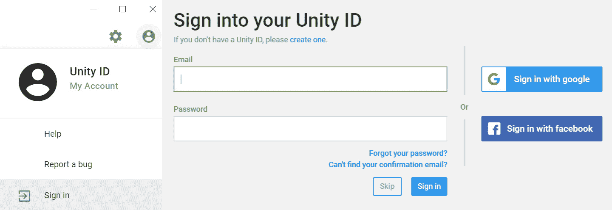
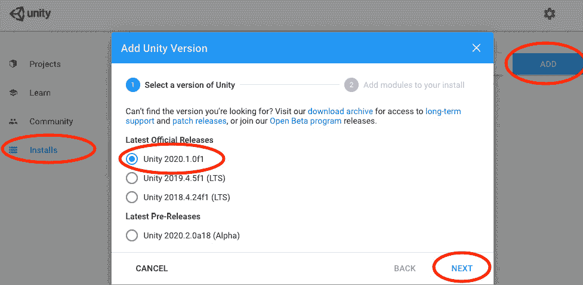
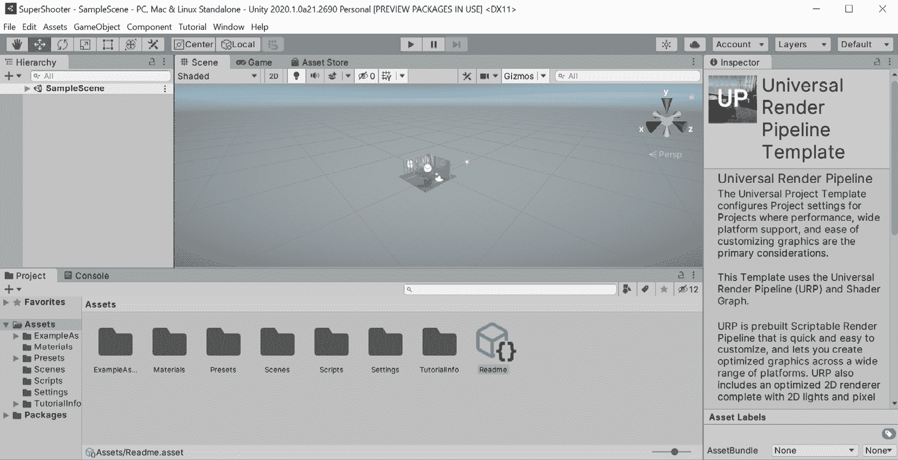
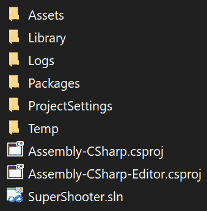

# 第二章：*第二章*：设置 Unity

在本章中，我们将学习为什么 Unity 是一个很好的**游戏引擎**入门工具。开始游戏开发职业有很多种方式，因此选择合适的工具是迈出的重要第一步。然后，我们将看到如何安装 Unity 并使用 Unity Hub 创建项目，这是一个管理不同 Unity 安装和项目的工具，帮助我们处理大量项目。

具体来说，在本章中我们将研究以下概念：

+   为什么要使用 Unity 这样的游戏引擎？

+   安装 Unity

+   创建项目

让我们首先讨论为什么选择 Unity 来开始你的游戏开发职业。

# 为什么要使用 Unity 这样的游戏引擎？

当你想创建一个游戏时，有几种方法可以选择，每种方法都有其利弊。那么，为什么选择 Unity 呢？在本节中，我们将讨论这些原因，概述先前和当前行业状态，并具体看到以下概念：

+   过去和现在的行业洞察

+   游戏引擎

+   Unity 的优势

## 过去和现在的行业洞察

在开始阶段，用户们在设备资源有限但游戏设计简单的情况下挣扎。随着行业的发展，硬件变得更加强大，游戏也比以前更加复杂。一个大型 AAA 游戏标题需要近 200 名开发人员，负责游戏的不同领域。这些角色中的每一个都需要多年的经验，使得游戏成为一项昂贵且风险高的任务：你永远不知道一个游戏是成功还是浪费了大量资金。因此，一个人很难制作整个游戏。

重要提示：

AAA 游戏是由许多在大公司工作的人创建的，通常成本数百万美元。还有 AA 游戏，这意味着团队规模和预算的差异。

过去，程序员需要学习如何使用许多工具来解决不同的游戏开发问题。一些工具停止了来自其创建者的支持，留下了未解决的错误和功能。因此，大公司开始雇佣高技能的开发人员来创建所有这些工具，结果就是所谓的游戏引擎。让我们来回顾一下这是什么。

## 游戏引擎

游戏引擎是一组不同的软件，解决游戏开发中的问题，如音频、图形和物理问题，但它们被设计为一起工作，都遵循相同的理念。这很重要，因为每个团队和公司都有自己的工作方式。从零开始创建游戏引擎是一项艰巨的任务，只有少数大公司能够做到这一点。公司创建的游戏引擎通常是私有的，所以只有公司被允许使用它们。一些公司出售他们的引擎，但成本太高。但几年前出现了另一种获取游戏引擎的方式。

你可能听说过由 1 至 10 名开发人员创建的独立游戏，但是这样一个小团队如何创建游戏呢？答案是**通用**游戏引擎。这些游戏引擎就像公司创建的那些一样，但它们被设计为每个游戏的良好基础，并提供一个准备好供任何游戏开发者使用的工具集。这些引擎创造了一整代的热衷开发者，他们现在能够比以前更容易地开发自己的游戏。过去有很多游戏引擎公司，但只有少数公司今天还在生存，Unity 是其中最有影响力的之一。但为什么呢？让我们进一步讨论这个问题。

重要提示：

其他通用引擎的例子包括虚幻引擎、Godot、扭矩和 CryEngine。

## Unity 的优势

好吧，有很多潜在原因解释了为什么 Unity 如此受欢迎。让我们列举其中一些，如下：

+   Unity 的设计初衷是简单易用，具有非常简单和精致的界面，以及少量但功能强大的工具设置。这有助于新手在启动引擎的第一秒就不会立即感到迷失。

+   Unity 的编程语言 C#对于初学者和高级程序员都非常熟悉，使用 C#进行编码的 Unity 方式简洁易懂。Unity 和 C#处理了您在其他语言中可能遇到的大部分编程问题，大大减少了您的生产时间。

+   当移动游戏市场时代开始时，Unity 就已经存在了，它的创作者们全力以赴地创造了任何移动引擎所需的所有功能。在我看来，这是 Unity 成为今天的样子的最重要原因之一。

+   随着其他新技术，如增强现实（AR）和虚拟现实（VR），Unity 不仅将其用于游戏，还用于应用程序、培训模拟、建筑可视化、汽车行业、电影等等。使用 Unity，您可以为广泛的行业创建应用程序，它们的使用范围每年都在增加。

+   Unity 拥有庞大的开发者社区，他们创建了参考书目和教程，提出并回答问题，并为引擎创建插件。所有这些在您开始使用 Unity 时都会有很大帮助，因为解决问题的答案只是一个谷歌搜索（有时只是几美元）之遥。

+   由于其增长，全球范围内有大量的 Unity 工作机会，比其他游戏引擎的工作机会更多，其中一些工作机会正在寻找初级开发人员，因此新人进入这个行业的机会很大。

Unity 并非完美无缺，它也有缺点，还有其他引擎（如 Unreal Engine 4 或 Godot）与 Unity 竞争，它们在一些方面比 Unity 更好，但也有自己的缺点。在我看来，选择 Unity 还是其他引擎取决于您的意图以及您习惯使用的技术，但归根结底，您可以使用 Unity 做任何您需要做的事情，并借助其庞大的社区来解决任何弱点。现在我们了解了 Unity，让我们看看如何安装引擎。

# 安装 Unity

好的，经过所有这些，您已经决定选择 Unity——很好的决定！现在，我们从哪里开始呢？让我们从一个简单但必要的第一步开始：安装 Unity。这似乎是一个直接的第一步，但我们可以讨论一下正确的安装方式。在本节中，我们将讨论以下概念：

+   Unity 技术要求

+   Unity 版本

+   安装 Unity

要运行 Unity 2020，您的计算机需要满足以下要求：

+   如果您使用 Windows，您需要 Windows 7 SP1 或更高版本，8 或 10。Unity 只能在这些系统的 64 位版本上运行；不支持 32 位。

+   对于 Mac，您需要 macOS High Sierra 10.13 或更高版本。

+   对于 Linux，您需要 Ubuntu 16.04 或 18.04 或 CentOS 7。

+   您的 CPU 需要支持 64 位和 SSE2（大多数 CPU 都支持）。

+   具有 DirectX 10 支持的显卡（大多数现代 GPU 都支持）在 Windows 上，Mac 上支持 Metal，在 Linux 上支持 Open GL 3.2+或 Vulkan 支持。

现在我们知道了要求，让我们讨论一下 Unity 的版本控制系统。

## Unity 版本

在以前的 Unity 版本中，我们通常只需下载特定 Unity 版本的安装程序，然后一直点击“下一步”直到安装完成。但是当您专业使用 Unity 时，您需要安装几个不同版本的 Unity，因为您将使用不同版本制作的不同项目。您可能会想为什么不能只使用最新的 Unity 版本来处理每个项目，但这会带来一些问题。

在 Unity 的新版本中，通常会有很多关于引擎如何工作的变化，因此您可能需要重新调整游戏的许多部分以进行升级。此外，您可能正在使用尚未适应更新的插件，因此这些插件将停止工作。在我的个人项目中，我习惯于进行项目升级；但仅仅出于学习目的，在具有特定发布日期的项目中，可能需要花费大量时间来升级整个项目，这可能会大大推迟发布日期。也许您需要一个特定的功能，该功能随着更新而带来了很大帮助。在这种情况下，升级的成本可能是值得的，但请注意，大多数情况下，这种情况并不会发生。

管理使用不同 Unity 版本制作的不同项目，安装和更新新的 Unity 版本等过去是一件很麻烦的事情，但 Unity Hub 就是为了帮助我们解决这个问题而创建的，并且已经成为安装 Unity 的默认方式。让我们更多地了解一下。 

## 使用 Unity Hub 安装 Unity

Unity Hub 是您在安装 Unity 之前安装的一小部分软件。它集中管理所有您的 Unity 项目和安装。您可以从 Unity 官方网站获取它。下载它的步骤经常会发生变化，但在撰写本书时，您需要执行以下操作：

1.  前往[unity.com](http://unity.com)。

1.  点击**开始**蓝色按钮，如下截图所示：

图 2.1-Unity 网站上的开始按钮

1.  点击**个人**选项卡，然后点击**个人**部分下的**开始**按钮，如下截图所示：

图 2.2-选择个人/免费许可证

1.  点击**新用户**部分的**从这里开始**按钮，如下截图所示：

图 2.3-开始下载

1.  接受条款和条件，如下截图所示：

图 2.4-同意隐私政策

1.  执行下载的安装程序。

请注意，我们使用的是 Unity Hub 2.3.2，这是撰写本书时的最新版本。如果您使用更新版本，某些步骤可能会发生变化，但主要概念通常保持不变。现在我们已经安装了 Unity Hub，我们必须使用它来安装特定的 Unity 版本。您可以按照以下步骤执行：

1.  启动 Unity Hub。

1.  它可能会要求您创建一个 Unity 账户。如果是这样，请创建一个账户并用该账户登录。如果没有，请点击窗口右上角的人物图标，然后选择**登录**以有登录或创建账户的选项，如下截图所示：

图 2.5-登录到 Unity Hub

1.  按照安装程序上的步骤，然后您应该会看到以下屏幕：

图 2.6-Unity Hub 窗口

1.  新版本的 Unity 会指导您完成 Unity 安装和第一个项目的创建。在这种情况下，请跳过下一步，但如果您已经安装了 Unity，请按照它们的步骤进行。

1.  点击**安装**按钮，检查您是否在那里列出了 Unity 2020。如果没有，请按**添加**按钮。确保选择了最新的 Unity 2020 版本（在我的情况下是 Unity 2020.1.0f1），然后点击**下一步**按钮。您的屏幕可能显示比我的更新版本，所以不用担心。该过程如下截图所示：

图 2.7-选择要安装的 Unity 版本

重要提示：

这是我们将在*第十三章**，使用 C#进行脚本编写的介绍*中使用的程序。我们现在不需要其他 Unity 功能，但如果您需要，可以随时返回并安装它们。

1.  将会出现一个功能选择窗口。确保**Microsoft Visual Studio Community**被选中。在撰写本书时，最新版本是 2019，但更新版本也同样适用。现在，点击**下一步**按钮。该过程如下截图所示：

图 2.8 - 选择 Visual Studio

1.  接受 Visual Studios 的条款和条件，如下截图所示：

图 2.9 - 接受 Visual Studio 的条款和条件

1.  您将看到所选的 Unity 版本正在下载并安装。等待此过程完成。在下图中，您将看到我安装了其他 Unity 版本，但您只会看到一个版本，这是正常的：

图 2.10 - 我目前在计算机上安装的所有 Unity 版本

1.  当 Unity 安装完成后，Visual Studio Installer 将自动执行。它将下载一个安装程序，该安装程序将下载并安装 Visual Studio Community 2019，如下截图所示：

图 2.11 - 安装 Visual Studio

请记住，新的 Unity 版本可能会有不同的步骤，所以尽量按照 Unity 设计的流程进行操作——大多数情况下，这是直观的。现在是使用 Unity 创建项目的时候了。

# 创建项目

现在我们已经安装了 Unity，可以开始创建我们的游戏了。为此，我们首先需要创建一个项目，这基本上是一个包含游戏所有文件的文件夹。这些文件称为资源，有不同类型，如图像、音频、3D 模型、脚本文件等。在本节中，我们将看到如何管理项目，涉及以下概念：

+   创建项目

+   项目结构

## 创建项目

与 Unity 安装一样，我们将使用 Unity Hub 来管理项目。我们需要按照以下步骤创建一个项目：

1.  打开 Unity Hub，点击**项目**按钮，然后点击**新建**，如下截图所示：

图 2.12 - 在 Unity Hub 中创建新项目

1.  选择**通用渲染管线**模板，然后输入项目名称和位置，然后点击**创建**。我们将创建一个简单图形的 3D 游戏，准备在 Unity 可以执行的每个设备上运行，因此**通用渲染管线**（或**URP**）是更好的选择。在*第六章**，使用 URP 和 Shader Graph 进行材质和效果*中，我们将详细讨论原因。该过程如下截图所示：

图 2.13 - 选择通用渲染管线模板

重要提示：

尝试将项目放在 Dropbox、Google Drive 或任何云同步文件夹中，以确保您随时可以使用该项目。这个项目会不断增长，所以确保您在该文件夹中有足够的空间。如果您的托管服务空间不足，可以跳过这一步。如果您知道如何使用 Git，那将是一个更好的选择。

1.  Unity 将创建并自动打开项目。这可能需要一些时间，但之后，您将看到一个类似于下图所示的屏幕：

图 2.14 – Unity 编辑器窗口

1.  尝试关闭窗口，然后再次打开它，然后返回 Unity Hub 并从列表中选择项目，如下所示：

图 2.15 – 重新打开项目

现在我们已经创建了项目，让我们来探索它的结构。

## 项目结构

我们刚刚打开了 Unity，但在下一章之前我们不会开始使用它。现在是时候看看项目文件夹结构是如何组成的了。为此，我们需要打开创建项目的文件夹。如果您不记得这是在哪里，可以这样做：

1.  右键单击编辑器底部的**项目**面板中的`Assets`文件夹。

1.  单击**在资源管理器中显示**选项。如果您使用的是 Mac，该选项称为**在 Finder 中显示**。以下截图说明了这一点：

图 2.16 – 在资源管理器中打开项目文件夹

然后，您将看到以下文件夹结构：

图 2.17 – Unity 项目文件夹结构

如果您想随时将此项目移动到另一台 PC 或发送给同事，只需压缩所有这些文件并将其作为 ZIP 文件发送给他们，但并非所有文件夹都是必需的。重要的文件夹是`Assets`，`Packages`和`ProjectSettings`。`Assets 文件夹`将保存我们为游戏创建和使用的所有文件，因此这是必须的。我们还将配置不同的 Unity 系统以定制引擎以适应我们的游戏。所有与此相关的设置都在`ProjectSettings`文件夹中。最后，我们将安装不同的 Unity 模块或包以扩展其功能，因此`Packages`文件夹将保存我们正在使用的模块，以便 Unity 知道。如果您需要将项目移动到其他地方，则无需复制其余文件夹，但让我们至少讨论一下`Library`文件夹是什么。

Unity 需要将我们将要使用的文件转换为自己的格式才能运行，一个例子就是音频和图形。Unity 支持`Assets`文件夹并完全重新创建`Library`文件夹。这个过程可能需要时间，项目越大，所需的时间就越多。

请注意，您在项目上工作时希望保留 Unity 创建的所有文件夹，因此在这期间不要删除任何文件夹，但如果您需要移动整个项目，现在您知道需要携带哪些文件。

# 摘要

在本章中，我们讨论了为什么 Unity 是一个用于创建游戏的好工具，并将其与市场上的其他引擎进行了比较。这个分析旨在帮助您选择 Unity 作为您的第一个游戏开发工具。之后，我们还回顾了如何使用 Unity Hub 安装和管理不同的 Unity 版本，最后，我们看到了如何使用相同的工具创建和管理多个项目。我们将经常使用 Unity Hub，因此最初了解如何使用它是很重要的。现在，我们已经准备好进入 Unity 编辑器。

在下一章中，我们将开始学习基本的 Unity 工具，以制作我们的第一级原型。
