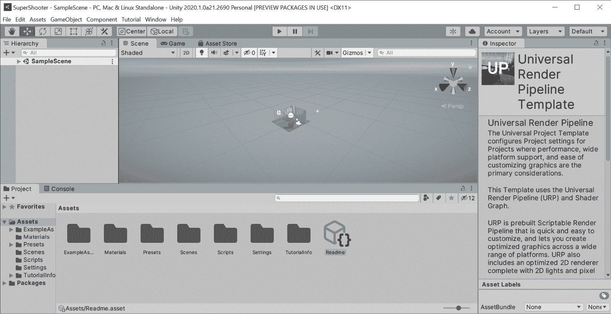
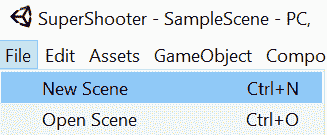
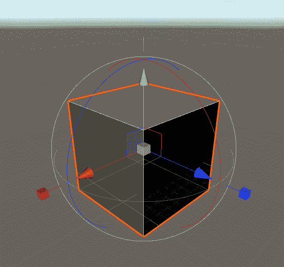
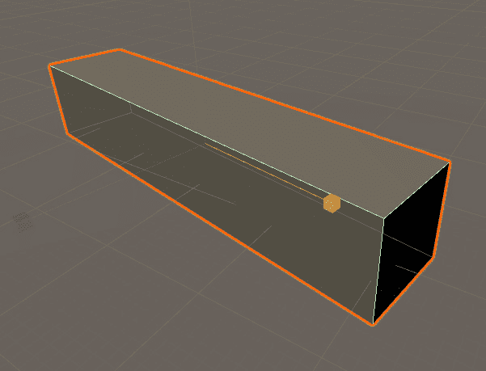
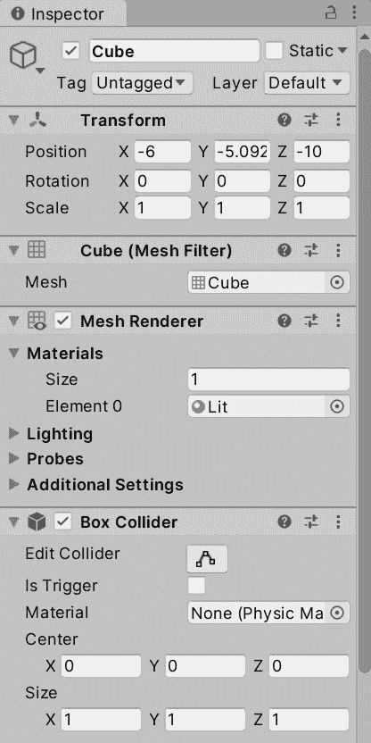
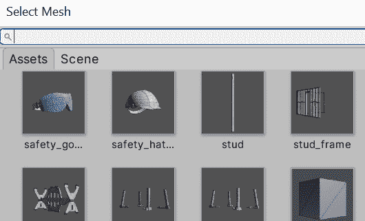
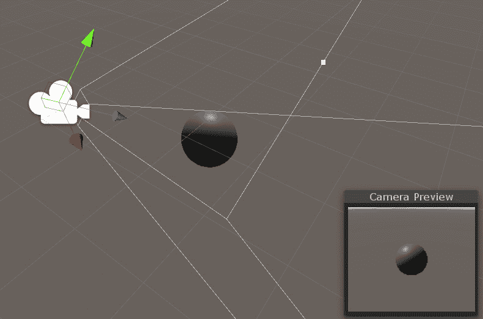
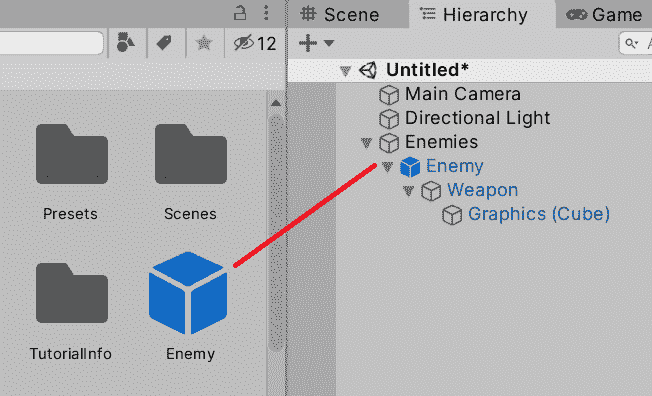
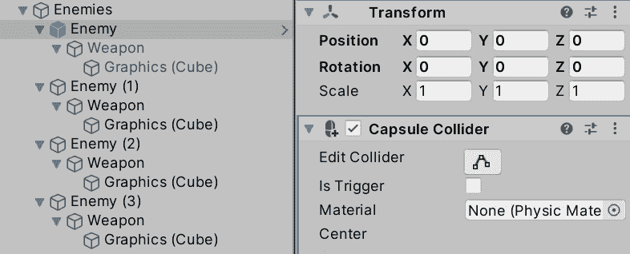
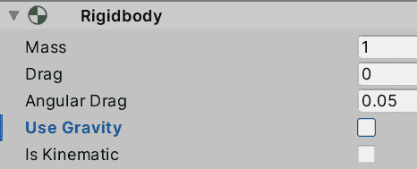

# 第三章：使用场景和游戏对象

欢迎来到本书的第三章—这里是艰苦工作开始的地方！在本章中，我们将开发一些关于 Unity 的基础知识，以便编辑项目。我们将看到如何使用几个 Unity 编辑器窗口来操作我们的第一个场景及其对象。此外，我们将学习如何创建和组合对象或游戏对象，以及如何使用层次结构和预制件来管理具有多个对象的复杂场景。最后，我们将回顾如何正确保存所有工作，以便以后继续工作。

具体来说，在本章中，我们将研究以下概念：

+   操作场景

+   游戏对象和组件

+   对象层次结构

+   预制件

+   保存场景和项目

# 操作场景

**场景**是我们项目中几种文件（也称为**资源**）之一。根据项目类型或公司习惯的工作方式，场景可能意味着不同的事情，但最常见的用例是将游戏分成整个部分，最常见的部分包括以下内容：

+   主菜单

+   第 1 关，第 2 关，第 3 关，…，第 N 关

+   胜利画面，失败画面

+   启动画面，加载画面

在本节中，我们将涵盖与场景相关的以下概念：

+   场景的目的

+   场景视图

+   我们的第一个游戏对象

+   导航场景视图

+   操作游戏对象

## 场景的目的

将游戏分成场景的想法是，您将处理并加载场景所需的数据；因此，如果您在主菜单中，您将只有该特定场景需要的纹理、音乐和对象—如果您现在不需要，就没有必要在**随机存取内存**（**RAM**）中加载第 10 关的 Boss。这就是加载画面存在的原因，只是为了填补在卸载一个场景中需要的资源和加载另一个场景中需要的资源之间的时间。也许您会认为像**侠盗猎车手**（**GTA**）这样的开放世界游戏在您漫游世界时没有加载画面，但实际上，它们在您移动时实际上在后台加载和卸载世界的块，而这些块是设计为彼此连接的不同场景。

主菜单和常规关卡场景之间的区别在于它们拥有的对象（也称为游戏对象）。在菜单中，您会找到背景、音乐、按钮和标志等对象，在关卡中，您将拥有玩家、敌人、平台、生命值盒等。因此，取决于您和放置在场景中的游戏对象来决定该场景对于您的游戏意味着什么。

但是我们如何创建一个场景呢？让我们从场景视图开始。

## 场景视图

当您打开一个 Unity 项目时，您将看到 Unity 编辑器。它将由几个窗口或**面板**组成，每个面板都可以帮助您更改游戏的不同方面。在本章中，我们将看看帮助您编写场景的窗口。Unity 编辑器如下截图所示：

图 3.1 – Unity 编辑器

如果您以前曾经编写过任何类型的应用程序，您可能习惯于拥有一个起始函数，比如**Main**，在那里您开始编写代码来创建应用程序所需的多个对象，如果我们谈论游戏，您可能会在这里创建场景中的所有对象。这种方法的问题在于，为了确保所有对象都被正确创建，您需要运行程序以查看结果，如果有什么错位，您将需要手动更改对象的坐标，这是一个缓慢而痛苦的过程。幸运的是，在 Unity 中，我们有**场景**视图，以下是其示例截图：

图 3.2 – 场景视图

这个窗口是经典**WYSIWYG（所见即所得）**概念的实现。在这里，您可以创建对象并将它们放置在整个场景中，通过场景预览，您可以看到当您点击**播放**时场景将会呈现什么样子。但在学习如何使用这个场景之前，我们需要在场景中有一个对象，所以让我们创建我们的第一个对象。

## 我们的第一个游戏对象

Unity **通用渲染管线**（**URP**）模板带有一个建筑工地测试场景，但让我们创建一个空的场景来开始探索这个新概念。为此，您可以简单地使用**文件** | **新建场景**菜单选项来创建一个空的新场景，如下截图所示：

图 3.3 – 创建一个新场景

本书将学习创建游戏对象的几种方法，但现在，让我们开始使用 Unity 提供的一些基本模板。为了创建它们，我们需要在 Unity 窗口顶部打开**GameObject**菜单，它将显示我们几个模板类别，如**3D 对象**，**2D 对象**，**特效**等，如下截图所示：

图 3.4 – 创建一个立方体

在**3D 对象**类别下，我们将看到几个 3D 基本形状，如**立方体**，**球体**，**圆柱体**等，虽然使用它们不如使用精美的下载的 3D 模型令人兴奋，但请记住，我们正在原型化我们的关卡，也就是灰盒模型。这意味着我们将使用大量的原型形状来模拟我们的关卡，以便我们可以快速测试它，并查看我们的想法是否足够好，可以开始将其转换为最终版本的复杂工作。

我建议您选择**立方体**对象开始，因为它是一个多功能的形状，可以代表许多对象。因此，现在我们有一个带有要编辑的对象的场景，我们需要学习使用场景视图的第一件事就是浏览场景。

## 浏览场景视图

为了操作一个场景，我们需要学习如何在其中移动以从不同的角度查看结果。有几种导航方式，让我们从最常见的一种开始：第一人称视角。这个视图允许您使用类似第一人称射击游戏的导航方式在场景中移动，使用鼠标和*WASD*键。要像这样导航，您需要按住鼠标右键，然后在这样做的同时，您可以移动鼠标来旋转相机，并按下*WASD*键来移动它。您还可以按下*Shift*键以加快移动速度，并按下*Q*和*E*键来上下移动。

另一种常见的移动方式是单击对象以选择它（所选对象将有橙色轮廓），然后按下*F*键将其聚焦，使场景视图相机立即移动到一个位置，我们可以更仔细地查看该对象。之后，我们可以按住左侧*Alt*键和鼠标左键，开始移动鼠标以围绕对象“轨道”，看到不同的角度来检查它的每个部分是否放置正确，如下截图所示：

图 3.5 – 选择一个对象

现在我们可以自由地在场景中移动，我们可以开始使用场景视图来操作游戏对象。

## 操作游戏对象

场景视图的另一个用途是操作对象的位置。为了这样做，我们首先需要选择一个对象，然后按键盘上的*Y*键或 Unity 编辑器左上角的第六个按钮，如下截图所示：

图 3.6 – 更改变换工具

这将显示所选对象上的**变换标尺**，它允许我们改变对象的位置、旋转和缩放，如下截图所示：

图 3.7 – 变换标尺

让我们开始翻译物体，通过在标尺球内拖动红色、绿色和蓝色箭头来完成。在你这样做的时候，你会看到物体沿着选定的轴移动。这里有一个有趣的概念需要探索，那就是这些箭头颜色的含义。如果你注意场景视图右上角的区域，你会看到一个轴标尺，它作为这些颜色含义的提醒，如下截图所示：

图 3.8 – 轴标尺

计算机图形学使用经典的 3D 笛卡尔坐标系来表示物体的位置。红色与物体的 x 轴相关联，绿色与 y 轴相关联，蓝色与 z 轴相关联。但每个轴代表什么意思呢？如果你来自另一个 3D 制作程序，这可能会有所不同，但在 Unity 中，z 轴（蓝色）代表着**前向矢量**，这意味着箭头指向物体的前方；x 轴是**右向矢量**，y 轴代表**上向矢量**。需要考虑这些轴是**本地**的，这意味着如果你旋转物体，它们会改变它们面对的方向，因为物体的方向改变了物体面对的方式。Unity 可以在必要时显示这些轴的**全局**坐标，但现在让我们坚持使用本地坐标。

为了确保我们正在使用本地坐标，确保**本地**模式已激活，如下截图所示：

图 3.9 – 在枢轴和本地坐标之间切换

如果你看到**全局**而不是**本地**作为右侧按钮，只需点击它就会改变。顺便说一下，尽量保持左侧按钮为**枢轴**。如果它显示**中心**，只需点击它进行更改。

我知道——我们正在编辑一个立方体，所以没有明显的前面或右侧，但当你使用真实的 3D 模型，比如汽车和角色时，它们肯定会有这些面，而且它们必须与这些轴正确对齐。如果将来你在 Unity 中导入一辆汽车，汽车的前面指向红轴（X 轴），你需要修正它，因为我们未来的移动代码将依赖于这个约定，但让我们留到以后再说。

现在，让我们使用这个变换标尺来旋转物体，使用它周围的三个彩色圆圈。例如，如果你点击并拖动红色圆圈，你会沿着 x 旋转轴旋转物体。这里还有一个有趣的提示需要考虑。如果你想根据我们之前讨论的颜色编码来水平旋转物体，你可能会选择 x 轴——用于水平移动的轴——但很遗憾，那是错误的。

旋转的一个好方法就像自行车的加速器：你需要拿着它并转动。如果你像这样旋转 x 轴，你会使物体上下旋转。所以，为了水平旋转，你需要使用绿色圆圈或 y 轴。这个过程如下截图所示：

图 3.10 – 旋转物体

最后，我们有缩放，通过变换标尺球外侧的彩色立方体来完成。如果你点击并拖动它们，你会看到我们的立方体沿着这些轴被拉伸，允许你改变物体的大小。此外，你会看到标尺中心有一个灰色立方体，它允许你统一沿着所有轴改变物体的大小。这个过程如下截图所示：

图 3.11 – 缩放对象

记住，在许多情况下，缩放对象通常是一个不好的做法。在你场景的最终版本中，你将使用适当大小和比例的模型，并且它们将以模块化的方式设计，这样你可以将它们一个接一个地连接起来。如果你对它们进行缩放，可能会发生一些不好的事情，比如纹理被拉伸并变得像素化，以及不再正确连接的模块。当然也有一些例外，比如在森林中放置大量相同树木的实例，并稍微改变它的比例以模拟变化，以及在灰盒阶段，将立方体改变比例以创建地板、墙壁、天花板、柱子等是完全可以的，因为最终，这些立方体将被真正的 3D 模型替换。

挑战

创建一个由地板、三面普通墙和一个带门洞的第四面墙（三个立方体）组成的房间。在下面的截图中，你可以看到它应该是什么样子的：

图 3.12 – 房间任务完成

现在我们可以编辑对象的位置，让我们看看如何编辑它的其他方面。

# 游戏对象和组件

我们谈到我们的项目由资源组成，场景（一种特定类型的资源）由游戏对象组成；那么，我们如何创建一个对象呢？通过**组件**的组合。

在本节中，我们将涵盖与组件相关的以下概念：

+   组件

+   操作组件

## 组件

**组件**是游戏对象可以由多个部分组成的其中之一；每个组件负责对象的不同特性。有几个组件可以解决不同的任务，比如播放声音，渲染网格，应用物理等等，即使 Unity 有大量的组件，我们最终还是需要创建自定义组件，迟早会用到。在下面的截图中，你可以看到当我们选择一个游戏对象时 Unity 向我们展示的内容：

图 3.13 – 检视面板

在前面的截图中，我们可以看到**检视**面板，如果我们需要猜测它的作用，我们现在可以说它显示了所选对象的所有属性，并且我们可以配置它们来改变对象的行为，比如位置和旋转，是否投射阴影等等。这是正确的，但我们缺少一个关键元素：这些属性不属于对象；它们属于对象的组件。我们可以在一组属性之前看到一些标题加粗，比如**变换**和**盒碰撞器**等等。这些是对象的组件。

在这种情况下，我们的对象有一个**变换**、一个**网格过滤器**、一个**网格渲染器**和一个**盒碰撞器**组件，所以让我们逐个审查这些。**变换**只有位置信息，比如对象的位置、旋转和比例，它本身什么也不做——它只是我们游戏中的一个点——但当我们向对象添加组件时，那个位置开始变得更有意义。这是因为一些组件将与**变换**和其他组件互动，每一个都会影响其他。

一个例子是**网格过滤器**和**网格渲染器**，它们都负责渲染 3D 模型。**网格渲染器**将在**网格过滤器**中指定的网格在**变换**组件中指定的位置上渲染，所以**网格渲染器**需要从这些其他组件获取数据，没有它们就无法工作。另一个例子是**盒碰撞器**。它代表了对象的物理形状，所以当物理计算对象之间的碰撞时，它会检查该形状是否与其他形状基于**变换**中指定的位置发生碰撞。

我们现在不想探索物理和渲染。本节的要点是 GameObject 是一组组件，每个组件为我们的对象添加特定的行为，并且每个组件与其他组件互动以完成所需的任务。为了进一步加强这一点，让我们看看如何将一个立方体转换成一个使用物理下落的球体。

## 操作组件

编辑对象组件的工具是**检视器**。它不仅允许我们更改组件的属性，还允许我们添加和移除组件。在这种情况下，我们想要将一个立方体转换成一个球体，因此我们需要改变这些组件的几个方面。我们可以从改变对象的视觉形状开始，因此我们需要改变渲染模型或**网格**。指定要渲染的网格的组件是**MeshFilter**组件。如果我们看一下，我们可以看到一个说**Cube**的**Mesh**属性，右边有一个带点的小圆圈。

重要提示

如果您没有看到任何像我们刚提到的网格的属性，请尝试点击组件名称左侧的三角形。这样做将展开和折叠所有组件的属性。这在下面的截图中有所说明：

图 3.14 – 禁用组件

如果我们点击它，**选择网格**窗口将弹出，允许我们选择几个网格选项；因此，在这种情况下，选择**Sphere**组件。在将来，我们将向我们的项目添加更多的 3D 模型，以便该窗口将有更多的选项。网格选择器显示在下面的截图中：

图 3.15 – 网格选择器

好了，看起来像一个球体，但它会像一个球体一样行为吗？让我们找出来。为了这样做，我们可以在窗口顶部的搜索框中添加一个`Rigidbody`。下面的截图说明了如何添加一个组件：

图 3.16 – 添加组件

如果您点击编辑器顶部中间的播放按钮，您可以使用**游戏**面板测试您的球体物理。当您点击播放时，该面板将自动聚焦，并向您展示玩家将如何看到游戏。这里可能出现的一个问题是，也许您看不到任何东西，如果游戏摄像机没有指向我们的球体所在的位置，那就可能会发生这种情况。播放控制显示在下面的截图中：

图 3.17 – 播放控制

在这里，您可以使用变换图标来旋转和定位摄像机，使其以某种方式看向我们的球体。在移动时，您可以在场景窗口的右下部分检查小预览，以查看新的摄像机视角。另一种选择是在**层次结构**中选择摄像机，然后使用快捷键*Ctrl* + *Shift* + *F*（或 Mac 上的*command* + *Shift* + *F*）。摄像机预览显示在下面的截图中：

图 3.18 – 摄像机预览

现在，为了测试物理碰撞是否执行正常，让我们创建一个立方体，将其缩放直到它呈坡道形状，并将该坡道放在我们的球体下方，如下所示：

图 3.19 – 球和坡道对象

如果您现在点击播放，您将看到球体与我们的坡道发生碰撞，但方式很奇怪。看起来像是在弹跳，但实际并非如此。如果您展开球体的**Box Collider**组件，您将看到即使我们的物体看起来像一个球体，绿色的框图标显示我们的球体实际上是一个盒子在物理世界中，如下面的截图所示：

图 3.20 - 具有球形图形和盒碰撞器的对象

如今，视频卡可以处理渲染高度详细的模型（具有高多边形数量），但是物理系统是在**中央处理单元**（**CPU**）中执行的，它需要进行复杂的计算以侦测碰撞。为了在我们的游戏中获得良好的性能（至少 30**帧每秒**（**FPS**）），物理系统使用简化的碰撞形状来工作，这些形状可能与玩家在屏幕上看到的实际形状不同。这就是为什么我们有**Mesh Filter**和不同类型的碰撞器组件分开——一个处理视觉形状，另一个处理物理形状。

再次强调，本节的目的不是深入研究这些 Unity 系统，所以让我们继续前进。我们如何解决这个问题呢？简单：通过修改我们的组件！在这种情况下，**BoxCollider**可以表示一个盒子形状，不像**MeshFilter**，它支持任何形状。因此，首先我们需要通过右键单击组件的标题并选择**移除组件**选项来移除它，如下面的屏幕截图所示：

图 3.21 - 移除组件

现在，我们可以再次使用**添加组件**菜单来选择一个**物理**组件，这次选择**球体碰撞器**组件。如果您查看物理组件，您将看到其他类型的碰撞器，可以用来表示其他形状，但我们将在*第十五章**，物理碰撞和健康系统*中进行讨论。**球体碰撞器**组件可以在下面的屏幕截图中看到：

图 3.22 - 添加一个球体碰撞器组件

因此，如果您现在点击播放，您将看到我们的球体不仅外观像一个球体，而且行为也像一个球体。记住：本书本节的主要思想是理解在 Unity 中，您可以通过添加、移除和修改组件来创建任何您想要的对象，我们将在整本书中大量使用这种方法。

现在，组件不是创建对象所需的唯一内容。复杂的对象可能由多个子对象组成，因此让我们看看它是如何工作的。

# 对象层次结构

一些复杂的对象可能需要分成子对象，每个子对象都有自己的组件。这些子对象需要以某种方式附加到主对象，并共同工作以创建必要的对象行为。

在本节中，我们将涵盖与组件相关的以下概念：

+   对象的父子关系

+   可能的用途

## 对象的父子关系

**父子关系**包括使一个对象成为另一个对象的子对象，这意味着这些对象将彼此相关联。发生的一种关系类型是**变换关系**，意味着子对象将受到父对象变换的影响。简单来说，子对象将跟随父对象，就像它附加在上面一样。举个例子，想象一个戴着帽子的玩家。帽子可以是玩家头部的子对象，使帽子在附着时跟随头部移动。

为了尝试这个，让我们创建一个代表敌人的胶囊体和一个代表敌人武器的立方体。请记住，为了这样做，您可以使用**GameObject** | **3D Object** | **Capsule**和**Box**选项。一个示例胶囊体可以在下面的屏幕截图中看到：

图 3.23 - 代表人类的胶囊体和代表武器的盒子

如果您移动敌人对象（胶囊体），武器（盒子）将保持其位置，而不会跟随我们的敌人。因此，为了防止这种情况发生，我们可以简单地将武器拖到**层次结构**窗口中的敌人对象上，如下面的屏幕截图所示：

图 3.24 - 将立方体武器作为胶囊角色的父对象

现在，如果你移动敌人，你会看到枪也随之移动、旋转和缩放。所以，基本上，枪的变换也受到敌人变换组件的影响。

现在我们已经做了一些基本的父子关系，让我们继续探索其他可能的用途。

## 可能的用途

除了创建复杂对象之外，父子关系还有一些其他常见的用途。其中一个常见的用途是组织项目的层次结构。现在，我们的场景很简单，但随着时间的推移，它会变得更加复杂，因此跟踪所有对象将变得困难。为了防止这种情况发生，我们可以创建空的游戏对象（在**GameObject** | **Create Empty**中），充当容器，将对象放入其中，以便组织我们的场景。请谨慎使用这个功能，因为如果滥用，会有性能成本。通常情况下，在组织场景时，有一到两级的父子关系是可以接受的，但超过这个数量可能会影响性能。请考虑，你可以并且将会在创建复杂对象时有更深层次的父子关系；所提出的限制只是用于场景组织。

为了不断改进我们之前的示例，在整个场景中复制敌人几次，创建一个名为**敌人**的空游戏对象，并将所有敌人拖放到其中，使其充当容器。如下截图所示：

图 3.25 - 将敌人分组在父对象中

父子关系的另一个常见用途是改变对象的**枢轴**或中心。现在，如果我们尝试用变换控件旋转我们的枪，它会围绕它的中心旋转，因为立方体的创建者决定将中心放在那里。通常情况下，这是可以接受的，但让我们考虑这样一种情况，即我们需要让武器瞄准敌人所看的点。在这种情况下，我们需要围绕武器手柄旋转武器；所以，在这个"盒子"武器的情况下，它将是最接近敌人的一端。问题在于我们无法改变对象的中心，因此一个解决方案是创建另一个具有不同中心的"武器"3D 模型或网格，这将导致大量重复的武器版本，如果我们考虑到其他可能的游戏需求，比如旋转武器拾取物品。我们可以很容易地使用父子关系来解决这个问题。

这个想法是创建一个空的游戏对象，并将其放在我们希望对象的新枢轴的位置。之后，我们可以简单地将我们的武器拖放到这个空的游戏对象中，并且从现在开始，将空对象视为实际的武器。如果你旋转或缩放这个武器容器，你会发现武器网格会围绕这个容器应用这些变换，所以我们可以说武器的枢轴已经改变了（实际上并没有，但我们的容器模拟了这种变化）。这个过程如下截图所示：

图 3.26 - 改变武器的枢轴

现在，让我们继续看看不同的管理游戏对象的方法，这次使用预制体。

# 预制体

在前面的例子中，我们在场景中创建了许多敌人的副本，但在这样做的过程中，我们创建了一个新问题。让我们想象一下，我们需要改变我们的敌人并给它添加一个**Rigidbody**组件，但因为我们有几个相同对象的副本，我们需要逐个将它们添加相同的组件。也许以后，我们需要改变每个敌人的质量，所以再一次，我们需要逐个地去改变每一个敌人，这里我们可以开始看到一个模式。

一个解决方案可能是使用*Ctrl*键（Mac 上的*option*键）选择所有的敌人并一次修改它们，但如果我们在其他场景中有敌人的副本，这个解决方案就没有用了。这就是预制体的用武之地。

在本节中，我们将涵盖与预制体相关的以下概念：

+   创建预制体

+   预制体实例关系

+   预制体变体

## 创建预制体

**预制体**是 Unity 工具，允许我们将自定义对象，比如我们的敌人，转换为定义它们如何创建的资源。我们可以使用它们轻松地创建自定义对象的新副本，而不需要再次创建其组件和子对象。

为了创建一个预制体，我们可以简单地将自定义对象从**层次结构**窗口拖动到**项目**窗口，这样做之后，你会在项目文件中看到一个新的资源。**项目**窗口是你可以浏览和探索所有项目文件的地方；所以，在这种情况下，我们的预制体是我们创建的第一个资源。现在，你可以简单地将预制体从**项目**窗口拖到场景中，轻松地创建新的预制体副本，如下面的截图所示：

图 3.27 - 创建预制体

现在，我们有一个小问题。如果你注意**层次结构**窗口，你会看到原始预制体对象和所有新副本，它们的名称是蓝色的，而在预制体之前创建的敌人的名称是黑色的。名称中的蓝色表示该对象是预制体的**实例**，意味着该对象是基于预制体创建的。我们可以选择这些蓝色命名的对象，并在**检视器**中点击**选择**按钮，选择创建该对象的原始预制体。这在下面的截图中有所说明：

图 3.28 - 在层次结构中检测预制体

所以，问题在于之前的预制体副本不是原始预制体的实例，遗憾的是没有办法使它们与预制体连接起来。因此，为了实现这一点，我们需要简单地销毁旧的副本，并用预制体创建的副本替换它们。起初，没有所有副本都作为实例似乎不是一个问题，但在本章的下一节中，我们将探讨预制体和它们的实例之间的关系。

## 预制体实例关系

预制体的实例具有与预制体的绑定，有助于在它们之间轻松地恢复和应用更改。如果你拿一个预制体并对其进行一些修改，这些更改将自动应用到项目中所有场景中的所有实例，因此我们可以轻松地创建预制体的第一个版本，在整个项目中使用它，然后尝试进行更改。

为了练习这一点，假设我们想要给敌人添加一个**Rigidbody**组件，以便它们可以下落。为了做到这一点，我们可以简单地双击预制体文件，进入预制体编辑模式，在这里，我们可以编辑预制体，与场景中的其余部分隔离开来。在这里，我们可以简单地取出预制体根对象，并向其添加**Rigidbody**组件。之后，我们可以简单地点击**场景**窗口左上角的**场景**按钮，回到我们正在编辑的场景，现在，我们可以看到所有敌人的预制体实例都有**Rigidbody**组件，如下面的截图所示：

图 3.29 - 预制体编辑模式

现在，如果我们改变了一个预制体实例会发生什么呢？比如说我们想让一个特定的敌人飞行，这样他们就不会受到重力的影响。我们只需选择特定的预制体，取消**刚体**组件中的**使用重力**复选框。这样做后，如果我们玩游戏，我们会看到只有那个特定实例会飘浮。这是因为预制体实例的更改变成了**覆盖**，如果你看**检视器**中的该实例的**使用重力**属性变成了粗体，你就可以清楚地看到这一点。让我们拿另一个对象，改变它的**缩放**属性使其变大。同样，我们会看到**缩放**属性变成了粗体，并且左侧有一个小条。**使用重力**复选框可以在下面的截图中看到：

图 3.30 – 使用重力被突出显示为覆盖

覆盖优先于预制体，因此如果我们改变原始预制体的缩放，具有缩放覆盖的预制体不会改变，保持其自己的缩放版本，如下截图所示：

图 3.31 – 一个带有缩放覆盖的预制体实例

我们可以使用**检视器**中的**覆盖**下拉菜单轻松定位实例的所有覆盖，找到我们对象的所有更改。它不仅允许我们查看所有覆盖，还可以撤销我们不想要的任何覆盖并应用我们想要的覆盖。比如说，我们后悔了特定预制体缺乏重力，没问题！我们只需找到覆盖并撤销它。该过程如下截图所示：

图 3.32 – 撤销单个覆盖

另外，假设我们真的喜欢那个实例的新缩放，所以我们希望所有实例都具有那个缩放—太棒了！我们只需点击**应用**按钮，选择特定的更改，所有实例都会具有那个缩放（除了具有覆盖的实例），如下截图所示：

图 3.33 – 应用按钮

此外，我们还有**撤销所有**和**应用所有**按钮，但要谨慎使用，因为你可能会轻易撤销和应用你不知道的更改。

因此，正如你所看到的，预制体是一个非常有用的 Unity 工具，可以跟踪所有相似的对象并对它们应用更改，并且还可以具有具有少量变化的特定实例。谈到变化，还有其他情况，你会希望有几个具有相同变化集的预制体实例，比如飞行敌人和地面敌人，但是如果你考虑一下，我们在不使用预制体时遇到的问题是一样的，所以我们需要手动逐个更新这些不同版本。

在这里，我们有两个选择：一个是创建一个全新的预制体，只是为了有另一个带有那种变化的版本。这会导致一个问题，如果我们希望所有类型的敌人都受到更改，我们需要手动将更改应用到每个可能的预制体。第二个选择是创建一个预制体变体。让我们来看看后者。

## 预制体变体

**预制体变体**是创建一个新的预制体，但基于现有预制体的行为，因此新的预制体**继承**了基础预制体的特性。这意味着我们的新预制体可以与基础预制体有所不同，但它们共有的特性仍然是相连的。

为了说明这一点，让我们创建一个可以飞行的敌人预制件的变体：飞行敌人预制件。为此，我们可以在“层次结构”窗口中选择现有的敌人预制件实例，将其命名为“飞行敌人”，然后再次将其拖到“项目”窗口中，这次会看到一个提示，询问我们要创建哪种预制件。这次，我们需要选择“预制件变体”，如下截图所示：

图 3.34 - 创建预制件变体

](img/Figure_3.34_B14199.jpg)

图 3.34 - 创建预制件变体

现在，我们可以通过双击进入变体的预制件编辑模式，然后添加一个立方体作为我们敌人的喷气背包，并取消敌人的“使用重力”属性。如果我们返回到场景，我们将看到变体实例已经更改，而基本敌人没有改变。您可以在下面的截图中看到这一点：

图 3.35 - 预制件变体实例

](img/Figure_3.35_B14199.jpg)

图 3.35 - 预制件变体实例

现在，想象一下您想要为我们所有类型的敌人添加一个帽子。我们只需双击基本敌人预制件进入预制件编辑模式，然后添加一个立方体作为帽子。现在，我们将看到该更改应用于所有敌人，因为请记住：“飞行敌人”预制件是基本敌人预制件的变体，这意味着它将继承所有更改。

到目前为止，我们已经创建了大量内容，但是如果我们的电脑因某种原因关闭，我们肯定会丢失所有内容，所以让我们看看如何保存我们的进度。

# 保存场景和项目

与任何其他程序一样，我们需要保存我们的进度。不同之处在于，我们不只有一个包含所有项目资产的巨大文件，而是每个资产都有几个文件。

在本节中，我们将涵盖以下与保存相关的概念：

+   保存我们的更改

+   项目结构

## 保存我们的更改

让我们开始通过保存场景来保存我们的进度，这非常简单。我们只需转到项目的“资产”文件夹，但永远不要超出该文件夹。这将在“项目”窗口中生成一个新的资产：一个场景文件，如下截图所示：

图 3.36 - 场景文件

](img/Figure_3.36_B14199.jpg)

图 3.36 - 场景文件

我们可以在对话框中创建一个文件夹来保存我们的场景，或者，如果您已经保存了场景，可以在“项目”窗口中使用“创建”|“文件夹”选项创建一个文件夹，并将创建的场景拖到该文件夹中。现在，如果您使用“文件”|“新建场景”菜单选项创建另一个场景，您可以通过在“项目”窗口中双击资产来返回到先前的场景。

这只保存了场景，但是对预制件和其他类型的资产的任何更改都不会使用该选项保存。相反，如果您想保存除场景之外的所有资产的每个更改，可以使用“文件”|“保存项目”选项。这可能有点令人困惑，但是如果您想保存所有更改，您需要同时保存场景和项目，因为仅保存项目不会保存场景上的更改。有时，确保一切都已保存的最佳方法就是关闭 Unity，这在尝试在计算机或文件夹之间移动项目时是推荐的。让我们在下一节中讨论这个问题。

## 项目结构

现在我们已经保存了所有更改，我们准备好将项目在计算机之间或到另一个文件夹中移动（如果有需要的话）。您可以关闭 Unity 以确保一切都已保存，并只需复制整个项目文件夹。如果您不记得在哪里保存了项目，您可以右键单击“项目”窗口中的“资产”文件夹，然后选择“在资源管理器中显示”（Mac 上的“显示在 Finder 中”），如下截图所示：

图 3.37 - 定位项目文件夹

](img/Figure_3.37_B14199.jpg)

图 3.37 - 定位项目文件夹

现在我们在项目文件夹中，让我们抓住机会稍微探索一下。在一个完整的项目中，我们会发现几个文件夹和文件，但并非所有文件都需要复制以便将项目移动到其他地方。最重要的文件夹是`Assets`、`ProjectSettings`和`Packages`。这些文件夹可以在以下截图中看到：

图 3.38 - 项目文件夹结构

`ProjectSettings`文件夹包含了我们将在本书后面玩弄的不同 Unity 系统的几个配置，但即使我们没有更改任何设置，带上这个文件夹总是一个好主意。`.unitypackage`文件曾经是，但让我们稍后讨论。到目前为止，重要的是要注意，该文件夹将包含关于我们的项目正在使用哪些包的设置，因此也记得带上它。

其他文件夹/文件都不是必需的，因为其中一些是临时的，另一些可以重新生成，比如**Library**，那里存放着我们资产的转换版本。通过转换，我们指的是外部生成的文件，比如 3D 模型、图像、声音等。Unity 需要将这些文件转换为 Unity 兼容的格式。原始文件将存放在**Assets**中，转换后的文件将存放在**Library**中，以便在必要时可以轻松重新生成。稍后，在*第五章**，导入和集成资产*中，我们将讨论如何集成外部生成的内容。

现在，让我们想象一下，你已经压缩了这三个文件夹，将它们复制到 U 盘中，然后在另一台电脑上解压这些文件夹。我们如何再次打开项目呢？正如你所看到的，项目没有项目文件或类似的东西 - 它只是一堆文件夹。为了打开一个项目，最简单的方法是在`Assets`文件夹中找到一个场景文件，然后双击它，这样 Unity 就会在那个场景中打开项目。另一个选项是使用`Assets`文件夹。因此，我们将把该项目添加到我们计算机项目的列表中，稍后，我们只需点击列表中的名称即可打开它。以下截图说明了这一点：

图 3.39 - 重新打开项目

现在，我们已经掌握了开始学习如何使用不同的 Unity 系统所需的所有基本 Unity 知识，以便开始创建一个真正的游戏！让我们在下一章中做到这一点！

# 总结

在本章中，我们简要介绍了基本的 Unity 概念。我们回顾了所有 Unity 窗口以及如何使用它们来编辑一个完整的场景，从导航和创建预制对象，到操纵它们以创建我们自己类型的对象，使用游戏对象和组件。我们还讨论了如何使用**Hierarchy**窗口将游戏对象进行父子关系，以创建复杂的对象层次结构，以及创建预制件以重用和操纵大量相同类型的对象。最后，我们讨论了如何保存我们的进度并移动项目，回顾了项目的结构以及哪些文件夹是必不可少的。

在下一章中，我们将学习使用不同的工具来创建游戏关卡的第一个原型。
