# 第四章：使用地形和 ProBuilder 进行灰盒设计

现在我们已经掌握了使用 Unity 所需的所有概念，让我们开始设计我们的第一个关卡。本章的想法是学习如何使用地形工具来创建游戏的景观，然后使用 ProBuilder 来创建基础的 3D 网格，比使用立方体具有更多的细节。使用这些工具，您将能够创建任何类型的场景原型，并在实际实现最终图形之前尝试您的想法。

具体来说，在本章中，我们将讨论以下概念：

+   使用地形创建景观

+   使用 ProBuilder 创建形状

# 使用地形创建景观

到目前为止，我们已经使用立方体生成了我们的关卡原型，但我们也了解到，有时这些形状无法代表我们可能需要的所有对象。想象一下不规则的东西，比如丘陵、峡谷和河流的完整地形。使用立方体创建这将是一场噩梦。另一个选择是使用 3D 建模软件，但问题是生成的模型将如此庞大和详细，以至于即使在高端 PC 上也无法良好运行。在这种情况下，我们需要学习如何使用地形，这将是本章的第一节中我们要做的事情。

在本节中，我们将涵盖与地形相关的以下概念：

+   讨论高度图

+   创建和配置高度图

+   编写高度图

+   添加高度图细节

让我们开始谈论高度图，其纹理帮助我们定义地形的高度。

## 讨论高度图

如果我们使用常规的 3D 建模工具创建一个巨大的游戏区域，包括丘陵、峡谷、陨石坑、山谷和河流，我们将面临一个问题，即我们将在所有可能的距离上使用完整详细的模型，从而浪费资源在远处看不到的细节上。我们将从很远的地方看到很多地形部分，比如山脉和河流，所以这是一个严重的问题。

Unity 地形工具使用一种称为高度图的技术以高效和动态的方式生成地形。它不是为整个地形生成大型 3D 模型，而是使用一种称为高度图的图像，看起来像地形的俯视黑白照片。

在下图中，您可以看到苏格兰地形高度的黑白俯视图，白色表示较高的高度，黑色表示较低的高度：

图 4.1 - 苏格兰的高度图

在上图中，您可以很容易地在寻找图像中最白的区域时发现山峰。海平面以下是黑色的，而中间使用灰度渐变的任何东西代表了最小和最大高度之间的不同高度。想法是图像的每个像素确定了地形特定区域的高度。

Unity 地形工具可以自动生成地形的 3D 网格，从而节省了完整地形的 3D 模型的硬盘空间。此外，Unity 将随着我们移动创建地形，为附近区域生成高详细度模型，并为远处区域生成低详细度模型，使其成为一种高效的解决方案。

在下图中，您可以看到为地形生成的网格。您可以看到地形的近处部分比远处部分有更多的多边形：

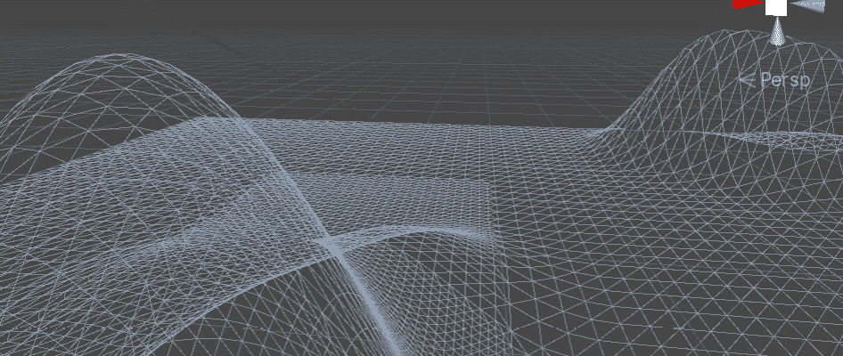

图 4.2 - 高度图生成的网格

请注意，这项技术也有其缺点，比如 Unity 在我们玩游戏时生成这些 3D 模型所需的时间，以及无法创建洞穴，但目前对我们来说这不是问题。

现在我们知道了什么是高度图，让我们看看如何使用 Unity 地形工具来创建我们自己的高度图。

## 创建和配置高度图

如果单击**GameObject | 3D Object | Terrain**，您将看到一个巨大的平面出现在场景中，并且**Hierarchy**窗口中出现了一个 Terrain 对象。这就是我们的地形，它是平的，因为它的高度图一开始就是全黑的，因此在其初始状态下没有任何高度。在下面的截图中，您可以看到全新的**Terrain**是什么样子的：

图 4.3 - 尚未绘制高度的地形

在开始编辑地形之前，您必须配置不同的设置，例如地形的高度图的大小和分辨率，这取决于您打算如何使用它。这与生成整个世界不同。请记住，我们的游戏将发生在玩家的基地，因此地形将很小。在这种情况下，200 x 200 米大小的区域被山脉包围将足够。

为了根据这些要求配置我们的地形，我们需要执行以下操作：

1.  从**Hierarchy**或**Scene**窗口中选择**Terrain**。

1.  查看**Terrain**组件的**Inspector**，如果折叠了，请展开它。

1.  单击轮子图标以切换到配置模式。在下面的截图中，您可以看到该按钮的位置：

图 4.4 - 地形设置按钮

1.  查找**Mesh Resolution**部分。

1.  更改`200`。这将说明我们的地形尺寸为 200 x 200 米。

1.  `500`只是为了限制我们山的最高峰：

图 4.5 - 地形分辨率设置

1.  查找**Texture Resolutions**部分。

1.  将**Heightmap Resolut**更改为**257 x 257**：

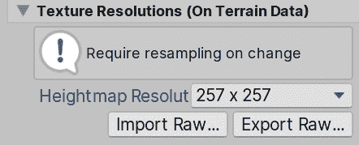

图 4.6 - 高度图分辨率设置

重要提示

高度图分辨率是将保存地形不同部分的高度的高度图图像的大小。在我们的 200 x 200 米地形中使用 257 x 257 的分辨率意味着地形中的每个平方米将被高度图的略多于 1 像素覆盖。每平方米的分辨率越高，您可以在该区域大小中绘制的细节就越多。通常，地形特征很大，因此每平方米多于 1 像素通常是资源浪费。找到允许您创建所需细节的最小分辨率。

您还需要设置的初始设置是初始地形高度。默认情况下，这是 0，因此您可以从底部开始绘制高度，但这样做，您无法在地形中开洞，因为它已经处于最低点。设置一点初始高度允许您绘制河流路径和必要时开洞。为此，请执行以下操作：

1.  选择**Terrain**。

1.  单击**Brush**按钮（第二个按钮）。

1.  将下拉菜单设置为**Set Height**。

1.  将`50`。这将说明我们希望所有地形的起始高度为`50`米，从而允许我们最大深度为`50`米的洞：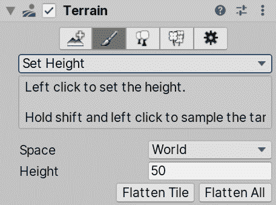

图 4.7 - 设置高度地形工具位置

1.  单击我们之前指定的`50`米。

现在我们已经正确配置了我们的高度图，让我们开始编辑它。

## 编写高度图

请记住，高度图只是一个带有高度的图像，因此为了编辑它，我们需要在该图像中绘制高度。幸运的是，Unity 有工具可以让我们直接在编辑器中编辑地形并直接查看修改后的高度结果。为此，我们必须按照以下步骤进行：

1.  选择**Terrain**。

1.  单击**Brush**按钮。

1.  将下拉菜单设置为**提高或降低地形**模式：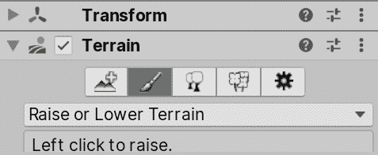

图 4.8 - 提高或降低地形工具位置

1.  选择画笔选择器中的第二个画笔。这个画笔的边缘模糊，可以让我们创建更柔和的高度。

1.  将**画笔大小**设置为**30**，这样我们就可以创建跨越**30**米区域的高度。如果你想创建更细微的细节，你可以减小这个数字。

1.  将**不透明度**设置为**10**，以减少每秒或每次点击绘制的高度量：

图 4.9 - 光滑边缘画笔

1.  现在，如果你在**场景**视图中移动鼠标，你会看到你点击该区域时将绘制的高度的一个小预览。也许你需要靠近地形才能看清楚：

图 4.10 - 提升地形区域的预览

重要提示

你在地形附近看到的方格图案可以让你看到你正在编辑的对象的实际大小。每个单元格代表一个平方米。记住，有一个参考来看到你正在编辑的对象的实际大小是有用的，可以防止创建太大或太小的地形特征。也许你可以放入其他类型的参考，比如一个具有准确尺寸的大立方体，代表一个建筑的大小，以便了解你正在创建的山或湖的大小。记住，立方体的默认尺寸是 1 x 1 x 1 米，所以缩放到（10,10,10）将给你一个 10 x 10 x 10 米的立方体。

1.  按住左键并拖动鼠标在地形上开始绘制地形高度。记住，你可以按下*Ctrl* + *Z*（Mac 上为*command*+ *Z*）来撤销任何不需要的更改。

1.  尝试绘制围绕我们区域边界的山脉，这将代表我们基地的背景山丘：

图 4.11 - 绘制在地形边缘的山脉

现在，我们在未来基地周围有了不错的起始山丘。我们还可以在未来基地区域周围绘制一个河流流域。要这样做，请按照以下步骤进行：

1.  在地形的中间放置一个缩放为（50,10,50）的立方体。这将作为我们即将创建的基地的占位符：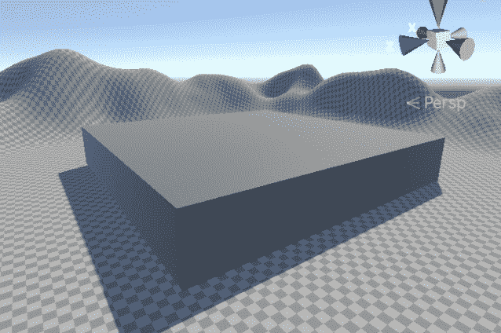

图 4.12 - 基地区域的占位立方体

1.  再次选择**地形**和**画笔**按钮。

1.  将**画笔大小**减小到**10**。

1.  按住*Shift*键，左键单击并拖动鼠标在地形上绘制我们基地占位符周围的流域。这样做会降低地形而不是提升它：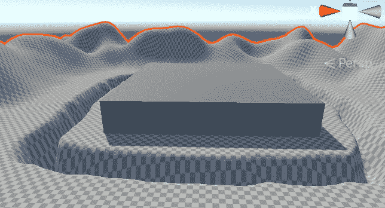

图 4.13 - 我们占位基地周围的河流流域

现在，我们有了一个简单但不错的起始地形，让我们对从基地的角度看它的外观有了基本的了解。在继续之前，我们将应用一些更精细的细节，使我们的地形看起来更好一些。在下一节中，我们将讨论如何使用不同的工具模拟地形侵蚀。

## 添加高度图细节

在前一节中，我们创建了地形的粗略轮廓。如果你想让它看起来更真实一些，那么你需要开始在各处绘制许多微小的细节。通常，这是在关卡设计过程的后期完成的，但是让我们现在来看看，因为我们正在探索地形工具。现在，我们的山看起来非常平滑。在现实生活中，它们更加陡峭，所以让我们改进一下：

1.  选择**地形**并启用**画笔**按钮。

1.  设置下拉菜单为**提升或降低地形**模式。

1.  选择第五个画笔。这个画笔的布局不规则，这样我们就可以在各处绘制一些噪音。

1.  将**画笔大小**设置为**50**，这样我们就可以覆盖更大的区域：

图 4.14 - 云图案画笔用于随机性

1.  按住*Shift*键，对地形的山丘进行小幅点击，不要拖动鼠标。记得放大到你正在应用细节的区域，因为这些在远处看不到：

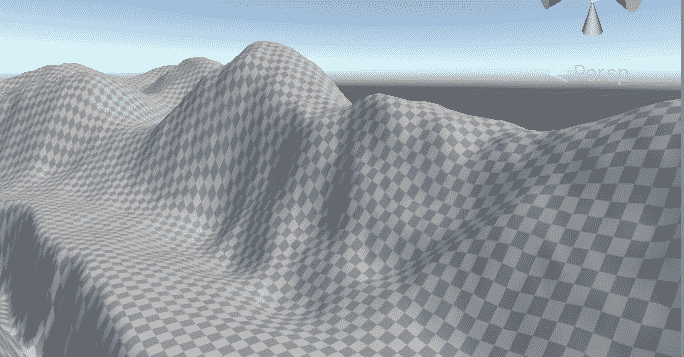

图 4.15 – 用之前的刷子生成的侵蚀

这给我们的山丘增加了一些不规则性。现在，让我们想象我们想在山丘上有一个平坦的区域，可以放置装饰性的天文台或天线。按照以下步骤操作：

1.  选择**地形**，**刷工具**，并从下拉菜单中选择**设置高度**。

1.  将**高度**设置为**60**。

1.  在山丘上涂抹一个区域。你会看到如果低于**60**米，地形会升高，或者在大于**60**米的区域变得更低：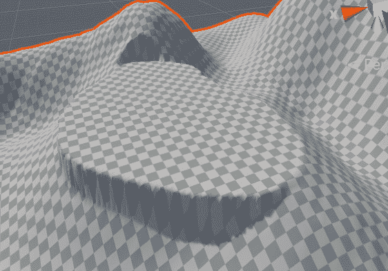

图 4.16 – 平坦的山丘

1.  你可以看到边界有一些粗糙的角落需要平滑：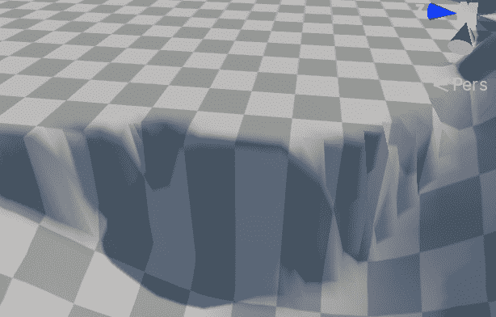

图 4.17 – 未平滑的地形边缘

1.  将下拉菜单更改为**平滑高度**模式。

1.  选择尺寸为**5**，不透明度为**10**的第二个刷子：

图 4.18 – 平滑高度刷

1.  点击并拖动我们平坦区域的边界，使它们更加平滑：

图 4.19 – 平滑的地形边缘

我们可以在这里和那里不断添加细节，但现在我们可以就此结束。下一步是创建我们的玩家基地，但这次，让我们探索 ProBuilder 以生成我们的几何图形。

# 使用 ProBuilder 创建形状

到目前为止，我们使用立方体和基本形状创建了简单的场景，对于大多数原型来说已经足够了，但有时，你可能会遇到游戏中难以用普通立方体建模的棘手区域，或者你可能想在游戏的某些部分添加更深层次的细节，以便让玩家感受到该区域的视觉效果。在这种情况下，我们可以使用任何 3D 建模工具，比如 3D Studio、Maya 或 Blender，但这些工具可能难以学习，而且在开发的这个阶段你可能不需要它们的全部功能。幸运的是，Unity 有一个名为 ProBuilder 的简单 3D 模型创建工具，让我们来探索一下。

在本节中，我们将涵盖与 ProBuilder 相关的以下概念：

+   安装 ProBuilder

+   创建一个形状

+   操作网格

+   添加细节

ProBuilder 不是默认包含在我们的 Unity 项目中的，所以让我们从学习如何安装它开始。

## 安装 ProBuilder

Unity 是一个功能强大的引擎，但如果我们没有使用所有这些工具，会使引擎运行变慢，因此我们需要手动指定我们正在使用哪些 Unity 工具。为此，我们将使用包管理器，这是一个工具，我们可以用它来查看和选择我们将需要哪些 Unity 包。你可能还记得，之前我们谈到过`Packages`文件夹。这基本上就是包管理器在修改的内容。

为了使用这个工具安装 ProBuilder，我们需要执行以下操作：

1.  点击**窗口 | 包管理器**选项：

图 4.20 – 包管理器选项

1.  在刚刚打开的窗口中，确保**Packages**处于**Unity Registry**模式，方法是点击窗口左上角的**Packages**按钮，然后选择**Unity Registry**：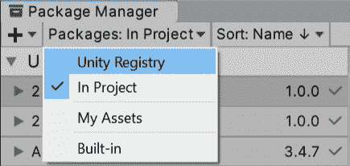

图 4.21 – 显示所有包

1.  等待一会儿，直到左侧的包列表填满。确保连接到互联网以下载和安装包。

1.  看看那个列表中的**ProBuilder**包，并选择它。

重要提示

我正在使用 ProBuilder 4.2.3 版本，这是我写这本书时可用的最新版本。虽然您可以使用更新的版本，但请考虑使用它的步骤可能会有所不同。您可以使用标题左侧的箭头查看旧版本。

图 4.22 - 在包列表中的 ProBuilder

1.  单击**Package Manager**右下角的**Install**按钮：

图 4.23 - 安装按钮

1.  等待一会儿，直到包安装完成。当**Install**按钮被替换为 Up to Date 标签时，您会注意到过程已经结束。

既然我们已经在项目中安装了 ProBuilder，让我们来使用它吧！

## 创建形状

我们将通过创建一个地板平面来开始我们的基础。我们将通过以下方式来做到这一点：

1.  打开 ProBuilder 并转到**工具 | ProBuilder | ProBuilder**窗口：

图 4.24 - ProBuilder 窗口选项

1.  在打开的窗口中，单击**New Shape**按钮右侧的加号图标（+）：

图 4.25 - 新形状选项

1.  在**Shape Selector**中，选择**Plane**。

1.  设置`50`。

1.  设置`2`。我们稍后会需要这些细分：

图 4.26 - 新形状设置

1.  单击**Build**按钮以确认**Plane**。

1.  单击**场景**视图中**ProBuilder**按钮中的四个按钮中的第一个按钮，以启用整个平面的移动：

图 4.27 - 选择对象工具

1.  用这个地板替换占位符立方体：

图 4.28 - 平面被细分为 3 x 3 网格

既然我们已经创建了地板，让我们学习如何操纵其顶点以改变其形状。

## 操纵网格

如果您选择平面，您会看到它被细分为 3 x 3 网格，因为我们将宽度和高度分段设置为 2（2 切割）。我们这样做是因为我们将使用外部单元来创建我们的墙，从而将它们升起。我们的想法是修改这些单元的大小，以勾勒出墙的长度和宽度，然后再创建墙。为了做到这一点，我们将执行以下操作：

1.  选择平面。

1.  单击场景视图中出现的四个新按钮中的第二个按钮（显示顶点）：

图 4.29 - 选择顶点工具

1.  单击并拖动鼠标以创建一个选择框，选择第二行顶点的四个顶点：

图 4.30 - 顶点选择

1.  单击 Unity 编辑器顶部左侧的第二个按钮，以启用移动工具：

图 4.31 - 移动工具

1.  移动顶点行，使平面的这个细分变得更薄。您可以使用地形上的方格图案来了解墙的尺寸：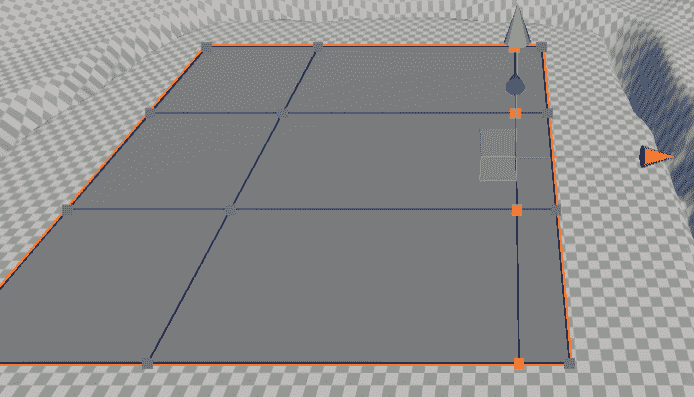

图 4.32 - 移动顶点

1.  重复*步骤 3*至*5*，直到您获得具有相似大小的墙轮廓：

图 4.33 - 移动顶点以减少边缘单元宽度

重要提示

如果您希望顶点具有精确的位置，我建议您安装并探索 ProGrids 包。这是一个与常规 Unity 和 ProBuilder 一起使用的位置捕捉系统。

现在我们已经为墙壁创建了轮廓，让我们向网格添加新的面来创建它们。为了使用我们创建的细分或“面”来制作墙壁，我们必须选择并拉伸它们。按照以下步骤进行：

1.  选择平面。

1.  在场景视图中选择**ProBuilder**按钮的第四个按钮：

图 4.34 – 选择面工具

1.  在按住*Ctrl*（Mac 上为*command*）的同时，单击墙壁轮廓的每个面：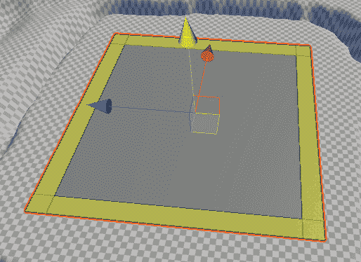

图 4.35 – 选择边缘面

1.  在**ProBuilder**窗口中，找到**Extrude Faces**按钮右侧的加号图标（+）。它将位于窗口的红色部分：

图 4.36 – 拉伸面选项

1.  在点击加号按钮后出现的窗口中设置`5`。

1.  单击该窗口中的**Extrude Faces**按钮：

图 4.37 – 拉伸距离选项

1.  现在，你应该看到墙壁的轮廓刚从地面上升起：

图 4.38 – 拉伸的网格边缘

现在，如果你注意一下基础地板和墙壁与地形的接触，会发现有一点间隙。我们可以尝试将基础向下移动，但地板可能会消失，因为它将被埋在地形下面。我们可以在这里做一个小技巧，只是将墙壁向下推，而不移动地板，这样墙壁将被埋在地形中，但我们的地板将保持与地形的一点距离。你可以在以下图中看到它看起来的样子：

图 4.39 – 预期结果的切片

为了这样做，我们需要执行以下操作：

1.  在场景视图中选择第三个**ProBuilder**按钮以启用边缘选择：

图 4.40 – 选择边缘工具

1.  在按住*Ctrl*（Mac 上为*command*）的同时，选择墙壁的所有底部边缘。

如果选择了不想要的边缘，只需再次单击它们，同时按住*Ctrl*（Mac 上为*command*）取消选择，同时保持当前选择：

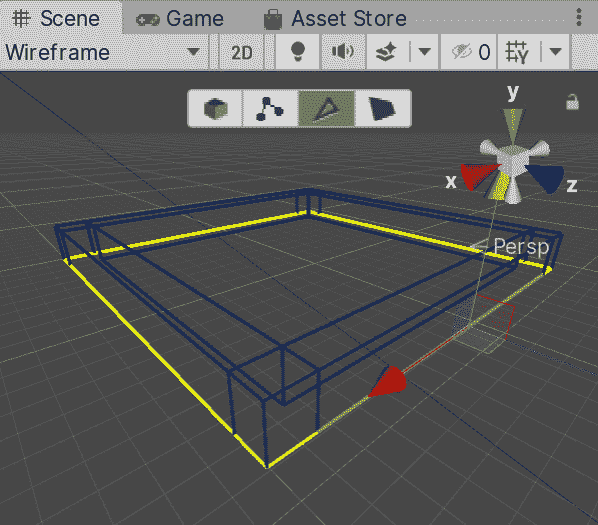

图 4.41 – 选择地板边缘

信息框

如果你想在上一个截图中使用线框模式，点击场景视图左上部的着色按钮，并从下拉菜单中选择线框选项。

1.  启用移动工具，按下 Unity 编辑器左上部的第二个按钮：

图 4.42 – 移动工具

1.  将边缘向下移动，直到完全埋在地形下：

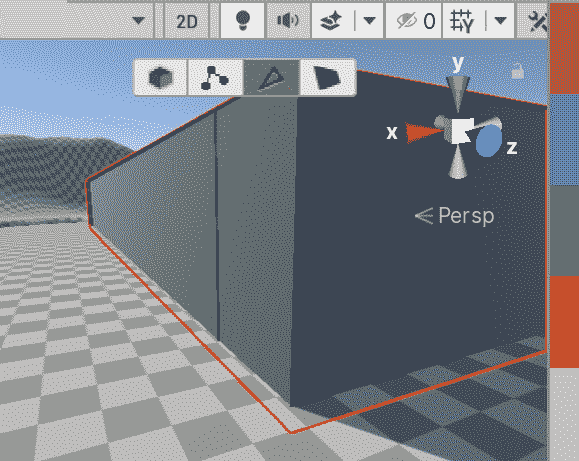

图 4.43 – 重叠的面

现在我们有了一个基础网格，我们可以开始使用其他几个 ProBuilder 工具向其添加细节。

## 添加细节

让我们开始通过对墙壁施加一点倒角来向基础添加细节。按照以下步骤进行：

1.  使用边缘选择模式（**ProBuilder**按钮的第三个按钮），选择我们模型的顶部边缘：

图 4.44 – 选择顶部墙壁边缘

1.  在**ProBuilder**窗口中，点击**Bevel**按钮右侧的加号图标。

1.  设置距离为`0.5`：

图 4.45 – 生成倒角距离

1.  点击**Bevel Edges**。现在，你可以看到我们墙壁的顶部有一点倒角：

图 4.46 – 倒角过程的结果

1.  可选地，你也可以对内墙的底部进行操作：

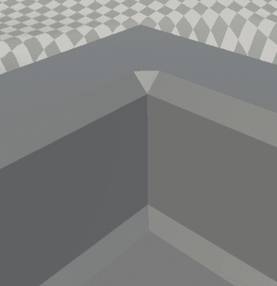

图 4.47 - 地板-墙壁边缘应用斜角

另一个要添加的细节可能是地面中央的坑，作为我们需要避免掉入的危险，以及使敌人避开它使用人工智能。为了做到这一点，请按照以下步骤操作:

1.  点击第四个 ProBuilder 场景视图按钮，启用 FACE 选择模式。

1.  选择地板。

1.  在 ProBuilder 窗口中点击**Subdivide**面选项。你将得到地板分成四块。

1.  再次点击该按钮，以得到一个 4x4 的网格地板:

图 4.48 - 细分地板

1.  选择四个内部地板砖。

1.  通过点击 Unity 编辑器左上角的第四个按钮，启用缩放工具:

图 4.49 - 缩放工具

1.  使用标尺中心的灰色立方体，缩小中心的瓷砖: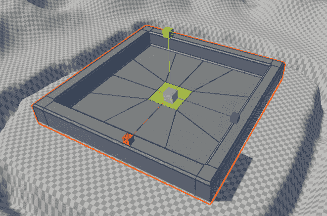

图 4.50 - 内部单元格被缩小

1.  在**ProBuilder**窗口中点击 Extrude Faces 按钮。

1.  将挤出的面向下推。

1.  右键单击**ProBuilder**窗口标签，然后选择**Close Tab**。我们需要回到地形编辑，并且**ProBuilder**打开会让我们无法舒适地进行编辑:

图 4.51 - 关闭标签选项

1.  选择**地形**并降低该地区的地形，以便我们可以看到坑:

图 4.52 - 为了使坑可见而降低地形

我知道我们在原始关卡布局中没有计划这个坑，但请记住，定义首字母缩写是一个在游戏开发中会不断变化的文件，所以有时候，我们可以大胆地进行更改，以改进游戏。只是要注意不要过度进行永无止境的更改，这是一门难以掌握的艺术。

# 总结

在本章中，我们学习了如何使用高度图和 Unity 地形工具创建大型地形网格，例如使用绘制高度和设置高度来创建山丘和河流盆地。此外，我们还学习了如何使用 ProBuilder 创建自己的 3D 网格，以及如何操纵模型的顶点、边和面，创建游戏原型基础模型。我们没有讨论一些可以应用于网格的性能优化，或者一些高级的 3D 建模概念，因为那需要整整的章节，而这超出了本书的范围。现在，我们的主要重点是原型设计，所以我们对我们关卡的当前状态感到满意。

在下一章中，我们将学习如何使用外部工具创建的资产（文件）来下载和替换这些原型模型。这是提高游戏图形质量的第一步，以便达到最终的外观，这将在第二部分结束时完成。
