# 第五章：导入和整合资产

在上一章中，我们创建了我们的关卡的原型。现在，假设我们已经编写了游戏并对其进行了测试，验证了这个想法。因此，现在是时候将原型艺术改为真正的完成艺术了。实际上，我们将在第三部分编写游戏，但出于学习目的，让我们暂时跳过这部分。为了使用最终资产，我们需要学习如何获取它们（图像、3D 模型等），如何将它们导入 Unity，并如何在我们的场景中使用它们。

在本章中，我们将研究以下主题：

+   导入资产

+   整合资产

+   配置资产

# 导入资产

我们可以在项目中使用不同的资产来源。我们可以简单地从我们的艺术家那里获取文件，从不同的免费和付费资产网站下载它们，或者我们可以使用资产商店，Unity 的官方虚拟资产商店，在那里我们可以获取准备在 Unity 中使用的免费和付费资产。我们将使用从互联网和资产商店下载资产的混合方式，以获取所有可能的资源。

在本节中，我们将涵盖与导入资产相关的以下概念：

+   从互联网导入资产

+   从资产商店导入资产

+   从互联网下载并导入我们项目中的资产

## 从互联网导入资产

在获取项目的艺术资产方面，让我们从地形纹理开始。请记住，我们的地形上有一个网格图案，所以想法是用草、泥土、岩石和其他类型的纹理替换它。为此，我们必须获取图像。在这种情况下，这些图像通常是不同地形图案的俯视图，并且它们必须是“可平铺的”。您可以在以下截图中看到一个示例：

.jpg)

图 5.1 – 左：草块；右：将同一草块分开以突出纹理平铺

左边的草看起来是一个单一的大图像，但如果您留意，应该能够看到一些重复出现的图案。在这种情况下，这种草只是一个在网格中重复四次的单个图像，就像右边的那个。这样，您可以通过重复单个小图像来覆盖大面积，从而节省计算机内存。

想法是获取这些类型的图像来绘制我们的地形。你可以从几个地方获取它们，但最简单的方法是使用 Google 图片或任何图片搜索引擎。要做到这一点，请按照以下步骤操作：

1.  打开您的浏览器（Chrome、Safari、Edge 等）。

1.  转到您喜欢的搜索引擎。在这种情况下，我将使用 Google。

1.  使用关键词`PATTERN tileable texture`，将`PATTERN`替换为您正在寻找的地形类型，例如`grass tileable texture`或`mud tileable texture`。在这种情况下，我将输入`grass tileable texture`，然后按*Enter*进行搜索。

1.  切换到图像搜索模式：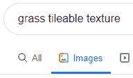

图 5.2 – Google 图像搜索

1.  找到任何您认为适合所需草坪的纹理并单击它。请记住，纹理必须是草的俯视图，并且必须重复。

重要提示

在选择图像之前，请尝试检查图像的分辨率。现在，请尝试选择分辨率小于 1024 x 1024 的正方形图像。

1.  右键单击打开的图像，然后选择**另存为图像…**：

图 5.3 – 另存为图像…选项

1.  将图像保存在您记得的任何文件夹中。

现在您已经下载了图像，可以通过几种方式将其添加到您的项目中。最简单的方法是执行以下操作：

1.  使用**文件资源管理器**（Mac 中的**Finder**）找到您的图像。

1.  在 Unity 的项目窗口中找到或创建`Textures`文件夹。

1.  将文件资源管理器和 Unity 项目窗口并排放置。

1.  将文件从文件资源管理器拖到 Unity 项目窗口的`Textures`文件夹中：

图 5.4 - 从文件资源管理器拖动纹理到 Unity 项目视图

对于这些简单的纹理，任何搜索引擎都可以帮助，但如果你想用详细的墙壁和门替换玩家的基础几何图形，或者在场景中放置敌人，你需要获取 3D 模型。如果你使用关键词如“免费僵尸 3D 模型”在任何搜索引擎中搜索，你会找到无数的免费和付费 3D 模型网站，如 TurboSquid 和 Mixamo，但这些网站可能存在问题，因为这些网格通常没有准备好在 Unity 中使用，甚至在游戏中使用。你会发现模型的多边形数量非常高，尺寸或方向不正确，纹理未经优化等等。为了避免这些问题，我们需要使用更好的来源，在这种情况下，我们将使用 Unity 的资产商店，所以让我们来探索一下。

## 从资产商店导入资产

资产商店是 Unity 的官方资产市场，你可以在那里找到很多模型、纹理、声音，甚至整个 Unity 插件，以扩展引擎的功能。在这种情况下，我们将限制自己下载 3D 模型来替换玩家的基础原型。你会想要获取模块化设计的 3D 模型，意味着你会得到几个部分，如墙壁、地板、角落等等。你可以连接它们来创建任何类型的场景。

为了做到这一点，你必须按照以下步骤进行：

1.  在 Unity 中点击**窗口|资产商店**，这将打开一个新窗口，显示资产商店已经移动。在之前的 Unity 版本中，你可以直接在编辑器中看到资产商店，但现在建议在常规网络浏览器中打开它，所以只需点击**在线搜索**按钮：

图 5.5 - 资产商店已移动消息

1.  你的浏览器将打开一个类似于以下截图的网站：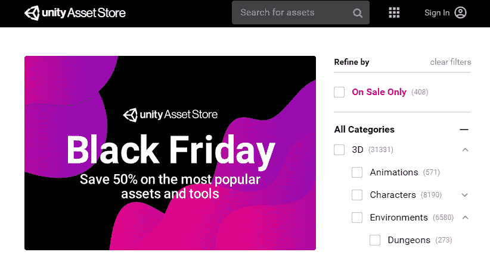

图 5.6 - 资产商店首页

1.  在右侧面板中，点击其右侧的箭头打开 3D 类别。然后，打开**环境**并勾选**科幻**标记。如你所见，有几个类别可以找到不同类型的资产，如果你愿意，你可以选择另一个。在**环境**中，你会找到可以用来生成游戏场景的 3D 模型。

1.  如果需要的话，你可以为资产付费，但现在让我们先隐藏付费的资产。你可以通过侧边栏的**定价**部分进行搜索，使用其右侧的加号（**+**）符号打开它，然后勾选**免费资产**复选框：

图 5.7 - 免费资产选项

1.  在搜索区域，找到任何看起来具有你所寻找美学的资产，并点击它。记得留意户外资产，因为大多数环境包通常只有室内。在我的情况下，我选择了一个名为**科幻风格模块化包**的资产，它适用于室内和室外。请注意，到你阅读本书时，该包可能已经不存在，所以你可能需要选择另一个。如果你找不到合适的包，你可以下载我们在 GitHub 存储库中使用的资产文件。请参考如何访问它的前言说明。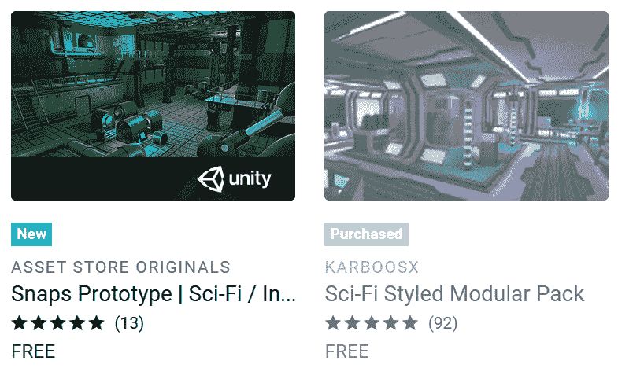

图 5.8 - 资产商店搜索包的预览

重要提示

在撰写本书时，Unity 正在发布“Snaps”包，这是一组官方 Unity 3D 模型，可用于不同类型环境的模块化设计。其中一些是付费的，而另一些是免费的 - 我建议你试试看。

1.  现在，你将在资产商店窗口中看到包的详细信息。在这里，你可以找到关于包的描述、视频/图片、包的内容，以及最重要的部分，评论，你可以查看包是否值得购买，如果是付费的话：

图 5.9 – 资产商店包详情

1.  如果你对这个包满意，点击**添加到我的资产**按钮，如果需要的话登录 Unity，然后点击**在 Unity 中打开**按钮。你可能会被提示接受切换到 Unity 应用程序 – 只需接受：

图 5.10 – 切换应用程序

1.  这将再次打开**包管理器**，但这次是以**我的资产**模式，显示你从资产商店下载过的所有资产的列表，以及你刚刚在列表中选择的那个被突出显示的资产。如果你没有在 Unity Hub 中登录，你可能需要点击登录按钮重新登录 Unity。

图 5.11 – 包管理器显示资产

1.  点击窗口右下角的**下载**，等待下载完成。然后点击**导入**。双重检查你是否从列表中选择了正确的资产包。

1.  过了一会儿，**包内容** 窗口将会出现，允许你选择包中的哪些资产要放入你的项目中。现在，保持原样，点击**导入**：

图 5.12 – 要导入的资产

1.  一段时间后导入，你将在项目窗口中看到所有的包文件。

请注意，导入大量完整的包将大大增加你项目的大小，而且以后你可能想要删除你没有使用的资产。另外，如果导入的资产生成了错误，阻止你播放场景，只需删除包中附带的所有`.cs`文件。它们通常在名为`Scripts`的文件夹中。这些是可能与你的 Unity 版本不兼容的代码文件。在*第三部分*中，我们将学习如何制作我们自己的，这样就不需要这些了：

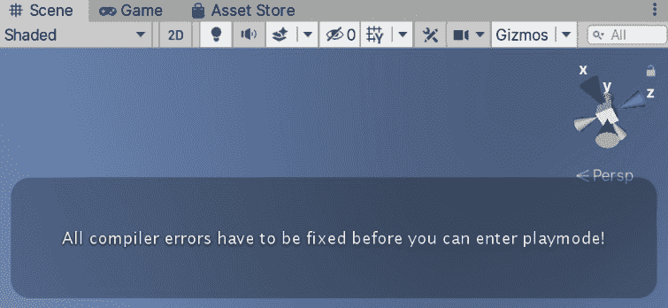

图 5.13 – 点击播放时的代码错误警告

重要提示

资产商店容易发生变化，即使你使用的是和我一样的 Unity 版本，所以之前的步骤可能会被 Unity 改变而没有通知。而且，它的内容经常变化，你可能找不到本书中使用的相同的包。在这种情况下，你可以找到另一个类似的包，或者从 GitHub 仓库中获取我使用的文件（在前言中有链接和说明）。

在继续本章之前，尝试使用资产商店下载一个敌人角色，按照之前的步骤。为了解决这个练习，你必须完成之前的相同步骤，但是在资产商店的**3D | 人物 | 人形**类别中查找。

现在我们已经导入了大量的艺术资产，让我们学习如何在场景中使用它们。

# 整合资产

我们刚刚导入了许多可以以多种方式使用的文件，所以这一部分的目的是看看 Unity 如何将这些资产与需要它们的游戏对象和组件整合在一起。

在本节中，我们将涵盖与导入资产相关的以下概念：

+   整合地形纹理

+   整合网格

+   整合材质

让我们开始使用平铺纹理来覆盖地形。

## 整合地形纹理

为了将纹理应用到我们的地形，做如下操作：

1.  选择**地形**对象。

1.  在**检视器**中，点击**地形**组件的刷子图标（第二个按钮）。

1.  从下拉菜单中选择**油漆纹理**：

图 5.14 – 油漆纹理选项

1.  点击**编辑地形层… | 创建层**选项。

1.  在纹理选择器窗口中查找之前下载的地形纹理：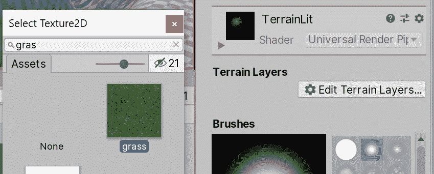

图 5.15-纹理选择器

1.  您将看到纹理将立即应用于整个地形。

1.  重复*步骤 4*和*5*来添加其他纹理。这一次，您会发现该纹理不会立即应用。

1.  在**地形层**部分，选择您创建的新纹理开始绘制。在我的案例中，我使用了泥浆纹理。

1.  就像编辑地形时，在**画笔**部分，您可以选择并配置一个画笔来绘制地形。

1.  在场景视图中，绘制您希望应用该纹理的区域。

1.  如果您的纹理图案太明显，选择地形层框中的纹理，然后打开**NewLayer N**，其中 N 是您创建的层数所依赖的数字。

重要提示

每次向地形添加纹理，您会看到在项目视图中创建了一个名为“NewLayer N”的新资产。它保存了您创建的地形层的数据，如果需要，您可以在其他地形中使用它。您还可以重命名该资产以赋予其有意义的名称。此外，您还可以将这些资产重新组织到它们自己的文件夹中。

1.  使用左侧的三角形打开该部分，并在**平铺设置**部分中增加**大小**属性，直到找到一个合适的大小，其中图案不那么明显：

图 5.16-绘画纹理选项

1.  重复*步骤 4*至*12*，直到您应用了所有想要添加到地形的纹理。在我的案例中，我将泥浆纹理应用于河流盆地，并在山丘上使用了岩石纹理。对于岩石的纹理，我减少了画笔的**不透明度**属性，以更好地与山上的草地融合。您可以尝试在顶部添加一层雪，只是为了好玩：

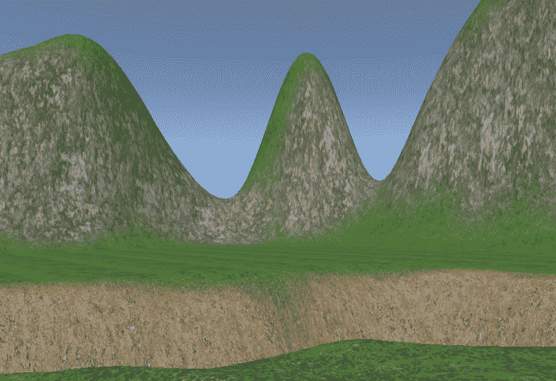

图 5.17-用三种不同的纹理绘制我们的地形的结果

当然，我们可以使用系统的许多高级工具来大大改进这一点，但让我们现在保持简单。现在，让我们看看如何集成 3D 模型。

## 集成网格

如果您选择我们之前配置过的 3D 资产之一并单击其右侧的箭头，则一个或多个子资产将出现在项目窗口中。这意味着 FBX 不是一个 3D 模型，而是定义 3D 模型的资产容器：

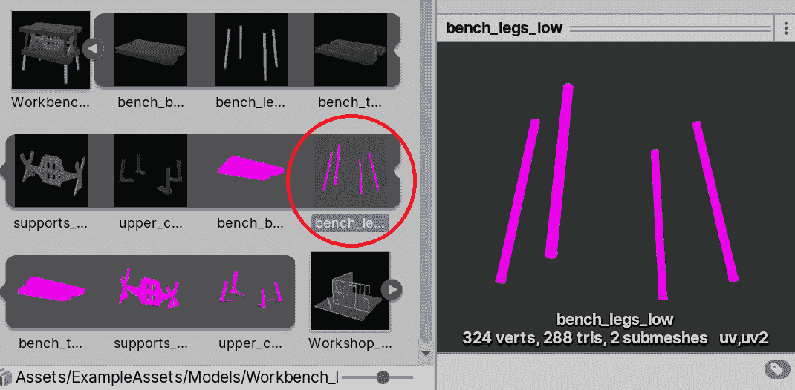

图 5.18-网格选择器

其中一些子资产是网格，这是定义模型几何形状的三角形集合。您可以在文件中找到至少一个这样的网格，但也可以找到多个，如果您的模型由许多部分组成，那就可能会发生。例如，汽车可以是一个单一的刚性网格，但这不允许您旋转其车轮或打开其车门；它只是一个静态的汽车，如果汽车只是场景中的道具，那可能足够了，但如果玩家能够控制它，您可能需要对其进行修改。这个想法是您的汽车的所有部分都是不同的游戏对象，彼此之间是父子关系，这样如果您移动一个，所有的都会移动，但您仍然可以独立旋转这些部分。

当您将 3D 模型文件拖到场景中时，Unity 将根据艺术家的创建方式自动为每个部分创建所有对象及其适当的父子关系。您可以在**层次结构**中选择对象并探索其所有子对象来查看这一点：

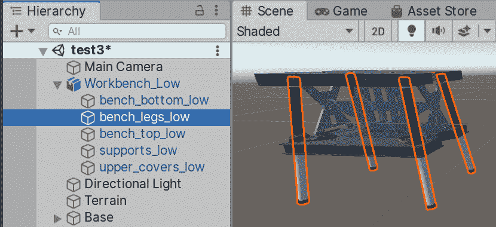

图 5.19-子对象选择

此外，您会发现每个对象都有自己的`MeshFilter`和`MeshRenderer`组件，每个组件只渲染汽车的一部分。请记住，网格过滤器是一个具有对要渲染的网格资产的引用的组件，因此网格过滤器是使用我们之前讨论过的那些网格子资产的组件：

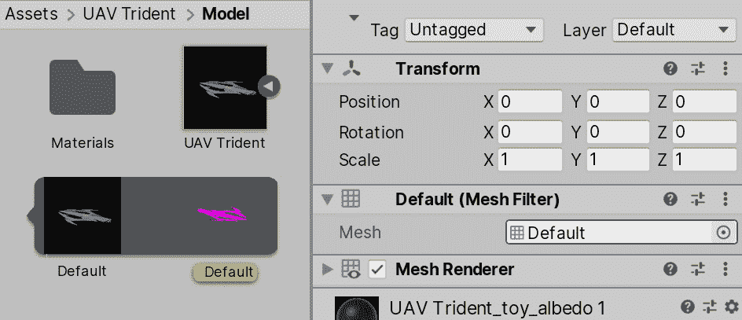

图 5.20 – 网格过滤器当前网格选择

现在，如果您将 3D 模型文件拖入场景，您将获得与模型为 Prefab 且您正在实例化它时类似的结果。但是 3D 模型文件比 Prefab 更有限，因为您无法对模型应用更改，因此在将对象拖入场景并编辑以获得所需的行为后，我建议您创建一个 Prefab，以获得我们在*第三章*中讨论的所有好处，*使用场景和游戏对象*，例如对所有 Prefab 实例应用更改等。永远不要从模型文件创建大量实例 – 总是从基于该文件创建的 Prefab 创建它们。

这是 3D 网格的基本用法。现在，让我们来探讨纹理集成过程，这将使我们的 3D 模型更加详细。

## 集成纹理

也许您的模型已经应用了纹理，或者它已经应用了品红色。在后一种情况下，这意味着该资产未准备好与您在创建项目时选择的 URP 模板一起使用。Asset Store 中的一些资产是为旧版本的 Unity 而设计的：

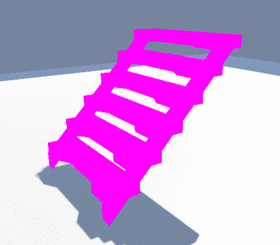

图 5.21 – 使用错误或没有材质渲染的网格

修复的一个选项是使用**编辑 | 渲染管线 | 通用渲染管线 | 将项目材质升级到 UniversalRP 材质**。这将尝试将所有材质升级到 Unity 的当前版本：

图 5.22 – 将材质升级到 URP

这种方法的缺点是，有时它无法正确升级材质。幸运的是，我们可以通过以这种新方式重新应用对象的纹理来解决这个问题。即使您的资产工作正常，我建议您无论如何重新应用纹理，只是为了更多地了解材质的概念。

纹理直接应用于对象。这是因为纹理只是控制模型外观的所有配置中的一个。为了改变模型的外观，您必须创建一个材质。材质是一个单独的资产，包含有关 Unity 应该如何渲染您的对象的许多设置。您可以将该资产应用于共享相同图形设置的多个对象，如果更改材质的设置，它将影响使用它的所有对象。它的工作原理类似于图形配置文件。

为了创建一个可以应用纹理的材质，您需要按照以下步骤进行：

1.  在项目窗口中，单击窗口左上角的加号（**+**）按钮。

1.  在菜单中找到**Material**选项并单击它。

1.  给您的材质命名。这通常是您正在创建的资产的名称（例如，汽车，船，角色等）。

1.  将您创建的材质资产拖到场景中的模型实例上。目前，如果您将鼠标与拖动的资产一起移动到对象上，您将能够预览使用该材质的外观。释放鼠标即可确认。

1.  也许您的对象有几个部分。在这种情况下，您需要将材质拖到对象的每个部分。

重要提示

拖动材质只会改变您拖动的对象的`MeshRenderer`组件的材质属性。

1.  选择材质并单击**Base Map**属性左侧的圆圈。

1.  在**纹理选择器**中，点击模型的纹理。定位纹理可能有些复杂。通常，纹理的名称将与模型名称匹配。如果不匹配，您将需要尝试不同的纹理，直到找到适合您对象的纹理。此外，您可能会发现几个与您的模型同名的纹理。只需选择看起来颜色合适的纹理，而不是看起来是黑白或浅蓝色的纹理；我们稍后会用到它们：

图 5.23 – URP 材质的基本贴图属性

通过这样，您已成功通过材质将纹理应用到对象上。对于每个使用相同纹理的对象，只需拖动相同的材质。现在我们已经基本了解了如何应用模型纹理，让我们学习如何在将模型传播到整个场景之前正确配置导入设置。

# 配置资产

正如我们之前提到的，艺术家习惯于在 Unity 之外创建艺术资产，这可能导致从该工具中看到的资产与 Unity 导入的方式之间存在差异。例如，3D Studio 可以使用厘米、英寸等单位，而 Unity 使用米。我们刚刚下载并使用了大量资产，但我们跳过了解决这些差异的配置步骤，所以现在让我们来看看这个。

在本节中，我们将涵盖与导入资产相关的以下概念：

+   配置网格

+   配置纹理

让我们开始讨论如何配置 3D 网格。

## 配置网格

为了更改模型的导入设置，您需要定位您下载的模型文件。包含 3D 模型的文件扩展名有几种，最常见的是`.fbx`文件，但您可能会遇到其他扩展名，如`.obj`、`.3ds`、`.blender`、`.mb`等。您可以通过其扩展名来识别文件是否为 3D 网格：

图 5.24 – 选择的资产路径扩展

此外，您可以点击**资产**，并在检查器中查看以下截图中可以看到的选项卡：

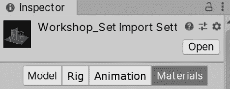

图 5.25 – 网格材质设置

现在您已经找到了 3D 网格文件，可以正确配置它们。现在，我们应该考虑的唯一事情是模型的适当比例。艺术家习惯于使用不同设置的不同软件工作；也许一个艺术家使用米作为其度量单位创建了模型，而其他艺术家使用英寸、英尺等。当导入使用不同单位创建的资产时，它们可能会不成比例，这意味着我们将得到诸如人类比建筑物更大等结果。

最好的解决方案是询问艺术家来解决这个问题。如果所有的资产都是由您公司创建的，或者您使用了外部资产，您可以要求艺术家将其修复为您公司的工作方式，但现在，您可能是一个独立学习 Unity 的开发人员。幸运的是，Unity 有一个设置，允许您在在 Unity 中使用原始资产之前重新调整其比例。为了改变对象的比例因子，您必须执行以下操作：

1.  在项目窗口中找到 3D 网格。

1.  将其拖到场景中。您会看到一个对象出现在您的场景中。

1.  使用**GameObject | 3D Object | Capsule**选项创建一个胶囊。

1.  将胶囊放在您拖入编辑器的模型旁边。看看比例是否合理。这样做的目的是让胶囊代表一个人（2 米高），这样您就有了比例的参考：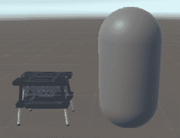

图 5.26 – 不成比例的资产

1.  如果模型比预期的要大或小，请在项目窗口中再次选择网格（而不是您拖到编辑器中的 GameObject 实例），您将在检查器中看到一些导入设置。

1.  查找**比例因子**属性并修改它，如果您的模型比预期的要小，则增加它，或者在相反的情况下减小它：

图 5.27-模型网格选项

1.  单击检查器底部的**应用**按钮。

1.  重复*步骤 6*和*7*，直到获得所需的结果。

还有很多其他选项要配置，但现在让我们暂停一下。现在，让我们讨论如何正确配置我们模型的纹理。

## 配置纹理

同样，这里有几个设置要配置，但让我们现在专注于纹理大小。想法是使用最适合该纹理使用的大小，这取决于许多因素。要考虑的第一个因素是从对象将被看到的距离。如果您正在创建第一人称游戏，您可能会看到足够接近的许多对象，以证明大纹理的必要性，但也许您有许多远处的对象，例如建筑物顶部的广告牌，您永远不会靠近到足以看到细节，因此您可以为此使用较小的纹理。还要考虑的是对象的重要性。如果您正在创建赛车游戏，您可能会有许多只会在屏幕上出现几秒钟且玩家永远不会关注的 3D 模型；他们将会注意道路和其他汽车。在这种情况下，街上的垃圾箱之类的对象可以有一个小纹理和低多边形模型，用户永远不会注意到（除非他们停下来欣赏风景，但这是可以接受的）。最后，您可以有一个从顶部向下查看的游戏，永远不会放大场景，因此在第一人称游戏中具有大纹理的相同对象在这里会有一个不太详细的纹理。在下一张图中，您可以看到较小的船可以使用较小的纹理：

.jpg)

图 5.28-在不同距离下看到相同的模型

纹理的理想尺寸是相对的。找到它的常规方法是通过改变其大小，直到在游戏中以可能的最近位置看到对象时找到最小可能的尺寸并保持良好的质量。这是一种反复试验的方法。为了做到这一点，您可以执行以下操作：

1.  找到 3D 模型并将其放入场景中。

1.  将场景视图相机放置在一个位置，以便以游戏中最大的尺寸显示对象。例如，在 FPS 游戏中，它几乎会在对象旁边，而在俯视游戏中，它会在对象上方几米处。同样，这取决于您的游戏。

1.  在导入包或之前创建的材质中的文件夹中找到并选择对象使用的纹理。它们通常具有`.png`、`.jpg`或`.tif`扩展名。

1.  在检查器中，查看**最大尺寸**属性并减小它，尝试下一个更小的值。例如，如果纹理为 2,048，请尝试 1,024。

1.  单击**应用**并检查场景视图，看看质量是否急剧下降或更改是否不明显。您会感到惊讶。

1.  重复*步骤 4*至*5*，直到获得低质量的结果。在这种情况下，只需增加先前的分辨率以获得可接受的质量。当然，如果您的目标是 PC 游戏，您可以期望比移动游戏更高的分辨率。

现在您已经导入，集成和配置了您的对象，让我们用这些资产创建我们的玩家基地。

## 组装场景

让我们开始使用我们下载的环境包替换我们的原型基地。为此，您必须执行以下操作：

1.  在`corner`关键字中：

图 5.29 - 网格选择器

1.  在我的特定情况下，我有角落的外侧和内侧作为单独的模型，所以我需要将它们放在一起。

1.  将其放置在原型基地的任何一个角落的相同位置：

图 5.30 - 在替换占位符上放置网格

1.  找到适合与角落连接以创建墙壁的合适模型。同样，你可以尝试在项目窗口中搜索`wall`关键字。

1.  实例化它并将其定位，使其与角落相连。如果不完全匹配，不要担心；以后可以随时调整场景。

重要提示

你可以选择一个对象，按下*V*键选择所选对象的顶点，将其拖动到另一个对象的顶点。这被称为顶点捕捉。它允许你精确地连接场景中的两个部分：

图 5.31 - 连接两个模块

1.  重复墙壁，直到达到玩家基地的另一端，并放置另一个角落。你可能会得到一个比原型稍大或稍小的墙壁，但没关系：

图 5.32 - 连接模块的链

重要提示

记住，你可以按住*Ctrl*键（Mac 上的*Control*）移动一个对象，以便将对象的位置捕捉到墙壁的克隆物可以轻松地定位在其他墙壁旁边。

1.  完成其余的墙壁并摧毁原型。记住这个过程很慢，你需要耐心。

1.  通过寻找地板砖并在整个表面重复它们来添加地板：！图 5.33 - 带有坑洞的地板模块

图 5.33 - 带有坑洞的地板模块

1.  使用包中的其他模块化部件添加任何你想要添加的细节。

1.  将所有这些部件放入一个名为`Base`的容器对象中。记得创建一个空对象，然后将基础部件拖放到其中：

图 5.34 - 网格子资产

经过多次练习，你将慢慢积累关于模块化场景设计的常见问题和良好实践的经验。所有的包都有不同的模块化设计，所以你需要适应它们。

# 总结

在本章中，我们学习了如何导入模型和纹理，并将它们整合到我们的场景中。我们讨论了如何将纹理应用到地形上，如何用模块化模型替换我们的原型网格，如何将纹理应用到这些模型上，以及如何根据对象的使用情况考虑多个标准来正确配置资产。

通过这样，我们已经完成了本书的第一部分，并讨论了几个基本的 Unity 概念。在第二部分中，我们将开始深入研究几个 Unity 系统，这些系统可以帮助我们改善游戏的图形和声音质量。我们将开始学习如何创建自定义材质类型，以创建有趣的视觉效果和动画。
