# 第六章：*第六章*：使用 URP 和着色器图的材质和效果

欢迎来到*第二部分*的第一章！我非常激动，因为你已经到达了这本书的这一部分，因为在这里，我们将深入研究 Unity 的不同图形和音频系统，以显着改善游戏的外观和感觉。我们将从这一部分开始，本章将讨论材质的着色器是什么，以及如何创建我们自己的着色器来实现一些无法使用默认 Unity 着色器实现的自定义效果。我们将创建一个简单的水动画效果来学习这个新概念。

在本章中，我们将研究以下着色器概念：

+   着色器介绍

+   使用着色器图创建着色器

# 介绍着色器

在上一章中，我们创建了材质，但我们从未讨论过它们内部是如何工作的，以及为什么着色器属性非常重要。在本章的第一部分，我们将探讨着色器的概念，作为编程视频卡以实现自定义视觉效果的一种方式。

在这一部分，我们将涵盖与着色器相关的以下概念：

+   着色器管道

+   渲染管道和 URP

+   URP 内置着色器

让我们从讨论着色器如何修改着色器管道以实现效果开始。

## 着色器管道

每当显卡渲染 3D 模型时，它需要输入数据进行处理，例如网格、纹理、对象的变换（位置、旋转和缩放）以及影响该对象的光源。有了这些数据，显卡必须将对象的像素输出到后备缓冲区，即视频卡将绘制我们对象的图像的地方。当 Unity 完成渲染所有对象（和一些效果）以显示完成的场景时，将显示该图像。基本上，后备缓冲区是显卡逐步渲染的图像，在绘制完成时显示出来（此时，它变成前置缓冲区，与之前的缓冲区交换）。

这是渲染对象的常规方式，但在输入数据和像素输出之间发生的事情可以通过许多不同的方式和技术来处理，这取决于您希望对象的外观如何；也许您希望它看起来很逼真或看起来像全息图，也许对象需要一个解体效果或卡通效果——可能有无尽的可能性。指定我们的显卡将如何处理对象的渲染的方式是通过着色器。

着色器是用特定的显卡语言编写的程序，例如 CG、HLSL 或 GLSL，它配置渲染过程的不同阶段，有时不仅配置它们，还用完全自定义的代码替换它们，以实现我们想要的精确效果。渲染的所有阶段形成了我们所说的着色器管道，一系列应用于输入数据的修改，直到它被转换为像素。

重要说明

有时，在本书中我们所说的着色器管道也可以在其他文献中被称为渲染管道，而后者也是正确的，在 Unity 中，渲染管道这个术语指的是不同的东西，所以让我们坚持这个名字。

管道的每个阶段负责不同的修改，根据显卡着色器模型的不同，这个管道可能会有很大的变化。在下一个图表中，您可以找到一个简化的渲染管道，跳过了现在不重要的高级/可选阶段：

图 6.1 – 常见着色器管道

让我们讨论每个阶段：

+   **输入组装器**：这里是所有网格数据的组装地方，例如顶点位置、UV 和法线，准备好进行下一阶段。在这里你不能做太多事情；这个过程几乎总是一样的。

+   **顶点着色器**：过去，这个阶段仅限于应用对象的变换、相机的位置和透视以及一些简单但有限的光照计算。使用现代 GPU，您可以自行决定。这个阶段接收要渲染的对象的每一个顶点，并输出一个修改过的顶点，因此基本上您有机会在这里修改对象的几何形状。这里的通常代码基本上与旧视频卡的代码相同，应用对象的变换，但您可以进行多种效果，比如沿着法线膨胀对象以应用旧的卡通效果技术，或者应用一些扭曲效果以制作全息效果（看看*死亡搁浅*中的全息效果）。还有机会计算下一个阶段的数据，但我们暂时不会深入讨论。

+   **裁剪**：对于大多数要渲染的模型，您永远不会看到模型面的背面。以立方体为例；无论如何都无法看到任何一面的背面或内侧，因为它们会被其他面自动遮挡。因此，渲染立方体每个面的两面，即使看不到背面，也是没有意义的，幸运的是，这个阶段会处理这个问题。裁剪将根据面的方向确定是否需要渲染面，从而节省了遮挡面的大量像素计算。您可以根据特定情况更改这一行为；例如，我们可以创建一个需要透明的玻璃箱，以便看到箱子的所有侧面。

+   **光栅化器**：现在我们已经计算出了修改过的可见几何模型，是时候将其转换为像素了。光栅化器为我们的网格三角形创建所有像素。这里发生了很多事情，但我们对此几乎没有控制权；通常的光栅化方式是在网格三角形的边缘内创建所有像素。我们还有其他模式，只渲染边缘上的像素以实现线框效果，但这通常用于调试目的：

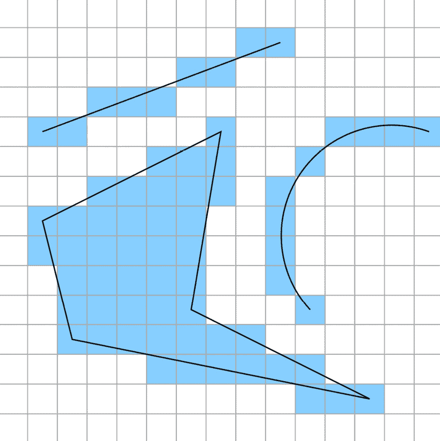

图 6.2 - 光栅化的图例

+   **片段着色器**：这是所有阶段中最可定制的阶段之一。它的目的很简单：确定光栅化器生成的每个片段（像素）的颜色。在这里，可以发生很多事情，从简单地输出纯色或对纹理进行采样到应用复杂的光照计算，比如法线贴图和 PBR。此外，您还可以使用这个阶段创建特殊效果，比如水动画、全息图、扭曲、解体和其他需要修改像素外观的特殊效果。我们将在本章的后续部分探讨如何使用这个阶段。

+   **深度测试**：在将像素视为完成之前，我们需要检查像素是否可见。这个阶段检查像素的深度是在之前渲染的像素的后面还是前面，确保无论对象的渲染顺序如何，相机最近的像素始终位于其他像素的顶部。同样，通常情况下，这个阶段保持默认状态，优先考虑靠近相机的像素，但有些效果需要不同的行为。例如，在下一个截图中，您可以看到一种效果，它允许您看到其他对象后面的对象，比如*帝国时代*中的单位和建筑：

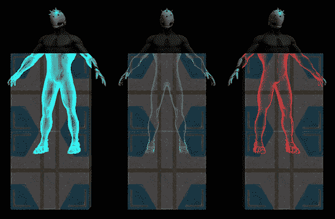

图 6.3 - 渲染角色的遮挡部分

+   **混合**：一旦确定了像素的颜色，并且我们确定像素没有被前一个像素遮挡，最后一步就是将其放入后备缓冲区（正在绘制的帧或图像）。通常的做法是覆盖该位置的任何像素（因为我们的像素更接近相机），但是如果考虑透明物体，我们需要将我们的像素与前一个像素结合起来，以产生透明效果。透明度除了混合之外还有其他要考虑的事情，但主要思想是混合控制像素将如何与后备缓冲区中先前渲染的像素结合。

着色器管线是一个需要整本书来讨论的主题，但在本书的范围内，前面的描述将让您对着色器的功能以及可能实现的效果有一个很好的了解。现在我们已经讨论了着色器如何渲染单个对象，值得讨论的是 Unity 如何使用渲染管线渲染所有对象。

## 渲染管线和 URP

我们已经介绍了视频卡如何渲染对象，但 Unity 负责要求视频卡对每个对象执行其着色器管线。为此，Unity 需要进行大量的准备和计算，以确定每个着色器需要何时以及如何执行。负责执行此操作的是 Unity 所谓的渲染管线。

渲染管线是绘制场景中对象的一种方式。起初，听起来似乎应该只有一种简单的方法来做到这一点，例如只需迭代场景中的所有对象，并使用每个对象材质中指定的着色器执行着色器管线，但实际上可能比这更复杂。通常，一个渲染管线与另一个之间的主要区别在于光照和一些高级效果的计算方式，但它们也可能在其他方面有所不同。

在以前的 Unity 版本中，只有一个单一的渲染管线，现在称为内置渲染管线。它是一个具有您在各种项目中所需的所有可能功能的管线，从移动 2D 图形和简单 3D 图形到主机或高端 PC 上可以找到的尖端 3D 图形。这听起来很理想，但实际上并非如此；拥有一个单一的巨大渲染器，需要高度可定制以适应所有可能情况，会产生大量的开销和限制，导致比创建自定义渲染管线更头疼。幸运的是，Unity 的最新版本引入了**可编程渲染管线**（SRP），一种为您的项目创建适用的渲染管线的方法。

幸运的是，Unity 不希望您为每个项目创建自己的渲染管线（这是一项复杂的任务），因此它为您创建了两个定制的管线，可以立即使用：URP（以前称为 LWRP），代表通用渲染管线，以及 HDRP，代表高清晰度渲染管线。其想法是您必须根据项目要求选择其中一个（除非您真的需要创建自己的）。URP 是我们为游戏创建项目时选择的一个渲染管线，适用于大多数不需要大量高级图形功能的游戏，例如移动游戏或简单的 PC 游戏，而 HDRP 则具有许多高级渲染功能，适用于高质量游戏。后者需要高端硬件才能运行，而 URP 可以在几乎所有相关目标设备上运行。值得一提的是，您可以随时在内置渲染器、HDRP 和 URP 之间切换，包括在创建项目后（不建议）：

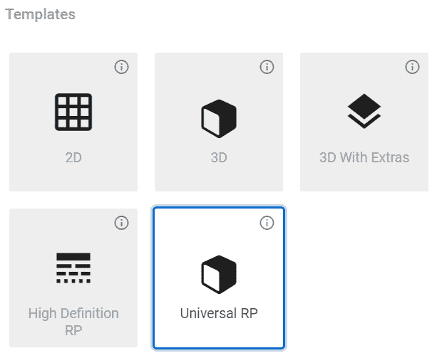

图 6.4 – 项目向导显示 HDRP 和 URP 模板

我们可以讨论每个着色器是如何实现的以及它们之间的区别，但是这可能会填满整整一章；现在，这一部分的想法是让你知道为什么我们在创建项目时选择了 URP，因为它有一些限制，我们将在本书中遇到这些限制，所以了解为什么我们接受了这些限制是很重要的（为了在所有相关的硬件上运行我们的游戏）。此外，我们需要知道我们选择了 URP 是因为它支持 Shader Graph，这是 Unity 工具，我们将在本章中使用它来创建自定义效果。以前的 Unity 内置管线没有为我们提供这样的工具（除了第三方插件）。最后，介绍 URP 的概念的另一个原因是它带有许多内置的着色器，我们需要在创建自己的着色器之前了解这些着色器，以避免重复造轮子，并且要适应这些着色器，因为如果你来自以前的 Unity 版本，你所了解的着色器在这里不起作用，实际上这正是我们将在本书的下一部分讨论的内容：不同 URP 内置着色器之间的区别。

## URP 内置着色器

现在我们知道了 URP 和其他管线之间的区别，让我们讨论一下哪些着色器集成到了 URP 中。让我们简要描述一下这个管线中最重要的三个着色器：

+   **Lit**：这是旧的 Standard Shader 的替代品。当创建各种真实的物理材料时，比如木头、橡胶、金属、皮肤以及它们的组合（比如皮肤和金属盔甲的角色）时，这个着色器非常有用。它支持法线贴图、遮挡、金属和高光工作流程以及透明度。

+   **Simple Lit**：这是旧的 Mobile/Diffuse Shader 的替代品。顾名思义，这个着色器是 Lit 的简化版本，意味着它的光照计算是光照工作的简化近似，比其对应物少了一些功能。基本上，当你有简单的图形而没有真实的光照效果时，这是最好的选择。

+   **Unlit**：这是旧的 Unlit/Texture Shader 的替代品。有时，你需要没有任何光照的对象，在这种情况下，这就是适合你的着色器。没有光照并不意味着没有光或完全黑暗；实际上，这意味着对象根本没有阴影，并且完全可见而没有任何阴影。一些简单的图形可以使用这个，依赖于阴影被烘焙在纹理中，这意味着纹理带有阴影。这是非常高效的，特别是对于移动电话等低端设备。此外，你还有其他情况，比如光管或屏幕，这些对象不能接收阴影，因为它们发出光，所以即使在完全黑暗中也会以全彩色显示。在下面的截图中，你可以看到一个使用 Unlit Shader 的 3D 模型。它看起来像是被照亮了，但实际上只是模型的纹理在对象的不同部分应用了较浅和较深的颜色：

图 6.5 - 使用无光效果模拟廉价照明的 Pod

让我们使用 Simple Lit Shader 做一个有趣的分解效果来展示它的能力。你必须做以下操作：

1.  从任何搜索引擎下载并导入**Cloud Noise**纹理：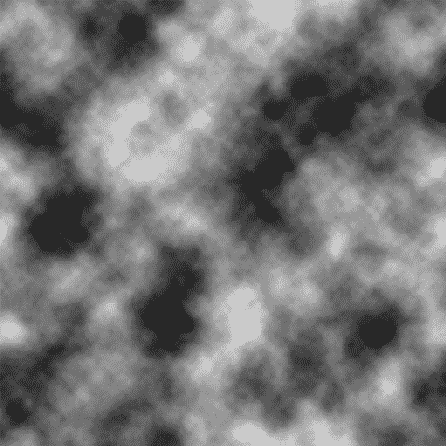

图 6.6 - 噪音纹理

1.  在项目面板中选择最近导入的纹理。

1.  在检查器中，将**Alpha Source**属性设置为**From Gray Scale**。这意味着纹理的 alpha 通道将根据图像的灰度计算：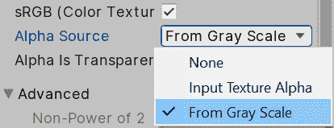

图 6.7 - 从灰度纹理生成 Alpha 纹理设置

重要提示

颜色的 Alpha 通道通常与透明度相关联，但您会注意到我们的物体不会是透明的。Alpha 通道是额外的颜色数据，可以在进行效果时用于多种目的。在这种情况下，我们将使用它来确定哪些像素首先被解体。

1.  通过单击项目视图中的**+**图标并选择**Material**来创建一个材质：

图 6.8 – 材质创建按钮

1.  使用 Unity 顶部菜单中的**GameObject | 3d Object | Cube**选项创建一个立方体：

图 6.9 – 创建立方体原语

1.  从项目窗口将创建的材质拖动到立方体上应用材质。

1.  单击检查器中 Shader 属性右侧的下拉菜单，并搜索**Universal Render Pipeline | Simple Lit**选项：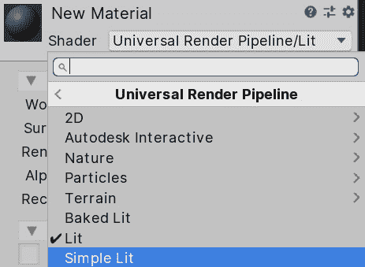

图 6.10 – 简单光照着色器选择

1.  选择**Material**，在**Base Map**中设置最近下载的 Cloud Noise Texture。

1.  检查`0.5`：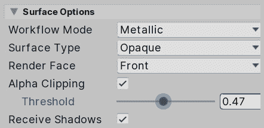

图 6.11 Alpha Clipping 阈值材质滑块

1.  当您移动 Alpha Clipping 滑块时，您会看到物体开始崩解。Alpha Clipping 会丢弃比样式值具有更低 Alpha 强度的像素：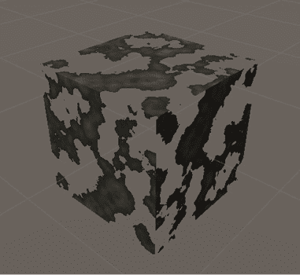

图 6.12 带有 Alpha Clipping 的崩解效果

1.  最后，将**Render Face**设置为**Both**以关闭**Culling Shader Stage**并查看立方体面的两侧：

图 6.13 双面 Alpha Clipping

1.  请注意，创建纹理的艺术家可以手动配置 Alpha 通道，而不是从灰度计算，只是为了精确控制崩解效果的外观，而不考虑纹理的颜色分布。

本节的目的不是全面介绍所有 URP Shader 的所有属性，而是让您了解当正确配置 Shader 时 Shader 可以做什么，以及何时使用每个集成 Shader。有时，您可以通过使用现有的 Shader 来实现所需的效果。实际上，在简单的游戏中，您可能可以在 99%的情况下使用现有的 Shader。因此，请尽量坚持使用它们。但是，如果确实需要创建自定义 Shader 来创建非常特定的效果，下一节将教您如何使用名为 Shader Graph 的 URP 工具。

# 使用 Shader Graph 创建 Shader

现在我们知道了 Shader 的工作原理以及 URP 中现有的 Shader，我们对何时需要创建自定义 Shader 以及何时不需要有了基本概念。如果确实需要创建一个，本节将介绍使用 Shader Graph 创建效果的基础知识，Shader Graph 是一种使用可视化节点编辑器创建效果的工具，在您不习惯编码时使用起来非常方便。

在本节中，我们将讨论 Shader Graph 的以下概念：

+   创建我们的第一个 Shader Graph

+   使用纹理

+   组合纹理

+   应用透明度

让我们开始看看如何创建和使用 Shader Graph。

## 创建我们的第一个 Shader Graph 资产

Shader Graph 是一种工具，允许我们使用基于节点的系统创建自定义效果。Shader Graph 中的效果可能看起来像以下截图，您可以看到创建全息效果所需的节点：

图 6.14 Shader Graph 带有节点以创建自定义效果

我们稍后将讨论这些节点的作用，并进行逐步的效果示例，但在屏幕截图中，您可以看到作者创建并连接了几个节点，这些节点是相互连接的框，每个节点都执行特定的过程以实现效果。使用 Shader Graph 创建效果的想法是学习您需要哪些特定节点以及如何正确连接它们，以创建一个“算法”或一系列有序的步骤来实现特定的结果。这类似于我们编写游戏玩法的方式，但这个图表是专门为效果目的而调整和简化的。

要创建和编辑我们的第一个 Shader Graph 资产，请执行以下操作：

1.  在项目窗口中，单击**+**图标，然后找到**Shader | PBR Graph**选项。这将使用 PBR 模式创建一个 Shader Graph，这意味着这个 Shader 将支持照明效果（不像 Unlit Graphs）:

图 6.15 PBR Shader Graph 创建

1.  将其命名为`WaterGraph`。如果您错过了重命名资产的机会，请记住您可以选择资产，右键单击，然后选择**重命名**：

图 6.16 Shader Graph 资产

1.  创建一个名为`WaterMaterial`的新材质，并将**Shader**设置为**Shader Graphs/Water**。如果由于某种原因 Unity 不允许您这样做，请尝试右键单击**WaterGraph**，然后单击**Reimport**。正如您所看到的，创建的 Shader Graph 资产现在显示为材质中的 Shader，这意味着我们已经创建了一个自定义 Shader: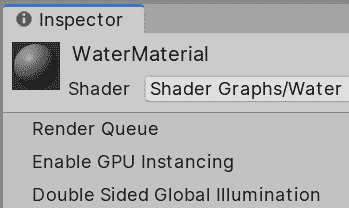

图 6.17 将 Shader Graph 设置为材质 Shader

1.  使用**GameObject | 3d Object | Plane**选项创建一个平面。

1.  将**材质**拖动到**平面**上应用它。

现在，您已经创建了您的第一个自定义 Shader 并将其应用于材质。到目前为止，它看起来一点也不有趣——它只是一个灰色的效果，但现在是时候编辑图表以释放其全部潜力了。正如图表的名称所暗示的，本章中我们将创建一个水效果，以说明 Shader Graph 工具集的几个节点以及如何连接它们，因此让我们从讨论主节点开始。当您双击打开图表时，您将看到以下内容:

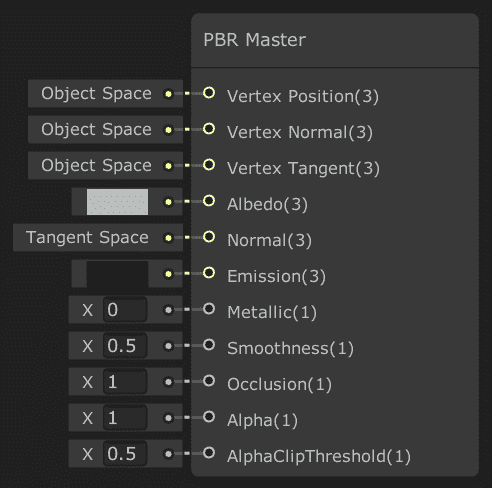

图 6.18 具有计算对象外观所需的所有属性的主节点

所有节点都有输入引脚，它们需要的数据，以及输出引脚，这是其过程的结果。例如，在求和运算中，我们将有两个输入数字和一个输出数字，即求和的结果。在这种情况下，您可以看到主节点只有输入，这是因为进入主节点的所有数据将被 Unity 用于计算对象的渲染和照明，诸如所需的对象颜色或纹理（反照率输入引脚），它有多光滑（光滑度输入引脚），或者它含有多少金属（金属输入引脚），因此它们都是将影响照明如何应用于对象的属性。在某种意义上，这个节点的输入是整个图的输出数据，也是我们需要填充的数据。

让我们开始探索如何通过以下方式更改输出数据:

1.  双击**Shader Graph**以打开其编辑窗口。

1.  单击**Albedo**输入引脚左侧的灰色矩形:

图 6.19 反照率主节点输入引脚

1.  在颜色选择器中，选择浅蓝色，就像水一样。选择选择器周围的蓝色部分，然后在中间矩形中选择该颜色的一种色调: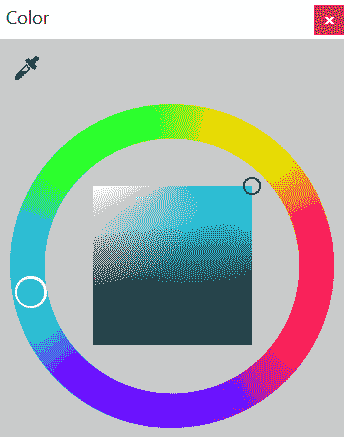

图 6.20 颜色选择器

1.  设置`0.9`：

图 6.21 光滑度 PBR 主节点输入引脚

1.  单击窗口左上角的**保存资源**按钮：

图 6.22 Shader Graph 保存选项

1.  返回到场景视图，检查平面是否为浅蓝色，并且有太阳的反射：

图 6.23 初始 Shader Graph 结果

如您所见，着色器的行为根据您在主节点中设置的属性而变化，但到目前为止，这与创建无光着色器并设置其属性没有什么不同；Shader Graph 的真正威力在于当您使用执行特定计算的节点作为主节点的输入时。我们将开始看到纹理节点，它们允许我们将纹理应用到我们的模型上。

# 使用纹理

使用纹理的想法是以一种方式将图像应用于模型，这意味着我们可以用不同的颜色涂抹模型的不同部分。请记住，模型有 UV 映射，这使得 Unity 知道纹理的哪个部分将应用于模型的哪个部分：

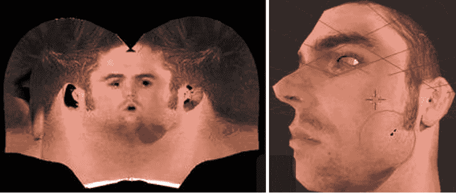

图 6.24 左侧是面部纹理；右侧是应用于面部网格的相同纹理

我们有几个节点来执行此任务，其中之一是 Sample Texture 2D，这是一个具有两个主要输入的节点。首先，它要求我们提供要对模型进行采样或应用的纹理，然后是 UV。您可以在以下截图中看到它：

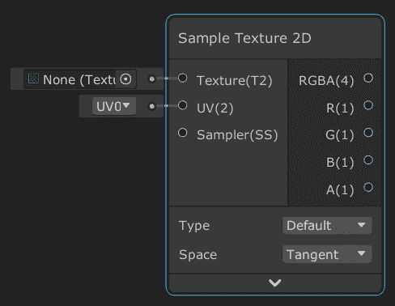

图 6.25 Sample Texture 节点

如您所见，纹理输入节点的默认值为**None**，因此默认情况下没有纹理，我们需要手动指定。对于 UV，默认值为 UV0，这意味着默认情况下，节点将使用模型的主 UV 通道，是的，一个模型可以设置多个 UV，但现在我们将坚持使用主要的 UV。让我们尝试这个节点，执行以下操作：

1.  从互联网上下载并导入**可平铺的水纹理**：

图 6.26 可平铺的水纹理

1.  选择纹理，并确保纹理的**包裹模式**属性为**重复**，这将允许我们像在地形中那样重复纹理，因为想法是使用此着色器覆盖大水域：

图 6.27 纹理重复模式

1.  在**水着色器图**中，在**Shader Graph**的空白区域右键单击并选择**创建节点**：

图 6.28 Shader Graph 创建节点选项

1.  在搜索框中，写入`Sample texture`，所有的示例节点都会显示出来。双击选择**Sample Texture 2D**：

图 6.29 Sample texture 节点搜索

1.  单击 Sample Texture 2D 节点的纹理输入引脚左侧的圆圈。这将允许我们选择要采样的纹理—只需选择水纹理。您可以看到纹理可以在节点的底部部分预览：

图 6.30 带有输入引脚中纹理的 Sample Texture 节点

1.  将**Sample Texture 2D**节点的**RGBA**输出引脚拖动到主节点的**Albedo**输入引脚：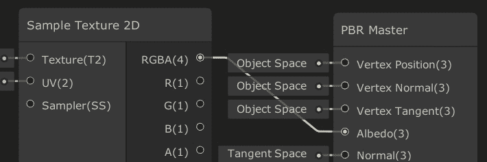

图 6.31 连接纹理采样的结果与主节点的反照率引脚

1.  单击 Shader Graph 编辑器左上角的**保存资源**按钮，查看场景视图中的更改：

图 6.32 应用纹理在我们的着色器图中的结果

如你所见，纹理已经正确应用到了模型，但是如果考虑到默认平面的大小是 10x10 米，水波似乎太大了，所以让我们平铺纹理！为此，我们需要改变模型的 UV，使它们变大。更大的 UV 听起来意味着纹理也应该变大，但要考虑到我们并没有使物体变大；我们只是修改了 UV，所以相同的物体大小将读取更多的纹理，这意味着更大的纹理采样区域将使纹理重复，并将它们放在相同的物体大小内，因此将被压缩在模型区域内。为此，请按照以下步骤进行：

1.  右键单击任何空白区域，然后单击**新建节点**来搜索 UV 节点：

图 6.33 寻找 UV 节点

1.  使用相同的方法创建一个**乘以**节点。

1.  设置`4`,`4`,`4`,`4`):

图 6.34 将 UV 乘以 4

1.  将 UV 节点的**Out**引脚拖动到**乘以**节点的**A**引脚上连接它们。

1.  将**乘以**节点的**Out**引脚拖动到**采样纹理 2D**节点的**UV**引脚上连接它们：

图 6.35 使用乘以后的 UV 来采样纹理

1.  如果你保存了图表并返回到场景视图，你会看到现在涟漪变小了，因为我们已经平铺了模型的 UV。你还可以在**采样纹理 2D**节点的预览中看到：

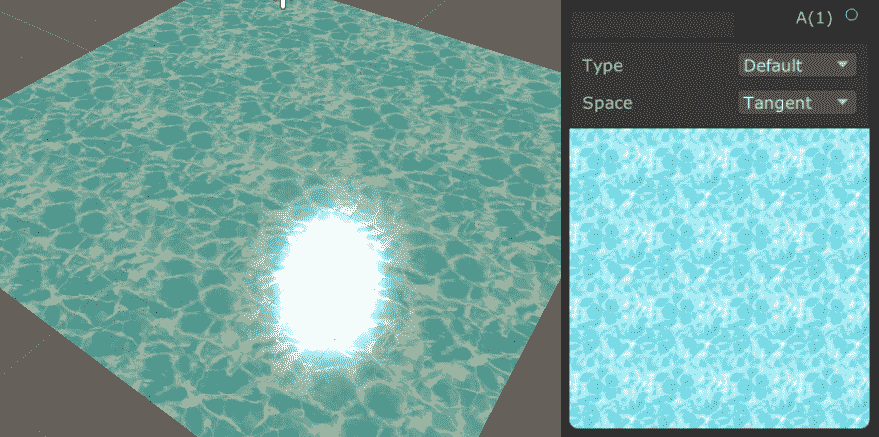

图 6.36 模型 UV 乘法的结果

现在我们可以做另一个有趣的效果，就是对纹理应用偏移来移动它。即使平面实际上并没有移动，我们也会通过移动纹理来模拟水流动，只是移动纹理。记住，确定纹理的哪一部分应用到模型的哪一部分的责任属于 UV，所以如果我们给 UV 坐标添加值，我们将移动它们，产生纹理滑动效果。为此，让我们按照以下步骤进行：

1.  在**乘以**节点的右侧创建一个**Add**节点。

1.  将 UV 的**Out**引脚连接到**Add**节点的**A**引脚：

图 6.37 给 UV 添加值

1.  在**Add**节点的左侧创建一个**Time**节点。

1.  将**Time**节点连接到**Add**节点的**B**引脚：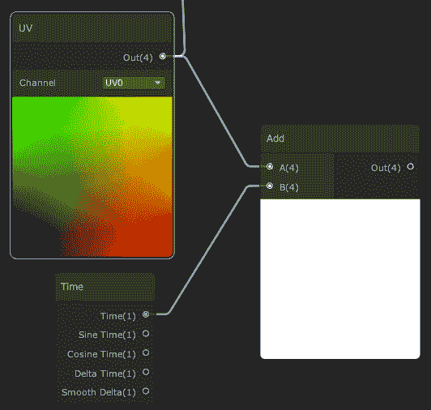

图 6.38 给 UV 添加时间

1.  将**Add**节点的**Out**引脚连接到**乘以**节点的**A**输入引脚：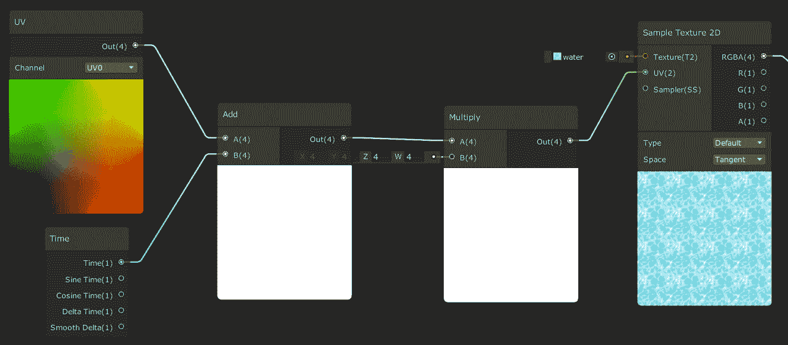

图 6.39 添加和乘以 UV 作为采样纹理的输入

1.  保存并在场景视图中看到水流动。

1.  如果你觉得水流动得太快，尝试使用乘法节点使时间变小。我建议你在查看下一个屏幕截图之前自己尝试一下，那里有答案：

图 6.40 时间乘法以加快移动速度

1.  如果你觉得图表开始变得更大，尝试通过点击预览上出现的上箭头来隐藏一些节点的预览：

图 6.41 隐藏图表节点的预览和未使用的引脚

因此，简而言之，首先我们将时间添加到 UV 中以移动它，然后将移动后的 UV 的结果乘以使其变大以平铺纹理。值得一提的是，有一个平铺和偏移节点可以为我们完成所有这些工作，但我想向您展示一个简单的乘法来缩放 UV 和一个加法操作来移动它是如何产生一个不错的效果的；您无法想象使用其他简单数学节点可以实现的所有可能效果！实际上，让我们在下一节中探索数学节点的其他用途，以组合纹理。

# 组合纹理

尽管我们使用了节点，但我们并没有创建任何不能使用常规着色器创建的东西，但这将发生改变。到目前为止，我们可以看到水在移动，但它看起来仍然是静态的，这是因为涟漪总是相同的。我们有几种生成涟漪的技术，最简单的一种是将两个以不同方向移动的水纹理组合在一起以混合它们的涟漪，实际上，我们可以简单地使用相同的纹理，只是翻转了一下，以节省一些内存。为了组合这些纹理，我们将它们相加，然后除以 2，所以基本上，我们正在计算纹理的平均值！让我们通过以下方式来做到这一点:

1.  选择**时间**和**采样器 2D**之间的所有节点（包括它们），通过单击图表中的任何空白处创建一个选择矩形，按住并拖动单击，然后在所有目标节点都被覆盖时释放: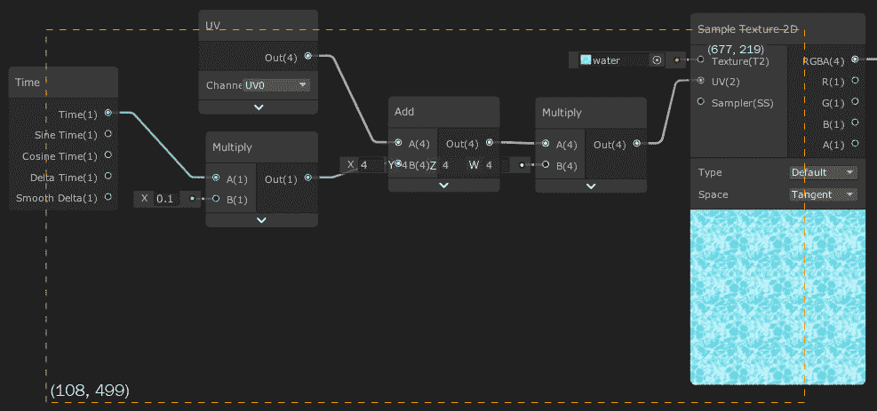

图 6.42 选择多个节点

1.  右键单击并选择**复制**，然后再次右键单击并选择**粘贴**，或使用经典的*Ctrl* + *C*，*Ctrl* + *V*命令（Mac 中为*command* + *C*，*command* + *V*），或只需*Ctrl* + *D*（*command* + *D*）。

1.  将复制的节点移动到原始节点下方:

图 6.43 节点的复制

1.  对于复制的节点，设置为`-4`,`-4`,`-4`,`-4`)。您可以看到纹理已经翻转了。

1.  还要设置为`-0.1`:

图 6.44 值的乘法

1.  在两个采样器纹理 2D 节点的右侧创建一个**加法**节点，并将这些节点的输出连接到**加法**节点的**A**和**B**输入引脚: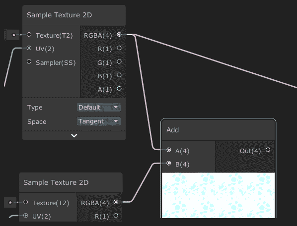

图 6.45 添加两个纹理

1.  您可以看到，由于我们对两种纹理的强度进行了求和，所以得到的组合太亮了，让我们通过乘以`0.5,0.5,0.5,0.5`来修复这个问题，这将把每个结果颜色通道除以 2，从而平均颜色:

图 6.46 将两个纹理的总和除以得到平均值

1.  将**乘法**节点的**输出**引脚连接到主节点的**反照率**引脚，以将所有这些计算应用为对象的颜色。

1.  保存**资产**并在场景视图中查看结果:

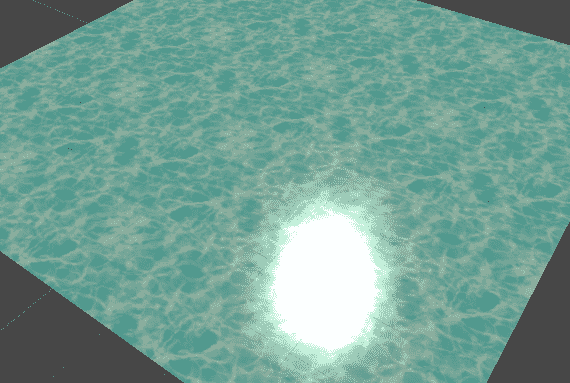

图 6.47 纹理混合的结果

您可以继续添加节点以使效果更加多样化，例如使用正弦节点应用非线性运动等，但我会让您自己通过实验来学习。现在，我们就到这里。一如既往，这个主题值得一本完整的书，本章的目的是让您对这个强大的 Unity 工具有一个初步了解。我建议您在互联网上寻找其他 Shader Graph 示例，以了解相同节点的其他用法，当然还有新节点。需要考虑的一件事是，我们刚刚做的一切基本上都应用于我们之前讨论的 Shader Pipeline 的片段着色器阶段。现在，让我们使用混合着色器阶段为水应用一些透明度。

# 应用透明度

在宣布我们的效果完成之前，我们可以做一个小小的添加，让水变得稍微透明一点。记住，Shader Pipeline 有一个混合阶段，负责将我们模型的每个像素混合到当前帧渲染的图像中。我们的 Shader Graph 的想法是修改这个阶段，应用 Alpha 混合，根据我们模型的 Alpha 值将我们的模型与先前渲染的模型进行混合。为了实现这个效果，执行以下步骤：

1.  点击主节点右上角的轮子。

1.  将**表面属性**设置为**透明**。

1.  如果**Blend**属性不是 Alpha，请将其设置为**Alpha**：

图 6.48 PBR 主节点设置

1.  将`0.5`设置为：

图 6.49 设置主节点的 Alpha

1.  保存图表，查看透明度在场景视图中的应用。如果你看不到效果，只需在水中放一个立方体，使效果更加明显：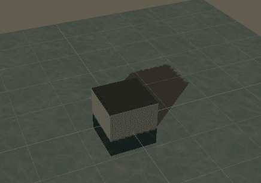

图 6.50 水的阴影应用到立方体上

1.  你可以看到水投射在我们立方体上的阴影。这是因为 Unity 没有检测到对象是透明的，所以它认为必须投射阴影，所以让我们禁用它们。点击水平面，在检视器中查找 Mesh Renderer 组件。

1.  在**照明**部分，将**投射阴影**设置为**关闭**；这将禁用平面的阴影投射：

图 6.51 禁用投射阴影

添加透明度是一个简单的过程，但也有其注意事项，比如阴影问题，在更复杂的场景中可能会有其他问题，所以我建议除非必要，否则避免使用透明度。实际上，我们的水可以不透明，特别是当我们将这种水应用到基地周围的河盆时，因为我们不需要看到水下的东西，但是我希望你知道所有的选择。在下一个截图中，你可以看到我们在基地下方放了一个巨大的平面，足够大以覆盖整个盆地：

图 6.52 在主场景中使用我们的水

# 总结

在本章中，我们讨论了 Shader 如何利用 GPU 工作，以及如何创建我们的第一个简单 Shader 来实现一个漂亮的水效果。使用 Shader 是一项复杂而有趣的工作，在团队中通常有一名或多名负责创建所有这些效果的人，这个职位被称为技术艺术家；所以，你可以看到，这个话题可以扩展成一个完整的职业。请记住，本书的目的是让你对行业中可能承担的各种角色有一点点了解，所以如果你真的喜欢这个角色，我建议你开始阅读专门讨论 Shader 的书籍。你面前有一条漫长但非常有趣的道路。

但现在先不谈 Shader 了，让我们转到下一个话题，讨论如何通过粒子系统改善图形并创建视觉效果！
