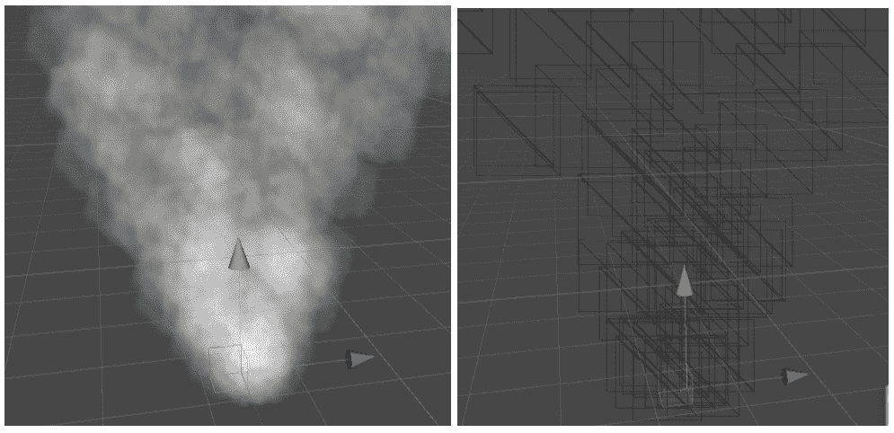
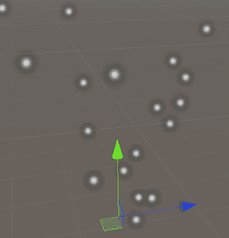
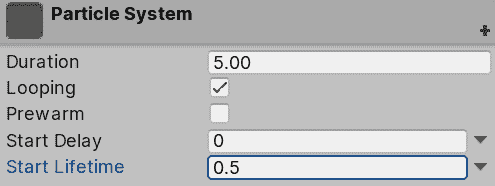
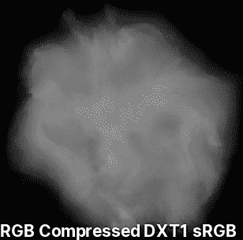
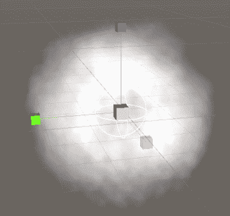
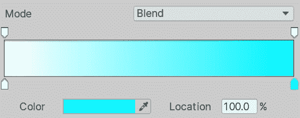
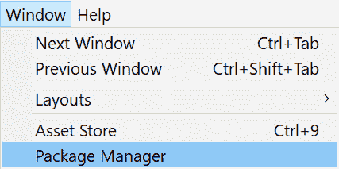
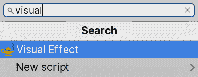

# 第七章：使用粒子系统和 VFX 图进行视觉效果

在这里，我们将继续学习关于我们游戏的视觉效果。我们将讨论粒子系统，一种模拟火、瀑布、烟雾和各种流体的方法。此外，我们将看到两种 Unity 粒子系统来创建这些效果，**Shuriken**和**VFX Graph**，后者比前者更强大，但需要更多的硬件。

在本章中，我们将讨论以下与粒子相关的概念：

+   粒子系统简介

+   创建流体模拟

+   使用 VFX 图创建复杂模拟

# 粒子系统简介

到目前为止，我们创建的所有图形和效果都使用静态网格，即无法扭曲、弯曲或以任何方式变形的 3D 模型。火和烟等**流体**显然不能用这种网格来表示，但实际上，我们可以通过静态网格的组合来模拟这些效果，这就是粒子系统有用的地方。

**粒子系统**是发射和动画大量**粒子**或**广告牌**的对象，这些广告牌是朝向摄像机的简单四边形网格。每个粒子都是一个静态网格，但渲染、动画和组合大量粒子可以产生流体的错觉。在下图中，您可以在左侧看到使用粒子系统的烟雾效果，右侧是相同粒子的**线框**视图。在那里，您可以看到创建烟雾错觉的四边形，这是通过将烟雾纹理应用到每个粒子并使它们在底部生成并朝着随机方向移动来实现的：

图 7.1-左侧，烟雾粒子系统；右侧，相同系统的线框图

在本节中，我们将涵盖与粒子相关的以下概念：

+   创建基本粒子系统

+   使用高级模块

让我们开始讨论如何创建我们的第一个粒子系统。

## 创建基本粒子系统

为了说明粒子系统的创建，让我们创建一个爆炸效果。想法是一次产生大量粒子并将它们朝各个方向扩散。让我们开始创建粒子系统并配置它提供的基本设置以更改其默认行为。为此，请按照以下步骤操作：

1.  选择**GameObject** | **Effects** | **Particle System**选项：

图 7.2-粒子系统创建按钮

1.  您应该在以下截图中看到效果。默认行为是一列粒子向上移动，就像之前显示的烟雾效果一样。让我们改变一下：

图 7.3-默认粒子系统外观

1.  单击场景中创建的对象，查看检查器。

1.  通过单击标题打开**形状**部分。

1.  将**形状**属性更改为**球体**。现在粒子应该在所有可能的方向上移动，而不是遵循默认的锥形：

图 7.4-形状属性

1.  在粒子系统`10`中。这将使粒子移动得更快。

1.  在相同的模块中，设置`0.5`。这指定了粒子的寿命。在这种情况下，我们给了半秒的寿命。结合速度（每秒 10 米），这使得粒子在移动 5 米后消失：

图 7.5-主粒子系统模块

1.  打开`0`。这个属性指定每秒将发射多少粒子，但对于爆炸，实际上我们需要一团粒子，所以在这种情况下我们不会持续不断地发射粒子。

1.  在`100`中：

图 7.6-发射模块

1.  在主模块（标题为`1`）中取消选中**循环**。在我们的情况下，爆炸不会不断重复；我们只需要一个爆炸：

图 7.7 – 循环复选框

1.  现在粒子不再循环，您需要手动点击**粒子效果**窗口右下角的**播放**按钮来查看系统：

图 7.8 – 粒子系统播放控件

1.  将**停止动作**设置为**销毁**。当**持续时间**过去时，这将销毁对象。这只在游戏运行时有效，因此您可以在编辑场景时安全地使用此配置：

图 7.9 – 停止动作设置为销毁

1.  设置`3`。这将使粒子变大，看起来更密集：

图 7.10 – 粒子系统开始大小

1.  单击主模块的**开始旋转**属性右侧的向下箭头，并选择**两个常数之间的随机值**。

1.  在上一步骤之后出现的两个输入值中设置`0`和`360`。这样可以使粒子在生成时具有随机旋转，使它们看起来略有不同：

图 7.11 – 随机开始旋转

1.  现在粒子的行为符合预期，但外观不符合预期。让我们改变一下。通过点击`爆炸`创建一个新材质。

1.  将其着色器设置为`Universal Render Pipeline/Particles/Unlit`。这是一种特殊的着色器，用于将纹理应用到 Shuriken 粒子系统：

图 7.12 – 粒子系统材质着色器

1.  从互联网或**资产商店**下载烟雾粒子纹理。在这种情况下，重要的是下载带有黑色背景的纹理；忽略其他的：

图 7.13 – 烟雾粒子纹理

1.  将此纹理设置为材质的**基本贴图**。

1.  将**表面类型**设置为**透明**，**混合模式**设置为**加法**。这样做将使粒子相互混合，而不是相互绘制，以模拟一大团烟雾而不是单个烟雾。我们使用**加法**模式，因为我们的纹理有黑色背景，而且我们想要创建一种光照效果（爆炸会照亮场景）：

图 7.14 – 粒子的表面选项

1.  将您的材质拖到**渲染器**模块的**材质**属性中：

图 7.15 – 粒子材质设置

1.  现在您的系统应该是这样的：

图 7.16 – 前面设置的结果

在前面的步骤中，我们已经改变了粒子或广告牌的生成方式（使用发射模块），它们将朝向哪个方向移动（使用形状模块），它们将以多快的速度移动，它们将持续多久，它们将有多大（使用主模块），以及它们将看起来像什么（使用渲染器模块）。创建粒子系统就是正确配置它们不同设置的简单情况。当然，正确地做这件事本身就是一门艺术；它需要创造力和对如何使用它们提供的所有设置和配置的知识。因此，为了增加我们的配置工具箱，让我们讨论一些高级模块。

## 使用高级模块

我们的系统看起来不错，但我们可以大大改进它，所以让我们启用一些新模块来提高其质量：

1.  点击**颜色随生命周期**模块左侧的复选框以启用它：

图 7.17 - 启用颜色随生命周期模块

1.  通过点击标题打开模块，并点击**颜色**属性右侧的白色条。这将打开渐变编辑器。

1.  点击白色标记栏的左上方略微向右侧，创建一个新的标记。同时，点击白色标记的右上方略微向左侧，创建第四个标记。这些标记将允许我们在粒子生命周期中指定透明度：

图 7.18 - 颜色随生命周期渐变编辑器

1.  如果创建了不需要的标记，只需将它们拖到窗口外即可删除。

1.  点击左上角的标记（不是我们创建的那个，而是已经存在的那个）并设置为`0`。对右上角的标记也做同样的操作，如下图所示。现在你应该看到粒子在爆炸结束时淡出而不是突然消失：

图 7.19 - 渐变淡入和淡出

1.  通过点击其复选框启用**限制生命周期内的速度**模块。

1.  设置为`0.1`。这将使粒子慢慢停止而不是继续移动：

图 7.20 - 减弱速度以使粒子停止

1.  启用`-90`和`90`。记住，你应该通过点击属性右侧的向下箭头来设置**两个常数之间的随机值**。现在粒子在它们的生命周期中应该稍微旋转，以模拟更多的运动：

图 7.21 - 随机旋转速度

正如你所看到的，有许多额外的模块可以启用和禁用，以在现有模块之上添加行为层，因此，再次创造性地使用它们来创建各种效果。记住，你可以创建这些系统的预制件，以在整个场景中复制它们。我还建议在资产商店搜索和下载粒子效果，看看其他人如何使用相同的系统来创建惊人的效果。这是学习如何创建它们的最佳方式，看到各种不同的系统，这实际上也是我们将在下一节中要做的事情，创建更多的系统！

# 创建流体模拟

正如我们所说，学习如何创建粒子系统的最佳方式是继续寻找已经创建的粒子系统，并探索人们如何使用各种系统设置来创建完全不同的模拟。

在本节中，我们将看到如何使用粒子系统创建以下效果：

+   瀑布效果

+   篝火效果

让我们从最简单的瀑布效果开始。

## 创建瀑布效果

为了做到这一点，请按照以下步骤进行：

1.  创建一个新的粒子系统（**GameObject** | **Effects** | **Particle System**）。

1.  将**形状**设置为**边缘**，并将**半径**设置为**5**在**形状**模块中。这将使粒子沿着一个发射线产生：

图 7.22 - 边缘形状

1.  设置为`50`。

1.  设置为`3`和`3`：

图 7.23 - 主模块设置

1.  设置为`0.5`。这将使粒子下落：

图 7.24 - 主模块中的重力修饰器

1.  使用我们之前为这个系统创建的`爆炸`材质：

图 7.25 - 爆炸粒子材质

1.  启用**颜色随生命周期**并打开**渐变**编辑器。

1.  单击右下角的标记，这次你应该看到一个颜色选择器，而不是一个透明度滑块。顶部的标记允许您随时间改变透明度，而底部的标记则随时间改变粒子的颜色。在这个标记中设置浅蓝色：

图 7.26 – 从白色到浅蓝色的渐变

作为挑战，我建议您在这个结束的地方添加一个小的粒子系统，以创建一些水花，模拟水与湖底碰撞。现在我们可以将这个粒子系统添加到我们场景中的一个山丘上进行装饰，就像下面的截图一样。我已经调整了系统，使其在这种情况下看起来更好。我挑战你自己调整它，使它看起来像这样：

图 7.27 – 应用到我们当前场景中的瀑布粒子系统

现在，让我们创建另一个效果，一个篝火。

## 创建篝火效果

为了创建它，做以下操作：

1.  创建一个粒子系统。

1.  在互联网或资产商店上寻找**火焰粒子纹理表**纹理。这种纹理应该看起来像一个不同火焰纹理的网格。想法是将火焰动画应用到我们的粒子上，交换所有这些小纹理：

图 7.28 – 粒子纹理精灵表

1.  创建一个粒子材质，并将此纹理设置为**基本贴图**。将**基本贴图**右侧的颜色设置为白色。然后将此材质设置为粒子材质。记得将**表面类型**设置为**透明**，**混合模式**设置为**叠加**：

图 7.29 – 带有粒子精灵表的材质

1.  在**Y**中启用`4`中的`4`。之后，您应该看到粒子交换纹理：

图 7.30 – 启用纹理表动画

1.  在主模块中设置`0`和`1.5`。

1.  在**形状**中设置`0.5`。

1.  创建第二个粒子系统，并将其设置为火系统的子对象：

图 7.31 – 粒子系统的父子关系

1.  应用爆炸示例中的烟雾材质。

1.  在**形状**中设置`0`和`0.5`。

1.  系统应该看起来像这样：

图 7.32 – 结合火和烟粒子系统的结果

正如您所看到的，您可以组合多个粒子系统来创建单个效果。在这样做时要小心，因为很容易发射太多的粒子并影响游戏的性能。粒子并不便宜，如果不小心使用，可能会导致游戏的**FPS（每秒帧数）**下降。

到目前为止，我们已经探索了 Unity 系统中的一个用于创建这种效果的系统，虽然这个系统对于大多数情况来说已经足够了，但 Unity 最近发布了一个新的系统，可以生成更复杂的效果，称为**VFX Graph**。让我们看看如何使用它，以及它与 Shuriken 有何不同。

# 使用 VFX Graph 创建复杂的模拟

到目前为止，我们使用的粒子系统称为 Shuriken，它在 CPU 中处理所有计算。这既有优点也有缺点。优点是它可以在 Unity 支持的所有设备上运行，而不受它们的能力限制（它们都有 CPU），但缺点是如果我们不小心发射太多粒子，很容易超出 CPU 的能力。现代游戏需要更复杂的粒子系统来生成可信的效果，而这种基于 CPU 的粒子系统解决方案已经开始达到极限。这就是 VFX Graph 的用武之地：

图 7.33 – 左侧是一个大型粒子系统，右侧是 VFX 图的示例

**VFX 图（视觉效果图）**是基于 GPU 的粒子系统解决方案，这意味着系统在视频卡上执行，而不是在 CPU 上执行。这是因为视频卡在执行许多小模拟方面要高效得多，就像系统的每个粒子所需的模拟一样，因此我们可以使用 GPU 比使用 CPU 实现更高数量级的粒子。这里的缺点是我们需要一个具有**计算着色器**功能的相当现代的 GPU 来支持此系统，因此我们将使用此系统排除某些目标平台（忘记大多数手机），因此只有在您的目标平台支持它时才使用它（中高端 PC、游戏机和一些高端手机）。

在本节中，我们将讨论 VFX 图的以下概念：

+   安装 VFX 图

+   创建和分析 VFX 图

+   创建雨效果

让我们开始看看如何在我们的项目中添加对 VFX 图的支持。

## 安装 VFX 图

到目前为止，我们已经使用了许多 Unity 功能，这些功能已经安装在我们的项目中，但是 Unity 可以通过各种官方和第三方插件进行扩展。VFX 图是其中之一，如果您使用**通用渲染管线（URP）**，则需要单独安装该功能。我们可以使用包管理器来完成这一点，包管理器是一个专门用于管理官方 Unity 插件的 Unity 窗口。

在安装这些软件包时需要考虑的一点是，每个软件包或插件都有自己的版本，与 Unity 版本无关。这意味着您可以安装 Unity 2020.1，但 VFX 图可以是 7.1.5 或 7.1.2 或任何您想要的版本，并且您实际上可以将软件包更新到新版本，而无需升级 Unity。这很重要，因为这些软件包的某些版本需要 Unity 的最低版本。此外，某些软件包依赖于其他软件包，实际上是这些软件包的特定版本，因此我们需要确保我们拥有每个软件包的正确版本以确保兼容性。需要明确的是，软件包的依赖关系会自动安装，但有时我们可以单独安装它们，因此在这种情况下，我们需要检查所需的版本。听起来很复杂，但实际上比听起来简单。

在撰写本书时，我正在使用 VFX 图版本 8.2.0，与 URP 相同的版本。是的，URP 是另一个您需要使用包管理器安装的功能，但是由于我们使用了 URP 模板创建项目，它已经为我们安装好了。关于版本，一个建议：在制作游戏期间，除非确有必要，否则永远不要更新 Unity 版本或软件包版本。升级通常会带来许多兼容性版本，这意味着在升级后，您的游戏的某些部分可能需要修复以符合这些软件包的新版本的工作方式。此外，请考虑一些软件包具有已验证标签，这意味着它已在我们的 Unity 版本中进行了测试，因此建议使用它。

现在，让我们按照以下步骤安装 VFX 图：

1.  在 Unity 的顶部菜单中，转到**窗口** | **包管理器**：

图 7.34 – 包管理器位置

1.  在窗口左侧查找**视觉效果图**软件包。确保选择 8.2.0 或更高版本：

图 7.35 – 视觉效果图软件包

1.  点击窗口右下角的**安装**按钮，等待软件包安装：

图 7.36 – 安装软件包按钮

1.  建议在安装包后重新启动 Unity，所以保存你的更改并重新启动 Unity。

现在我们已经安装了 VFX 图形，让我们使用它来创建我们的第一个粒子系统。

## 创建和分析 VFX 图形

使用 VFX 图形创建粒子系统的理念与常规粒子系统类似。我们将链接和配置模块作为粒子行为的一部分，每个模块都添加一些特定的行为，但我们的做法与 Shuriken 有很大不同。首先，我们需要创建一个**视觉效果图形**，这是一个包含所有模块和配置的资产，然后让一个游戏对象播放这个图形。让我们按照以下步骤来做：

1.  在项目窗口中，点击**+**按钮，查找**视觉效果** | **视觉效果图形**：

图 7.37 - 视觉效果图形

1.  使用**游戏对象** | **创建空**选项创建一个空游戏对象：

图 7.38 - 创建空游戏对象

1.  选择创建的对象并查看检查器。

1.  使用**添加组件**搜索栏，查找**可视效果**组件并点击它以将其添加到对象中：

图 7.39 - 向视觉效果图形添加组件

1.  将我们创建的 VFX 资产拖到我们游戏对象的**可视效果**组件的**资产模板**属性中：

图 7.40 - 使用先前创建的 VFX 资产的可视效果

1.  你应该看到时钟粒子从我们的对象中发射出来：

图 7.41 - 默认 VFX 资产结果

现在我们有了一个基本效果，让我们创建一些需要大量粒子的东西，比如密集的雨。在这样做之前，让我们探索一些 VFX 图形的核心概念。如果你双击可视效果资产，你会看到以下编辑器：

图 7.42 - 可视效果图形编辑器窗口

这个窗口由几个相互连接的节点组成，生成要执行的操作流。起初，它似乎类似于着色器图，但它的工作方式有点不同，所以让我们研究一下默认图的每个部分。

要探索的第一个区域是包含三个节点的虚线区域。这就是 Unity 所谓的**系统**。系统是一组定义粒子行为的节点，你可以有任意多个，这相当于有几个粒子系统对象。每个系统由**上下文**组成，即虚线区域内的节点，在这种情况下，我们有**初始化粒子**、**更新粒子**和**输出粒子四边形**。每个上下文代表粒子系统逻辑流的不同阶段，所以让我们定义一下我们图中的每个上下文做什么：

+   **初始化粒子**：这定义了每个发射粒子的初始数据，如位置、颜色、速度和大小。这类似于本章开头看到的粒子系统的主模块中的起始属性。这个节点中的逻辑只有在发射新粒子时才会执行。

+   **更新粒子**：在这里，我们可以对活动粒子的数据应用修改。我们可以改变粒子数据，比如当前速度或大小，所有帧都可以。这类似于先前粒子系统的随时间节点。

+   **输出粒子四边形**：这个上下文将在需要渲染粒子时执行。它将读取粒子数据，看到在哪里渲染，如何渲染，使用哪个纹理和颜色，以及不同的视觉设置。这类似于先前粒子系统的渲染器模块。

除了一些基本配置外，我们可以在每个上下文中添加**块**。每个块都是在上下文中执行的操作。我们有一些可以在任何上下文中执行的操作，然后是一些特定的上下文操作。例如，我们可以在初始化粒子上下文中使用添加位置块来移动初始粒子位置，但如果我们在更新粒子上下文中使用相同的块，它将不断地移动粒子。因此，上下文是粒子生命周期中发生的不同情况，而块是在这些情况下执行的操作：

图 7.43 – 在初始化粒子上下文中的设置速度随机块。这将设置粒子的初始速度

此外，我们可以有**独立上下文**，即系统之外的上下文，例如**生成**。这个上下文负责告诉系统需要创建一个新粒子。我们可以添加块来指定上下文何时告诉系统创建粒子，例如在固定时间内以固定速率、突发等。生成将根据其块创建粒子，而系统负责根据我们在每个上下文中设置的块来初始化、更新和渲染每个粒子。

因此，我们可以看到与 Shuriken 有很多相似之处，但在这里创建系统的方式是完全不同的。让我们通过创建一个雨效果来加强这一点，这将需要大量粒子，这是 VFX 图形的一个很好的使用案例。

## 创建雨效果

为了创建这种效果，执行以下操作：

1.  设置`10000`：

图 7.44 – 初始化粒子上下文

1.  设置`10000`：

图 7.45 – 常量生成率块

1.  在**初始化粒子**上下文中的**设置速度随机块**中分别设置`0`，`-50`，`0`）和（`0`，`-75`，`0`）。这将为我们的粒子设置一个指向下方的随机速度：

图 7.46 – 设置速度随机块

1.  单击**初始化粒子**标题以选择上下文，一旦突出显示，按空格键显示**添加块**窗口。

1.  搜索**设置位置随机**块并单击它：

图 7.47 – 添加块

1.  将`-50`，`0`，`-50`）和（`50`，`0`，`50`）分别设置。这将定义一个初始区域，以在其中随机生成粒子。

1.  单击`0`，`-12.5`，`0`）和（`100`，`25`，`100`）左侧的箭头。这将定义粒子应该存在的区域。粒子实际上可以移出这个区域，但这对系统正常工作很重要（在互联网上搜索`视锥体剔除`以获取更多信息）。

1.  选择执行系统的 GameObject，并在场景视图的右下窗口中选中**显示边界**复选框，以查看先前定义的边界：

图 7.48 – 视觉效果播放控制

1.  将对象位置设置为覆盖整个基础区域。在我的案例中，位置是（`100`，`37`，`100`）。请记住，您需要更改**变换**组件的**位置**：

图 7.49 – 设置变换位置

1.  设置`0.5`。这将使粒子的寿命更短，确保它们始终在边界内：

图 7.50 – 设置寿命随机块

1.  将**输出粒子四边形**上下文的**主纹理**属性更改为另一个纹理。在这种情况下，之前下载的烟雾纹理可以在这里使用，即使它不是水，因为我们将在一会儿修改它的外观。另外，如果你愿意，你也可以尝试下载水滴纹理:

图 7.51 - VFX 图主纹理

1.  将**输出粒子四边形**上下文的**混合模式**设置为**附加**：

图 7.52 - VFX 图的附加模式

1.  如果你看不到最后的更改被应用，点击窗口左上角的**编译**按钮。另外，你可以使用*Ctrl* + *S*（Mac 上为*Command* + *S*）保存你的更改:

图 7.53 - VFX 资产保存控制

1.  现在我们需要稍微拉伸我们的粒子，使其看起来像真正的雨滴而不是下落的球。为此，首先我们需要改变粒子的方向，使它们不总是指向摄像机。为了做到这一点，右键单击**输出粒子四边形**上下文中的**定向块**，然后选择**删除**（或在 PC 上按*Delete*，在 Mac 上按*Command* + *Backspace*）:

图 7.54 - 删除块

1.  我们想根据它们的速度方向拉伸我们的粒子。为此，选择**输出粒子四边形**上下文的标题，然后按空格键查找要添加的块。在这种情况下，我们需要搜索**沿速度定向**块。

1.  添加`0.25`，`1.5`，`0.25`)。这将拉伸粒子，使其看起来像落下的水滴:

图 7.55 - 设置比例块

1.  再次点击窗口左上角的**编译**按钮，以查看更改。你的系统应该看起来像这样：

图 7.56 - 雨结果

从这里开始，你可以根据自己的意愿向上下文中添加和删除块进行实验，我再次建议你寻找已经创建的视觉效果图，以找到其他系统的创意。实际上，你可以通过查看 Shuriken 中制作的效果并使用类似的块来获得 VFX 图的创意。另外，我建议你查看 VFX 图文档[`docs.unity3d.com/Packages/com.unity.visualeffectgraph@7.1/manual/index.html`](https://docs.unity3d.com/Packages/com.unity.visualeffectgraph@7.1/manual/index.html)以了解更多关于这个系统的信息。

# 总结

在本章中，我们讨论了使用 Shuriken 和 VFX 图创建粒子系统的两种不同方法。我们用它们来模拟不同的流体现象，如火、瀑布、烟雾和雨。这个想法是将粒子系统与网格相结合，生成场景所需的所有可能道具。另外，正如你可以想象的，专业地创建这些效果需要你深入了解。如果你想专注于这一点（技术艺术家的另一部分工作），你需要学会如何创建自己的粒子纹理，以获得你想要的精确外观和感觉，编写控制系统某些方面的代码脚本，以及粒子创建的其他几个方面。再次强调，这超出了本书的范围。

现在我们的场景中有了一些雨，我们可以看到天空和场景中的光线并不真正反映出雨天，所以让我们在下一章中解决这个问题！
