# 第八章：使用通用渲染管线进行照明

**照明**是一个复杂的主题，有几种可能的处理方式，每种方式都有其优缺点。为了在最佳性能下获得最佳质量，您需要确切了解您的渲染器如何处理它，这正是我们将在本章中要做的。我们将讨论 Unity 的**通用渲染管线**（**URP**）中如何处理照明，以及如何正确配置它以适应我们场景的氛围和适当的照明效果。

在本章中，我们将研究以下照明概念：

+   应用照明

+   应用阴影

+   优化照明

# 应用照明

在讨论游戏中处理照明的方式时，我们可以使用两种主要方式，称为**前向渲染**和**延迟渲染**。两者以不同的顺序处理照明，具有不同的技术、要求、优缺点。前向渲染通常推荐用于性能，而延迟渲染通常推荐用于质量。后者被 Unity 的**高清晰度渲染管线**使用，这是用于高端设备高质量图形的渲染器。在撰写本书时，Unity 正在为 URP 开发一个高性能版本。此外，在 Unity 中，前向渲染有两种类型：**多通道前向**，用于内置渲染器（旧的 Unity 渲染器），以及**单通道前向**，用于 URP。同样，每种方法都有其优缺点。

重要信息

实际上，还有其他可用的选项，包括官方和第三方的选项，比如**顶点光照**，但暂时我们将专注于三种主要的选项 - 您 95%的时间使用的选项。

选择其中一种取决于您正在创建的游戏类型以及您需要在哪个目标平台上运行游戏。由于您应用照明到场景的方式，您选择的选项将发生很大变化，因此您必须了解您正在处理的系统。

在本节中，我们将讨论以下实时照明概念：

+   讨论照明方法

+   使用天空盒配置环境光照

+   在 URP 中配置照明

让我们开始比较先前提到的照明方法。

## 讨论照明方法

总之，我们提到了三种主要的处理照明的方式：

+   前向渲染（单通道）

+   前向渲染（多通道）

+   延迟渲染

在我们讨论它们之间的差异之前，让我们谈谈它们共同的特点。这三种渲染器都通过确定相机可以看到哪些对象来开始绘制场景；也就是说，那些落在相机截锥体内的对象，并在选择相机时提供一个巨大的金字塔。

图 8.1 - 相机的截锥体只显示可以看到的对象

之后，Unity 将按照距离相机最近到最远的顺序对它们进行排序（透明对象处理方式略有不同，但暂时忽略）。这样做是因为更有可能靠近相机的对象将覆盖大部分相机，因此它们将遮挡其他对象，防止我们浪费资源计算被遮挡的像素。

最后，Unity 将尝试按照这个顺序渲染对象。这就是光照方法之间开始出现差异的地方，所以让我们开始比较这两种前向渲染变体。对于每个对象，单次渲染将在一个绘制调用中计算对象的外观，包括所有影响对象的光源，或者我们称之为**绘制调用**。绘制调用是 Unity 要求显卡实际渲染指定对象的确切时刻。之前的所有工作只是为了这一刻做准备。在多次渲染前向渲染器的情况下，简化一点实际逻辑，Unity 将为影响对象的每个光源渲染一次对象。因此，如果对象受到三个光源的照明，Unity 将渲染对象三次，这意味着将发出三个绘制调用，并将执行渲染过程的 GPU 进行三次调用：

.jpg)

图 8.2 – 左图，多次渲染中受两个光源影响的球体的第一个绘制调用；中间图，球体的第二个绘制调用；右图，两个绘制调用的组合

现在你可能在想，“为什么我要使用多次渲染？单次渲染更高效！”是的，你是对的！单次渲染比多次渲染更高效，这就是其中的好处。GPU 中的绘制调用有一定数量的操作可以执行，因此绘制调用的复杂度有限。计算对象的外观和所有影响它的光源是非常复杂的，为了使其适应一个绘制调用，单次渲染执行了简化版本的光照计算，这意味着光照质量和功能较少。它们还有一个限制，即一次只能处理多少个光源，目前写作本书时，每个对象的限制是八个（低端设备为四个）。这听起来像是一个小数字，但通常足够了。

另一方面，多次渲染可以应用任意数量的光源，并且可以为每个光源执行不同的逻辑。假设我们的物体受到四个光源的影响，但有两个光源对其影响很大，因为它们更近或强度更高，而其余的光源对物体的影响只是足够让人注意到。在这种情况下，我们可以使用更高质量的方式渲染前两个光源，而用廉价的计算渲染其余的光源——没有人能够察觉到区别。在这种情况下，多次渲染可以使用像素光照计算前两个光源，而使用顶点光照计算其余的光源。它们的区别在于它们的名称；像素光照按对象像素计算光照，而顶点光照按对象顶点计算光照，并填充这些顶点之间的像素，从而在顶点之间插值信息。您可以清楚地看到以下图像中的区别：

.jpg)

图 8.3 – 左图，使用顶点光照渲染的球体；右图，使用像素光照渲染的球体)

在单次渲染中，将所有内容都计算在一个绘制调用中会迫使你使用顶点光照或像素光照；你不能将它们结合起来。

因此，总结一下单通道和多通道之间的区别，在单通道中，性能更好，因为每个对象只绘制一次，但你只能应用有限数量的光照，而在多通道中，你需要多次渲染对象，但没有光照数量的限制，并且你可以为每个光源指定精确的质量。还有其他需要考虑的事情，比如绘制调用的实际成本（一个绘制调用可能比两个简单的绘制更昂贵），以及特殊的光照效果，比如卡通着色，但让我们保持简单。

最后，让我们简要讨论一下延迟渲染。尽管我们不打算使用它，但了解为什么我们不这样做是很有趣的。在确定哪些对象落在视锥体内并对它们进行排序之后，延迟将渲染对象而不进行任何光照，生成所谓的**G-Buffer**。G-Buffer 是一组包含有关场景对象的不同信息的图像，例如其像素的颜色（不带光照），每个像素的方向（称为**法线**），以及离摄像机的距离。你可以在以下图中看到 G-Buffer 的典型示例：

.jpg)

图 8.4 - 左图，对象的纯色；中图，每个像素的深度；右图，像素的法线

重要信息

法线是方向，方向的（X，Y，Z）分量被编码在颜色的 RGB 分量中。

在渲染场景中的所有对象之后，Unity 将迭代所有可以在相机中看到的光源，从而在 G-Buffer 上应用一层光照，从中获取信息来计算特定的光照。在所有光源都被处理之后，你将得到以下结果：

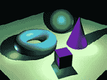

图 8.5 - 应用于上一图像中的 G-Buffer 的三种光的组合

正如你所看到的，这种方法的延迟部分来自于将照明计算作为渲染过程的最后阶段的想法。这样做更好，因为你不会浪费资源计算可能被遮挡的物体的照明。如果在前向渲染中首先渲染图像的底部，那么其余物体将遮挡的像素就是徒劳的计算。此外，延迟只计算光照能够到达的确切像素。例如，如果你使用手电筒，Unity 只会在手电筒锥体内的像素中计算光照。缺点是，一些相对较旧的显卡不支持延迟，而且你无法使用顶点光照质量来计算照明，因此你将需要付出像素光照的代价，这在低端设备上不被推荐（甚至在简单的图形游戏中也不需要）。

那么，为什么我们要使用 URP 和单通道前向渲染？因为它在性能、质量和简单性之间提供了最佳平衡。在这个游戏中，我们不会使用太多的光源，所以我们不会担心单通道的光源数量限制，而且我们也不会充分利用延迟的好处，所以使用更多的硬件来运行游戏是没有意义的。

现在我们对 URP 处理光照的基本概念有了一个非常基本的了解，让我们开始使用它吧！

## 配置天空盒的环境光照

有不同的光源可以影响场景，如太阳、火炬、灯泡等。这些被称为**直接光**；也就是说，发射光线的物体。然后，我们有**间接光**，通常代表直接光的反射。然而，如果要让游戏以至少 30 FPS（或者只是运行）运行，计算所有光线发射的所有光线的所有反射是不可能的。问题在于没有间接光会产生不真实的结果，因为我们当前的场景照明中，你可以观察到阳光无法到达的地方完全黑暗，因为没有光从其他阳光照射的地方反射过来：

图 8.6 – 没有环境光的山上投影的阴影

为了解决这个问题，我们可以使用这些反弹的近似值。这就是我们所说的**环境光**。这代表了通常根据天空的颜色施加一点点光的基础光照层，但你可以选择任何你想要的颜色。例如，在晴朗的夜晚，我们可以选择深蓝色来代表月光的色调。

默认情况下，Unity 不会从天空计算环境光，因此我们需要手动进行以下操作：

1.  在层次结构中选择地形，并在检查器的右上角取消选择“静态”。稍后我们会解释为什么要这样做：

图 8.7 – 层次结构中的地形

1.  点击**窗口** | **渲染** | **灯光设置**。这将打开**场景灯光设置**窗口：

图 8.8 – 灯光设置位置

1.  点击窗口底部的**生成灯光**按钮。如果到目前为止你还没有保存场景，会提示你保存，这是必要的：

图 8.9 – 生成灯光按钮

1.  查看 Unity 窗口右下角的进度计算栏，以检查进程何时完成：

图 8.10 – 灯光生成进度条

1.  现在你可以看到完全黑暗的区域现在有了一点光的效果：

图 8.11 – 带环境光的阴影

现在，通过这样做，我们有了更好的照明，但它看起来仍然像是一个晴天。记住，我们想要有雨天的天气。为了做到这一点，我们需要改变默认的天空，使其多云。你可以通过下载一个**天空盒**来实现。你可以在场景周围看到的当前天空只是一个包含每一面纹理的大立方体，这些纹理具有特殊的投影，以防止我们检测到立方体的边缘。我们可以为立方体的每一面下载六张图像并应用它们，以获得任何我们想要的天空，所以让我们这样做：

1.  你可以从任何你想要的地方下载天空盒纹理，但在这里，我会选择资产商店。通过**窗口** | **资产商店** 打开它，并转到资产商店网站。

1.  在右侧的类别列表中查找**2D** | **纹理和材质** | **天空**。请记住，如果看不到类别列表，需要扩大窗口宽度：

图 8.12 – 天空盒类别

1.  记得在**定价**部分勾选**免费资产**复选框：

图 8.13 – 免费资产过滤

1.  选择任何你喜欢的天空盒来模拟雨天。请注意，天空盒有不同的格式。我们使用的是六图格式，所以在下载之前要检查一下。在我的例子中，我选择了下图中显示的天空盒包。下载并导入它，就像我们在*第五章**，导入和整合资源*中所做的那样：

图 8.14 – 为本书选择的天空盒套装

1.  通过在**Project**窗口中使用**+**图标并选择**Material**来创建一个新的材质。

1.  将该材质的**Shader**选项设置为**Skybox/6 sided**。记住，天空盒只是一个立方体，所以我们可以应用一个材质来改变它的外观。天空盒着色器已经准备好应用这六个纹理。

1.  将六个纹理拖到材质的**Front**、**Back**、**Left**、**Right**、**Up**和**Down**属性中。这六个下载的纹理将有描述性的名称，这样你就知道哪些纹理应该放在哪里：

图 8.15 – 天空盒材质设置

1.  将材质直接拖到场景视图中的天空中。确保你不要把材质拖到一个物体上，因为材质会被应用到它上面。

1.  重复环境光计算的*步骤 1*到*4*（**Lighting Settings** | **Generate Lighting**）以根据新的天空盒重新计算。在下图中，你可以看到目前我的项目的结果：

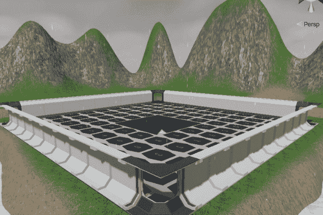

图 8.16 – 应用的天空盒

现在我们有了一个良好的基础光照层，我们可以开始添加光源对象了。

## 在 URP 中配置光照

我们可以在场景中添加三种主要类型的直射光：

+   **Directional Light**：这是代表太阳的光。这个对象会向着它所面对的方向发出光线，而不受位置的影响；太阳向右移动 100 米不会有太大的影响。举个例子，如果你慢慢旋转这个对象，你可以生成一个昼夜循环：

.jpg)

图 8.17 – 定向光结果

+   **点光源**：这种光代表了一个发射光线的灯泡，以全向方式发出光线。它对太阳的影响与太阳不同，因为它的位置很重要，因为它更接近。此外，因为它是一个较弱的光源，这种光的强度会根据距离而变化，所以它的效果有一个范围 – 距离光源越远，接收到的强度就越弱：

.jpg)

图 8.18 – 点光结果

+   **Spotlight**：这种光代表了光锥，就像手电筒发出的光一样。它的行为类似于点光源，其位置和方向很重要，光强度会随着一定距离的衰减：

.jpg)

图 8.19 – 聚光灯结果

到目前为止，我们有了一个不错的、多雨的环境光照，但是我们场景中唯一的直射光，定向光，看起来不像这样，所以让我们改变一下：

1.  在**Hierarchy**窗口中选择**Directional Light**对象，然后查看**Inspector**窗口。

1.  点击**Colour**属性以打开颜色选择器。

1.  选择深灰色来实现部分被云层遮挡的阳光。

1.  将**Shadow Type**设置为**No Shadows**。现在我们有了多云的天气，太阳不会投射清晰的阴影，但我们稍后会更多地讨论阴影：

图 8.20 – 没有阴影的柔和定向光

现在场景变暗了，我们可以添加一些灯光来照亮场景，如下所示：

1.  通过转到**GameObject** | **Light** | **Spotlight**创建一个聚光灯：

图 8.21 – 创建聚光灯

1.  选择它。然后，在`90`和`120`中，这将增加锥体的角度。

1.  设置为`50`，表示光可以达到 50 米，沿途衰减。

1.  设置为`1000`：

图 8.22 – 聚光灯设置

1.  将光源放在基座的一个角落，指向中心：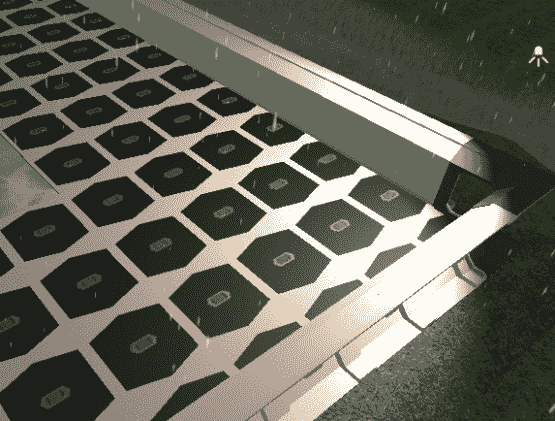

图 8.23 – 聚光灯放置

1.  通过选择光源并按下*Ctrl + D*（Mac 上为*command + D*）来复制该光源。

1.  将其放在基座的对角线上：

图 8.24 – 两个聚光灯的效果

你可以继续向场景中添加光源，但要注意不要走得太远——记住光源的限制。此外，你可以下载一些灯柱放在光源位置，以视觉上证明光的来源。现在我们已经实现了适当的照明，我们可以谈论阴影了。

# 应用阴影

也许你会认为我们的场景中已经有阴影了，但实际上并没有。物体的较暗区域，也就是不面向光源的区域，没有阴影——它们没有被照亮，这与阴影是完全不同的。在这种情况下，我们指的是从一个物体投射到另一个物体的阴影；例如，玩家在地板上投射的阴影，或者从山上到其他物体的阴影。阴影可以提高我们场景的质量，但计算成本也很高，因此我们有两个选择：不使用阴影（建议用于移动设备等低端设备）或根据我们的游戏和目标设备在性能和质量之间找到平衡。在第一种情况下，你可以跳过整个部分，但如果你想要实现高性能的阴影，尽可能地继续阅读。

在本节中，我们将讨论有关阴影的以下主题：

+   理解阴影计算

+   配置高性能阴影

让我们先讨论 Unity 如何计算阴影。

## 理解阴影计算

在游戏开发中，众所周知，阴影在性能方面是昂贵的，但为什么呢？当光线射到另一个物体后再到达物体时，物体会产生阴影。在这种情况下，该像素不会受到来自该光源的照明。问题在于，这与环境光模拟的光照存在相同的问题——计算所有可能的光线及其碰撞将成本过高。因此，我们需要一个近似值，这就是阴影贴图发挥作用的地方。

阴影贴图是从光的视角渲染的图像，但不是绘制带有所有颜色和光照计算的完整场景，而是以灰度渲染所有物体，其中黑色表示像素距离摄像机很远，白色表示像素距离摄像机较近。如果你仔细想一想，每个像素都包含了光线的碰撞信息。通过了解光的位置和方向，你可以使用阴影贴图计算出每个“光线”碰撞的位置。在下图中，你可以看到我们定向光的阴影贴图：

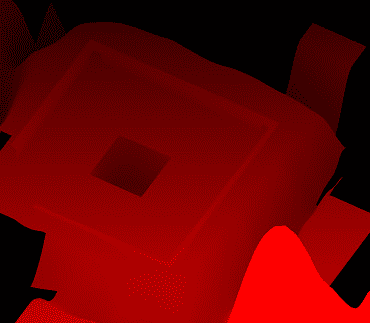

图 8.25 – 我们场景中定向光生成的阴影贴图

每种类型的光都会稍微不同地计算阴影贴图，尤其是点光源。由于它是全向的，它需要在所有方向（前、后、上、下、左、右）渲染场景多次，以收集关于它发射的所有光线的信息。不过，我们不会在这里详细讨论这个问题，因为我们可能会谈论一整天。

现在，这里需要强调的一点是，阴影图是纹理，因此它们有分辨率。分辨率越高，我们的阴影图计算的“光线”就越多。您可能想知道当低分辨率阴影图中只有少量光线时会是什么样子。看看下图，看看一个低分辨率阴影图是什么样子：

图 8.26 - 使用低分辨率阴影图渲染的硬阴影

问题在于光线数量较少会生成更大的阴影像素，导致像素化阴影。在这里，我们有第一个要考虑的配置：我们的阴影的理想分辨率是多少？您可能会诱惑地增加它，直到阴影看起来平滑，但当然，这将增加计算所需的时间，因此除非您的目标平台可以处理它（移动设备肯定不能），否则它将大大影响性能。在这里，我们可以使用**软阴影**技巧，在阴影上应用模糊效果以隐藏像素化的边缘，如下图所示：

图 8.27 - 使用低分辨率阴影图渲染的软阴影

当然，模糊效果并不是免费的，但是如果您接受其模糊结果，并将其与低分辨率阴影图结合使用，可以在质量和性能之间达到良好的平衡。

现在，低分辨率阴影图还有另一个问题，称为**阴影痤疮**。这是您可以在下图中看到的照明错误：

图 8.28 - 低分辨率阴影图的阴影痤疮

低分辨率阴影图会产生假阳性，因为计算的“光线”较少。需要在光线之间进行插值以对光线进行着色的像素需要从最近的光线中插值信息。阴影图的分辨率越低，光线之间的间隔就越大，这意味着精度越低，假阳性就越多。一种解决方法是增加分辨率，但同样会出现性能问题（一如既往）。我们有一些聪明的解决方案，比如使用**深度偏差**。可以在下图中看到这种情况的一个例子：

图 8.29 - 两个远处的“光线”之间的假阳性。突出显示的区域认为光线在到达之前就击中了物体。

**深度偏差**的概念很简单 - 如此简单，以至于看起来像是一个大的欺骗，实际上确实如此，但游戏开发中充满了这些欺骗！为了防止假阳性，我们“推”光线再多一点，足以使插值光线达到击中表面：

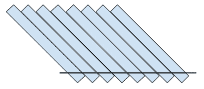

图 8.30 - 具有深度偏差的光线以消除假阳性

当然，正如您可能期望的那样，它们不能轻松解决这个问题而没有任何警告。推动深度会在其他区域产生假阴性，如下图所示。看起来立方体在漂浮，但实际上它是与地面接触的 - 假阴性产生了它漂浮的错觉：

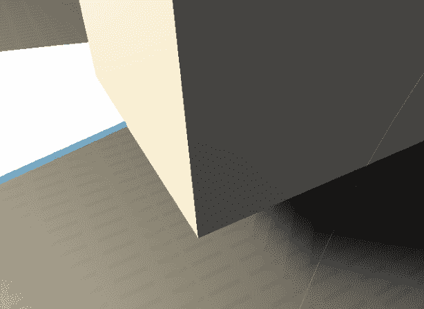

图 8.31 - 由于深度偏差导致的假阴性

当然，我们有一个对这种情况的反对技巧，称为**法线偏差**。它仍然推动物体，但沿着它们面对的方向。这有点棘手，所以我们不会在这里详细介绍，但是想法是结合一点深度偏差和另一点法线偏差将减少错误的阳性，但不会完全消除它们。因此，我们需要学会如何与之共存，并通过巧妙地定位物体来隐藏它：

图 8.32-减少假阴性，这是深度和法线偏差相结合的结果

还有其他几个影响阴影图工作方式的方面，其中之一是光范围。光范围越小，阴影覆盖的区域就越小。相同的阴影图分辨率可以为该区域添加更多细节，因此尽量减少光范围。

我可以想象你现在的表情，是的，照明很复杂，我们只是刚刚触及到表面！但保持你的精神！在稍微调整设置后，你会更好地理解它。我们将在下一节中做到这一点。

重要信息

如果您真的对学习阴影系统的内部更多信息感兴趣，我建议您查看**阴影级联**的概念，这是有关定向光和阴影图生成的高级主题。

## 配置高性能阴影

因为我们的目标是中端设备，所以我们将尝试在这里实现质量和性能的良好平衡，因此让我们开始仅为聚光灯启用阴影。定向光的阴影不会那么明显，实际上，雨天的天空不会产生清晰的阴影，因此我们将借此借口不计算那些阴影。为了做到这一点，请执行以下操作：

1.  通过在层次结构中单击它们并同时按下*Ctrl*（Mac 上的*Command*）来选择两个点光源。这将确保**检查器**窗口中所做的任何更改都将应用于两者：

图 8.33-选择多个对象

1.  在**检查器**窗口中，将**阴影类型**设置为**软阴影**。我们将在这里使用低分辨率阴影图：

图 8.34-软阴影设置

1.  选择**定向光**并将**阴影类型**设置为**无阴影**以防止其投射阴影：

图 8.35-无阴影设置

1.  创建一个立方体（**GameObject** | **3D Object** | **Cube**）并将其放在灯光附近，以便我们可以在其上投射阴影进行测试。

现在我们有了一个基本的测试场景，让我们调整阴影图分辨率设置，同时防止阴影痤疮：

1.  转到**编辑** | **项目设置**。

1.  在左侧列表中，查找**图形**并单击它：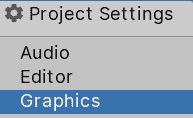

图 8.36-图形设置

在选择此选项后出现的属性中，单击下面的**可编写渲染管线设置**框中的一个名称。在我的情况下，这是**LWRP-HighQuality**，但由于您使用的 Unity 版本不同，您的情况可能不同：

图 8.37-当前渲染管线设置

1.  这样做将在项目窗口中突出显示一个资产，因此在选择之前，请确保该窗口可见。选择突出显示的资产：

图 8.38-突出显示当前管道

1.  这个资产有几个与 URP 如何处理其渲染相关的图形设置，包括照明和阴影。展开**照明**部分以显示其设置：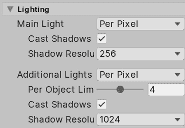

图 8.39 – 管道照明设置

1.  `Main Light`）。如果它的值还不是**1024**，将其设置为**1024**。

1.  在`0.25`下，为了尽量减少它们，我们需要在移除阴影痤疮之前尽可能减少它们：

图 8.40 – 光影设置

1.  这与阴影没有直接关联，但在这里，你可以更改**每个对象光**限制，以增加或减少可以影响对象的光的数量（不超过八个）。

1.  如果你之前遵循了阴影级联提示，可以稍微调整**级联**值，以启用定向光的阴影以观察效果。请记住，这些阴影设置仅适用于定向光。

1.  将两个灯光的范围设置为 40 米。看看在更改前后阴影的质量如何改善：

图 8.41 – 偏差设置

请记住，这些值只适用于我的情况，所以尝试稍微调整这些值，看看结果如何改变 – 你可能会找到更适合你的 PC 的设置。同时，请记住，不使用阴影始终是一个选择，所以在你的游戏运行时低于 FPS 时（并且没有其他性能问题潜伏）时，始终要考虑这一点。

你可能认为这就是我们在照明性能方面所能做的一切，但幸运的是，情况并非如此！我们还有另一个资源可以用来进一步改善，即静态照明。

# 优化照明

我们之前提到不计算照明对性能有好处，但是不计算灯光，但仍然拥有它们呢？是的，这听起来太美好了，但实际上是可能的（当然，也很棘手）。我们可以使用一种称为静态照明或烘焙的技术，它允许我们计算一次照明并使用缓存的结果。

在本节中，我们将涵盖与静态照明相关的以下概念：

+   理解静态照明

+   烘焙光照图

+   将静态照明应用于动态对象

## 理解静态照明

这个想法非常简单：只需进行一次照明计算，保存结果，然后使用这些结果，而不是一直计算照明。你可能会想为什么这不是默认的技术。这是因为它有一些限制，其中最大的限制是动态对象。**预计算阴影**意味着一旦计算出来就不能改变，但如果投射阴影的对象移动了，阴影仍然会在那里，因此需要考虑的主要事情是你不能在移动对象上使用这种技术。相反，你需要为静态对象混合**静态**或**烘焙照明**，对于动态（移动）对象使用**实时照明**。此外，需要考虑的是，除了这种技术只适用于静态对象，它也只适用于静态光源。同样，如果光源移动，预先计算的数据就会变得无效。

你需要考虑的另一个限制是，预先计算的数据可能会对内存产生巨大影响。这些数据占用了 RAM 的空间，也许有数百 MB，因此你需要考虑你的目标平台是否有足够的空间。当然，你可以降低预先计算的照明质量以减小数据的大小，但你需要考虑失去的质量是否会过分恶化你的游戏的外观和感觉。就像所有关于优化的选项一样，你需要平衡两个因素：性能和质量。

在我们的过程中有几种预先计算的数据，但最重要的是我们所谓的**光照贴图**。光照贴图是一种纹理，其中包含场景中所有对象的阴影和光照，因此当 Unity 应用预先计算或烘焙的数据时，它将查看此纹理，以了解静态对象的哪些部分受到照明，哪些部分没有。您可以在以下图中看到光照贴图的示例：

图 8.42 - 左边是没有光照的场景；中间是包含来自该场景的预先计算数据的光照贴图；右边是将光照贴图应用到场景中

无论如何，光照贴图也有其自身的好处。烘焙过程在 Unity 中执行，游戏发货给用户之前，因此您可以花费大量时间计算无法在运行时执行的内容，例如改进的准确性、光线反射、角落中的光遮挡以及来自发光对象的光线。然而，这也可能是一个问题。请记住，动态对象仍然需要依赖实时光照，而该光照看起来与静态光照非常不同，因此我们需要对其进行大量调整，以使用户注意不到差异。

现在我们对静态光照有了基本概念，让我们深入了解如何使用它。

## 烘焙光照贴图

要使用光照贴图，我们需要对 3D 模型进行一些准备工作。记住，网格有**UV**，其中包含有关将纹理的哪个部分应用于模型的每个部分的信息。有时，为了节省纹理内存，您可以将相同的纹理片段应用于不同的部分。例如，在汽车的纹理中，您不会有四个车轮，只会有一个，您可以将相同的纹理片段应用于所有车轮。问题在于静态光照以相同的方式使用纹理，但在这里，它将应用光照贴图来照亮对象。在车轮的情况下，问题在于如果一个车轮接收阴影，所有车轮都会有阴影，因为所有车轮共享相同的纹理空间。通常的解决方案是在模型中有第二组 UV，其中没有共享纹理空间，仅用于光照贴图。

有时，下载的模型已经准备好进行光照贴图，有时没有，但幸运的是，Unity 在这些情况下为我们提供了帮助。为了确保模型能够正确计算光照贴图，让我们通过以下步骤让 Unity 自动生成**光照贴图 UV**集：

1.  在**项目**窗口中选择网格资产（FBX）。

1.  在**模型**选项卡中，查找底部的**生成光照贴图**复选框并选中它。

1.  单击底部的**应用**按钮：

图 8.43 - 生成光照贴图设置

1.  对每个模型重复此过程。从技术上讲，您只能在烘焙光照贴图后在模型中出现伪影和奇怪结果时才能这样做，但现在，让我们在所有模型中都这样做以防万一。

准备好模型进行光照贴图后，下一步是告诉 Unity 哪些对象不会移动。要做到这一点，按照以下步骤进行：

1.  选择不会移动的对象。

1.  在**检视器**窗口的右上角选中**静态**复选框：

图 8.44 - 静态复选框

1.  对每个静态对象重复此过程（对灯光不需要这样做；我们稍后会处理）。

请注意，您可能不希望每个对象，即使是静态的，都被烘焙，因为您烘焙的对象越多，您就需要更多的纹理大小。例如，地形太大，将占用大部分烘焙的大小。通常情况下，这是必要的，但在我们的情况下，聚光灯几乎没有触及地形。在这里，我们有两个选择：将地形保留为动态，或者更好地直接告诉聚光灯不要影响地形，因为一个只受环境光和定向光（不投射阴影）照亮。请记住，这是我们可以做的事情，因为我们的场景类型；然而，在其他情况下，您可能需要在其他情景中使用其他设置。您可以通过以下方式从实时和静态照明计算中排除对象：

1.  选择要排除的对象。

1.  在**检视器**窗口中，单击**图层**下拉菜单，然后单击**添加图层**：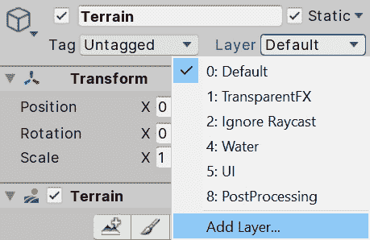

图 8.45 – 图层创建按钮

1.  在这里，您可以创建一个图层，这是一个用于识别哪些对象不会受到照明影响的对象组。在**图层**列表中，查找一个空白空间，并键入这些类型对象的任何名称。在我的情况下，我只会排除地形，所以我只是将其命名为**地形**：

图 8.46 – 图层列表

1.  再次选择地形，转到**图层**下拉菜单，并选择在上一步中创建的图层。这样，您可以指定该对象属于该组对象：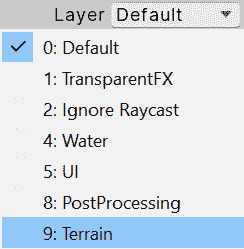

图 8.47 – 更改游戏对象的图层

1.  选择所有聚光灯，查找**检视器**窗口中的**剔除蒙版**，单击它，并取消选中之前创建的图层。这样，您可以指定这些灯不会影响该组对象：

图 8.48 – 光照剔除蒙版

1.  现在，您可以看到那些选定的灯不会照亮或对地形应用阴影。

现在，是时候处理灯光了，因为**静态**复选框对它们不起作用。对于它们，我们有以下三种模式：

+   **实时**：实时模式下的光会影响所有对象，包括静态和动态对象，使用实时照明，这意味着没有预先计算。这对于不是静态的灯光非常有用，比如玩家的手电筒，因为风而移动的灯等等。

+   **烘焙**：与实时相反，这种类型的光只会影响具有光照贴图的静态对象。这意味着如果玩家（动态）在街道上的烘焙光下移动，街道看起来会被照亮，但玩家仍然会很暗，并且不会在街道上投下任何阴影。这个想法是在不影响任何动态对象的灯光上使用它，或者在它们上几乎不可察觉的灯光上使用它，这样我们就可以通过不计算它们来提高性能。

+   **混合**：如果不确定要使用哪种模式，则这是首选模式。这种类型的光会为静态对象计算光照贴图，但也会影响动态对象，将其实时照明与烘焙照明结合在一起（就像实时光也会做的那样）。

在我们的情况下，我们的定向光只会影响地形，而且因为我们没有阴影，在 URP 中应用照明相对便宜，所以我们可以将定向光保留在实时模式，这样它就不会占用任何光照贴图区域。我们的聚光灯影响了基地，但实际上，它们只是对其应用照明 - 我们没有阴影，因为我们的基地是空的。在这种情况下，最好根本不计算光照贴图，但出于学习目的，我将添加一些障碍物作为基地的阴影，并证明使用光照贴图，如下图所示：

图 8.49 – 向项目添加对象以投射光线

在这里，您可以看到我们的关卡原始设计在游戏开发过程中不断变化，这是您无法避免的事情 - 游戏的更大部分将随时间改变。现在，我们已经准备好设置光照模式并执行烘焙过程，如下所示：

1.  选择**定向光**。

1.  将`检视器`窗口设置为**实时**（如果尚未处于该模式）。

1.  选择两个聚光灯。

1.  将它们的**渲染模式**设置为**混合**：

图 8.50 – 混合光照设置

1.  打开**照明设置**窗口（**窗口** | **渲染** | **照明设置**）。

1.  单击**生成照明**，这是我们之前用来生成环境光照的相同按钮。

1.  等待进程完成。您可以通过检查 Unity 编辑器右下角的进度条来完成此操作。请注意，这个过程可能需要几个小时才能完成，所以请耐心等待：

图 8.51 – 烘焙进度条

1.  我们想要更改烘焙过程的一些设置。为了启用此控件，单击**新照明设置**按钮。这将创建一个具有光照设置的资源，可以应用于多个场景，以便我们多次共享相同的设置：

图 8.52 – 创建照明设置

1.  降低光照质量，以加快进程。只需迭代，通过使用**光照贴图分辨率**、**直接**、**间接**和**环境样本**等设置，可以轻松降低照明。在我的情况下，我已经应用了这些设置，如下图所示。请注意，即使减少这些设置也需要时间；由于模块化关卡设计，我们的场景中有太多对象：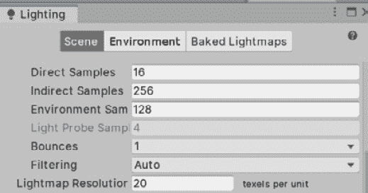

图 8.53 – 场景光照设置

1.  进程完成后，您可以检查**照明设置**窗口的底部，您可以看到需要生成多少个光照贴图。我们有最大光照贴图分辨率，所以我们可能需要生成几个光照贴图来覆盖整个场景。此外，它还告诉我们它们的大小，以便我们可以考虑它们对 RAM 的影响。最后，您可以查看**烘焙光照贴图**部分来查看它们：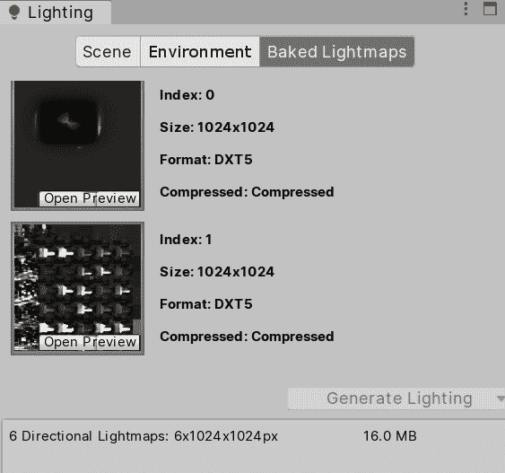

图 8.54 – 生成的光照贴图

1.  现在，根据结果，您可以移动对象，修改光强度，或者进行任何您需要的修正，以使场景看起来符合您的要求，并在需要时重新计算照明。在我的情况下，这些设置给我带来了足够好的结果，您可以在下图中看到：

图 8.55 – 光照贴图结果

我们仍有许多小设置要处理，但我会让您通过试错或阅读 Unity 关于光照贴图的文档来发现这些设置。阅读 Unity 手册是获取知识的好途径，我建议您开始使用它 - 任何经验丰富的好开发人员都应该阅读手册。

## 将静态光照应用于静态对象

当在场景中将对象标记为静态时，您可能已经发现场景中的所有对象都不会移动，因此您可能已经为每个对象都勾选了静态复选框。这没问题，但您应该始终将一个动态对象放入场景中，以确保一切正常 - 没有游戏完全静态。尝试添加一个胶囊体并将其移动以模拟我们的玩家，如下图所示。如果您留意，您会注意到一些奇怪的事情 - 光照贴图过程生成的阴影未应用于我们的动态对象：

图 8.56 - 动态物体在烘焙阴影下

你可能会认为混合光模式应该影响动态和静态物体，这正是它所做的。问题在于，与静态物体相关的所有内容都预先计算到那些光照图纹理中，包括它们投射的阴影，因为我们的胶囊是动态的，在预计算过程执行时并不存在。所以，在这种情况下，因为投射阴影的对象是静态的，它的阴影不会影响任何动态物体。

在这里，我们有几种解决方案。第一种是改变静态和实时混合算法，使相机附近的所有东西都使用实时照明，并防止这个问题（至少在玩家的注意焦点附近），这对性能会有很大影响。另一种选择是使用**光探头**。当我们烘焙信息时，我们只在光照图上做了这个，这意味着我们只有表面上的光照信息，而不是空白空间中的光照信息。因为我们的玩家正在穿越这些表面之间的空白空间，我们不知道这些空间的光照会是什么样子，比如走廊中间。光探头是在这些空白空间中的一组点，Unity 也会预先计算信息，所以当一些动态物体经过时，它会从中采样信息。在下图中，你可以看到一些应用到我们场景中的光探头。你会注意到那些在阴影中的光探头会变暗，而那些暴露在光线下的光探头会有更大的强度。这种效果将应用到我们的动态物体上：

图 8.57 - 代表光探头的球体

如果你现在在场景中移动你的物体，它将对阴影做出反应，就像下面两张图片中所示，你可以看到一个动态物体在烘焙阴影外被照亮，而在内部变暗：

.jpg)

图 8.58 - 动态物体接收来自光探头的烘焙照明

为了创建光探头，进行以下操作：

1.  通过转到**GameObject** | **Light** | **Light Probe Group**来创建一组**光**探头：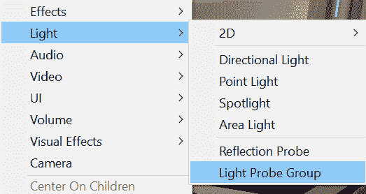

图 8.59 - 创建光探头组

1.  幸运的是，我们有一些关于如何定位它们的指导方针。建议将它们放在光照变化的地方，比如在内部和外部阴影边界。然而，这相当复杂。最简单和推荐的方法是在可玩区域上放置一个光探头网格。为此，你可以简单地多次复制和粘贴光网格组，以覆盖整个基地：

图 8.60 - 光探头网格

1.  另一种方法是选择一组并点击**编辑光探头**按钮进入光探头编辑模式：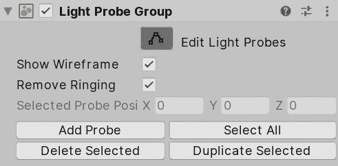

图 8.61 - 光探头组编辑按钮

1.  点击**全选**按钮，然后点击**复制所选**按钮，复制所有先前存在的探针。

1.  使用平移小工具，将它们移动到先前的位置旁边，同时扩展网格。请考虑到探针越近，你需要更多的探针来覆盖地形，这将产生更多的数据。然而，光探头数据相对便宜，所以你可以有很多。

1.  重复*步骤 4*至*5*，直到覆盖整个区域。

1.  使用**光照设置**中的**生成照明**按钮重新生成照明。

有了这个，你就预先计算了影响我们动态物体的光探头上的照明，将两个世界结合起来，获得了连贯的照明。

# 总结

在本章中，我们讨论了几个照明主题，比如 Unity 如何计算光线、阴影，如何处理不同的光源，比如直接和间接照明，如何配置阴影，如何烘焙照明以优化性能，以及如何结合动态和静态照明，使光线不脱离影响其所在世界的环境。这是一个很长的章节，但照明值得如此。这是一个复杂的主题，可以显著改善场景的外观和感觉，同时大大降低性能。这需要大量的实践，我们在这里试图总结出你开始尝试的所有重要知识。对这个主题要有耐心；很容易得到不正确的结果，但你可能只差一个复选框就能解决问题。

现在我们已经在场景设置中做了所有可以改进的事情，在下一章中，我们将使用 Unity 后期处理堆栈应用最终的图形效果，这将应用全屏图像效果-这些效果将给我们带来当今所有游戏都具有的电影般的外观和感觉。
