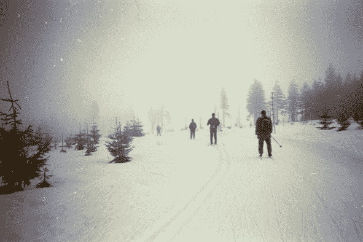
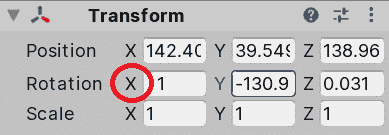
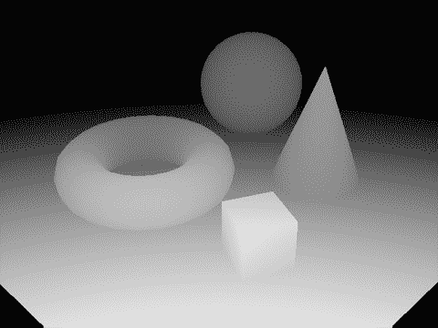

# 第九章：*第九章*：使用后期处理的全屏效果

到目前为止，我们已经创建了不同的对象来改变场景的视觉效果，例如网格、粒子和灯光。我们可以在这里和那里调整这些对象的设置，以改善我们的场景质量，但是当与现代游戏场景进行比较时，您总会感到缺少某些东西，即全屏或后期处理效果。在本章中，您将学习如何将效果应用于最终渲染的帧，这将改变整个场景的外观。

+   在本章中，我们将研究以下图像效果概念：

+   ](img/Figure_9.03_B14199.jpg)

+   使用高级效果

# 使用后期处理

**后期处理**是 Unity 的一个功能，允许我们应用多种效果（一堆效果）叠加在一起，这将改变图像的最终外观。每个效果都会影响完成的帧，根据不同的标准改变其中的颜色。在以下截图中，您可以看到应用图像效果之前和之后的场景。您会注意到明显的差异，但是该场景的对象，包括灯光、粒子或网格，都没有任何变化。应用的效果是基于像素分析的。在这里看看两个场景：

.jpg)

图 9.1-没有图像效果的场景（左）和具有效果的相同场景（右）

需要考虑的是，以前的后期处理解决方案**postprocessing Stack version 2**（**PPv2**）在**Universal Render Pipeline**（**URP**）上无法使用；它有自己的后期处理实现，因此我们将在本章中看到它。无论如何，它们非常相似，因此即使您使用 PPv2，您仍然可以从本章中获得一些东西。

在本节中，我们将讨论以下 URP 后期处理概念：

+   设置配置文件

+   使用基本效果

让我们开始准备我们的场景应用效果。

## 设置配置文件

要开始应用效果，我们需要创建一个**Profile**，它是一个包含我们想要应用的所有效果和设置的资产。出于与材质相同的原因，这是一个单独的资产，因为我们可以在不同的场景和场景部分之间共享相同的后期处理配置文件。当我们提到场景的部分时，我们指的是应用了某些效果的体积或游戏区域。我们可以定义一个全局区域，无论玩家的位置如何都会应用效果，或者我们可以应用不同的效果-例如，当我们在室外或室内时。

在这种情况下，我们将使用全局体积，我们将使用它来应用我们的第一个效果配置文件，方法如下：

1.  创建一个新的空游戏对象（**GameObject** | **Create Empty**）。

1.  将其命名为`PP Volume`（表示后期处理体积）。

1.  将**Volume**组件添加到其中。

1.  确保**Mode**设置为**Global**。

1.  单击**Profile**设置右侧的**New**按钮，这将生成一个名为我们对象的新配置文件资产（PPVolume Profile）。您可以稍后将其移动到自己的文件夹中，这是为了资产组织目的而推荐的。该过程如下截图所示：

图 9.2-体积组件

1.  要测试体积是否起作用，让我们添加一个效果。单击**Add Override**按钮，然后选择**postprocessing** | **Chromatic Aberration**选项。

1.  检查`0.5`，如下截图所示：

图 9.4 - 应用到场景中的色差

1.  现在，如果你点击`Main Camera`，你会发现效果没有被应用，这是因为我们需要勾选`Main Camera`，如下面的截图所示：

图 9.5 - 启用后期处理

因此，我们创建了一个全局体积，它将将指定的效果作为覆盖应用到整个场景，而不管玩家的位置如何。

现在我们已经准备好使用后期处理来准备我们的场景，我们可以开始尝试不同的效果。让我们从下一节中最简单的效果开始。

## 使用基本效果

现在我们在场景中有了后期处理，唯一需要做的就是开始添加效果并设置它们，直到我们得到期望的外观和感觉。为了做到这一点，让我们探索系统中包含的几种简单效果。

让我们从**色差**开始，这是我们刚刚使用的效果，与大多数图像效果一样，它试图复制特定的真实效果。所有游戏引擎渲染系统都使用了眼睛视觉真实工作的简单数学近似，因此我们没有一些发生在人眼或相机镜头中的效果。真实的相机镜头通过弯曲光线来将其指向相机传感器，但在一些镜头中（有时是故意的），这种弯曲并不完美，因此你会看到一些失真，如下面的截图所示：

.jpg)

图 9.6 - 没有色差的图像（左）和有色差的相同图像（右）

这个效果将是我们添加的几个效果之一，以在游戏中产生一种电影感，模拟真实相机的使用。当然，这种效果并不适合每种类型的游戏；也许简单的卡通风格不会从中受益，但你永远不知道：艺术是主观的，所以这是一个试错的过程。

此外，我们在上一个例子中夸大了强度，以使效果更加明显，但我建议在这种情况下使用强度为 0.25。通常建议对效果的强度要温和；强烈的效果很诱人，但当你添加了很多效果之后，图像会变得臃肿，扭曲太多。因此，尽量添加一些微妙的效果，而不是少量强烈的效果。但是，这取决于你所追求的目标风格；在这里没有绝对的真理（但常识仍然适用）。

最后，在讨论其他效果之前，如果你习惯使用其他类型的后期处理效果框架，你会注意到这个版本的色差设置较少，这是因为 URP 版本追求性能，所以尽可能简单。

接下来我们要讨论的效果是**晕影**。这是另一个相机镜头的缺陷，图像强度在镜头边缘会丢失。这不仅可以用来模拟旧相机，还可以吸引用户的注意力集中在相机的中心，比如在电影中。此外，如果你正在开发**虚拟现实**（**VR**）应用程序，这可以通过减少玩家的外围视觉来减轻晕动病。在下面的截图中，你可以看到一个旧相机上晕影的例子：

图 9.7 - 使用旧相机拍摄的照片，边缘有晕影

只是试试，让我们通过以下方式向我们的场景应用一些晕影：

1.  选择`PP Volume`游戏对象。

1.  通过点击**添加覆盖**按钮添加**后期处理** | **晕影**效果。

1.  检查`0.3`，增加效果。

1.  检查`0.5`；这将增加效果的扩散。您可以在下面的截图中看到结果：

图 9.8 – 晕影效果

如果您愿意，您可以通过勾选`Center`和`Rounded`，以`Particles`的方式工作。您可以通过调整数值来创建漂亮的效果。

我们将在这个基础部分中审查的另一个效果是**运动模糊**，再次模拟相机的工作方式。相机有一个曝光时间，它需要捕捉光子以获得每一帧。当一个物体移动得足够快时，在那短暂的曝光时间内，同一个物体会处于不同的位置，因此它会显得模糊不清。在下面的截图中，您可以看到该效果应用到我们的场景中。在这张图片中，我们快速上下旋转相机，得到以下结果：

图 9.9 将运动模糊应用到我们的场景中

需要考虑的一件事是，这种模糊只会应用于相机的移动，而不是物体的移动（静止相机，移动物体），因为 URP 目前不支持运动矢量。

要使用此效果，请按照以下步骤进行：

1.  使用**Post-processing** | **Motion Blur**覆盖，点击**Add override**按钮。

1.  检查`0.5`。

1.  在查看游戏视图时旋转相机（而不是场景视图）。您可以单击并拖动相机的**Transform**的**X**属性（不是值，而是**X**标签），如下面的截图所示：

图 9.10 – 改变旋转

正如您所看到的，这种效果在场景视图中是看不到的，其他效果也是如此，因此在得出效果不起作用的结论之前，请考虑这一点。Unity 之所以这样做，是因为在场景中工作时，拥有这种效果会非常恼人。

最后，我们将简要讨论两个最终简单的效果，**胶片颗粒**和**白平衡**。第一个非常简单：添加它，将强度设置为 1，您将得到老电影中著名的颗粒效果。您可以通过不同大小的**Type**来使其更加微妙或明显。白平衡允许您改变色温，根据您的配置使颜色变得更温暖或更凉爽。在我们的情况下，我们正在处理一个寒冷的黑暗场景，因此您可以添加它并将温度设置为-20，稍微调整外观，改善这种场景的外观和感觉。

既然我们已经看到了一些简单的效果，让我们来看看剩下的一些受一些高级渲染特性影响的效果。

# 使用高级效果

我们将在本节中看到的效果与之前的效果并没有太大的区别；它们只是有点棘手，需要一些背景知识才能正确使用它们。所以，让我们深入了解它们！

在本节中，我们将看到高级效果概念

**高动态范围**（**HDR**）和深度图。

## 高级效果

让我们首先讨论一些这些效果正常工作所需的要求。

### HDR 和深度图

有些效果不仅适用于渲染图像，还需要额外的数据。我们首先讨论**深度图**，这是我们在上一章中已经讨论过的概念。简而言之，深度图是从相机的视角渲染的图像，但它不是生成场景的最终图像，而是渲染场景对象的深度，以灰度渲染对象。颜色越深，像素距离相机越远，反之亦然。在下面的截图中，您可以看到深度图的一个示例：

图 9.11 – 几何图形的深度图

我们将看到一些效果，比如**景深**，它会根据相机的距离模糊图像的某些部分，但它可以用于自定义效果的几个目的（不在基本 URP 包中）。

这里要讨论的另一个概念会改变颜色的处理方式，因此也会改变一些效果的工作方式，那就是 HDR。在旧的硬件中，颜色通道（红色、绿色和蓝色）被编码在 0 到 1 的范围内，0 表示没有强度，1 表示完全强度（每个通道），因此所有照明和颜色计算都是在该范围内进行的。这似乎没问题，但并不反映光的实际工作方式。您可以看到一张纸被阳光照射时呈现全白（所有通道设置为 1），当您直接看灯泡时也会看到全白，但即使光和纸都是相同的颜色，后者首先会在一段时间后刺激眼睛，其次，由于光线过多，会有一些过亮。问题在于最大值（1）不足以表示最强烈的颜色，因此，如果您有一个高强度的光和另一个甚至更高强度的光，由于计算无法超过 1，两者都将生成相同的颜色（每个通道中的 1）。这就是为什么创建了**HDR 渲染**。

HDR 是一种使颜色超出 0.1 范围的方式，因此基于颜色强度工作的照明和效果在此模式下具有更好的准确性。这与具有相同名称的新电视功能的想法相同，尽管在这种情况下，Unity 将以 HDR 进行计算，但最终图像仍将使用先前的颜色空间（0 到 1，或**低动态范围（LDR）**），因此不要将 Unity 的**HDR 渲染**与**显示的 HDR**混淆。要将 HDR 计算转换回 LDR，Unity（以及电视）使用了一个称为**色调映射**的概念。您可以在以下屏幕截图中看到一个 LDR 渲染的场景和色调映射在 HDR 场景中的应用示例：

.jpg)

图 9.12-左边是 LDR 渲染的场景，右边是使用色调映射校正过亮的 HDR 场景

色调映射是一种将颜色从 0.1 范围之外带回到其中的方法。它基本上使用一些公式和曲线来确定如何映射每个颜色通道。您可以在典型的从暗到亮的场景转换中清楚地看到这一点，比如当您走出没有窗户的建筑物，走到明亮的一天。有一段时间，您会看到一切变得更亮，直到一切恢复正常。这里的想法是，当您在建筑物内外时，计算并不不同；建筑物内的白墙将具有接近 1 强度的颜色，而外面的同样白墙将具有更高的值（由于阳光）。不同之处在于，当您在建筑物外时，色调映射将把高于 1 的颜色带回到 1，并且根据您的设置，如果整个场景较暗，可能会增加建筑物内墙壁的照明。

即使 HDR 默认启用，让我们看看如何通过以下方式检查：

1.  转到**编辑** | **项目设置**。

1.  单击左侧面板中的**图形设置**部分。

1.  单击**脚本渲染管线设置**属性下引用的资产。

1.  单击项目面板中突出显示的资产。在单击**图形**设置中的属性之前，请确保此面板可见。

1.  在**质量**部分，确保**HDR**已被选中，如下面的屏幕截图所示：

图 9.13-启用 HDR

当然，HDR 是可切换的，这意味着有些情况下您可能不想使用它。正如您可以猜到的，不是所有的硬件都支持 HDR，并且使用它会带来性能开销，所以请考虑这一点。幸运的是，大多数效果都适用于 HDR 和 LDR 颜色范围，因此如果您启用了 HDR 但用户设备不支持它，您不会遇到任何错误，只是会得到不同的结果。

既然我们确定已启用 HDR，让我们探索一些使用这个和深度映射的高级效果。

让我们看看一些使用先前描述的技术的特定效果，首先是常用的 Bloom。这种效果通常模拟相机镜头或甚至人眼周围发生的强烈照明物体的过度发光。在下面的截图中，您可以看到我们场景的默认版本和夸张的 Bloom 版本之间的差异。您可以观察到效果只应用于我们场景最明亮的区域。在这里看看这两种效果：

.jpg)

图 9.14 - 默认场景（左）和相同场景的高强度 Bloom（右）

这种效果实际上非常普遍和简单，但我认为它是高级的，因为结果受到 HDR 的影响很大。这种效果依赖于计算每个像素的颜色强度，以便检测可以应用它的区域。在 LDR 中，我们可能有一个白色的物体，实际上并不是过亮的，但由于这种颜色范围的限制，Bloom 可能会在其上产生过度发光。在 HDR 中，由于其增加的颜色范围，我们可以检测物体是否是白色，或者物体可能是浅蓝色但只是过亮，产生了它是白色的错觉（比如在高强度灯附近的物体）。在下面的截图中，您可以看到我们的场景在启用 HDR 和未启用 HDR 时的区别。您会注意到 LDR 版本会在不一定是过亮的区域产生过度发光。差异可能非常微妙，但请注意细节以注意到差异。记住，我在这里夸大了效果。在这里看看两个场景：

.jpg)

图 9.15 - LDR 场景中的 Bloom（左）和 HDR 场景中的 Bloom（右）。请注意，Bloom 设置已更改，以尽量接近它们

现在，让我们继续使用场景的 HDR 版本。为了启用 Bloom，执行以下操作：

1.  像往常一样，将**Bloom**覆盖添加到配置文件中。

1.  启用`1.5`。这控制着将应用多少过度发光。

1.  启用`0.7`。这个值表示颜色需要具有的最小强度，才能被认为是过度发光。在我们的情况下，我们的场景有点暗，所以我们需要在 Bloom 效果设置中减少这个值，以包括更多的像素。通常情况下，这些值需要根据您的具体情况进行调整。

1.  您会注意到差异非常微妙，但再次记住，您将有几种效果，所以所有这些小差异将累积起来。您可以在以下截图中看到这两种效果：

.jpg)

图 9.16 - Bloom 效果

像往常一样，建议您调整其他值。我建议您测试一些有趣的设置，比如**Dirt Texture**和**Dirt Intensity**值。

现在，让我们转移到另一个常见的效果，**景深**。这个效果依赖于我们之前讨论过的深度图。肉眼并不那么明显，但当你专注于视野内的一个物体时，周围的物体会变得模糊，因为它们失焦了。我们可以利用这一点来在游戏玩法的关键时刻引起玩家的注意。这个效果将对深度图进行采样，以查看物体是否在焦点范围内；如果是，就不会应用模糊效果，反之亦然。为了使用它，做如下操作：

1.  这个效果取决于你的游戏摄像机定位。在这种情况下，我们将把摄像机放在柱子附近，以尝试专注于特定物体，如下截图所示：

图 9.17 – 摄像机定位

1.  添加**景深**覆盖。

1.  启用并将**模式**设置为**高斯**：这是最简单的模式。

1.  在我的情况下，我设置了`10`和`20`，这将使效果从目标物体后面的一定距离开始。**结束**设置将控制模糊的强度增加，达到最大值时距离为 20 米。记得根据你的情况调整这些值。

1.  如果你想稍微夸张效果，设置为`1.5`。结果如下截图所示：

图 9.18 – 夸张效果

这里需要考虑的一点是，我们的特定游戏将采用俯视视角，与第一人称摄像机不同，你可以看到远处的物体，而在这里，物体足够近以至于不会注意到效果，所以我们可以将这个效果限制在剧情场景中使用。

现在，剩下的大部分效果都是改变场景实际颜色的不同方式。思路是，真实的颜色有时并不能给你想要的精确外观和感觉。也许你需要让暗区域更暗，以加强恐怖氛围的感觉，或者你想做相反的事情：增加暗区域的亮度，以代表一个开放的场景。也许你想给高光着色一点，以获得霓虹效果，如果你正在创建一个未来主义游戏，或者也许你想暂时使用棕褐色效果，进行一个回忆。我们有无数种方法可以做到这一点，在这种情况下，我将使用一个简单但强大的效果，叫做**阴影、中间色调、高光**。

这个效果将对**阴影**、**中间色调**和**高光**应用不同的颜色校正，这意味着我们可以分别修改较暗、较亮和中等区域。让我们尝试一下：

1.  添加**阴影、中间色调、高光**覆盖。

1.  让我们开始做一些测试。勾选三个**阴影**、**中间色调**和**高光**复选框。

1.  将**阴影**和**中间色调**滑块全部向左移动，将**高光**的滑块向右移动。这将减少阴影和中间色调的强度，并增加高光的强度。我们这样做是为了让你看到**高光**会根据其强度改变的区域（这在恐怖游戏中也可能是一个有趣的效果）。你可以用其他滑块做同样的操作来检查其他两个区域。你可以在下面的截图中看到结果：

图 9.19 – 高光隔离

1.  此外，你可以尝试移动彩色圆圈中心的白色圆圈，对这些区域进行轻微着色。将滑块稍微向左移动以减少高光的强度，使着色效果更加明显。你可以在下面的截图中看到结果：

图 9.20 – 高光着色

1.  通过这样做，您可以探索这些控件的工作方式，但当然，这些极端值对于某些边缘情况是有用的。在我们的场景中，您可以在下面的屏幕截图中看到的设置对我来说效果最好。一如既往，最好使用更微妙的值，以不要过度扭曲原始结果，如下所示：

图 9.21 – 微妙的变化

1.  以下是屏幕截图中的前后效果：

.jpg)

图 9.22 – 前后效果

您还有其他更简单的选项，比如**分割调色**，它做的事情类似，但只涉及阴影和高光，或者**颜色曲线**，它可以让您更高级地控制场景的每个颜色通道将如何映射，但其思想是相同的——即改变结果场景的实际颜色，以赋予您的场景特定的色彩氛围。如果您还记得电影系列*黑客帝国*，当角色在矩阵中时，一切都带有微妙的绿色色调，而在外面时，色调是蓝色的。

请记住，使用 HDR 和不使用它对于这些效果的结果是重要的，因此最好尽早决定是否使用 HDR，排除某些目标平台（这可能对您的目标受众不重要），或者不使用它（使用 LDR）并且对场景的光照水平控制较少。

还要考虑到，也许您需要调整一些对象的设置，比如光强度和材质属性，因为有时我们使用后期处理来修复可能由错误设置的对象引起的图形错误，这是不好的。例如，增加场景中的环境光照会大大改变效果的输出，我们可以利用这一点来增加整体亮度，而不是使用效果，如果我们发现场景太暗。

这涵盖了要使用的主要图像效果。请记住，不是使用每一个效果，而是使用您认为对您的场景有贡献的效果；它们在性能方面并不是免费的（尽管不是那么资源密集），所以要明智地使用它们。此外，您可以查看已创建的配置文件，将它们应用到您的游戏中，看看微小的变化如何产生巨大的影响。

# 总结

在本章中，我们讨论了在我们的场景中应用的基本和高级全屏效果，使其在相机镜头效果方面看起来更真实，在颜色扭曲方面更时尚。我们还讨论了 HDR 和深度图的内部结构，以及在使用这些效果时它们的重要性，这可以立即提高您游戏的图形质量，而付出的努力却很少。

现在我们已经涵盖了 Unity 系统中常见的大部分图形，让我们开始看看如何通过声音增强我们场景的沉浸感。
