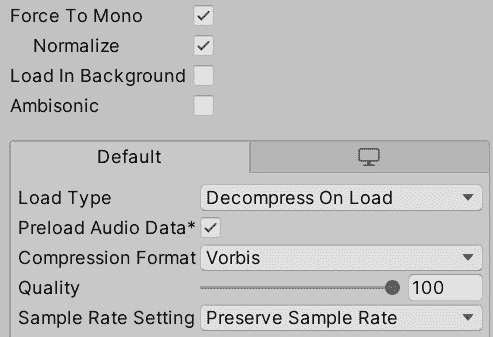
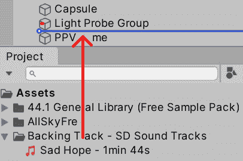
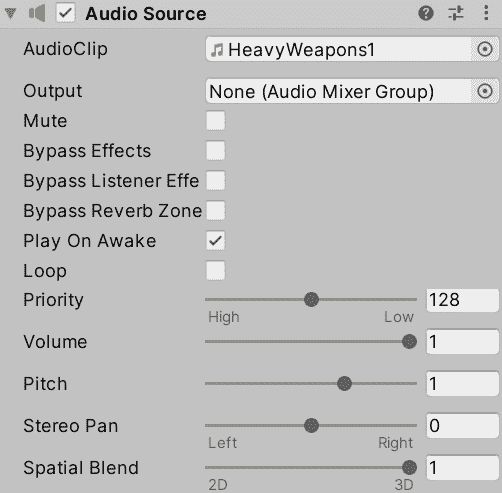
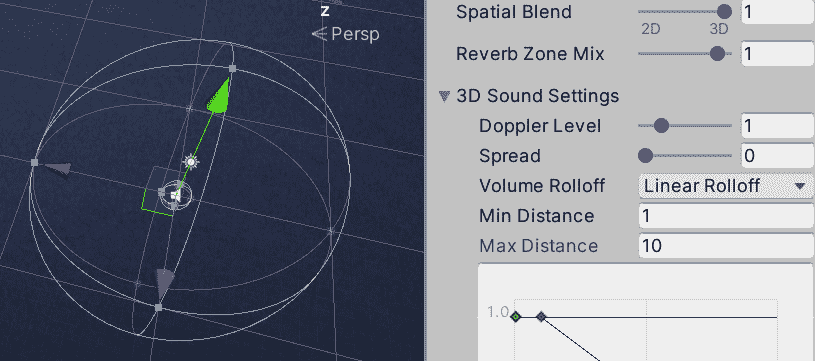

# 第十章：声音和音乐集成

我们刚刚达到了足够好的图形质量，但我们缺少游戏美学的一个重要部分：声音。声音经常被排在游戏开发的最后一步，但它是那种如果存在，你不会注意到它的存在，但如果你没有它，你会感觉到缺少了什么。它将帮助你加强你在游戏中想要的氛围，并且必须与图形设置相匹配。

在本章中，我们将讨论以下声音概念：

+   导入音频

+   集成和混合音频

# 导入音频

与图形资产一样，正确设置音频资产的导入设置非常重要，如果不正确的话可能会消耗大量资源。

在本节中，我们将讨论以下音频导入概念：

+   音频类型

+   配置导入设置

让我们开始讨论我们可以使用的不同类型的音频。

## 音频类型

视频游戏中存在不同类型的音频，包括以下内容：

+   **音乐**：用于根据情况增强玩家体验的音乐。

+   **音效（SFX）**：作为对玩家或 NPC 行为的反应发生的声音，例如点击按钮、行走、打开门和开枪。

+   **环境声音**：一个只有作为事件反应的声音的游戏会感觉空荡。如果你正在重建城市中的公寓，即使玩家只是闲置在房间中什么也不做，应该听到很多声音，大部分声音的来源都在房间外，比如飞机在头顶飞过，两个街区外的建筑工地，和街上的汽车。创建看不见的对象是资源的浪费。相反，我们可以在整个场景中放置单独的声音来重新创建所需的氛围，但这将消耗大量的 CPU 和 RAM 来实现可信的结果。考虑到这些声音通常是用户注意力的第二个平面，我们可以将它们全部合并成一个循环轨道，只播放一个音频，这正是环境声音。如果你想创建一个咖啡馆场景，你可以简单地去一个真正的咖啡馆录制几分钟的音频，将其用作你的环境声音。

对于几乎所有的游戏，我们至少需要一条音乐曲目，一条环境曲目和几个 SFX 来开始音频的制作。和往常一样，我们有不同的音频资产来源，但我们将使用资产商店。它有三个音频类别，可以搜索到我们需要的资产：

图 10.1 - 资产商店中的音频类别

在我的情况下，我还使用了搜索栏来进一步过滤类别，搜索天气以找到雨的效果。有时，你无法单独找到确切的音频；在这种情况下，你需要深入**包和库**，所以在这里要有耐心。在我的情况下，我选择了你可以在下图中看到的三个包，但是导入其中一些包含的声音，所有这些声音在项目中都会占用很大的空间。对于环境声音，我选择了雨。然后，我选择了**音乐 - 伤感希望**作为音乐，对于 SFX，我选择了一个枪声音效包，用于我们未来的玩家英雄角色。当然，你可以选择其他包以更好地满足你的游戏需求：

图 10.2 - 我们游戏的包

请记住，当你阅读这篇文章时，这些确切的包可能不可用。在这种情况下，你可以下载其他包，或者从 GitHub 仓库中选择我使用的文件。现在我们有了必要的音频包，让我们讨论如何导入它们。

## 配置导入设置

我们有几个可以调整的导入设置，但问题是我们需要考虑音频的使用情况才能正确设置它，所以让我们看看每种情况的理想设置。要查看导入设置，像往常一样，您可以选择资产并在检查器面板中查看它，如下面的截图所示：

图 10.3 - 音频导入设置

让我们讨论最重要的几个，首先是**强制转换为单声道**。一些音频可能带有立体声声道，这意味着我们左耳和右耳分别有一个声音。这意味着一段音频实际上可以包含两个不同的音轨。立体声音对于不同的效果和乐器空间化在音乐的情况下是有用的，所以在这些情况下我们希望有这种效果，但也有其他情况下立体声并不有用。考虑 3D 音效，比如射击枪声或步行声音。在这些情况下，我们需要听到声音来自源头的方向。如果枪声发生在我的左边，我需要听到它来自我的左边。在这些情况下，我们可以通过在音频导入设置中勾选**强制转换为单声道**复选框来将立体声音转换为单声道音频。这将使 Unity 将两个声道合并为一个声道，将音频的大小通常减少到几乎一半（有时更多，有时更少，这取决于各种因素）。

您可以在音频资产检查器底部验证该设置和其他设置的影响，您可以在那里看到导入的音频大小：

图 10.4 - 左：未强制转换为单声道的音频。右：相同的音频强制转换为单声道

接下来要讨论的设置是**加载类型**，这是一个重要的设置。为了播放一些音频，Unity 需要从磁盘读取音频，解压缩，然后播放。加载类型改变了这三个过程的处理方式。我们在这里有以下三个选项：

+   **加载时解压缩**：最占用内存的选项。这种模式将使 Unity 在场景加载时将音频解压缩到内存中。这意味着音频将占用大量 RAM 空间，因为我们已经加载了未压缩的版本。使用这种模式的优势在于播放音频更容易，因为我们已经准备好在 RAM 中播放原始音频数据。

+   **流式传输**：与**加载时解压缩**完全相反。这种模式从不在 RAM 中加载音频。相反，当音频播放时，Unity 会从磁盘读取音频资产的一部分，解压缩它，播放它，然后重复这个过程，对于每个正在**流式传输**播放的音频部分运行一次。这意味着这种模式将会占用大量 CPU 资源，但几乎不会消耗 RAM 字节。

+   **内存中的压缩**：中间地带。这种模式将在场景加载时从磁盘加载音频，但将保持其在内存中的压缩状态。当 Unity 需要播放音频时，它只会从 RAM 中取一部分，解压缩并播放。请记住，从 RAM 中读取音频资产的部分比从磁盘读取要快得多。

也许如果您是一位经验丰富的开发者，您可以轻松确定哪种模式更适合哪种类型的音频，但如果这是您第一次接触视频游戏，可能会感到困惑，所以让我们讨论不同情况下的最佳模式：

+   **频繁的短音频**：这可能是射击枪声或脚步声等持续时间不到 1 秒的声音，但可能会在多个实例中发生并同时播放。在这种情况下，我们可以使用加载时解压缩。未压缩的短音频与其压缩版本的大小差异不大。而且，由于这是性能最佳的 CPU 选项，有多个实例不会对性能产生巨大影响。

+   **不经常的大型音频**：这包括音乐、环境声音和对话。这些类型的音频通常只有一个实例在播放，而且它们通常很大。这些情况更适合于流媒体模式，因为在低端设备（如移动设备）中对它们进行压缩或解压缩可能会产生巨大影响（在 PC 上，有时我们可以使用内存中的压缩）。CPU 可以处理两三个音频位在流媒体中播放，但尽量不要超过这个数量。

+   **频繁的中等音频**：这包括多人游戏中预制的语音对话、角色表情、长时间的爆炸声音，或者任何超过 500KB 的音频（这不是一个严格的规则——这个数字在很大程度上取决于目标设备）。将这种类型的音频解压缩到 RAM 中可能会对性能产生明显影响，但由于这种音频相对较小，通常不会对我们的游戏产生巨大影响，并且我们将避免浪费 CPU 资源从磁盘读取。

还有其他情况需要考虑，但这些可以根据前面的情况进行推断。请记住，前面的分析是根据标准游戏的要求进行的，但这可能会根据您的游戏和目标设备而有很大不同。也许你正在制作一个不会消耗大量 RAM 但在 CPU 资源方面非常密集的游戏，在这种情况下，你可以将所有内容都放在加载时解压缩。重要的是要考虑游戏的所有方面，并根据资源进行平衡。

最后，还有一件要考虑的事情是压缩格式，这将改变 Unity 在发布游戏时对音频进行编码的方式。不同的压缩格式将以不同的压缩比率换取与原始音频的保真度较低或更高的解压缩时间，所有这些都根据音频模式和长度而有很大不同。我们有三种压缩格式：

+   **PCM**：无压缩格式将为您提供最高的音频质量，没有噪音伪影，但会导致更大的资产文件大小。

+   **ADPCM**：以这种方式压缩音频可以减小文件大小并产生快速的解压缩过程，但这可能会引入在某些类型的音频中会明显的噪音伪影。

+   **Vorbis**：一种高质量的压缩格式，几乎不会产生任何伪影，但解压时间较长，因此播放 Vorbis 音频会比其他格式稍微更加密集。它还提供了一个质量滑块，可以选择精确的压缩程度。

你应该使用哪一个？同样，这取决于你的音频特性。短平滑的音频可以使用 PCM，而长嘈杂的音频可以使用 ADPCM；这种格式引入的伪影将被隐藏在音频本身中。也许长平滑的音频在压缩伪影明显时使用 Vorbis 会更好。有时，这只是一个试错的问题。也许默认使用 Vorbis，当性能降低时，尝试切换到 ADPCM，如果那导致故障，就切换到 PCM。当然，问题在于确保音频处理确实是导致性能问题的原因——也许将所有音频切换到 ADPCM 并检查是否有所不同是检测的一个好方法，但更好的方法是使用 Profiler，这是一个性能测量工具，我们将在本书后面看到。

我们还有其他设置，比如采样率设置，再次，通过一些试错，你可以找到最佳设置。

我已经设置了从资产商店下载的音频，如下截图所示。第一张截图显示了我是如何设置音乐和环境音频文件的（大文件）：

图 10.5 – 音乐和环境设置

应该是立体声（未选中强制转换为单声道），使用**流式加载类型**，因为它们很大，只会有一个实例播放，并且使用**ADPCM 压缩格式**，因为 Vorbis 并没有产生巨大的大小差异。

第二个截图显示了我如何设置 SFX 文件（小文件）：

图 10.6–射击 SFX 设置

将是 3D 声音，因此应该选中强制转换为单声道。将是短暂的，因此在加载时解压缩加载类型效果更好。Vorbis 压缩格式将 ADPCM 大小减少了一半以上

现在我们的音频片段已经正确配置，我们可以开始在场景中使用它们了。

# 集成和混音音频

我们可以简单地将我们的音频片段拖到场景中开始使用它，但是我们可以深入挖掘一下，探索将它们配置到每种可能的场景中的最佳方法。 

在本节中，我们将研究以下音频集成概念：

+   使用 2D 和 3D AudioSources

+   使用音频混音器

让我们开始探索 AudioSources，这些对象负责音频播放。

## 使用 2D 和 3D AudioSources

**AudioSources**是可以附加到 GameObject 的组件。它们负责根据**AudioClips**发出游戏中的声音，这些将是我们之前下载的音频资产。重要的是要区分**AudioClip**和**AudioSource**：我们可以有一个单一的爆炸**AudioClip**，但有很多**AudioSources**播放它，模拟多个爆炸。这样，**AudioSource**可以被视为**AudioClip**的一个实例。

创建**AudioSource**的最简单方法是选择一个**AudioClip**（音频资产）并将其拖到**Hierarchy**窗口中。尽量避免将音频拖到现有对象中；相反，将其拖动到对象之间，这样 Unity 将创建一个带有**AudioSource**的新对象，而不是将其添加到现有对象中（有时，您可能希望现有对象具有**AudioSource**，但现在让我们保持简单）：

图 10.7–将音频剪辑拖到层次结构窗口之间的对象

下面的截图显示了通过将音乐资产拖到场景中生成的**AudioSource**。您可以看到**AudioClip**字段引用了拖动的音频：

图 10.8–配置为播放我们的音乐资产的 AudioSource

正如您所看到的，**AudioSource**有几个设置，让我们在以下列表中回顾常见的设置：

+   **播放时唤醒**：确定游戏启动时音频是否自动开始播放。我们可以取消选中该选项，并通过脚本播放音频，也许是玩家射击或跳跃时（有关详细信息，请参阅本书的第三部分）。

+   **循环**：当音频播放完毕时会自动重复。请记住始终在音乐和环境音频剪辑上检查此设置。很容易忘记这一点，因为这些曲目很长，我们可能永远不会在测试中达到它们的结尾。

+   **音量**：控制音频强度。

+   **音调**：控制音频速度。这对于模拟慢动作或引擎转速增加等效果非常有用。

+   **空间混合**：控制我们的音频是 2D 还是 3D。在 2D 模式下，音频将在所有距离上以相同的音量听到，而 3D 将使音频音量随着距离增加而减小。

在我们的音乐曲目的情况下，我已经按照下面的截图所示进行了配置。您可以拖动环境雨声以将其添加到场景中，并使用与这些相同的设置，因为我们希望所有场景中都具有相同的环境效果。但是，在复杂的场景中，您可以在整个场景中散布不同的 3D 环境声音，以根据当前环境改变声音：

图 10.9 – 音乐和环境设置。这将循环播放，设置为唤醒时播放，是 2D

现在，您可以拖动射击效果并按照以下截图所示进行配置。正如您所看到的，这种情况下音频不会循环，因为我们希望射击效果每发一颗子弹就播放一次。请记住，在我们的情况下，子弹将是一个预制件，每次按下射击键时都会生成一个子弹，因此每颗子弹都将有自己的**AudioSource**在创建子弹时播放。此外，子弹设置为 3D **空间混合**，这意味着效果将根据音频源相对于摄像机位置的位置而通过不同的扬声器传输：

图 10.10 – 音效设置。这不会循环，是一个 3D 声音

在处理 3D 声音时需要考虑的一点是**音量衰减**设置，它位于 3D 声音设置部分。此设置控制声音随着到相机的距离而衰减的方式。默认情况下，您可以看到此设置设置为**对数衰减**，这是现实生活中声音的工作方式，但有时您不希望现实生活中的声音衰减，因为现实生活中的声音通常即使源头非常遥远也会被轻微听到。

一个选项是切换到**线性衰减**并使用**最大距离**设置来配置确切的最大距离：

图 10.11 – 最大距离为 10 米的 3D 声音，使用线性衰减

现在我们可以配置单独的音频片段，让我们看看如何使用**音频混音器**对音频实例组应用效果。

## 使用音频混音器

我们将在整个游戏中播放几个音频实例：角色的脚步声，射击声，篝火声，爆炸声，雨声等等。根据情况精确控制哪些声音应该更响或更轻，并应用效果来加强某些情况，比如因附近爆炸而受到震惊，这就是音频混音 - 将几种声音以一种连贯和受控的方式混合在一起的过程。

在 Unity 中，我们可以创建一个音频混音器，这是一个我们可以用来定义声音组的资产。对组的所有更改都将影响其中的所有声音，可能是通过提高或降低音量，或者应用效果。您可以拥有 SFX 和音乐组来分别控制声音 - 例如，您可以在**暂停**菜单中降低 SFX 音量，但不降低音乐音量。此外，组是以层次结构组织的，其中一个组还可以包含其他组，因此对组的更改也将应用于其子组。事实上，您创建的每个组都将始终是主组的子组，这个组将影响游戏中使用该混音器的每一个声音。

让我们创建一个带有 SFX 和音乐组的混音器：

1.  在项目窗口中，使用`主混音器`。

1.  双击创建的资产以打开**音频混音器**窗口：

图 10.12 – 音频混音器窗口

1.  点击`SFX`：

图 10.13 – 组创建

1.  点击`音乐`。记得在点击**+**按钮之前选择**主**组，因为如果选择了其他组，新组将成为该组的子组。无论如何，您可以通过在**层次结构**窗口中拖动来重新排列组的子父关系：

图 10.14 – 主、SFX 和音乐组

1.  在**层次**窗口中选择**音乐**GameObject，并在检视器窗口中查找**AudioSource**组件。

1.  单击**输出**属性右侧的圆圈，并在**音频混音器**组选择器中选择**音乐**组。这将使该**AudioSource**受到指定混音器组的设置的影响：

图 10.15 - 使一个 AudioSource 属于一个音频混音器组

1.  如果您现在玩游戏，您会看到音频混音器中的音量表开始移动，表明音乐正在通过**音乐**组。您还会看到**主**组音量表也在移动，表明通过**音乐**组传递的声音也会通过**主**组（**音乐**组的父级）传递到计算机的声卡：

图 10.16 - 组音量级别

1.  重复*步骤 5*和*6*，使环境和射击声音属于**SFX**组。

现在我们已经将我们的声音分成组，我们可以开始调整组的设置。但是，在这样做之前，我们需要考虑这样一个事实，即我们不希望始终使用相同的设置，就像之前提到的暂停菜单情况一样，其中 SFX 音量应该更低。为了处理这些情况，我们可以创建快照，这些快照是我们混音器的预设，可以在游戏过程中通过脚本激活。我们将在本书的第三部分处理脚本步骤，但是我们可以为游戏设置创建一个正常快照和一个暂停快照。

如果您检查**快照**列表，您会看到已经创建了一个快照 - 那可以是我们的正常快照。因此，让我们通过以下方式创建一个暂停快照：

1.  单击`暂停`。记得停止游戏以编辑混音器，或者单击**在 Playmode 中编辑**选项允许 Unity 在播放过程中更改混音器。如果选择后者，请记住更改将在停止游戏时保留，不像对游戏对象的更改。实际上，如果您在播放模式下更改其他资产，这些更改也将保留 - 只有游戏对象的更改会被还原（以及我们现在不讨论的一些其他特定情况）：

图 10.17 - 快照创建

1.  选择**暂停**快照并降低**SFX**组的音量滑块：

图 10.18 - 降低暂停快照的音量

1.  玩游戏，听听声音是否仍然保持正常音量。这是因为原始快照是默认的 - 您可以通过检查其右侧的星号来看到。您可以右键单击任何快照，并使用**设置为起始快照**选项将其设置为默认快照。

1.  单击**在 Playmode 中编辑**以在运行时启用**音频混音器**修改。

1.  单击**暂停**快照以启用它，并听听**射击**和**环境**声音的音量是否已经减小。

正如您所看到的，混音器的主要用途之一是控制组音量，特别是当您看到组音量超过 0 标记时，表明该组太响了。无论如何，混音器还有其他用途，比如应用效果。如果您玩过任何战争游戏，您会注意到每当附近有炸弹爆炸时，您会在一段时间内以不同的方式听到声音，就好像声音在另一个房间里一样。这可以通过一种称为低通的效果来实现，它会阻止高频声音，这正是在这些情景中发生的：爆炸产生的高音量声音刺激了我们的耳朵，使它们在一段时间内对高频率的声音变得不那么敏感。

我们可以向任何通道添加效果，并根据当前快照进行配置，就像我们为音量所做的那样，方法如下：

1.  点击**主**组底部的**添加...**按钮，并选择**低通简单**：

图 10.19 - 通道的效果列表

1.  选择正常快照（名为**快照**）进行修改。

1.  选择**主**组并查看检查器面板，在那里您将看到通道及其效果的设置。

1.  设置`22000`）；这将禁用该效果。

1.  对**暂停**快照重复*步骤 3*和*4*；我们不希望在该快照中出现这种效果。

1.  创建一个名为**炸弹震慑**的新快照并选择它进行编辑。

1.  设置`1000`：

图 10.20 - 设置低通简单效果的截止频率

1.  玩游戏并在快照之间切换以检查差异。

除了低通滤波器，您还可以应用其他几种滤波器，比如回声，以创建一种近乎梦幻的效果，或者使用发送、接收和减弱的组合来根据另一个组的强度降低其音量（例如，您可能希望在对话发生时降低 SFX 音量）。我邀请您尝试这些和其他效果，并检查结果以确定潜在用途。

# 摘要

在本章中，我们讨论了如何导入和集成声音，考虑它们的内存影响并应用效果以生成不同的场景。声音是实现所需游戏体验的重要组成部分，因此请花足够的时间来做好它。

现在我们已经涵盖了游戏中几乎所有重要的美学方面，让我们创建另一种形式的视觉沟通，用户界面。
