# 第十一章：用户界面设计

在屏幕上显示的一切并通过计算机的扬声器传达的都是一种形式的沟通。在之前的章节中，我们使用三维模型让用户知道他们在山中的基地，并通过适当的声音和音乐加强了这个想法。但对于我们的游戏，我们需要传达其他信息，比如用户剩余的生命值、当前得分等，有时很难使用游戏内图形来表达这些信息（有一些成功的案例可以做到这一点，比如*死亡空间*，但让我们保持简单）。为了传达这些信息，我们将在我们的场景顶部添加另一层图形，通常称为**用户界面**（**UI**）或**抬头显示**（**HUD**）。

这将包含不同的视觉元素，如文本字段、条形图和按钮，以便用户可以根据诸如生命值低时逃到安全地方等情况做出知情决策：

图 11.1 – 角色创建 UI 显示有关角色统计信息的数字

在本章中，我们将研究以下 UI 概念：

+   理解**Canvas**和**RectTransform**

+   Canvas 对象类型

+   创建响应式 UI

在本章结束时，您将能够使用 Unity UI 系统创建能够通知用户游戏状态并允许他们通过按按钮来采取行动的界面。让我们开始讨论 Unity UI 系统的基本概念之一——RectTransform。

# 理解 Canvas 和 RectTransform

目前，Unity 中有三种不同用途的 UI 系统：

+   **UI 元素**：用于扩展 Unity 编辑器的系统，具有自定义窗口和工具。它使用了一些 Web 概念，如样式表和基于 XML 的语言来布局您的 UI。将来，它将可用于游戏中使用。

+   **Unity UI**：基于 GameObject 的 UI 仅适用于游戏内 UI（不是编辑器扩展）。您可以像编辑其他对象一样使用 GameObject 和组件来创建它。

+   **IMGUI**：一种完全使用脚本创建的遗留代码 UI。很久以前，这是编辑器和游戏内 UI 中唯一使用的 UI 系统。如今，它只用于扩展编辑器，并很快将被 UI 元素完全取代。

在本章中，我们只关注游戏内 UI，以向玩家传达有关游戏状态的不同信息，因此我们将使用 Unity UI。在撰写本书时，有计划用 UI 元素替换 Unity UI，但尚无预计的时间。无论如何，即使 Unity 很快发布 UI 元素作为游戏内 UI 系统，Unity UI 仍将存在一段时间，并且完全能够处理您需要创建的所有类型的 UI。

如果您要使用 Unity UI，首先需要了解它的两个主要概念——Canvas 和**RectTransform**。Canvas 是将包含和渲染我们的 UI 的主对象，而 RectTransform 是负责在屏幕上定位和调整每个 UI 元素的功能。

在这一部分，我们将研究以下 Unity UI 概念：

+   使用 Canvas 创建 UI

+   使用 RectTransform 定位元素

让我们开始使用 Canvas 组件来创建我们的 UI。

## 使用 Canvas 创建 UI

在 Unity UI 中，你在 UI 中看到的每个图像、文本和元素都是一个 GameObject，具有一组适当的组件，但为了让它们工作，它们必须是带有 Canvas 组件的主 GameObject 的子对象。这个组件负责触发 UI 生成并在每个子对象上进行绘制迭代。我们可以配置这个组件来指定这个过程的工作方式，并使其适应不同的可能要求。

首先，您可以通过**GameObject** | **UI** | **Canvas**选项简单地创建一个画布。这样做后，您将在场景中看到一个矩形，代表用户屏幕，因此您可以在其中放置元素，并预览它们相对于用户监视器的位置。您可以在以下截图中看到这个矩形的示例：

图 11.2 - 画布屏幕矩形

您可能会想到两件事。首先，“为什么矩形在场景中间？我希望它始终显示在屏幕上！”。不用担心，因为情况确实如此。当您编辑 UI 时，您将把它视为级别的一部分，作为其中的一个对象，但当您玩游戏时，它将始终投影到屏幕上，覆盖在每个对象的顶部。此外，您可能会想知道为什么矩形如此巨大，这是因为屏幕上的一个像素在场景上对应一米。所以不用担心这一点；当您在游戏视图中看到游戏时，您将看到所有 UI 元素在用户屏幕上的正确大小和位置。

在向 UI 添加元素之前，值得注意的是，当您创建 UI 时，会在画布旁边创建第二个对象，称为事件系统。这个对象对于渲染 UI 并不是必要的，但如果您希望 UI 可以交互，也就是包括点击按钮、在字段中输入文本或使用摇杆导航 UI 等操作，那么它就是必要的。**EventSystem**组件负责对用户输入进行采样，比如键盘、鼠标或摇杆，并将数据发送给 UI 以做出相应反应。我们可以更改与 UI 交互的确切按钮，但默认值现在可以接受，所以只需知道如果要与 UI 交互，就需要这个对象。如果出于某种原因删除了该对象，可以在**GameObject** | **UI** | **Event System**中重新创建它。

现在我们有了创建 UI 的基本对象，让我们向其中添加元素。

## 使用 RectTransform 定位元素

在 Unity UI 中，您在 UI 中看到的每个图像、文本和元素都是一个 GameObject，具有一组适合其用途的组件，但您会发现它们大多数都有一个共同的组件-**RectTransform**。UI 的每个部分本质上都是一个填充有文本或图像的矩形，并且具有不同的行为，因此了解**RectTransform**组件的工作原理以及如何编辑它是很重要的。

为了尝试这个组件，让我们通过以下步骤创建和编辑 UI 的一个简单白色矩形元素的位置：

1.  转到**GameObject** | **UI** | **Image**。之后，您将看到在**Canvas**元素内创建了一个新的 GameObject。Unity 会负责将任何新的 UI 元素设置为**Canvas**的子元素；在外面，该元素将不可见：

图 11.3 - 默认图像 UI 元素-白色框

1.  单击**场景**视图顶部栏中的 2D 按钮。这将只是改变场景视图的透视，以更适合编辑 UI（以及二维游戏）：

图 11.4 - 2D 按钮位置

1.  双击**层次结构**窗口中的画布，使 UI 完全适应场景视图。这将使我们能够清楚地编辑 UI。您还可以使用鼠标滚轮导航 UI 进行缩放，并单击并拖动滚轮以平移相机：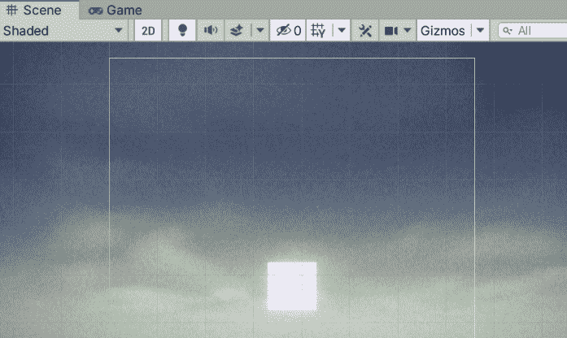

图 11.5 - 2D 编辑模式下的场景视图

1.  禁用**PPVolume**对象以禁用后期处理。最终的 UI 不会有后期处理，但编辑器视图仍然会应用它。记得稍后重新启用它：

图 11.6 – 禁用游戏对象—在这种情况下是后期处理体积

1.  启用（如果尚未启用）**RectTrasform**工具，这是 Unity 编辑器左上部的第五个按钮（或按*T*键）。这将启用矩形标尺，允许您移动、旋转和缩放二维元素。您可以使用通常的变换、旋转和缩放标尺，这些是我们在 3D 模式下使用的标尺，但矩形标尺会带来更少的麻烦，特别是在缩放方面:

图 11.7 – 矩形标尺按钮

1.  使用矩形标尺，拖动对象以移动它，使用蓝点改变其大小，或者将鼠标放在靠近蓝点的棘手位置以旋转它。请注意，使用这个标尺调整对象的大小并不等同于缩放对象，但稍后会详细介绍:

图 11.8 – 用于编辑二维元素的矩形标尺

1.  在检视器窗口中，注意在更改 UI 元素的大小后，`1`，`1`，`1`），但是您可以看到**宽度**和**高度**属性已经改变。**Rect Transform**本质上是一个经典的变换，但增加了**宽度**和**高度**（以及其他稍后要探索的属性）。您可以在这里设置以像素表示的确切值:

图 11.9 – 矩形变换属性

现在我们知道了如何定位任何 UI 对象的基础知识，让我们来探索可以添加到画布中的不同类型的元素。

# 画布对象类型

到目前为止，我们已经使用了最简单的画布对象类型—白色框，但是还有很多其他对象类型可以使用，比如图像、按钮、文本等等。它们都使用**RectTransform**来定义它们的显示区域，但每种对象都有自己的概念和配置需要理解。

在本节中，我们将探索以下画布对象的概念：

+   集成 UI 资产

+   创建 UI 控件

让我们首先开始探索如何集成图像和字体，以便在画布中使用它们，这样我们就可以使用图像和文本 UI 对象类型将它们集成到我们的 UI 中。

## 集成 UI 资产

在使我们的 UI 使用漂亮的图形资产之前，我们需要像往常一样将它们正确地集成到 Unity 中。在下面的截图中，您将找到我们在*第一章*中提出的 UI 设计，*从头开始设计游戏*:

图 11.10 – 第一章的 UI 设计

除此之外，我们还将添加一个暂停菜单，当用户按下*Esc*键时将被激活。它将如下截图所示：

图 11.11 – 暂停菜单设计

基于这些设计，我们可以确定我们将需要以下资产：

+   英雄的头像图像

+   生命值条图像

+   暂停菜单背景图像

+   暂停菜单按钮图像

+   文本的字体

像往常一样，我们可以在互联网上或者资产商店上找到所需的资产。在我的情况下，我会混合使用两者。让我们从最简单的一个开始—头像。采取以下步骤:

1.  从互联网上下载你想要的头像:

图 11.12 – 下载的头像资产

1.  将其添加到你的项目中，可以通过将其拖放到项目窗口中，或者使用`Sprites`文件夹。

1.  选择纹理，在检视器窗口中，将**纹理类型**设置为**精灵（2D 和 UI）**。所有纹理默认都准备用于 3D。此选项准备好所有用于 2D 的内容。

对于条形、按钮和窗口背景，我将使用资产商店寻找 UI 包。在我的情况下，我发现以下截图中的包是一个很好的开始我的 UI。通常情况下，请记住这个确切的包现在可能不可用。在这种情况下，请记住寻找另一个类似的包，或者从 GitHub 存储库中选择精灵：

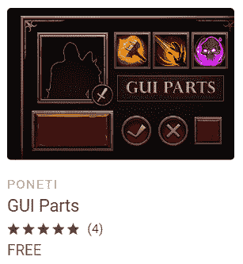

图 11.13 - 选择的 UI 包

首先，包含许多以精灵形式配置的图像，但我们可以进一步修改导入设置以实现高级行为，这是我们在按钮中需要的。按钮资产具有固定大小，但如果需要更大的按钮怎么办？一种选择是使用不同尺寸的其他按钮资产，但这将导致大量重复的按钮和其他资产，例如不同大小的背景用于不同的窗口，这将消耗不必要的 RAM。另一种选择是使用九片方法，这种方法包括将图像分割，使角落与其他部分分离。这允许 Unity 拉伸图像的中间部分以适应不同的大小，保持角落的原始大小，当与巧妙的图像结合时，可以用来创建几乎任何所需的大小。在下图中，您可以看到左下角有九片的形状，在同一图中的右下角，您可以看到形状被拉伸但保持其角落的原始大小。右上角显示了拉伸的形状没有片。您可以看到非切片版本被扭曲，而切片版本没有被扭曲：

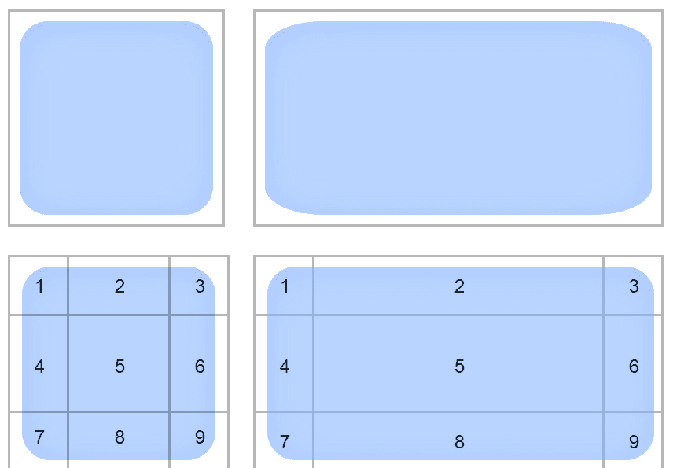

图 11.14 - 切片与非切片图像拉伸

在这种情况下，我们可以将九片应用于按钮和面板背景图像，以在游戏的不同部分使用它们。为了做到这一点，请执行以下操作：

1.  使用**窗口** | **包管理器**选项打开包管理器。

1.  验证`Unity Registry`：

图 11.15 - 包管理器中显示所有包

1.  安装**2D Sprite**包以启用精灵编辑工具（如果尚未安装）：

图 11.16 - 包管理器中的 2D Sprite 包

1.  在**项目**窗口中选择按钮精灵，然后单击**检查器**窗口中的**精灵编辑器**按钮：

图 11.17 - 检查器窗口中的精灵编辑器按钮

1.  在**精灵编辑器**窗口中，找到并拖动图像边缘的绿点以移动切片标尺。尝试确保切片不位于按钮边缘的中间。需要注意的一件事是，在我们的情况下，我们将使用三个切片而不是九个，因为我们的按钮不会在垂直方向上拉伸。

1.  单击窗口右上角的**应用**按钮，然后关闭它：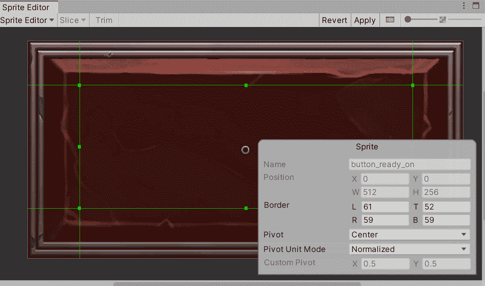

图 11.18 - 精灵编辑器窗口中的九片

1.  对**背景**面板重复相同的步骤。在我的情况下，您可以在以下截图中看到，这个背景并没有考虑到九片，因为图像的所有中间区域都可以变小，如果使用九片方法来拉伸它们，它们看起来会一样。因此，我们可以使用任何图像编辑工具对其进行编辑，或者暂时使用它：

图 11.19 - 精灵编辑器窗口中的九片

现在我们已经准备好我们的精灵，我们可以找到一个字体，这是一个非常简单的任务。只需下载任何`.ttf`或`.otf`格式的字体并将其导入 Unity，就可以了，无需进一步配置。您可以在互联网上找到许多好的免费字体网站。我习惯于使用经典的[DaFont.com](http://DaFont.com)网站，但还有很多其他网站可以使用。在我的情况下，我将使用以下字体：

图 11.20 - 我从 DaFont.com 选择的用于项目的字体

如果压缩文件包含多个字体文件，您可以将它们全部拖入 Unity，然后使用您最喜欢的字体。同样，尝试将字体放在名为“字体”的文件夹中。

现在我们已经准备好创建 UI 所需的所有资产，让我们探索不同类型的组件以创建所有所需的 UI 元素。

## 创建 UI 控件

几乎 UI 的每个部分都将是巧妙配置的图像和文本的组合。在本节中，我们将探索以下组件：

+   `图像`

+   `文本`

+   `按钮`

让我们开始探索**图像**。实际上，我们的 UI 中已经有一个图像 - 我们在本章前面创建的白色矩形。如果选择它并查看检查器窗口，您会注意到它有一个图像组件，就像以下截图中的一个：

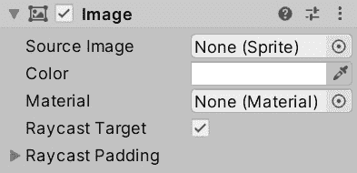

图 11.21 - 图像组件的检查器窗口

让我们开始探索该组件的不同设置，从我们的英雄头像开始。采取以下步骤：

1.  使用矩形图标，将白色矩形定位在 UI 的左上角：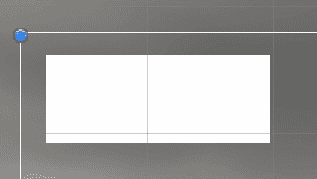

图 11.22 - 位于 UI 左上角的白色矩形

1.  在“源图像”属性中选择并拾取下载的英雄头像精灵：

图 11.23 - 设置我们的图像组件的精灵

1.  我们需要校正图像的纵横比以防止失真。做到这一点的一种方法是单击“图像”组件，使图像使用与原始精灵相同的大小。但是，通过这样做，图像可能会变得太大，因此您可以按*Shift*减小图像大小以修改“宽度”和“高度”值。另一种选择是选中“保持纵横比”复选框，以确保图像适合矩形而不会拉伸。在我的情况下，我将两者都使用：

图 11.24 - 保持纵横比和设置原生大小图像选项

现在，让我们通过以下步骤创建生命条：

1.  使用“GameObject”|“UI”|“图像”选项创建另一个“图像”组件。

1.  将“源图像”属性设置为您下载的生命条图像：

图 11.25 - 头像和生命条

1.  将“图像类型”属性设置为“填充”。

1.  将“填充方法”属性设置为“水平”。

1.  拖动“填充量”滑块，查看根据滑块值切割条的方式。当我们在书的第三部分编写生命系统时，我们将通过脚本更改该值，那里我们将编写自己的脚本：

图 11.26 - 填充量滑块，将图像宽度切割为其大小的 73%

1.  在我的情况下，条图像也带有条框，因此我将创建另一个图像，设置精灵，并将其定位在生命条顶部以形成框架。请记住，**层次结构**窗口中对象的顺序决定了它们绘制的顺序。因此，在我的情况下，我需要确保框架游戏对象在生命条图像下方：

图 11.27 – 将一个图像放在另一个图像上创建框架效果

1.  重复步骤 1 至 6，创建底部的基本条，或者只需复制并粘贴条和框架，并将其定位在屏幕底部：

图 11.28 – 两个条

1.  在**项目**窗口中单击“+”按钮，然后选择**Sprites** | **Square**选项。这将创建一个简单的方形精灵。这与下载一个*4 x 4*分辨率的全白图像并将其导入 Unity 相同。

1.  将精灵设置为基本条，而不是下载的条精灵。这一次，我们将使用一个纯白色的图像作为条的背景，因为在我的情况下，原始图像是红色的，将红色图像改为绿色是不可能的。然而，白色图像可以很容易地着色。考虑原始条的细节，例如，我的原始条中的小阴影在这里不会出现，但如果您想保留它，您应该获得一个带有该细节的白色条。

1.  选择基本生命条并将“颜色”属性设置为绿色：

图 11.29 – 带有方形精灵和绿色色调的条

1.  一个可选的步骤是将条框图像转换为九切片图像，以便我们可以更改原始宽度以适应屏幕。

现在，让我们通过以下方式为得分、子弹、剩余波数和剩余敌人标签添加文本字段：

1.  使用**GameObject** | **UI** | **Text**选项创建一个文本标签。这将是得分标签。

1.  将标签定位在屏幕的右上角。

1.  在“得分：0”中。

1.  设置为`20`。

1.  通过单击**Font**属性右侧的圆圈并选择所需的字体来应用下载的字体。

1.  检查“对齐”属性的水平对齐选项（最右边的选项）和垂直选项的中心选项：

图 11.30 – 文本标签的设置

1.  重复步骤 1 至 6，创建其他三个标签（或者只需将得分复制并粘贴三次）。对于“剩余波数”标签，您可以使用左对齐选项来更好地匹配原始设计：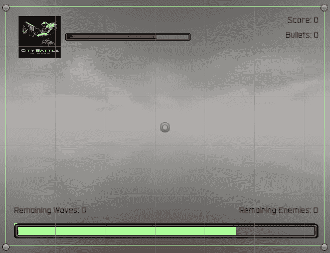

图 11.31 – 我们 UI 的所有标签

1.  将所有标签的颜色设置为白色，因为我们的场景主要是黑暗的。

现在我们已经完成了原始的 UI 设计，让我们通过以下方式创建暂停菜单：

1.  为菜单的背景创建一个“图像”组件（**GameObject** | **UI** | **Image**）。

1.  使用我们之前制作的九切片设置**Background**面板精灵。

1.  如果尚未这样做，请将“图像类型”属性设置为“切片”。此模式将应用九切片方法以防止角落拉伸。

1.  有可能图像会在任何情况下拉伸角落，这是因为有时角落相对于精灵的“每单位像素”值来说相当大，这将减小原始图像的比例，同时保留其分辨率。

在接下来的两个屏幕截图中，您可以看到背景图像的“每单位像素”值为`100`，然后再次为`700`。请记住，只有对于九切片或平铺图像类型，或者如果您没有艺术家为您调整它时，才能这样做：

图 11.32 - 顶部是一个小的 RectTransform 组件中的大九宫格图像，足够小以缩小角落，底部是将每单位像素设置为 700 的相同图像

1.  创建一个`文本`字段，将其放置在您的图表中想要暂停标签的位置，将其设置为显示暂停文本，并设置字体。请记住，您可以使用`Color`属性更改文本颜色。

1.  将文本字段拖放到背景图像上。**Canvas**中的父子关系系统工作原理相同 - 如果移动父级，则子级将随之移动。这样做的想法是，如果我们禁用面板，它也将禁用按钮和所有其内容：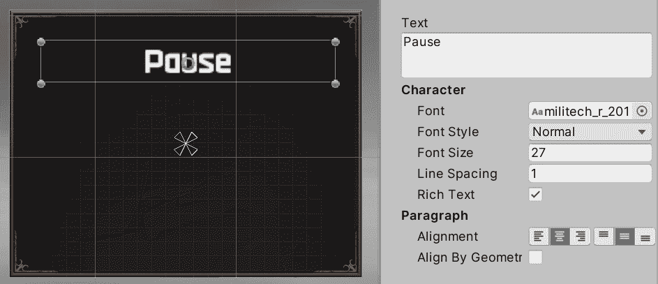

图 11.33 - 暂停标签

1.  通过转到**GameObject** | **UI** | **Button**来创建两个按钮。将它们放置在背景图像上的所需位置。

1.  通过将它们在**层次结构**窗口中拖动到**暂停**背景图像中，将它们设置为**暂停**背景图像的子级。

1.  选择按钮，并将它们的图像组件的`Source Image`属性设置为我们之前下载的按钮精灵。如果您遇到与之前相同的问题，请记住我们之前的**每单位像素**修复。

1.  您会注意到按钮本质上是一个带有子文本对象的图像。将两个按钮的文本分别更改为`恢复`和`退出`：

图 11.34 - 暂停菜单实现

1.  请记住，您可以通过取消顶部**检查器**窗口对象名称右侧复选框旁边的复选框来隐藏面板：

图 11.35 - 禁用游戏对象

正如您所看到的，您可以通过使用图像和文本组件来创建几乎任何类型的 UI。当然，还有更高级的组件可以让您创建按钮、文本字段、复选框、列表等，但让我们先从基础知识开始。需要注意的一点是，我们已经创建了按钮，但到目前为止它们什么也没做。在本书的*第三部分*中，我们将看到如何编写脚本使它们具有功能。

在本节中，我们讨论了如何导入图像和字体，通过图像、文本和按钮组件进行集成，以创建丰富和信息丰富的 UI。做到这一点后，让我们讨论如何使它们适应不同的设备。

# 创建响应式 UI

如今，几乎不可能在单一分辨率下设计 UI，我们的目标受众显示设备可能差异很大。PC 具有各种不同分辨率的显示器（如 1080p、4k 等）和不同的宽高比（如 16:9、16:10、超宽等），移动设备也是如此。我们需要准备我们的 UI 以适应最常见的显示器，Unity UI 具有所需的工具来实现这一点。

在本节中，我们将探讨以下 UI 响应性概念：

+   调整对象的位置

+   调整对象的大小

我们将探讨如何使用 Canvas 和**RectTransform**组件的高级功能（如锚点和缩放器）使 UI 元素能够适应不同的屏幕尺寸和位置。

## 调整对象的位置

现在，如果我们玩我们的游戏，我们会看到 UI 如何很好地适应我们的屏幕。但是，如果由于某种原因我们改变了**游戏**视图大小，我们会看到对象开始从屏幕上消失。在以下截图中，您可以看到不同大小的游戏窗口以及 UI 在一个窗口中看起来很好，但在其他窗口中看起来很糟糕：

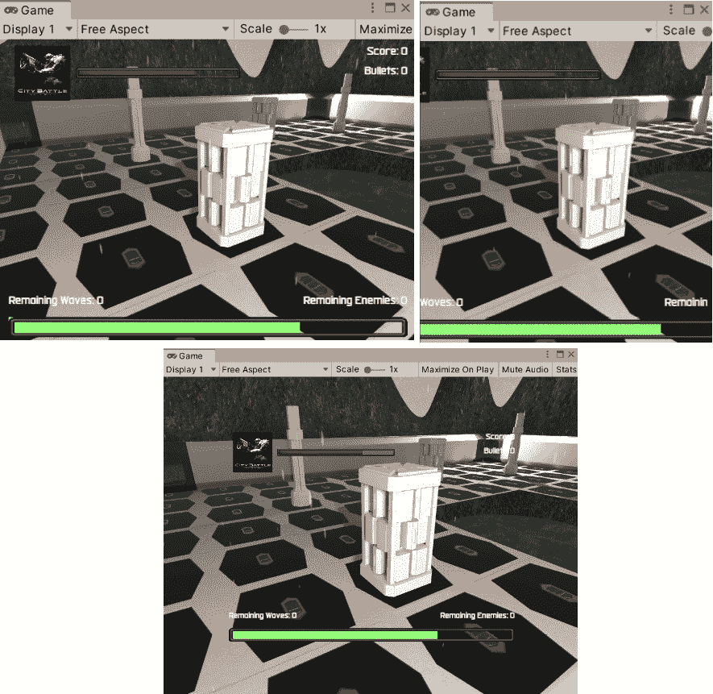

图 11.36 - 相同的 UI 但在不同的屏幕尺寸上

问题在于我们使用编辑器中的任何分辨率创建了 UI，但一旦我们稍微改变它，UI 就会保留先前分辨率的设计。此外，如果你仔细观察，你会注意到 UI 总是居中，比如在中间的图像中，UI 在两侧被裁剪，或者第三个图像中，屏幕边缘可见额外空间。这是因为 UI 中的每个元素都有自己的锚点，当你选择一个对象时，你可以看到一个小交叉点，就像下面的截图中所示：

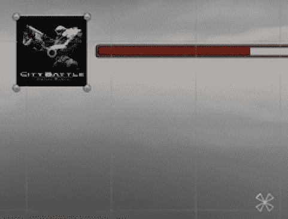

图 11.37 - 位于屏幕右下部分的英雄角色的锚点交叉

对象的 X 和 Y 位置是相对于该锚点的距离，而锚点相对于屏幕有一个位置，其默认位置是在屏幕的中心。这意味着在 800 x 600 的屏幕上，锚点将放置在 400 x 300 的位置，在 1920 x 1080 的屏幕上，锚点将位于 960 x 540 的位置。如果元素（RectTransform 中的元素）的 X 和 Y 位置为 0，则对象将始终与中心的距离为 0。在前三个示例的中间截图中，英雄角色超出了屏幕，因为它与中心的距离大于屏幕的一半，并且当前距离是基于先前更大的屏幕尺寸计算的。那么，我们能做些什么呢？移动锚点！

通过设置相对位置，我们可以将锚点放在屏幕的不同部分，并使屏幕的该部分成为我们的参考位置。对于我们的英雄角色，我们可以将锚点放在屏幕的左上角，以确保我们的角色与该角落的距离固定。我们可以通过以下方式实现：

1.  选择你的英雄角色。

1.  用鼠标将锚点交叉拖动到屏幕的左上角。如果由于某种原因，当你拖动它时锚点会分裂成几部分，撤消更改（按*Ctrl* + *Z*，或者在 macOS 上按*Command* + *Z*）并尝试通过点击中心来拖动它。我们稍后会打破锚点：

图 11.38 - 一个带有锚点的图像，位于屏幕的左上角

1.  将**生命条**对象和其框架的锚点放在同一位置。我们希望该条始终与该角落保持相同的距离，以便在屏幕大小改变时，它将随着英雄角色一起移动。

1.  对于**Boss Bar**对象，将锚点放在屏幕底部中心位置，这样它将始终居中。稍后，我们将调整其大小。

1.  将**剩余波数**标签放在左下角，**剩余敌人**放在右下角：

图 11.39 - 生命条和标签的锚点

1.  将**得分**和**子弹**锚点放在右上角：

图 11.40 - 得分和子弹标签的锚点

1.  选择任何元素，并用鼠标拖动 Canvas 矩形的边缘，以预览元素将如何适应它们的位置。请注意，你必须选择 Canvas 的直接子对象；按钮内的文本将没有这个选项：

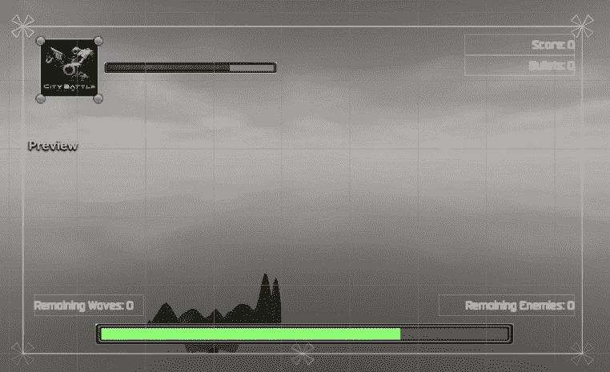

图 11.41 - 预览画布调整大小

现在我们的 UI 元素已经适应了它们的位置，让我们考虑对象大小必须适应的情况。

## 调整对象的大小

处理不同宽高比的第一件事是，我们的屏幕元素可能不仅会从它们的原始设计位置移动（我们在上一节中固定了），而且它们可能不适合原始设计。在我们的 UI 中，我们有生命条的情况，当我们在更宽的屏幕上预览时，条明显不适应屏幕宽度。我们可以通过打破我们的锚点来解决这个问题。

当我们打破我们的锚点时，对象的位置和大小被计算为相对于不同锚点部分的距离。如果我们水平分割锚点，我们将有左和右属性，而不是 X 和宽度属性，它们代表到左和右锚点的距离。我们可以这样使用：

1.  选择生命条，将锚点的左部分拖到屏幕的左部分，右部分拖到屏幕的右部分。

1.  对于生命条框架也是一样的：

图 11.42 - 生命条中的分隔锚点

1.  在检视器窗口中检查**Rect Transform**设置的**左**和**右**属性，它们代表当前到各自锚点的距离。如果你愿意，你可以添加一个特定的值，特别是如果你的生命条显示在屏幕外：

图 11.43 - 分隔锚点的左右属性

这样，对象将始终保持相对于屏幕的固定距离，即屏幕的两侧。如果你正在处理一个子对象，比如按钮的文本和图像组件，锚点是相对于父对象的。如果你注意到文本的锚点，它们不仅在水平方向上分割，而且在垂直方向上也分割。这允许文本根据按钮的大小调整位置，这样你就不必手动更改它：

图 11.44 - 按钮文本的分隔锚点

现在，这种解决方案并不适用于所有情况。让我们考虑一个情况，英雄头像显示的分辨率比它设计的要高。即使头像被正确放置，它也会显示得更小，因为屏幕的像素密度比其他分辨率更高。你可以考虑使用分隔锚点，但是在不同宽高比的屏幕上，宽度和高度锚点可能会以不同的比例进行缩放，所以原始图像会变形。相反，我们可以使用画布缩放器组件。

画布缩放器组件定义了在我们的场景中 1 像素的含义。如果我们的 UI 设计分辨率是 1080p，但我们在 4k 显示器上看到它（这是 1080p 分辨率的两倍），我们可以缩放 UI，使得一个像素变为 2，调整其大小以保持与原始设计相同的比例大小。基本上，这个想法是，如果屏幕更大，我们的元素也应该更大。

我们可以通过以下方式使用这个组件：

1.  选择**Canvas**对象，并在**检视器**窗口中找到**Canvas Scaler**组件。

1.  将**UI Scale Mode**属性设置为**Scale with Screen Size**。

1.  这对我们来说并不是问题，但是如果将来你和一个艺术家合作，将参考分辨率设置为艺术家创建 UI 的分辨率，记住它必须是最高目标设备分辨率。在我们的情况下，我们不确定下载资产的艺术家有没有考虑过分辨率，所以我们可以设置为`1920 x 1080`，这是全高清分辨率大小，现在非常常见。

1.  在这种情况下设置“宽度”值，因为屏幕的宽度可能会非常宽，比如超宽屏，如果我们选择了那个选项，那些屏幕会不必要地缩放 UI。另一个选项是将此值设置为`0.5`以考虑这两个值，但在 PC 上，这并没有太多意义。在移动设备上，您应该根据游戏的方向选择这个值，为横向模式设置高度，为纵向模式设置宽度。尝试预览更宽和更高的屏幕，看看这个设置是如何工作的：

图 11.45 - 带有标准 PC 游戏正确设置的画布缩放器

您会发现您的 UI 比原始设计要小，这是因为我们应该在之前设置这些属性。现在，唯一的解决办法是重新调整大小。下次尝试这个练习时要考虑到这一点；我们只是按照这个顺序进行学习。

在继续之前，请记得重新激活后期处理体积对象以再次显示这些效果。您会注意到 UI 在游戏视图中不受它们的影响。

重要提示：

如果您希望您的 UI 受到后期处理效果的影响，您可以设置为“-相机”。将主摄像机拖动到“渲染相机”属性，并将“平面距离”设置为`5`。这将使 UI 与其他对象一起放置在世界中，与相机视图对齐，距离为 5 米。

图 11.46 - 画布渲染模式设置为相机模式以接收后期处理效果

有了这些知识，现在您已经准备好开始自己创建您的第一个 UI 了。

# 总结

在本章中，我们介绍了 UI 的基础知识，理解了“图像”和“文本”，为我们的 UI 布局赋予生命，并使其对用户具有吸引力。最后，我们讨论了如何使 UI 对象适应不同的分辨率和宽高比，使我们的 UI 适应不同的屏幕尺寸，即使我们无法预测用户将在哪种显示器上玩游戏。

在下一章中，我们将开始看如何向我们的游戏中添加动画角色。
