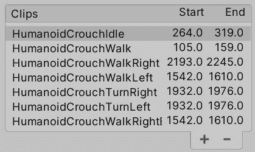
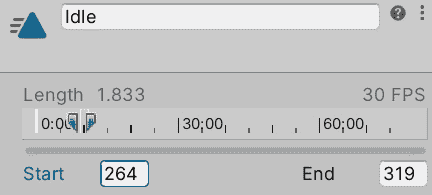
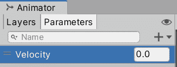
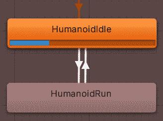
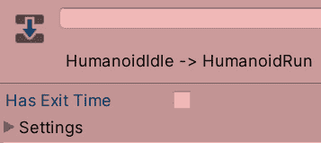
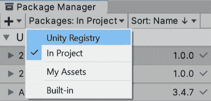
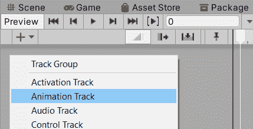
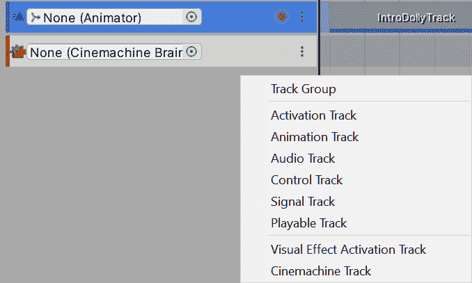
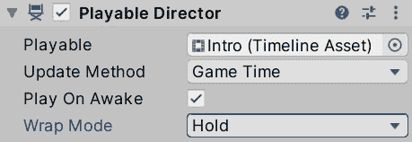

# 第十二章：使用动画师、电影机和时间轴创建动画

在我们当前的游戏状态下，除了考虑着色器和粒子动画外，我们大部分时间都处于静态场景中。在下一章中，当我们为游戏添加脚本时，一切都将根据我们想要的行为开始移动。但有时，我们需要以预定的方式移动对象，例如通过过场动画，或者特定的角色动画，例如跳跃、奔跑等。本章的目的是介绍几种 Unity 动画系统，以创建所有可能的对象运动，而无需脚本。

在本章中，我们将研究以下动画概念：

+   使用动画师进行骨骼动画

+   使用电影机创建动态摄像机

+   使用时间轴创建过场动画

通过本章结束时，您将能够创建过场动画来讲述游戏的故事或突出显示级别的特定区域，以及创建能够准确展示游戏外观的动态摄像机，无论情况如何。

# 使用动画师进行骨骼动画

到目前为止，我们使用的是静态网格，这些是实心的三维模型，不应该以任何方式弯曲或动画化（除了单独移动，如汽车的门）。我们还有另一种网格，称为蒙皮网格，它们具有根据骨骼弯曲的能力，因此可以模拟人体肌肉的运动。我们将探讨如何将动画人形角色整合到我们的项目中，以创建敌人和玩家的动作。

在本节中，我们将研究以下骨骼网格概念：

+   了解蒙皮

+   导入蒙皮网格

+   使用动画师控制器进行整合

我们将探讨蒙皮的概念以及它如何使您能够为角色添加动画。然后，我们将把动画网格引入我们的项目，最终对其应用动画。让我们从讨论如何将骨骼动画引入我们的项目开始。

## 了解蒙皮

为了获得动画网格，我们需要四个部分，从网格本身和将要进行动画的模型开始，这与任何其他网格的创建方式相同。然后，我们需要骨骼，这是一组骨骼，将与所需的网格拓扑匹配，例如手臂、手指、脚等。在*图 12.1*中，您可以看到一组骨骼与我们的目标网格对齐的示例。您会注意到这类网格通常是用*T*姿势建模的，这将有助于动画制作过程：

图 12.1 – 忍者网格与其默认姿势匹配的骨骼

一旦艺术家创建了模型及其骨骼，下一步就是进行蒙皮，即将模型的每个顶点与一个或多个骨骼相关联的过程。这样，当您移动骨骼时，相关的顶点也会随之移动。这样做是因为动画化少量骨骼比动画化模型的每个单独顶点更容易。在下一个截图中，您将看到网格的三角形根据受其影响的骨骼的颜色进行着色，以可视化骨骼的影响。您将注意到颜色之间的混合，这意味着这些顶点受不同骨骼的不同影响，以使关节附近的顶点能够很好地弯曲。此外，截图还说明了用于二维游戏的二维网格的示例，但概念是相同的：

图 12.2 – 网格蒙皮权重以颜色形式可视化表示

最后，你需要的最后一部分是实际的动画，它将简单地由网格的不同姿势混合而成。艺术家将在动画中创建关键帧，确定模型在不同时刻需要采取哪种姿势，然后动画系统将简单地在它们之间进行插值。基本上，艺术家将对骨骼进行动画处理，而蒙皮系统将把这个动画应用到整个网格上。你可以有一个或多个动画，之后你可以根据你想要匹配角色动作的动画来在它们之间切换（比如站立、行走、跌倒等）。

为了获得这四个部分，我们需要获取包含它们的适当资产。在这种情况下，通常的格式是**Filmbox**（**FBX**），这与我们迄今为止用来导入 3D 模型的格式相同。这种格式可以包含我们需要的每一部分——模型、带有蒙皮的骨骼和动画——但通常，我们会将部分拆分成多个文件以重复利用这些部分。

想象一个城市模拟游戏，我们有几个市民网格，外观各异，所有这些网格都必须进行动画处理。如果每个市民的单个 FBX 包含网格、蒙皮和动画，那么每个模型都会有自己的动画，或者至少是相同动画的克隆，重复出现。当我们需要更改动画时，我们需要更新所有网格市民，这是一个耗时的过程。与此相反，我们可以为每个市民准备一个 FBX，其中包含网格和骨骼，以及一个单独的 FBX 文件用于每个动画，其中包含所有市民都具有的相同骨骼和适当动画，但不包含网格。这将允许我们混合和匹配市民 FBX 和动画的 FBX 文件。也许你会想为什么模型 FBX 和动画 FBX 都必须有网格。这是因为它们需要匹配才能使两个文件兼容。在下一个截图中，你可以看到文件应该是什么样子的：

图 12.3 – 我们将在项目中使用的包的动画和模型 FBX 文件

另外，值得一提的是一个叫做重定向的概念。正如我们之前所说，为了混合模型和动画文件，我们需要它们具有相同的骨骼结构，这意味着相同数量的骨骼、层次结构和名称。有时，这是不可能的，特别是当我们混合我们的艺术家创建的自定义模型与使用动作捕捉技术从演员那里记录下来的外部动画文件，或者只是购买一个 Mocap 库。在这种情况下，很可能会遇到 Mocap 库中的骨骼结构与您的角色模型不同，这就是重定向发挥作用的地方。这种技术允许 Unity 创建两种不同的仅限于人形的骨骼结构之间的通用映射，使它们兼容。一会儿，我们将看到如何启用这个功能。

现在我们了解了有关蒙皮网格的基础知识，让我们看看如何获取带有骨骼和动画的模型资产。

## 导入骨骼动画

让我们从如何从资产商店导入一些带有动画的模型开始，在**3D** | **Characters** | **Humanoids**部分。你也可以使用外部网站，比如 Mixamo，来下载它们。但现在，我会坚持使用资产商店，因为你在使资产工作时会遇到更少的麻烦。在我的情况下，我已经下载了一个包，正如你在下面的截图中所看到的，其中包含了模型和动画。

请注意，有时您需要单独下载它们，因为某些资产将仅为模型或动画。另外，请注意，本书中使用的软件包可能在您阅读时不可用；在这种情况下，您可以寻找另一个具有类似资产（角色和动画）的软件包，或者从书的 GitHub 存储库中下载项目文件，并从那里复制所需的文件：

图 12.4 - 我们游戏的士兵模型

在我的包内容中，我可以在`Animations`文件夹中找到动画的 FBX 文件，而在`Model`中找到单个模型的 FBX 文件。请记住，有时您不会将它们分开，动画可能位于与模型相同的 FBX 中，如果有任何动画的话。现在我们有了所需的文件，让我们讨论如何正确配置它们。

让我们开始选择**模型**文件并检查**骨骼**选项卡。在此选项卡中，您将找到一个名为**动画类型**的设置，如下图所示：

图 12.5 - 骨骼属性

此属性包含以下选项：

+   **无**：非动画模型的模式；您游戏中的每个静态网格将使用此模式。

+   **传统**：用于旧 Unity 项目和模型的模式；不要在新项目中使用此模式。

+   通用：一种新的动画系统，可以用于各种模型，但通常用于非人形模型，如马、章鱼等。如果使用此模式，模型和动画 FBX 文件必须具有完全相同的骨骼名称和结构，从而减少了来自外部来源的动画组合的可能性。

+   **人形**：设计用于人形模型的新动画系统。它启用了重新定位和**反向运动学**（**IK**）等功能。这使您能够将具有不同骨骼的模型与动画结合，因为 Unity 将在这些结构和一个通用结构之间创建映射，称为阿凡达。请注意，有时自动映射可能会失败，您将需要手动更正；因此，如果您的通用模型具有您需要的一切，我建议您坚持使用**通用**，如果那是 FBX 的默认配置。

在我的情况下，我的软件包中的 FBX 文件的模式设置为**Humanoid**，所以很好，但请记住，只有在绝对必要时才切换到其他模式（例如，如果您需要组合不同的模型和动画）。现在我们已经讨论了**骨骼**设置，让我们谈谈**动画**设置。

为此，请选择任何动画 FBX 文件，并查找检视器窗口中的**动画**部分。您会发现几个设置，例如**导入动画**复选框，如果文件有动画（而不是模型文件），必须标记该复选框，以及**剪辑**列表，您将在其中找到文件中的所有动画。在下面的截图中，您可以看到我们一个动画文件的**剪辑**列表：

图 12.6 - 动画设置中的剪辑列表

带有动画的 FBX 文件通常包含单个大动画轨道，其中可以包含一个或多个动画。无论如何，默认情况下，Unity 将基于该轨道创建单个动画，但如果该轨道包含多个动画，则您需要手动拆分它们。在我们的情况下，我们的 FBX 已经由软件包创建者拆分为多个动画，但为了学习如何手动拆分，请执行以下操作：

1.  从`HumanoidCrouchIdle`。

1.  看一下动画时间轴下方的**开始**和**结束**值，并记住它们；我们将使用它们来重新创建此剪辑：

图 12.7 - 剪辑设置

1.  单击**片段**列表底部右侧的减号按钮以删除所选的片段。

1.  使用加号按钮创建一个新的片段并选择它。

1.  使用`Take 001`输入字段将其重命名为与原始名称类似的内容。在我的例子中，我会将其命名为`空闲`。

1.  将**开始**设置为`319`，将`结束`设置为`264`。这些信息通常来自艺术家，但您可以尝试最适合的数字，或者简单地在时间轴上拖动蓝色标记到这些属性上。

1.  您可以通过单击检视器窗口底部的标题栏上的条形图来预览片段，然后单击播放按钮来预览您的动画（在我的例子中是**HumanoidIdle**）。您将看到默认的 Unity 模型，但是您可以通过将模型文件拖放到预览窗口中来查看自己的模型，因为检查我们的模型是否正确配置是很重要的。如果动画没有播放，您需要检查**动画类型**设置是否与动画文件匹配：

图 12.8 - 动画预览

现在，打开动画文件，单击箭头，然后检查子资产。您会看到这里有一个与您的动画标题相对应的文件，以及剪辑列表中的其他动画，其中包含了剪辑。一会儿，我们将播放它们。在下面的截图中，您可以看到我们`.fbx`文件中的动画：

图 12.9 - 生成的动画片段

现在我们已经介绍了基本配置，让我们看看如何集成动画。

## 使用动画控制器进行集成

在为角色添加动画时，我们需要考虑动画的流程，这意味着考虑必须播放哪些动画，每个动画何时处于活动状态，以及动画之间的过渡应该如何发生。在以前的 Unity 版本中，您需要手动编写复杂的 C#代码脚本来处理复杂的情景；但现在，我们有了动画控制器。

动画控制器是基于状态机的资产，我们可以使用名为**动画师**的可视编辑器来绘制动画之间的转换逻辑。其思想是每个动画都是一个状态，我们的模型将有多个状态。一次只能激活一个状态，因此我们需要创建转换来改变它们，这些转换将具有必须满足的条件才能触发转换过程。条件是关于要进行动画的角色的数据的比较，例如其速度、是否在射击或蹲下等。

因此，动画控制器或状态机基本上是一组带有转换规则的动画，它将决定哪个动画应处于活动状态。让我们通过以下步骤开始创建一个简单的动画控制器：

1.  点击“播放器”。记得将您的资产放在一个文件夹中以便进行适当的组织；我会把我的称为“动画师”。

1.  双击资产以打开**动画师**窗口。不要将此窗口与**动画**窗口混淆；**动画**窗口有不同的功能。

1.  将您角色的**空闲**动画片段拖放到**动画师**窗口中。这将在控制器中创建一个框，表示将连接到控制器的默认动画，因为这是我们拖动的第一个动画。如果您没有**空闲**动画，我建议您找一个。我们至少需要一个**空闲**和一个行走/奔跑的动画片段：

图 12.10 - 从 FBX 资产中拖动动画片段到动画控制器

1.  以相同的方式拖动奔跑动画。

1.  右键点击**Idle**动画，选择**Create Transition**，然后左键点击**Run**动画。这将在**Idle**和**Run**之间创建一个过渡。

1.  以相同的方式从**Run**到**Idle**创建另一个过渡：

图 12.11 – 两个动画之间的过渡

过渡必须有条件，以防止动画不断切换，但为了创建条件，我们需要数据进行比较。我们将向我们的 Controller 添加属性，这些属性将代表过渡所使用的数据。稍后在*第三部分*中，我们将设置这些数据以匹配对象的当前状态。但现在，让我们创建数据并测试 Controller 对不同值的反应。为了基于属性创建条件，做如下操作：

1.  点击**Animator**窗口左上角的**Parameters**选项卡。如果你没有看到它，点击交叉眼按钮显示选项卡。

1.  点击`Velocity`。如果你错过了重命名部分，只需左键点击变量并重命名：

图 12.12 – 具有浮点速度属性的参数选项卡

1.  在检查器窗口中点击`Conditions`属性。

1.  点击`0`。这告诉我们过渡将从`0`执行。我建议你设置一个稍高一点的值，比如`0.01`，以防止任何浮点舍入错误（常见的 CPU 问题）。还要记住，**Velocity**的实际值需要通过脚本手动设置，这将在*第三部分*中进行：

图 12.13 – 检查速度是否大于 0.01 的条件

1.  对`0.01`做同样的操作：

图 12.14 – 检查值是否小于 0.01 的条件

现在我们已经设置好了第一个 Animator Controller，是时候将它应用到一个对象上了。为了做到这一点，我们需要一系列的组件。首先，当我们有一个动画角色时，我们使用蒙皮网格渲染器而不是普通的网格渲染器。如果你将角色模型拖到场景中并探索它的子级，你会看到一个组件，如下所示：

图 12.15 – 一个蒙皮网格渲染器组件

这个组件将负责将骨骼的移动应用到网格上。如果你搜索模型的子级，你会发现一些骨骼；你可以尝试旋转、移动和缩放它们，以查看效果，如下面的截图所示。请注意，如果你从资产商店下载了另一个包，你的骨骼层次结构可能与我的不同：

图 12.16 – 旋转颈骨

我们需要的另一个组件是**Animator**，它会自动添加到其根 GameObject 的蒙皮网格上。这个组件将负责应用我们在 Animator Controller 中创建的状态机，如果动画 FBX 文件按照我们之前提到的方式正确配置的话。为了应用 Animator Controller，做如下操作：

1.  如果场景中还没有角色模型，将角色模型拖到场景中。

1.  选择它并定位根 GameObject 中的**Animator**组件。

1.  点击**Controller**属性右侧的圆圈，选择之前创建的**Player**控制器。你也可以直接从项目窗口拖动它。

1.  确保**Avatar**属性设置为 FBX 模型内的 avatar；这将告诉动画师我们将使用该骨架。您可以通过其人物图标来识别 avatar 资源，如下面的屏幕截图所示。通常，当您将 FBX 模型拖到场景中时，此属性会自动正确设置：

图 12.17 - 动画师使用玩家控制器和机器人 avatar

1.  将**Camera**游戏对象设置为朝向玩家并播放游戏，您将看到角色执行其**Idle**动画。

1.  在不停止游戏的情况下，再次通过双击打开动画控制器资源，并在**Hierarchy**窗格中选择角色。通过这样做，您应该看到该角色正在播放的动画的当前状态，使用条形图表示动画的当前部分：

图 12.18 - 在选择对象时播放模式下的动画控制器，显示当前动画及其进度

1.  使用`1.0`并查看转换的执行方式：

图 12.19 - 设置控制器的速度以触发转换

根据**Run**动画的设置方式，您的角色可能会开始移动。这是由根动作引起的，这是一个根据动画移动角色的功能。有时这是有用的，但由于我们将完全使用脚本移动角色，我们希望关闭该功能。您可以通过取消**Character**对象的**Animator**组件中的**Apply Root Motion**复选框来实现。:

图 12.20 - 禁用根动作

1.  您还会注意到更改**Velocity**值和动画转换开始之间存在延迟。这是因为默认情况下，Unity 会等待原始动画结束后再执行转换，但在这种情况下，我们不希望如此。我们需要立即开始转换。为了做到这一点，选择控制器的每个转换，并在检查器窗口中取消选中**Has Exit Time**复选框：

图 12.21 - 取消“具有退出时间”复选框以立即执行转换

您可以开始将其他动画拖入控制器并创建复杂的动画逻辑，例如添加跳跃、下落或蹲伏动画。我邀请您尝试其他参数类型，例如布尔值，它使用复选框而不是数字。此外，随着游戏的进一步开发，您的控制器将增加其动画数量。为了管理它，还有其他值得研究的功能，例如混合树和子状态机，但这超出了本书的范围。

现在我们了解了 Unity 中角色动画的基础知识，让我们讨论如何创建动态摄像机动画来跟随我们的玩家。

# 使用 Cinemachine 创建动态摄像机

摄像机在视频游戏中是一个非常重要的主题。它们允许玩家看到周围的环境，以便根据所见做出决策。游戏设计师通常定义其行为方式，以获得他们想要的确切游戏体验，这并不容易。必须层叠许多行为才能获得确切的感觉。此外，在过场动画期间，控制摄像机将要穿越的路径以及摄像机的焦点是重要的，以便在这些不断移动的场景中聚焦动作。

在本章中，我们将使用 Cinemachine 软件包创建两个动态摄像机，这些摄像机将跟随玩家的动作，我们将在*第三部分*中编写，并且还将用于过场动画中使用的摄像机。

在本节中，我们将研究以下 Cinemachine 概念：

+   创建摄像机行为

+   创建摄影机轨道

让我们首先讨论如何创建一个 Cinemachine 控制的摄像机，并在其中配置行为。

创建摄像机行为

Cinemachine 是一组不同的行为，可以用于摄像机中，当正确组合时可以生成各种常见的视频游戏摄像机类型，包括从后面跟随玩家，第一人称摄像机，俯视摄像机等。为了使用这些行为，我们需要了解大脑和虚拟摄像机的概念。

在 Cinemachine 中，我们将只保留一个主摄像机，就像我们迄今为止所做的那样，该摄像机将由虚拟摄像机控制，这些虚拟摄像机是分开的游戏对象，具有先前提到的行为。我们可以有几个虚拟摄像机，并且可以随意在它们之间切换，但是活动虚拟摄像机将是唯一控制我们主摄像机的摄像机。这对于在游戏的不同点之间切换摄像机非常有用，例如在我们玩家的第一人称摄像机之间切换。为了使用虚拟摄像机控制主摄像机，它必须具有**Brain**组件。

要开始使用 Cinemachine，首先我们需要从软件包管理器中安装它，就像我们之前安装其他软件包一样。如果您不记得如何做到这一点，只需执行以下操作：

1.  转到**窗口** | **软件包管理器**。

1.  确保窗口左上角的**软件包**选项设置为**Unity Registry**：

图 12.22 – 软件包过滤模式

1.  等待左侧面板从服务器中填充所有软件包（需要互联网）。

1.  查找列表中的**Cinemachine**软件包并选择它。在撰写本书时，我们使用的是 Cinemachine 2.6.0。

1.  单击屏幕右下角的**安装**按钮。

让我们开始创建一个虚拟摄像机来跟随我们之前制作的角色，这将是我们的玩家英雄。执行以下操作：

1.  单击`CM vcam1`：

图 12.23 – 虚拟摄像机创建

1.  如果您从`CinemachineBrain`组件中选择了主摄像机，那么我们的主摄像机将自动添加到其中，使我们的主摄像机跟随虚拟摄像机。尝试移动创建的虚拟摄像机，您将看到主摄像机如何跟随它：

图 12.24 – CinemachineBrain 组件

1.  选择虚拟摄像机，并将角色拖动到 Cinemachine 虚拟摄像机组件的**跟随**和**看向**属性中。这将使移动和观察行为使用该对象来完成它们的工作：

图 12.25 – 设置我们摄像机的目标

1.  您可以看到`0`，`3`和`-3`）值：

图 12.26 – 摄像机从后面跟随角色

1.  图 12.26 显示`0`，`1.5`和`0`很好地使摄像机看向胸部：

图 12.27 – 改变瞄准偏移

正如您所看到的，使用 Cinemachine 非常简单，在我们的情况下，默认设置大多已经足够满足我们需要的行为。但是，如果您探索其他**Body**和**Aim**模式，您会发现您可以为任何类型的游戏创建任何类型的摄像机。我们不会在本书中涵盖其他模式，但我强烈建议您查看 Cinemachine 的文档，以了解其他模式的功能。要打开文档，请执行以下操作：

1.  通过转到**窗口** | **包管理器**来打开包管理器。

1.  在左侧列表中找到**Cinemachine**。如果没有显示，请稍等一会。请记住，您需要互联网连接才能使用它。

1.  一旦选择了**Cinemachine**，请查找蓝色的**查看文档**链接。单击它：

图 12.28 - Cinemachine 文档链接

1.  您可以使用左侧的导航菜单来探索文档：

图 12.29 - Cinemachine 文档

就像您在 Cinemachine 中所做的那样，您也可以以同样的方式找到其他软件包的文档。现在我们已经实现了我们需要的基本摄像机行为，让我们探索如何使用 Cinemachine 为我们的开场动画创建摄像机。

## 创建推车轨道

当玩家开始关卡时，我们希望有一个小的过场动画，展示我们的场景和战斗之前的基地。这将需要摄像机沿着固定路径移动，这正是 Cinemachine 的推车摄像机所做的。它创建了一个我们可以附加虚拟摄像机的路径，以便它会跟随它。我们可以设置 Cinemachine 自动沿着轨道移动或者跟随目标到轨道最近的点；在我们的情况下，我们将使用第一个选项。

为了创建推车摄像机，请执行以下操作：

1.  让我们开始用一个推车创建轨道，这是一个小物体，将沿着轨道移动，这将是摄像机跟随的目标。要做到这一点，请单击**Cinemachine** | **创建带有推车的推车轨道**：

图 12.30 - 默认直线路径的推车摄像机

1.  如果选择`DollyTrack1`对象，您可以看到两个带有数字`0`和`1`的圆圈。这些是轨道的控制点。选择其中一个并像移动其他对象一样移动它，使用平移图标的箭头。

1.  您可以通过单击`DollyTrack1`对象的`CinemachineSmoothPath`组件来创建更多的控制点：

图 12.31 - 添加路径控制点

1.  创建尽可能多的航点，以创建一个将在开场动画中遍历您希望摄像机监视的区域的路径。请记住，您可以通过单击它们并使用平移图标来移动航点：

图 12.32 - 我们场景中的推车轨道。它在角色的后面结束

1.  创建一个新的虚拟摄像机。创建后，如果您转到**游戏**视图，您会注意到角色摄像机将处于活动状态。为了测试新摄像机的外观，选择它并在检查器窗口中单击**独奏**按钮：

图 12.33 - 在编辑时临时启用虚拟摄像机的“独奏”按钮

1.  设置我们之前使用轨道创建的`DollyCart1`对象。

1.  将`0`，`0`和`0`设置为使摄像机保持在与推车相同的位置。

1.  将**Aim**设置为**与跟随目标相同**，使摄像机朝着相同的方向看，这将跟随轨道曲线：

图 12.34 – 配置使虚拟相机跟随推车轨道

1.  选择**DollyCart1**对象，并更改**位置**值，以查看推车沿着轨道移动的情况。在游戏窗口聚焦且**CM vcam2**处于独立模式时执行此操作，以查看相机的外观：

图 12.35 – 推车组件

有了正确设置的推车轨道，我们可以使用**时间轴**来创建我们的剧情场景。

# 使用时间轴创建剧情场景

我们有我们的开场相机，但这还不足以创建一个剧情场景。一个合适的剧情场景是一系列在应该发生的确切时刻发生的动作，协调多个对象以按预期方式行动。我们可以有启用和禁用对象、切换相机、播放声音、移动对象等动作。为此，Unity 提供了**时间轴**，这是一个协调这种类型剧情场景的动作的序列器。我们将使用**时间轴**为我们的场景创建一个开场剧情，展示游戏开始前的关卡。

在本节中，我们将研究以下时间轴概念：

+   创建动画剪辑

+   安排我们的开场剧情

我们将看到如何在 Unity 中创建自己的动画剪辑，以动画我们的游戏对象，然后将它们放入一个剧情场景中，使用时间轴序列工具协调它们的激活。让我们开始创建一个相机动画，以便稍后在时间轴中使用。

## 创建动画剪辑

这实际上不是时间轴特定的功能，而是一个与时间轴很好配合的 Unity 功能。当我们下载角色时，它带有使用外部软件创建的动画剪辑，但您可以使用 Unity 的**动画**窗口创建自定义动画剪辑。不要将其与**动画师**窗口混淆，后者允许我们创建根据游戏情况做出反应的动画过渡。这对于创建您稍后将在时间轴中与其他对象的动画协调的小对象特定动画非常有用。

这些动画可以控制对象组件属性的任何值，例如位置、颜色等。在我们的情况下，我们想要动画推车轨道的**位置**属性，使其在给定时间内从起点到终点。为了做到这一点，请执行以下操作：

1.  选择`DollyCart1`对象。

1.  打开**动画**（而不是**动画师**）窗口，方法是转到**窗口** | **动画** | **动画**。

1.  单击**动画**窗口中心的**创建**按钮。记住在选择推车（而不是轨道）时执行此操作：

图 12.36 – 创建自定义动画剪辑

1.  完成此操作后，系统将提示您在某个位置保存动画剪辑。我建议您在项目中（在`Assets`文件夹内）创建一个`Animations`文件夹，并将其命名为`IntroDollyTrack`。

如果你注意到，推车现在有一个带有创建的动画控制器的**动画师**组件，其中包含我们刚刚创建的动画。与任何动画剪辑一样，您需要将其应用到具有动画控制器的对象上；自定义动画也不例外。所以，**动画**窗口为您创建了它们。

在此窗口中进行动画操作包括在给定时刻指定其属性的值。在我们的情况下，我们希望在动画的开始时在时间轴的第 0 秒处为`0`，并在动画结束时在第`5`秒处为`240`。我选择了`240`，因为这是我的手推车的最后可能位置，但这取决于您的手推车轨道的长度。只需测试一下您的最后可能位置是什么。此外，我选择第`5`秒，因为我觉得这是动画的正确长度，但随时可以根据需要进行更改。现在，在动画的`0`和`5`秒之间发生的任何事情都是`0`和`240`值的插值，这意味着在`2.5`秒时，值为`120`。动画始终包括在不同时刻对对象的不同状态进行插值。

为了做到这一点，执行以下操作：

1.  在**动画**窗口中，单击记录按钮（位于左上角的红色圆圈）。这将使 Unity 检测对象的任何更改并将其保存到动画中。记得在选择手推车时进行此操作。

1.  设置`1`，然后设置为`0`。将其更改为任何值，然后再次更改为`0`将创建一个关键帧，这是动画中的一个点，表示在`0`秒时，我们希望`0`。如果值已经为`0`，则首先将其设置为任何其他值。您会注意到**位置**属性已添加到动画中：

图 12.37 - 在将位置值更改为 0 后，记录模式下的动画

1.  使用鼠标滚轮，将时间轴向右缩小到顶部栏的`5`秒：

图 12.38 - 显示 5 秒的动画窗口时间轴

1.  单击时间轴顶部的`5`秒标签，将播放头定位到该时刻。这将定位我们在该时刻进行的下一个更改。

1.  设置`240`。记得将**动画**窗口设置为**记录**模式：

图 12.39 - 在动画的第 5 秒创建一个值为 240 的关键帧

1.  点击`CM vcam2`左上角的播放按钮，它处于独奏模式。

现在，如果我们点击播放，动画将开始播放，但这并不是我们想要的。在这种情况下，想法是将过场动画的控制权交给过场动画系统 Timeline，因为这个动画不是我们需要在过场动画中进行排序的唯一内容。防止**Animator**组件自动播放我们创建的动画的一种方法是在控制器中创建一个空动画状态，并通过以下方式将其设置为默认状态：

1.  搜索我们创建动画时创建的动画控制器并打开它。如果找不到它，只需选择手推车，然后双击我们游戏对象的**Animator**组件的**Controller**属性以打开资产。

1.  在控制器中的空状态上右键单击，然后选择**创建状态** | **空**。这将在状态机中创建一个新状态，就好像我们创建了一个新动画，但这次是空的：

图 12.40 - 在动画控制器中创建一个空状态

1.  右键单击**新状态**，然后单击**设置为层默认状态**。状态应变为橙色：

图 12.41 - 将控制器的默认动画更改为空状态

1.  现在，如果点击播放，由于我们手推车的默认状态为空，不会播放任何动画。

现在我们已经创建了我们的摄像机动画，让我们开始创建一个通过时间轴从 intro 片段摄像机切换到玩家摄像机的片段。

## 对我们的 intro 片段进行排序

时间轴已经安装在您的项目中，但是如果您转到时间轴的包管理器，您可能会看到一个“更新”按钮，以获取最新版本，如果您需要一些新功能。在我们的情况下，我们将保留包含在我们项目中的默认版本（在撰写本书时为 1.3.4）。

我们要做的第一件事是创建一个片段资产和一个负责播放它的场景中的对象。要做到这一点，请按照以下步骤进行：

1.  使用“GameObject” | “Create Empty”选项创建一个空的 GameObject。

1.  选择空对象并将其命名为“导演”。

1.  转到“窗口” | “排序” | “时间轴”以打开“时间轴”编辑器。

1.  在“导演”对象被选中时，单击“时间轴”窗口中间的“创建”按钮，将该对象转换为片段播放器（或导演）。

1.  完成此操作后，将弹出一个窗口询问您保存文件。这个文件将是片段或时间轴；每个片段将保存在自己的文件中。将其保存在项目中的`Cutscenes`文件夹中（`Assets`文件夹）。

1.  现在，您可以看到“导演”对象具有“可播放导演”组件，并且在“可播放”属性中设置了上一步保存的“Intro”片段资产，这意味着这个片段将由导演播放：

图 12.42 - 准备播放 Intro 时间轴资产的可播放导演

现在我们已经准备好使用时间轴资产进行工作，让我们让它排序动作。首先，我们需要排序两件事 - 首先是我们在上一步中做的 cart 位置动画，然后是 dolly 轨道摄像机（CM vcam2）和玩家摄像机（CM vcam1）之间的摄像机切换。正如我们之前所说，片段是在给定时刻执行的一系列动作，为了安排动作，您需要轨道。在时间轴中，我们有不同类型的轨道，每种轨道都允许您在特定对象上执行某些动作。我们将从动画轨道开始。

动画轨道将控制特定对象播放哪个动画；我们需要为每个要进行动画处理的对象创建一个轨道。在我们的情况下，我们希望 dolly 轨道播放我们创建的“Intro”动画，所以让我们这样做：

1.  右键单击时间轴编辑器的左侧并单击“动画轨道”创建动画轨道：

图 12.43 - 创建动画轨道

1.  选择“导演”对象并检查检查器窗口中“可播放导演”组件的“绑定”列表。

1.  拖动“Cart”对象以指定我们希望动画轨道控制其动画：

图 12.44 - 使动画轨道控制 dolly cart 动画

重要提示：

时间轴是一个通用资产，可以应用到任何场景，但是由于轨道控制特定对象，您需要在每个场景中手动绑定它们。在我们的情况下，我们有一个期望控制单个动画师的动画轨道，因此在每个场景中，如果我们想应用这个片段，我们需要将特定的动画师拖放到“绑定”列表中。

1.  将我们创建的“Intro”动画资产拖放到“时间轴”窗口中的动画轨道中。这将在轨道中创建一个剪辑，显示动画将播放的时间和持续时间。您可以将许多动画拖放到轨道中，以便在不同时刻对不同动画进行排序；但是现在，我们只需要这一个：

图 12.45 – 使动画师轨道播放介绍剪辑

1.  你可以拖动动画来改变你想要它播放的确切时刻。将它拖到轨道的开头。

1.  点击**时间轴**窗口左上角的播放按钮来查看它的运行情况。你也可以手动拖动**时间轴**窗口中的白色箭头来查看不同时刻的过场动画：

图 12.46 – 播放时间轴并拖动播放头

重要提示：

请记住，你不需要使用时间轴来播放动画。在这种情况下，我们是这样做的，以便精确控制我们希望动画播放的时刻。你也可以使用脚本来控制动画师。

现在，我们将使我们的介绍时间轴资产告诉`CinemachineBrain`组件（主摄像头）在过场动画的每个部分时使用哪个摄像头，一旦摄像头动画结束就切换到玩家摄像头。我们将创建第二个轨道—Cinemachine 轨道—专门用于使特定的`CinemachineBrain`组件在不同的虚拟摄像头之间切换。要做到这一点，请按照以下步骤进行：

1.  右键单击动画轨道下方的空白处，然后单击**Cinemachine 轨道**。请注意，你可以安装不带 Cinemachine 的时间轴，但在这种情况下，这种轨道不会显示出来：

图 12.47 – 创建新的 Cinemachine 轨道

1.  在**Playable Director**组件的**Bindings**列表中，将主摄像头拖到**Cinemachine 轨道**，以使该轨道控制在过场动画的不同时刻哪个虚拟摄像头将控制主摄像头：

图 12.48 – 使 Cinemachine 轨道控制我们场景的主摄像头

1.  下一步指示了时间轴的特定时刻将使用哪个虚拟摄像头。为此，我们的 Cinemachine 轨道允许我们将虚拟摄像头拖到其中，这将创建虚拟摄像头剪辑。按顺序将**CM vcam2**和**CM vcam1**拖到 Cinemachine 轨道中：

图 12.49 – 拖动虚拟摄像头到 Cinemachine 轨道

1.  如果你点击播放按钮或者只是拖动**时间轴播放**头，你可以看到当播放头到达第二个虚拟摄像头剪辑时，活动虚拟摄像头是如何改变的。记得在**游戏**视图中查看。

1.  如果你将鼠标放在剪辑的末端附近，会出现一个调整大小的光标。如果你拖动它们，你可以调整剪辑的持续时间。在我们的情况下，我们需要将**CM vcam2**剪辑的长度与**Cart**动画剪辑匹配，然后通过拖动将**CM vcam1**放在其末端，这样当手推车动画结束时摄像头就会激活。在我的情况下，它们已经是相同的长度，但是尝试改变一下也是练习。另外，你可以使**CM vcam1**剪辑变短；我们只需要它播放几个时刻来执行摄像头切换。

1.  你也可以让剪辑有一点重叠，以使两个摄像头之间有一个平滑的过渡，而不是一个突然的切换，这看起来会很奇怪：

图 12.50 – 调整大小和重叠剪辑以插值它们

如果你等待完整的过场动画结束，你会注意到在最后，`CinemachineBrain`组件会选择具有最高**优先级**值的虚拟摄像机。我们可以更改虚拟摄像机的**优先级**属性，以确保**CM vcam1**（玩家摄像机）始终是最重要的，或者将**Playable Director**组件的**包裹模式**设置为**保持**，这将保持一切，就像时间轴的最后一帧指定的那样。

在我们的案例中，我们将使用后一种选项来测试时间轴特定的功能：

图 12.51 - 包裹模式设置为保持模式

大多数不同类型的轨道都遵循相同的逻辑；每个轨道将控制特定对象的特定方面，使用剪辑在设定的时间内执行。我鼓励你测试不同的轨道，看看它们的作用，比如**激活**，它可以在过场动画期间启用和禁用对象。记住，你可以在包管理器中查看时间轴包的文档。

# 总结

在本章中，我们介绍了 Unity 提供的不同动画系统，以满足不同的需求。我们讨论了导入角色动画并使用动画控制器控制它们的方法。我们还看到了如何制作可以根据游戏当前情况（如玩家位置）做出反应的摄像机，或者在过场动画中使用的摄像机。最后，我们看了时间轴和动画系统如何为游戏创建开场过场动画。这些工具对于让我们团队中的动画师直接在 Unity 中工作非常有用，而无需整合外部资产（除了角色动画），也可以避免程序员创建重复的脚本来创建动画，从而节省时间。

现在，你可以在 Unity 中导入和创建动画剪辑，并将它们应用到游戏对象上，使它们根据剪辑移动。此外，你还可以将它们放置在时间轴序列中进行协调，并为游戏创建过场动画。最后，你可以创建动态摄像机在游戏中或过场动画中使用。

到目前为止，我们已经讨论了许多 Unity 系统，允许我们在不编码的情况下开发游戏的不同方面，但迟早需要编写脚本。Unity 提供了通用工具来处理通用情况，但我们游戏独特的玩法通常需要手动编码。在下一章中，也就是*第三部分*的第一章，我们将开始学习如何使用 C#在 Unity 中编码。
