# 第十三章：*第十三章*：使用 C#介绍 Unity 脚本

Unity 有很多内置工具来解决游戏开发中最常见的问题，就像我们迄今所见过的那些问题。即使是同一类型的两个游戏也有各自的小差异，使得游戏独一无二，而 Unity 无法预见到这一点，这就是为什么我们需要脚本。通过编码，我们可以以多种方式扩展 Unity 的功能，以实现我们需要的确切行为，而这一切都是通过一种众所周知的语言——C#。我们将介绍如何使用 C#脚本创建自定义组件。

这里我要指出的一件事是，本章主要是对 Unity 的 C#脚本基础知识的回顾，但在其中的某一节中，我将解释一些针对有经验的程序员的高级技巧。因此，如果你有编程经验但不熟悉 Unity，请尽量不要跳过本章。

在本章中，我们将讨论以下脚本概念：

+   创建 C#脚本

+   使用事件和指令

我们将创建我们自己的 Unity 组件，学习类的基本结构以及我们可以执行操作和暴露属性以进行配置的方式。让我们从讨论脚本创建的基础知识开始。

# 创建 C#脚本

本书面向具有一定编程知识的读者，但在本节中，我们将讨论 C#脚本结构，以确保你对我们将在接下来的章节中编写的行为有坚实的基础。

在本节中，我们将讨论以下脚本创建概念：

+   初始设置

+   创建一个基于 MonoBehaviour 的类

+   添加字段

我们将创建我们的第一个 Unity 脚本，这将用于创建我们的组件，讨论所需的工具，并探讨如何将我们的类字段暴露给编辑器。让我们从脚本创建的基础知识开始。

## 初始设置

在创建我们的第一个脚本之前，有一件事需要考虑，那就是 Unity 如何编译代码。在编码时，我们习惯于使用**集成开发环境**（**IDE**），这是一个用于创建我们的代码并编译或执行它的程序。在 Unity 中，我们只会将 IDE 作为一个工具来轻松创建带有着色和自动补全的脚本，因为 Unity 没有自定义的代码编辑器，如果你以前从未编写过代码，这些对初学者来说是宝贵的工具。脚本将被创建在 Unity 项目中，如果进行了任何更改，Unity 将检测并编译它们，因此你不需要在 IDE 中进行编译。不用担心——你仍然可以在这种方法中使用断点。

我们可以使用 Visual Studio、Visual Studio Code、Rider 或者你喜欢使用的任何 C# IDE，但当你安装 Unity 时，你可能会看到一个选项自动安装 Visual Studio，这样你就可以拥有一个默认的 IDE。这将安装 Visual Studio 的免费版本，所以不用担心许可证问题。如果你的电脑上没有 IDE，并且在安装 Unity 时没有勾选 Visual Studio 选项，你可以这样做：

1.  打开**Unity Hub**。

1.  转到**安装**部分。

1.  点击 Unity 版本右上角的三个点，然后点击**添加模块**：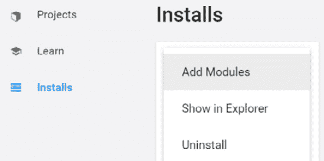

图 13.1 – 将模块添加到 Unity 安装中

1.  勾选**Visual Studio**选项；选项的描述将根据你使用的 Unity 版本而有所不同。

1.  点击右下角的**下一步**按钮：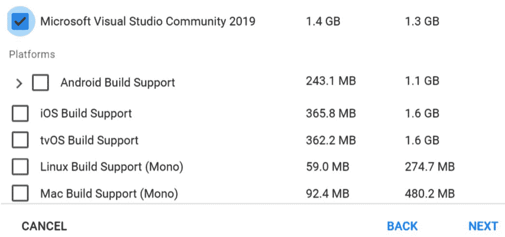

图 13.2 – 安装 Visual Studio

1.  等待操作结束。这可能需要几分钟的时间。

如果你有自己喜欢的 IDE，你可以自行安装并配置 Unity 来使用它。如果你有能力支付或者你是一名教师或学生（在这些情况下是免费的），我推荐 Rider。它是一个功能强大的 IDE，拥有许多你会喜欢的 C#和 Unity 功能；然而，对于这个练习来说并不是必不可少的。为了设置 Unity 使用自定义 IDE，你可以这样做：

1.  打开项目。

1.  转到编辑器的顶部菜单中的**编辑** | **首选项**。

1.  从左侧面板中选择**外部工具**菜单。

1.  从外部脚本编辑器中选择您喜欢的 IDE；Unity 将自动检测到支持的 IDE：

图 13.3 – 选择自定义 IDE

1.  如果在列表中找不到您的 IDE，可以使用**浏览...**选项，但通常需要使用此选项的 IDE 支持不是很好——但值得一试。

最后，一些 IDE，如 Visual Studio、Visual Studio Code 和 Rider，具有 Unity 集成工具，您需要在项目中安装这些工具，这是可选的，但可能很有用。通常，Unity 会自动安装这些工具，但如果您想确保它们已安装，请执行以下操作：

1.  打开**包管理器**（**窗口** | **包管理器**）。

1.  搜索列表中的您的 IDE，或者使用搜索栏过滤列表。在我的情况下，我使用了 Rider，并且我可以找到一个名为**JetBrains Rider Editor**的包：

图 13.4 – 自定义 IDE 编辑器扩展安装——在这种情况下是 Rider

1.  通过查看包管理器底部右侧的按钮来检查是否安装了 IDE 集成包。如果看到**安装**或**更新**按钮，请单击它，但如果显示**已安装**，则一切都设置好了。

现在我们已经配置了 IDE，让我们创建我们的第一个脚本。

## 创建基于 MonoBehaviour 的类

C#是一种面向对象的语言，在 Unity 中也是如此。每当我们想要扩展 Unity 时，我们都需要创建自己的类——一个包含我们想要添加到 Unity 的指令的脚本。如果我们想要创建自定义组件，我们需要创建一个从`MonoBehaviour`继承的类，这是每个自定义组件的基类。

我们可以直接在 Unity 项目中使用编辑器创建 C#脚本文件，并且可以将它们排列在其他资产文件夹旁边的文件夹中。创建脚本的最简单方法是按照以下步骤进行：

1.  选择要创建组件的任何游戏对象。由于我们只是在测试这个功能，所以选择任何对象。

1.  单击检查器底部的**添加组件**按钮，并查找**新脚本**选项，该选项显示在单击**添加组件**后的列表底部：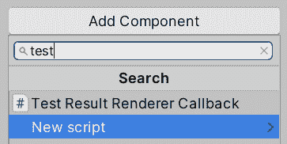

图 13.5 – 新脚本选项

1.  在`MyFirstScript`中，但是对于您将用于游戏的脚本，请尝试输入描述性名称，而不管长度如何：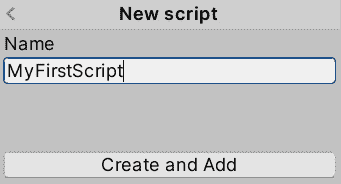

图 13.6 – 命名脚本

重要提示：

建议您使用帕斯卡命名法来命名脚本。在帕斯卡命名法中，玩家射击功能的脚本将被称为`PlayerShoot`。名称的每个单词的第一个字母都是大写的，而且不能使用空格。

1.  您可以看到在项目视图中创建了一个名为脚本的新资产。请记住，每个组件都有自己的资产，我建议您将每个组件放在`Scripts`文件夹中：

图 13.7 – 脚本资产

1.  现在，您还会看到您的游戏对象在检查器窗口中有一个新的组件，该组件的名称与您的脚本相同。因此，您现在已经创建了您的第一个组件类：

图 13.8 – 我们的脚本添加到游戏对象

现在我们已经创建了一个`component`类，请记住类不是组件本身。它是组件应该是什么的描述 - 组件应该如何工作的蓝图。要实际使用组件，我们需要通过创建基于该类的组件来实例化它。每次我们使用编辑器向对象添加组件时，我们都在实例化它。通常，我们不使用 new 来实例化，而是使用编辑器或专门的函数。现在，您可以像使用**Add Component**按钮一样添加您的组件到任何其他组件中，并在检视器窗口中的**Scripts**类别中查找它或通过名称搜索它：

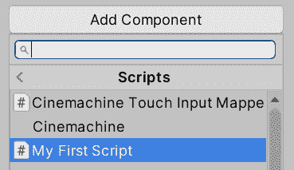

图 13.9 - 在 Scripts 类别中添加自定义组件

这里需要考虑的一点是，我们可以将相同的组件添加到多个游戏对象中。我们不需要为每个使用该组件的游戏对象创建一个类。我知道这是基本的程序员知识，但请记住我们正在尝试回顾基础知识。在下一章中，我们将研究更有趣的主题。

现在我们有了我们的组件，让我们探索它的外观，并通过以下方式进行类结构回顾：

1.  在 Project View 中找到脚本资源并双击打开。记住它应该位于您之前创建的`Scripts`文件夹中。

1.  等待 IDE 打开；这可能需要一段时间。当您看到您的脚本代码及其关键字正确着色时，您将知道 IDE 已完成初始化，这取决于所需的 IDE。在 Rider 中，它看起来如下截图。在我的情况下，我知道 Rider 已经完成初始化，因为 MonoBehaviour 类型和脚本名称都着色相同：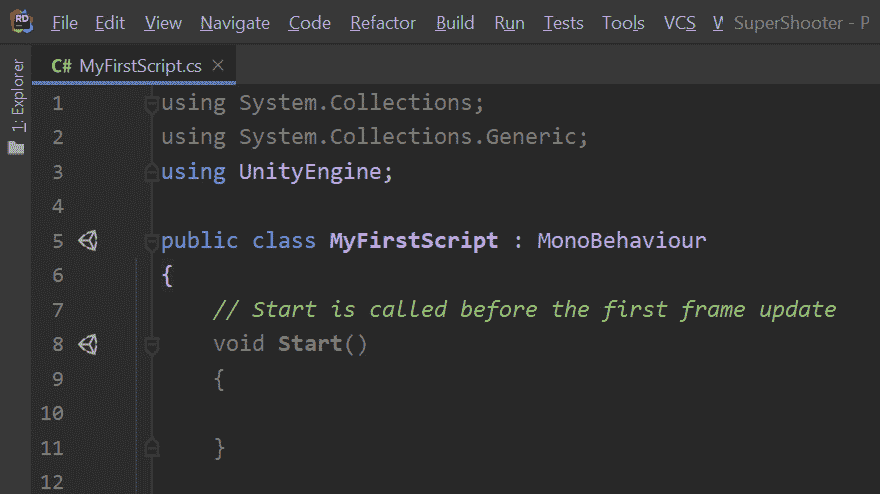

图 13.10 - 在 Rider IDE 中打开的新脚本

1.  前三行 - 以`using`关键字开头的行 - 包括常见的命名空间。命名空间就像代码容器，也就是在这种情况下，由他人创建的代码（如 Unity，C#创建者等）。我们将经常使用命名空间来简化我们的任务；它们已经包含了我们将使用的解决算法。我们将根据需要添加和删除`using`组件；在我的情况下，Rider 建议前两个`using`组件是不必要的，因为我没有在其中使用任何代码，所以它们是灰色的。但是现在，保留它们，因为您将在本书的后面章节中使用它们。记住，它们应该始终位于类的开头：

图 13.11 - using 部分

1.  下一行，以`public class`开头的行，是我们声明正在创建一个继承自`MonoBehaviour`的新类的地方，这是每个自定义组件的基类。我们知道这是因为它以`：MonoBehaviour`结尾。您可以看到代码的其余部分位于该行的下方括号内，这意味着括号内的代码属于该组件：

图 13.12 - MyFirstScript 类定义继承自 MonoBehaviour

现在我们有了第一个组件，让我们编辑它，从字段开始。

## 添加字段

当我们添加`Rigidbody`或不同类型的碰撞体作为组件时，仅仅添加组件是不够的。我们需要正确配置它们以实现我们需要的确切行为。例如，`Rigidbody`有`Mass`属性来控制物体的重量，碰撞体有`Size`属性来控制它们的形状。这样，我们可以在不同的场景中重复使用相同的组件，避免重复相似组件。使用`Box`碰撞体，我们可以通过更改大小属性来表示正方形或矩形框。我们的组件也不例外；如果我们有一个移动物体的组件，并且我们希望两个物体以不同的速度移动，我们可以使用相同的组件进行不同的配置。

每个配置都是一个类字段，一个特定类型的变量，我们可以在其中保存参数的值。我们可以创建可以在编辑器中编辑的类字段的两种方式——通过将字段标记为`public`，但违反封装原则，或者通过创建一个私有字段并使用属性公开它。现在，我们将涵盖这两种方法，但如果您不熟悉面向对象编程（OOP）概念，比如封装，我建议您使用第一种方法。

假设我们正在创建一个移动脚本。我们将使用第一种方法添加一个可编辑的数字字段，表示速度，即通过添加`public`字段。我们将按照以下步骤进行操作：

1.  双击打开脚本，就像之前一样。

1.  在类括号内，但在其中的任何括号之外，添加以下代码：

图 13.13 - 在我们的组件中创建一个速度字段

重要提示：

`public`关键字指定变量可以在类的范围之外被看到和编辑。代码中的`float`部分表示变量使用十进制数类型，`speed`是我们为字段选择的名称——这可以是任何您想要的。您可以使用其他值类型来表示其他类型的数据，比如`bool`表示复选框或布尔值，`string`表示文本。

1.  要应用更改，只需在 IDE 中保存文件（通常通过按下*Ctrl* + *S*或*command* + *S*），然后再返回 Unity。当您这样做时，您会注意到编辑器底部右侧有一个小加载轮，表示 Unity 正在编译代码。直到加载轮完成，您才能测试更改。请记住，Unity 将编译代码；不要在 IDE 中编译：

图 13.14 - 加载轮

1.  编译完成后，您可以在检视器窗口中看到您的组件，**Speed**变量应该在那里，允许您设置您想要的速度。当然，现在这些变量什么都不做。Unity 不会根据变量的名称识别您的意图；我们需要以某种方式设置它以供后续使用，但我们稍后会这样做：

图 13.15 - 一个用于编辑组件稍后将使用的公共字段

1.  尝试将相同的组件添加到其他对象，并设置不同的速度。这将向您展示不同游戏对象中的组件是独立的，允许您通过不同的设置更改它们的一些行为。

定义属性的第二种方法类似，但是我们创建一个私有字段，鼓励封装，并使用`SerializeField`属性公开它，如下面的屏幕截图所示。这些屏幕截图展示了两种方法——两种方法都会产生相同的结果；唯一的区别是样式。使用最符合您编码标准的方法：

图 13.16 - 在检视器窗口中公开私有属性的两种方法

如果你不熟悉面向对象编程的封装概念，只需使用第一种方法，对初学者来说更灵活。如果你创建了一个`private`字段，它将不可被其他脚本访问，因为`SerializeField`属性只会将变量暴露给编辑器。记住，Unity 不允许你使用构造函数，所以设置初始数据和注入依赖的唯一方法是通过序列化的私有字段或公共字段，并在编辑器中设置它们（或使用依赖注入框架，但这超出了本书的范围）。为简单起见，我们将在本书的大部分练习中使用第一种方法。

如果你愿意，尝试创建其他类型的变量，并查看它们在检视器中的样子。尝试用`bool`或`string`替换`float`，就像之前建议的那样。现在我们知道如何通过数据配置我们的组件，让我们使用这些数据来创建一些行为。

# 使用事件和指令

现在我们有了一个脚本，我们准备对其进行一些操作。在本章中，我们不会实现任何有用的东西，但我们会解决一些概念，以便在接下来的章节中为我们即将创建的脚本添加一些类型的行为。

在本节中，我们将涵盖以下概念：

+   事件和指令

+   在指令中使用字段

+   常见的初学者错误

我们将探索 Unity 事件系统，它将允许我们通过执行 Unity 函数来响应这些情况。这些函数也会受到编辑器的值的影响，我们脚本中暴露的字段将是可配置的。最后，我们将讨论常见的脚本错误以及如何解决它们。让我们先介绍 Unity 事件的概念。

## 事件和指令

Unity 允许我们以因果关系的方式创建行为，通常称为事件系统。事件是 Unity 正在监视的情况，例如，当两个对象发生碰撞或被销毁时，Unity 会告诉我们这种情况，从而允许我们根据我们的需求做出反应。例如，当玩家与子弹发生碰撞时，我们可以减少玩家的生命。在这里，我们将探索如何监听这些事件并通过使用一些简单的操作来测试它们。

如果你习惯于事件系统，你会知道它们通常要求我们订阅某种监听器或委托，但在 Unity 中，有一种更简单的方法可用。我们只需要为我们正在寻找的事件编写确切的函数——我是说*确切的*。如果名称中的一个字母大小写不正确，它将不会执行，也不会引发任何警告。这是最常见的初学者错误，所以要注意。

在 Unity 中有很多事件或消息可以监听，所以让我们从最常见的一个开始——`Update`。这个事件会告诉你当 Unity 希望你更新你的对象时，根据你的行为目的而定；有些行为不需要它们。`Update`逻辑通常是需要不断执行的东西；更准确地说，是在每一帧中。记住，每个游戏就像一部电影——屏幕快速切换的一系列图像，看起来就像我们有连续的运动。在`Update`事件中常见的操作是让对象移动一点，通过这样做，每一帧都会让你的对象不断移动。

我们将在以后学习关于`Update`和其他事件或消息可以做的事情。现在，让我们专注于如何使我们的组件至少监听这个事件。实际上，基本组件已经带有两个准备好使用的事件函数，一个是`Update`，另一个在脚本中。如果你不熟悉 C#中函数的概念，我们指的是下面截图中已经包含在我们脚本中的代码片段。试着在你的脚本中找到它。

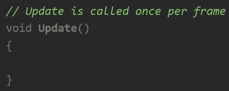

图 13.17 - 一个名为 Update 的函数，将在每一帧中执行

您会注意到`void Update()`行上方通常有一行绿色的文本（取决于 IDE）-这称为注释。这些基本上被 Unity 忽略。它们只是您可以留给自己的注释，必须始终以`//`开头，以防止 Unity 尝试执行它们并失败。我们将在以后使用这个来临时禁用代码行。

现在，为了测试这是否真的有效，让我们添加一个将一直执行的指令。没有比`print`更好的测试函数了。这是一个简单的指令，告诉 Unity 在控制台中打印一条消息，开发人员可以在其中看到各种消息，以检查一切是否正常工作。用户永远不会看到这些消息。它们类似于经典的日志文件，有时当游戏出现问题并且您正在报告问题时，开发人员会要求您提供这些日志文件。

为了使用函数测试事件，请执行以下操作：

1.  通过双击打开脚本。

1.  为了测试，添加`print("test");`到事件函数中。在下面的屏幕截图中，您可以看到如何在`Update`事件中执行此操作的示例。记得*精确*写出指令，包括正确的大小写，空格和引号符号：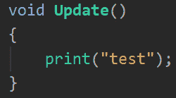

图 13.18 - 在所有帧中打印消息

1.  保存文件，转到 Unity，并播放游戏。

重要提示：

在从 IDE 切换回 Unity 之前记得保存文件。这是 Unity 知道您的文件已更改的唯一方式。一些 IDE，如 Rider，会自动为您保存文件，但我不建议您使用自动保存，至少在大型项目中不要这样做（您不希望在有很多脚本的项目中意外重新编译未完成的工作；这需要太长时间）。

1.  查找**控制台**选项卡并选择它。这通常可以在**项目视图**选项卡旁边找到。如果找不到，请转到**窗口** | **常规** | **控制台**，或按下*Ctrl* + *Shift* + *C*（macOS 上为*command* + *shift* + *C*）。

1.  您会看到在**控制台**选项卡的每一帧中都打印出``"test"``的许多消息。如果您没有看到这个，请记得在播放游戏之前保存脚本文件。

1.  让我们也测试`Start`函数。在其中添加`print("test Start");`，保存文件，并播放游戏。完整的脚本应如下所示：

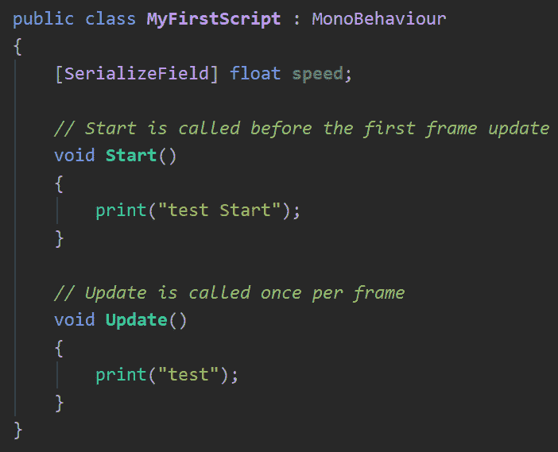

图 13.19 - 测试开始和更新函数的脚本

如果现在检查控制台并向上滚动，您会看到一个单独的``"test Start"``消息和许多随后的``"test"``消息。您可以猜到，`Start`事件告诉您游戏已经开始，并允许您执行需要在游戏开始时仅执行一次的代码。我们将在本书的后面使用这个。

对于`void Update()`语法，我们将告诉 Unity，该行下方括号中包含的内容是一个将在所有帧中执行的函数。重要的是将打印指令放在`Update`括号内（类的括号内）。此外，`print`函数期望在其括号内接收文本，称为参数或参数，并且 C#中的文本必须用引号括起来。最后，`Update`或`Start`等函数内的所有指令*必须*以分号结束。

在这里，我挑战你尝试添加另一个名为`OnDestroy`的事件，使用`print 函数`来发现它何时执行。一个小建议是播放并停止游戏，然后查看控制台底部以测试这个。

对于高级用户，如果您的 IDE 允许，您还可以使用断点。断点允许您在执行特定代码行之前完全冻结 Unity，以查看我们的字段数据随时间如何变化并检测错误。在这里，我将向您展示在 Rider 中使用断点的步骤，但 Visual Studio 版本应该类似：

1.  单击要添加断点的行左侧的垂直条：

图 13.20 - 打印指令中的断点

1.  转到**运行** | **附加到 Unity 进程**（在 Visual Studio 中，转到**调试** | **附加 Unity 调试器**。请记住，您需要 Visual Studio Unity 插件和**包管理器**的 Visual Studio 集成包）：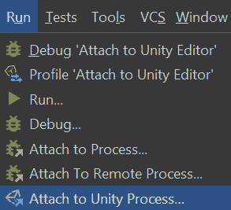

图 13.21 - 攻击我们的 IDE 与 Unity 进程

1.  从列表中查找您想要测试的特定 Unity 实例。列表将显示其他已打开的编辑器或正在执行调试构建。

停止调试过程不会关闭 Unity。它只会将 IDE 与编辑器分离。

现在我们已经创建了字段和指令，让我们将它们结合起来制作可配置的组件。

## 在指令中使用字段

我们已经创建了字段来配置组件的行为，但到目前为止我们还没有使用它们。我们将在下一章中创建有意义的组件，但我们经常需要做的一件事是使用我们创建的字段来改变对象的行为。到目前为止，我们还没有真正使用我们创建的`speed`字段。然而，遵循测试代码是否工作的想法（也称为调试），我们可以学习如何使用字段内的数据与函数一起测试值是否符合预期，并根据字段的值改变控制台中`print`的输出。

在我们当前的脚本中，我们的`speed`值在运行时不会改变。然而，举个例子，如果您正在创建一个具有护盾伤害吸收的生命系统，并且您想要测试减少的伤害计算是否正常工作，您可能希望将计算值打印到控制台并检查它们是否正确。这里的想法是用字段替换`print`函数内的固定消息。当您这样做时，`print`将在控制台中显示字段的值。因此，如果您在`speed`中设置了`5`的值并将其打印出来，您将在控制台中看到大量显示`5`的消息，并且`print`函数的输出由字段控制。为了测试这一点，您`Update`函数中的`print`消息应该如下所示：

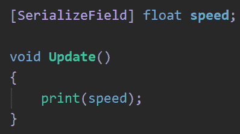

图 13.22 - 使用字段作为打印函数参数

如您所见，我们只是将字段的名称放在引号中。如果您使用引号，将打印一个`"speed"`消息。在其他情况下，您可以在一些移动函数中使用`speed`值来控制移动速度，或者您可以创建一个名为`"fireRate"`的字段（字段使用驼峰命名法而不是帕斯卡命名法，第一个字母小写）来控制一颗子弹和下一颗子弹之间的冷却时间：

图 13.23 - 打印当前速度

重要提示：

您可以看到我的编辑器被涂成红色，这是因为我配置它在游戏中播放时变成红色，以便轻松检测到。您可以通过转到编辑 > 首选项 > 颜色并更改播放模式色调来实现这一点。

有了所有这些，我们现在有了开始创建实际组件所需的工具。在继续之前，让我们回顾一些常见的错误，如果这是您第一次在 C#中创建脚本，您可能会遇到这些错误。

## 常见初学者错误

如果您是一名经验丰富的程序员，我敢打赌您对这些非常熟悉，但让我们回顾一下在开始脚本编写时会让您浪费大量时间的常见错误。其中大部分是由于未*精确*复制所示代码引起的。如果代码中有错误，Unity 将在控制台中显示红色消息，并且不允许您运行游戏，即使您没有使用该脚本。因此，永远不要留下任何未完成的事情。

让我们从一个经典错误开始，即缺少分号，这导致了许多程序员的笑话和段子。所有字段和大多数函数内的指令（如`print`）在调用时都需要在末尾加上分号。如果不加分号，Unity 将显示错误，例如下图左侧截图中的控制台中的错误。您还会注意到下图右侧的截图中还有一个糟糕的代码示例，IDE 显示了一个红色图标，表明该位置有问题：

图 13.24 - IDE 和 Unity 控制台提示的打印行错误

您会注意到错误显示了确切的脚本（`MyFirstScript.cs`），代码的确切行号（在本例中为`18`），通常还有一个描述性消息 - 在本例中为`；[分号]预期`。您只需双击错误，Unity 将打开 IDE 并突出显示有问题的行。您甚至可以单击堆栈中的链接，跳转到您想要的堆栈行。

我已经提到了为每个指令使用*确切*大小写非常重要的原因。然而，根据我教授初学者的经验，我需要更加强调这一特定方面。这种情况可能发生的第一个场景是在指令中。在下面的截图中，您可以看到一个糟糕编写的`print`函数的样子 - 也就是说，您可以看到控制台将显示的错误以及 IDE 将建议存在问题的方式。首先，在 Rider 的情况下，指令被标记为红色，表示该指令未被识别（在 Visual Studio 中，它将显示为红色线）。然后，错误消息表示`Print`在当前上下文中不存在，这意味着 Unity（或实际上是 C#）不认识任何名为`Print`的指令。在另一种类型的脚本中，大写的`Print`可能是有效的，但在常规组件中不是有效的，这就是为什么当前上下文澄清存在的原因：

图 13.25 - 写指令错误时的错误提示

现在，如果您使用错误的大小写编写事件，情况就更糟了。您可以创建诸如`Start`和`Update`之类的函数，并为其他目的使用任何名称。编写`update`或`start`是完全有效的，因为 C#会认为您将使用这些函数而不是事件作为常规函数。因此，不会显示任何错误，并且您的代码将无法正常工作。尝试编写`update`而不是`Update`，看看会发生什么：

图 13.26 - Update 函数中的错误大小写将编译函数但不会执行

另一个错误是将指令放在函数括号外，比如在类的括号内或外部。这样做将不会给函数提示，告诉它何时需要执行。因此，在`Event`函数外部的`print`函数是没有意义的，它会显示类似以下截图中的错误。这次，错误并不是非常描述性的。标识符预期表示 C#希望您创建一个函数或字段 - 可以直接放在类中的结构类型：

图 13.27 – 指令或函数调用放错位置

最后，另一个经典错误是忘记关闭开放的括号。如果你不关闭一个括号，C#就不知道一个函数在哪里结束，另一个函数在哪里开始，或者类函数在哪里结束。这可能听起来有些多余，但 C#需要完全定义。在下面的截图中，你可以看到这会是什么样子：

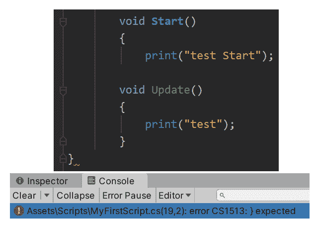

图 13.28 – 缺少闭合括号

这个有点难以捕捉，因为代码中的错误显示在实际错误之后很久。这是由于 C#允许你在函数内部放置函数（不经常使用），所以 C#会在后面检测到错误，并要求你添加一个闭合括号。然而，由于我们不想把`update`放在`Start`内部，我们需要在`Start`的末尾修复错误。控制台中的错误消息会很具体，但是不要按照消息建议的位置放置闭合括号，除非你 100%确定该位置是正确的。

除了这些错误，你可能会遇到很多其他错误，但它们都是一样的。IDE 会显示提示，控制台会显示消息；你会随着时间学会它们。只要有耐心，因为每个程序员都会经历这个过程。还有其他类型的错误，比如运行时错误，编译时代码出现错误，由于某些错误配置而在执行时失败，或者最糟糕的是逻辑错误，你的代码编译和执行都没有错误，但却没有达到你的意图。

# 总结

在本章中，我们探讨了创建脚本时会用到的基本概念。我们讨论了类和实例的概念，以及它们必须继承自 MonoBehaviour 才能被 Unity 接受来创建我们自己的脚本。我们还看到了如何混合事件和指令来为对象添加行为，以及如何在指令中使用字段来自定义它们的功能。

我们刚刚探讨了 C#脚本的基础知识，以确保每个人都在同一起跑线上。然而，从现在开始，我们将假设你在某种编程语言中具有基本的编码经验，并且知道如何使用诸如`if`、`for`、`array`等结构。如果没有，你仍然可以阅读本书，并尝试用 C#入门书籍来补充你不理解的部分。

在下一章中，我们将开始看如何利用我们所学到的知识来创建移动和生成脚本。
