# 第十四章：实现移动和生成

现在我们已经准备好开始编码了，让我们创建我们的第一个行为。我们将看到如何通过使用`Transform`组件来移动对象的基础知识，这将应用于我们的玩家的移动，子弹的恒定移动以及其他对象的移动。此外，我们还将看到如何在游戏过程中创建和销毁对象，例如玩家和敌人射击的子弹以及敌人波次生成器。这些操作可以在其他场景中使用，所以我们将探索一些来加强这个想法。

在本章中，我们将探讨以下脚本概念：

+   实现移动

+   实现生成

我们将开始编写脚本来执行先前提到的移动行为，然后我们将继续进行对象的创建和销毁。

# 实现移动

几乎游戏中的每个对象都以某种方式移动，玩家角色通过键盘移动，敌人通过 AI 移动，子弹简单地向前移动，等等。在 Unity 中有几种移动对象的方式，所以我们将从最简单的方式开始，即通过`Transform`组件。

在本节中，我们将探讨以下移动概念：

+   通过 Transform 移动对象

+   使用输入

+   理解 Delta Time

首先，我们将探索如何在我们的脚本中访问 Transform 组件来驱动玩家的移动，然后根据玩家的键盘输入应用移动。最后，我们将探索 Delta Time 的概念，以确保在每台电脑上移动速度保持一致。我们将开始学习 Transform API 来掌握简单的移动。

## 通过 Transform 移动对象

`Transform`是一个持有对象的平移、旋转和缩放的组件，因此每个移动系统，如物理或路径查找，都会影响这个组件。无论如何，有时我们想以特定的方式移动一个对象，根据我们的游戏创建我们自己的脚本，它将处理我们需要的移动计算并修改 Transform 来应用它们。

这里暗示的一个概念是组件改变其他组件。在 Unity 中编码的主要方式是创建与其他组件交互的组件。在这里，想法是创建一个访问另一个组件并告诉它做某事的组件，这种情况下是移动。要创建一个告诉`Transform`移动的脚本，做如下操作：

1.  创建并添加一个名为`Player Movement`的脚本到我们的角色。在这种情况下，它将是我们之前创建的动画机器人对象。记得在创建后将脚本移动到`Scripts`文件夹中：

图 14.1 - 为角色创建一个玩家移动脚本

1.  双击创建的脚本资源以打开 IDE 编辑代码。

1.  我们正在移动，移动是每帧应用的，所以这个脚本只会使用`update`函数或方法，我们可以移除`Start`（移除未使用的函数是一个好习惯）：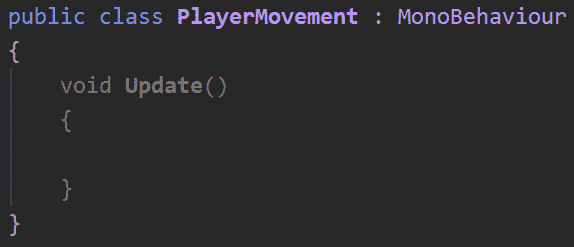

图 14.2 - 一个只有 update 事件函数的组件

1.  要沿着对象的前向轴（Z 轴）移动我们的对象，将`transform.Translate(0,0,1);`行添加到`update`函数中，如下图所示。

重要提示

每个组件都继承了一个`transform`字段（具体来说是一个 getter），它是对放置组件的游戏对象的 Transform 的引用，它代表我们组件的兄弟 Transform。通过这个字段，我们可以访问 Transform 的`Translate`函数，它将接收要在 X、Y、Z 本地坐标中应用的偏移量：

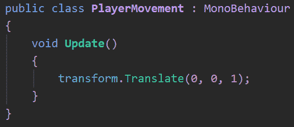

图 14.3 - 一个简单的向前移动脚本

1.  保存文件并播放游戏以查看移动。

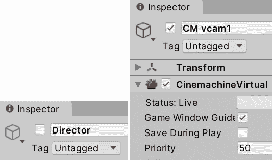

图 14.4 - 暂时禁用导演并增加玩家摄像机优先级

重要提示

我建议您暂时禁用可播放导演对象并增加 CM vcam1 的优先级，这将禁用引入过场动画并使角色跟随摄像机默认激活，减少测试游戏所需的时间。另一个选项是创建一个用于测试玩家移动的辅助场景，这实际上在真实项目中是做的，但现在，让我们保持简单。

您会注意到玩家移动得太快了，这是因为我们使用了固定的 1 米速度，而且因为`update`正在执行所有帧，所以我们每帧移动 1 米。在标准的 30 FPS 游戏中，玩家每秒移动 30 米，这太多了。我们可以通过添加一个“速度”字段并使用编辑器中设置的值来控制玩家速度，而不是固定的 1 的值。您可以在下一个截图中看到如何做到这一点，但请记住我们在上一章讨论的其他选项（使用 Serialize Field 属性）：

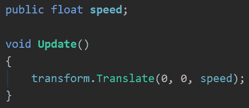

图 14.5 - 创建速度字段并将其用作移动脚本的 Z 速度

现在，如果您保存脚本以应用更改并设置为`0.1`，但您可能需要另一个值（稍后会详细介绍）：

图 14.6 - 设置每帧 0.1 米的速度

您会注意到玩家会自动移动。现在让我们看看如何基于玩家输入（如键盘和鼠标输入）执行移动。

## 使用输入

与 NPC 不同，我们希望玩家的移动是由玩家的输入驱动的，基于他们按下的键，鼠标移动等。我们可以回想我们在*第一章**从零开始设计游戏*中设计的原始键映射，从下面的两个表中：

表 14.1 - 键盘映射

请查看以下表格中的鼠标映射：

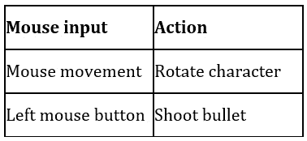

表 14.2 - 鼠标映射

重要提示

最新的 Unity 版本有一个新的输入系统，但在使用之前需要进行一些设置。现在我们将使用默认的输入系统来简化我们的脚本

要知道是否按下某个特定键，比如上箭头，我们可以使用`Input.GetKey(KeyCode.W)`这一行，它将返回一个布尔值，指示是否按下了`KeyCode`枚举中指定的键。我们可以更改键以检查`KeyCode`枚举值的更改，并将`GetKey`函数与“if”语句结合使用，使翻译仅在满足该条件时执行（当前按下该键时）。

重要提示

最新的 Unity 版本有一个新的输入系统，但在使用之前需要进行一些设置。现在我们将使用默认的输入系统来简化我们的脚本。

让我们通过以下方式开始实现键盘移动：

1.  使前进运动仅在按下*W*键时执行，如下截图所示：

图 14.7 - 仅在按下 W 键时执行移动

1.  我们可以通过更多的`If`语句添加其他移动方向。我们可以使用*S*向后移动，*A*和*D*向左和向右移动，如下截图所示。请注意，当需要沿相反轴方向移动时，我们使用减号来反转速度：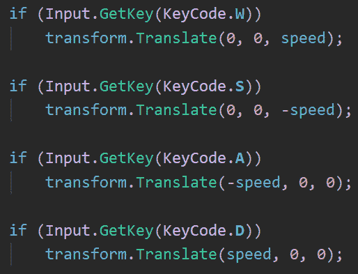

图 14.8 - 检查 W、A、S 和 D 键的压力

重要提示

记住，如果不使用括号的`if`语句，意味着只有`if`语句内部的一行将紧跟在`if`语句后面，也就是说，`transform.Translate`的调用。无论如何，在最终的代码中，我建议保留括号。

1.  如果你还想考虑箭头键，可以在`if`语句中使用 OR，如下面的截图所示：

图 14.9 - 检查 W、A、S、D 和箭头键的压力

1.  保存更改并在播放模式下测试移动。

需要考虑的一点是，首先，我们可以通过配置输入管理器来将多个键映射到单个操作的另一种方式，输入管理器是可以创建动作映射的地方；其次，在撰写本文时，Unity 发布了一个实验性的新输入系统，将取代这个输入管理器。目前，我们将使用这个输入管理器，因为它足够简单，可以启动一个基本的游戏，而且实验性的 Unity 软件包可能存在错误或工作方式的变化。在复杂输入的游戏中，建议使用更高级的工具来进行控制。

现在，让我们实现鼠标控制。在这一部分，我们只会涵盖鼠标移动的旋转；下一部分我们会讨论射击子弹。在鼠标移动的情况下，我们可以得到一个值，表示鼠标水平或垂直移动的程度。这个值不是布尔值，而是一个数字，通常被称为轴的输入类型，这个数字将表示移动的强度和数字的符号表示方向。例如，如果 Unity 的`"Mouse X"`轴的值为 0.5，意味着鼠标以适度的速度向右移动，但如果值为-1，表示鼠标向左快速移动，如果没有移动，值为 0。游戏手柄的摇杆也是一样；**Horizontal**轴表示常见游戏手柄左摇杆的水平移动，所以如果玩家将摇杆完全向左拉，值将为-1。

我们可以创建自己的轴来映射其他常见游戏手柄的压力控制，但对于我们的游戏来说，默认的足够了。要检测鼠标移动，做如下操作：

1.  在`update`中使用`Input.GetAxis`函数，紧挨着移动的`if`语句，如下面的截图所示，将这一帧的鼠标移动值存储到一个变量中：

图 14.10 获取鼠标的水平移动

1.  使用`transform.Rotate`函数来旋转角色。这个函数按 X、Y、Z 轴的顺序接收旋转的度数。在这种情况下，我们需要水平旋转，所以我们将使用鼠标移动值作为 Y 轴的旋转，如下面的截图所示：

图 14.11 - 根据鼠标移动水平旋转对象

1.  如果你保存并测试这个，你会注意到玩家会旋转，但速度很快或很慢，这取决于你的电脑。记住，这种值需要可配置，所以让我们在编辑器中创建一个`rotationSpeed`字段来配置玩家的速度：

图 14.12 - 速度和旋转速度字段

1.  现在我们需要将鼠标移动值乘以速度，这样，根据`rotationSpeed`，我们可以增加或减少旋转的量。例如，如果我们将旋转速度设置为 0.5，将这个值乘以鼠标移动值将使对象以之前速度的一半旋转，如下面的截图所示：

图 14.13 - 将鼠标移动乘以旋转速度

1.  保存代码，回到编辑器设置旋转速度值。如果不这样做，对象就不会旋转，因为浮点类型字段的默认值是 0：

图 14.14 – 设置旋转速度

1.  您可能还注意到，由 Cinemachine 控制的摄像机可能需要延迟来适应新的玩家位置。您可以像我在下一个截图中所做的那样调整插值速度，以获得更灵敏的行为：

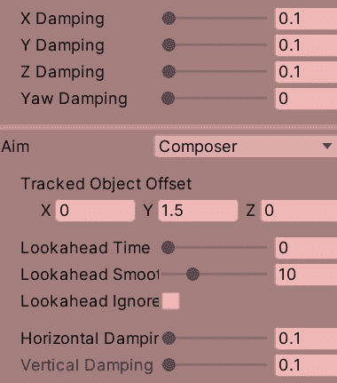

图 14.15 – 减少角色虚拟摄像机身体和瞄准部分的阻尼

现在我们已经完成了我们的移动脚本，我们需要通过探索 Delta Time 的概念来完善它，使其在每台机器上都能工作。

## 理解 Delta Time

Unity 的更新循环以计算机的速度执行。您可以在 Unity 中指定所需的帧率，但实现这一点完全取决于您的计算机是否能达到这一点，这取决于许多因素，不仅仅是硬件，因此您不能期望始终具有一致的 FPS。您必须编写脚本来处理每种可能的情况。我们当前的脚本是以每帧一定的速度移动的，这里的“每帧”部分很重要。

我们已经将移动速度设置为 0.1，所以如果我的计算机以 120 FPS 运行游戏，玩家将每秒移动 12 米。那么在游戏以 60 FPS 运行的计算机上会发生什么呢？您可能会猜到，它只会每秒移动 6 米，使我们的游戏在不同的计算机上具有不一致的行为。这就是 Delta Time 拯救了我们的地方。

Delta Time 是一个告诉我们自上一帧以来经过了多少时间的值。这个时间很大程度上取决于我们游戏的图形、实体数量、物理体、音频和无数方面，这些将决定您的计算机可以处理一帧的速度有多快。例如，如果您的游戏以 10 FPS 运行，这意味着在一秒内，您的计算机可以处理更新循环 10 次，这意味着每个循环大约需要 0.1 秒；在那一帧中，Delta Time 将提供该值。在下一个图表中，您可以看到 4 帧需要不同的时间来处理的示例，这在现实情况下可能会发生：

图 14.16 – 游戏不同帧的 Delta Time 值变化

在这里，我们需要以一种方式编码，将移动的“每帧”部分改为“每秒”; 我们需要在不同的计算机上每秒有一致的移动。一种方法是与 Delta Time 成比例地移动：Delta Time 值越高，那一帧就越长，移动量应该越大，以匹配自上次更新以来经过的真实时间。我们可以根据每秒 0.1 米的速度字段当前值来思考；我们的 Delta Time 为 0.5，意味着已经过去了半秒，所以我们应该移动一半的速度，0.05。两帧后，一秒已经过去，帧的移动总和（2 x 0.05）与目标速度 0.1 相匹配。Delta Time 可以被解释为已经过去的秒数的百分比。

为了使 Delta Time 影响我们的移动，我们应该在每一帧简单地将我们的速度乘以 Delta Time，因为 Delta Time 每一帧都可能不同，所以让我们这样做：

1.  我们使用 `Time.deltaTime` 访问 Delta Time。我们可以通过在每个 Translate 中乘以 Delta Time 来开始影响移动：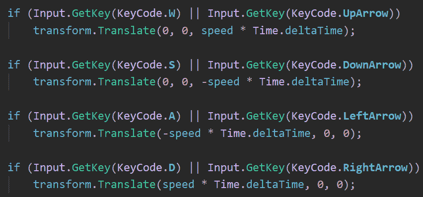

图 14.17 – 通过 Delta Time 乘以速度

1.  我们可以对旋转速度做同样的操作，将鼠标和速度相乘：

图 14.18 – 将 Delta Time 应用于旋转代码

1.  如果你保存并播放游戏，你会注意到移动速度比以前慢了，这是因为现在每秒移动 0.1，意味着每秒 10 厘米，这相当慢；尝试提高这些值。在我的情况下，速度为 10，旋转速度为 180 就足够了，但旋转速度取决于玩家的首选灵敏度，这是可以配置的，但让我们留到另一个时间。

我们刚学会了如何将 Unity 的输入系统（告诉我们键盘、鼠标和其他输入设备的状态）与基本的变换移动函数相结合。这样，我们可以开始让我们的游戏感觉更加动态。

现在我们已经完成了玩家的移动，让我们讨论如何使用 Instantiate 函数让玩家发射子弹。

# 实现生成

我们在编辑器中创建了许多定义我们级别的对象，但一旦游戏开始，并根据玩家的操作，必须创建新的对象以更好地适应玩家交互生成的场景。敌人可能需要在一段时间后出现，或者根据玩家的输入创建子弹；即使敌人死亡，也有可能生成一些增益道具。这意味着我们不能预先创建所有必要的对象，而应该动态创建它们，这是通过脚本完成的。

在本节中，我们将研究以下生成概念：

+   生成对象

+   计时动作

+   销毁对象

我们将开始看到 Unity 的`Instantiate`函数，它允许我们在运行时创建预制体的实例，例如按下键时，或者按时间安排，例如使我们的敌人每隔一段时间生成子弹。此外，我们将学习如何销毁这些对象，以防止场景由于处理太多对象而开始表现不佳。

让我们从如何根据玩家的输入射击子弹开始。

## 生成对象

要在运行时或播放模式下生成一个对象，我们需要一个对象的描述，它有哪些组件，它的设置以及可能的子对象。你可能会在这里考虑到预制体，你是对的，我们将使用一条指令告诉 Unity 通过脚本创建一个预制体的实例。记住，预制体的实例是基于预制体创建的对象，基本上是原始对象的克隆。

我们将开始射击玩家的子弹，所以首先让我们通过以下步骤创建子弹预制：

1.  在**GameObject** | **3D Object** | **Sphere**中创建一个球体。如果你愿意，你可以用另一个子弹模型替换球体网格，但在这个例子中我们暂时保留球体。

1.  将球体重命名为`Bullet`。

1.  通过单击`Bullet`来创建一个材质。记得将它放在`Materials`文件夹中。

1.  在材质中勾选**Emission**复选框，并将**emission Map**和**Base Map**颜色设置为红色。记住，发射颜色会使子弹发光，特别是在我们的后期处理体积中的泛光效果下：

图 14.19 – 创建一个带发光颜色的红色子弹材质

1.  通过将材质拖放到球体上，将材质应用到球体上。

1.  将比例设置为较小的值—（0.3, 0.3, 0.3）在我的情况下有效：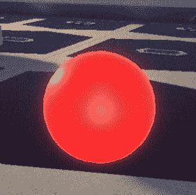

图 14.20 – 小红色子弹

1.  创建一个名为`ForwardMovement`的脚本，以使子弹以固定速度不断向前移动。

我建议你先自己尝试解决这个问题，然后在下一步中查看屏幕截图以获取解决方案，这是一个小挑战，可以回顾我们之前看到的运动概念。如果你不记得如何创建脚本，请阅读*第十三章**，使用 C#介绍 Unity 脚本编写*，并检查前一节以了解如何移动对象。

1.  下一张截图向你展示了脚本应该是什么样子的：

图 14.21 – 简单的向前移动脚本

1.  将脚本（如果尚未存在）添加到子弹上，并将速度设置为您认为合适的值。通常，子弹比玩家更快，但这取决于您想要获得的玩家体验（记住*第一章**中的问题，从零开始设计游戏*）。在我的情况下，20 效果很好。通过将子弹放在玩家附近并播放游戏来进行测试：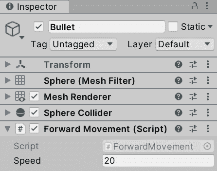

图 14.22 – 子弹中的前进运动脚本

1.  将子弹`GameObject`实例拖到`Prefabs`文件夹中创建一个**子弹**Prefab。记住，Prefab 是一个描述创建的子弹的资产，就像创建子弹的蓝图：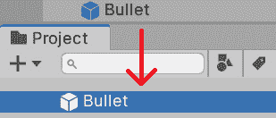

图 14.23 – 创建一个 Prefab

1.  从场景中移除原始子弹；当玩家按下按键时，我们将使用 Prefab 来创建子弹（如果需要的话）。

现在我们有了子弹 Prefab，是时候在玩家按下按键时实例化它（克隆它）了。为此，请执行以下操作：

1.  创建并添加一个脚本到玩家的`GameObject`（机器人）上，名为`PlayerShooting`，然后打开它。

我们需要一种方式让脚本访问 Prefab，以了解从我们项目中可能有的几十个 Prefab 中使用哪一个。我们脚本所需的所有数据都取决于所需的游戏体验，都以字段的形式存在，比如到目前为止使用的速度字段，因此在这种情况下，我们需要一个`GameObject`类型的字段，一个可以引用或指向特定 Prefab 的字段，可以使用编辑器进行设置。

1.  添加字段代码将如下所示：

图 14.24 – Prefab 引用字段

重要提示

你可能会猜到，我们可以使用`GameObject`类型来引用 Prefab，也可以引用其他对象。想象一下，敌人 AI 需要引用玩家对象来获取其位置，使用一个 GameObject 来链接这两个对象。关键在于考虑 Prefab 只是场景之外的常规 GameObject；你看不到它们，但它们存在于内存中，准备好被复制或实例化。你只能通过脚本或通过编辑器放置在场景中的副本或实例来看到它们，就像我们到目前为止所做的那样。

1.  在编辑器中，单击属性右侧的圆圈，并选择`Bullet`Prefab。另一个选项是将`Bullet`Prefab 直接拖到属性中：

图 14.25 – 设置 Prefab 引用指向子弹

这样，我们告诉我们的脚本要射击的子弹就是这个。记得拖动 Prefab 而不是场景中的子弹（那应该已经被删除了）。

按照设计文档中指定的方式，当玩家按下鼠标左键时，我们将射击子弹，因此让我们在`update`事件函数中放置适当的`if`语句来处理，就像下一张截图中所示的那样：

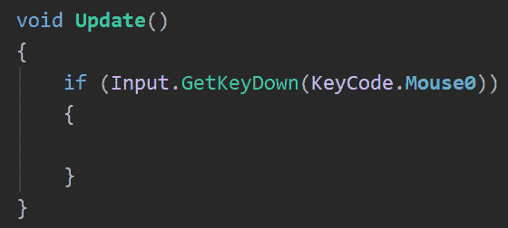

图 14.26 – 检测鼠标左键的压力

你会注意到这次我们使用了`GetKeyDown`而不是`GetKey`，前者是一种检测按键开始的确切帧的方法；这个`if`语句只会在那一帧执行它的代码，并且直到按键释放并重新按下，它才会再次进入。这是防止子弹在每一帧生成的一种方法，但只是为了好玩，你可以尝试使用`GetKey`来看看它会如何表现。另外，零是属于左键点击的鼠标按钮编号，一是右键点击，二是中键点击。

我们可以使用`Instantiate`函数来克隆预制品，将其引用作为第一个参数传递。这将在场景中创建一个所述预制品的克隆：

图 14.27 – 实例化预制品

](img/Figure_14.27_B14199.jpg)

图 14.27 – 实例化预制品

如果你保存脚本并播放游戏，你会注意到当你按鼠标时，子弹会生成，但可能不是在你期望的位置，如果你没有看到它，尝试在层次结构中查找新对象；它会在那里。问题在于我们没有指定期望的生成位置，我们有两种设置的方法，我们将在接下来的步骤中看到。

第一种方法是使用从 MonoBehaviour 继承的`transform.position`和`transform.rotation`字段，它们会告诉我们当前的位置和旋转。我们可以将它们作为`Instantiate`函数的第二个和第三个参数传递，函数会理解这是我们希望子弹出现的地方。记住，设置旋转是很重要的，让子弹面向与玩家相同的方向，这样它就会朝着那个方向移动：

图 14.28 – 在我们的位置和旋转实例化预制品

](img/Figure_14.28_B14199.jpg)

图 14.28 – 在我们的位置和旋转实例化预制品

第二种方式会更长，但会让我们有更多的灵活性来改变对象的其他方面，就是使用之前版本的 Instantiate，但保存函数返回的引用，这个引用将指向预制品的克隆。拥有实例化子弹的引用允许我们改变任何我们想要的东西，不仅仅是位置，还有旋转，但现在，让我们限制在位置和旋转上。在这种情况下，我们将需要以下三行；第一行将实例化并捕获克隆引用，第二行将设置克隆的位置，第三行将设置旋转。你会注意到我们还将使用克隆的`transform.position`字段，但这次是通过使用`=`（赋值）运算符来改变它的值：

图 14.29 – 在特定位置实例化预制品的较长版本

](img/Figure_14.29_B14199.jpg)

图 14.29 – 在特定位置实例化预制品的较长版本

使用你喜欢的版本——两者都是一样的。记住，你可以检查项目存储库以查看完整的脚本。现在你可以用其中一个版本保存文件并尝试射击。

如果你尝试到目前为止的脚本，你应该会看到子弹在玩家的位置生成，但在我们的情况下，它可能是在地板上。问题在于机器人的枢轴在那里，通常每个人形角色的枢轴都在那里。我们有几种方法来解决这个问题，最灵活的方法是创建一个射击点，一个空的玩家子对象，放在我们希望子弹生成的位置。我们可以使用该对象的位置而不是玩家的位置，方法如下：

1.  在`ShootPoint`中创建一个空的`GameObject`。

1.  将其作为玩家机器人角色对象的子对象，并将其放在你希望子弹出现的位置，可能比原始生成位置稍高和稍向前：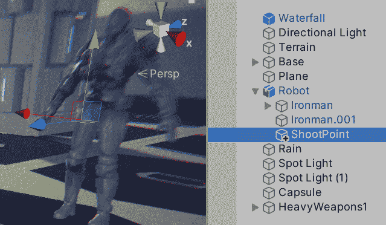

图 14.30 – 放置在角色内部的空 ShootPoint 对象

1.  像往常一样，要访问另一个对象的数据，我们需要一个对它的引用，比如 Prefab 引用，但这次需要指向我们的`ShootPoint`。我们可以创建另一个`GameObject`类型的字段，但这次拖动`ShootPoint`而不是 Prefab。脚本和对象设置如下截图所示：

图 14.31 - Prefab 和 Shoot Point 字段以及它们在编辑器中的设置

1.  我们可以再次使用`transform.position`字段访问`shootPoint`的位置，如下截图所示：

图 14.32 - Prefab 和 ShootPoint 字段以及它们在编辑器中的设置

您会注意到现在用鼠标射击和旋转有一个问题；当移动鼠标进行旋转时，指针会落在游戏视图之外，当点击时，您会意外地点击到编辑器，失去了对游戏视图的焦点，因此您需要再次点击游戏视图以恢复焦点并再次使用输入。防止这种情况发生的方法是在游戏进行时禁用鼠标。要做到这一点，请按照以下步骤操作：

1.  为我们的 Player Movement Script 添加一个`Start`事件函数。

1.  将您在脚本中看到的两行添加到您的脚本中。第一行将使光标可见，第二行将锁定光标在屏幕中央，因此它永远不会离开游戏视图。请考虑后者；当您切换回主菜单或暂停菜单时，您将需要重新启用光标，以允许鼠标点击 UI 按钮：

图 14.33 - 禁用鼠标光标

1.  保存并测试。如果要停止游戏，您可以按*Ctrl* + *Shift* + *P*（Mac 上为*command* + *Shift* + *P*）或按*Esc*键重新启用鼠标。这两种方法只在编辑器中有效；在真实游戏中，您将需要手动重新启用。

现在我们已经介绍了对象生成的基础知识，让我们通过将其与定时器结合来看一个高级示例。

## 定时动作

与生成不完全相关，但通常一起使用，定时动作是游戏中的常见任务。其思想是安排某些事情在以后发生；也许我们希望子弹在一段时间后被销毁以防止内存溢出，或者我们想控制敌人的生成速率或它们应该何时生成，这正是我们将在本节中要做的事情，从第二个开始，敌人波次。

我们的想法是，我们希望在游戏的不同时刻以一定的速率生成敌人；也许我们想在第 1 到 5 秒生成敌人，每秒 2 个，得到 10 个敌人，然后给玩家 20 秒的时间来完成它们，并编程另一个波次在第 25 秒开始。当然，这在很大程度上取决于您想要的确切游戏，您可以从这样的想法开始，并在一些测试后修改它，找到您想要波次系统工作的确切方式。在我们的案例中，我们将用先前提到的逻辑来说明定时。

首先，我们需要一个敌人，目前我们将简单地使用与玩家相同的机器人角色，但添加一个前进运动脚本来使其向前移动；稍后在本书中，我们将为我们的敌人添加 AI 行为。我建议您尝试自己创建这个 Prefab，并在尝试后查看下一步，以查看正确答案：

1.  将 Robot FBX 模型拖到场景中以创建另一个机器人角色，但这次将其重命名为`Enemy`。

1.  将为子弹创建的`ForwardMovement`脚本添加到`Enemy`，并将其速度设置为 10。

1.  将`Enemy`游戏对象拖到项目中，以创建基于该对象的预制件；我们稍后需要生成它。记得选择预制件变体，这样将保持预制件与原始模型链接，使对模型的更改自动应用到预制件。还记得销毁场景中的原始敌人。

现在，为了安排行动，我们将使用`Invoke`函数套件，一组用于创建定时器的函数，这些函数基本但足够满足我们的要求。让我们通过以下方式使用它：

1.  在基地的一端创建一个空游戏对象，并将其命名为`Wave1a`。

1.  创建并添加一个名为`WaveSpawner`的脚本。

1.  我们的生成器将需要四个字段：要生成的敌人预制件，开始波浪的游戏时间，结束波浪生成的`endTime`，以及敌人的生成速率 - 基本上，在给定生成期间每次生成之间应该经过多长时间。脚本和设置将如下截图所示：

图 14.34 - 波浪生成器脚本的字段

我们将使用`InvokeRepeating`函数来安排一个自定义函数定期重复。您只需要安排重复一次；Unity 会记住这一点，所以不要每帧都这样做。这是使用`Start`事件函数的好时机。函数的第一个参数是一个字符串（引号之间的文本），其中包含要定期执行的其他函数的名称，与 Start 或 update 不同，您可以随意命名函数。第二个参数是开始重复的时间，我们的`startTime`字段，在这种情况下。最后，函数的第三个参数是函数的重复率，每次重复之间需要经过多长时间，这是`spawnRate`字段。您可以在下一个截图中找到如何调用该函数，以及自定义的`Spawn`函数：

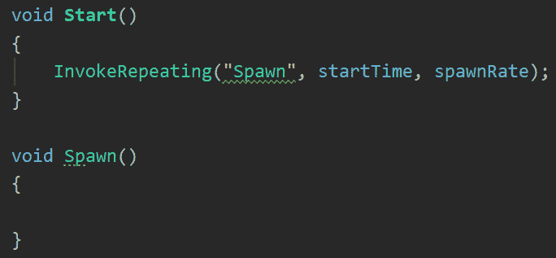

图 14.35 - 安排生成函数重复

1.  在`Spawn`函数内部，我们可以像我们知道的那样放置生成代码，使用`Instantiate`函数。想法是以一定的速率调用这个函数，每次调用生成一个敌人。这次，生成位置将与生成器的位置相同，所以要小心放置：

图 14.36 - 在生成函数中实例化

如果您测试此脚本，将`startTime`和`spawnRate`字段设置为一些测试值，您会注意到敌人将开始生成但永远不会停止，并且您会看到我们到目前为止还没有使用`endTime`字段。想法是调用`CancelInvoke`函数，一个函数，将取消我们所做的所有`InvokeRepeating`调用，但在一段时间后使用`Invoke`函数，这个函数与`InvokeRepeating`类似，但这个函数只执行一次。在下一个截图中，您可以看到我们如何在`Start`中添加了一个`Invoke`调用到`CancelInvoke`函数，使用`endTime`字段作为执行`CancelInvoke`的时间。这将在一段时间后执行`CancelInvoke`，取消生成预制件的第一个`InvokeRepeating`调用：

图 14.37 - 安排生成重复但在一段时间后取消

重要提示

这次，我们使用了`CancelInvoke`。我们没有使用自定义函数，因为`CancelInvoke`不接收参数。如果您需要安排带参数的函数，您需要创建一个无参数的包装函数，调用所需的函数并安排那个函数，就像我们在`Spawn`中所做的那样，那里的唯一目的是使用特定的参数调用`Instantiate`。

1.  现在您可以保存并为我们的生成器设置一些真实值。在我的情况下，我使用了以下截图中显示的值：

图 14.38 – 在游戏进行的 1 到 5 秒内每 0.5 秒生成一次敌人，每秒 2 个

您应该看到敌人一个接一个地生成，因为它们向前移动，它们将形成一排敌人。这种行为稍后将随 AI 而改变：

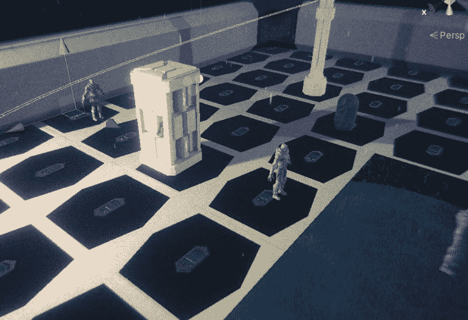

图 14.39 – 生成敌人

如果您愿意，可以创建几个 Wave Spawner 对象，安排后期游戏的波次。记住我们在[*第一章*]（B14199_01_Final_SK_ePub.xhtml#_idTextAnchor015）中讨论的难度平衡，从零开始设计游戏；您需要尝试使用最终的敌人 AI，但波次的数量、时间和生成速率将决定游戏的难度，这就是为什么设置这些值很重要。此外，有很多方法可以创建敌人的波次；这只是我能找到的最简单的方法。您可能需要根据您的游戏进行更改。

现在我们已经讨论了定时和生成，让我们讨论定时和销毁对象，以防止我们的子弹永远存在于内存中。

## 销毁对象

这将非常简短，但是这是一个广泛使用的功能，因此它值得有自己的部分。我们可以使用`Destroy`函数来销毁对象实例。这个想法是让子弹有一个脚本，在一段时间后安排它们自动销毁，以防止它们永远存在。我们将通过以下步骤创建脚本：

1.  选择`Bullet`的预制件，并像使用**添加组件** | **新脚本**选项一样，为其添加一个名为`Autodestroy`的脚本。这次，脚本将被添加到预制件中，并且您生成的每个预制件实例都将拥有它。

1.  您可以使用`Destroy`函数如下一张截图所示，在`Start`中仅一次销毁对象。

`Destroy`函数期望将要销毁的对象作为第一个参数，这里，我们使用`gameObject`引用，一种指向我们要销毁的 GameObject 的方式。如果您使用`this`指针，我们将只销毁`Autodestroy`组件；请记住，在 Unity 中，您永远不会创建 Gameobjects，而是创建要添加到它们的组件：

图 14.40 – 当对象启动时销毁对象

当然，我们不希望子弹在生成后立即被销毁，因此我们需要延迟销毁。您可能会考虑使用`Invoke`，但与 Unity 中的大多数函数不同，`Destroy`可以接收第二个参数，即等待销毁的时间。

1.  创建一个`delay`字段，用作`Destroy`的第二个参数，如下一张截图所示：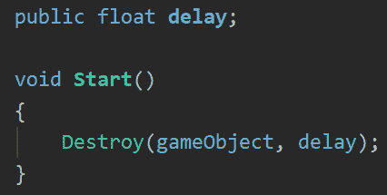

图 14.41 – 使用字段配置延迟销毁对象

1.  将`delay`字段设置为适当的值；在我的情况下，5 就足够了。现在通过查看它们从层次结构中被移除来检查子弹在一段时间后消失。

现在，我们可以随意创建和销毁对象，这在 Unity 脚本中非常常见。

重要提示

研究对象池的概念；您会发现有时创建和销毁对象并不那么高效。

# 总结

我们已经创建了我们的第一个真正的脚本，它提供了有用的行为。我们讨论了如何通过脚本实例化预制件，根据游戏情况随意创建对象。此外，我们还看到了如何安排动作，这种情况下是生成，但这可以用于安排任何事情。最后，我们看到了如何销毁创建的对象，以防止对象数量增加到无法管理的水平。我们将使用这些操作来创建本书后面的其他类型的对象，例如声音和效果。

现在，您可以创建任何类型的运动或生成逻辑，您的对象将需要确保这些对象在需要时被销毁。您可能会认为所有游戏以相同的方式移动和创建射击系统，虽然它们相似，但能够创建自己的运动和射击脚本使您能够定制游戏的这些方面，使其行为如预期，并创造您所寻找的确切体验。

在下一章中，我们将讨论如何检测碰撞，以防止玩家和子弹穿过墙壁等等。
