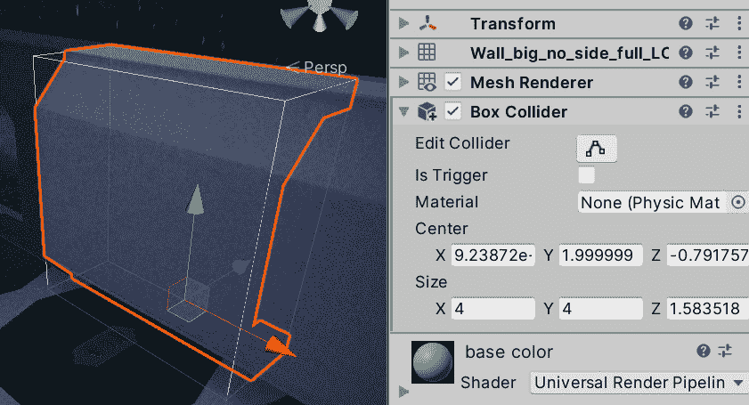
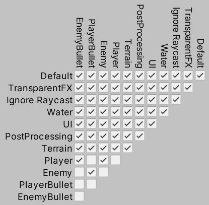
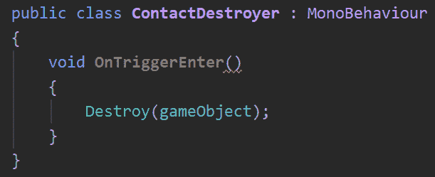
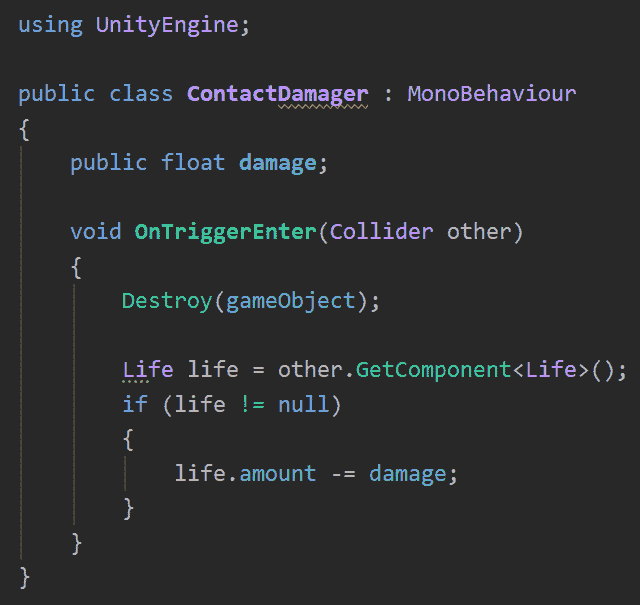
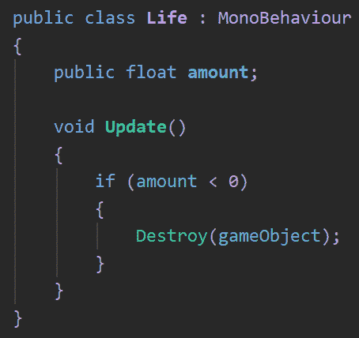

# 第十五章：*第十五章*：物理碰撞和健康系统

由于游戏试图模拟现实世界的行为，模拟物理是一个重要的方面，它决定了对象如何移动以及它们如何相互碰撞，比如玩家和墙壁的碰撞或子弹和敌人的碰撞。由于碰撞后可能发生的各种反应，物理可能很难控制，因此我们将学习如何正确配置它以获得半准确的物理效果，这将产生期望的街机运动感觉，但会使碰撞生效——毕竟，有时候现实生活并不像视频游戏那样有趣。

在本章中，我们将讨论以下碰撞概念：

+   配置物理

+   检测碰撞

+   使用物理移动

首先，我们将学习如何正确配置物理，这是检测对象之间碰撞的必要步骤，我们将使用新的事件来学习。然后，我们将讨论使用`Transform`移动和使用 Rigidbody 移动之间的区别，以及每个版本的优缺点。让我们开始讨论物理设置。

# 配置物理

Unity 的物理系统准备好覆盖各种可能的游戏应用，因此正确配置它对于获得期望的结果非常重要。

在本节中，我们将讨论以下物理设置概念：

+   设置形状

+   物理对象类型

+   过滤碰撞

我们将开始学习 Unity 提供的不同类型的碰撞器，然后学习不同的配置方式来检测不同类型的物理反应（碰撞和触发）。最后，我们将讨论如何忽略特定对象之间的碰撞，以防止玩家的子弹伤害玩家等情况发生。

## 设置形状

在本书的开头，我们学到对象通常有两种形状，一种是视觉形状，基本上就是 3D 网格，另一种是物理形状，也就是碰撞器，物理系统将使用它来计算碰撞。请记住，这样做的目的是让你拥有高度详细的视觉模型，同时拥有简化的物理形状以提高性能。

Unity 有几种类型的碰撞器，因此我们将回顾常见的碰撞器，从基本类型开始，即盒子、球体和胶囊体。这些形状是最便宜的（性能方面）来检测碰撞，因为它们之间的碰撞是通过数学公式进行的，不像其他碰撞器，比如 Mesh Collider，它允许你使用任何网格作为对象的物理主体，但代价更高且有一些限制。理念是你应该使用基本类型来表示你的对象，或者它们的组合，例如，一个平面可以用两个盒子碰撞器来做，一个用于主体，另一个用于翅膀。你可以在下面的截图中看到一个例子，其中你可以看到由基本形状制作的武器碰撞器：

图 15.1 - 复合碰撞器

无论如何，尽量避免这样做；如果我们只是希望武器掉落到地面上，也许一个覆盖整个武器的盒子碰撞器就足够了，考虑到这些类型的碰撞不需要精确，从而提高性能。此外，有些形状甚至不能用基本形状的组合来表示，比如坡道或金字塔，你唯一的解决方案就是使用 Mesh Collider，它需要一个 3D 网格用于碰撞，但我们不会在本书中使用它们；我们将用基本形状来解决所有的物理碰撞器。

现在，让我们为场景添加必要的碰撞器，以便正确计算碰撞。请注意，如果您使用的是除了我的之外的 Asset Store 环境包，您可能已经具有带有碰撞器的场景模块；我将展示我需要在我的情况下做的工作，但请尝试将这里的主要思想推广到您的场景中。要添加碰撞器，请按照以下步骤操作：

1.  在基础中选择一面墙，并检查对象和可能的子对象是否有碰撞器组件；在我的情况下，我没有碰撞器。如果检测到任何网格碰撞器，可以保留它，但我建议您删除它，并在下一步中用另一个选项替换它。想法是给它添加碰撞器，但我在这里检测到的问题是，由于我的墙不是预制体的实例，我需要给每面墙都添加碰撞器。

1.  一种选择是创建一个预制体，并将所有墙替换为预制体的实例（推荐的解决方案），或者只需在层次结构中选择所有墙（按住*Ctrl*或 Mac 上的*Cmd*并单击它们），然后在选择它们时使用`Box Collider`组件，该组件将使碰撞器的大小适应网格。如果它不适应，您可以只需更改 Box Collider 的 Size 和 Center 属性以覆盖整个墙：

图 15.2 - 添加到墙上的盒子碰撞器

1.  对于角落、地板瓷砖和任何其他会阻碍玩家和敌人移动的障碍，重复*步骤 1 和 2*。

对于我们的敌人和玩家，我们将添加胶囊碰撞器，这是可移动角色中常用的碰撞器，因为其圆形底部将允许对象顺利爬坡，并且横向圆形允许对象在拐角处轻松旋转而不会卡住，还有其他这种形状的便利之处。请记住，敌人是一个预制体，所以您需要将碰撞器添加到预制体中，而我们的玩家是场景中的一个简单对象，所以您需要将碰撞器添加到该对象中。

重要提示

您可能会诱惑地在角色的骨骼上添加几个盒子碰撞器，以创建对象的真实形状，虽然我们可以这样做，根据敌人被击中的身体部位应用不同的伤害，但我们只是创建了移动碰撞器；胶囊足够了。在高级伤害系统中，胶囊和骨骼碰撞器将共存，一个用于移动，另一个用于伤害检测；但在我们的游戏中，我们将简化这一过程。

此外，有时碰撞器无法很好地适应对象的视觉形状，在我的情况下，胶囊碰撞器对角色来说形状不好。我需要通过设置其值来修复其形状，如下面的截图所示：

图 15.3 - 角色碰撞器

我们用球体创建的子弹已经有了一个球体碰撞器，但如果您用另一个替换了子弹的网格，您可能需要更改碰撞器。目前，我们的游戏不需要其他对象，所以现在每个对象都有了适当的碰撞器，让我们看看如何为每个对象设置不同的物理设置以启用适当的碰撞检测。

## 物理对象类型

现在，通过使对象在物理模拟中存在，我们已经为每个对象添加了碰撞器，是时候配置它们以获得我们想要的确切物理行为了。我们有许多可能的设置组合，但我们将讨论一组常见的配置文件，涵盖大多数情况。请记住，除了碰撞器，我们在本书的开头看到了 Rigidbody 组件，它是将物理应用于对象的组件。以下配置文件是通过碰撞器和 Rigidbody 设置的组合完成的：

+   “刚体”组件，因此它们在物理模拟中存在，但没有任何物理作用；它们不能被其他物体移动，它们不会有物理效应，无论如何它们都会固定在它们的位置。需要注意的是，这与编辑器右上角的静态复选框无关；那些是用于之前看到的系统（比如照明和其他系统），所以如果需要的话，你可以有一个未选中该复选框的静态碰撞体。

重要提示

需要考虑的是，这些物体可以通过脚本移动，但你不应该这样做。Unity 对它们应用了一种优化技术，每当静态碰撞体移动时，优化就会失效，需要进一步计算来更新它，而且每一帧都这样做是很昂贵的。

我们刚提到地形作为一个例子，如果你检查地形的组件，你会发现它有自己的一种碰撞体，地形碰撞体。对于地形来说，这是唯一要使用的碰撞体。

+   “刚体”组件，就像我们在本书的第一部分中所做的掉落球的例子。这些是完全由物理驱动的物体，具有重力，并且可以通过力移动；其他物体可以推动它们，并且它们会执行你可以期望的每一个物理反应。你可以用它来控制玩家、手榴弹移动，或者掉落的板条箱，或者在像“不可思议的机器”这样的重度物理游戏中的所有物体。

+   “刚体”组件但有`transform.Translate`）而没有性能损失。需要考虑的是，由于它们没有物理效应，它们也不会有碰撞，所以它们可以穿过墙壁。这些可以用于需要使用动画或自定义脚本移动的物体，比如移动平台，考虑到在这种情况下，平台不会与其他物体发生碰撞，但是玩家通常会与它们发生碰撞，因为玩家通常会有一个物理碰撞体，实际上，物理碰撞体是会与各种碰撞体发生碰撞的。

+   “触发器”事件，这是可以通过脚本捕获的事件，告诉我们有东西在碰撞体内。这可以用来创建按钮或触发物体，在游戏中当玩家通过某些事件发生的区域时，比如生成一波敌人、打开门，或者在玩家到达目标位置时赢得游戏。需要考虑的是，普通的静态碰撞体在通过这种类型的碰撞体时不会生成触发事件，因为它们不应该移动。

+   “触发器运动碰撞体”：运动碰撞体不会生成碰撞，所以它们会穿过任何其他物体，但它们会生成触发事件，所以我们可以通过脚本做出反应。这可以用来创建可移动的能量增强道具，当触碰时消失并给我们分数，或者子弹通过自定义脚本移动而没有物理效应，就像我们的子弹一样直线前进，但在接触时会对其他物体造成伤害。

+   我们可以有一个触发器物理碰撞体，一个带有刚体但勾选了“是触发器”的碰撞体，通常它没有真正的用途；它将是一个永远下落的物体，在世界中生成触发事件，但通过一切。当然，除了指定的这些配置外，还可以存在其他配置，用于一些具有特定游戏玩法要求的游戏，但是考虑到所有可能的物理设置组合是由你来实验的，看看哪些对你的情况有用，描述的配置将涵盖 99%的情况。

+   为了总结之前的情景，我给你留下以下表格，显示了所有类型的碰撞体之间的接触反应。你会发现每个可以移动的配置文件都有一行；记住静态配置文件不应该移动。每一列代表了它们与其他类型碰撞时的反应，“Nothing”表示物体会毫无影响地穿过，“Trigger”表示物体会穿过但会触发触发事件，“Collision”表示物体无法穿过物体：

表 15.4 碰撞反应矩阵

考虑到这一点，让我们开始配置场景物体的物理。

墙壁、角落、地板砖和障碍物应该使用静态碰撞体配置文件，所以它们上面没有`Rigidbody`组件，它们的碰撞体将不勾选**Is Trigger**复选框：

图 15.5 - 地板砖的配置；记住静态复选框只是用于照明

玩家应该移动并与物体发生碰撞，所以我们需要它具有动态配置文件。这个配置文件将会生成一个有趣的行为与我们当前的移动脚本（我鼓励你去测试），特别是当与墙壁碰撞时，它不会像你期望的那样行为。我们将在本章后面处理这个问题：

图 15.6 - 玩家的动态设置

对于`Enemy` Prefab，我们将在这里使用 Kinematic 配置文件，因为我们稍后将使用 Unity 的 AI 系统移动这个物体，所以我们这里不需要物理，而且我们希望玩家与它们发生碰撞，所以这里需要一个碰撞反应，所以这里没有`Trigger`：

图 15.7 - 敌人的运动设置

对于`Bullet` Prefab，它会移动，但是通过脚本进行简单的移动（只是向前移动），而不是物理。我们不需要碰撞；我们将编写代码，使子弹在触碰到物体时立即销毁，并且会对碰撞到的物体造成伤害（如果可能的话），所以对于这个物体来说，Kinematic Trigger 配置文件就足够了；我们将使用`Trigger`事件来编写接触反应：

图 15.8 - 我们子弹的运动触发器设置；Is Trigger 和 Is Kinematic 都被勾选了

现在我们已经正确配置了物体，让我们来看看如何过滤掉某些物体类型之间不需要的碰撞。

## 过滤碰撞

在配置物体的所有麻烦之后，我们是否想要阻止碰撞？实际上，有时我们希望某些物体忽略彼此。例如，玩家射出的子弹不应该与玩家自身发生碰撞，敌人的子弹也不应该击中它们。我们可以在 C#脚本中使用`If`语句来过滤，检查击中的物体是否来自对立的队伍或者其他你想要的过滤逻辑，但那时已经太迟了，物理系统已经浪费了资源来检查本来不应该碰撞的物体之间的碰撞。这就是图层碰撞矩阵可以帮助我们的地方。

图层碰撞矩阵听起来很可怕，但它是物理系统的一个简单设置，允许我们指定哪些对象组应该与其他组发生碰撞，例如，玩家的子弹应该与敌人发生碰撞，敌人的子弹应该与玩家发生碰撞。这个想法是创建这些组并将我们的对象放在其中，在 Unity 中，这些组被称为**图层**。我们可以创建图层并设置 GameObject 的图层属性（检查器的顶部部分）以将对象分配到该组或图层。请注意，您拥有有限数量的图层，因此请明智地使用它们。

创建图层并分配对象后，我们可以转到物理设置并指定哪些图层将与其他图层发生碰撞。我们可以通过以下方式实现这一点：

1.  转到**编辑** | **项目设置**，在其中，从左侧窗格中查找**标签和图层**选项：

图 15.9 - 标签和图层设置

1.  从`Player`，`Enemy`，`PlayerBullet`和`PlayerEnemy`：

图 15.10 - 创建图层

1.  选择`Player`，并从检查器的顶部部分将图层属性更改为`Player`。还要将`Enemy`预制件更改为`Enemy`图层。将显示一个窗口询问您是否要更改子对象；选择该选项：

图 15.11 - 更改玩家和敌人预制件的图层

对于子弹，我们有一个问题；我们有一个预制件，但有两个图层，而预制件只能有一个图层。我们有两个选择，即根据射手通过脚本更改图层或具有两个具有不同图层的子弹预制件。为简单起见，我将选择后者，同时也有机会将另一个材料应用于敌人子弹，使其看起来不同。

我们将创建玩家子弹的预制件变体。请记住，变体是基于原始预制件的预制件，就像类继承一样。当原始预制件更改时，变体将更改，但变体可以有差异，这将使其成为独特的：

1.  将子弹放入场景中创建一个实例。

1.  再次将实例拖放到`预制件`文件夹中，这次选择`预制件变体`选项。将其命名为`敌人子弹`。记得销毁场景中的预制件实例。

1.  创建第二种类似于玩家子弹的材质，但是黄色或您喜欢的任何颜色，并将其放在敌人子弹预制件变体上。

1.  选择敌人子弹的变体，设置其图层（`EnemyBullet`），并对原始预制件（`PlayerBullet`）执行相同操作。即使您更改了原始预制件的图层，由于变体修改了它，修改后的版本（或覆盖）将占上风，从而使每个预制件都有自己的图层。

1.  转到**编辑** | **项目设置**，查找**物理设置**（不是物理 2D）。

1.  向下滚动，直到看到图层碰撞矩阵，一个半复选框网格。您会注意到每一列和行都标有图层的名称，因此在行和列的交叉处的每个复选框都允许我们指定这两个是否应该发生碰撞。在我们的情况下，我们将其配置如下截图所示：

图 15.12 - 使玩家子弹与敌人发生碰撞，敌人子弹与玩家发生碰撞

值得注意的是，有时过滤逻辑可能不那么固定或可预测，例如，我们的子弹可能只会击中具有一定生命值的对象，或者不具有临时隐身增益的对象，或者在游戏过程中可能会发生变化且难以为所有可能的组生成所有可能的层。因此，在这些情况下，我们应该依靠触发或碰撞事件后的手动过滤。

现在我们已经过滤了碰撞，让我们通过在下一节对碰撞做出反应来检查我们的设置是否正常工作。

# 检测碰撞

正如您所看到的，正确的物理设置可能会很复杂且非常重要，但现在我们已经解决了这个问题，让我们通过以不同的方式对接触做出反应并在此过程中创建一个健康系统来利用这些设置。

在本节中，我们将研究以下碰撞概念：

+   检测触发事件

+   修改其他对象

首先，我们将探索 Unity 提供的不同碰撞和触发事件，以对两个对象之间的接触做出反应。这使我们能够执行任何我们想要放置的反应代码，但我们将探索如何使用`GetComponent`函数修改接触对象的组件。

## 检测触发事件

如果对象被正确配置，就像之前讨论的那样，我们可以得到两种反应，触发和碰撞。碰撞反应有一个默认效果，即阻止对象的移动，但我们可以使用脚本添加自定义行为，但是触发器，除非我们添加自定义行为，否则不会产生任何明显的效果。无论哪种方式，我们都可以对两种可能的情况进行脚本反应，比如添加得分、减少生命和输掉游戏。为此，我们可以使用物理事件套件。

这些事件分为两组，碰撞事件和触发事件，因此根据您的对象设置，您将需要选择适当的组。两个组都有三个主要事件，**进入**、**停留**和**退出**，告诉我们碰撞或触发何时开始（进入），它们是否仍在发生或仍在接触（停留），以及何时停止接触（退出）。例如，我们可以在进入事件中编写一个行为，比如在两个对象开始接触时播放声音，比如摩擦声音，并在退出事件中停止它。

通过创建我们的第一个接触行为来测试这一点，也就是说，当子弹接触到某物时被销毁。请记住，子弹被配置为触发器，因此它们在接触任何物体时都会生成触发事件。您可以按照以下步骤进行操作：

1.  在子弹玩家预制件上创建并添加一个名为`ContactDestroyer`的脚本；因为子弹敌人预制件是它的变体，它也会有相同的脚本。

1.  要检测触发发生的时候，就像使用 Start 和 Update 一样，创建一个名为`OnTriggerEnter`的事件函数。

1.  在事件中，使用`Destroy(gameObject);`行使子弹在接触到物体时自我销毁：

图 15.13 - 与某物接触时自动销毁

1.  保存并射击子弹，看看它们在接触墙壁时如何消失而不是穿过它。同样，在这里，我们没有碰撞，而是触发了接触时销毁子弹。因此，通过这种方式，我们可以确保子弹永远不会穿过任何东西，但我们仍然没有使用物理运动。

目前，我们不需要其他碰撞事件，但如果您需要它们，它们将类似工作；只需使用`OnCollisionEnter`即可。现在，让我们探索相同函数的另一个版本。它不仅告诉我们我们击中了什么，还告诉我们我们接触了什么。我们将使用这个来使我们的接触销毁器也销毁其他对象。要做到这一点，请按照以下步骤进行：

1.  用以下截图中的方法签名替换`OnTriggerEnter`方法签名。这个方法接收`Collider`类型的参数，指示精确撞击我们的碰撞体：

图 15.14 - 告诉我们与之发生碰撞的对象的触发事件的版本

1.  我们可以使用`gameObject` setter 来访问碰撞体的整个对象，因此我们也可以使用它来摧毁另一个对象，如下截图所示。如果我们只是通过传递`other`引用来使用`Destroy`，那么它只会摧毁`Collider`组件：

图 15.15 - 摧毁两个对象

1.  保存并测试脚本。您会注意到子弹会摧毁它接触到的一切。

当然，我们不希望子弹在接触时摧毁一切，只摧毁自身和其他对象，如果符合某些条件，比如在对立队伍或其他情况下，根据我们的游戏。在我们的情况下，我们将向前迈进一步，而不是直接在接触时摧毁对象，而是使敌人和玩家具有生命值，因此子弹将减少生命值直到达到 0。

## 修改其他对象

到目前为止，我们使用`transform`字段来访问对象的特定组件，但是当我们需要访问其他组件时会发生什么？在我们的场景中，为了使子弹损坏碰撞的对象，它将需要访问其`Life`组件以改变生命值。请记住，Unity 并没有游戏的所有可能行为。因此，在我们的情况下，`Life`组件就是我们要创建的组件，只是用来保存一个带有生命值的浮点字段。拥有此组件的每个对象都将被视为可损坏对象。这就是`GetComponent`函数将帮助我们的地方。

如果您有一个对 GameObject 或 Component 的引用，您可以使用`GetComponent`来访问目标组件的引用，如果对象包含它（如果没有，它将返回 null）。让我们看看如何使用该函数来使子弹降低其他对象的生命值，如果它受到损坏，按照以下步骤进行：

1.  在玩家和敌人上创建并添加一个`Life`组件，其中包含一个名为`amount`的`public float`字段。记得在检查器中为两个对象的 amount 字段设置值：

图 15.16 - 生命组件

1.  从玩家子弹中删除`ContactDestroyer`组件，这也会将其从敌人子弹变体中删除，并添加一个名为`ContactDamager`的新组件；您可能稍后需要`ContactDestroyer`行为。因此，我们正在创建另一个组件。

1.  添加一个`OnTriggerEnter`事件，接收其他碰撞体，并只添加`Destroy`函数调用，自动摧毁自身，而不是摧毁其他对象的那个；我们的脚本不会负责摧毁它，只是减少它的生命值。

1.  添加一个名为 damage 的浮点字段，这样我们就可以配置对其他对象造成的伤害量。在继续之前，请记得保存文件并设置一个值。

1.  在对其他碰撞体的引用上使用`GetComponent`来获取其`life`组件的引用并将其保存在一个变量中：

图 15.17 - 访问碰撞对象的生命组件

1.  在减少对象的生命之前，我们必须检查生命引用是否不为空，如果其他对象没有`Life`组件，就会发生这种情况，比如墙壁和障碍物。子弹将在任何碰撞时摧毁自身，并减少其他对象的生命，如果它是包含`Life`组件的可损坏对象。

在下面的截图中，您将找到完整的脚本完成：

图 15.18 - 减少碰撞对象的生命值

1.  在场景中放置一个基于预制件的敌人，并将实例速度（场景中的速度）设置为`0`，以防止其移动。

1.  在点击播放之前选择它并开始向其射击。

您可以在检查器中看到生命值的减少。您还可以在播放模式下按*Esc*键重新获得鼠标控制权，并在编辑器中查看运行时生命字段的变化。

现在，您会注意到生命值正在减少，但它将变为负数；我们希望对象在生命值低于 0 时自行销毁。我们可以通过两种方式实现这一点，一种是向`Life`组件添加`Update`，它将检查所有帧是否生命值低于 0，并在发生时销毁自身。第二种方法是通过封装`life`字段，并在 setter 内部进行检查，以防止检查所有帧。我更喜欢第二种方式，但我们将实现第一种方式，以使我们的脚本对初学者尽可能简单。要做到这一点，请按照以下步骤操作：

1.  向`Life`组件添加`Update`。

1.  将“如果”添加到检查`amount`字段是否低于`0`。

1.  在`if`条件为真的情况下添加`Destroy`。

1.  完整的`Life`脚本将如下截图所示：

图 15.19 - 生命组件

1.  保存并查看对象在其生命值变为 0 时被销毁。 

可选地，您可以在发生这种情况时实例化一个对象，比如声音、粒子或者一个道具。我将把这留给您作为一个挑战。

通过使用类似的脚本，您可以制作增加生命值的生命力道具，或者访问`PlayerMovement`脚本并增加速度字段的速度道具；从现在开始，尽情发挥想象力，创造出令人兴奋的行为。

现在我们已经探讨了如何检测碰撞并对其做出反应，让我们探索一下当玩家撞到墙壁时如何修复玩家下落的问题。

# 使用物理移动

到目前为止，唯一使用动态碰撞器配置文件移动的对象是玩家，也是将使用物理移动的对象，实际上是通过使用 Transform API 进行自定义脚本编写移动。每个动态对象都应该使用 Rigidbody API 函数移动，以便物理系统更好地理解，因此在这里我们将探讨如何移动对象，这次是通过 Rigidbody 组件。

在本节中，我们将研究以下物理运动概念：

+   应用力量

+   调整物理

我们将开始看到如何以正确的物理方式移动对象，通过力量，并将这个概念应用到我们玩家的移动上。然后，我们将探讨为什么真实的物理并不总是有趣，以及如何调整我们对象的物理属性以获得更具响应性和吸引力的行为。

## 应用力量

通过力量的物理准确移动对象的方式是通过影响对象的速度。要应用力量，我们需要访问`Rigidbody`而不是`Transform`，并使用`AddForce`和`AddTorque`函数分别移动和旋转。这些是函数，您可以在其中指定要应用到位置和旋转的每个轴上的力量量。这种移动技术将产生完整的物理反应；力量将累积到速度上开始移动，并且将遭受减速效果，使速度缓慢减小，这里最重要的一点是它将与墙壁发生碰撞，阻挡对象的路径。

要获得这种移动方式，我们可以这样做：

1.  在`PlayerMovement`脚本中创建一个`Rigidbody`字段，但这次将其设置为`private`，意思是在字段中不写`public`关键字，这将使其在编辑器中消失；我们将以另一种方式获取引用。

某些编码标准规定您需要明确用`private`关键字替换`public`关键字，但在 C#中，使用`private`和不使用它具有相同的效果，所以这取决于您的偏好：

![图 15.20–私有刚体引用字段

![图 15.20_B14199.jpg]

图 15.20–私有刚体引用字段

1.  在`Start`事件函数中使用`GetComponent`，获取我们的`Rigidbody`并将其保存在字段中。我们将使用此字段来缓存`GetComponent`函数的结果；每帧调用该函数以访问刚体的性能不佳。此外，您还可以注意到`GetComponent`函数不仅可用于从其他对象（如碰撞示例）检索组件，还可以用于检索自己的组件：![图 15.21–缓存刚体引用以供将来使用

![图 15.21_B14199.jpg]

图 15.21–缓存刚体引用以供将来使用

1.  用`rb.AddRelativeForce`替换`transform.Translate`调用。这将调用刚体的添加力函数，具体来说是相对的力函数，它将考虑对象的当前旋转。例如，如果您在 z 轴（第三个参数）上指定一个力，对象将沿着它的前向矢量施加力。

1.  用`rb.AddRelativeTorque`替换`transform.Rotate`调用，这将应用旋转力：

![图 15.22–使用刚体力 API

![图 15.22_B14199.jpg]

图 15.22–使用刚体力 API

重要提示

如果您熟悉 Unity，您可能会认为我需要在 Fixed Update 中执行此操作，虽然这是正确的，但在 Update 中执行此操作不会产生任何显着效果。我更喜欢在初学者脚本中使用`Update`来防止在`FixedUpdate`中使用`GetKeyDown`和`GetKeyUp`时可能发生的问题。

现在，如果您保存并测试结果，您可能会发现玩家正在下落，这是因为现在我们正在使用真正的物理，其中包含地板摩擦力，并且由于力被施加在重心上，它将使对象下落。请记住，在物理学上，您是一个胶囊；您没有腿来移动，这就是标准物理学不适合我们的游戏的地方。解决方案是调整物理以模拟我们需要的行为。

## 调整物理

为了使我们的玩家像常规平台游戏中一样移动，我们需要冻结某些轴以防止对象下落。去除地面摩擦力，并增加空气摩擦力（阻力），以使玩家在释放按键时自动减速。要做到这一点，请按照以下步骤进行：

1.  在`Rigidbody`组件中，查看底部的**Constraints**部分，并检查**Freeze Rotation**属性的**X**和**Z**轴：![图 15.23–冻结旋转轴

![图 15.23_B14199.jpg]

图 15.23–冻结旋转轴

这将防止对象侧倾，但允许对象水平旋转。如果您不希望玩家跳跃，可以冻结**Freeze Position**属性的 y 轴，以防止在碰撞时发生一些不希望的垂直移动。

1.  您可能需要更改速度值，因为您从每秒米的值更改为每秒牛顿的值，旋转速度中的`45`预期值对我来说已经足够了。

1.  现在，你可能会注意到速度和旋转会随着时间的推移而大幅增加。记住，你正在使用力量，这会影响你的速度。当你停止施加力时，速度会保持不变，这就是为什么即使你不移动鼠标，玩家仍然会保持旋转。解决这个问题的方法是增加`阻力`和`角阻力值`，这模拟了空气摩擦，当不施加力时，将分别减少移动和旋转。尝试适合你的值；在我的情况下，我使用了`2`作为`阻力`和`10`作为`角阻力`，需要将`旋转速度`增加到`150`来补偿阻力的增加：

图 15.24 – 设置旋转和移动的空气摩擦

1.  现在，如果你在触摸墙壁时移动，你的玩家不会像大多数游戏那样滑动，而是会因为接触摩擦而粘在障碍物上。我们可以通过创建一个物理材质来消除这种情况，这是一个可以分配给碰撞体以控制它们在这些情况下如何反应的资源。通过点击`物理材质`（不是 2D 版本）来开始创建一个。将其命名为`玩家`，并记得将其放在专门的资源文件夹中。

1.  选择它并设置为`0`和`最小`，这将使物理系统选择两个碰撞物体的最小摩擦，始终是最小的—在我们的情况下是零：

图 15.25 – 创建物理材质

1.  选择玩家并将此资源拖到**胶囊碰撞体**的**材质**属性中：

图 15.26 – 设置玩家的物理材质

1.  如果现在玩游戏，你可能会注意到玩家移动得比以前快，因为现在地板上没有任何摩擦，所以你可能需要减少移动力。

1.  你可能会发现一个小错误，就是相机后期处理对玩家应用的运动模糊效果有些小问题，有些帧是物体在移动，有些帧是不移动的。问题在于由于性能和确定性，物理不是在每一帧都执行的（默认情况下是每帧 50 次），但渲染是执行的，这影响了后期处理。你可以将刚体的**插值**属性设置为**插值**值，使刚体以自己的速率计算物理，但每帧插值位置以模拟流畅度：

图 15.27 – 使刚体插值其位置

正如你所看到的，我们需要弯曲物理规则来允许玩家的灵活移动。通过增加阻力和力量，可以获得更高的灵敏度，使速度更快地应用和减少，但这取决于你希望游戏拥有的体验。有些游戏希望立即响应，没有速度插值，从 0 到全速度，反之亦然，而在这种情况下，你可以直接覆盖玩家的速度和旋转向量，甚至在物理系统之外使用其他系统，比如角色控制器组件，它对平台角色有特殊的物理效果；但现在让我们保持简单。

# 总结

每个游戏都以某种方式具有物理特性，用于移动、碰撞检测或两者兼而有之。在本章中，我们学习了如何使用物理系统来处理这些情况，了解适当的设置以使系统正常工作，对碰撞做出反应以生成游戏系统，并以使玩家与障碍物发生碰撞，保持其物理上不准确的移动方式。我们利用这些概念来创建我们的玩家和子弹移动，并使我们的子弹对敌人造成伤害，但我们可以重复利用这些知识来满足各种其他可能的游戏需求，因此我建议你在这里玩一下物理概念；你可以发现许多有趣的用例。

在下一章中，我们将讨论如何编程游戏的视觉方面，例如效果，并使用户界面对输入做出反应。
