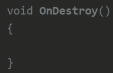
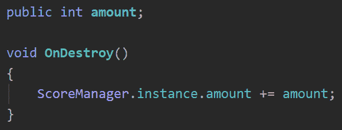
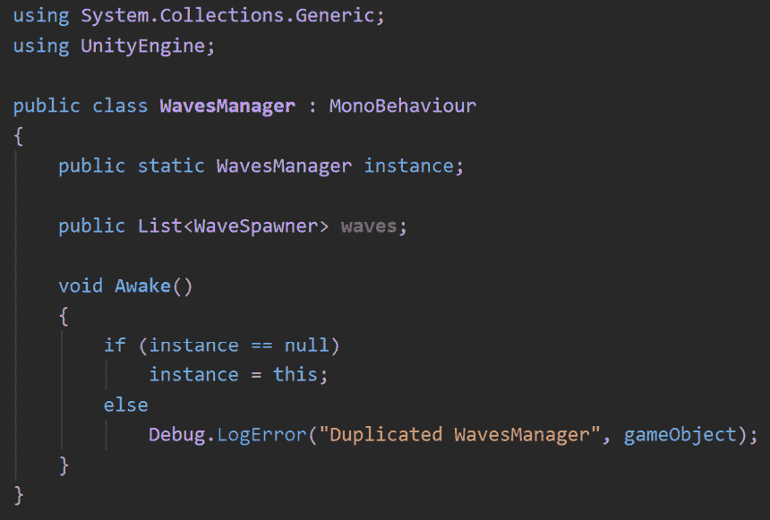
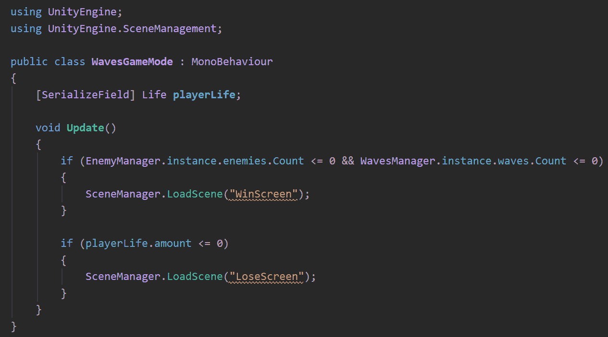
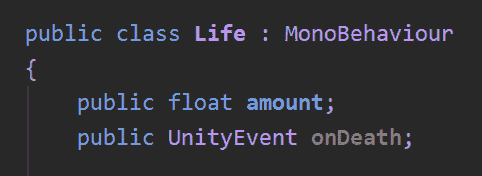
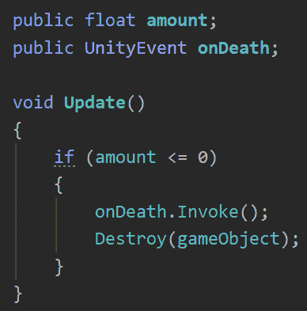
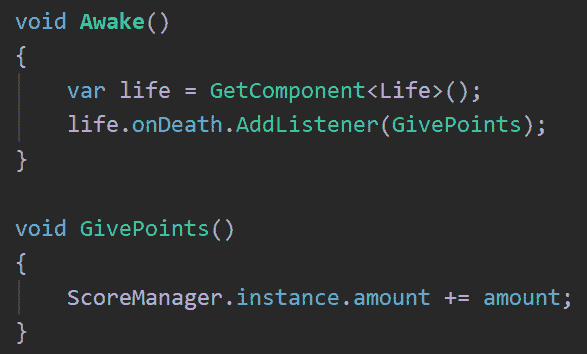
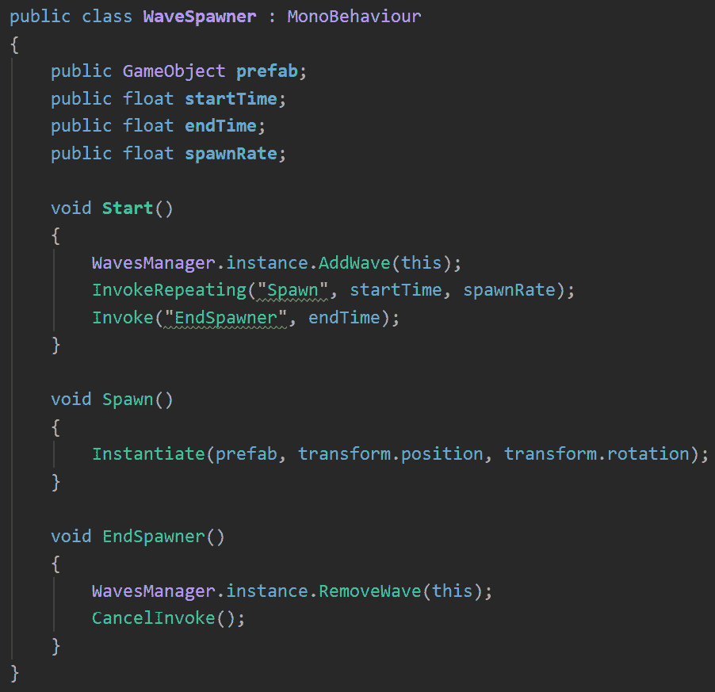

# 第十六章：赢和输的条件

既然我们已经有了基本的游戏体验，现在是时候让游戏在某个时候结束，无论是赢还是输。一种常见的实现方法是通过分离的组件来监视一组对象，以检测需要发生的特定情况，比如玩家生命值变为 0 或者所有波次都被清除。我们将通过管理者的概念来实现这一点，管理者组件将管理多个对象并监控它们。

在本章中，我们将研究以下管理器概念：

+   创建对象管理器

+   创建游戏模式

+   通过事件改进我们的代码

有了这些知识，你不仅能够创建游戏的胜利和失败条件，还能以正确的结构方式使用设计模式，比如单例和事件监听器。这些技能不仅对创建游戏的胜利和失败功能的代码有用，对任何代码都有用。

# 创建对象管理器

场景中并非每个对象都是可以看到、听到或碰撞的。有些对象也可以存在于概念上，而不是实体的东西。想象一下，你需要记录敌人的数量，你会把它保存在哪里？你还需要一个地方来保存玩家的当前分数，你可能会认为它可以保存在玩家身上，但如果玩家死亡并重生会发生什么？数据会丢失！在这种情况下，管理者的概念可以是解决我们的第一个游戏中的有用方式，所以让我们来探索一下。

在本章中，我们将看到以下对象管理器的概念：

+   实现单例设计模式

+   使用单例创建管理器

我们将从讨论单例设计模式是什么以及它如何帮助我们简化对象之间的通信开始。通过它，我们将创建管理者对象，这将允许我们集中一组对象的信息，等等。让我们开始讨论单例设计模式。

## 实现单例设计模式

设计模式通常被描述为常见问题的常见解决方案。在编写游戏代码时，你将不得不做出许多编码设计决策，但幸运的是，解决最常见情况的方法是众所周知和有文档记录的。在本节中，我们将讨论最常见的设计模式之一，即单例模式，这是一个非常有争议但在简单项目中实现起来非常方便的设计模式。

当我们需要一个对象的单个实例时，就会使用单例模式，这意味着一个类不应该有多个实例，并且我们希望它易于访问（不一定，但在我们的场景中很有用）。在我们的游戏中有很多情况可以应用这个模式，例如`ScoreManager`，一个将保存当前分数的组件。在这种情况下，我们永远不会有多个分数，所以我们可以利用单例管理器的好处。

一个好处是确保我们不会有重复的分数，这使我们的代码更不容易出错。此外，到目前为止，我们需要创建公共引用并通过编辑器拖动对象来连接两个对象或使用`GetComponent`来查找它们，但是通过这种模式，我们将全局访问我们的单例组件，这意味着你只需写组件的名称，就可以访问它。最后，只有一个`ScoreManager`组件，因此通过编辑器指定它是多余的。这类似于`Time.deltaTime`，负责管理时间的类——我们只有一个时间。

重要提示

如果你是一个高级程序员，现在可能会考虑代码测试和依赖注入，你是对的，但请记住，我们试图写简单的代码，所以我们将坚持这个简单的解决方案。

让我们创建一个 Score Manager 对象，负责处理分数，以示例展示单例模式，具体操作如下：

1.  创建一个空的游戏对象（`ScoreManager`；通常，管理器会放在空对象中，与场景中的其他对象分开。

1.  在这个对象上添加一个名为`ScoreManager`的脚本，其中包含一个名为`amount`的`int`字段，用于保存当前分数。

1.  添加一个名为`instance`的`ScoreManager`类型字段，但在其前面加上`static`关键字；这将使变量成为全局变量，意味着可以通过简单地写出其名称在任何地方访问它：

图 16.1 – 可以在代码中任何地方访问的静态字段

1.  在`Awake`中，检查`instance`字段是否不为空，如果是，则使用`this`引用将自己设置为实例引用。

1.  在空检查`if`语句的`else`子句中，打印一条消息，指示存在第二个`ScoreManager`实例必须被销毁：

图 16.2 – 检查是否只有一个单例实例

这个想法是将唯一的`ScoreManager`实例的引用保存在静态字段`instance`中，但如果用户错误地创建了两个带有`ScoreManager`组件的对象，这个`if`语句将会检测到并通知用户错误，并要求他们采取行动。在这种情况下，第一个`ScoreManager`实例执行`Awake`时会发现没有设置实例（字段为空），所以它会将自己设置为当前实例，而第二个`ScoreManager`实例会发现实例已经设置，并会打印消息。请记住，`instance`是一个静态字段，是所有类之间共享的字段，不同于常规引用字段，其中每个组件都有自己的引用，所以在这种情况下，我们在场景中添加了两个`ScoreManagers`，它们都将共享相同的实例字段。

为了稍微改进示例，最好有一种简单的方法来找到游戏中的第二个`ScoreManager`。它将被隐藏在层次结构的某个地方，很难找到。我们可以用`Debug.Log`替换`print`，基本上是一样的，但允许我们向函数传递第二个参数，即一个对象，在控制台中点击消息时可以突出显示。在这种情况下，我们将传递`gameObject`引用，以允许控制台突出显示重复的对象：

图 16.3 – 使用 Debug.Log 在控制台中打印消息

1.  点击日志消息后，此游戏对象将在层次结构中突出显示：

图 16.4 – 点击消息后突出显示的对象

1.  最后，可以通过将`Debug.Log`替换为`Debug.LogError`来进行一些改进，这样也会打印消息，但会带有错误图标。在真实的游戏中，控制台中会有大量的消息，将错误消息突出显示在信息消息之上将有助于我们快速识别它们：

图 16.5 – 使用 LogError 打印错误消息

1.  尝试运行代码并观察控制台中的错误消息：

图 16.6 – 控制台中的错误消息

下一步将是在某个地方使用这个单例模式，所以在这种情况下，我们将使敌人在被杀死时给予分数，具体操作如下：

1.  给`Enemy`预制体添加一个名为`ScoreOnDeath`的脚本，其中包含一个名为`amount`的`int`字段，它将指示敌人被杀时将给出的积分数。记得在预制体的编辑器中将值设置为非 0 的值。

1.  创建`OnDestroy`事件函数，当这个对象被销毁时，Unity 将自动调用它；在我们的情况下，是敌人：

图 16.7 – OnDestroy 事件函数

重要提示

考虑到`OnDestroy`函数在我们切换场景或游戏退出时也会被调用，所以在这种情况下，也许我们会在切换场景时得到积分，这是不正确的。到目前为止，在我们的情况下这不是问题，但是在本章的后面，我们将看到一种防止这种情况发生的方法。

1.  通过编写`ScoreManager.instance`在`OnDestroy`函数中访问单例引用，并将我们脚本的`amount`字段添加到单例的`amount`字段中，以增加在杀死敌人时的得分：

图 16.8 – 完整的 ScoreOnDeath 组件类内容

1.  在层次结构中选择`ScoreManager`，点击播放，杀死一些敌人，看到得分随着每次杀敌而增加。记得设置预制体的`ScoreOnDeath`组件的`amount`字段。

正如你所看到的，单例简化了访问`ScoreManager`的方式，并防止我们拥有两个相同对象的版本，这将有助于减少我们代码中的错误。需要注意的是，现在你可能会诱惑只是把所有东西都变成单例，比如玩家生命或玩家子弹，并且只是为了让你的生活更容易地创建游戏玩法，比如道具，虽然这样完全可行，但要记住你的游戏会改变，我的意思是，会有很多变化；任何真正的项目都会经历这些。也许今天，游戏只有一个玩家，但也许在未来，你会想要添加第二个玩家或一个 AI 伙伴，并且你希望道具也能影响到他们，所以如果你滥用单例模式，你将很难处理这些情况。也许伙伴会试图拿到道具，但主要玩家会被治愈！

关键是尽量少地使用这种模式，只有在没有其他解决问题的办法时才使用。老实说，总是有办法可以解决问题而不使用单例，但对于初学者来说，这些方法实现起来可能会更加困难，所以我更倾向于简化一下你的生活，让你保持动力。通过足够的练习，你将达到一个可以提高编码标准的水平。

现在我们知道如何创建单例了，让我们完成一些游戏后期需要的其他管理器。

## 使用单例创建管理器

有时，我们需要一个地方来整合一组类似的对象的信息，例如，一个敌人管理器，用来检查敌人的数量并可能访问它们的数组来迭代它们并执行某些操作，或者`MissionManager`，用来访问游戏中所有的活动任务。同样，这些情况可以被视为单例，即不会重复出现的单个对象（在我们当前的游戏设计中），所以让我们创建我们游戏中需要的那些，即`EnemyManager`和`WaveManager`。

在我们的游戏中，`EnemyManager`和`WaveManager`只是保存游戏中现有敌人和波的引用数组的地方，只是一种了解它们当前数量的方式。有一些方法可以搜索特定类型的所有对象来计算它们的数量，但这些函数很昂贵，不建议使用，除非你真的知道自己在做什么。因此，具有一个单独更新的引用列表的单例，将需要更多的代码，但性能会更好。此外，随着游戏功能的增加，这些管理器将具有更多的功能和辅助函数来与这些对象交互。

让我们从敌人管理器开始，做以下操作：

1.  将名为`Enemy`的脚本添加到敌人预制件中；这将是将此对象与`EnemyManager`连接的脚本。

1.  创建一个名为`EnemyManager`的空`GameObject`，并向其添加名为`EnemiesManager`的脚本。

1.  在脚本内创建一个名为`instance`的`EnemiesManager`类型的公共静态字段，并在`Awake`中添加与`ScoreManager`中相同的单例重复检查。

1.  创建一个名为`enemies`的`List<Enemy>`类型的公共字段：！图 16.9-敌人组件列表

图 16.9-敌人组件列表

C#中的列表表示动态数组，可以添加和删除对象的数组。您会发现您可以在编辑器中向此列表添加和删除元素，但保持列表为空；我们将以另一种方式添加敌人。请注意，`List`在`System.Collections.Generic`命名空间中；您将在我们的脚本开头找到`using`语句。此外，请考虑您可以将列表设置为私有，并通过 getter 将其暴露给代码，而不是将其设置为公共字段；但通常情况下，我们将尽可能简化我们的代码。

重要提示

请记住，`List`是一个类类型，因此必须实例化，但由于此类型在编辑器中具有暴露支持，Unity 将自动实例化它。在您想要一个非编辑器暴露的列表，例如私有列表或常规非组件 C#类中的列表的情况下，您必须使用 new 关键字进行实例化。

C#列表在内部实际上是作为数组实现的。如果需要链表，请查看`LinkedList`集合类型。

1.  在`Enemy`脚本的`Start`函数中，访问`EnemyManager`单例，并使用敌人列表的`Add`函数，将此对象添加到列表中。这将在管理器中“注册”此敌人为活动状态，以便其他对象可以访问管理器并检查当前的敌人。 `Start`函数在所有`Awake`函数调用之后调用，这很重要，因为我们需要确保在敌人的`Start`函数之前执行管理器的`Awake`函数，以确保有一个管理器设置为实例。

重要提示

我们通过`Start`函数解决的问题称为竞争条件，即两段代码不能保证以相同的顺序执行，而`Awake`执行顺序可能会因不同原因而改变。代码中有很多情况会发生这种情况，因此请注意代码中可能出现的竞争条件。此外，您可能考虑在这里使用更高级的解决方案，例如延迟初始化，这可以为您提供更好的稳定性，但出于简单起见并探索 Unity API，我们现在将使用`Start`函数方法。

1.  在`OnDestroy`函数中，从列表中移除敌人，以保持列表中只有活动的敌人：

！图 16.10-注册自己为活动敌人的敌人脚本

图 16.10-注册自己为活动敌人的敌人脚本

有了这个，现在我们有了一个集中的地方以简单而有效的方式访问所有活动的敌人。我向你挑战，用`WaveManager`做同样的事情，它将拥有所有活动波的集合，以后检查所有波是否完成工作以考虑游戏是否获胜。花点时间解决这个问题；你将在以下截图中找到解决方案，从`WavesManager`开始：

图 16.11 - 完整的 WavesManager 脚本

你还需要`WavesSpawner`脚本：

图 16.12 - 修改后的 WaveSpawner 脚本以支持 WavesManager

正如你所看到的，`WaveManager`的创建方式与`EnemyManager`相同，只是一个具有`WaveSpawner`引用列表的单例，但`WaveSpawner`是不同的。我们在`WaveSpawner`的`Start`事件中执行列表的`Add`函数，将波注册为活动波，但`Remove`函数需要更多的工作。

这个想法是在生成器完成其工作后，当波完成生成所有敌人时，从活动波列表中注销该波。在进行这种修改之前，我们使用`Invoke`在一段时间后调用`CancelInvoke`函数来停止生成，但现在在结束时间之后我们需要做更多的事情。我们将在指定的波结束时间后调用`CancelInvoke`，而是调用一个名为`EndSpawner`的自定义函数，它将调用`CancelInvoke`来停止生成器，`Invoke Repeating`，但也将调用`WavesManager`列表中的`Remove`函数，以确保在`WaveSpawner`完成其工作时确切地调用从列表中移除。

使用对象管理器，我们现在集中了关于一组对象的信息，并且可以在这里添加各种对象组逻辑，但除了拥有这些信息以更新 UI（我们将在下一章中进行），我们还可以使用这些信息来检测我们游戏的胜利和失败条件是否满足，创建一个游戏模式对象来检测这一点。

# 创建游戏模式

我们已经创建了对象来模拟游戏中许多方面的玩法，但游戏总归需要在某个时候结束，无论是赢还是输。就像往常一样，问题是在哪里放置这个逻辑，这导致了更多的问题。主要问题是，我们是否总是以相同的方式赢得或输掉游戏？我们是否会有一个特殊的级别，其标准不同于杀死所有波，比如定时生存？只有你知道这些问题的答案，但如果现在的答案是否定的，这并不意味着以后不会改变，因此最好是准备我们的代码以无缝适应变化。

重要提示

老实说，让我们的代码无缝适应变化几乎是不可能的；没有办法编写完美的代码来考虑每种可能的情况，我们总是需要迟早重写一些代码。我们将尽量使代码尽可能适应变化；总是这样做并不会消耗大量的开发时间，有时快速编写简单的代码比缓慢编写复杂的代码更可取，而且可能并不必要，因此明智地平衡你的时间预算。

为此，我们将胜利和失败条件的逻辑分离到自己的对象中，我喜欢称之为“游戏模式”（不一定是行业标准）。这将是一个组件，将监督游戏，检查需要满足的条件以考虑游戏结束。它将像我们游戏的裁判一样。游戏模式将不断检查对象管理器中的信息，也许还有其他信息来源，以检测所需的条件。将这个对象与其他对象分离允许我们创建具有不同游戏模式的不同级别；只需在该级别中使用另一个游戏模式脚本，就可以了。

在我们的情况下，目前我们将只有一个游戏模式，它将检查波次和敌人的数量是否变为 0，这意味着我们已经杀死了所有可能的敌人并且游戏获胜。此外，它还将检查玩家的生命值是否达到 0，在这种情况下认为游戏失败。让我们通过以下方式创建它：

1.  创建一个`GameMode`空对象，并向其添加一个`WavesGameMode`脚本。正如您所看到的，我们使用了一个描述性的名称来命名脚本，考虑到我们可以添加其他游戏模式。

1.  在其`Update`函数中，使用敌人和波次管理器检查敌人和波次的数量是否达到了`0`；在这种情况下，目前只需在控制台中`print`一条消息。所有列表都有一个`Count`属性，它将告诉您存储在其中的元素数量。

1.  添加一个名为`PlayerLife`的`Life`类型的`public`字段，并将玩家拖放到其中；这样也可以检测失败条件。

1.  在`Update`中，添加另一个检查，以检测`PlayerLife`引用的生命值是否达到了`0`，如果是，就在控制台中`print`一个失败消息：

图 16.13 - 在 WavesGameMode 中检查胜利和失败条件

1.  玩游戏并测试两种情况，即玩家生命值是否达到 0 或者您是否已经杀死了所有敌人和波次。

重要提示

请记住，我们不希望有两个此对象的实例，因此我们也可以将其设置为单例，但由于其他对象不会访问此对象，这可能是多余的；我会把这个决定留给您。无论如何，请记住，这不会阻止您实例化两个不同的`GameModes`；为此，您可以创建一个`GameMode`基类，其中包含单例功能，以防止在同一场景中出现两个`GameModes`。

现在，是时候用更有趣的东西替换这些消息了。目前，我们只会将当前场景更改为一个胜利场景和失败场景，它们只会有一个带有胜利和失败消息以及一个再玩一次按钮的 UI。将来，您可以添加一个主菜单场景，并提供返回选项。让我们通过以下方式做到这一点：

1.  创建一个新场景（`WinScreen`）。

1.  添加一个 UI 文本，并将其与文本居中，写上“你赢了！”。

1.  在文本下方添加一个 UI 按钮，并将其文本更改为“再玩一次”：

图 16.14 - WinScreen

1.  在项目视图中选择场景，按*Ctrl* + *D*（Mac 上为*Cmd* + *D*）来复制场景。将其重命名为`LoseScreen`。

1.  双击`LoseScreen`场景以打开它，然后将“你赢了！”文本更改为“你输了！”文本。

1.  进入`WinScreen`，`LoseScreen`，以及我们迄今为止创建的游戏场景，我称之为`Game`，所以只需将这些场景从项目视图拖动到构建设置窗口的列表中；我们需要这样做来确保游戏模式脚本能够正确地改变场景。另外，请注意，这个列表中的第一个场景将是在最终版本（即构建版本）中打开的第一个场景，因此您可能希望根据这一点重新排列列表：

图 16.15 - 注册要包含在游戏构建中的场景

1.  在`WavesGameMode`中，添加一个`using`语句，用于启用此脚本中的场景更改功能的`UnityEngine.SceneManagement`命名空间。

1.  用`SceneManager.LoadScene`函数替换控制台`print`消息，该函数将接收一个字符串，其中包含要加载的场景的名称；在这种情况下，它将是`WinScreen`和`LoseScreen`。您只需要场景名称，而不是整个文件路径。

如果你想链接不同的关卡，可以创建一个`public`字符串字段，允许你通过编辑器指定要加载哪些场景。记得将场景添加到构建设置中，否则当你尝试更改场景时，控制台会收到错误消息：

图 16.16 – 使用`SceneManager`更改场景

1.  玩游戏，检查场景是否正确更改。

重要提示

现在，我们选择了最简单的方式来显示我们是输了还是赢了，但也许在未来，你会希望有比突然改变场景更温和的方式，比如可能使用`Invoke`等待一段时间来延迟改变，或者直接在游戏中显示获胜消息而不改变场景。在测试游戏时，考虑到玩家在玩游戏时是否理解发生了什么，游戏反馈对于让玩家知晓正在发生的事情是很重要的，这并不是一件容易的事情。

现在我们有一个完全功能的简单游戏，具有机制和胜利和失败条件，虽然这已经足够开始开发游戏的其他方面，但我想讨论一下我们当前的管理器方法存在的一些问题，以及如何通过事件解决这些问题。

# 通过事件改进我们的代码

到目前为止，我们使用了 Unity 事件函数来检测游戏中可能发生的情况，比如`Awake`和`Update`。这些函数是 Unity 用来让两个组件进行通信的方式，比如`OnTriggerEnter`，这是刚体通知游戏对象中的其他组件发生了碰撞的一种方式。在我们的情况下，我们在 Update 中使用`if`来检测其他组件的变化，比如`GameMode`检查敌人数量是否达到 0。但是，如果敌人管理器在发生变化时通知我们，我们可以在那一刻进行检查，就像刚体告诉我们碰撞发生的情况一样，而不是每帧都检查碰撞。

有时，我们依赖 Unity 事件来执行逻辑，比如在`OnDestroy`事件中给予分数，该事件通知我们对象被销毁时，但由于事件的性质，它可能在我们不希望加分的情况下被调用，比如场景改变或游戏关闭时。在这些情况下对象被销毁，但不是因为玩家杀死了敌人，导致分数被提高，这时候就需要一个事件告诉我们玩家的生命值已经达到 0，以执行这个逻辑，而不是依赖通用的销毁事件。

事件的理念是改进我们对象之间的通信模型，确保在某个情况发生时，对该情况感兴趣的部分被通知以做出相应反应。Unity 有很多事件，但我们可以创建特定于我们游戏逻辑的事件。让我们从之前讨论的分数场景中开始看到这个应用；想法是让`Life`组件有一个事件来通知其他组件，对象被销毁是因为它的生命值达到了 0。

有几种方法可以实现这一点，我们将使用与`Awake`和`Update`方法略有不同的方法；我们将使用`UnityEvent`字段类型。这是一种能够保存引用函数的字段类型，当我们想要执行时，就像 C#委托一样，但具有其他好处，比如更好的 Unity 编辑器集成。要实现这一点，按照以下步骤进行：

1.  在`Life`组件中，创建一个名为`onDeath`的`UnityEvent`类型的`public`字段。这个字段将代表一个事件，其他类可以订阅它以便在`Life`达到 0 时知晓：

图 16.17 – 创建自定义事件字段

1.  如果你保存脚本并进入编辑器，你可以在检视器中看到事件。Unity 事件支持在编辑器中订阅方法，这样我们可以连接两个对象。我们将在 UI 脚本章节中使用这个功能，所以现在就忽略它吧：

图 16.18 – UnityEvents 显示在检视器中

重要提示

你可以使用通用委托动作或自定义委托来创建事件，而不是使用`UnityEvent`，除了某些性能方面的差异之外，唯一显著的区别是`UnityEvent`会显示在编辑器中，就像*步骤 2*中演示的那样。

1.  当生命值达到`0`时，调用事件的`Invoke`函数，这样我们就告诉任何对该事件感兴趣的人，事件已经发生：

图 16.19 – 执行事件

1.  在`ScoreOnDeath`中，将`OnDestroy`函数重命名为`GivePoints`或者你喜欢的其他名称；这里的想法是停止在`OnDestroy`事件中给分。

1.  在`ScoreOnDeath`脚本的`Awake`函数中，使用`GetComponent`获取`Life`组件并将其保存在一个局部变量中。

1.  调用`Life`引用的`onDeath`字段的`AddListener`函数，并将`GivePoints`函数作为第一个参数传递。这样做的想法是告诉`Life`在`onDeath`事件被调用时执行`GivePoints`。这样，`Life`会通知我们发生了什么情况。记住，你不需要调用`GivePoints`，只需要将函数作为字段传递即可：

图 16.20 – 订阅 OnDeath 事件以在该场景中给分

重要提示

考虑在`OnDestroy`中调用`RemoveListener`；通常情况下，尽可能取消订阅监听器是方便的，以防止内存泄漏（引用阻止 GC 释放内存）。在这种情况下，这并不是完全必要的，因为`Life`和`ScoreOnDeath`组件将同时被销毁，但尽量养成这种良好的习惯。

1.  保存，在编辑器中选择`ScoreManager`，然后点击播放进行测试。尝试在播放模式下从层次结构中删除一个敌人，以检查分数不会上升，因为敌人被摧毁不是因为生命值变为 0；你必须通过射击摧毁敌人才能看到分数上升。

现在`Life`有了`onDeath`事件，我们也可以将`WavesGameMode`中对玩家`Life`的检查替换为使用事件，方法如下：

1.  在`WavesGameMode`脚本中创建一个`OnLifeChanged`函数，并将生命检查条件从`Update`移动到这个函数中。

1.  在`Awake`中，订阅玩家`Life`组件引用的`onDeath`事件到这个新函数：

图 16.21 – 使用事件检查失败条件

如你所见，创建自定义事件可以让你检测到 Unity 中默认情况之外的更具体的情况，并且保持你的代码清晰，而不需要在`Update`函数中不断询问条件，这并不一定是坏事，但事件方法可以生成更清晰的代码。

记住，我们也可以通过玩家的基础生命值达到 0 来输掉游戏，我们将在本书的后面探讨玩家基础的概念，但现在，让我们创建一个立方体，代表敌人将攻击以减少基础生命值的对象，就像基础核心一样。考虑到这一点，我挑战你将这个额外的失败条件添加到我们的脚本中。完成后，你可以在以下截图中检查解决方案：

图 16.22 – 完整的 WavesGameMode 失败条件

正如你所看到的，我们只是重复了生活事件的订阅：记得创建一个对象来代表玩家基地的伤害点，给它添加一个`Life`脚本，并将其作为`WavesGameMode`的玩家基地生命引用拖放进去。

现在，让我们通过将其应用于管理器来继续说明这个概念，以防止游戏模式每帧检查条件：

1.  在`EnemyManager`中添加一个`UnityEvent`字段，称为`onChanged`。每当敌人被添加或从列表中移除时，将执行此事件。

1.  创建两个函数，`AddEnemy`和`RemoveEnemy`，都接收`Enemy`类型的参数。想法是，`Enemy`不直接向列表中添加和移除自己，而是应该使用这些函数。

1.  在这两个函数中，调用`onChanged`事件通知其他人敌人列表已经更新。想法是任何想要向列表中添加或移除敌人的人都需要使用这些函数：

图 16.23 – 当敌人被添加或移除时调用事件

重要提示

在这里，我们的问题是没有什么能阻止我们绕过这两个函数直接使用列表。你可以通过将列表设置为私有，并使用`IReadOnlyList`接口来公开它来解决这个问题。请记住，这种方式，列表不会出现在编辑器中以进行调试。

1.  更改`Enemy`脚本以使用这些函数：

图 16.24 – 使敌人使用 Add 和 Remove 函数

1.  对`WaveManager`和`WaveSpawner`执行相同的过程，创建一个`onChanged`事件，并创建`AddWave`和`RemoveWave`函数，并在`WaveSpawner`中调用它们，而不是直接访问列表。这样，我们可以确保在必要时调用事件，就像我们在`EnemyManager`中所做的那样。尝试自己解决这一步，然后在下面的屏幕截图中检查解决方案，从`WavesManager`开始：

图 16.25 – Wave Manager On Changed 事件实现

此外，`WavesSpawner` 需要更改：

图 16.26 – 实现 AddWave 和 RemoveWave 函数

1.  在`WavesGameMode`中，将`Update`重命名为`CheckWinCondition`，并订阅此函数到`EnemyManager`的`onChanged`事件和`WavesManager`的`onChanged`事件。想法是只在必要时检查敌人和波数的变化。请记住在`Start`函数中订阅事件，因为单例在`Awake`中初始化：

图 16.27 – 当敌人或波数发生变化时检查胜利条件

是的，这种方式，我们需要比以前写更多的代码，而且在功能上，我们并没有得到任何新的东西，但在更大的项目中，通过`Update`检查来管理条件会导致之前讨论过的不同种类的问题，比如竞争条件和性能问题。有一个可扩展的代码库有时需要更多的代码，这就是这种情况之一。

在我们完成之前，需要考虑的一点是，Unity 事件并不是在 Unity 中创建这种事件通信的唯一方式；你会发现一种类似的方法叫做**Action**，这是 Unity 事件的本地 C#版本，我建议你去寻找一下，如果你想看看所有的选择。

# 总结

在本章中，我们完成了游戏的重要部分，结局，无论是胜利还是失败。我们讨论了一种简单但强大的方法，通过使用通过单例创建的管理器来分离不同的责任层，以确保每种类型的管理器都不会有多个实例，并通过静态访问简化它们之间的连接（这是在发现代码测试的那一天要考虑的事情）。此外，我们讨论了事件的概念，以简化对象之间的通信，以防止问题并创建更有意义的对象之间的通信。

有了这些知识，你现在不仅能够检测游戏的胜利和失败条件，还能以更好的结构方式来做到这一点。这些模式可以用来改进我们的游戏代码，我建议你尝试将其应用到其他相关场景中。

在下一章中，我们将探讨如何创建视觉和音频反馈以响应我们的游戏玩法，结合本书第二部分中集成的脚本和资产。
