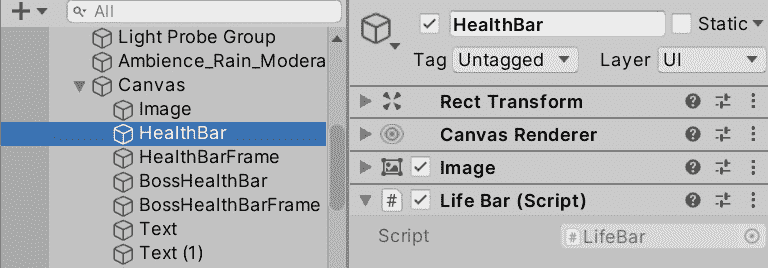
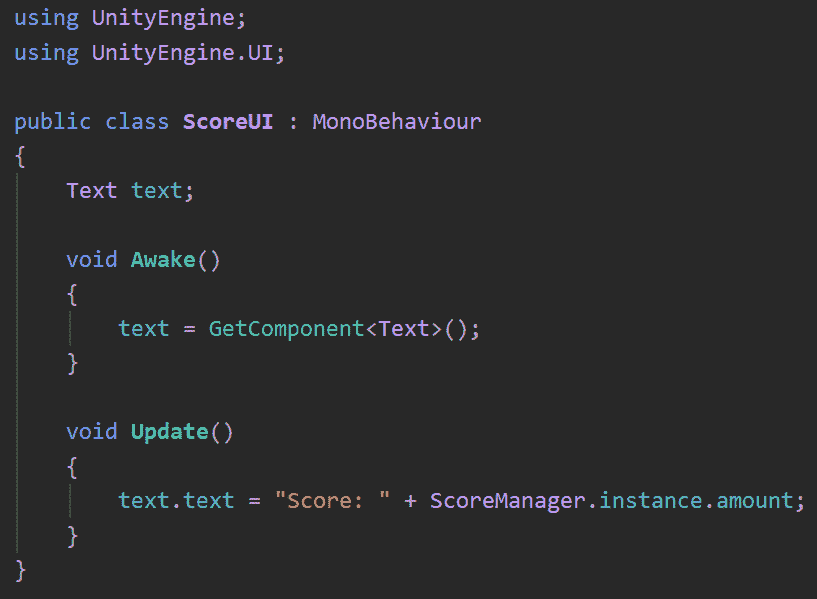
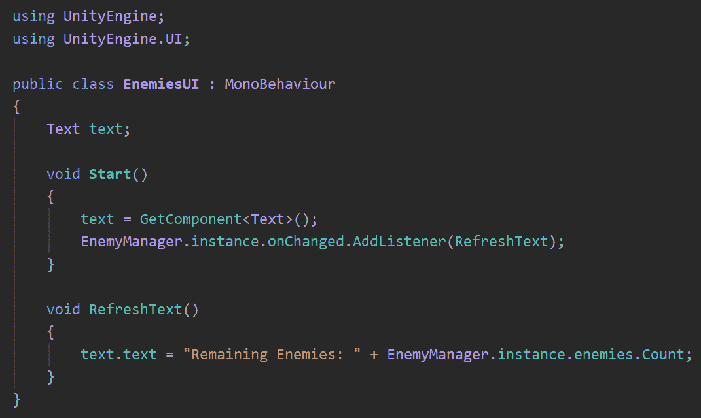
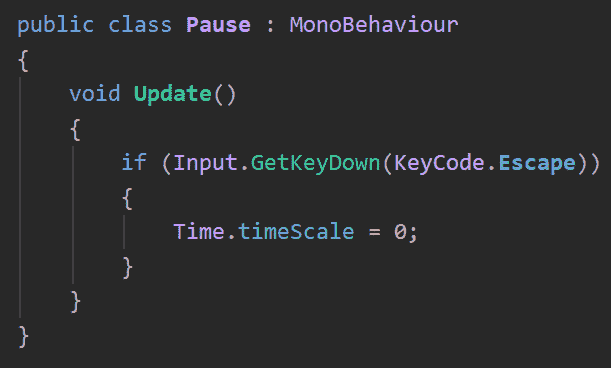
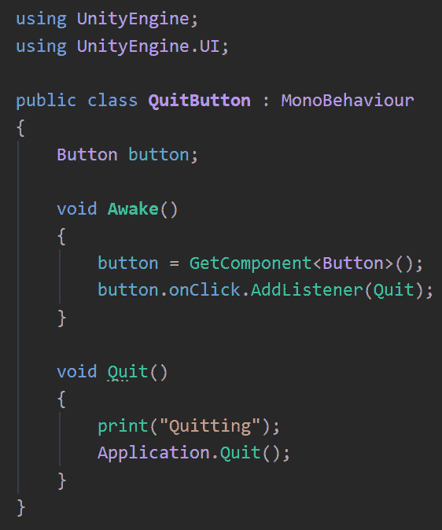
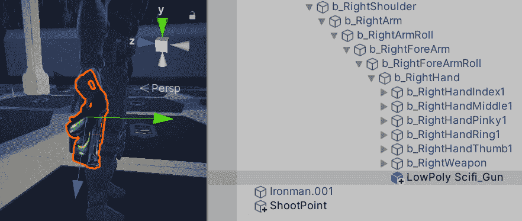
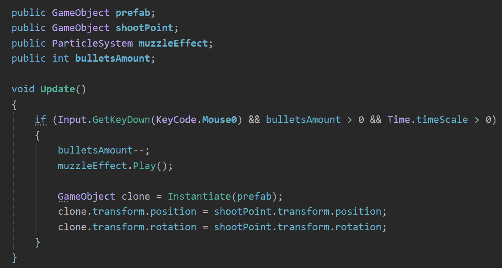
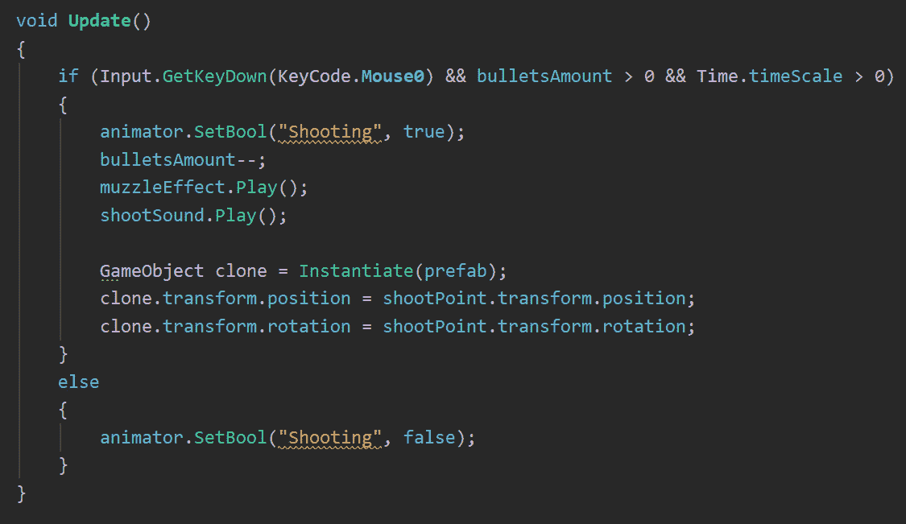
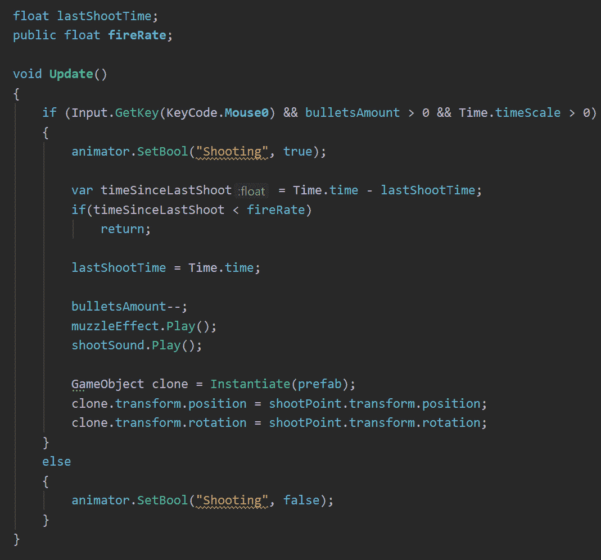

# 第十七章：UI、声音和图形脚本

在游戏中，即使玩家通过摄像机看到游戏，也有一些重要信息是肉眼不可见的，比如剩余子弹的确切数量、他们的生命、敌人、是否有敌人在他们身后等等。我们已经讨论过如何通过 UI、声音和视觉效果（VFX）来解决这些问题，但随着我们在游戏中开始进行脚本编写，这些元素也需要适应游戏。本章的理念是通过脚本使我们的 UI、声音和 VFX 对游戏情况做出反应，反映世界上正在发生的事情。

在本章中，我们将讨论以下反馈脚本概念：

+   UI 脚本

+   脚本反馈

在本章结束时，您将能够使 UI 对游戏情况做出反应，以文本和条形图的形式显示相关信息，并且还能够使游戏对与 UI 的交互做出反应，比如按钮。此外，您还将能够使游戏通过其他媒介向用户传达这些信息，比如声音和粒子图形，这些可以和 UI 一样有效，但更具吸引力。

# UI 脚本

我们之前创建了一个包含条形、文本和按钮等元素的 UI 布局，但到目前为止，它们都是静态的。我们需要使它们适应游戏的实际状态。在本章中，我们将讨论以下 UI 脚本概念：

+   在 UI 中显示信息

+   编写暂停菜单的程序

我们将首先看看如何使用脚本在我们的 UI 上显示信息，这些脚本修改了与 Canvas 元素一起显示的文本和图像。之后，我们将创建暂停功能，该功能将在整个 UI 中使用。

## 在 UI 中显示信息

如前所述，我们将使用 UI 向用户显示信息，以便他们做出明智的决定，因此让我们从看看如何使玩家的生命条对我们之前创建的`Life`脚本中剩余的生命做出反应开始：

1.  添加一个名为`Image`的新脚本，用于表示生命条：

图 17.1 – 玩家 HealthBar 画布中的生命条组件

1.  在`Life` `Bar`脚本中添加一个`Life`类型字段。这样，我们的脚本将询问编辑器我们将监视哪个`Life`组件。保存脚本：

图 17.2 – 可在编辑器中配置的对生命组件的引用

1.  在编辑器中，将`Player`游戏对象从`targetlife`属性拖动到生命条引用玩家的`Life`组件，并记得在拖动`LifeBar`脚本之前选择`HealthBar`对象，以检查玩家剩余的生命。有趣的是，敌人也有相同的`Life`组件，所以我们可以轻松地使用这个组件为游戏中具有生命的其他对象创建生命条：

图 17.3 – 拖动 Player 以引用其生命组件

1.  在脚本的前几行的`using`语句之后添加`using UnityEngine.UI;`行。这将告诉 C#我们将与 UI 脚本进行交互：

图 17.4 – 我们脚本中的所有 using 语句。我们现在不会使用它们，但让我们暂时保留它们

1.  创建一个`private`字段（不带`public`关键字），类型为`Image`。我们将在这里保存对组件的引用：

图 17.5 – 对图像的私有引用

1.  在`Awake`中使用`GetComponent`，访问我们游戏对象（`HealthBar`）中`Image`组件的引用，并将其保存在`image`字段中。通常情况下，想法是只获取一次这个引用，并在`Update`函数中保存以供以后使用。当然，当你将这个组件放在一个带有`Image`组件的对象中时，这将总是有效。如果不是的话，另一个选择就是创建一个`Image`类型的公共字段，并将图像组件拖放到其中：

图 17.6 – 在此对象中保存对 Image 组件的引用

1.  在`LifeBar`脚本中创建一个`Update`事件函数。我们将使用这个函数来根据玩家的生命不断更新生命条。

1.  在`Update`事件中，将生命值除以`100`，以便在`0`到`1`范围内表示我们当前的生命百分比（假设我们的最大生命是`100`），并将结果设置在`Image`组件的`fillAmount`字段中，如下面的截图所示。请记住，`fillAmount`期望一个在`0`到`1`之间的值，`0`表示条是空的，`1`表示条是满的：

图 17.7 – 根据 Life 组件更新 LifeBar 脚本的 Image 组件的填充量

重要提示：

记住，在代码中放入`100`被认为是硬编码（也被称为魔术数字），这意味着以后更改该值需要我们在代码中查找该值，这在大型项目中是一项复杂的任务。这就是为什么它被认为是不好的实践。最好在`Life`组件中有一个`Maximum Life`字段，或者至少有一个包含这个值的常量。

1.  保存脚本，并在编辑器中选择玩家并开始游戏。在**播放**模式下，按下*Esc*键以重新获得鼠标访问权限，并在检查器窗口中更改玩家的生命值，以查看生命条如何相应更新。你也可以通过让玩家受到伤害来测试这一点，比如让敌人生成子弹（稍后会详细介绍敌人）：

图 17.8 – 完整的 LifeBar 脚本

重要提示：

在上一章中，我们探讨了事件的概念，以便检测其他对象状态的变化。生命条是另一个使用事件的例子，因为我们可以在生命实际改变时改变图像的填充量。我向你挑战，尝试创建一个生命改变时触发事件，并使用我们在上一章中看到的脚本来实现这个脚本。

你可能会认为这个 UI 行为可以直接编码在`Life`组件中，这是完全可能的，但这里的想法是创建简单的脚本，减少对我们代码的压力。每个脚本应该只有一个修改的原因，将 UI 行为和游戏行为混合在一个脚本中会使脚本具有两个责任，这将导致脚本有两个可能的修改原因。通过这种方法，我们还可以通过将相同的脚本添加到其生命条中并将我们在上一章中创建的**基础伤害**对象拖放为目标生命，来设置玩家的基础生命条。

重要提示：

我们刚提到的单一对象责任原则是作为 SOLID 的五个面向对象编程原则之一。如果你不知道 SOLID 是什么，我强烈建议你查一下，以改进你的编程最佳实践。

现在我们已经解决了玩家的生命条，让我们根据玩家剩余的子弹数量更新`Bullets`标签。这里需要考虑的是，我们当前的玩家射击脚本有无限的子弹，所以让我们通过以下步骤来改变这一点：

1.  在 Player Shooting 脚本中添加一个名为`bulletsAmount`的公共`int`类型字段。

1.  在检查左鼠标按钮的压力的`if`语句中，添加一个条件来检查子弹数量是否大于`0`。

1.  在`if`语句中，减少子弹数量`1`：

图 17.9 - 限制射击的子弹数量

现在我们有一个字段指示剩余子弹的数量，我们可以创建一个脚本来显示该数字在 UI 中，方法如下：

1.  将`PlayerBulletsUI`脚本添加到子弹的`Text`游戏对象中。在我的案例中，我将其称为`Bullets Label`。

1.  添加`using UnityEngine.UI`语句，并在`Awake`中添加一个`Text`类型的私有字段，将其保存在我们自己的`Text`组件的引用中：

图 17.10 - 缓存对我们自己的文本组件的引用

1.  创建一个名为`targetShooting`的`PlayerShooting`类型的公共字段，并将`Player`拖放到编辑器中的此属性中。就像生命条组件一样，我们的 UI 脚本将访问具有剩余子弹的脚本以更新文本，以保持两个脚本（`Text`和`PlayerShooting`）的责任分离。

1.  创建一个`Update`语句，在其中，使用文本引用的`text`字段（我知道，令人困惑）与`targetShooting`引用的`bulletsAmount`字段的连接来设置它。这样，我们将根据当前的子弹数量替换标签的文本：

图 17.11 - 更新子弹文本标签

重要提示：

请记住，连接字符串会分配内存，所以我再次敦促您只在必要时使用事件来做这件事。

如果您查看这两个脚本，您会发现一个模式。您可以访问`UI`和`Gameplay`组件，并相应地更新`UI`组件，大多数 UI 脚本都会以相同的方式运行。牢记这一点，我挑战您创建必要的脚本来使用`using UnityEngine.UI`来使用`Text`组件。完成后，您可以将您的解决方案与以下截图中的解决方案进行比较，从`ScoreUI`开始：

图 17.12 - ScoreUI 脚本

此外，我们还需要`WavesUI`组件：

图 17.13 - WavesUI 脚本

最后，我们需要`EnemiesUI`：

图 17.14 - EnemiesUI 脚本

正如您所看到的，我们已经使用了管理器中已编码的事件来仅在必要时更改 UI。现在我们已经编写了 UI 标签和条，让我们编写`Pause`菜单。

## 编写暂停菜单

回想一下我们在上一章中创建了一个暂停菜单，但它目前被禁用了，所以让我们让它工作起来。首先，我们需要编写`Pause`，这可能会相当复杂。因此，我们将再次使用一个简单的方法来暂停大多数行为，即停止时间！请记住，我们的大多数移动脚本都使用时间功能，比如`timeScale`。

这个字段将影响 Unity 的时间系统的速度，我们可以将其设置为`0`来模拟时间已经停止，这将暂停动画，停止粒子，并减少`0`，使我们的移动停止。所以，让我们来做吧：

1.  创建一个名为`Pause`的脚本，并将其添加到场景中的一个新对象中，也称为`Pause`。

1.  在`Update`中，检测当按下*Esc*键时，然后在这种情况下，将`Time.timeScale`设置为`0`：

图 17.15 - 停止时间以模拟暂停

1.  保存并测试这个。

您会注意到几乎所有东西都会停止，但您可以看到射击功能仍在工作。这是因为玩家射击脚本不依赖于时间。这里的一个解决方案可能是简单地检查`Time.timeScale`是否大于`0`以防止这种情况发生：

图 17.16 - 在 PSlayer 射击脚本中检查暂停

重要提示：

像往常一样，我们在这里追求了最简单的方法，但有更好的方法。我挑战您尝试创建`PauseManager`，其中包含一个布尔值，指示游戏是否暂停，从而改变`timeScale`。

现在我们有了一个简单但有效的暂停游戏的方法，让我们通过以下方式使**暂停**菜单可见以取消暂停游戏：

1.  在`Pause`脚本中添加一个名为`pauseMenu`的`GameObject`类型字段。想法是将**暂停**菜单拖放到这里，以便我们有一个启用和禁用它的引用。

1.  在`Awake`中，添加`pauseMenu.SetActive(false);`以在游戏开始时禁用**暂停**菜单。即使我们在编辑器中禁用了**暂停**菜单，我们也添加了这个以防我们错误地重新启用它。它必须始终处于禁用状态。

1.  使用相同的函数，但将`true`作为第一个参数传递，启用`UnityEvents`和`Button`脚本。我们的`OnClick`事件，这是一个通知我们特定按钮已被按下的事件。按下这些按钮时让游戏恢复，做如下操作：

1.  在我们的`Pause`脚本中创建一个`Button`类型的字段，名为`resumeButton`，并将`resumeButton`拖放到其中；这样，我们的`Pause`脚本就有了对按钮的引用。

1.  在`Awake`中，为`resumeButton`的`onClick`事件添加名为`OnResumePressed`的监听函数。

1.  使`OnResumePressed`函数将`timeScale`设置为`1`并禁用`Awake`：

图 17.18 - 取消暂停游戏

如果您保存并测试此代码，您会注意到当您恢复时无法单击“暂停”并禁用它：

图 17.19 - 在暂停时显示和隐藏光标

现在您知道如何编写按钮，我挑战您编写“退出”按钮的行为。同样，记得添加`using UnityEngine.UI`。此外，您需要调用`Application.Quit();`来退出游戏，但请注意这在编辑器中不起作用；我们不希望在创建游戏时关闭编辑器。此函数仅在构建游戏时起作用。因此，现在只需调用它，如果您想要打印一条消息以确保按钮正常工作，解决方案在以下截图中提供：

图 17.20 - 退出按钮脚本

此解决方案建议您直接将此脚本添加到其`Button`兄弟组件的`onClick`事件上，并在这种情况下执行`Quit`函数。您还可以将此行为添加到`Pause`脚本中，虽然这样也可以工作，但请记住，如果一个脚本可以分成两个因为它执行两个不相关的任务，最好将其拆分为两个不相关的行为。在这里，暂停行为与退出行为无关。

现在我们已经使用 UI 和按钮设置了暂停系统，让我们继续探讨其他视觉和听觉方式，让玩家意识到发生了什么。

# 脚本化反馈

我们只是使用 UI 向用户传递数据，以便他们知道发生了什么，但有时这还不够。我们可以使用其他类型的反馈来加强游戏事件，例如声音和爆炸，这些在之前的章节中已经集成了。

在本节中，我们将探讨以下反馈概念：

+   脚本化视觉反馈

+   脚本化音频反馈

+   脚本化动画

我们将开始看到如何使我们的游戏玩法具有更多的反馈，使用在正确时刻使用的不同视觉效果，比如音频和粒子系统。然后，我们将使我们角色的动画与这些时刻相匹配，例如，我们将创造他们实际上正在行走的幻觉。

## 脚本化视觉反馈

视觉反馈是使用不同的 VFX 概念，比如粒子和 VFX 图表，来加强发生的事情。例如，比如现在我们正在射击，我们知道这是发生的，因为我们可以看到子弹。但这并不完全感觉像真正的射击，因为一个合适的射击模拟需要我们的枪显示枪口闪光效果。另一个例子是敌人死亡——它只是消失了！这并不像应该的那样令人满意。我们可以改为添加一点爆炸效果（考虑到它们是机器人）。

让我们开始使我们的敌人在死亡时生成爆炸，方法如下：

1.  创建一个爆炸效果或从资产商店下载一个。它不应该循环，并且在爆炸结束时需要自动销毁（确保在主模块中销毁）。

1.  资产商店中的一些爆炸可能使用不兼容 URP 的着色器。您可以通过将“编辑” | “渲染管线” | “通用渲染管线” | “升级所选材料”选项设置为“UniversalRP 材料”来修复它们，同时保持所选材料。

1.  手动升级未自动升级的材料。

1.  在`Enemy`预制体中添加一个名为`ExplosionOnDeath`的脚本。这将负责在敌人死亡时生成粒子预制体。

1.  添加一个名为`particlePrefab`的 GameObject 类型字段，并将爆炸预制体拖放到其中。

重要提示：

您可能希望将爆炸生成添加到“生命”组件中。在这种情况下，您假设任何与生命有关的东西在死亡时都会生成一个粒子，但请考虑角色以下落动画死亡的情况，或者可能是一个物体在没有任何效果的情况下消失。如果某种行为在大多数情况下都没有使用，最好将其编码为一个单独的可选脚本，以允许我们混合和匹配不同的组件，并获得我们想要的确切行为。

1.  使脚本访问“生命”组件并订阅其`onDeath`事件。

1.  在`listener`函数中，在相同位置生成粒子系统：

图 17.21 – 爆炸生成器脚本

正如你所看到的，我们只是在以前的章节中学到的概念中，以新的方式进行组合。这就是编程的全部内容。让我们继续进行枪口效果，这也将是一个粒子系统，但这次我们将采取另一种方法。

1.  从资产商店下载一个武器模型并将其实例化，使其成为玩家手的父级。记住我们的角色是绑定的，并且有一个手骨，所以你应该把武器放在那里：

图 17.22 – 将武器放在手骨中

1.  创建或获取一个枪口粒子系统。在这种情况下，我的枪口粒子系统是作为一个短粒子系统创建的，它有一阵粒子然后自动停止。尝试获取一个具有这种行为的粒子系统，因为还有其他的粒子系统会循环，处理这种情况的脚本会有所不同。

1.  在编辑器中创建一个粒子系统预制体的实例，并将其放置在武器内，位于枪管的前方。确保粒子系统的主模块的“自动播放”属性未选中；我们不希望枪口在我们按下开火键之前就发射：

图 17.23 – 枪口与武器相连

1.  在`PlayerShooting`中创建`ParticleSystem`类型的字段，命名为`muzzleEffect`，并将父级为枪的枪口效果拖动到其中。现在，我们有了对枪口的`ParticleSystem`组件的引用来管理它。

1.  在检查是否正在射击的`if`语句中，执行`muzzleEffect.Play();`以播放粒子系统。它将自动停止，并且足够短，可以在按键压力之间完成：

图 17.24 - 枪口与武器相连

重要提示：

在这里，我们再次面临同样的问题：所有武器在射击时都会有枪口吗？在这种情况下，由于我们项目的范围，我会说是的，所以我会保持代码不变。但是，在将来，如果您需要其他组件知道此脚本是否在射击，可以创建一个`onShoot`事件。这样，您可以扩展射击行为。考虑使用事件作为启用脚本中的插件的一种方式。 

现在我们已经有了一些 VFX，让我们添加音效。

## 脚本音频反馈

VFX 为游戏中发生的事情增加了很好的沉浸感，但我们可以通过声音进一步改进。让我们开始通过以下方式向爆炸效果添加声音：

1.  下载爆炸音效。

1.  选择爆炸预制件并向其添加**Audio Source**。

1.  将下载的爆炸音频剪辑设置为音频源的**AudioClip**属性。

1.  确保**Play On Awake**已选中，并且**Loop**未选中在**Audio Source**下。

1.  将**Spatial Blend**滑块设置为**3D**并测试声音，根据需要配置**3D 声音**设置：

图 17.25 - 爆炸时添加声音

正如您在这里所看到的，我们不需要使用任何脚本。由于声音已添加到预制件中，它将在实例化预制件的那一刻自动播放。现在，让我们通过以下方式集成射击声音：

1.  下载射击声音，并通过音频源添加到玩家的武器中，这次取消**Play On Awake**复选框，并再次将**Spatial Blend**设置为**3D**。

1.  在`PlayerShooting`脚本中，创建`AudioSource`类型的字段，命名为`shootSound`，并将武器拖动到此属性中，以将脚本与武器中的`AudioSource`变量连接起来。

1.  在检查是否可以射击的`if`语句中，添加`shootSound.Play();`行以执行射击时的声音，使用相同的逻辑应用于粒子系统：

图 17.26 - 射击时添加声音

另一种方法是与我们处理爆炸时的方法相同；只是将射击声音添加到子弹中，但如果子弹与墙壁碰撞，很快声音就会被切断。或者，如果将来我们想要自动武器声音，就需要将其实现为一个单一的循环声音，当我们按下相关按键时开始，松开按键时停止。这样，当我们射出太多子弹时，可以防止太多声音实例重叠。在选择脚本反馈的方法时，请考虑这些情景。

现在我们已经完成了音频反馈，让我们完成集成我们在*第十二章*中准备的动画资产，*使用 Animator、Cinemachine 和 Timeline 创建动画*。

## 脚本动画

在*第十二章*，*使用 Animator、Cinemachine 和 Timeline 创建动画*，我们创建了一个动画控制器，作为整合多个动画的一种方式，并为其添加了参数，以控制动画之间的过渡何时执行。现在，是时候做一些脚本，使这些参数受到玩家实际行为的影响，并通过以下方式匹配玩家当前状态：

1.  在`PlayerShooting`脚本中，使用`Awake`中的`GetComponent`添加对`Animator`的引用，并将其缓存在字段中：

图 17.27 - 缓存 Animator 引用

1.  在检查我们是否在射击的`if`语句中调用`animator.SetBool("Shooting", true);`函数，并在`if`语句的`else`子句中添加相同的函数，但将`false`作为第二个参数传递。此函数将修改动画控制器的`"Shooting"`参数：

图 17.28 - 根据我们是否在射击来设置 Shooting 布尔值

如果您测试此功能，可能会注意到一个错误-动画没有播放。如果您检查脚本，您会注意到它只会在一个帧中为`true`，因为我们使用`GetKeyDown`，所以 Shooting 布尔值将立即在下一帧被设置为`false`。我们可以在这里实现的几种解决方案之一是，使我们的射击脚本在按住键时重复射击动作，而不是释放并再次点击以射出另一颗子弹。

1.  查看以下截图以获取解决方案，并尝试理解逻辑：

图 17.29 - 重复射击脚本

如您所见，我们的脚本现在使用`GetKey`来保持按住射击按钮时持续射击，并且为了防止在每一帧中射击，我们将当前时间与上次射击时间进行比较，以检查自上次射击以来经过了多少时间。我们创建了`fireRate`字段来控制射击之间的时间。

对于动画控制器的`Velocity`参数，我们可以检测`Rigidbody`的速度矢量的大小（以米/秒为单位），并将其设置为当前值。这可以完全与`PlayerMovement`脚本分离，因此在其他情况下我们可以重复使用这个。因此，我们需要一个脚本，如下所示，它只是将`Rigidbody`组件的速度与`animator`的`Velocity`参数连接起来：

图 17.30 - 重复射击脚本

您可能需要稍微增加动画控制器的转换条件中使用的`0.01`过渡阈值，因为`Rigidbody`在释放键后仍在移动。对我来说，使用`1`效果非常好。另一个选择是增加玩家的阻力和速度，使角色更快地停下来。选择最适合您的方法。

如您所见，我们可以收集有关玩家实际移动和射击动作的数据，以通知动画控制器其状态，以便它可以做出相应的反应。

# 总结

反馈是视频游戏中的一个重要主题。它为玩家提供宝贵的信息，例如敌人的位置（如果有 3D 声音设置）、远处射击的枪口火光、生命条指示玩家即将死亡、根据玩家动作反应的动画等。在本章中，我们看到了不同形式的反馈，声音、VFX、动画和 UI，这些都是我们在本书的*第二部分*中已经创建的。在这里，我们学习了如何使用脚本将 UI 连接到游戏中。

现在，您可以编写脚本来让界面、粒子系统和声音根据游戏状态做出反应，包括更改界面上的得分文本或生命条，或在角色射击时播放粒子和声音效果。这将提高玩家在游戏中的沉浸体验。

在下一章中，我们将讨论如何为我们的敌人创建具有挑战性的人工智能。
