# 第十八章：为构建敌人实现游戏 AI

如果没有玩家需要利用角色的能力来应对不同的情景，那么游戏还有什么意义呢？每个游戏都对玩家施加不同类型的障碍，而我们游戏中的主要障碍就是敌人。创建具有挑战性和可信度的敌人可能会很复杂，它们需要像真实角色一样行为，并且足够聪明，不容易被杀死，但也不至于太容易。我们将使用基本但足够好的 AI 技术来实现这一点。

在本章中，我们将研究以下 AI 概念：

+   使用传感器收集信息

+   使用 FSM 做出决策

+   执行 FSM 动作

# 使用传感器收集信息

AI 首先通过获取周围的信息，然后分析这些数据来确定行动，最后执行所选择的行动，正如你所看到的，没有信息我们什么也做不了，所以让我们从这部分开始。我们的 AI 可以使用多种信息源，比如关于自身的数据（生命和子弹）或者游戏状态（胜利条件或剩余敌人），这些都可以通过我们迄今为止看到的代码轻松找到，但一个重要的信息源也是 AI 的感知。根据我们游戏的需求，我们可能需要不同的感知，比如视觉和听觉，但在我们的情况下，视觉就足够了，所以让我们学习如何编写它。

在本节中，我们将研究以下传感器概念：

+   创建三过滤器传感器

+   使用 Gizmos 进行调试

让我们开始看看如何使用三过滤器方法创建传感器。

## 创建三过滤器传感器

编写感知的常见方法是通过三过滤器方法来丢弃视线之外的敌人。第一个过滤器是距离过滤器，它将丢弃太远无法看到的敌人，然后是角度检查，它将检查我们视野内的敌人，最后是射线检查，它将丢弃被障碍物遮挡的敌人，比如墙壁。在开始之前，我想给出一个建议：我们将在这里使用向量数学，深入讨论这些主题超出了本书的范围。如果你不理解某些内容，可以随意复制并粘贴屏幕截图中的代码，并在网上查找相关概念。让我们按照以下方式编写传感器：

1.  创建一个名为`0,0,0``0,0,0)`和`1,1,1`的空`GameObject`，这样它就会与敌人对齐。虽然我们当然可以直接将所有 AI 脚本放在敌人身上，但我们之所以这样做只是为了分离和组织：

图 18.1 - AI 脚本容器

1.  创建一个名为`Sight`的脚本，并将其添加到 AI 子对象中。

1.  创建两个`float`类型的字段，分别命名为`distance`和`angle`，另外创建两个`LayerMask`类型的字段，分别命名为`obstaclesLayers`和`ObjectsLayers`。`distance`将用作视觉距离，`angle`将确定视野锥的幅度，`ObstacleLayers`将被我们的障碍物检查使用，以确定哪些对象被视为障碍物，`ObjectsLayers`将用于确定我们希望视线检测到的对象类型。我们只希望视线看到敌人；我们对墙壁或道具等对象不感兴趣。`LayerMask`是一种属性类型，允许我们在代码中选择一个或多个层，因此我们将通过层来过滤对象。稍后你将看到我们如何使用它：

图 18.2 - 用于参数化我们视线检查的字段

1.  在`Update`中，调用`Physics.OverlapSphere`，如下一个截图所示。此函数在由第一个参数指定的位置创建一个虚拟球体，并使用第二个参数（`distance`属性）中指定的半径来检测第三个参数（`ObjectsLayers`）中指定的层中的对象。它将返回一个包含在球体内找到的所有对象碰撞器的数组，这些函数使用物理学来进行检查，因此对象必须至少有一个碰撞器。这是我们将使用的方法，以获取视野距离内的所有敌人，并且我们将在接下来的步骤中进一步对它们进行过滤。

重要说明

完成第一个检查的另一种方法是只检查到玩家的距离，或者如果寻找其他类型的对象，则检查到包含它们列表的管理器，但我们选择的方式更加灵活，可以用于任何类型的对象。

另外，您可能希望检查`Physics.OverlapSphereNonAlloc`版本的此函数，它执行相同的操作，但通过不分配数组来返回结果，因此性能更高。

1.  遍历函数返回的对象数组：

图 18.3 - 获取特定距离处的所有对象

1.  要检测对象是否落在视野锥内，我们需要计算我们的观察方向和对象本身方向之间的角度。如果这两个方向之间的角度小于我们的锥角，我们认为对象落在我们的视野内。我们可以开始检测朝向对象的方向，这是通过归一化对象位置与我们位置之间的差异来计算的，就像下面的截图中所示的那样。您可能会注意到我们使用`bounds.center`而不是`transform.position`；这样，我们检查对象的中心方向而不是其枢轴。请记住，玩家的枢轴在地面上，射线检查可能会在玩家之前与其发生碰撞：

图 18.4 - 从我们的位置计算朝向碰撞器的方向

1.  我们可以使用`Vector3.Angle`函数来计算两个方向之间的角度。在我们的情况下，我们可以计算朝向敌人的方向和我们的前向量之间的角度：

图 18.5 - 计算两个方向之间的角度

重要信息

如果您愿意，您可以使用`Vector3.Dot`，它将执行点积。`Vector3.Angle`实际上使用了这个函数，但是为了将点积的结果转换为角度，它需要使用三角函数，这可能会导致昂贵的计算。无论如何，我们的方法更简单快速，只要您没有大量传感器（50+，取决于目标设备），这在我们的情况下不会发生。

1.  现在检查计算出的角度是否小于`angle`字段中指定的角度。请注意，如果我们设置为 90 度，实际上将是 180 度，因为如果`Vector3.Angle`函数返回，例如，30，它可以是 30 度向左或向右。如果我们的角度为 90 度，它可以是左侧或右侧的 90 度，因此它将检测到 180 度弧中的对象。

1.  使用`Physics.Line`函数在我们的位置和碰撞体位置之间创建一条虚拟线，以检测在第三个参数中指定的层（`obstacles`层）中的对象，并返回一个`boolean`，指示该射线是否击中了某物体。这个想法是使用这条线来检测我们和检测到的碰撞体之间是否有障碍物，如果没有障碍物，这意味着我们对该对象有直线视线。再次提醒，这个函数依赖于障碍物对象有碰撞体，而在我们的情况下，我们有（墙壁、地板等）：

图 18.6 - 使用线性投射检查传感器和目标对象之间的障碍物

1.  如果对象通过了三个检查，这意味着这是我们当前看到的对象，所以我们可以将它保存在一个名为`detectedObject`的`Collider`类型字段中，以便其他 AI 脚本稍后使用这些信息。考虑使用`break`来停止`for`循环，以防止浪费资源检查其他对象，并在`for`之前将`detectedObject`设置为`null`，以清除上一帧的结果，所以在这一帧中，如果我们没有检测到任何东西，它将保持空值，这样我们就可以注意到传感器中没有东西：

图 18.7 - 完整的传感器脚本

重要信息

在我们的情况下，我们只是使用传感器来寻找玩家，这是传感器负责寻找的唯一对象，但如果你想使传感器更高级，你可以保持一个检测到的对象列表，将通过三个测试的每个对象放入其中，而不仅仅是第一个对象。

1.  在编辑器中，根据需要配置传感器。在这种情况下，我们将`ObjectsLayer`设置为`Player`，这样我们的传感器将专注于具有该层的对象，并将`obstaclesLayer`设置为`Default`，这是我们用于墙壁和地板的层：

图 18.8 - 传感器设置

1.  为了测试这一点，只需在玩家面前放置一个移动速度为 0 的敌人，选择其 AI 子对象，然后播放游戏，看看属性在检查器中是如何设置的。还可以尝试在两者之间放置障碍物，并检查属性是否显示为“None”（`null`）。如果没有得到预期的结果，请仔细检查你的脚本、它的配置，以及玩家是否有`Player`层，障碍物是否有`Default`层。此外，你可能需要稍微提高 AI 对象，以防止射线从地面下方开始并击中地面：

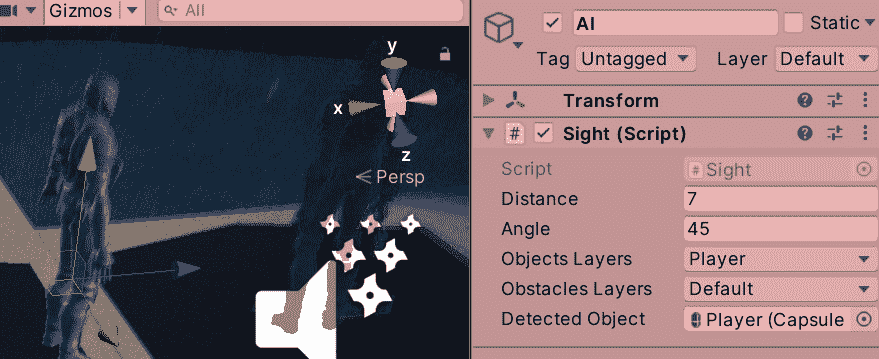

图 18.9 - 传感器捕捉玩家

即使我们的传感器工作了，有时检查它是否工作或配置正确需要一些我们可以使用`Gizmos`创建的视觉辅助工具。

## 使用 Gizmos 进行调试

当我们创建我们的 AI 时，我们将开始检测到一些边缘情况的错误，通常与错误配置有关。你可能认为玩家在敌人的视线范围内，但也许你没有注意到视线被物体遮挡，特别是当敌人不断移动时。调试这些情况的一个好方法是通过仅在编辑器中可见的视觉辅助工具，称为`Gizmos`，它允许你可视化不可见的数据，比如视线距离或执行线性投射以检测障碍物。

让我们开始看如何通过绘制代表视线距离的球体来创建`Gizmos`，方法如下：

1.  在`Sight`脚本中，创建一个名为`OnDrawGizmos`的事件函数。这个事件只在编辑器中执行（不在构建中执行），是 Unity 要求我们绘制`Gizmos`的地方。

1.  使用`Gizmos.DrawWireSphere`函数，将我们的位置作为第一个参数，距离作为第二个参数，以在我们的位置绘制一个半径为我们距离的球体。您可以检查随着更改距离字段而 Gizmo 大小的变化：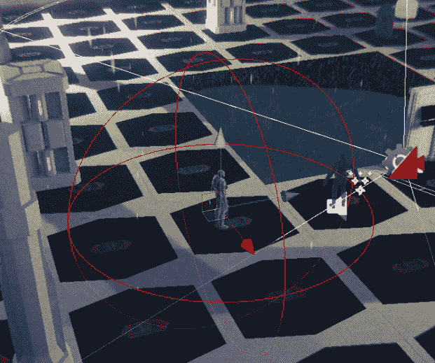

图 18.10 - 球体 Gizmo

1.  可选地，您可以更改 Gizmo 的颜色，设置`Gizmos.color`然后调用绘图函数：

图 18.11 - Gizmos 绘图代码

重要信息

现在你不断地绘制`Gizmos`，如果你有很多敌人，它们可能会用太多的`Gizmos`污染场景视图。在这种情况下，可以尝试使用`OnDrawGizmosSelected`事件函数，它只在对象被选中时绘制`Gizmos`。

1.  我们可以使用`Gizmos.DrawRay`来绘制代表锥体的线，它接收要绘制的线的起点和线的方向，可以乘以某个值来指定线的长度，如下面的屏幕截图所示：

图 18.12 - 绘制旋转线

1.  在屏幕截图中，我们使用`Quaternion.Euler`根据我们想要旋转的角度生成一个四元数。如果将这个四元数乘以一个方向，我们将得到旋转后的方向。我们正在取我们的前向矢量，并根据角度字段旋转它，以生成我们的锥体视觉线。此外，我们将这个方向乘以视距，以绘制线条，使其能够看到我们的视线有多远；您将看到线条如何与球体的末端匹配：

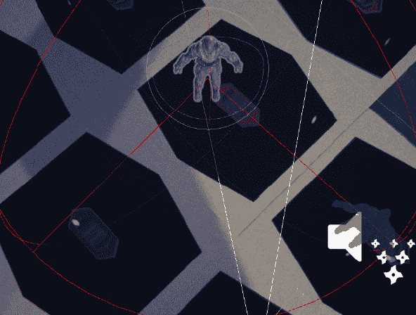

图 18.13 - 视觉角线

我们还可以绘制线条投射，检查障碍物，但是由于这些取决于游戏的当前情况，例如通过前两个检查的对象及其位置，因此我们可以使用`Debug.DrawLine`，它可以在`Update`方法中执行。这个版本的`DrawLine`设计为仅在运行时使用。我们在编辑器中看到的`Gizmos`也是在编辑器中执行的。让我们尝试以下方式：

1.  首先，让我们调试`LineCast`未检测到任何障碍物的情况，因此我们需要在我们的传感器和对象之间绘制一条线。我们可以在调用`LineCast`的`if`语句中调用`Debug.DrawLine`，如下面的屏幕截图所示：

图 18.14 - 在 Update 中绘制一条线

1.  在下一个屏幕截图中，您可以看到`DrawLine`的效果：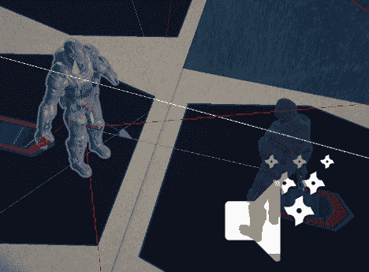

图 18.15 - 指向检测到的对象的线

1.  当视线被对象遮挡时，我们还希望以红色绘制一条线。在这种情况下，我们需要知道 Line Cast 的命中位置，因此我们可以使用函数的一个重载，它提供了一个`out`参数，可以提供有关线碰撞的更多信息，例如命中的位置、法线和碰撞的对象，如下面的屏幕截图所示：

图 18.16 - 获取有关 Linecast 的信息

重要信息

请注意，`Linecast`并不总是与最近的障碍物发生碰撞，而是与它在线上检测到的第一个对象发生碰撞，这可能会按顺序变化。如果您需要检测最近的障碍物，请查找该函数的`Physics.Raycast`版本。

1.  我们可以使用这些信息在`else`子句中绘制从我们的位置到命中点的线，当线与某物发生碰撞时：

图 18.17 - 在我们遇到障碍物时绘制一条线

1.  在下一个屏幕截图中，您可以看到结果：

图 18.18 - 当障碍物遮挡视线时的线

现在我们的传感器已经完成，让我们使用它们提供的信息来使用**有限状态机（FSM）**做出决策。

# 使用 FSM 做出决策

我们在过去使用 Animator 时探讨了 FSM 的概念。我们了解到 FSM 是一组状态的集合，每个状态代表对象可以执行的动作，以及一组决定状态切换方式的转换。这个概念不仅在动画中使用，而且在许多编程场景中都有应用，其中一个常见的应用是在 AI 中。我们可以用 AI 代码替换状态中的动画，就得到了 AI FSM。

在本节中，我们将研究以下 AI FSM 概念：

+   创建 FSM

+   创建转换

让我们开始创建我们的 FSM 骨架。

## 创建 FSM

创建我们自己的 FSM，我们需要回顾一些基本概念。记住，FSM 可以为它可以执行的每个可能动作都有一个状态，而且一次只能执行一个动作。在 AI 方面，我们可以巡逻，攻击，逃跑等。还要记住，状态之间存在转换，确定改变一个状态到另一个状态需要满足的条件，就 AI 而言，这可以是用户靠近敌人开始攻击或生命值低开始逃跑。在下一个截图中，你可以找到一个门的两种可能状态的简单提醒示例：

图 18.19 - FSM 示例

有几种方法可以为 AI 实现 FSM；你甚至可以使用 Animator，或者从 Asset Store 下载一些 FSM 系统。在我们的情况下，我们将采取尽可能简单的方法，一个带有一组`If`语句的单个脚本，这可能很基础，但仍然是理解概念的良好开始。让我们通过以下方式实现它：

1.  在 Enemy 的 AI 子对象中创建一个名为`EnemyFSM`的脚本。

1.  创建名为`EnemyState`的`enum`，其中包含`GoToBase`，`AttackBase`，`ChasePlayer`和`AttackPlayer`值。我们将在我们的 AI 中拥有这些状态。

1.  创建一个名为`currentState`的`EnemyState`类型字段，它将保存我们的 Enemy 的当前状态：

图 18.20 - EnemyFSM 状态定义

1.  创建三个以我们定义的状态命名的函数。

1.  根据当前状态在`Update`中调用这些函数：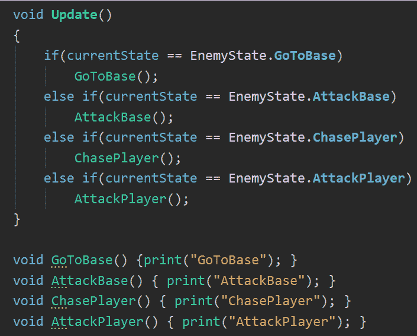

图 18.21 - 基于 If 的 FSM

重要信息

是的，你完全可以在这里使用 switch，但我更喜欢常规的`if`语法。

1.  在编辑器中测试如何改变`currentState`字段将改变哪个状态是活动的，看到在控制台中打印的消息：

图 18.22 - 状态测试

如你所见，这是一个非常简单但完全功能的方法，所以让我们继续使用这个 FSM，创建它的转换。

## 创建转换

如果你记得在 Animator Controller 中创建的转换，那些基本上是一组条件，如果转换所属的状态处于活动状态，则检查这些条件。在我们的 FSM 方法中，这简单地转换为在状态内检测条件的 If 语句。让我们按照以下方式创建我们提出的状态之间的转换：

1.  在我们的 FSM 脚本中添加一个名为`sightSensor`的`Sight`类型字段，并将 AI `GameObject`拖到该字段中，将其连接到那里的`Sight`组件。由于 FSM 组件与`Sight`位于同一对象中，我们也可以使用`GetComponent`，但在高级 AI 中，你可能有不同的传感器检测不同的对象，所以我更喜欢为这种情况准备我的脚本，但选择你最喜欢的方法。

1.  在`GoToBase`函数中，检查`Sight`组件检测到的对象是否不为`null`，这意味着我们的视线内有东西。如果我们的 AI 正在前往基地，但在路上检测到一个对象，我们必须切换到`Chase`状态以追击玩家，所以我们改变状态，如下面的屏幕截图所示：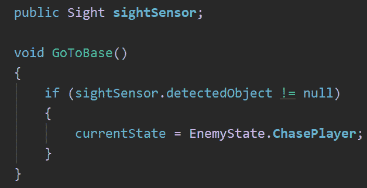

图 18.23 - 创建转换

1.  此外，我们必须在靠近必须受损的对象时切换到`AttackBase`。我们可以创建一个`Transform`类型的字段，称为`baseTransform`，并将基地生命对象拖放到那里，以便我们可以检查距离。记得添加一个名为`baseAttackDistance`的`float`字段，以使该距离可配置：

图 18.24 - 前往基地转换

1.  在`ChasePlayer`的情况下，我们需要检查玩家是否不在视线内，以切换回`GoToBase`状态，或者我们是否足够接近玩家以开始攻击它。我们将需要另一个`distance`字段，用于确定攻击玩家的距离，我们可能希望为这两个目标设置不同的攻击距离。考虑在转换中进行早期返回，以防止在没有对象时尝试访问传感器检测到的对象的位置时出现`null`引用异常：

图 18.25 - 追击玩家转换

1.  对于`AttackPlayer`，我们需要检查`Player`是否不在视线内，以返回到`GoToBase`，或者它是否足够远，以返回追击它。您可以注意到我们将`PlayerAttackDistance`乘以`1.1`，使停止攻击的距离比开始攻击的距离大一点；这将防止在玩家接近该距离时快速在攻击和追击之间切换。您可以使其可配置，而不是硬编码`1.1`：

图 18.26 - 攻击玩家转换

1.  在我们的情况下，`AttackBase`不会有任何转换。一旦敌人靠近基地足够攻击它，即使玩家开始向它射击，它也会保持这样。一旦到达那里，它的唯一目标就是摧毁基地。

1.  记得你可以使用`Gizmos`来绘制距离：

图 18.27 - FSM 小工具

1.  在点击播放之前，测试选择 AI 对象的脚本，然后移动玩家，检查状态在检查器中的变化。您还可以保留每个状态中的原始打印消息，以在控制台中查看它们的变化。记得设置攻击距离和对象的引用。在屏幕截图中，您可以看到我们使用的设置：

图 18.28 - 敌人 FSM 设置

现在我们将遇到的一个小问题是，生成的敌人将没有必要的引用，无法进行基地变换的距离计算。如果您尝试将场景中的敌人的更改应用到预制件（`None`），您将注意到这一点。请记住，预制件不能包含对场景中对象的引用，这使得我们的工作变得复杂。一个替代方法是创建`BaseManager`，一个保存对伤害位置的引用的单例，这样我们的`EnemyFSM`就可以访问它。另一个方法可能是利用`GameObject.Find`等函数来找到我们的对象。

在这种情况下，我们将尝试后者。即使它可能比 Manager 版本的性能要差一些，我还是想向你展示如何使用它来扩展你的 Unity 工具集。在这种情况下，只需在`Awake`中将`baseTransform`字段设置为`GameObject.Find`的返回值，使用`BaseDamagePoint`作为第一个参数，它将查找一个叫这个名字的对象，就像下面的截图一样。同时，可以自由地从`baseTransform`字段中删除 private 关键字；现在通过代码设置了它，将其显示在编辑器中除了用于调试之外没有太大意义。你会看到，现在我们生成的敌人将改变状态：

图 18.29 - 按名称在场景中搜索对象

现在我们的 FSM 状态已经编码并且过渡正常，让它们做点什么吧。

## 执行 FSM 动作

现在我们需要做最后一步 - 让 FSM 做一些有趣的事情。在这里，我们可以做很多事情，比如射击基地或玩家，并将敌人移向其目标（玩家或基地）。我们将使用 Unity 路径规划系统`NavMesh`来处理移动，这是一个允许我们的 AI 计算和穿越两点之间的路径并避开障碍物的工具，需要一些准备工作才能正常工作。

在本节中，我们将讨论以下 FSM 动作概念：

+   计算我们场景的路径规划

+   使用路径规划

+   添加最后的细节

让我们开始为路径规划准备我们的场景。

## 计算我们场景的路径规划

路径规划算法依赖于场景的简化版本。在实时中分析复杂场景的完整几何形状几乎是不可能的。表示从场景中提取的路径规划信息的方法有很多，比如图形和`NavMesh`几何。Unity 使用后者 - 一个简化的网格，类似于跨越 Unity 确定为可行走区域的所有区域的 3D 模型。在下一个截图中，你可以找到一个在场景中生成的`NavMesh`的示例，即浅蓝色的几何体：

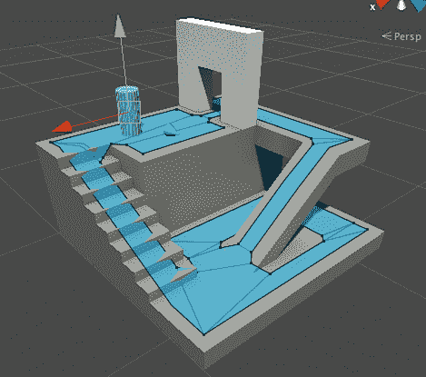

图 18.30 - 场景中可行走区域的 NavMesh

生成`NavMesh`可能需要几秒到几分钟，这取决于场景的大小。这就是为什么 Unity 的路径规划系统在编辑器中计算一次，所以当我们分发我们的游戏时，用户将使用预先生成的`NavMesh`。就像光照贴图一样，`NavMesh`被烘焙到一个文件中以供以后使用。与光照贴图一样，主要的警告是`NavMesh`对象在运行时不能改变。如果你销毁或移动地板砖，AI 仍然会走在那个区域。`NavMesh`也没有注意到地板不在了，所以你不能以任何方式移动或修改这些对象。幸运的是，在我们的情况下，我们不会在运行时遭受场景的任何修改，但是请记住，有一些组件，比如`NavMeshObsacle`，可以在这些情况下帮助我们。

要为我们的场景生成`NavMesh`，请执行以下操作：

1.  选择任何可行走的对象以及其上的障碍物，比如地板、墙壁和其他障碍物，并将它们标记为`Static`。你可能还记得`Static`复选框也会影响光照贴图，所以如果你希望一个对象不参与光照贴图但对`NavMesh`的生成有贡献，你可以点击静态检查左侧的箭头，并选择`NavMesh`生成速度。在我们的情况下，使地形可通行会大大增加生成时间，我们永远不会在那个区域玩。

1.  在**窗口|AI|导航**中打开`NavMesh`面板。

1.  选择`NavMesh`：

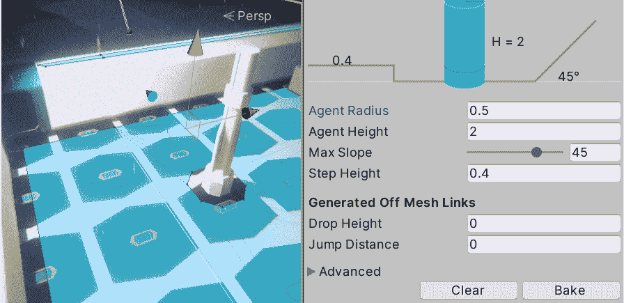

图 18.31 - 生成 NavMesh

基本上你需要做的就是这些。当然，还有很多设置可以调整，比如`NavMesh`，但是由于我们的场景简单明了，所以默认设置就足够了。

现在，让我们让我们的 AI 在 NavMesh 周围移动。

## 使用路径规划

为了制作一个使用 NavMesh 移动的 AI 对象，Unity 提供了 NavMeshAgent 组件，它将使我们的 AI 粘附在 NavMesh 上，防止对象离开它。它不仅会自动计算到指定目的地的路径，还会通过模拟人类移动方式的转向行为算法来沿着路径移动对象，在拐角处减速并使用插值进行转向，而不是瞬间转向。此外，该组件能够躲避场景中运行的其他 NavMeshAgent，防止所有敌人聚集在同一位置。

让我们通过以下方式使用这个强大的组件：

1.  选择敌人 Prefab 并向其添加 NavMeshAgent 组件。将其添加到根对象，称为 Enemy，而不是 AI 子对象 - 我们希望整个对象移动。你会看到对象周围有一个圆柱体，表示对象在 NavMesh 中所占据的区域。请记住，这不是一个碰撞体，所以它不会用于物理碰撞：

图 18.32 - NavMeshAgent 组件

1.  移除 ForwardMovement 组件；从现在开始，我们将使用 NavMeshAgent 来驱动我们敌人的移动。

1.  在 EnemyFSM 脚本的 Awake 事件函数中，使用 GetComponentInParent 函数来缓存 NavMeshAgent 的引用。这将类似于 GetComponent - 它将在我们的 GameObject 中查找组件，但如果组件不存在，这个版本将尝试在所有父级中查找该组件。记得添加 using UnityEngine.AI 行来在这个脚本中使用 NavMeshAgent 类：

图 18.33 - 缓存父级组件引用

重要信息

你可以想象，还有一个 GetComponentInChildren，它首先在 GameObject 中搜索组件，然后在必要时在所有子对象中搜索。

1.  在 GoToBase 状态函数中，调用 NavMeshAgent 引用的 SetDestination 函数，传递基本对象的位置作为目标：

图 18.34 - 设置我们的 AI 的目的地

1.  保存脚本并在场景中测试一下，或者使用波次生成的敌人进行测试。你会看到敌人永远不会停止朝着目标位置前进，甚至在它们的有限状态机状态在靠近目标时发生变化时也会进入对象内部。这是因为我们从未告诉 NavMeshAgent 停止，我们可以通过将代理的 isStopped 字段设置为 true 来实现这一点。你可能想调整基本攻击距离，使敌人停下来的位置更近或更远：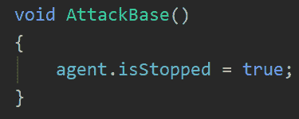

图 18.35 - 停止代理移动

1.  我们可以对 ChasePlayer 和 AttackPlayer 做同样的操作。在 ChasePlayer 中，我们可以将代理的目的地设置为玩家的位置，在 AttackPlayer 中，我们可以停止移动。在这种情况下，AttackPlayer 可以再次返回到 GoToBase 或 ChasePlayer，所以你需要在这些状态或在进行转换之前将 isStopped 代理字段设置为 false。我们将选择前者，因为这个版本将覆盖其他也会停止代理的状态而不需要额外的代码。我们将从 GoToBase 状态开始：

图 18.36 - 重新激活代理

1.  然后，继续进行 Chase Player:

图 18.37 - 重新激活代理并追逐玩家

1.  最后，继续进行攻击玩家:

图 18.38 - 停止移动

1.  您可以调整`NavMeshAgent`的`Acceleration`、`Speed`和`Angular Speed`属性来控制敌人的移动速度。还记得将更改应用到生成的敌人 Prefab 中。

现在我们的敌人有了移动，让我们完成 AI 的最后细节。

# 添加最后的细节

这里有两件事情还没有完成，敌人没有射击任何子弹，也没有动画。让我们开始通过以下方式修复射击：

1.  在我们的`EnemyFSM`脚本中添加一个`bulletPrefab`字段，类型为`GameObject`，以及一个名为`fireRate`的`float`字段。

1.  创建一个名为`Shoot`的函数，并在`AttackBase`和`AttackPlayer`中调用它：

图 18.39 - 射击函数调用

1.  在`Shoot`函数中，放置与`PlayerShooting`脚本中使用的类似代码，以特定的射击速率射击子弹，如下截图所示。记得在敌人 Prefab 中设置敌人层，以防止子弹伤害到敌人自身。您可能还希望稍微提高 AI 脚本以在另一个位置射击子弹，或者更好地，添加一个`shootPoint`变换字段，并在敌人中创建一个空对象作为生成位置。如果这样做，考虑使空对象不旋转，以便敌人的旋转正确影响子弹的方向：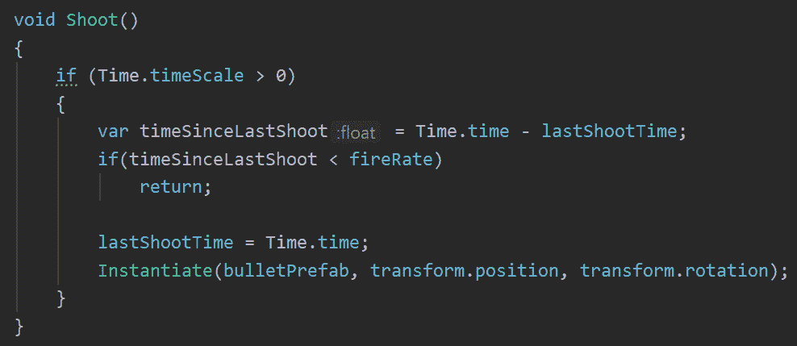

图 18.40 - 射击函数代码

重要信息

在`PlayerShooting`和`EnemyFSM`之间找到了一些重复的射击行为。您可以通过创建一个名为`Weapon`的行为来修复这个问题，该行为具有一个名为`Shoot`的函数，用于实例化子弹并考虑射击速率，并在两个组件内调用它以进行重复利用。

1.  当代理停止时，不仅移动停止，而且旋转也停止。如果玩家在敌人受到攻击时移动，我们仍然需要敌人面对它以向其方向射击子弹。我们可以创建一个`LookTo`函数，该函数接收要查看的目标位置，并在`AttackPlayer`和`AttackBase`中调用它，传递要射击的目标：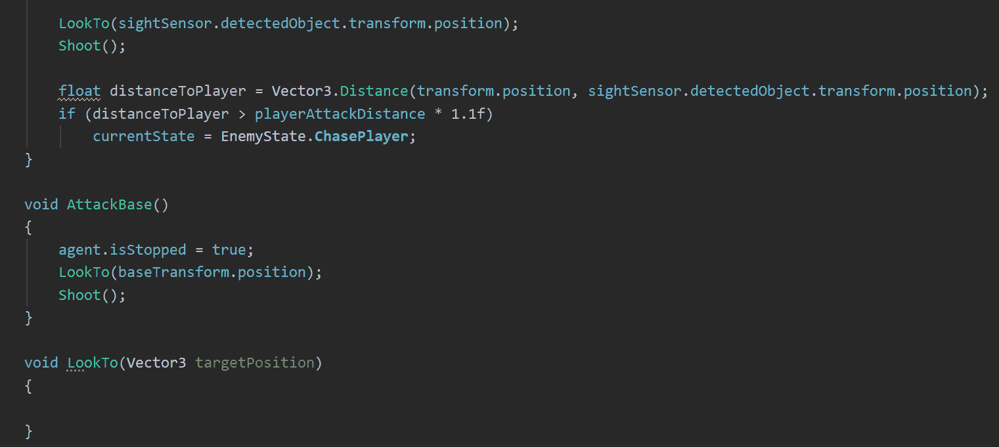

图 18.41 - LookTo 函数调用

1.  通过获取我们的父对象到目标位置的方向来完成`LookTo`函数，我们使用`transform.parent`访问我们的父对象，因为记住，我们是子 AI 对象，移动的对象是我们的父对象。然后，我们将方向的`Y`分量设置为`0`，以防止方向指向上方或向下方 - 我们不希望我们的敌人垂直旋转。最后，我们将父对象的前向矢量设置为该方向，以便立即面向目标位置。如果您愿意，您可以用四元数插值替换它，以使旋转更加平滑，但现在让我们尽可能保持简单：

图 18.42 - 面向目标

最后，我们可以使用与玩家相同的 Animator Controller 为敌人添加动画，并使用其他脚本设置参数，具体步骤如下：

1.  为敌人添加一个`Animator`组件，如果还没有的话，并设置与玩家相同的控制器；在我们的情况下，这也被称为`Player`。

1.  创建并添加一个脚本到 Enemy 根对象，名为`NavMeshAnimator`，它将获取`NavMeshAgent`的当前速度并将其设置到 Animator 控制器中。这将类似于`VelocityAnimator`脚本，并负责更新 Animator 控制器的`velocity`参数以匹配对象的速度。我们没有在这里使用它，因为`NavMeshAgent`不使用`Rigidbody`来移动。它有自己的速度系统。实际上，如果我们愿意，我们可以将`Rigidbody`设置为`kinematic`，因为它移动但不受物理影响：

总结

通过这样，我们结束了本书的*第二部分*，关于 C#脚本。在接下来的短篇中，我们将完成游戏的最后细节，从优化开始。图 18.43 - 将 NavMeshAgent 连接到我们的 Animator 控制器

1.  图 18.45 - 打开射击动画

通过这样，我们已经完成了所有的 AI 行为。当然，这个脚本足够大，值得在将来进行一些重构和拆分，一些动作，如停止和恢复动画和`NavMeshAgent`可以以更好的方式完成。但是通过这样，我们已经原型化了我们的 AI，并且可以测试直到我们对它满意，然后我们可以改进这段代码。

图 18.44 - 访问父级的 Animator 引用

1.  ](img/Figure_18.43_B14199.jpg)

](img/Figure_18.46_B14199.jpg)

](img/Figure_18.45_B14199.jpg)

1.  

在所有非射击状态（如`GoToBase`和`ChasePlayer`）中关闭`boolean`：

在`Shoot`函数中打开`Shooting` `animator`参数，以确保每次射击时该参数被设置为`true`（选中）：![图 18.45 打开射击动画
