# 第十九章：*第十九章*：场景性能优化

欢迎来到本书的第三部分——我很高兴您已经到达这一部分，因为这意味着您几乎完成了一个完整的游戏！在本章中，我们将讨论优化技术，以审查游戏的性能并改进它，因为良好和稳定的帧率对于任何游戏都至关重要。性能是一个广泛的主题，需要对几个 Unity 系统有深入的了解，并且可能需要涵盖几本书。我们将研究如何衡量性能，并探索我们对系统的更改的影响，通过测试了解它们的工作原理。

在本章中，我们将研究以下性能概念：

+   优化图形

+   优化处理

+   优化内存

通过本章结束时，您将能够收集运行游戏的三个主要硬件部件的性能数据——GPU、CPU 和 RAM。您将能够分析这些数据，以检测可能的性能问题，并了解如何解决最常见的问题。

# 优化图形

性能问题最常见的原因与资源的错误使用有关，特别是在图形方面，因为缺乏对 Unity 图形引擎工作方式的了解。我们将探讨 GPU 在高层次上的工作方式以及如何改进其使用。

在本节中，我们将研究以下图形优化概念：

+   图形引擎简介

+   使用帧调试器

+   使用批处理

+   其他优化

我们将首先概述图形渲染的高级概述，以更好地理解我们稍后在帧调试器中收集的性能数据。根据调试器的结果，我们将确定可以应用批处理的领域（这是一种将多个对象的渲染过程合并在一起，从而降低成本的技术），以及其他常见的优化要点。

## 图形引擎简介

现今，无论是计算机、移动设备还是游戏机，每个游戏设备都有一个视频卡——一组专门用于图形处理的硬件。它与 CPU 有微妙但重要的区别。图形处理涉及处理成千上万的网格顶点和渲染数百万像素，因此 GPU 被设计为长时间运行短程序，而 CPU 可以处理任何长度的程序，但并行化能力有限。拥有这些处理单元的原因是，我们的程序可以在需要时使用每一个。

问题在于图形不仅依赖于 GPU。CPU 也参与其中，进行计算并向 GPU 发出命令，因此它们必须共同工作。为了实现这一点，两个处理单元需要进行通信，因为它们（通常）是物理上分开的，它们需要另一种硬件来实现这一点——总线，最常见的类型是**外围组件互联**（**PCI Express**）总线。

PCI Express 是一种连接类型，允许大量数据在 GPU 和 CPU 之间传输，但问题在于，即使速度非常快，如果在两个单元之间发出大量命令，通信时间也会很明显。因此，关键概念在于，图形性能主要通过减少 GPU 和 CPU 之间的通信来改善：

图 19.1 – 通过 PCI Express 总线进行 CPU/GPU 通信

重要说明

现今，新的硬件架构允许 CPU 和 GPU 共存于同一芯片组中，减少了它们的通信时间，甚至共享内存。遗憾的是，该架构不允许视频游戏所需的必要处理能力。很可能我们只会在高端游戏中看到它的应用，但在不久的将来甚至永远也不会。

图形引擎的基本算法是使用裁剪算法确定哪些对象是可见的，根据它们的相似性对它们进行排序和分组，然后向 GPU 发出绘制命令以渲染这些对象组，有时会多次（如*第八章**，使用通用渲染管线进行照明*）。在这里，主要的通信形式是那些绘制命令，通常称为**绘制调用**，我们在优化图形时的主要任务是尽量减少它们。问题在于有几个绘制调用的来源需要考虑，例如照明和对象的比例，以查看它们是否是静态的。研究它们中的每一个将需要很长时间，即使这样，Unity 的新版本也可能引入具有自己绘制调用的新图形功能。相反，我们将探索一种使用帧调试器发现这些绘制调用的方法。

## 使用帧调试器

**帧调试器**是一个工具，允许我们查看 Unity 渲染引擎发送到 GPU 的所有绘制命令或绘制调用的列表。它不仅列出它们，还提供有关每个绘制调用的信息，包括检测优化机会所需的数据。通过使用**帧调试器**，我们可以看到我们的更改如何修改绘制调用的数量，从而使我们对我们的努力得到即时反馈。

重要提示

请注意，减少绘制调用有时不足以提高性能，因为每个绘制调用的处理时间可能不同；但通常，这种差异不足以考虑。此外，在某些特殊的渲染技术中，例如光线追踪或光线行军，单个绘制调用可能耗尽我们所有的 GPU 功率。这在我们的游戏中不会发生，所以我们现在不会考虑这一点。

让我们使用帧调试器通过以下方式分析我们游戏的渲染过程：

1.  打开帧调试器（**窗口** | **分析** | **帧调试器**）。

1.  播放游戏，如果要分析性能，请单击窗口左上角的**启用**按钮（在播放时按*Esc*重新获得鼠标控制）：

图 19.2 - 启用帧调试器

1.  单击**游戏**选项卡以打开游戏视图。

重要提示

有时，同时看到**场景**和**游戏**面板是有用的，您可以通过将它们中的一个拖动到 Unity 底部来实现它们的分离和可见。

1.  将滑块从**禁用**按钮右侧缓慢向右拖动，以查看场景是如何渲染的。每一步都是在 CPU 中执行的给定游戏帧的绘制调用。您还可以观察窗口左侧的列表如何在那一刻突出显示执行的绘制调用的名称：

图 19.3 - 分析我们帧的绘制调用

1.  单击列表中的任何绘制调用，并观察窗口右侧的详细信息。

如果您不习惯于编码引擎或着色器，大多数可能会让您感到困惑，但您可以看到其中一些具有称为`为什么这个绘制调用不能与上一个批处理在一起`的可读部分，它告诉您为什么两个对象没有一起绘制在单个绘制调用中。我们将稍后检查这些原因：

图 19.4 - 帧调试器中的批处理中断原因

1.  在**播放**模式下打开窗口，禁用地形并查看绘制调用的数量如何立即改变。有时，只需打开和关闭对象就足以检测到导致性能问题的原因。还可以尝试禁用后期处理和其他与图形相关的对象，如粒子。

即使我们不完全了解这些绘制调用来自何处，我们至少可以通过修改 Unity 中的设置来开始，以查看这些更改的影响。没有比通过测量工具逐个切换并查看这些更改的影响更好地了解 Unity 这样庞大的东西的方法。

现在，让我们讨论减少绘制调用的基本技术，并在 Frame Debugger 中看到它们的效果。

## 使用批处理

我们在之前的章节中讨论了几种优化技术，其中照明是最重要的。如果你在实施这些技术时测量绘制调用，你会注意到这些行动对绘制调用数量的影响。然而，在本节中，我们将专注于另一种称为批处理的图形优化技术。批处理是将多个对象分组在单个绘制调用中一起绘制的过程。你可能会想为什么我们不能只在一个绘制调用中绘制所有东西，虽然从技术上讲这是可能的，但需要满足一组条件才能合并两个对象，通常情况下是合并材质。

记住，材质是作为图形配置文件的资产，需要在发出绘制调用之前指定一个`SetPass`调用，这是 CPU/GPU 通信的另一种形式，用于设置第一个对象的`SetPass`调用被第二个对象重用，并且这打开了批处理对象的机会。如果它们共享相同的设置，Unity 可以在 CPU 中将网格组合成一个，并将组合的网格在单个绘制调用中发送到 GPU。

有几种减少材质数量的方法，比如删除重复的材质，但最有效的方法是通过一个叫做纹理合并的概念。这意味着将不同对象的纹理合并成一个。这样，由于该纹理可以应用于多个对象，并且具有自己纹理的对象需要自己的材质。遗憾的是，Unity 中没有自动系统来合并三维对象的纹理，就像我们在 2D 中使用的**纹理图集**对象。Asset Store 中可能有一些系统，但自动系统可能会有一些副作用。这项工作通常由艺术家完成，所以在与专门的 3D 艺术家合作时（或者如果你自己是艺术家），请记住这个技术：

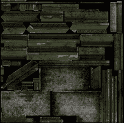

图 19.5 - 不同金属物体的碎片

让我们通过以下方式使用 Frame Debugger 来探索批处理：

1.  搜索我们当前想要使用的**渲染管线**资产（**编辑** | **项目设置** | **图形** | **可编程渲染设置**）：

图 19.6 - 可编程渲染管线设置

1.  在**高级**部分取消选择**SRP 批处理器**。我们稍后会讨论这个：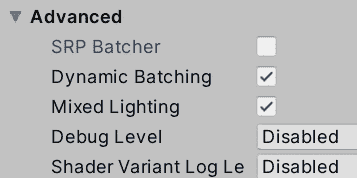

图 19.7 - 禁用 SRP 批处理器

1.  为测试创建一个新的空场景（**文件** | **新建场景**）。

1.  创建两种不同颜色的材质。

1.  创建两个立方体，将一个材质放入第一个立方体，另一个放入第二个。

1.  打开 Frame Debugger 并单击**启用**以查看我们立方体的绘制调用列表：

图 19.8 - 立方体的绘制调用

1.  选择第二个**绘制网格立方体**调用并查看批处理中断的原因。它应该说对象有不同的材质。

1.  在两个立方体上使用一个材质，然后再次查看列表。现在你会注意到我们只有一个**绘制网格立方体**调用。你可能需要再次禁用和启用 Frame Debugger 才能正确刷新。

现在，我挑战你尝试相同的步骤，但是创建球体而不是立方体。如果您这样做，您可能会注意到即使具有相同的材质，球体也没有被批处理！这就是我们需要介绍动态批处理的概念的地方。

请记住，游戏对象有一个**静态**复选框，用于通知几个 Unity 系统该对象不会移动，以便它们可以应用几个优化。没有勾选此复选框的对象被视为动态。到目前为止，我们用于测试的立方体和球体都是动态的，因此 Unity 需要在每帧中组合它们，因为它们可以移动，并且组合不是“免费”的。其成本与模型中的顶点数直接相关。您可以从 Unity 手册中获取确切的数字和所有必要的考虑，如果搜索**Unity Batching**，手册将显示出来。但是，可以说，如果对象的顶点数足够大，该对象将不会被批处理，这样做将需要发出两个以上的绘制调用。这就是为什么我们的球体没有被批处理；球体的顶点太多了。

现在，如果我们有静态对象，情况就不同了，因为它们使用第二个批处理系统——静态批处理器。这个概念是一样的。合并对象以在一个绘制调用中渲染它们，再次这些对象需要共享相同的材质。主要区别在于，这个批处理器将批处理比动态批处理器更多的对象，因为合并是在场景加载时进行一次，然后保存在内存中以在下一帧中使用，这会消耗内存，但每帧节省大量处理时间。您可以使用我们用来测试动态批处理器的相同方法来测试静态版本，只需勾选球体的**静态**复选框，然后在**播放**模式下查看结果；在**编辑**模式下（不播放时），静态批处理器不起作用。

图 19.9-一个静态球体及其静态批处理

在继续之前，让我们讨论为什么我们禁用了 SRP 批处理器以及它如何改变我们刚刚讨论的内容。在其 2020 年版中，Unity 推出了 URP（通用渲染管线），一个新的渲染管线。除了几项改进之外，现在相关的是 SRP 批处理器，一个在动态对象上工作的新批处理器，没有顶点或材质限制（但有其他限制）。SRP 批处理器不依赖于与批处理对象共享相同的材质，而是可以批处理使用相同着色器的材质的对象，这意味着我们可以有，例如，100 个对象，每个对象有 100 种不同的材质，它们将被批处理，而不管顶点数多少，只要材质使用相同的着色器和变体：

图 19.10-材质的 GPU 数据持久性，这使得 SRP 批处理器存在

一个着色器可以有几个版本或变体，所选的变体是根据设置选择的。我们可以有一个不使用法线贴图的着色器，将使用不计算法线的变体，这可能会影响 SRP 批处理。因此，使用 SRP 批处理基本上没有任何缺点，所以继续打开它。尝试创建尽可能多的具有尽可能多材质的球体，并在帧调试器中检查它将生成的批次数量。只需考虑，如果您需要处理在 URP 之前完成的项目，这将不可用，因此您需要了解适当的批处理策略。

## 其他优化

如前所述，有许多可能的图形优化，因此让我们简要讨论基本的优化，从**细节级别**（**LOD**）开始。LOD 是根据对象到相机的距离改变网格的过程。例如，当房子很远时，这可以减少绘制调用，如果您用一个减少了细节的组合网格替换了一个由多个部分和零件组成的房子。使用 LOD 的另一个好处是，由于顶点数减少，您减少了绘制调用的成本。

要使用此功能，请执行以下操作：

1.  创建一个空对象并将模型的两个版本作为子对象。您需要使用具有不同细节级别的多个版本的模型，但现在，我们只是要使用一个立方体和一个球来测试这个功能：

图 19.11 – 一个带有两个 LOD 网格的单个对象

1.  将 LOD 组件添加到父对象。

1.  默认的 LOD 组准备支持三个 LOD 网格组，但由于我们只有两个，右键单击一个并单击**删除**。您还可以选择**在之前插入**以添加更多 LOD 组：

图 19.12 – 移除 LOD 组

1.  选择**LOD 0**，最高细节 LOD 组，并单击下面的**渲染器**列表中的**添加**按钮，将球添加到该组。您可以添加任意数量的网格渲染器。

1.  选择**LOD 1**并添加立方体：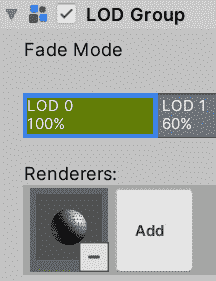

图 19.13 – 将渲染器添加到 LOD 组

1.  拖动两个组之间的线以控制每个组占用的距离范围。当您拖动它时，您将看到相机需要切换组的预览距离。此外，您还有被剔除的组，即相机不会渲染任何组的距离。

1.  只需在**编辑**模式下移动相机，以查看网格是如何交换的。

1.  这里需要考虑的一点是，对象的碰撞体不会被禁用，因此只需在 LOD 子对象中放置渲染器。将 LOD 0 的形状碰撞体放在父对象中，或者只是从 LOD 组对象中移除碰撞体，除了组 0。

另一个要考虑的优化是截锥体裁剪。默认情况下，Unity 会渲染相机视图区域或截锥体内的任何对象，跳过不在其中的对象。该算法足够便宜，因此始终使用，并且无法禁用。但是，它确实有一个缺陷。如果有一堵墙遮挡了其后的所有物体，即使它们被遮挡，它们仍然会落入截锥体内，因此仍然会被渲染。在实时中检测一个网格的每个像素是否遮挡另一个网格的每个像素几乎是不可能的，但幸运的是，我们有一个变通方法：遮挡剔除。

遮挡剔除是分析场景并确定在场景的不同部分中可以看到哪些对象的过程，将它们分成部分并分析每个部分。由于这个过程可能需要相当长的时间，因此在编辑器中进行，就像进行光照贴图一样。正如你可以想象的那样，它只对静态对象起作用。要使用它，请执行以下操作：

1.  将不应移动的对象标记为静态，或者如果您只希望将此对象视为遮挡剔除系统的静态对象，请选中**静态**复选框右侧的箭头旁边的**遮挡者**和**被遮挡者**复选框。

1.  打开**遮挡剔除**窗口（**窗口** | **渲染** | **遮挡剔除**）。

1.  保存场景并在窗口底部单击**烘焙**按钮，然后等待烘焙过程。如果在烘焙过程之前不保存场景，它将不会执行。

1.  在**遮挡剔除**窗口中选择**可视化**选项卡。

1.  在**遮挡裁剪**窗口可见时，选择摄像机并拖动它，看看随着摄像机移动对象是如何被遮挡的：

图 19.14 – 左边是正常场景，右边是带有遮挡裁剪的场景

请注意，如果将摄像机移出计算区域，处理将不会发生，Unity 只会计算靠近静态对象的区域。您可以通过创建一个空对象并添加一个**遮挡区域**组件，设置其位置和大小以覆盖摄像机将到达的区域，最后重新烘焙裁剪来扩展计算区域。尝试合理设置立方体的大小。计算的区域越大，磁盘中存储生成数据所需的空间就越大。您可以使用多个这样的区域来更精确地计算，例如，在一个 L 形场景中，您可以使用两个：

图 19.15 – 遮挡区域

如果你发现对象没有被遮挡，可能是遮挡对象（在这种情况下是墙）不够大。你可以增加对象的大小或者在窗口的**烘焙**选项卡中减少**最小遮挡者**设置。这样做会进一步细分场景以检测更小的遮挡者，但这将占用更多磁盘空间来存储更多数据。所以再次，要合理设置这个选项。

我们仍然可以应用一些其他技术到我们的游戏中，但我们已经讨论过的足够了。所以现在，让我们开始讨论其他优化领域，比如处理领域。

# 优化处理

虽然图形通常占据生成一帧所需时间的大部分，但我们不应低估糟糕优化的代码和场景的成本。游戏中仍然有一些部分是在 CPU 中计算的，包括图形处理的一部分（如批处理计算）、Unity 物理、音频和我们的代码。在这里，我们遇到的性能问题比图形方面多得多，所以再次，与其讨论每一个优化，不如学习如何发现它们。

在本节中，我们将研究以下 CPU 优化概念：

+   检测 CPU 和 GPU 负载

+   使用 CPU 使用率分析器

+   一般的 CPU 优化技术

我们将从讨论 CPU-和 GPU 受限的概念开始，这些概念侧重于优化过程，确定问题是 GPU 还是 CPU 相关。稍后，就像 GPU 优化过程一样，我们将看看如何收集 CPU 的性能数据并解释它以检测可能应用的优化技术。

## 检测 CPU 和 GPU 负载

与帧调试器一样，Unity Profiler 允许我们通过一系列性能分析器模块收集有关游戏性能的数据，每个模块都旨在收集关于不同 Unity 系统的每帧数据，例如物理、音频，最重要的是 CPU 使用情况。这个最后的模块允许我们看到 Unity 处理帧所调用的每个函数，也就是从我们脚本执行的函数到其他系统，比如物理和图形。

在探索 CPU 使用率之前，我们可以在这个模块中收集的一个重要数据是我们是 CPU-还是 GPU-受限。如前所述，一帧使用 CPU 和 GPU 并行处理。当 GPU 执行绘图命令时，CPU 可以以非常高效的方式执行物理和我们的脚本。但现在，假设 CPU 完成了它的工作，而 GPU 仍在工作。CPU 可以开始处理下一帧吗？答案是否定的。这将导致不同步，所以在这种情况下，CPU 将需要等待。这就是所谓的 CPU 受限，我们也有相反的情况，GPU 受限，当 GPU 比 CPU 更早完成时。

重要提示

值得一提的是，在移动设备上，有时最好降低游戏的帧率以减少电池消耗，使游戏在帧之间空闲一会儿，但这可能会导致命令和输入的响应变慢。为了解决这个问题，Unity 创建了一个包，可以在可配置的帧数之后跳过渲染过程，从而保持处理工作但跳过渲染。因此，自然而然地，这些帧将仅受 CPU 限制。

集中我们的优化工作非常重要，因此如果我们发现游戏受 GPU 限制，我们将专注于 GPU 图形优化；如果受 CPU 限制，我们将专注于其他系统和 CPU 图形处理的优化。要检测我们的游戏是哪一种情况，可以按照以下步骤进行：

1.  打开**Profiler**（**Window** | **Analysis** | **Profiler**）。

1.  在左上角的**Profiler Modules**下拉菜单中，勾选**GPU**以启用 GPU 分析器：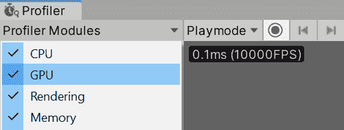

图 19.16 – 启用 GPU 分析器

1.  玩游戏并选择**CPU 使用率**分析器，在**Profiler**窗口的左侧部分点击其名称。

1.  观察窗口中间带有**CPU**和**GPU**标签的条形图。它应该显示 CPU 和 GPU 消耗了多少毫秒。数字较高的那个将限制我们的帧率，并确定我们是受 GPU 限制还是受 CPU 限制：

图 19.17 – 确定我们是受 CPU 限制还是受 GPU 限制

1.  点击标有 Timeline 的按钮，选择 Hierarchy：

图 19.18 – 选择 Hierarchy

1.  当您尝试打开 GPU 分析器时，有可能会看到不支持的消息，在某些情况下会发生这种情况（例如在某些 Mac 设备上）。在这种情况下，另一种查看我们是否受 GPU 限制的方法是在选择 CPU 使用率分析器时，在 CPU/GPU 标签旁边的搜索栏中搜索`waitforpresent`：

图 19.19 – 搜索 waitforpresent

1.  在这里，您可以看到 CPU 等待 GPU 的时间有多长。检查`0.00`，这是因为 CPU 没有等待 GPU，这意味着我们不受 GPU 限制。在前面的截图中，您可以看到我的屏幕显示`0.00`，而 CPU 花费了`9.41ms`，GPU 花费了`6.73ms`。因此，我的设备受 CPU 限制。

现在我们可以检测我们是受 CPU 限制还是受 GPU 限制，然后集中我们的优化工作。到目前为止，我们讨论了如何对 GPU 过程的一部分进行分析和优化。现在，如果我们发现我们受 CPU 限制，让我们看看如何对 CPU 进行分析。

## 使用 CPU 使用率分析器

对 CPU 进行分析的方式与对 GPU 进行分析的方式类似。我们需要获取 CPU 执行的操作列表并尝试减少它们，这就是 CPU 使用率分析器模块的作用——这是一个工具，允许我们查看 CPU 在一个帧中执行的所有指令。主要区别在于 GPU 主要执行绘制调用，而我们有几种类型的绘制调用，而 CPU 可能有数百种不同的指令需要执行，有时其中一些是无法删除的，例如物理更新或音频处理。在这些情况下，我们希望减少这些功能的成本，以防它们消耗太多时间。因此，重要的一点是要检测哪个功能花费了太多时间，然后减少其成本或删除它，这需要对底层系统有更深入的了解。让我们首先开始检测这个功能。

当您在打开**Profiler**选项卡时玩游戏，您将看到一系列图形显示我们游戏的性能，在 CPU 使用率分析器中，您将看到图形被分成不同的颜色，每种颜色代表帧处理的不同部分。您可以查看分析器左侧的信息来了解每种颜色的含义，但让我们讨论最重要的部分。在下面的截图中，您可以看到图形应该是什么样子的：

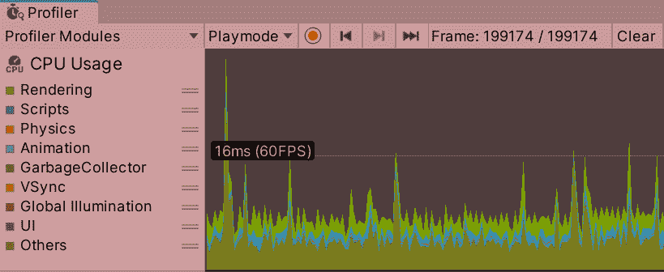

图 19.20 – 分析 CPU 使用率图

如果您查看图形，您可能会认为图表的深绿色部分占用了大部分性能时间，虽然这是真的，但您也可以从图例中看到深绿色代表**其他**，这是因为我们是在编辑器中对游戏进行分析。编辑器的行为不会完全像最终游戏那样。为了使其运行，它必须进行大量额外的处理，这些处理在游戏中不会执行，因此您能做的最好的事情就是直接在游戏的构建版本中进行分析。在那里，您将收集到更准确的数据。我们将在下一章讨论如何进行构建，所以现在我们可以忽略那个区域。现在我们可以简单地点击**其他**标签左侧的彩色方块，以禁用图表中的该测量，以便稍微清理一下。如果您还看到大片黄色，那是指 VSync，基本上是等待我们的处理与显示器的刷新率匹配所花费的时间。这也是我们可以忽略的东西，所以您也应该禁用它。在下一个截图中，您可以查看图形颜色类别以及如何禁用它们：

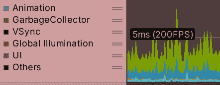

图 19.21 – 从分析器中禁用 VSync 和其他功能

现在我们已经清理了图形，我们可以通过查看带有 ms 标签的线（在我们的情况下，**5ms (200 FPS)**）来很好地了解我们游戏的潜在帧率，这表明低于该线的帧率超过 200 FPS，而高于该线的帧率低于 200 FPS。在我的情况下，性能非常好，但请记住，我是在一台性能强大的机器上测试的。最佳的分析方法不仅是在游戏的构建版本中（作为可执行文件），而且还要在目标设备上进行分析，这应该是我们打算运行游戏的最低规格硬件。我们的目标设备在很大程度上取决于游戏的目标受众。如果我们正在制作休闲游戏，我们可能会针对移动设备，因此我们应该在尽可能低规格的手机上测试游戏，但如果我们的目标是硬核玩家，他们可能会有一台强大的机器来运行我们的游戏。

重要提示

如果您的目标是硬核玩家，当然，这并不意味着我们可以制作一个非常未优化的游戏，但这将为我们提供足够的处理空间来增加更多细节。无论如何，我强烈建议您避免那些类型的游戏，如果您是初学者，因为它们更难开发，您可能会意识到这一点。先从简单的游戏开始。

通过观察图形颜色，您可以看到 CPU 端渲染的成本是浅绿色，图表显示它占用了大部分处理时间，这实际上是正常的。然后，在蓝色中，我们可以看到脚本执行的成本，这也占用了相当大的部分，但同样，这也是相当正常的。此外，我们还可以观察到一点橙色，那是物理，还有一点浅蓝色，那是动画。记得检查分析器中的彩色标签，以记住每种颜色代表什么。

现在，这些彩色条代表一组操作，所以如果我们认为**渲染**条代表 10 个操作，我们如何知道包括哪些操作？又如何知道这些操作中哪些占用了最多的性能时间？在这 10 个操作中，可能有一个单独的操作导致了这些问题。这就是分析器底部部分的用处。它显示了帧中调用的所有功能的列表。使用它，按照以下步骤进行：

1.  清除我们之前使用的搜索栏。它将按名称过滤功能调用，而我们希望看到它们全部。如果尚未在那里，请记得从时间轴切换到层次结构模式。

1.  点击**时间 ms**列，直到出现向下的箭头。这将按成本降序排列调用。

1.  点击图表中引起你注意的帧 - 可能是消耗更多处理时间的最高的帧之一。这将使分析器立即停止游戏并显示有关该帧的信息。

重要提示

查看图表时需要考虑两件事。如果你看到峰值明显高于其他帧，这可能会导致游戏出现瞬间卡顿，这会影响性能。此外，你还可以寻找一长串时间消耗较高的帧。也要尽量减少它们。即使这只是暂时的，玩家也会很容易察觉到它的影响。

1.  **PlayerLoop**可能会出现为消耗时间最长的帧，但这并不是很有信息性。你可以通过点击其左侧的箭头来展开它以进一步探索。

1.  点击每个功能以在图表中突出显示。处理时间较长的功能将以较粗的条形突出显示，这些是我们将要关注的功能：

图 19.22 - 在图表中突出显示的渲染相机功能

1.  你可以继续点击箭头以进一步探索功能，直到达到极限。如果想要更深入，可以在分析器的顶部栏中启用**深度分析**模式。这将提供更多细节，但要注意这个过程是昂贵的，会使游戏变慢，改变图表中显示的时间，使其看起来比实际时间要长得多。在这里，忽略数字，看看根据图表，一个功能占用了多少进程。你需要停止，启用**深度分析**，然后再次播放才能使其生效。

图 19.23 - 启用深度分析

有了这些知识，我们可以开始改善游戏性能（如果低于目标帧率），但每个功能都是由 CPU 调用并以其独特的方式进行改进，这需要对 Unity 的内部工作有更深入的了解。这可能需要涉及几本书，而且内部工作会随着版本的变化而变化。相反，你可以通过在互联网上查找有关特定系统的数据，或者通过禁用和启用对象或代码的部分来探索我们行为的影响，就像我们在帧调试器中所做的那样。分析需要创造力和推理来解释和相应地对所获得的数据做出反应，因此你需要一些耐心。

现在我们已经讨论了如何获取与 CPU 相关的分析数据，让我们讨论一些常见的减少 CPU 使用率的方法。

## CPU 优化的一般技术

在 CPU 优化方面，有许多可能导致性能不佳的原因，包括滥用 Unity 的功能，大量的物理或音频对象，不正确的资源/对象配置等。我们的脚本也可能以非优化的方式编写，滥用或错误使用昂贵的 Unity API 函数。到目前为止，我们已经讨论了使用 Unity 系统的几种良好实践，例如音频配置，纹理大小，批处理，以及查找函数，如`GameObject.Find`并用管理器替换它们。因此，让我们讨论一些关于常见情况的具体细节。

让我们首先看看大量对象对性能的影响。在这里，您可以创建大量配置为`Physics.Processing`的`Rigidbody`的对象，该函数负责此增加：

图 19.24 – 多个对象的物理处理

另一个测试是看看多个对象的影响，可以创建大量的音频源。在下面的截图中，您可以看到我们需要重新启用**其他**，因为音频处理属于该类别。我们之前提到**其他**属于编辑器，但它也可以包括其他进程，所以请记住这一点：

图 19.25 – 多个对象的物理处理

因此，要发现这些问题，您可以开始禁用和启用对象，看它们是否增加了时间。最后一个测试是关于粒子。创建一个系统，产生足够多的粒子以影响我们的帧率，并检查性能分析器。在下面的截图中，您可以看到粒子处理函数在图表中被突出显示，表明它花费了大量时间：

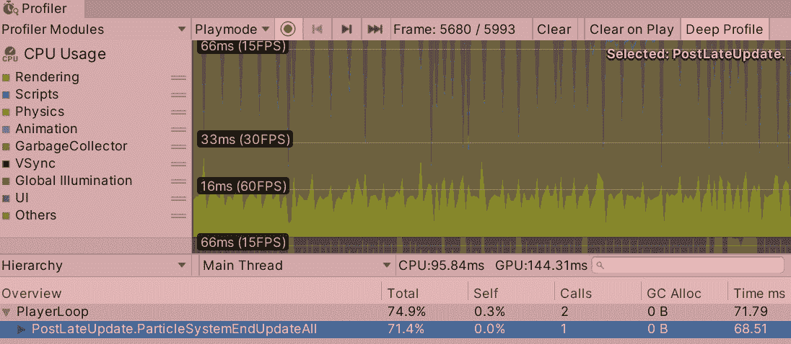

图 19.26 – 粒子处理

然后，在脚本方面，我们还有其他需要考虑的事情，其中一些是所有编程语言和平台共有的，例如迭代长列表的对象，滥用数据结构和深度递归。然而，在本节中，我主要将讨论特定于 Unity 的 API，从`print`或`Debug.Log`开始。

这个函数对于在控制台中获取调试信息很有用，但也可能很昂贵，因为所有日志都会立即写入磁盘，以避免在游戏崩溃时丢失宝贵的信息。当然，我们希望在游戏中保留这些宝贵的日志，但我们不希望它影响性能，那么我们该怎么办呢？

一种可能的方法是保留这些消息，但在最终构建中禁用非必要的消息，例如信息性消息，保持错误报告功能处于活动状态。一种方法是通过编译器指令，例如下面截图中使用的指令。请记住，这种`if`语句是由编译器执行的，如果条件不满足，编译时可以排除整个代码部分：

图 19.27 – 禁用代码

在前面的截图中，您可以看到我们正在询问此代码是由编辑器编译还是用于开发构建，这是一种特殊类型的构建，旨在用于测试（在下一章中将详细介绍）。您还可以使用编译器指令创建自己的日志记录系统，因此您不需要在每个要排除的日志中使用它们。

还有一些其他脚本方面的问题可能会影响性能，不仅在处理方面，还在内存方面，所以让我们在下一节中讨论它们。

# 优化内存

我们讨论了如何对两个硬件部分——CPU 和 GPU 进行性能分析和优化，但是还有另一部分硬件在我们的游戏中扮演着关键角色——RAM。这是我们放置所有游戏数据的地方。游戏可能是内存密集型应用程序，与其他几种应用程序不同的是，它们不断执行代码，因此我们需要特别小心。

在本节中，我们将讨论以下内存优化概念：

+   内存分配和垃圾收集器

+   使用内存分析器

让我们开始讨论内存分配的工作原理以及垃圾收集在这里扮演的角色。

## 内存分配和垃圾收集器

每次实例化一个对象，我们都在 RAM 中分配内存，在游戏中，我们将不断地分配内存。在其他编程语言中，除了分配内存，您还需要手动释放它，但是 C#有一个垃圾收集器，它是一个跟踪未使用内存并清理它的系统。该系统使用引用计数器，跟踪对象存在多少引用，当计数器达到`0`时，意味着所有引用都变为 null，对象可以被释放。这个释放过程可以在几种情况下触发，最常见的情况是当我们达到最大分配内存并且想要分配一个新对象时。在这种情况下，我们可以释放足够的内存来分配我们的对象，如果不可能，内存就会被扩展。

在任何游戏中，您可能会不断地分配和释放内存，这可能导致内存碎片化，意味着存活对象内存块之间存在小空间，这些空间大多是无用的，因为它们不足以分配一个对象，或者可能空间的总和足够大，但我们需要连续的内存空间来分配我们的对象。在下图中，您可以看到一个经典的例子，试图将一个大块内存放入碎片化产生的小间隙中：

图 19.28 – 尝试在碎片化的内存空间中实例化对象

一些垃圾收集系统，例如常规 C#中的系统，是分代的，这意味着内存根据其内存的“年龄”被分成代桶。新的内存将放在第一个桶中，这些内存往往会频繁分配和释放。因为这个桶很小，所以在其中工作是快速的。第二个桶中有在第一个桶的先前释放扫描过程中幸存的内存。该内存被移动到第二个桶中，以防止它被不断检查是否幸存了该过程，并且可能该内存将持续整个程序的生命周期。第三个桶只是第二个桶的另一层。这个想法是大部分时间，分配和释放系统将在第一个桶中工作，并且由于它足够小，因此可以快速地分配、释放和压缩内存。

问题在于 Unity 使用自己的垃圾收集系统版本，该版本是非分代和非压缩的，这意味着内存不会分成桶，并且内存不会被移动以填补空隙。这表明在 Unity 中分配和释放内存仍然会导致碎片化问题，如果您不调节内存分配，您可能最终会得到一个执行非常频繁的昂贵垃圾收集系统，在我们的游戏中产生中断，您可以在 Profiler CPU Usage 模块中看到它呈现为淡黄色。

处理这个问题的一种方法是尽量避免内存分配，不必要时避免它。有一些微调可以做到这一点，但在查看这些之前，再次重申，首先获取有关问题的数据非常重要，然后再开始修复可能不是问题的事情。这个建议适用于任何类型的优化过程。在这里，我们仍然可以使用 CPU 使用率分析器来查看 CPU 在每帧中执行的每个函数调用分配了多少内存，只需查看**GC Alloc**列，该列指示函数分配的内存量。

图 19.29 – Sight 的 Update 事件函数的内存分配

在前面的截图中，我们可以看到我们的函数分配了太多的内存，这是因为场景中有大量的敌人。但这并不是借口；我们在每一帧都分配了这么多 RAM，所以我们需要改进这一点。有几件事情可能导致我们的内存被分配，所以让我们讨论一些基本的事情，从返回数组的函数开始。

如果我们审查 Sight 代码，我们会发现唯一分配内存的时刻是在调用`Physics.OverlapSphere`时，这是显而易见的，因为它是一个返回数组的函数，这是一个返回可变数量数据的函数。为了做到这一点，它需要分配一个数组并将该数组返回给我们。这需要在创建函数的一侧——Unity 上完成，但在这种情况下，Unity 给我们提供了两个版本的函数——我们正在使用的版本和`NonAlloc`版本。通常建议使用第二个版本，但 Unity 使用另一个版本来使初学者编码更简单。`NonAlloc`版本如下截图所示：

图 19.30 – Sight 的 Update 事件函数的内存分配

这个版本要求我们分配一个足够大的数组，以保存我们的`OverlapSphere`变量可以找到的最大数量的碰撞体，并将其作为第三个参数传递。这使我们能够只分配一次数组，并在每次需要时重复使用它。在前面的截图中，您可以看到数组是静态的，这意味着它在所有 Sight 变量之间是共享的（它们不会并行执行`Update`函数）。这将很好地工作。请记住，该函数将返回检测到的对象数量，因此我们只需迭代该计数。数组中可以存储先前的结果。

现在，检查一下你的性能分析器，注意分配的内存量已经大大减少。我们的函数内可能仍然存在一些内存分配，但有时无法将其保持为`0`。但是，您可以尝试使用深度分析或通过注释一些代码来查看造成这种情况的原因，并查看哪些注释可以消除分配。我向您挑战尝试一下。此外，`OverlapSphere`并不是唯一可能发生这种情况的情况。还有其他情况，比如`GetComponents`函数系列，与`GetComponent`不同，它不仅找到给定类型的第一个组件，而是找到所有组件，因此请注意 Unity 的任何返回数组的函数，并尝试用不分配版本替换它，如果有的话。

另一个常见的内存分配来源是字符串连接。记住字符串是不可变的，这意味着如果你连接两个字符串，它们是无法改变的。需要生成一个足够大的第三个字符串来容纳前两个字符串。如果你需要大量连接，考虑使用`string.Format`，如果你只是在模板字符串中替换占位符，比如在消息中放置玩家的名字和他们得到的分数，或者使用`StringBuilder`，这是一个只保存所有要连接的字符串的类，当需要时，将它们一起连接起来，而不是像**+**运算符一样一个接一个地连接它们。还要考虑使用 C#的新字符串插值功能。你可以在下面的截图中看到一些例子：

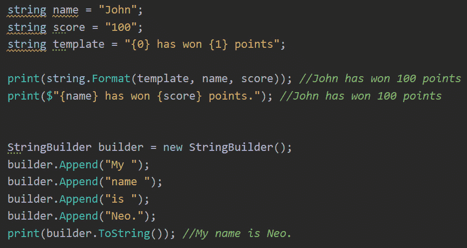

图 19.31 – C#中的字符串管理

最后，一个经典的技术是对象池，适用于需要不断实例化和销毁对象的情况，比如子弹或特效。在这种情况下，使用常规的`Instantiate`和`Destroy`函数会导致内存碎片，但对象池通过分配可能需要的最大数量的对象来解决这个问题。它通过取其中一个预分配的函数来替换`Instantiate`，并通过将对象返回到池中来替换`Destroy`。一个简单的对象池可以在下面的截图中看到：

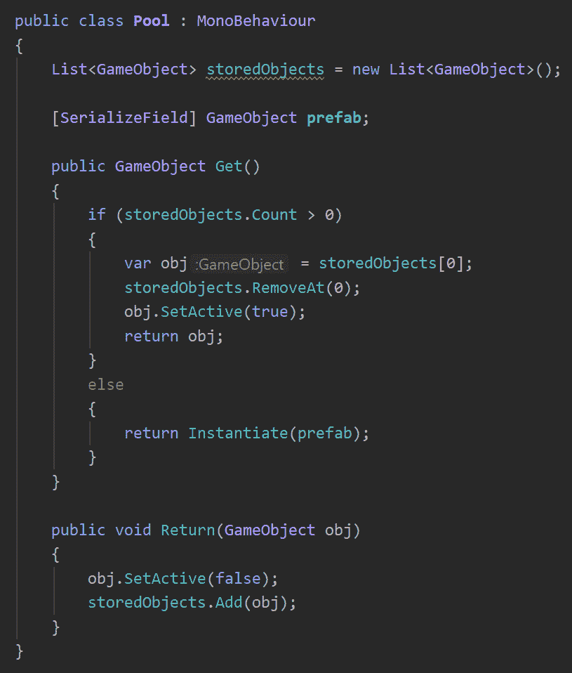

图 19.32 – 一个简单的对象池

有几种方法可以改进这个池，但现在它已经很好了。请注意，当从池中取出对象时，需要重新初始化对象，你可以使用`OnEnable`事件函数或创建一个自定义函数来通知对象这样做。

现在我们已经探讨了一些基本的内存分配减少技术，让我们来看看一个新的内存分析器工具，它是在 Unity 的最新版本中引入的，可以更详细地探索内存。

## 使用内存分析器

使用这个分析器，我们可以检测每帧分配的内存，但它不会显示到目前为止分配的总内存，这对于研究我们如何使用内存很有用。这就是内存分析器可以帮助我们的地方。这个相对较新的 Unity 包允许我们对每个分配的对象进行内存快照，包括本地和托管端的对象——本地指的是内部的 C++ Unity 代码，托管指的是属于 C#端的任何东西（也就是我们的代码和 Unity 的 C#引擎代码）。我们可以使用可视化工具探索快照，并快速看到哪种类型的对象消耗了最多的 RAM，以及它们如何被其他对象引用。

要开始使用内存分析器，请执行以下操作：

1.  安装`包管理器`（**窗口** | **包管理器**）。记得将**包模式**设置为**Unity 注册表**并启用预览包（**齿轮图标 | 高级项目设置 | 启用预览包**）。

图 19.33 – 启用预览包

1.  在**窗口** | **分析** | **内存分析器**中打开`内存分析器`。

1.  玩游戏并在**内存分析器**窗口中点击**捕获玩家**按钮：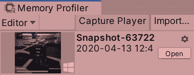

图 19.34 – 启用预览包

1.  点击快照旁边的**打开**按钮以打开树视图，在这里你可以看到内存按类型分成块：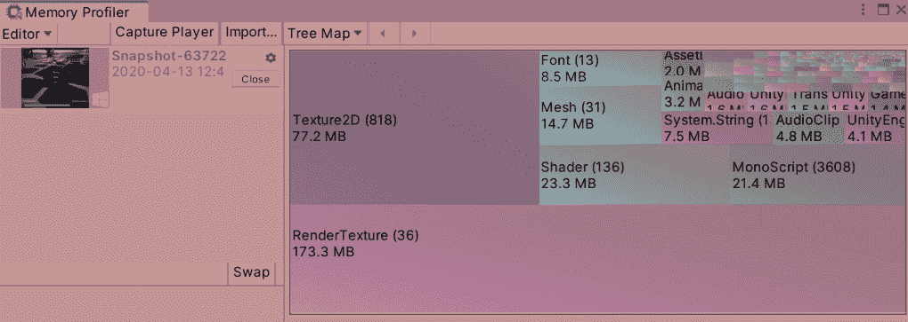

图 19.35 – 内存块

1.  在我们的案例中，我们可以看到`RenderTexture`使用了最多的内存，这属于在场景中显示的图像，以及一些用于后处理效果的纹理。尝试禁用`PPVolume`对象并拍摄另一个快照以检测差异。

1.  在我的情况下，这减少了 130 MB。还有其他用于其他效果的纹理，例如 HDR。如果您想探索剩余 MB 的来源，请单击块以将其细分为其对象，并根据纹理的名称进行猜测：

图 19.36 - 内存块详细信息

1.  您可以在 Texture2D 块类型中重复相同的过程，该类型属于我们模型材质中使用的纹理。您可以查看最大的纹理并检测其使用情况 - 也许这是一个从未被近距离看到的大纹理，无法证明其大小。然后，我们可以使用纹理导入设置的最大尺寸来减小其大小。

重要提示

与任何性能分析器一样，直接在构建中进行性能分析总是有用的（关于这一点，我们将在下一章中详细介绍），因为在编辑器中拍摄快照将捕获编辑器使用的大量内存，并且在构建中不会使用。这种情况的一个例子是加载不必要的纹理，因为编辑器可能在您单击它们以在检查器窗口中查看其预览时加载了它们。

请注意，由于内存分析器是一个包，其用户界面可能经常发生变化，但其基本思想将保持不变。您可以使用此工具来检测是否以意外的方式使用内存。在这里需要考虑的一个有用的事情是 Unity 在加载场景时加载资产的方式，这包括在加载时加载场景中引用的所有资产。这意味着您可以有一个例如，具有对材质的引用的预制体数组，甚至如果您不实例化它们的任何实例，预制体也必须在内存中加载，导致它们占用空间。在这种情况下，我建议您探索地址可寻址性的使用，它提供了一种动态加载资产的方式。但现在让我们保持简单。

您可以通过性能分析器做更多事情，例如访问所有对象的列表视图，并观察每个对象的每个字段及其引用，以查看使用它的对象（从主菜单，转到 TreeMap | Table | All objects），但对于初学者来说，我发现那个视图有点混乱。内存分析器引用导航系统的一个很好的替代方案是使用性能分析器的内存模块。这是内存分析器的基本版本，不会向您显示带有良好树状视图的内存，也不会提供内存分析器可以提供的详细信息，但提供了一个更简单的引用导航器版本，这在大多数情况下已经足够了。

要使用它，请执行以下操作：

1.  打开性能分析器（窗口 | 分析 | 性能分析器）。

1.  在播放模式下，通过性能分析器模块列表向下滚动，并选择内存。

1.  在 Gather object references 切换打开的情况下，单击 Take Sample Playmode。

1.  探索弹出的列表，打开类别并选择一个资产。在下面的屏幕截图中，您可以看到我已经选择了纹理，并且在右侧面板上，我可以探索引用。这个纹理被一个名为 base color 的材质使用，该材质被一个名为 floor_1_LOD0 的 GameObject 中的网格渲染器引用。您甚至可以单击引用列表中的项目以突出显示引用对象：

图 19.37 - 参考列表

正如您所看到的，内存分析器和分析器中的内存模块做了类似的事情。它们可以为您拍摄内存快照以供分析。我相信随着时间的推移，Unity 将统一这些工具，但目前，根据它们的优势和劣势，例如内存分析器比较两个快照以分析差异的能力，或者探索内存的低级数据的能力，比如查看哪个托管对象正在使用哪个本机对象（这是相当高级的，大多数情况下是不必要的）。您可以使用内存模块来分析引用，查看哪个对象正在使用哪个纹理以及原因。

# 总结

优化游戏并不是一项容易的任务，特别是如果您不熟悉每个 Unity 系统的内部工作原理。遗憾的是，这是一项艰巨的任务，没有人知道每个系统的细节，但是通过本章学习的工具，我们有一种方法通过探索来探索变化如何影响系统。我们学会了如何对 CPU、GPU 和 RAM 进行分析，以及任何游戏中关键硬件是什么，并且涵盖了一些常见的良好实践方法，以避免滥用它们。

现在，您可以诊断游戏中的性能问题，收集关于三个主要硬件部件（CPU、GPU 和 RAM）性能的数据，然后利用这些数据来集中优化工作，应用正确的优化技术。性能很重要，因为您的游戏需要顺畅运行，给用户带来愉快的体验。

在下一章中，我们将看到如何创建我们游戏的构建版本，与其他人分享，而无需安装 Unity。
