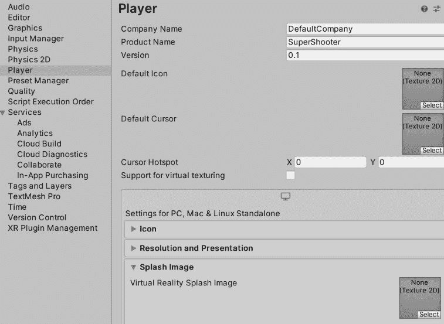
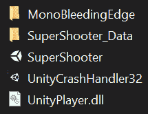
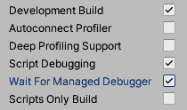
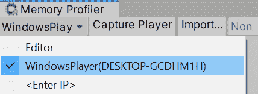

# 第二十章：构建项目

因此，我们已经达到了一个可以用真实人员测试游戏的阶段。问题在于，我们不能假装人们会安装 Unity，打开一个项目，然后点击播放。他们希望收到一个漂亮的可执行文件，双击即可立即播放。在本章中，我们将讨论如何将我们的项目转换为易于共享的可执行格式。

在本章中，我们将讨论以下构建概念：

+   构建项目

+   调试构建

## 构建项目

在软件开发中（包括视频游戏），将我们项目的源文件转换为可执行格式的结果称为构建。生成的可执行文件经过优化，以获得最大可能的性能。由于项目的不断变化性质，我们无法在编辑游戏时获得性能。在编辑游戏时，准备资产到最终形式将是耗时的。此外，生成的文件具有难以阅读的格式。它们不会将纹理、音频和源代码文件放在那里供用户查看。它们将以自定义文件结构格式化，因此在某种程度上，它们受到用户窃取的保护。

重要提示

实际上，有几种工具可以从视频游戏中提取源文件，尤其是从 Unity 这样广泛使用的引擎中。您可以提取资产，如纹理和 3D 模型，甚至有一些程序可以直接从 VRAM 中提取这些资产，因此我们无法保证这些资产不会在游戏之外使用。最终，用户在他们的磁盘上拥有这些资产的数据。

当您将目标定为 PC、Mac 或 Linux 等桌面平台时，构建过程非常简单，但在构建之前，我们需要牢记一些设置。我们将要看到的第一个配置是场景列表。我们已经讨论过这一点，但现在是一个很好的时机来记住，将此列表的第一个元素设置为将首先加载的场景非常重要。记住，您可以通过转到**File | Build Settings**并将所需的起始场景拖到列表顶部来实现这一点。在我们的情况下，我们将游戏场景定义为第一个场景，但在一个真正的游戏中，最好创建一个使用 UI 和一些图形的主菜单场景：

图 20.1 - 场景列表顺序

您可以在这里更改的另一个设置是目标平台 - 将为其创建构建的目标操作系统。通常，这是设置为您正在开发的相同操作系统，但是，如果您例如在 Mac 上开发，并且希望为 Windows 构建，只需设置`exe`而不是`app`。您可能会看到 Android 和 iOS 作为其他目标平台，但制作移动游戏需要其他考虑，我们不会在本书中讨论：

图 20.2 - 目标平台

在同一个窗口中，您可以单击左下角的**Player Settings**按钮，或者只需打开**Edit** | **Project Settings**窗口，然后单击**Player**类别，即可访问其余的构建设置。Unity 将生成的可执行文件称为游戏玩家。在这里，我们有一组配置，将影响构建或玩家的行为，以下是基本配置列表：

+   **产品名称**：这是窗口标题栏和可执行文件中游戏的名称。

+   **公司名称**：这是开发游戏的公司名称，Unity 用它来创建某些文件路径，并将其包含在可执行信息中。

+   **默认图标**：在这里，您可以选择一个纹理作为可执行文件的图标。

+   `光标热点`属性指的是您希望光标执行点击操作的图像像素。

+   **分辨率和呈现**：关于我们的游戏分辨率将如何处理的设置。

+   **分辨率和演示|默认为本机分辨率**：勾选此项并且游戏在全屏模式下运行时，Unity 将使用系统当前使用的分辨率。您可以取消选中此项并设置所需的分辨率。

+   **启动图像：**关于游戏在首次加载后显示的启动图像的设置。

+   **启动图像|显示启动画面**：这将启用 Unity 启动画面，作为游戏的介绍显示标志。如果您有 Unity Pro 许可证，您可以取消选中此项，以创建自定义的启动画面。

+   **启动图像|标志列表**：在这里，您可以添加一组图像，Unity 将在启动游戏时显示。如果您免费使用 Unity，则强制在此列表中显示 Unity 标志。

+   `全部顺序`以显示每个标志，一个接一个地显示，或者选择`Unity 标志下方`，以显示您的自定义介绍标志，并始终显示 Unity 标志下方：

图 20.3 – 玩家设置

在配置这些设置后，下一步是进行实际构建，可以通过在“文件|构建设置”窗口中点击“构建”按钮来完成。这将要求您设置构建文件的创建位置。我建议您在桌面上创建一个空文件夹，以便轻松访问结果。请耐心等待 - 根据项目的大小，这个过程可能需要一些时间：

图 20.4 – 构建游戏

这里可能出现的问题是具有非构建兼容脚本 - 仅在编辑器中执行的脚本，主要是编辑器扩展。我们没有创建任何这样的脚本，所以如果构建后在控制台中出现错误消息，类似于以下截图，那可能是因为某个 Asset Store 包中的某个脚本。在这种情况下，只需删除在构建错误消息之前在控制台中显示的文件。如果碰巧有一个您的脚本在其中，请确保您的脚本中没有任何`using UnityEditor;`行。这将尝试使用编辑器命名空间，该命名空间不包含在构建编译中以节省磁盘空间：

图 20.5 – 构建错误

这基本上就是您需要知道的一切。您已经生成了您的游戏！需要注意的是，在构建时指定的文件夹中创建的每个文件都必须共享，不仅仅是可执行文件。`Data`文件夹包含所有资产，并且在共享 Windows 构建游戏时包含这些文件是很重要的。对于 Linux 和 Mac 构建，只生成一个文件（分别是`x86/x86_64`和`app packages`）：

图 20.6 – 一个由 Windows 生成的文件夹

最后一个建议 - 注意**构建**窗口中的**仅构建脚本**复选框。如果只更改了代码并希望测试该更改，请勾选它并进行构建。这将使过程比常规构建更快。只需记住，如果您在编辑器中更改了其他内容，请取消选中此项，因为如果您勾选了它，这些更改将不会包含在内。

现在我们已经构建了，您可以通过双击可执行文件来测试它。现在您已经尝试了您的构建，我们可以讨论如何使用与我们在编辑器中使用的相同的调试和性能分析工具来测试我们的构建。

## 调试构建

在理想的世界中，编辑器和构建将表现相同，但遗憾的是这并不是真的。编辑器准备在快速迭代模式下工作。代码和资源在使用之前经过最少的处理，以便经常快速地进行更改，这样我们就可以轻松测试我们的游戏。当游戏构建完成时，将应用一系列优化和与编辑器项目的差异，以确保我们能够获得最佳性能，但这些差异可能导致游戏的某些部分表现不同，使得玩家的分析数据与编辑器不同。这就是为什么我们要探索如何在构建中调试和分析我们的游戏。

在本节中，我们将研究以下构建调试概念：

+   调试代码

+   性能分析

让我们开始讨论如何调试构建的代码。

## 调试代码

由于玩家代码编译方式不同，我们可能会在构建中遇到在编辑器中没有发生的错误，并且我们需要以某种方式进行调试。我们有两种主要的调试方式——通过打印消息和断点。所以，让我们从第一种消息开始。如果你运行了可执行文件，你可能已经注意到没有控制台可用。全屏只有游戏视图，这是有道理的；我们不想用烦人的测试消息来分散用户的注意力。幸运的是，消息仍然被打印出来，但是在一个文件中，所以我们可以去那个文件中查找它们。

位置根据操作系统而变化。在这个列表中，你可以找到可能的位置：

+   `~/.config/unity3d/CompanyName/ProductName/Player.log`

+   `~/Library/Logs/Company Name/Product Name/Player.log`

+   `C:\Users\username\AppData\LocalLow\CompanyName\ProductName\Player.log`

在这些路径中，你必须用我们之前设置的`Player`设置属性的值来更改`CompanyName`和`ProductName`，这两个属性的值是相同的，`username`用你在 Windows 中执行游戏的账户名。请注意，文件夹可能是隐藏的，所以在你的操作系统中启用显示隐藏文件的选项：

图 20.7 - 显示隐藏文件

在那个文件夹里，你会找到一个名为`Player`的文件；你可以用任何文本编辑器打开它并查看消息。在这种情况下，我使用了 Windows，所以目录路径看起来像下面的截图：

图 20.8 - 调试目录

除了从资产商店下载任何自定义包之外，还有一种方法可以直接在游戏中查看控制台的消息，至少是错误消息——通过创建一个开发构建。这是一个特殊的构建，允许扩展的调试和分析能力，以换取不像最终构建那样完全优化代码，但对于一般调试来说足够了。你可以通过在**文件 | 构建设置**窗口中勾选**开发构建**复选框来创建这种构建：

图 20.9 - 开发构建复选框

请记住，这里只会显示错误消息，所以你可以做一个小技巧，用`Debug.LogError`替换`print`和`Debug.Log`函数调用，这样也会在控制台中打印消息，但会有一个红色图标。请注意，这不是一个好的做法，所以限制使用这种消息进行临时调试。对于永久记录，使用日志文件或在资产商店中找到一个自定义的运行时调试控制台。

请记住，要使**开发构建**起作用，你需要重新构建游戏；幸运的是，第一次构建需要最长的时间，接下来会更快。这次，你只需点击**构建并运行**按钮，就可以在之前构建的文件夹中进行构建：

图 20.10 - 调试错误消息

在下一个截图中，您可以看到运行时显示的错误。

图 20.11 – 开发构建中的错误消息

此外，您也可以像我们在*第十三章**中解释的那样使用常规断点。将 IDE 附加到玩家上后，它将显示在目标列表中。但是为了使其工作，您不仅需要在构建窗口中勾选**开发构建**，还需要勾选**脚本调试**。在这里，当勾选了**脚本调试**后，会显示一个额外的选项，允许您暂停整个游戏直到调试器附加上，这个选项叫做**等待托管调试器**。如果您想要测试一些立即发生并且不允许您足够时间附加调试器的事情，这将非常有用：

图 20.12 – 启用脚本调试

我们有另一种方式来查看消息，但这需要性能分析器的工作，所以让我们借此机会讨论如何对编辑器进行性能分析。

## 性能分析

这次我们将使用与上一章相同的工具来对玩家进行性能分析。幸运的是，差异很小。与上一节一样，您需要在**开发**模式下构建玩家，在构建窗口中勾选**开发构建**复选框，然后性能分析器应该会自动检测到它。

让我们开始使用性能分析器来进行构建，具体操作如下：

1.  通过构建来玩游戏。

1.  使用*Alt* + *Tab*（Mac 上为*command* + *tab*）切换到 Unity。

1.  打开性能分析器。

1.  点击菜单中的**播放模式**，选择包含**Player**的项目。因为我使用的是 Windows，所以它显示为**WindowsPlayer**：

图 20.13 – 对玩家进行性能分析

请注意，当您点击一个帧时，游戏不会像在编辑器中那样停止。如果您想要在特定时刻专注于帧，您可以点击记录按钮（红色圆圈）使性能分析器停止捕获数据，这样您就可以分析到目前为止捕获的帧。

此外，您还可以看到当性能分析器附加到玩家时，控制台也会附加，因此您可以直接在 Unity 中看到日志。请注意，此版本需要 Unity 打开，并且我们不能期望测试我们游戏的朋友们也有它。您可能需要点击**控制台**上的**Player**按钮，并勾选**玩家日志记录**才能使其工作：

图 20.14 – 在附加性能分析器后启用玩家日志记录

帧调试器也已启用以与玩家一起工作。您需要在帧调试器中点击**编辑器**按钮，然后再次，您将在可能的调试目标列表中看到玩家；选择它后，像往常一样点击**启用**。请注意，绘制调用的预览不会出现在游戏视图中，而是出现在构建本身中。如果您在全屏模式下运行游戏，可能需要在 Unity 和构建之间来回切换：

图 20.15 – 调试游戏玩家的帧

您也可以在**窗口**模式下运行游戏，将**全屏模式**属性设置为**窗口**，并设置一个小于您的桌面分辨率的默认分辨率，以便同时在 Unity 和玩家中看到：

图 20.16 – 启用窗口模式

最后，**内存分析器**还支持对玩家进行分析，你可以在窗口顶部的第一个按钮点击时显示的列表中选择玩家，然后点击**捕获玩家**：

图 20.17 – 对玩家进行内存快照

就是这样。正如你所看到的，Unity Profilers 被设计为可以轻松集成到玩家中。如果你开始从中获取数据，你会发现与编辑器分析相比，特别是在**内存分析器**中，会有很大的不同。

# 总结

在本章中，我们看到了如何创建游戏的可执行版本，并正确配置它，以便你不仅可以与朋友分享，还可以与世界分享！我们还讨论了如何对我们的构建进行分析；记住，这样做将为我们提供比分析编辑器更准确的数据，这样我们就可以更好地提高游戏的性能。

但在此之前，让我们讨论一些最后的细节。这些不是 Unity 相关的细节，而是游戏相关的细节；在向除自己和在游戏开发过程中看到游戏的任何人之外的人展示游戏之前和之后，你需要考虑的事情。我们将在下一章中进行讨论。
