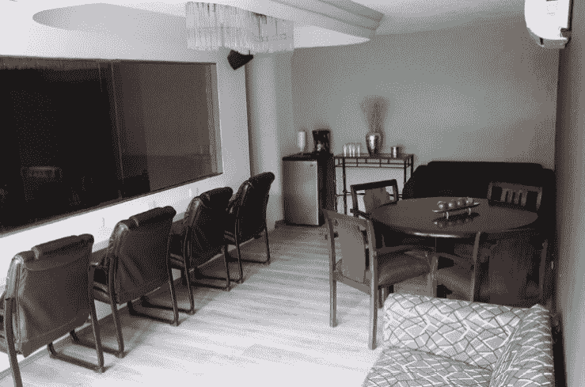
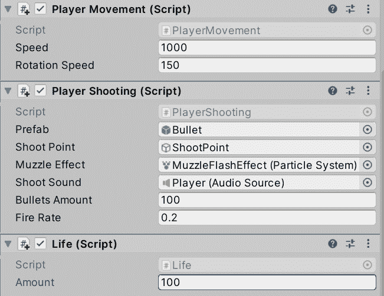
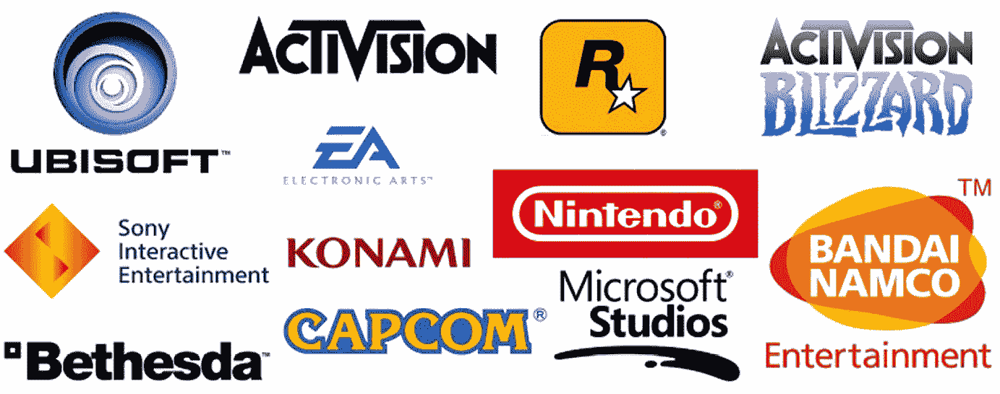

# 第二十一章：*第二十一章*：润色

我们到了！我们现在有了一个完全开发好的游戏，所以我们现在可以赚点钱了吗？很遗憾，不行。一个成功的游戏依赖于大量的细化；细节决定成败！而且，不要对赚钱感到太兴奋；这是你的第一个游戏，还有很多与开发无关的任务要完成。现在是时候讨论我们已经取得的成就能做些什么了。

在本章中，我们将讨论以下概念：

+   迭代你的游戏

+   发布你的游戏

# 迭代你的游戏

我们即将完成我们的第一个游戏迭代。我们有一个想法，我们实现了它，现在是时候测试它了。在这次测试之后，我们将得到一些可以改进的反馈，所以我们将制定改进的想法，实施它们，测试它们，然后重复。这就是迭代。

在这一部分，我们将讨论以下迭代概念：

+   测试和反馈

+   解决反馈

让我们首先讨论如何正确地在人们身上测试游戏。

## 测试和反馈

除了强大的营销策略外，你的游戏的成功还取决于游戏的前 10 分钟。如果你不能在那段时间内吸引玩家的注意，你肯定会失去他们。你的游戏的第一印象很重要。那前 10 分钟必须是完美的，但遗憾的是，我们对游戏的感知在这里并不重要。你花了好几个小时玩它，你知道每个关卡的每一寸地方，知道如何正确地控制你的角色，以及你的游戏的所有机制和动态—这是你的游戏。你爱它就是它。这是一个巨大的成就。现在，一个从未玩过游戏的人不会有同样的感觉。这就是为什么测试如此重要。

第一次让别人玩你的游戏时，你会感到震惊—相信我，我也有过这种经历。你会注意到玩家可能不会理解游戏。他们不会理解如何控制玩家或者如何赢得游戏，并且会卡在你从未想象过会困难的关卡部分。到处都是 bug，一团糟—但那很好！那正是测试你的游戏的目的，获得有价值的信息或反馈。如果你正确对待这些反馈，这些反馈将使你的游戏变得更好。

在测试会话中，有两个主要的反馈来源—观察和用户反馈。观察是默默地看着玩游戏的人，看他们如何玩—他们首先按下哪些键，当发生某事时他们的反应是什么，当他们以意想不到的方式开始感到沮丧时是什么时候（有些游戏依赖于沮丧，比如*黑暗之魂*），并且通常检查玩家是否得到了你期望的确切体验。

观察的沉默部分至关重要。你必须*不*与玩家交谈，尤其是不要给他们任何提示或帮助，至少在他们完全迷失并且测试会话无法继续进行而需要帮助的情况下才可以—这种情况本身也是一种有用的反馈形式。你必须观察玩家在他们自然状态下的表现，就像他们在家里玩游戏时的情况一样。如果不是这样，收集到的反馈将是有偏见的，也不会有用。在测试大型游戏时，甚至会在盖塞尔室进行测试。这些房间有一块只能从一侧看到的玻璃—就像一个审讯室，但不那么可怕。这样，玩家就不会感到任何被观察的压力：

图 21.1 – 盖塞尔室

第二个来源是直接反馈，基本上是询问测试人员在测试后对游戏的印象。在这里，你可以先让测试人员告诉你他们的体验，并提供任何反馈，然后你可以开始问与该反馈相关的问题或与测试相关的其他问题。这可能包括问题，比如“你觉得控制方式如何？游戏中哪一部分让你最沮丧？哪一部分最有回报？你愿意为这个游戏付费吗？”

在从测试人员那里接受反馈时需要考虑的一件重要事情是他们是谁。他们是朋友、亲戚还是完全陌生人？当与亲近的人一起测试时，反馈可能不会有用。他们会试图淡化游戏的不足之处，因为他们可能认为你让他们玩游戏是为了得到赞美，但事实并非如此。你需要真实、严厉、客观的反馈——这是你真正改进游戏的唯一途径。

所以，除非你的朋友对你非常诚实，否则请尝试在陌生人身上测试你的游戏。这可以是你教育机构的其他学生，或者你的工作场所，或者街上的随机人。尝试去游戏展会上展示独立游戏。此外，在测试时要考虑你的目标受众。如果你的游戏是休闲手机游戏，你不应该把它带到“毁灭”聚会上，因为你大多会收到无关的反馈。了解你的受众并寻找他们。此外，考虑到你可能需要在至少 10 个人身上测试你的游戏。你会注意到也许有一个人不喜欢这个游戏，其他 9 个人喜欢。就像统计学一样，你的样本必须足够大才能被认为是有效的。

此外，即使我们说我们的感知不重要，如果你运用常识并对自己诚实，你也可以从自己的游戏测试中获得反馈。但既然我们已经收集了反馈，我们可以用它做些什么呢？

## 解释反馈

你得到了你想要的——关于你的游戏的大量信息。现在你该怎么办？嗯，这取决于反馈。你有不同类型和不同的解决方法。最容易解决的反馈是错误，例如，当我放进钥匙时门没有打开，无论我射了多少子弹敌人都不会死，等等。要解决这些问题，你必须逐步进行玩家的操作，以便你能够重现问题。一旦你重现了它，调试你的游戏以查看错误——也许是由于空值检查或场景中的错误配置引起的。

尽量收集关于情况的尽可能多的细节，比如问题发生的时间和级别，玩家拥有的装备，玩家剩下的生命次数，或者玩家是在空中还是蹲下——任何能让你达到完全相同情况的数据。有些错误可能很棘手，有时会在最奇怪的情况下发生。你可能会认为发生 1%的奇怪错误可以忽略不计，但请记住，如果你的游戏成功，将会有数百，甚至数千名玩家玩——这 1%可能会严重影响你的玩家群。

然后，你需要平衡反馈。你可能会得到反馈，比如子弹不够，生命太多，敌人太难，游戏太容易，或者游戏太难。这必须与你的目标一起考虑。你真的希望玩家子弹或生命不够吗？你希望敌人难以击败吗？在这种情况下，玩家觉得困难的事情可能正是你想要的体验，这就是你需要记住目标受众的地方。也许给你反馈的用户不是你期望玩游戏的人（再次想想《黑暗之魂》的例子，这款游戏并不适合所有人）。但如果玩家是目标受众，你可能需要平衡。

平衡是当你需要微调游戏数字，比如子弹数量、波数、敌人、敌人的生命、敌人的子弹等等。这就是为什么我们暴露了大量脚本属性——这样它们就可以很容易地改变。这可能是一个复杂的过程。让所有这些数字一起运作是困难的。如果你把一个属性增加得太多，可能需要减少另一个属性。你的游戏基本上就是一个大的计算表格。实际上，大多数游戏设计师都精通使用电子表格来做这件事——平衡游戏，进行计算，并看看改变一个单元格如何改变另一个单元格——在进行艰难的测试之前，先玩游戏。

在下面的截图中，你可以看到我们如何准备我们的`Player`对象在编辑器中轻松配置：

图 21.2 – 影响游戏玩法的一些属性

你还可以得到一些反馈，比如“我不明白玩家为什么会这样做”，“我不明白反派的动机”，等等。这可能很容易被低估，但要记住，你的游戏机制、美学和故事（如果有的话）必须保持一致。如果其中一个元素失败了，其他元素也有失败的风险。如果你的游戏设定在未来，但你的主要武器是一把金属剑，你需要以某种方式证明它的存在，也许通过一个故事点。如果你的敌人想要摧毁世界，但看起来是一个善良的人，你需要以某种方式证明这一点。这些细节是使游戏可信的关键。

最后，你会得到感知反馈，比如“这个游戏没能让我娱乐”或“我不喜欢这个游戏”。如果你问对了问题，这些反馈可以转化为其他反馈，但有时测试人员不知道问题出在哪里；游戏可能在他们眼中感觉不对劲。当然，这本身并不有用，但不要低估它。这可能是你需要进行进一步测试的暗示。

在游戏开发中，当你认为游戏已经完成时，你会发现你刚刚开始开发它。测试会让你意识到游戏直到玩家对游戏满意才算完成，这可能需要比准备第一个版本更多的时间，所以要准备好不断迭代游戏。

大型游戏可能需要花费数年时间才能制作出第一个原型，在游戏的早期阶段进行测试，有时会使用虚假资产来隐藏可能泄露游戏信息或让竞争对手意识到他们的计划的敏感信息。一些开发者甚至会发布一个基于主游戏的迷你游戏，故事和美学不同，只是为了测试一个想法。此外，还有软发布，游戏会发布但只针对受限的受众——也许是特定国家，不是你的主要受众和收入来源——以在将游戏发布到全球之前测试和迭代游戏。

所以，请耐心等待。测试是游戏真正开发的地方，但在所有这些广泛的测试会话结束并且游戏完成后，下一步是什么？发布！

# 发布你的游戏

我们在这里——重要时刻！我们有金版构建，这是游戏的最终版本。我们是不是应该把它直接投放到目标商店（比如 Steam、Google Play 商店、苹果应用商店等）？嗯...实际上，我们还有很多工作要做，这些工作在达到金版构建之前就应该开始了。所以，让我们探讨一下额外的工作是什么，以及应该在哪个阶段进行。

在这一部分，我们将研究以下发布阶段：

+   预发布

+   发布

+   发布后

让我们从讨论预发布阶段开始。

## 预发布

在发布前和最好在开始开发游戏之前，要决定你将在哪里销售你的游戏。如今，这意味着选择一个数字商店——对于新兴独立开发者来说，销售实体游戏副本不是一个选择。你有几个选择，但对于 PC 来说，最常见的地方是 Steam，这是一个知名平台，允许你以 100 美元的价格将游戏上传到平台上。经过审核后，就可以发布了。在 iOS 上，唯一的方式是使用 App Store，它每年收取 100 美元的费用。最后，在 Android 上，你可以使用 Play 商店，它允许你以 25 美元的一次性付款发布游戏。游戏机有更严格的要求，所以我们不会提及它们。

在选择了一个数字商店之后，如果你没有做任何准备就发布你的游戏，你的游戏可能会在同一天发布的众多游戏中迅速被遗忘。如今，竞争是激烈的，可能会有数十款游戏在同一天发布，所以你必须以某种方式突出你的游戏。有很多方法可以做到这一点，但这需要数字营销方面的经验，这可能很困难。这需要除了常规开发者技能之外的技能。如果你坚持自己做而不雇人，这里有一些你可以做的事情。

首先，你可以创建一个游戏社区，比如一个博客或者群组，在这里你可以定期发布关于你的游戏的信息。这包括开发进展的更新、新功能的截图、新概念艺术等等。你的工作是吸引玩家的兴趣，即使游戏还没有发布，也要让他们对你的游戏保持兴趣，为了让他们在游戏发布时立刻购买。在这里，你需要有创意来保持他们对游戏的兴趣——变化发布的内容，也许与社区分享一些迷你游戏，让他们有机会赢得奖品，或者发布问卷调查或赠品；真的，做任何能吸引你观众注意的事情。

另外，尽量在离发布日期不是太近也不是太远的时候发展社区。这样，你就不会因为长时间等待而失去玩家的注意力，也可以对游戏的期望值诚实。游戏在开发过程中会发生很多变化，范围可能会从最初的设计中减少。你需要处理炒作，这可能是危险的。

当然，我们需要人们加入社区，所以你必须在某个地方发布它。你可以付费广告，但除了成本和难以使它们相关之外，还有其他免费的方法。你可以把你的游戏免费送给一位影响者，比如一个 YouTuber 或 Instagrammer，让他们玩你的游戏并向他们的观众发表评论。如果影响者不喜欢游戏，这可能会很困难，因为他们会诚实，这对你来说可能是不利的。所以，你真的需要确保给他们一个精心制作的版本，但不一定是最终版本。你也可以接触一些付费的影响者，但同样，这需要花钱。

你还有其他免费的选择，比如进入论坛或群组，发布关于你的游戏的信息，但要明智。不要让你的帖子感觉像廉价的广告——知道你在哪里发布。有些群体不喜欢这类帖子，会拒绝它们。试着寻找允许这种自我宣传的地方。有些群体就是为此而设立的，所以在某些社区中避免侵入性。

最后，你还有另一个选择，就是联系出版商，一家专门从事这种营销的公司。他们会拨款用于出版，并有专人负责管理你的社区，这可能会给你带来很大的帮助。你会有更多时间来创建你的游戏，但也会有一些缺点。首先，当然，他们会从你的游戏收入中抽成，而且根据出版商的不同，这个比例可能会很高。然而，你需要权衡一下，通过自己的营销能获得的收入。此外，出版商会要求你改变你的游戏以满足他们的标准。有些要求你的游戏本地化（支持多种语言），或者要求你的游戏支持某些控制器，有一定的教程方式等等。最后，要考虑到某些出版商与某些类型的游戏有关联，所以如果你正在创建一个激烈的动作游戏，你不会选择与休闲游戏出版商合作。找到适合你的出版商：

图 21.3 - 一些知名的出版商，其中一些不开发他们自己的游戏，只是发布它们

现在我们已经为发布做好了准备，那么我们如何发布游戏呢？

## 发布

除了你的游戏可能需要在所选的数字商店平台上进行的所有设置和集成（这取决于你的受众），在发布时还有一些需要考虑的事情。

一些商店可能会有一个审查过程，包括玩你的游戏，看看它是否符合商店的标准。举个例子，在写这本书的时候，苹果应用商店要求他们发布的每款游戏都必须有某种社交登录选项（比如 Facebook、Google 等），并且还要支持苹果登录。如果你不遵守这些规定，他们就不会接受你的游戏。另一个例子是 PS Vita，它要求你的游戏支持与前后触摸板的某种交互。所以，要早早了解这些要求。如果你不注意，它们会对你的游戏发布产生很大影响。

除了这些要求，当然还有其他需要满足的标准，比如是否有成人或暴力内容。考虑一个支持你所创建游戏类型的平台。有些甚至可能要求你从**娱乐软件评级委员会**（**ESRB**）或类似的评级机构获得评级。你需要注意的另一个常见要求是游戏不应该崩溃，至少不应该在游戏的常规工作流程中崩溃。此外，游戏必须表现良好，不能有严重的性能问题，有时，你的初始游戏下载大小不能超过指定的最大限制，你通常可以通过在游戏本身中下载内容来解决这个问题（查找**Addressables** Unity 包）。再次强调，所有这些要求都取决于商店。

即使满足了这些要求，检查它们的过程可能需要时间 - 几天、几周，甚至有时几个月。所以，在确定发布日期时要记住这一点。在大型游戏机上，这个过程可能需要几个月，有时开发者会利用这段时间创建著名的第一天补丁，这是一个修复 bug 的补丁，虽然不会阻止游戏发布，但有助于整体游戏体验。这是一个值得商榷但可以理解的做法。

最后，记住发布的第一天至关重要。你将出现在商店的**新发布**部分，这是你获得最多曝光的地方。之后，所有的曝光主要都依赖于你的营销和销售。一些商店允许你被推荐。你可以直接与商店的代表交谈，看看你能否做到这一点。如果商店对你的游戏感兴趣，他们可能会推荐你（或者你可能需要为此付费）。第一天很重要，所以要做好准备。

现在，游戏已经发布并交到了玩家手中。我们的工作完成了吗？几年前，也许是真的，但现在不是。我们仍然需要进行发布后的工作。

## 发布后

即使游戏已经发布，这并不是停止测试的借口。如果你的游戏被成千上万的人玩，你实际上可以获得更多的反馈。遗憾的是，你不能在那里观察他们，但你可以自动化信息收集过程。你可以通过让你的代码向服务器报告分析数据来做到这一点，就像 Unity Analytics 包所做的那样。即使这些信息不像面对面测试那样直接，但通过这种方式可以收集大量的数据和统计信息，你可以通过更新实时改进游戏，这是老游戏无法像今天这样轻松做到的。没有游戏是完美的，有时由于时间压力，你可能需要提前发布游戏，所以准备好在发布后定期更新游戏。有一些游戏在发布时表现不佳，但后来得以重生。不要低估最后的行动。你已经花了太多时间来放弃你发布不佳的游戏。

此外，如果你的货币化模式依赖于应用内购买，这意味着人们会在战利品箱或装饰物上花钱，你将需要不断更新内容。这将使玩家继续玩你的游戏。他们玩得越多，就会在游戏上花费更多的钱。你可以利用通过分析收集的信息，不仅修复你的游戏，还可以决定哪些内容被玩家消费最多，并专注于那些内容。你还可以进行 A/B 测试，即向不同用户发布两个版本的更新，看哪个版本最成功。这使你可以在实时游戏中测试想法。正如你所看到的，还有很多工作要做。此外，使用指标来跟踪玩家是否对你的游戏失去兴趣，如果是，为什么——是有难度的关卡吗？游戏太容易了吗？关注你的玩家群体。在你创建的社区中向他们提问，或者只是看评论——用户通常愿意告诉你他们希望如何改进他们最喜欢的游戏。

# 总结

开发游戏只是工作的一部分；要使其成功发布可能是一项巨大的任务。有时，这可能比游戏本身的成本还要高。因此，除非你是为了乐趣而制作游戏，如果你想靠制作游戏谋生，你将需要学会如何管理发布，或者雇佣能够帮助你的游戏的预发布、发布和发布后阶段的人员，这可能是一个明智的举措。

当然，本章仅对这个重要主题进行了简单介绍，所以我建议您如果想认真对待游戏开发的这一部分，可以阅读一些额外的材料。一个非常详细和简洁的信息来源是*Extra Credits* YouTube 频道，提供了传递有价值信息的短视频。此外，还有一本名为《游戏设计的艺术：透镜之书》的好书，提供了对游戏设计的全面介绍。

恭喜，您已经完成了本书的*第三部分*！您已经获得了开始游戏开发职业生涯并选择其中一些角色的基本知识。我建议您在阅读更多关于这个主题的书籍之前将所学知识付诸实践。获取信息很重要，但将信息转化为知识的唯一途径是通过实验。只需确保平衡理论和实践。

在本书的下一部分中，我们将探讨一些可能对您感兴趣的额外主题，首先介绍扩展现实应用程序。
