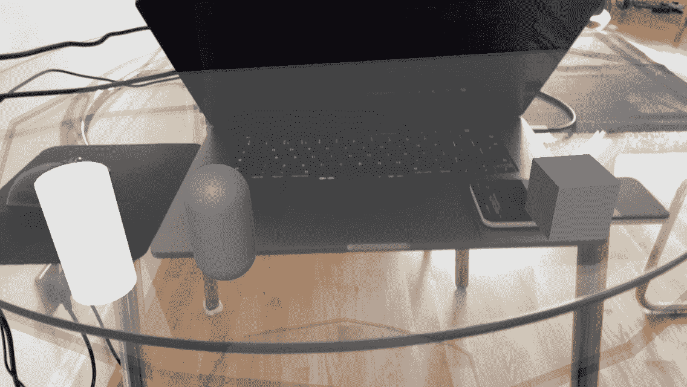
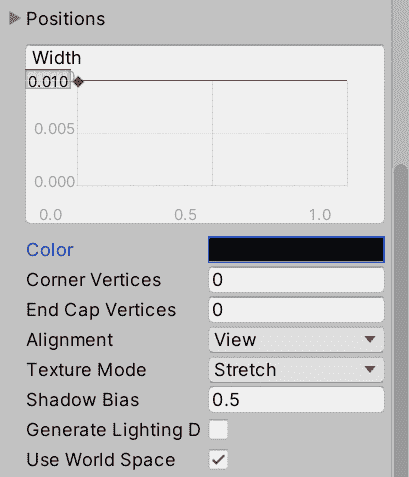
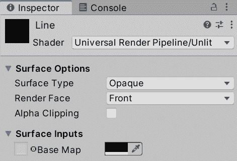
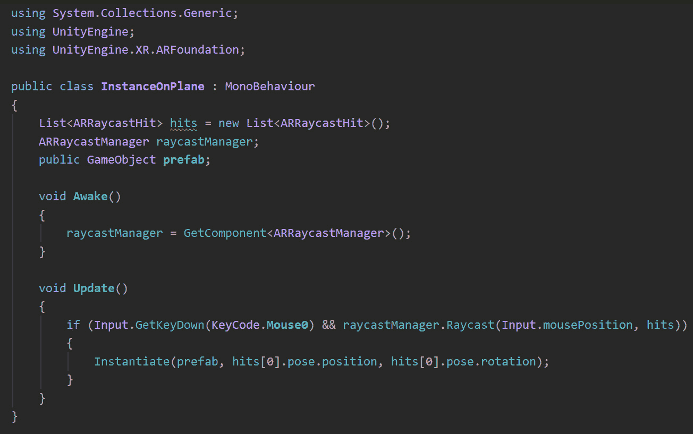
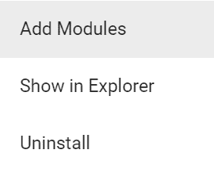
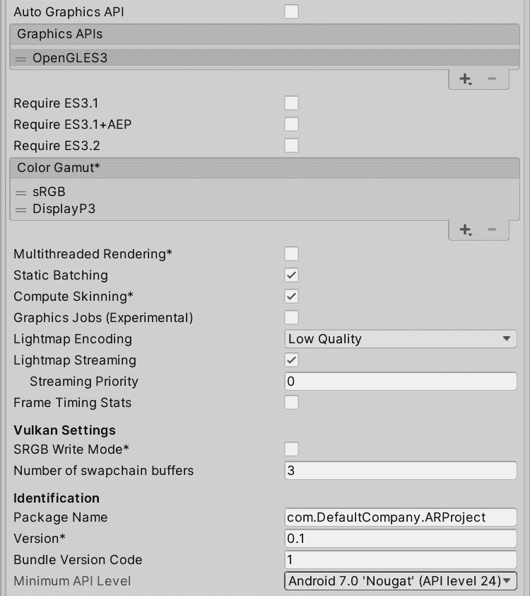
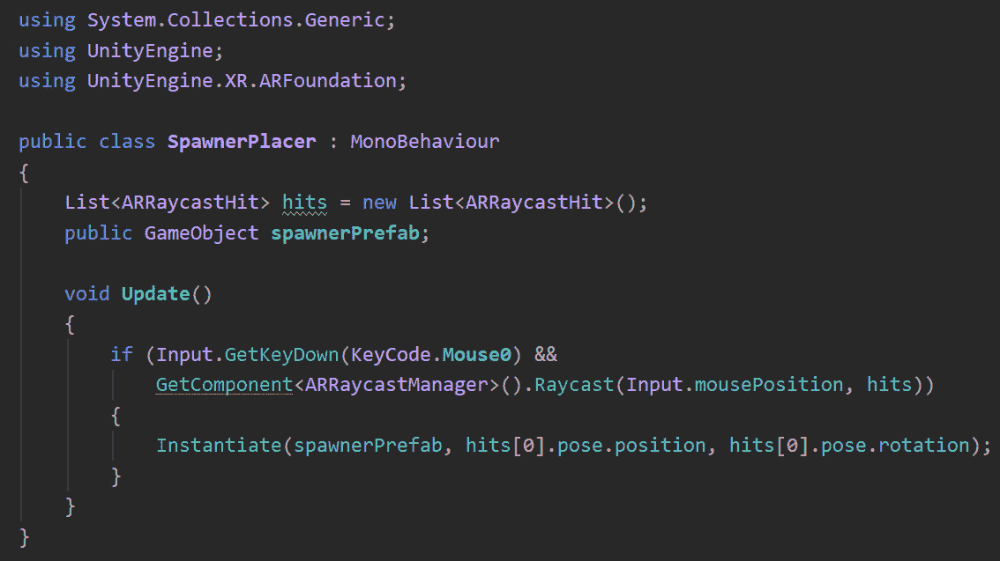

# 第二十二章：*第二十二章*：Unity 中的增强现实

如今，新技术扩展了 Unity 的应用领域，从游戏到各种软件，比如模拟、培训、应用等等。在 Unity 的最新版本中，我们看到了在**增强现实（AR）**领域的许多改进，这使我们能够在现实之上添加一层虚拟，从而增强我们的设备可以感知的内容，从而创建依赖于真实世界数据的游戏，比如摄像头的图像、我们的真实位置和当前的天气。这也可以应用于工作环境，比如查看建筑地图或检查墙内的电气管道。欢迎来到本书的额外部分，在这里我们将讨论如何使用 Unity 的 AR Foundation 包创建 AR 应用程序。

在本章中，我们将研究以下 AR Foundation 概念：

+   使用 AR Foundation

+   为移动设备构建

+   创建一个简单的 AR 游戏

在本章结束时，你将能够使用 AR Foundation 创建 AR 应用程序，并且将拥有一个完全功能的游戏，使用其框架，以便你可以测试框架的能力。

让我们开始探索 AR Foundation 框架。

# 使用 AR Foundation

在 AR 方面，Unity 有两个主要工具来创建应用程序：Vuforia 和 AR Foundation。Vuforia 是一个几乎可以在任何手机上工作的 AR 框架，并且包含了基本 AR 应用程序所需的所有功能，但高级功能需要付费订阅。另一方面，完全免费的 AR Foundation 框架支持我们设备的最新 AR 本地功能，但只受新设备支持。选择其中一个取决于你要构建的项目类型和目标受众。然而，由于本书旨在讨论最新的 Unity 功能，我们将探讨如何使用 AR Foundation 来创建我们的第一个 AR 应用程序，以便检测现实世界中图像和表面的位置。因此，我们将开始探索其 API。

在本节中，我们将研究以下 AR Foundation 概念：

+   创建一个 AR Foundation 项目

+   使用跟踪功能

让我们从讨论如何准备我们的项目，以便它可以运行 AR Foundation 应用程序开始。

## 创建一个 AR Foundation 项目

创建 AR 项目时需要考虑的一些事情是，我们不仅会改变我们编写游戏的方式，还会改变游戏设计方面。AR 应用程序有差异，特别是用户交互的方式，还有一些限制，比如用户始终控制摄像头。我们不能简单地将现有游戏移植到 AR 中而不改变游戏的核心体验。这就是为什么在本章中，我们将致力于一个全新的项目；到目前为止，我们创建的游戏要想在 AR 中运行良好，改变它将会太困难了。

在我们的案例中，我们将创建一个游戏，用户控制一个移动“标记”的玩家，这是一个可以打印的物理图像，可以让我们的应用程序识别玩家在现实世界中的位置。我们将能够在移动图像的同时移动玩家，并且这个虚拟玩家将自动向最近的敌人射击。这些敌人将从用户需要放置在家中不同部分的特定生成点生成。例如，我们可以在墙上放置两个生成点，并将我们的玩家标记放在房间中间的桌子上，这样敌人就会朝着它们走去。在下面的图片中，你可以看到游戏将会是什么样子的预览：

图 22.1 - 完成的游戏。圆柱体是敌人生成器，胶囊体是敌人，立方体是玩家。这些都被手机显示的标记图像定位

我们将以与创建第一个游戏相同的方式开始创建基于 URP 的新项目。需要考虑的是，AR Foundation 可以与其他管道一起使用，包括内置管道，以防您想在已有项目中使用它。如果您不记得如何创建项目，请参考[*第二章*]（B14199_02_Final_SK_ePub.xhtml#_idTextAnchor040），*设置 Unity*。一旦进入新的空白项目中，就像我们之前安装其他软件包一样，从软件包管理器中安装 AR Foundation 软件包；也就是说，从**窗口|软件包管理器**。记得设置软件包管理器，以便显示所有软件包，而不仅仅是项目中的软件包（窗口左上角的**软件包**按钮需要设置为**Unity Registry**）。在撰写本书时，最新版本是 4.0.2。请记住，您可以使用**查看其他版本**按钮，该按钮出现在列表中**软件包项**下的软件包左侧的三角形上，以显示其他版本选项。如果您找到比我的更新版本，可以尝试使用该版本，但通常情况下，如果某些功能与我们想要的不同，请安装此特定版本：

图 22.2 - 安装 AR Foundation

在安装其他所需软件包之前，现在是讨论 AR Foundation 框架的一些核心思想的好时机。这个软件包本身什么也不做；它定义了移动设备提供的一系列 AR 功能，比如图像跟踪、云点和对象跟踪，但如何实现这些功能的实际实现包含在**提供程序**软件包中，比如 AR Kit 和 AR Core XR 插件。这样设计是因为，根据您想要使用的目标设备，这些功能的实现方式会发生变化。例如，在 iOS 中，Unity 使用 AR Kit 来实现这些功能，而在 Android 中，它使用 AR Core；它们是特定于平台的框架。

需要考虑的是，并非所有 iOS 或 Android 设备都支持 AR Foundation 应用程序。在互联网上搜索 AR Core 和 AR Kit 支持的设备时，您可能会找到受支持设备的更新列表。撰写本文时，以下链接提供了受支持设备列表：

+   iOS：[`www.apple.com/lae/ios/augmented-reality/`](https://www.apple.com/lae/ios/augmented-reality/)（页面底部）

+   Android：[`developers.google.com/ar/discover/supported-devices`](https://developers.google.com/ar/discover/supported-devices)

此外，没有 PC 提供程序包，因此迄今为止测试 AR Foundation 应用程序的唯一方法是直接在设备上进行测试，但测试工具即将发布。在我的情况下，我将为 iOS 创建一个应用程序，因此除了**AR Foundation**软件包外，我还需要安装**ARKit XR**插件。但是，如果您想为 Android 开发，请安装**ARCore XR**插件（如果您针对两个平台，请安装两者）。我将使用 ARKit 软件包的 4.0.2 版本，但在撰写本书时，ARCore 推荐的版本是 4.0.4 通常，**AR Foundation**和**提供程序**软件包的版本匹配，但应用与选择**AR Foundation**版本时相同的逻辑。在下面的屏幕截图中，您可以看到软件包管理器中的**ARKit**软件包：

图 22.3 - 安装特定于平台的 AR 提供程序包

](img/Figure_22.3_B14199.jpg)

图 22.3 - 安装特定于平台的 AR 提供程序包

现在我们有了所需的插件，我们需要为 AR 准备一个场景，如下所示： 

1.  在**文件|新场景**中创建一个新场景。

1.  删除**主相机**；我们将使用另一个。

1.  在**游戏对象|XR**菜单中，创建一个**AR 会话**对象。

1.  在同一个菜单中，创建一个**AR 会话起源**对象，其中包含一个**相机**：

图 22.4 - 创建会话对象

1.  您的层次结构应如下所示：

图 22.5 - 起始 ARSCcene

**AR 会话**对象将负责初始化 AR 框架，并处理 AR 系统的所有更新逻辑。**AR 会话原点**对象将允许框架相对于场景定位跟踪对象，如图像和点云。设备会通知跟踪对象相对于设备认为的“原点”的位置。这通常是您在应用程序开始检测对象时指向的房屋的第一个区域，因此 AR 会话原点对象将代表该区域。最后，您可以检查原点内的相机，其中包含一些额外的组件，其中最重要的是**AR 姿势驱动器**，它将使您的**相机**对象随着您的设备移动。由于设备的位置是相对于会话原点对象的点，因此相机需要在原点对象内部。

在 URP 项目（我们的情况）中的一个额外步骤是，您需要设置渲染管道，以便支持在应用程序中渲染相机图像。为此，请转到创建项目时生成的`Settings`文件夹，查找`Forward Renderer`文件，并选择它。在**Renderer Features**列表中，单击**添加渲染器功能**按钮，然后选择**AR 背景渲染器功能**。请注意，如果您使用的是早于 AR Foundation 和 Provider 插件 4.0.0 版本的版本，则此选项可能不可用。在以下截图中，您可以看到前向渲染器资产应该是什么样子的：

图 22.6 - 添加对 URP 的支持

就是这样！我们已经准备好开始探索 AR Foundation 组件，以便我们可以实现跟踪功能。

## 使用跟踪功能

对于我们的项目，我们将需要 AR 中最常见的两种跟踪功能（但不是唯一的）：图像识别和平面检测。第一种是检测特定图像在现实世界中的位置，以便我们可以将数字对象放在其上，例如玩家。第二种，平面检测，是识别现实生活中的表面，如地板、桌子和墙壁，以便我们知道可以放置对象的位置，例如敌人的生成点。只有水平和垂直表面被识别（某些设备上只有垂直表面）。

我们需要做的第一件事是告诉我们的应用程序它需要检测哪些图像，如下所示：

1.  向项目添加一个图像，您可以打印或在手机上显示。有一种在现实世界中显示图像的方式是必要的来测试这一点。在这种情况下，我将使用以下图像：

图 22.7 - 要跟踪的图像

重要提示

尽量获取包含尽可能多特征的图像。这意味着图像具有许多细节，如对比度、锐利的角落等。这些是我们的 AR 系统用来检测的；细节越多，识别就越好。在我们的情况下，我们使用的 Unity 标志实际上并没有太多细节，但有足够的对比度（只是黑白）和锐利的角落，以便系统识别它。如果您的设备在检测时出现问题，请尝试其他图像（经典的 QR 码可能会有所帮助）。

请注意，某些设备可能会对某些图像（例如本书中建议的图像）产生问题。如果在测试时出现问题，请尝试使用其他图像。您将在本章的后续部分在您的设备上测试这一点，所以请记住这一点。

1.  通过单击**Project Panel**中的**+**按钮并选择**XR** | **Reference Image Library**来创建一个包含我们希望应用程序识别的所有图像的资产，创建一个参考图像库：

图 22.8 – 创建参考图像库

1.  选择库资产并单击**添加图像**按钮以向库中添加新图像。

1.  将纹理拖到纹理槽（标有**None**的槽）。

1.  打开**Specify Size**并将**Physical Size**设置为图像在现实生活中的大小，以米为单位。在这里尽量准确；在某些设备上，如果这个值不正确，可能会导致图像无法被跟踪：

图 22.9 – 添加要识别的图像

既然我们已经指定了要检测的图像，让我们通过在真实世界的图像顶部放置一个立方体来测试这一点：

1.  创建一个立方体的预制体并向其添加**AR Tracked Image**组件。

1.  将**AR Tracked Image Manager**组件添加到**AR Session Origin**对象中。这将负责检测图像并在其位置创建对象。

1.  将**Image Library**资产拖到组件的**Serialized Library**属性中，以指定要识别的图像。

1.  将**Cube**预制体拖到组件的**Tracked Image** Prefab 属性中：

图 22.10 – 设置 Tracked Image Manager

就是这样！我们将看到一个立方体在现实世界中与图像相同的位置生成。请记住，您需要在设备上测试这一点，我们将在下一节中进行测试，所以现在让我们继续编写我们的测试应用程序：

图 22.11 – 放置在手机显示的图像顶部的立方体

我们还要准备我们的应用程序，以便它可以检测和显示相机识别的平面表面。只需将**AR Plane Manager**组件添加到**AR Session Origin**对象即可：

图 22.12 – 添加 AR Plane Manager 组件

当我们在房子上移动相机时，这个组件将检测表面平面。检测它们可能需要一段时间，所以重要的是要可视化检测到的区域，以确保它正常工作。我们可以通过组件引用手动获取有关平面的信息，但幸运的是，Unity 允许我们轻松可视化平面。让我们来看一下：

1.  创建一个平面的预制体，首先在**GameObject | 3D Object | Plane**中创建平面。

1.  添加一个**Line Renderer**。这将允许我们在检测到的区域边缘上画一条线。

1.  将`0.01`，**Color**属性设置为黑色，并取消选中**Use World Space**：

图 22.13 – 设置 Line Renderer

1.  记得为**Line Renderer**创建一个合适的着色器材质，并将其设置为渲染器的材质：

图 22.14 – 创建 Line Renderer 材质

1.  另外，创建一个透明材质并在**MeshRenderer**平面中使用。我们希望能透过它看到真实表面，以便轻松地看到下面的真实表面：

图 22.15 – 用于检测平面的材质

1.  向**Plane**预制体添加**AR Plane**和**AR Plane Mesh Visualizer**组件。

1.  将预制体拖动到**AR Plane Manager**组件的**Plane Prefab**属性中的**AR Session Origin**对象：

图 22.16 – 设置平面可视化预制件

现在，我们有一种方法来看到平面，但看到它们并不是我们唯一能做的事情（有时，我们甚至不希望它们可见）。平面的真正力量在于将虚拟对象放置在现实表面上，点击特定平面区域，并获取其现实位置。我们可以使用 AR Plane Manager 或访问可视化平面的 AR Plane 组件来访问平面数据，但更简单的方法是使用**AR Raycast Manager**组件。

Unity 物理系统的`Physics.Raycast`函数，您可能还记得，用于创建从一个位置开始并朝着指定方向的虚拟射线，以使它们击中表面并检测确切的击中点。由**AR Raycast Manager**提供的版本，与物理碰撞体不同，它与跟踪对象发生碰撞，主要是点云（我们不使用它们）和我们正在跟踪的“平面”。我们可以通过以下步骤测试这个功能：

1.  将**AR Raycast Manager**组件添加到**AR Session Origin**对象中。

1.  在**AR Session Origin**对象中创建一个名为`InstanceOnPlane`的自定义脚本。

1.  在`ARRaycastManager`中。您需要在脚本顶部添加`using UnityEngine.XR.ARFoundation;`行，以便在我们的脚本中可用。

1.  创建一个`List<ARRaycastHit>`类型的私有字段并实例化它；Raycast 将检测我们的射线击中的每个平面，而不仅仅是第一个：

图 22.17 – 存储射线击中的列表

1.  在`KeyCode.Mouse0`下按下。在 AR 应用中，鼠标是用设备的触摸屏模拟的（您还可以使用`Input.touches`数组来支持多点触控）。

1.  在`if`语句中，添加另一个条件来调用**AR Raycast Manager**的`Raycast`函数，将鼠标的位置作为第一个参数，将击中列表作为第二个参数。

1.  这将向玩家触摸屏幕的方向投射射线，并将击中的结果存储在我们提供的列表中。如果有东西被击中，它将返回`true`，否则返回`false`：

图 22.18 – 发射 AR 射线

1.  添加一个公共字段来指定要在我们触摸的位置实例化的预制件。您可以只创建一个球体预制件来测试这个；这里不需要为预制件添加任何特殊组件。

1.  在列表中存储的第一个击中的**Pose**属性的**Position**和**Rotation**字段中实例化预制件。击中是按距离排序的，所以第一个击中是最近的。您的最终脚本应如下所示：

图 22.19 – 射线投射器组件

在本节中，我们学习了如何使用 AR Foundation 创建新的 AR 项目。我们讨论了如何安装和设置框架，以及如何检测现实图像的位置和表面，然后如何将对象放置在其上。

正如您可能已经注意到的，我们从未点击播放按钮来测试这个，遗憾的是，在撰写本书时，我们无法在编辑器中测试这个。相反，我们需要直接在设备上测试这个。因此，在下一节中，我们将学习如何为 Android 和 iOS 等移动设备构建。

# 为移动设备构建

Unity 是一个非常强大的工具，可以非常轻松地解决游戏开发中最常见的问题之一，其中之一是为多个目标平台构建游戏。现在，为这些设备构建我们的项目的 Unity 部分很容易，但是每个设备都有其与 Unity 无关的细微差别，用于安装开发构建。为了测试我们的 AR 应用程序，我们需要直接在设备上测试它。因此，让我们探索如何使我们的应用程序在 Android 和 iOS 上运行，这是最常见的移动平台。

在深入讨论这个话题之前，值得一提的是，以下程序随时间变化很大，因此您需要在互联网上找到最新的说明。Unity Learn 门户网站（[`learn.unity.com/tutorial/building-for-mobile`](https://learn.unity.com/tutorial/building-for-mobile)）可能是一个很好的选择，如果本书中的说明失败，请先尝试这里的步骤。

在本节中，我们将研究以下移动构建概念：

+   为 Android 构建

+   为 iOS 构建

让我们首先讨论如何构建我们的应用程序，以便在 Android 手机上运行。

## 为 Android 构建

与其他平台相比，创建 Android 构建相对容易，因此我们将从 Android 开始。请记住，您需要一台能够运行 AR Foundation 应用程序的 Android 设备，请参考本章第一节中提到的关于 Android 支持设备的链接。我们需要做的第一件事是检查我们是否已安装了 Unity 的 Android 支持并配置了我们的项目以使用该平台。要做到这一点，请按照以下步骤操作：

1.  关闭 Unity 并打开**Unity Hub**。

1.  进入**Installs**部分，找到您正在使用的 Unity 版本。

1.  单击 Unity 版本右上角的三个点按钮，然后单击**Add Modules**：

图 22.20 – 向 Unity 版本添加模块

1.  确保勾选**Android Build Support**以及单击左侧箭头时显示的子选项。如果没有，请勾选它们，然后单击右下角的**Done**按钮进行安装：

图 22.21 – 向 Unity 添加 Android 支持

1.  打开我们在本章中创建的 AR 项目。

1.  进入**Build Settings**（**File | Build Settings**）。

1.  从列表中选择**Android**平台，然后单击窗口右下角的**Switch Platform**按钮：

图 22.22 – 切换到 Android 构建

要在 Android 上构建应用程序，我们需要满足一些要求，例如安装 Java SDK（而不是常规的 Java 运行时）和 Android SDK，但幸运的是，Unity 的新版本会处理这些。只是为了再次确认我们已安装所需的依赖项，请按照以下步骤操作：

1.  进入**Unity Preferences**（Windows 上为**Edit | Preferences**，Mac 上为**Unity | Preferences**）。

1.  单击**External Tools**。

1.  检查 Android 部分上所有标有**Installed with Unity**的选项是否都已被选中。这意味着我们将使用 Unity 安装的所有依赖项：

图 22.23 – 使用已安装的依赖项

还有一些额外的与 Android AR Core 相关的设置需要检查，您可以在[`developers.google.com/ar/develop/unity-arf/quickstart-android`](https://developers.google.com/ar/develop/unity-arf/quickstart-android)找到。如果您使用的是更新版本的 AR Core，这些设置可能会发生变化。您可以按照以下步骤应用它们：

1.  进入**Player Settings**（**Edit | Project Settings | Player**）。

1.  取消选中**Multithreaded Rendering**和**Auto Graphics API**。

1.  从**Graphics APIs**列表中删除**Vulkan**。

1.  将**Minimum API Level**设置为**Android 7.0**：

图 22.24 – AR Core 设置

现在，您可以像往常一样从**文件 | 构建设置**构建应用，使用**构建**按钮。这一次，输出将是一个单独的 APK 文件，您可以通过将文件复制到您的设备并打开它来安装。请记住，为了安装未从 Play 商店下载的 APK 文件，您需要设置您的设备允许**安装未知应用**。这个选项的位置可能会有很大不同，取决于您使用的 Android 版本和设备，但这个选项通常位于**安全**设置中。一些 Android 版本在安装 APK 时会提示您查看这些设置。

现在，我们可以每次想要创建构建时复制和安装生成的 APK 构建文件。但是，我们可以让 Unity 使用**构建和运行**按钮为我们完成这些工作。这个选项在构建应用程序后，会查找通过 USB 连接到您的计算机的第一个 Android 设备，并自动安装应用程序。为了使这个工作，我们需要准备好我们的设备和 PC，具体操作如下：

在您的设备上，在**设置**部分找到构建号，其位置可能会根据设备而变化。在我的设备上，它位于**关于手机 | 软件信息**部分：

图 22.25 – 查找构建号

1.  轻点几次，直到设备显示您现在是一个程序员。这个过程会在设备中启用隐藏的开发者选项，您现在可以在设置中找到它。

1.  打开开发者选项并打开**USB 调试**，这允许您的 PC 在您的设备上拥有特殊权限。在这种情况下，它允许您安装应用程序。

1.  从您手机制造商的网站上安装 USB 驱动程序到您的计算机上。例如，如果您有一部三星设备，请搜索`三星 USB 驱动程序`。另外，如果您找不到，您可以搜索`Android USB 驱动程序`来获取通用驱动程序，但如果您的设备制造商有自己的驱动程序，这可能不起作用。在 Mac 上，这一步通常是不必要的。

1.  连接您的设备（如果已连接，请重新连接）。设备上将出现**允许 USB 调试**的选项。选择**始终允许**并点击**确定**：

图 22.26 – 允许 USB 调试

1.  接受出现的**允许数据**提示。

1.  如果这些选项不出现，请检查您的设备的**USB 模式**是否设置为**调试**而不是其他任何模式。

1.  在 Unity 中，使用**构建和运行**按钮进行构建。

1.  如果您在检测我们实例化播放器的图像时遇到问题，请记得尝试另一张图片（在我这里是 Unity 标志）。这可能会根据您的设备能力而有很大不同。

就是这样！现在您的应用程序已经在您的设备上运行了，让我们学习如何在 iOS 平台上做同样的事情。

## 为 iOS 构建

在 iOS 开发时，您需要花一些钱。您需要运行 Xcode，这是一款只能在 OS X 上运行的软件。因此，您需要一台可以运行它的设备，比如 MacBook，Mac mini 等。可能有办法在 PC 上运行 OS X，但您需要自己找出来并尝试。除了在 Mac 和 iOS 设备（iPhone，iPad，iPod 等）上花钱外，您还需要支付 99 美元/年的 Apple 开发者账户费用，即使您不打算在 App Store 上发布应用程序（可能有替代方案，但同样，您需要自己找到）。

因此，要创建 iOS 构建，您应该执行以下操作：

1.  获取一台 Mac 电脑。

1.  获取一个 iOS 设备。

1.  创建一个 Apple 开发者账户（在撰写本书时，您可以在[`developer.apple.com/`](https://developer.apple.com/)上创建一个）。

1.  从 App Store 上安装 Xcode 到您的 Mac 上。

1.  检查 Unity Hub 中是否安装了 iOS 构建支持。有关此步骤的更多信息，请参考*在 Android 上构建*部分：

图 22.27 - 启用 iOS 构建支持

1.  在**构建设置**下切换到 iOS 平台，选择 iOS 并点击**切换平台**按钮：

图 22.28 - 切换到 iOS 构建

1.  点击**构建设置**窗口中的**构建**按钮，然后等待。

您会注意到构建过程的结果是一个包含 Xcode 项目的文件夹。Unity 无法直接创建构建，因此它生成了一个项目，您可以使用我们之前提到的 Xcode 软件打开。在本书中使用的 Xcode 版本（11.4.1）创建构建的步骤如下：

1.  双击生成的文件夹中的`.xcproject`文件：

图 22.29 - Xcode 项目文件

1.  转到**Xcode | 首选项**。

1.  在**帐户**选项卡中，点击窗口左下角的**+**按钮，并使用您注册为苹果开发者的苹果帐户登录：

图 22.30 - 帐户设置

1.  连接您的设备，并从窗口左上角选择它，现在应该显示**通用 iOS 设备**：

图 22.31 - 选择设备

1.  在左侧面板中，点击文件夹图标，然后点击**Unity-iPhone**设置以显示项目设置。

1.  从**目标**列表中，选择**Unity-iPhone**，然后点击**签名和功能**选项卡。

1.  在`个人团队`中：

图 22.32 - 选择团队

1.  如果看到一个`com.XXXX.XXXX`），然后点击**重试**，直到问题解决。一旦找到一个有效的，设置在 Unity 中（**播放器设置**下的**包标识符**）以避免在每次构建中都需要更改它。

1.  点击窗口左上角的**播放**按钮，等待构建完成。在这个过程中，您可能会被提示输入密码几次，请务必这样做。

1.  构建完成后，请记得解锁设备。会有提示要求您这样做。请注意，除非您解锁手机，否则流程将无法继续。

1.  完成后，您可能会看到一个错误，说应用无法启动，但已经安装了。如果尝试打开它，会提示您需要信任应用的开发者，您可以通过转到设备的设置来执行。

1.  从那里，转到**通用 | 设备管理**，并选择列表中的第一个开发者。

1.  点击蓝色的**信任...**按钮，然后**信任**。

1.  尝试再次打开应用程序。

1.  如果在实例化播放器的图像上遇到问题，请记得尝试另一张图像（在我的情况下是 Unity 标志）。这可能会有很大的变化，取决于您设备的能力。

在本节中，我们讨论了如何构建一个可以在 iOS 和 Android 上运行的 Unity 项目，从而使我们能够创建移动应用程序 - 特别是 AR 移动应用程序。与任何构建一样，我们可以遵循方法进行分析和调试，就像我们在查看 PC 构建时所看到的那样，但我们不打算在这里讨论。现在我们已经创建了我们的第一个测试项目，我们将通过向其添加一些机制将其转换为一个真正的游戏。

# 创建一个简单的 AR 游戏

正如我们之前讨论的，我们的想法是创建一个简单的游戏，我们可以在移动真实图像的同时移动我们的玩家，并通过点击放置一些敌人生成器，比如墙壁、地板、桌子等。我们的玩家将自动射击最近的敌人，敌人将直接射击玩家，所以我们唯一的任务就是移动玩家以避开子弹。我们将使用与本书的主要项目中使用的非常相似的脚本来实现这些游戏机制。

在本节中，我们将开发以下 AR 游戏功能：

+   生成玩家和敌人

+   编写玩家和敌人的行为

首先，我们将讨论如何使我们的玩家和敌人出现在应用程序中，特别是在现实世界的位置，然后我们将使它们移动并相互射击，以创建指定的游戏机制。让我们从生成开始。

## 生成玩家和敌人

让我们从玩家开始，因为这是最容易处理的：我们将创建一个带有我们希望玩家拥有的图形的预制体（在我的情况下，只是一个立方体），一个带有`0.05`，`0.05`，`0.05`的`Rigidbody`。由于原始立方体的大小为 1 米，这意味着我的玩家将是*5x5x5*厘米。您的玩家预制体应如下所示：

图 22.33 – 起始“玩家”预制体

敌人将需要更多的工作，如下所示：

1.  创建一个名为`Spawner`的预制体，其中包含您希望生成器具有的图形（在我的情况下是一个圆柱体）和其真实大小。

1.  添加一个自定义脚本，每隔几秒生成一个预制体，如下截图所示。

1.  您将注意到使用`Physics.IgnoreCollision`来防止生成器与`Spawner`对象发生碰撞，获取两个对象的碰撞体并将它们传递给函数。您也可以使用**层碰撞矩阵**来防止碰撞，就像我们在本书的主要项目中所做的那样，如果您愿意的话：

图 22.34 – 生成器脚本

1.  创建一个带有所需图形（在我的情况下是一个胶囊体）和一个勾选了**Is Kinematic**复选框的`Rigidbody`组件的`Enemy`预制体。这样，敌人将移动但不受物理影响。记得考虑敌人的真实大小。

1.  将生成器的**Prefab**属性设置为在所需的时间频率生成我们的敌人：

图 22.35 – 配置生成器

1.  在**AR Session Origin**对象中添加一个新的`SpawnerPlacer`自定义脚本，使用 AR 射线系统在玩家点击的地方实例化一个预制体，如下截图所示：

图 22.36 – 放置生成器

1.  设置`SpawnerPlacer`的预制体，以便生成我们之前创建的**生成器**预制体。

这就是第一部分的全部内容。如果您现在测试游戏，您将能够点击应用程序中检测到的平面，并看到生成器开始创建敌人。您还可以查看目标图像，看到我们的立方体玩家出现。

现在我们在场景中有了这些对象，让我们让它们做一些更有趣的事情，从敌人开始。

## 编写玩家和敌人的行为

敌人必须朝着玩家移动以射击他们，因此它需要访问玩家的位置。由于敌人是实例化的，我们无法将玩家引用拖到预制体上。然而，玩家也已经被实例化，所以我们可以向玩家添加一个使用单例模式的`PlayerManager`脚本（就像我们在管理器中所做的那样）。要做到这一点，请按照以下步骤进行：

1.  创建一个类似于下图所示的`PlayerManager`脚本，并将其添加到玩家：

图 22.37 – 创建 PlayerManager 脚本

1.  现在敌人已经有了对玩家的引用，让我们通过添加一个`LookAtPlayer`脚本使它们朝向玩家，如下所示：

图 22.38 – 创建 LookAtPlayer 脚本

1.  此外，添加一个简单的`MoveForward`脚本，如下面截图中所示的脚本，使`LookAtPlayer`脚本使敌人面向玩家，这个沿 z 轴移动的脚本就足够了：

图 22.39 – 创建 MoveForward 脚本

现在，我们将处理玩家的移动。记住，我们的玩家是通过移动图像来控制的，所以这里实际上是指旋转，因为玩家需要自动瞄准并射击最近的敌人。要做到这一点，请按照以下步骤进行：

1.  创建一个`Enemy`脚本并将其添加到**Enemy**预制件中。

1.  创建一个像下面截图中所示的`EnemyManager`脚本，并将其添加到场景中的一个空的`EnemyManager`对象中：

图 22.40 – 创建 EnemyManager 脚本

1.  在`Enemy`脚本中，确保在`EnemyManager`中注册对象，就像我们之前在本书的主项目中使用`WavesManager`一样：

图 22.41 – 创建 Enemy 脚本

1.  创建一个像下面截图中所示的`LookAtNearestEnemy`脚本，并将其添加到**Player**预制件中，使其朝向最近的敌人：

图 22.42 – 瞄准最近的敌人

现在，我们的对象旋转和移动如预期般进行，唯一缺少的是射击和造成伤害：

1.  创建一个像下面截图中所示的`Life`脚本，并将其添加到`Life`中，而不需要每帧检查生命是否已经降至零。我们创建了一个`Damage`函数来检查是否造成了伤害（执行了`Damage`函数），但本书项目的另一个版本也可以工作：

图 22.43 – 创建 Life 组件

1.  创建一个带有所需图形的`Bullet`预制件，带有**Is Kinematic**选中的`Rigidbody`组件的碰撞体（一个运动学触发碰撞体），以及适当的真实尺寸。

1.  将`MoveForward`脚本添加到**Bullet**预制件中使其移动。记得设置速度。

1.  将`Spawner`脚本添加到**Player**和**Enemy**组件中，并将**Bullet**预制件设置为要生成的预制件，以及所需的生成频率。

1.  向**Bullet**预制件添加一个像下面截图中所示的`Damager`脚本，使子弹对其触及的物体造成伤害。记得设置伤害：

图 22.44 – 创建 Damager 脚本 – 第一部分

1.  向`Destroy`时间添加一个像下面截图中所示的`AutoDestroy`脚本：

图 22.45 – 创建 Damager 脚本 – 第二部分

就是这样！正如你所看到的，我们基本上使用了几乎与主游戏中使用的相同的脚本来创建了一个新的游戏，主要是因为我们设计它们是通用的（而且游戏类型几乎相同）。当然，这个项目还有很大的改进空间，但我们已经有了一个很好的基础项目，可以在此基础上创建令人惊叹的 AR 应用程序。

# 总结

在本章中，我们介绍了 AR Foundation Unity 框架，探讨了如何设置它，以及如何实现几个跟踪功能，以便我们可以将虚拟对象放置在现实对象之上。我们还讨论了如何构建我们的项目，使其可以在 iOS 和 Android 平台上运行，这是我们在撰写时测试我们的 AR 应用程序的唯一方法。最后，我们创建了一个简单的 AR 游戏，基于我们在主项目中创建的游戏，但修改了它，使其适用于 AR 场景的使用。

有了这些新知识，您将能够开始作为 AR 应用程序开发人员的道路，通过检测真实对象的位置，创建可以用虚拟对象增强真实对象的应用程序。这可以应用于游戏、培训应用程序和模拟。您甚至可能能够找到新的使用领域，因此利用这项新技术及其新的可能性！
