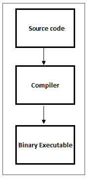
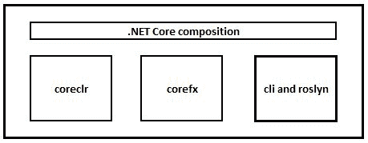

# 第一章：第 1 天 - .NET 框架概述

这是我们学习 C#的七天之旅的第一天。今天，我们将开始介绍一个新的编程世界，并讨论学习这种编程语言所需的所有基本概念。我们还将讨论.NET 框架和.NET Core 框架，涵盖框架的重要概念。我们还将对托管代码和非托管代码有一个基本的了解。在一天结束时，我们将开始一个简单的 Hello World 程序。

今天，我们将学习以下主题：

+   什么是编程？

+   什么是.NET Core？

+   .NET 标准是什么？

# 什么是编程？

可能有各种定义或各种思考来定义单词*编程*。在我看来，*编程是以一种机器（计算机）能够理解并描绘解决方案的方式编写解决方案，这是你可以手动识别的*。

例如，假设你有一个问题陈述：*找出这本书中元音字母的总数*。如果你想找到这个陈述的解决方案，你会怎么做？

解决这个问题的可能步骤如下：

1.  首先，找到正确的书。我假设你知道元音字母（*a*、*e*、*i*、*o*和*u*）。

1.  你在书中找到了多少个元音字母？--0（零）。

1.  打开当前页（最初，我们的当前页是 1），开始阅读以找到元音字母。

1.  如果字母匹配*a*、*e*、*i*、*o*或*u*（请注意大小写不重要，所以字母也可以是*A*、*E*、*I*、*O*和*U*），则增加一个元音计数。

1.  当前页完成了吗？

1.  如果第 5 步的答案是肯定的，那么检查这是否是书的最后一页：

+   如果是的话，那么我们手头就有了总的元音计数，也就是*n*，其中*n*是当前章节中找到的元音字母的总数。移动到第 8 步获取结果。

+   如果这不是最后一章，那么通过将当前章节编号加 1 来移动到下一章。所以，我们应该移动到 1 + 1 = 2（第二章）。

1.  在下一章中，重复第 4 到 6 步，直到到达书的最后一章。

1.  最后，我们有了总的元音计数，也就是*n*（*n*是找到的元音字母的总数）。

前面的步骤只是描述了我们如何找到问题陈述的完美解决方案。这些步骤展示了我们如何手动找到了书中所有章节中元音字母的总数的答案。

在编程世界中，这些步骤统称为*算法*。

算法只不过是通过定义一组规则来解决问题的过程。

当我们以一种机器/计算机能够遵循指令的方式编写前面的步骤/算法时，这就是编程。这些指令应该用机器/计算机能够理解的语言编写，这就是所谓的编程语言。

在本书中，我们将使用 C# 7.0 作为编程语言，.NET Core 作为框架。

# 什么是.NET？

当我们提到.NET（发音为点网），它是.NET 完整版，因为我们已经准备好了.NET Core，并且我们在书中的示例中使用了 C# 7.0 作为语言。在继续之前，你应该了解.NET，因为.NET Core 有一个.NET 标准，它是.NET 框架和.NET Core 的 API 服务器。因此，如果你使用.NET 标准创建了一个项目，它对.NET 框架和.NET Core 都是有效的。

.NET 只不过是一种语言、运行时和库的组合，我们可以使用它来开发托管软件/应用程序。在.NET 中编写的软件是托管的，或者处于托管环境中。要理解托管，我们需要深入了解操作系统如何获得二进制可执行文件。这包括三个更广泛的步骤：

1.  编写代码（源代码）。

1.  编译器编译源代码。

1.  操作系统立即执行二进制可执行文件：

更广泛的步骤——二进制可执行文件是如何获得的？

上述过程是一个标准过程，描述了编译器如何编译源代码并创建可执行二进制文件，但在.NET 的情况下，编译器（我们代码的 C#编译器）并不直接提供二进制可执行文件；它提供一个程序集，这个程序集包含元数据和中间语言代码，也称为**Microsoft 中间语言**（**MSIL**）或**中间语言**（**IL**）。这个 MSIL 是一种高级语言，机器无法直接理解，因为 MSIL 不是特定于机器的代码或字节码。为了正确执行，它应该被解释。这种从 MSIL 或 IL 到机器语言的解释是通过 JIT 的帮助发生的。换句话说，JIT 将 MSIL、IL 编译成机器语言，也称为本机代码。更多信息，请参阅[`msdn.microsoft.com/en-us/library/ht8ecch6(v=vs.90).aspx`](https://msdn.microsoft.com/en-us/library/ht8ecch6(v=vs.90).aspx)。

对于 64 位编译，Microsoft 已经宣布了 RyuJIT（[`blogs.msdn.microsoft.com/dotnet/2014/02/27/ryujit-ctp2-getting-ready-for-prime-time/`](https://blogs.msdn.microsoft.com/dotnet/2014/02/27/ryujit-ctp2-getting-ready-for-prime-time/)）。在即将推出的版本中，32 位编译也将由 RyuJIT 处理（[`github.com/dotnet/announcements/issues/10`](https://github.com/dotnet/announcements/issues/10)）。之后，我们现在可以为 CoreCLR 拥有一个单一的代码库。

中间语言是一种高级的基于组件的汇编语言。

在我们的七天学习中，我们不会专注于框架，而是更加专注于使用.NET Core 的 C#语言。在接下来的章节中，我们将讨论.NET Core 的重要内容，以便在我们使用 C#程序时，了解我们的程序如何与操作系统交互。

# 什么是.NET Core？

.NET Core 是微软推出的新的通用开发环境，以满足跨平台的需求。.NET Core 支持 Windows、Linux 和 OSX。

.NET Core 是一个开源软件开发框架，采用 MIT 许可证发布，并由 Microsoft 和.NET 社区在 GitHub（[`github.com/dotnet/core`](https://github.com/dotnet/core)）存储库中进行维护。

# .NET Core 特性

以下是.NET Core 的一些重要特性，使.NET Core 成为软件开发中的重要进化步骤：

+   **跨平台**：目前，.NET Core 可以在 Windows、Linux 和 macOS 上运行；将来可能会有更多。更多信息请参阅路线图（[`github.com/dotnet/core/blob/master/roadmap.md`](https://github.com/dotnet/core/blob/master/roadmap.md)）。

+   **拥有易用的命令行工具**：您可以使用命令行工具来练习.NET Core。有关更多信息，请参阅 CLI 工具[`docs.microsoft.com/en-us/dotnet/articles/core/tools/index`](https://docs.microsoft.com/en-us/dotnet/articles/core/tools/index)。

+   **具有兼容性**：通过使用.NET 标准库，.NET Core 与.NET Frameworks、Xamarin 和 Mono 兼容。

+   **开源**：.NET Core 平台采用 MIT 许可证发布，是.NET 基金会项目（[`dotnetfoundation.org/`](https://dotnetfoundation.org/)）。

# 是什么构成了.NET Core？

.NET Core 是**coreclr**、**corefx**和**cli 和 roslyn**的组合。这些是.NET Core 组成的主要组件。

+   **Coreclr**：这是一个.NET 运行时，提供程序集加载、垃圾回收器等。您可以在 coreclr 上查看更多信息[`github.com/dotnet/coreclr`](https://github.com/dotnet/coreclr)。

+   **Corefx**：这是一个框架库；您可以在 corefx 上查看更多信息[`github.com/dotnet/corefx`](https://github.com/dotnet/corefx)。

+   **Cli：** 这只是一个命令行界面工具，roslyn 是语言编译器（在我们的案例中是 C#语言）。请参阅 cli（[`github.com/dotnet/cli`](https://github.com/dotnet/cli)）和 Roslyn 以获取更多信息，网址为[`github.com/dotnet/roslyn`](https://github.com/dotnet/roslyn)。

# 什么是.NET 标准？

.NET Standard 是一组 API，解决了在尝试编写跨平台应用程序时代码共享的问题。目前，微软正在努力使.NET Standard 2.0 变得更加流畅，并且所有人都将实施这些标准，即.NET Framework、.NET Core 和 Xamarin。通过使用.NET Standard（一组 API），您确保您的程序和类库将适用于所有目标.NET Framework 和.NET Core。换句话说，.NET Standard 将取代**可移植类库**（**PCL**）。有关更多信息，请参阅[`blogs.msdn.microsoft.com/dotnet/2016/09/26/introducing-net-standard/`](https://blogs.msdn.microsoft.com/dotnet/2016/09/26/introducing-net-standard/)。

.NET Standard 2.0 存储库位于[`github.com/dotnet/standard`](https://github.com/dotnet/standard)。

到目前为止，您已经了解了.NET Core 和其他一些有助于构建跨平台应用程序的内容。在接下来的章节中，我们将准备环境，以便开始学习使用 Visual Studio 2017（最好是社区版）的 C#语言。

# 可用的 C# IDE 和编辑器

**集成开发环境**（**IDE**）只是一种便利应用程序开发的软件。另一方面，编辑器基本上是用来添加/更新预定义或新内容的。当我们谈论 C#编辑器时，我们指的是一个帮助编写 C#程序的编辑器。一些编辑器带有许多附加组件或插件，并且可以编译或运行程序。

我们将使用 Visual Studio 2017 作为我们首选的 C# IDE；但是，您还可以选择其他一些 C# IDE 和编辑器：

1.  **Visual Studio Code:** VS Code 是一个编辑器，您可以从[`code.visualstudio.com/`](https://code.visualstudio.com/)开始下载。要开始使用 VS Code，您需要从[`marketplace.visualstudio.com/items?itemName=ms-vscode.csharp`](https://marketplace.visualstudio.com/items?itemName=ms-vscode.csharp)安装 C#扩展。

1.  **Cloud9:** 这是一个基于 Web 浏览器的 IDE。您可以通过在[`c9.io/signup`](https://c9.io/signup)注册免费开始使用它。

1.  **JetBrain Rider:** 这是 JetBrains 的跨平台 IDE。有关更多信息，请访问[`www.jetbrains.com/rider/`](https://www.jetbrains.com/rider/)。

1.  **Zeus IDE:** 这是一个专为 Windows 平台设计的 IDE。您可以从[`www.zeusedit.com/index.html`](https://www.zeusedit.com/index.html)开始使用 Zeus。

1.  **文本编辑器：** 这是您可以在不安装任何软件的情况下使用的方式；只需使用您选择的文本编辑器。我使用 Notepad++（[`notepad-plus-plus.org/download/v7.3.3.html`](https://notepad-plus-plus.org/download/v7.3.3.html)）和**命令行界面**（**CLI**）来构建代码。请参阅[`docs.microsoft.com/en-us/dotnet/articles/core/tools/`](https://docs.microsoft.com/en-us/dotnet/articles/core/tools/)了解有关如何使用 CLI 开始的更多信息。

可能会有更多的替代 IDE 和编辑器，但对我们来说它们并不重要。

# 设置环境

在本节中，我们将逐步了解如何在 Windows 10 上启动安装 Visual Studio 2017（最好是社区版）：

1.  转到[`www.visualstudio.com/downloads/`](https://www.visualstudio.com/downloads/)（您还可以从[`www.visualstudio.com/dev-essentials/`](https://www.visualstudio.com/dev-essentials/)获得 Dev Essentials 的好处）。

1.  下载 Visual Studio Community (https[://www.visualstudio.com/thank-you-downloading-visual-studio/?sku=Community&rel=15](https://www.visualstudio.com/thank-you-downloading-visual-studio/?sku=Community&rel=15)):

1.  开始 Visual Studio 设置。

1.  从工作负载中选择你想要安装的选项。对于我们的书籍，我们需要.NET 桌面开发和.NET Core：

1.  点击安装开始安装：

1.  安装完成后点击启动。

1.  使用你的 Live ID 注册 Visual Studio。

1.  选择 Visual C#作为你的开发设置。

1.  你会看到以下的起始页面：

我们已经准备好开始我们的第一步了。

# 实践练习

通过涵盖今天学习的概念来回答以下问题。

+   什么是编程？写下一个算法，从书籍《7 天学会 C#》的所有页面中找出元音字母的数量。

+   什么是.NET Core 和.NET Standard？

+   是什么让.NET Core 成为一种进化的软件？

# 回顾第一天

今天，我们向你介绍了.NET Core 和.NET Standard 的一些重要概念。你学会了编程世界中的程序和算法是什么。
