# 第二章：第二天 - 开始学习 C#

今天，我们是在七天学习系列的第二天。昨天，我们已经了解了.NET Core 及其重要方面的基本理解。今天，我们将讨论 C#编程语言。我们将从理解典型的 C#程序的基本概念开始，然后我们将开始涵盖保留关键字、类型和运算符等其他内容；在一天结束时，我们将能够在涵盖以下主题后编写完整的 C#程序：

+   介绍 C#

+   理解典型的 C#程序

+   C#保留关键字、类型和运算符概述

+   类型转换概述

+   理解语句

+   数组和字符串操作

+   结构与类

# C#简介

简而言之，C#（发音为*See-Sharp*）是由微软开发的一种编程语言。C#已获得**国际标准化组织**（**ISO**）和**欧洲计算机制造商协会**（**ECMA**）的批准。

这是官方网站上的定义（[`docs.microsoft.com/en-us/dotnet/csharp/tour-of-csharp/index`](https://docs.microsoft.com/en-us/dotnet/csharp/tour-of-csharp/index)）：

C#是一种简单、现代、面向对象和类型安全的编程语言。C#源自 C 系列语言，对于 C、C++、Java 和 JavaScript 程序员来说会立即感到熟悉。

C#语言被设计为遵守**公共语言基础设施**（**CLI**），这是我们在第一天讨论过的。

C#是最受欢迎的专业语言，原因如下：

+   它是一种面向对象的语言

+   它是面向组件的

+   它是一种结构化语言

+   使其最受欢迎的主要部分：这是.NET Framework 的一部分

+   它具有统一的类型系统，这意味着 C#语言的所有类型都继承自单一类型对象（这也被称为母类型）

+   它是构建坚固耐用的应用程序，如*垃圾回收*（在第一天讨论过）

+   它有能力处理程序中的未知问题，这被称为异常处理（我们将在第四天讨论异常处理）

+   强大的反射支持，可以实现动态编程（我们将在第四天讨论反射）

# C#语言的历史

C#语言是由*Anders Hejlsberg*及其团队开发的。语言名称受到了音乐符号*sharp*（*#*）的启发，该符号表示音符应该提高一个半音。

第一个发布的版本是 C# 1.0，于 2002 年 1 月推出，当前版本是 C# 7.0。

以下表格描述了 C#语言的所有版本。

| **C#版本** | **发布年份** | **描述** |
| --- | --- | --- |
| 1.0 | 2002 年 1 月 | 使用 Visual Studio 2002 - .NET Framework 1.0 |
| 1.2 | 2003 年 4 月 | 使用 Visual Studio 2003 - .NET Framework 1.1 |
| 2.0 | 2005 年 11 月 | 使用 Visual Studio 2005 - .NET Framework 2.0 |
| 3.0 | 2007 年 11 月 | Visual Studio 2008, Visual Studio 2010 - .NET Framework 3.0 和 3.5 |
| 4.0 | 2010 年 4 月 | Visual Studio 2010 - .NET Framework 4 |
| 5.0 | 2012 年 8 月 | Visual Studio 2012, 2013 - .NET Framework 4.5 |
| 6.0 | 2015 年 7 月 | Visual Studio 2015 - .NET Framework 4.6 |
| C# 7.0 | 2017 年 3 月 | Visual Studio 2017 - .NET Framework 4.6.2 |
| C# 7.1 | 2017 年 8 月 | Visual Studio 2017 更新 3 - .NET Framework 4.7 |

在接下来的部分中，我们将详细讨论这种语言，包括代码示例。我们将讨论 C#语言的关键字、类型、运算符等。

# 理解典型的 C#程序

在我们开始用 C#编写程序之前，让我们先回到第一天，我们在那里讨论了各种有助于使用 C#语言编写程序/应用程序的集成开发环境和编辑器。回顾第一天，了解各种编辑器和 IDE，并检查为什么我们应该选择其中之一。我们将在本书的所有示例中使用 Visual Studio 2017 更新 3。

要了解安装 Visual Studio 2017 的步骤，请参阅[`docs.microsoft.com/en-us/visualstudio/install/install-visual-studio`](https://docs.microsoft.com/en-us/visualstudio/install/install-visual-studio)。

要开始一个简单的 C#程序（我们将创建一个控制台应用程序），请按照以下步骤进行：

1.  启动你的 Visual Studio。

1.  转到文件 | 新建 | 项目（或*ctrl* +*Shift* + *N*）。

1.  在 Visual C#节点下，选择.NET Core，然后选择控制台应用程序。

1.  给你的程序取一个名字，比如`Day02`，然后点击确定（见下图中的突出显示的文本）：

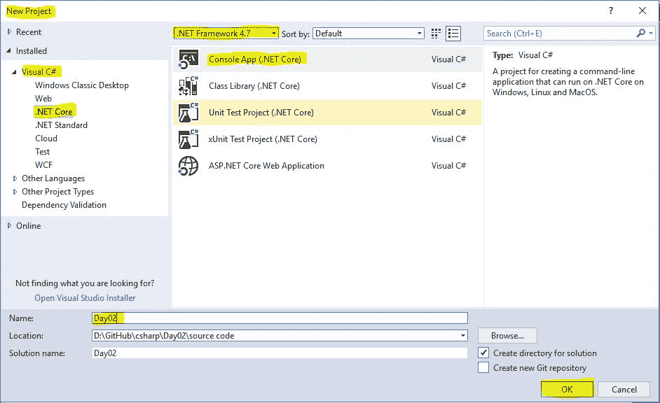

你将在`Program.cs`类中得到以下代码-这是 Visual Studio 提供的默认代码；你可以根据需要进行修改：

```cs
using System; 

namespace Day02 
{ 
class Program 
    { 
     static void Main(string[] args) 
        { 
         Console.WriteLine("Hello World!"); 
        } 
    } 
} 
```

通过在键盘上按下*F5*键，您将以 Debug 模式运行程序。

通常，每个程序都有两种不同的配置或模式，即 Debug 和 Release。在 Debug 模式下，将加载所有编译文件和符号，这些对于在应用程序执行过程中遇到的任何问题进行深入分析是有帮助的。另一方面，Release 是一种干净的运行，只有没有 Debug 符号的二进制文件加载并执行操作。有关更多信息，请参阅[`stackoverflow.com/questions/933739/what-is-the-difference-between-release-and-debug-modes-in-visual-studio`](https://stackoverflow.com/questions/933739/what-is-the-difference-between-release-and-debug-modes-in-visual-studio)。

当程序运行时，您将看到以下输出：


在继续之前，让我们分析一下在 Visual Studio 上的控制台应用程序的下图：

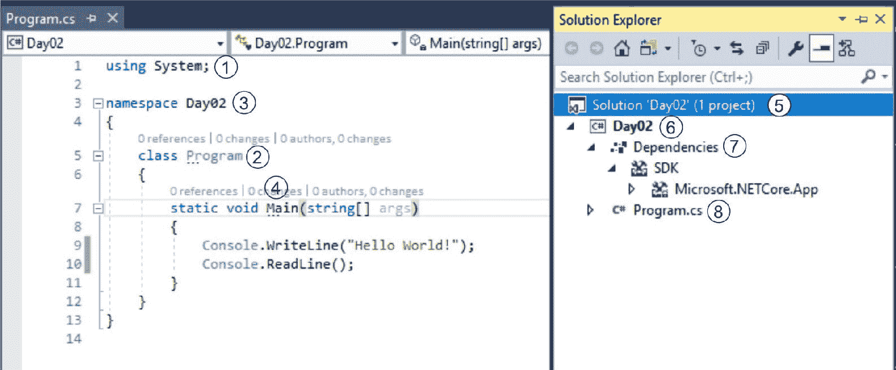

上述图示了一个典型的 C#程序；我们使用的是 Visual Studio，但控制台程序在不同的 IDE 或编辑器中保持不变。让我们更详细地讨论一下。

# 1（System）

这是我们在程序/应用程序中定义要使用的命名空间的地方。通常，这被称为使用语句，其中包括外部、内部或任何其他命名空间的使用。

System 是一个包含许多基本类的典型命名空间。有关更多信息，请参阅[`docs.microsoft.com/en-us/dotnet/api/system?view=netcore-2.0`](https://docs.microsoft.com/en-us/dotnet/api/system?view=netcore-2.0)。

# 3（Day02）

这是我们现有控制台应用程序的命名空间。

命名空间是将一组名称与另一组名称分开的一种方式，这意味着您可以创建尽可能多的命名空间，而不同命名空间下的类将被视为不同的，尽管它们具有相同的名称；也就是说，如果在`namespace Day02`中声明了一个`ClassExample`类，它将与在`Day02New` `namespace`中声明的`ClassExample`类不同，并且将在没有任何冲突的情况下工作。

这是一个典型的示例，显示了同名的两个类，它们有两个不同的`namespaces`：

```cs
namespace Day02 
{ 
public class ClassExample 
    { 
public void Display() 
        { 
Console.WriteLine("This is a class 'ClassExample' of namespace 'Day02'. "); 
        } 
    } 
} 

namespace Day02New 
{ 

public class ClassExample 
    { 
public void Display() 
        { 
Console.WriteLine("This is a class 'ClassExample' of namespace 'Day02New'. "); 
        } 
    } 
} 
```

上述代码将被调用如下：

```cs
private static void SameClassDifferentNamespacesExample() 
{ 
var class1 = new ClassExample(); 
var class2 = new Day02New.ClassExample(); 
    class1.Display(); 
    class2.Display(); 
} 
```

这将返回以下输出：


# 2（Program）

这是在命名空间-day two 中定义的类名。

C#中的类是对象的蓝图。对象是类的动态创建实例。在我们的控制台程序中，我们有一个包含名为`Main`的方法的程序类。

# 4（Main）

这是我们程序的入口点。对于我们的 C#程序，至少需要一个`Main`方法，并且它应该是静态的。我们将在接下来的部分“C#保留关键字概述”中详细讨论*static*。`Main`也是一个保留关键字。

入口是让 CLR 知道 DLL 中函数的*何时*和*何地*的方式。例如，每当我们运行我们的控制台应用程序时，它告诉 CLR`Main`是入口点，以及周围的一切。有关更多详细信息，请参阅[`docs.microsoft.com/en-us/dotnet/framework/interop/specifying-an-entry-point`](https://docs.microsoft.com/en-us/dotnet/framework/interop/specifying-an-entry-point)和[`docs.microsoft.com/en-us/dotnet/framework/interop/specifying-an-entry-point`](https://docs.microsoft.com/en-us/dotnet/framework/interop/specifying-an-entry-point)。

# 5（Day02）

这是我们控制台应用程序的解决方案的名称。

一个解决方案可以包含许多库、应用程序、项目等。例如，我们的解决方案 Day02 将包含另一个名为 Day03 或 Day04 的项目。我们控制台应用程序的 Visual Studio 解决方案文件名是`Day02.sln`。

请参考[`stackoverflow.com/questions/30601187/what-is-a-solution-in-visual-studio`](https://stackoverflow.com/questions/30601187/what-is-a-solution-in-visual-studio)以了解 Visual Studio 解决方案。

要查看解决方案文件，请打开`Day02.sln`解决方案文件所在的文件夹。您可以直接使用任何文本编辑器/记事本打开此文件。我使用 Notepad++ ([`notepad-plus-plus.org/`](https://notepad-plus-plus.org/))来查看解决方案文件。

以下截图描述了我们的解决方案文件：

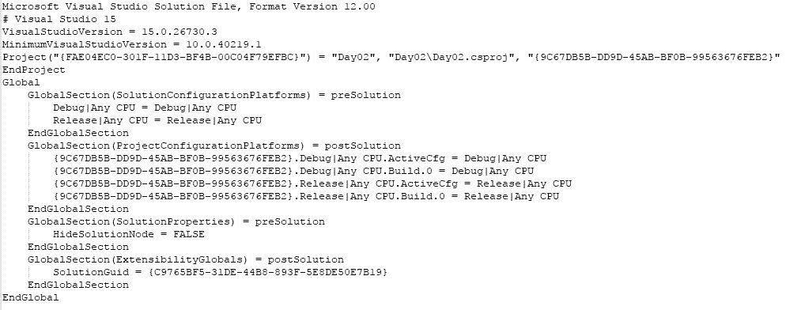

# 6（Day02）

这是我们控制台应用程序的一个项目。

一个项目是一个包，其中包含了程序所需的一切。这是官方网站上对项目的定义：[`docs.microsoft.com/en-us/visualstudio/ide/solutions-and-projects-in-visual-studio`](https://docs.microsoft.com/en-us/visualstudio/ide/solutions-and-projects-in-visual-studio)

在逻辑上和文件系统中，一个项目包含在一个解决方案中，该解决方案可能包含一个或多个项目，以及构建信息、Visual Studio 窗口设置和与任何项目无关的任何杂项文件。从字面上讲，解决方案是一个具有自己独特格式的文本文件；通常不打算手动编辑。

我们的项目文件名是`Day02.csproj`。

您不需要为您的应用程序创建一个项目。您可以直接开始在您的 C#文件上工作。

以下截图描述了我们的项目文件：

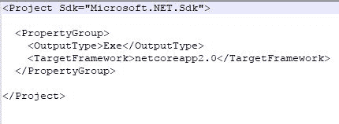

# 7（依赖项）

这指的是运行特定应用程序所需的所有引用和二进制文件。

依赖项是我们的应用程序依赖的程序集或 dll，或者我们的应用程序正在使用所引用程序集的函数。例如，我们的控制台应用程序需要.NET Core 2.0 SDK，因此将其包含为依赖项。请参阅以下截图：


# 8（Program.cs）

这是物理类文件名。

这是一个在我们的磁盘驱动器上物理可用的类文件的名称。类名和文件名可以不同，这意味着如果我的类名是`Program`，那么我的类文件名可以是`Program1.cs`。然而，用不同的名称来命名类和文件名是不好的做法，但你可以这样做，编译器不会抛出任何异常。有关更多信息，请参阅[`stackoverflow.com/questions/2224653/c-sharp-cs-file-name-and-class-name-need-to-be-matched`](https://stackoverflow.com/questions/2224653/c-sharp-cs-file-name-and-class-name-need-to-be-matched)。

# 使用 Visual Studio 深入了解应用程序

在前一节中，您了解了我们的控制台应用程序可以包含的各种内容。在本节中，让我们通过使用 Visual Studio 进行更深入的了解。

要开始，请转到项目属性。从解决方案资源管理器中进行此操作（右键单击项目，然后单击“属性”），或者从菜单中进行此操作（项目 | Day02 属性）；您将获得项目属性窗口，如下截图所示：

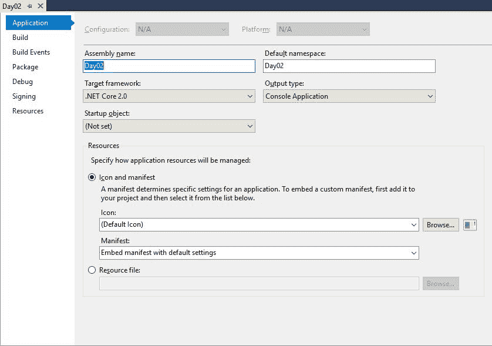

在应用程序选项卡上，我们可以设置程序集名称、默认命名空间、目标框架和输出类型（输出类型为`控制台应用程序`、`Windows 应用程序`、`类库`）。

以下截图是构建选项卡的截图：

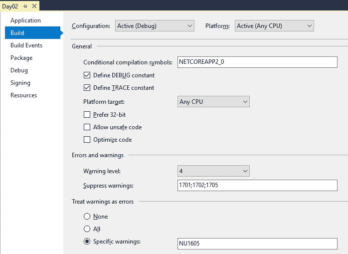

从构建选项卡中，我们可以设置条件编译符号、平台目标和其他可用选项。

条件编译就是预处理器，我们将在第六天讨论。

以下截图显示了包选项卡：


包选项卡帮助我们直接创建 NuGet 包。在早期版本中，我们需要大量配置设置来构建 NuGet 包。在当前版本中，我们只需要在包选项卡上提供信息，Visual Studio 将根据我们的选项生成 NuGet 包。调试选项卡、签名和资源选项卡都是不言自明的，并为我们提供了一种签署程序集和支持在程序中嵌入资源的方法。

# 讨论代码

我们已经讨论了控制台应用程序，并讨论了典型控制台应用程序包含的内容以及如何使用 Visual Studio 设置各种内容。现在让我们讨论我们在上一节“理解典型的 C#程序”中编写的代码。

`Console`是`System`命名空间的静态类，不能被继承。

在上述代码中，我们指示程序使用`WriteLine()`方法向控制台输出一些内容。

`Console`类的官方定义如下（[`docs.microsoft.com/en-us/dotnet/api/system.console?view=netcore-2.0`](https://docs.microsoft.com/en-us/dotnet/api/system.console?view=netcore-2.0)）：

表示控制台应用程序的标准输入、输出和错误流。此类不能被继承。

`Console`只是操作系统的终端窗口（也称为**控制台用户界面**（**CUI**））与用户交互。Windows 操作系统有控制台，即接受 MS-DOS 命令的命令提示符。`Console`类提供了基本支持来实现这一点。

以下是我们可以在控制台上执行的一些重要操作。

# 颜色

可以使用设置器和获取器属性来更改控制台背景和/或前景颜色，这些属性接受`ConsoleColor`枚举的值。有一个`Reset`方法可以将其设置为默认颜色。让我们使用以下代码演示所有颜色组合：

```cs
private static (int, int) DisplayColorMenu(ConsoleColor[] colors) 
{ 
var count = 0; 

foreach (var color in colors) 
    { 
        WriteLine($"{count}{color}"); 
        count += 1; 
    } 
WriteLine($"{count + 1} Reset"); 
WriteLine($"{count + 2} Exit"); 

Write("Choose Foreground color:"); 
var foreground = Convert.ToInt32(ReadLine()); 
Write("Choose Background color:"); 
var background = Convert.ToInt32(ReadLine()); 

return new ValueTuple<int, int>(background, foreground); 
} 
```

上述代码是来自 GitHub 存储库中可用的完整源代码的一部分。完整的代码将提供以下输出：

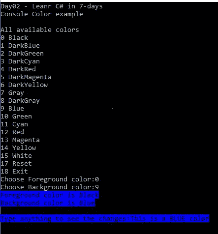

# 蜂鸣

`Beep`是通过控制台扬声器生成系统声音的方法。以下是最简单的示例：

```cs
private static void ConsoleBeepExample() 
{ 
for (int i = 0; i &lt; 9; i++) 
Beep(); 
} 
```

在控制台应用程序中，还有一些有用的方法。有关这些方法的更多详细信息，请参阅[`docs.microsoft.com/en-us/dotnet/api/system.console?view=netcore-2.0`](https://docs.microsoft.com/en-us/dotnet/api/system.console?view=netcore-2.0)。

到目前为止，我们已经使用 Visual Studio 2017 的代码示例讨论了典型的 C#程序；我们已经讨论了控制台程序的各个部分。您可以再次查看本节，或者继续阅读。

# C#保留关键字、类型和运算符概述

保留关键字只是编译器的预定义单词，具有特殊含义。除非您明确告诉编译器该单词不是为编译器保留的，否则不能将这些保留关键字用作普通文本或标识符。

在 C#中，您可以通过在保留关键字前加上`@`符号来将其用作普通单词。

C#关键字分为以下几类：

+   **类型**：在 C#中，类型系统分为值类型、引用类型和指针类型。

+   **修饰符**：从其名称就可以自解释，修饰符用于修改特定类型的声明和成员。

+   **语句关键字**：这些是按顺序执行的编程指令。

+   **方法参数**：这些可以声明为值类型或引用类型，并且可以使用**out**或**ref**关键字传递值。

+   **命名空间关键字**：这些是属于命名空间的关键字。

+   **运算符关键字**：这些运算符通常用于执行各种操作，例如类型检查，获取对象的大小等。

+   **转换关键字**：这些是`explicit`、`implicit`和`operator`关键字，将在接下来的部分中讨论。

+   **访问关键字**：这些是帮助从属于其父类或自身的类中访问事物的常见关键字。这些关键字是`this`和`base`。

+   **文字关键字**：关键字具有一些用于赋值的值，即`null`、`true`、`false`和`default`。

+   **上下文关键字**：这些在代码中具有特定含义。这些是 C#中未保留的特殊关键字。

+   **查询关键字**：这些是可以在查询表达式中使用的上下文关键字，例如，`from`关键字可以用于 LINQ。

在接下来的部分中，我们将使用代码示例更详细地讨论 C#关键字。

# 标识符

这些关键字在 C#程序的任何部分中使用，并且是保留的。标识符是特殊关键字，编译器对其进行不同处理。

这些是 C#保留的标识符：

+   **abstract**：这告诉您带有抽象修饰符的事物尚未完成或缺少定义。我们将在第四天详细讨论这个。

+   **as**：这可以用于转换操作。换句话说，我们可以说这检查两种类型之间的兼容性。

`as`关键字属于运算符类别的关键字；参考[`docs.microsoft.com/en-us/dotnet/csharp/language-reference/keywords/operator-keywords`](https://docs.microsoft.com/en-us/dotnet/csharp/language-reference/keywords/operator-keywords)。

```cs
as identifier:
```

```cs
public class Stackholder 
{ 
public void GetAuthorName(Person person) 
    { 
var authorName = person as Author; 
Console.WriteLine(authorName != null ? $"Author is {authorName.Name}" :"No author."); 
    } 

} 

//Rest code is omitted 
as operator, it is called by the following code:
```

```cs
private static void ExampleIsAsOperator() 
{ 
WriteLine("isas Operator"); 
var author = new Author{Name = "Gaurav Aroraa"}; 

WriteLine("Author name using as:\n"); 
stackholder.GetAuthorName(author); 

} 
```

这将产生以下结果：


+   **base**：这是访问关键字，用于从派生类内部访问父类的成员。以下是显示`base`关键字用法的代码片段。有关更多信息，请参阅[`docs.microsoft.com/en-us/dotnet/csharp/language-reference/keywords/base`](https://docs.microsoft.com/en-us/dotnet/csharp/language-reference/keywords/base)

```cs
public class TeamMember :Person 
{ 
public override string Name { get; set; } 
public void GetMemberName() 
    { 
     Console.WriteLine($"Member name:{Name}"); 
    } 
} 

public class ContentMember :TeamMember 
{ 
public ContentMember(string name) 
    { 
     base.Name = name; 
    } 
public void GetContentMemberName() 
    { 
     base.GetMemberName(); 
    } 
} 
```

这是一个用于展示`base`功能的非常简单的示例。在这里，我们只是使用基类成员和方法来获得预期的输出：

+   **bool**：这是`structureSystem.Boolean`的别名，有助于声明变量。它有两个值：true 或 false。我们将在即将到来的部分*数据类型*中详细讨论这个。

+   **break**：这个关键字很容易理解；它中断特定代码执行中的某些内容，可以是流程语句（`for`循环）或代码块的终止（`switch`）。我们将在循环和语句的即将到来的部分详细讨论这个。

+   **byte**：这有助于声明无符号整数的变量。这是`System.Byte`的别名。我们将在即将到来的部分详细讨论这个。

+   **案例**：这与`Switch`语句一起使用，然后根据某些条件执行代码块。我们将在第三天讨论`switch`案例。

+   **catch**：这个关键字是异常处理块的 catch 块，即`try`..`catch`..`finally`。我们将在第六天详细讨论异常处理。

+   **char**：当我们声明一个变量来存储属于结构`System.Char`的字符时，这个关键字很有用。我们将在数据类型部分详细讨论这个。

+   **checked**：有时，您的程序可能会遇到溢出值。溢出异常意味着您分配了一个比被分配数据类型的最大值还要大的值。编译器会引发溢出异常，程序终止。关键字 checks 强制编译器确保在编译器忽略的情况下不会发生溢出。为了更好地理解这一点，请看下面的代码片段：

```cs
int sumWillthrowError = 2147483647 + 19; //compile time error
```

这将生成一个编译时错误。一旦您写下前面的语句，您将得到以下错误：


以下代码片段是一个修改后的代码，如前图所示。通过这种修改，新代码将不会生成编译时错误：

```cs
Private static void CheckOverFlowExample()
{
var maxValue = int.MaxValue;
var addSugar = 19;
var sumWillNotThrowError = maxValue + addSugar;
WriteLine($"sum value:{sumWillNotThrowError} is not the correct value because it is larger than {maxValue}.");
} 
```

前面的代码永远不会引发溢出异常，但它不会给出正确的总和；它会给出-2147483647 作为`2147483647` + 19 的结果，因为实际总和将超过整数的最大正值，即`2147483647`。它将产生以下输出：


在现实世界的程序中，我们不能冒错计算的风险。我们应该使用 checked 关键字来克服这种情况。让我们使用 checked 关键字重写前面的代码：

```cs
private static void CheckOverFlowExample() 
{ 
const int maxValue = int.MaxValue; 
const int addSugar = 19; 
var sumWillNotThrowError = checked(maxValue+addSugar); //compile time error 
WriteLine( 
$"sum value:{sumWillNotThrowError} is not the correct value because it is larger than {maxValue}."); 
} 
```

一旦您使用 checked 关键字编写代码，您将看到以下编译时错误：


现在让我们讨论 C#的更多关键字：

+   **class**：这个关键字帮助我们声明类。C#类将包含成员、方法、变量、字段等（我们将在第四天详细讨论这些）。类与结构不同；我们将在*类与结构*部分详细讨论这个。

+   **const**：这个关键字帮助我们声明常量字段或常量局部变量。我们将在第三天详细讨论这个。

+   **continue**：这个关键字是`break`的对手。它将控制传递给流程语句中的下一次迭代，即`while`、`do`、`for`和`foreach`。我们将在接下来的部分详细讨论这个。

+   **decimal**：这有助于我们声明一个 128 位的数据类型。我们将在*数据类型*部分详细讨论这个。

+   **default**：这是告诉我们`switch`语句中的默认条件的关键字。我们也可以使用默认作为文字来获取默认值；我们将在第三天讨论这个。

+   **delegate**：这有助于声明类似于方法签名的委托类型。我们将在第六天详细讨论这个。

+   **do**：这会重复执行一个语句，直到满足假的表达式条件。我们将在接下来的部分讨论这个。

+   **double**：这有助于声明简单的 64 位浮点值。我们将在接下来的部分详细讨论这个。

+   **else**：这与`if`语句一起，并执行不符合`if`条件的`code`语句。我们将在接下来的部分详细讨论这个。

+   **enum**：这有助于创建枚举。我们将在第四天讨论这个。

+   **event**：这有助于在发布者类中声明事件。我们将在第六天详细讨论这个。

+   **explicit**：这是转换关键字之一。此关键字声明用户定义的类型转换运算符。我们将在接下来的部分详细讨论这个。

+   **false**：布尔值表示`false`条件，`result`或`Operator`。我们将在接下来的部分详细讨论这个。

+   **finally**：这是异常处理块的一部分。最终，块总是被执行。我们将在第四天详细讨论这个。

+   **fixed**：这在不安全的代码中使用，有助于防止 GC 分配或重定位。我们将在第六天详细讨论这个。

+   **float**：这是一个简单的数据类型，用于存储 32 位浮点值。我们将在接下来的部分详细讨论这个。

+   对于：`for`关键字是流程语句的一部分。通过使用`for`循环，可以重复运行一个语句，直到达到特定的表达式。我们将在接下来的章节中详细讨论这个问题。

+   对于每个：这也是一个流程语句，但它只适用于集合或数组的元素。可以使用`goto`、`return`、`break`和`throw`关键字退出。我们将在接下来的章节中详细讨论这个问题。

+   转到：这将通过标签将控制转移到另一个部分。在 C#中，goto 通常与`switch..case`语句一起使用。我们将在接下来的章节中详细讨论这个问题。

+   如果：这是一个条件语句关键字。它通常与`if...else`语句一起使用。我们将在接下来的章节中详细讨论。

+   隐式：类似于显式关键字，这有助于声明隐式用户定义的转换。我们将在接下来的章节中详细讨论这个问题。

+   在：一个关键字，有助于检测我们需要在`foreach`循环中迭代的集合。我们将在接下来的章节中详细讨论这个问题。

+   整数：这是结构`System.Int32`的别名，是一个存储有符号 32 位整数值的数据类型。我们将在接下来的章节中详细讨论这个问题。

+   接口：这个关键字有助于声明一个只能包含方法、属性、事件和索引器的接口（我们将在第四天讨论这个问题）。

+   内部：这是一个访问修饰符。我们将在第四天详细讨论。

+   是：类似于`as`操作符，`is`也是一个关键字操作符。

+   这是一个显示`is`操作符的代码示例：

```cs
public void GetStackholdersname(Person person) 
{ 
if (person is Author) 
    { 
     Console.WriteLine($"Author name:{((Author)person).Name}"); 
    } 
elseif (person is Reviewer) 
    { 
     Console.WriteLine($"Reviewer name:{((Reviewer)person).Name}"); 
    } 
elseif(person is TeamMember) 
    { 
     Console.WriteLine($"Member name:{((TeamMember)person).Name}"); 
    } 
else 
    { 
     Console.Write("Not a valid name."); 
    } 

} 
```

有关`is`和`as`操作符的完整解释，请参阅[`goo.gl/4n73JC`](https://goo.gl/4n73JC)。

+   锁定：这表示代码块的临界区。通过使用`lock`关键字，我们将获得对象的互斥锁，并在语句执行后释放。这通常与线程一起使用。线程超出了本书的范围。有关更多详细信息，请参阅[`docs.microsoft.com/en-us/dotnet/csharp/language-reference/keywords/lock-statement`](https://docs.microsoft.com/en-us/dotnet/csharp/language-reference/keywords/lock-statement)和[`docs.microsoft.com/en-us/dotnet/csharp/programming-guide/concepts/threading/index`](https://docs.microsoft.com/en-us/dotnet/csharp/programming-guide/concepts/threading/index)。

+   长：这有助于声明变量来存储有符号的 64 位整数值，并且它指的是结构`System.Int64`。我们将在接下来的章节中详细讨论这个问题。

+   命名空间：这有助于定义声明一组相关对象的命名空间。我们将在第四天详细讨论这个问题。

+   新：`new`关键字可以是操作符、修饰符或约束。我们将在第四天详细讨论这个问题。

+   空：这表示空引用。它不指向任何对象。引用类型的默认值是 null。在使用可空类型时很有帮助。

+   对象：这是`System.Object`的别名，在.NET 世界中是通用类型。它接受任何数据类型而不是 null。

+   操作符：这有助于重载内置操作符。我们将在接下来的章节中详细讨论这个问题。

+   输出：这是一个上下文关键字，将在第四天详细讨论。

+   覆盖：这个关键字有助于覆盖或扩展抽象或虚拟成员、方法、属性、索引器或事件的实现。我们将在第四天详细讨论这个问题。

+   参数：这有助于使用可变数量的参数定义方法参数。我们将在第四天详细讨论这个问题。

+   私人：这是一个访问修饰符，将在第四天讨论。

+   受保护的：这是一个访问修饰符，将在第四天讨论。

+   公共：这是一个访问修饰符，设置了整个应用程序的可用性，将在第四天讨论。

+   **readonly**：这有助于我们将字段声明为只读。我们将在第四天详细讨论这个问题。

+   **ref**：这有助于通过引用传递值。我们将在第四天详细讨论这个问题。

+   **return**：这有助于终止方法的执行，并返回给调用方法的结果。我们将在第四天详细讨论这个问题。

+   **sbyte**：这表示`System.SByte`并存储带符号的 8 位整数值。我们将在接下来的部分中详细讨论这个问题。

+   **sealed**：这是一个修饰符，防止进一步使用/扩展。我们将在第四天详细讨论这个问题。

+   **短**：这表示`System.Int16`并存储带符号的 16 位整数值。我们将在接下来的部分中详细讨论这个问题。

+   **sizeof**：这有助于获取内置类型和/或不受管理类型的字节大小。对于不受管理和除内置数据类型之外的所有其他类型，需要使用`unsafe`关键字。

+   以下代码解释了使用内置类型的`sizeof`：

```cs
private static void SizeofExample() 
{ 
WriteLine("Various inbuilt types have size as mentioned below:\n"); 
WriteLine($"The size of data type int is: {sizeof(int)}"); 
WriteLine($"The size of data type long is: {sizeof(long)}"); 
WriteLine($"The size of data type double is: {sizeof(double)}"); 
WriteLine($"The size of data type bool is: {sizeof(bool)}"); 
WriteLine($"The size of data type short is: {sizeof(short)}"); 
WriteLine($"The size of data type byte is: {sizeof(byte)}"); 
} 
```

前面的代码产生了以下输出：

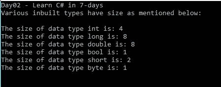

让我们讨论更多的 C#关键字；这些关键字在编写现实世界程序时非常重要，并在其中发挥着重要作用：

+   **static**：这有助于我们声明静态成员，并将在第四天详细讨论。

+   **字符串**：这有助于存储 Unicode 字符。这是一个引用类型。我们将在接下来的部分中更详细地讨论这个问题，**字符串**。

+   **结构**：这有助于我们声明一个`struct`类型。结构类型是一个值类型。我们将在接下来的部分中更详细地讨论这个问题，*类与结构*。

+   **switch**：这有助于声明一个`switch`语句。Switch 是一个选择语句，我们将在第三天讨论它。

+   **this**：这个`this`关键字帮助我们访问当前类实例的成员。它也是一个修饰符，我们将在第四天讨论。请注意，`this`关键字对于`extension`方法有特殊含义。扩展方法超出了本书的范围；有关更多详细信息，请参阅[`docs.microsoft.com/en-us/dotnet/csharp/programming-guide/classes-and-structs/extension-methods`](https://docs.microsoft.com/en-us/dotnet/csharp/programming-guide/classes-and-structs/extension-methods)。

+   **throw**：这有助于抛出系统或自定义异常。我们将在第六天详细讨论这个问题。

+   **true**：与 false 类似，我们之前讨论过这个问题。它表示一个布尔值，可以是文字或操作符。我们将在接下来的部分中更详细地讨论这个问题。

+   **try**：这表示异常处理的`try`块。Try 块是帮助处理任何不可避免的错误或程序实例的另外三个块之一。所有三个块共同称为异常处理块。try 块总是首先出现。这个块包含可能引发异常的代码。我们将在第六天详细讨论这个问题。

+   **typeof**：这有助于获取所需类型的类型对象。此外，在运行时，您可以使用`GetType()`方法获取对象的类型。

以下代码片段显示了`typeof()`方法的运行情况：

```cs
private static void TypeofExample() 
{ 
var thisIsADouble = 30.3D; 
WriteLine("using typeof()"); 
WriteLine($"System.Type Object of {nameof(Program)} is {typeof(Program)}\n"); 
var objProgram = newProgram(); 
WriteLine("using GetType()"); 
WriteLine($"Sytem.Type Object of {nameof(objProgram)} is {objProgram.GetType()}"); 
WriteLine($"Sytem.Type Object of {nameof(thisIsADouble)} is {thisIsADouble.GetType()}"); 
} 
```

前面的代码将生成以下结果：


这些是无符号数据类型，这些数据类型存储没有符号的值（*+*/*-*）：

+   **uint**：这有助于声明一个无符号 32 位整数的变量。我们将在接下来的部分中详细讨论这个问题。

+   **ulong**：这有助于声明一个无符号 65 位整数的变量。我们将在接下来的部分中详细讨论这个问题。

+   **unchecked**：这个关键字的作用与`checked`完全相反。使用`checked`关键字抛出编译时错误的代码块，使用`unchecked`关键字不会生成任何编译时异常。

让我们重写使用`checked`关键字编写的代码，并看看`unchecked`关键字如何与`checked`完全相反：

```cs
private static void CheckOverFlowExample() 
{ 
const int maxValue = int.MaxValue; 
const int addSugar = 19; 
//int sumWillthrowError = 2147483647 + 19; //compile time error 
var sumWillNotThrowError = unchecked(maxValue+addSugar); 
//var sumWillNotThrowError = checked(maxValue + addSugar); //compile time error 
WriteLine( 
$"sum value:{sumWillNotThrowError} is not the correct value because it is larger than {maxValue}."); 
} 
```

前面的代码将顺利运行，但会给出错误的结果，即*-2147483647*。

您可以通过参考[`docs.microsoft.com/en-us/dotnet/csharp/language-reference/keywords/checked`](https://docs.microsoft.com/en-us/dotnet/csharp/language-reference/keywords/checked)来了解有关 checked 和 unchecked 关键字的更多详细信息。

+   **unsafe**：这有助于执行通常使用指针的不安全代码块。我们将在第六天详细讨论这个问题。

+   **ushort**：这有助于声明一个无符号的 16 位整数变量。我们将在接下来的*数据类型*部分更详细地讨论这个问题。

+   使用：`using`关键字的作用类似于指令或语句。让我们考虑以下代码示例：

```cs
using System;
```

前面的指令提供了属于`System`命名空间的所有内容：

```cs
using static System.Console;
```

前面的指令帮助我们调用静态成员。在程序中包含了前面的指令后，我们可以直接调用静态成员、方法等，如下面的代码所示：

```cs
Console.WriteLine("This WriteLien is without using static directive");
WriteLine("This WriteLien is called after using static directive");
Console.WriteLine, but in the second statement, there is no need to write the class name, so we can directly call the WriteLine method.
IDisposable interface):
```

```cs
public class DisposableClass : IDisposable 
{ 
public string GetMessage() 
    { 
     return"This is from a Disposable class."; 
    } 
protected virtual void Dispose(bool disposing) 
    { 
     if (disposing) 
        { 
         //disposing code here 
        } 
    } 

public void Dispose() 
    { 
       Dispose(true); 
       GC.SuppressFinalize(this); 
    } 
} 
private static void UsingExample() 
{ 
using (var disposableClass = new DisposableClass()) 
    { 
     WriteLine($"{disposableClass.GetMessage()}"); 
    } 
} 
```

前面的代码产生以下输出：


C#关键字 virtual 和 void 有特殊含义：一个允许另一个覆盖它，而另一个在方法返回无内容时用作返回类型。让我们详细讨论这两个：

+   **virtual**：如果使用了 virtual 关键字，这意味着它允许在派生类中重写方法、属性、索引器或事件。我们将在第四天更详细地讨论这个问题。

+   **void**：这是`System.Void`类型的别名。当 void 用于方法时，意味着该方法没有任何返回类型。例如，看一下以下代码片段：

```cs
public void GetAuthorName(Person person) 
{ 
var authorName = person as Author; 
Console.WriteLine(authorName != null ? $"Author is {authorName.Name}" :"No author."); 
} 
getAuthorName() method is of void type; hence, it does not return anything.
```

+   **while**：While 是一个流程语句，执行特定的代码块，直到指定的表达式求值为 false。我们将在接下来的*流程语句*部分更详细地讨论这个问题。

# 上下文

这些不是保留关键字，但它们对程序的有限上下文有特殊含义，并且也可以在该上下文之外用作标识符。

这些是 C#的上下文关键字：

+   **add**：这用于定义自定义访问器，并在有人订阅事件时调用。`add`访问器总是后跟`remove`访问器，这意味着当我们提供`add`访问器时，应该应用`remove`访问器。有关更多信息，请参阅[`docs.microsoft.com/en-us/dotnet/csharp/programming-guide/events/how-to-implement-interface-events`](https://docs.microsoft.com/en-us/dotnet/csharp/programming-guide/events/how-to-implement-interface-events)。

+   **ascending/descending**：这个上下文关键字与`LINQ`语句中的`orderby`子句一起使用。我们将在第六天更详细地讨论这个问题。

+   **async**：这用于异步方法、lambda 表达式或匿名方法。要从异步方法中获取结果，需要使用`await`关键字。我们将在第六天更详细地讨论这个问题。

+   **dynamic**：这有助于我们绕过编译时类型检查。这会在运行时解析类型。

编译时类型是您用来定义变量的类型。运行时类型是指变量实际所属的类型。

让我们看一下以下代码，以更好地理解这些术语：

```cs
internal class Parent
{
//stuff goes here
}
internal class Child : Parent
{
//stuff goes here
}

```

我们可以这样创建子类的对象：

```cs
Parent myObject = new Child();
```

在这里，`myObject`的编译时类型是`Parent`，因为编译器知道变量是`Parent`类型，而不关心或知道我们用`Child`类型实例化了这个对象的事实。因此这是一个编译时类型。运行时类型是实际类型，在我们的例子中是`Child`。因此，我们的变量`myObject`的运行时类型是`Child`。

看一下以下代码片段：

```cs
private static void DynamicTypeExample() 
{ 
dynamic dynamicInt = 10; 
dynamic dynamicString = "This is a string"; 
object obj = 10; 
WriteLine($"Run-time type of {nameof(dynamicInt)} is {dynamicInt.GetType()}"); 
WriteLine($"Run-time type of {nameof(dynamicString)} is {dynamicString.GetType()}"); 
WriteLine($"Run-time type of {nameof(obj)} is {obj.GetType()}"); 

} 
```

上面的代码产生以下输出：


有关更多信息，请参阅：[`docs.microsoft.com/en-us/dotnet/csharp/language-reference/keywords/dynamic`](https://docs.microsoft.com/en-us/dotnet/csharp/language-reference/keywords/dynamic)。

这些是在查询表达式中使用的上下文关键字；让我们详细讨论这些关键字：

+   **from**：这在查询表达式中使用，将在第六天讨论。

+   **get**：这定义了访问器，并与属性一起用于检索值。我们将在第六天更详细地讨论这个问题。

+   **group**：这与查询表达式一起使用，并返回一系列`IGroupong<Tkey,TElement>`对象。我们将在第六天更详细地讨论这个问题。

+   **into**：这个标识符在处理查询表达式时帮助存储临时数据。我们将在第六天更详细地讨论这个问题。

有关上下文关键字的更多信息，请参阅[`docs.microsoft.com/en-us/dotnet/csharp/language-reference/keywords`](https://docs.microsoft.com/en-us/dotnet/csharp/language-reference/keywords)。

# 类型

在 C#中，7.0 类型也被称为数据类型和变量。这些被归类为以下更广泛的类别。

# 值类型

这些类型是从`System.ValueType`类派生的。值类型的变量直接包含它们的数据，或者简单地说，值类型变量可以直接赋值。值类型可以分为更多的子类别：数据类型、自定义类型（`Enum`类型和`Struct`类型）。在本节中，我们将详细讨论数据类型。`Enum`将在第四天讨论，结构将在接下来的章节中讨论。

# 数据类型

这些也被称为符合值类型、简单值类型和基本值类型。我称这些数据类型是因为它们定义值的性质。以下表包含所有值类型：

| **性质** | **类型** | **CLR 类型** | **范围** | **默认值** | **大小** |
| --- | --- | --- | --- | --- | --- |
| 签名整数 | sbyte | `System.SByte` | -128 到 127 | 0 | 8 位 |
|  | short | `System.Short` | -32,768 到 32,767 | 0 | 16 位 |
|  | int | `System.Int32` | -2,147,483,648 到 2,147,483,647 | 0 | 32 位 |
|  | long | `System.Int64` | -9,223,372,036,854,775,808 到 9,223,372,036,854,775,807 | 0L | 64 位 |
| 无符号整数 | byte | `System.Byte` | 0 到 255 | 0 | 8 位 |
|  | ushort | `System.UInt16` | 0 到 65,535 | 0 | 16 位 |
|  | uint | `System.UInt32` | 0 到 4,294,967,295 | 0 | 32 位 |
|  | ulong | `System.UInt64` | 0 到 18,446,744,073,709,551,615 | 0 | 64 位 |
| Unicode 字符 | char | `System.Char` | U +0000 到 U +ffff | '\0' | 16 位 |
| 浮点数 | float | `System.Float` | -3.4 x 10³⁸ 到 + 3.4 x 10³⁸ | 0.0F | 32 位 |
|  | double | `System.Double` | (+/-)5.0 x 10^(-324) 到 (+/-)1.7 x 10³⁰⁸ | 0.0D | 64 位 |
| 更高精度的十进制 | decimal | `System.Decimal` | (-7.9 x 1028 到 7.9 x 1028) / 100 到 28 | 0.0M | 128 位 |
| 布尔值 | bool | `System.Boolean` | 真或假 | 假 | 布尔值 |

我们可以通过以下代码片段证明前表中提到的值：

```cs
//Code is omitted 
public static void Display() 
{ 
WriteLine("Table :: Data Types"); 
var dataTypes = DataTypes(); 
WriteLine(RepeatIt('\u2500', 100)); 
WriteLine("{0,-10} {1,-20} {2,-50} {3,-5}", "Type", "CLR Type", "Range", "Default Value"); 
WriteLine(RepeatIt('\u2500', 100)); 
foreach (var dataType in dataTypes) 
WriteLine("{0,-10} {1,-20} {2,-50} {3,-5}", dataType.Type, dataType.CLRType, dataType.Range, 
dataType.DefaultValue); 
WriteLine(RepeatIt('\u2500', 100)); 
} 
//Code is omitted 
```

在上述代码中，我们显示了数据类型的最大值和最小值，产生了以下输出：

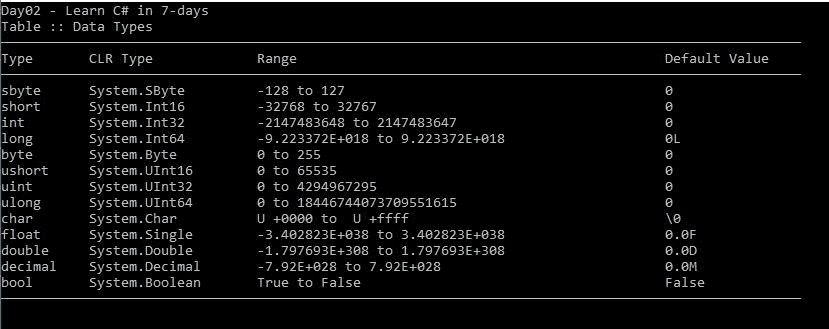

# 引用类型

实际数据并不存储在变量中，而是包含对变量的引用。简单地说，我们可以说引用类型是指向内存位置的引用。此外，多个变量可以引用一个内存位置，如果这些变量中的任何一个改变了该位置的数据，所有变量都将获得新值。以下是内置的引用类型：

+   **类类型**：包含成员、方法、属性等的数据结构。这也被称为对象类型，因为它继承了通用的`classSystem.Object`。在 C# 7.0 中，类类型支持单继承；我们将在第七天更详细地讨论这个问题。

对象类型可以被赋予任何其他类型的值；对象只是`System.Object`的别名。在这种情况下，其他类型指的是值类型、引用类型、预定义类型和用户定义类型。

有一个概念叫做`装箱`和`拆箱`，当我们处理对象类型时会发生。一般来说，当值类型转换为对象类型时，称为`装箱`，当对象类型转换为值类型时，称为`拆箱`。

看一下以下代码片段：

```cs
private static void BoxingUnboxingExample() 
{ 
int thisIsvalueTypeVariable = 786; 
object thisIsObjectTypeVariable = thisIsvalueTypeVariable; //Boxing 
thisIsvalueTypeVariable += 1; 
    WriteLine("Boxing"); 
WriteLine($"Before boxing: Value of {nameof(thisIsvalueTypeVariable)}: {thisIsvalueTypeVariable}"); 
WriteLine($"After boxing: Value of {nameof(thisIsObjectTypeVariable)}: {thisIsObjectTypeVariable}"); 

thisIsObjectTypeVariable = 1900; 
thisIsvalueTypeVariable = (int) thisIsObjectTypeVariable; //Unboxing 
    WriteLine("Unboxing"); 
WriteLine($"Before Unboxing: Value of {nameof(thisIsObjectTypeVariable)}: {thisIsObjectTypeVariable}"); 
WriteLine($"After Unboxing: Value of {nameof(thisIsvalueTypeVariable)}: {thisIsvalueTypeVariable}"); 
 }
thisIsvalueTypeVariable variable is assigned to an object thisIsObjectTypeVariable. On the other hand, unboxing happened when we cast object variable thisIsObjectTypeVariable to our value type thisIsvalueTypeVariable variable with int. This is the output of the code:
```


在这里，我们将讨论三种重要的类型，它们是接口、字符串和委托类型：

+   **接口类型**：这种类型基本上是一个合同，谁要使用它就必须实现它。一个类或结构体可以使用一个或多个接口类型。一个接口类型可以从多个其他接口类型继承。我们将在第七天更详细地讨论这个问题。

+   **委托类型**：这是一个表示参数列表中方法的引用的类型。众所周知，委托被称为函数指针（如 C++中定义）。委托是类型安全的。我们将在第四天详细讨论这个问题。

+   **字符串类型**：这是`System.String`的别名。这种类型允许你将任何字符串值赋给变量。我们将在接下来的章节中详细讨论这个问题。

# 指针类型

这种类型属于不安全的代码。定义为指针类型的变量存储另一个变量的内存地址。我们将在第六天详细讨论这个问题。

# 空类型

可空类型只是`System.Nullable<T>`结构的一个实例。可空类型包含与其`ValueType`相同的数据范围，但额外增加了一个空值。参考数据类型表，其中 int 的范围为 2147483648 到 2147483647，但`System.Nullable<int>`或`int`?具有相同的范围，另外还可以为 null。这意味着你可以这样做：`int? nullableNum = null;`。

有关可空类型的更多详细信息，请参阅[`docs.microsoft.com/en-us/dotnet/csharp/programming-guide/nullable-types/`](https://docs.microsoft.com/en-us/dotnet/csharp/programming-guide/nullable-types/)。

# 运算符

在 C#中，运算符只是告诉编译器执行特定操作的数学或逻辑运算符。例如，乘法(*)运算符告诉编译器进行乘法运算；另一方面，逻辑与(&&)运算符检查两个操作数。我们可以将 C#运算符分为更广泛的类型，如下表所示：

| 类型 | 运算符 | 描述 |
| --- | --- | --- |
| 算术运算符 | + | 添加两个操作数，例如，`var result = num1 +num2;` |
|  | - | 从第二个操作数中减去第一个操作数，例如，`var result = num1 - num2;` |
|  | * | 乘以两个操作数，例如，`var result = num1 * num2;` |
|  | / | 除以分子除以分母，例如，`var result = num1 / num2;` |
|  | % | 取模，例如，`result = num1 % num2;` |
|  | ++ | 增量运算符，将值增加 1，例如，`var result = num1++;` |
|  | -- | 递减运算符，将值减 1，例如，`var result = num1--;` |
| 关系运算符 | == | 确定两个操作数是否具有相同的值。如果表达式成功，则返回 True；否则返回 false，例如，`var result = num1 == num2;` |
|  | != | 执行与`==`相同的操作，但否定比较；如果两个操作数相等，则返回 false，例如，`var result = num1 != num2;` |
|  | > | 确定表达式中左操作数是否大于右操作数，并在成功时返回 True，例如，`var result = num1 > num2;` |
|  | < | 确定表达式中左操作数是否小于右操作数，并在成功时返回 true，例如，`var result = num1 < num2;` |
|  | >= | 确定表达式中左操作数的值是否大于或等于右操作数的值，并在成功时返回 true，例如，`var result = num1 <= num2;` |
|  | <= | 确定在表达式中，左操作数的值是否小于或等于右操作数的值，并在成功时返回 true，例如，`var result = num1 <= num2;` |
| 逻辑运算符 | && | 这是逻辑`AND`运算符。表达式根据左操作数进行评估；如果为 true，则右操作数不会被忽略，例如，`var result = num1 && num2;` |
|  | &#124;&#124; | 这是逻辑`OR`运算符。如果任一操作数为 true，则表达式求值为 true，例如，`var result = num1 &#124;&#124; num2;` |
|  | ! | 这被称为逻辑`NOT`运算符。它颠倒评估结果，例如，`var result = !(num1 && num2);` |
| 位运算符 | &#124; | 这是位`OR`运算符，作用于位。如果任一位为 1，则结果为 1，例如，`var result = num1 &#124; num2;` |
|  | & | 这是位`AND`运算符，作用于位。如果任一位为 0，则结果为 0；否则为 1，例如，`var result = num1 & num2;` |
|  | ^ | 这是位`XOR`运算符，作用于位。如果位相同，则结果为 0；否则为 1，例如，`var result = num1 ^ num2;` |
|  | ~ | 这是一元运算符，称为位`COMPLEMENT`运算符。它作用于单个操作数并颠倒位，这意味着如果位为 0，则返回 1，反之亦然，例如，`var result = ~num1;` |
|  | << | 这是位左移运算符，按表达式中指定的位数向左移动数字，并在最低有效位添加零，例如，`var result = num1 << 1;` |
|  | >> | 这是位右移运算符，按表达式中指定的位数向右移动数字，例如，`var result = num1 >> 1;` |
| 赋值运算符 | = | 将右侧操作数的值赋给左侧操作数的赋值运算符，例如，`var result = nim1 + num2;` |
|  | += | 加法赋值运算符；它将右操作数的值加上并赋给左操作数，例如，`result += num1;` |
|  | -= | 减法赋值运算符；它将右操作数的值减去并赋给左操作数，例如，`result -= num1;` |
|  | *= | 乘法赋值运算符；它将右操作数的值乘以并赋给左操作数，例如，`result *= num1;` |
|  | /= | 除法赋值运算符；它将右操作数的值除以并赋给左操作数，例如，`result /= num1;` |
|  | %= | 取模赋值运算符；它取左右操作数的模并赋给左操作数，例如，`result %= num1;` |
|  | <<= | 位左移和赋值，例如，`result <<= 2;` |
|  | >>;= | 位右移和赋值，例如，`result >>= 2;` |
|  | &= | 位`AND`和赋值运算符，例如，`result &= Num1;` |
|  | ^= | 位`XOR`和赋值运算符，例如，`result ^= num1;` |
|  | &#124;= | 位`OR`和赋值运算符，例如，`result &#124;= num1;` |

看一下以下代码片段，其中实现了先前讨论的所有运算符：

```cs
private void ArithmeticOperators() 
{ 
WriteLine("\nArithmetic operators\n"); 
WriteLine($"Operator '+' (add): {nameof(Num1)} + {nameof(Num2)} = {Num1 + Num2}"); 
WriteLine($"Operator '-' (substract): {nameof(Num1)} - {nameof(Num2)} = {Num1 - Num2}"); 
WriteLine($"Operator '*' (multiplication): {nameof(Num1)} * {nameof(Num2)} = {Num1 * Num2}"); 
WriteLine($"Operator '/' (division): {nameof(Num1)} / {nameof(Num2)} = {Num1 / Num2}"); 
WriteLine($"Operator '%' (modulus): {nameof(Num1)} % {nameof(Num2)} = {Num1 % Num2}"); 
WriteLine($"Operator '++' (incremental): pre-increment: ++{nameof(Num1)} = {++Num1}"); 
WriteLine($"Operator '++' (incremental): post-increment: {nameof(Num1)}++ = {Num1++}"); 
WriteLine($"Operator '--' (decremental): pre-decrement: --{nameof(Num2)} = {--Num2}"); 
WriteLine($"Operator '--' (decremental): post-decrement: {nameof(Num2)}-- = {Num2--}"); 
ReadLine(); 
} 
//Code omitted 
```

完整的代码可在 GitHub 存储库中找到，并且产生以下结果：

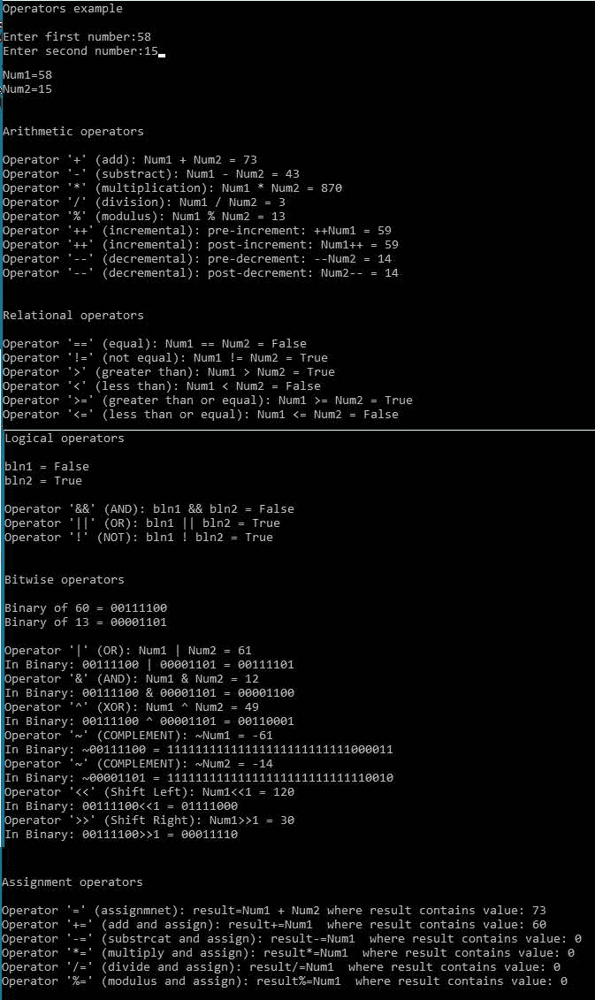

# 讨论 C#中的运算符优先级

任何表达式的计算或评估以及运算符的顺序都非常重要。这就是所谓的运算符优先级。我们都读过数学规则*BODMAS*，它是*括号、指数、乘除、加减*的缩写。请参考[`www.skillsyouneed.com/num/bodmas.html`](https://www.skillsyouneed.com/num/bodmas.html)来刷新您的记忆。因此，数学教会我们如何解决表达式；同样，我们的 C#应该遵循规则来解决或评估表达式。例如，*3+2*5*的计算结果是*13*而不是*25*。因此，在这个等式中，规则是先乘后加。这就是为什么它计算为*2*5 = 10*然后*3+10 = 13*。您可以通过应用括号来设置更高的优先级顺序，所以如果您在前面的语句中这样做*(3+2)*5*，结果是*25*。

要了解更多关于运算符优先级的信息，请参考[`msdn.microsoft.com/en-us/library/aa691323(VS.71).aspx`](https://msdn.microsoft.com/en-us/library/aa691323(VS.71).aspx)。

这是一个简单的代码片段来评估表达式：

```cs
private void OperatorPrecedence() 
{ 
Write("Enter first number:"); 
    Num1 = Convert.ToInt32(ReadLine()); 
Write("Enter second number:"); 
    Num2 = Convert.ToInt32(ReadLine()); 
Write("Enter third number:"); 
    Num3 = Convert.ToInt32(ReadLine()); 
Write("Enter fourth number:"); 
    Num4 = Convert.ToInt32(ReadLine()); 
int result = Num1 + Num2 * Num3/Num4; 
WriteLine($"Num1 + Num2 * Num3/Num4 = {result}"); 
    result = Num1 + Num2 * (Num3 / Num4); 
WriteLine($"Num1 + Num2 * (Num3/Num4) = {result}"); 
    result = (Num1 + (Num2 * Num3)) / Num4; 
WriteLine($"(Num1 + (Num2 * Num3)) /Num4 = {result}"); 
    result = (Num1 + Num2) * Num3 / Num4; 
WriteLine($"(Num1 + Num2) * Num3/Num4 = {result}"); 
ReadLine(); 
} 
```

上面的代码产生了以下结果：

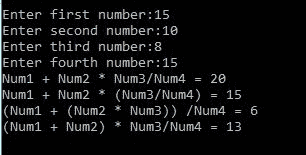

# 运算符重载

运算符重载是重新定义特定运算符的实际功能的一种方式。当您使用用户定义的复杂类型时，直接使用内置运算符是不可能的。例如，假设您有一个具有许多属性的对象，并且您希望对这些类型的对象进行加法。像这样是不可能的：`VeryComplexObject = result = verycoplexobj1 + verycomplexobj2;`。为了克服这种情况，重载可以发挥魔力。

您不能重载所有内置运算符；请参考[`docs.microsoft.com/en-us/dotnet/csharp/programming-guide/statements-expressions-operators/overloadable-operators`](https://docs.microsoft.com/en-us/dotnet/csharp/programming-guide/statements-expressions-operators/overloadable-operators)查看哪些运算符是可重载的。

让我们看一下以下代码片段，以了解运算符重载的工作原理（请注意，此代码不完整；请参考 Github 获取完整的源代码）：

```cs
public struct Coordinate 
{ 
//code omitted 

public static Coordinateoperator +(Coordinate coordinate1, Coordinate coordinate2) =>; 
new Coordinate(coordinate1._xAxis + coordinate2._xAxis, coordinate1._yAxis + coordinate2._yAxis); 
public static Coordinateoperator-(Coordinate coordinate1, Coordinate coordinate2) => 
new Coordinate(coordinate1._xAxis - coordinate2._xAxis, coordinate1._yAxis - coordinate2._yAxis); 
public static Coordinateoperator *(Coordinate coordinate1, Coordinate coordinate2) => 
new Coordinate(coordinate1._xAxis * coordinate2._xAxis, coordinate1._yAxis * coordinate2._yAxis); 
//code omitted 

public static booloperator ==(Coordinate coordinate1, Coordinate coordinate2) =>; 
        coordinate1._xAxis == coordinate2._xAxis && coordinate1._yAxis == coordinate2._yAxis; 

public static booloperator !=(Coordinate coordinate1, Coordinate coordinate2) => !(coordinate1 == coordinate2); 

//code omitted 

public double Area() => _xAxis * _yAxis; 

public override string ToString() =>$"({_xAxis},{_yAxis})"; 
}
```

在上面的代码中，我们有一个新类型的坐标，它是*x*轴和*y*轴的表面。现在，如果我们想应用一些操作，使用内置运算符是不可能的。通过运算符重载，我们增强了内置运算符的实际功能。以下代码是使用的坐标类型：

```cs
private static void OperatorOverloadigExample() 
{ 
WriteLine("Operator overloading example\n"); 
Write("Enter x-axis of Surface1: "); 
var x1 = ReadLine(); 
Write("Enter y-axis of Surface1: "); 
var y1 = ReadLine(); 
Write("Enter x-axis of Surface2: "); 
var x2= ReadLine(); 
Write("Enter y-axis of Surface2: "); 
var y2= ReadLine(); 

var surface1 = new Coordinate(Convert.ToInt32(x1),Convert.ToInt32(y1)); 
var surface2 = new Coordinate(Convert.ToInt32(x2),Convert.ToInt32(y2)); 
WriteLine(); 
Clear(); 
WriteLine($"Surface1:{surface1}"); 
WriteLine($"Area of Surface1:{surface1.Area()}"); 
WriteLine($"Surface2:{surface2}"); 
WriteLine($"Area of Surface2:{surface2.Area()}"); 
WriteLine(); 
WriteLine($"surface1 == surface2: {surface1==surface2}"); 
WriteLine($"surface1 < surface2: {surface1 < surface2}"); 
WriteLine($"surface1 > surface2: {surface1 > surface2}"); 
WriteLine($"surface1 <= surface2: {surface1 <= surface2}"); 
WriteLine($"surface1 >= surface2: {surface1 >= surface2}"); 
WriteLine(); 
var surface3 = surface1 + surface2; 
WriteLine($"Addition: {nameof(surface1)} + {nameof(surface2)} = {surface3}"); 
WriteLine($"{nameof(surface3)}:{surface3}"); 
WriteLine($"Area of {nameof(surface3)}: {surface3.Area()} "); 
WriteLine(); 
WriteLine($"Substraction: {nameof(surface1)} - {nameof(surface2)} = {surface1-surface2}"); 
WriteLine($"Multiplication: {nameof(surface1)} * {nameof(surface2)} = {surface1 * surface2}"); 
WriteLine($"Division: {nameof(surface1)} / {nameof(surface2)} = {surface1 / surface2}"); 
WriteLine($"Modulus: {nameof(surface1)} % {nameof(surface2)} = {surface1 % surface2}"); 
} 
Coordinate and call operators for various operations. Note that by overloading, we have changed the actual behavior of the operator, for instance, the add (*+*) operator, which generally adds two numbers, but with the implementation here, the add (*+*) operator gives the sum of two surfaces. The complete code produces the following result:
```

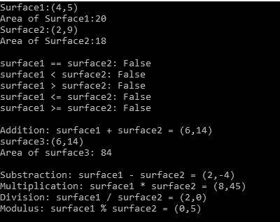

# 类型转换概述

类型转换意味着将一种类型转换为另一种类型。或者，我们称之为强制转换或类型转换。类型转换广泛分为以下几类。

# 隐式转换

隐式转换是 C#编译器在内部执行的转换，以匹配变量的类型通过给该变量赋值。这个操作是隐式的，不需要编写任何额外的代码来遵守类型安全机制。在隐式转换中，只有从较小的类型到较大的类型和派生类到基类的转换是可能的。

# 显式转换

显式转换是用户明确执行的转换，使用强制转换运算符；这就是为什么它也被称为类型转换。显式转换也可以使用内置类型转换方法进行。有关更多信息，请参考[`docs.microsoft.com/en-us/dotnet/csharp/language-reference/keywords/explicit-numeric-conversions-table`](https://docs.microsoft.com/en-us/dotnet/csharp/language-reference/keywords/explicit-numeric-conversions-table)。

让我们看一下以下代码片段，展示了隐式/显式类型转换的实际操作。

```cs
private static void ImplicitExplicitTypeConversionExample() 
{ 
WriteLine("Implicit conversion"); 
int numberInt = 2589; 
double doubleNumber = numberInt; // implicit type conversion 

WriteLine($"{nameof(numberInt)} of type:{numberInt.GetType().FullName} has value:{numberInt}"); 
WriteLine($"{nameof(doubleNumber)} of type:{doubleNumber.GetType().FullName} implicitly type casted and has value:{doubleNumber}"); 

WriteLine("Implicit conversion"); 
doubleNumber = 2589.05D; 
numberInt = (int)doubleNumber; //explicit type conversion 
WriteLine($"{nameof(doubleNumber)} of type:{doubleNumber.GetType().FullName} has value:{doubleNumber}"); 
WriteLine($"{nameof(numberInt)} of type:{numberInt.GetType().FullName} explicitly type casted and has value:{numberInt}"); 
} 
numberInt of int type to a variable doubleNumber of double type, which is called implicit type conversion, and the reverse is an explicit type conversion that requires a casting using int. Note that implicitly, type conversion does not require any casting, but explicitly, conversion requires type casting, and there are chances for loss of data during explicit conversion. For instance, our explicit conversion from double to int would result in a loss of data (all precision would be truncated while a value is assigned to int type variable). This code produces the following result:
```


两个最重要的语言基础是类型转换和强制转换。要了解更多关于这两个的信息，请参考[`docs.microsoft.com/en-us/dotnet/csharp/programming-guide/types/casting-and-type-conversions`](https://docs.microsoft.com/en-us/dotnet/csharp/programming-guide/types/casting-and-type-conversions)。

# 理解语句

在 C#中，你可以评估不同类型的表达式，这些表达式可能会产生结果，也可能不会。每当你说类似于*如果结果>0 会发生什么*，在这种情况下，我们在陈述某事。这可以是一个决策语句、结果生成语句、赋值语句或任何其他活动语句。另一方面，循环是一个重复执行一些语句的代码块。

在这一部分，我们将详细讨论语句和循环。

语句在返回结果之前应执行某些操作。换句话说，如果你在写一个语句，那个语句应该表达一些东西。为了做到这一点，它必须执行一些内置或自定义的操作。语句可以依赖于决定，也可以是任何现有语句的结果的一部分。官方页面（[`docs.microsoft.com/en-us/dotnet/csharp/programming-guide/statements-expressions-operators/statements`](https://docs.microsoft.com/en-us/dotnet/csharp/programming-guide/statements-expressions-operators/statements)）将语句定义为：

一个语句可以由一行以分号结束的代码组成，或者由一个代码块中的一系列单行语句组成。一个语句块被{}括起来，可以包含嵌套块。

看一下下面的代码片段，展示了不同的语句：

```cs
private static void StatementExample() 
{ 
WriteLine("Statement example:"); 
int singleLineStatement; //declarative statement 
WriteLine("'intsingleLineStatement;' is a declarative statment."); 
singleLineStatement = 125; //assignment statement 
WriteLine("'singleLineStatement = 125;' is an assignmnet statement."); 
WriteLine($"{nameof(singleLineStatement)} = {singleLineStatement}"); 
var persons = newList<Person> 
    { 
     newAuthor {Name = "Gaurav Aroraa" } 
    }; //declarative and assignmnet statement 
WriteLine("'var persons = new List&lt;Person&gt;();' is a declarative and assignmnet statement."); 

//block statement 
foreach (var person in persons) 
    { 
      WriteLine("'foreach (var person in persons){}' is a block statement."); 
      WriteLine($"Name:{person.Name}"); 
    } 
} 
```

在前面的代码中，我们使用了三种类型的语句：声明、赋值和块语句。代码产生了以下结果：


根据官方页面（[`docs.microsoft.com/en-us/dotnet/csharp/programming-guide/statements-expressions-operators/statements`](https://docs.microsoft.com/en-us/dotnet/csharp/programming-guide/statements-expressions-operators/statements)），C#语句可以大致分为以下几类。

# 声明语句

每当你声明一个变量或常量时，你都在写一个声明语句。你也可以在声明变量的时候给变量赋值。在声明变量的时候给变量赋值是一个可选的任务，但是常量在声明时需要赋值。

这是一个典型的声明语句：

```cs
int singleLineStatement; //declarative statement 
```

# 表达式语句

在一个表达式语句中，右侧的表达式评估结果并将该结果赋给左侧的变量。表达式语句可以是赋值、方法调用或新对象创建。这是典型的表达式语句示例：

```cs
Console.WriteLine($"Member name:{Name}"); 
var result = Num1 + Num2 * Num3 / Num4; 
```

# 选择语句

这也被称为决策语句。语句根据条件和它们的评估进行分支。条件可以是一个或多个。选择或决策语句属于`if...else`和`switch` case。在这一部分，我们将详细讨论这些语句。

# if 语句

`if`语句是一个决定语句，可以分支一个或多个语句进行评估。这个语句由一个布尔表达式组成。让我们考虑一下在第一天讨论过的在一本书中找元音字母的问题。让我们使用`if`语句来写这个问题：

```cs
private static void IfStatementExample() 
{ 
WriteLine("if statement example."); 
Write("Enter character:"); 
char inputChar = Convert.ToChar(ReadLine()); 

//so many if statement, compiler go through all if statement 
//not recommended way 
if (char.ToLower(inputChar) == 'a') 
WriteLine($"Character {inputChar} is a vowel."); 
if (char.ToLower(inputChar) == 'e') 
WriteLine($"Character {inputChar} is a vowel."); 
if (char.ToLower(inputChar) == 'i') 
WriteLine($"Character {inputChar} is a vowel."); 
if (char.ToLower(inputChar) == 'o') 
WriteLine($"Character {inputChar} is a vowel."); 
if (char.ToLower(inputChar) == 'u') 
WriteLine($"Character {inputChar} is a vowel."); 
} 
if statements without caring about the scenario where my first if statement got passed. Say, if you enter *a*, which is a vowel in this case, the compiler finds the first expression to be true and prints the output (we get our result), then the compiler checks the next if statement, and so on. In this case, the compiler unnecessarily checks the rest of all four statements that should not have happened. There might be a scenario where our code does not fall into any of the if statements in the preceding code; in that case, we would not get the expected result. To overcome such situations, we have the if...else statement, which we are going to discuss in the upcoming section.
```

# if..else 语句

在这个`if`语句后面跟着 else，如果 if 块的评估为 false，则执行 else 块。这是一个简单的例子：

```cs
private static void IfElseStatementExample() 
{ 
WriteLine("if statement example."); 
Write("Enter character:"); 
char inputChar = Convert.ToChar(ReadLine()); 
char[] vowels = {'a', 'e', 'i', 'o', 'u'}; 

if (vowels.Contains(char.ToLower(inputChar))) 
WriteLine($"Character '{inputChar}' is a vowel."); 
else 
WriteLine($"Character '{inputChar}' is a consonent."); 
} 
else followed by the if statement. When the if statement evaluates to false, then the else block code will be executed.
```

# if...else if...else 语句

`if...else`语句在需要测试多个条件时非常重要。在这个语句中，`if`语句首先评估，然后是`else if`语句，最后是 else 块执行。在这里，`if`语句可能有也可能没有`if...else`语句或块；`if...else`总是在`if`块之后和`else`块之前。`else`语句是`if...else...if else...else`语句中的最终代码块，表示前面的条件都不为真。

看一下以下代码片段：

```cs
private static void IfElseIfElseStatementExample() 
{ 
WriteLine("if statement example."); 
Write("Enter character:"); 
char inputChar = Convert.ToChar(ReadLine()); 

if (char.ToLower(inputChar) == 'a') 
{ WriteLine($"Character {inputChar} is a vowel.");} 
elseif (char.ToLower(inputChar) == 'e') 
{ WriteLine($"Character {inputChar} is a vowel.");} 
elseif (char.ToLower(inputChar) == 'i') 
{ WriteLine($"Character {inputChar} is a vowel.");} 
elseif (char.ToLower(inputChar) == 'o') 
{ WriteLine($"Character {inputChar} is a vowel.");} 
elseif (char.ToLower(inputChar) == 'u') 
{ WriteLine($"Character {inputChar} is a vowel.");} 
else 
{ WriteLine($"Character '{inputChar}' is a consonant.");} 
} 
if...else if...else statements that evaluate the expression: whether inputchar is equivalent to comparative characternot. In this code, if you enter a character other than *a*,*e*,i,*o*,*u* that does not fall in any of the preceding condition, then the case else code block executes and it produces the final result. So, when else executes, it returns the result by saying that the entered character is a consonant.
```

# 嵌套的 if 语句

嵌套的`if`语句只是`if`语句块内的`if`语句块。同样，我们可以嵌套`else if`语句块。这是一个简单的代码片段：

```cs
private static void NestedIfStatementExample() 
{ 
WriteLine("nested if statement example."); 
Write("Enter your age:"); 
int age = Convert.ToInt32(ReadLine()); 

if (age < 18) 
    { 
      WriteLine("Your age should be equal or greater than 18yrs."); 
      if (age < 15) 
        { 
         WriteLine("You need to complete your school first"); 
        } 
    } 
} 
```

# Switch 语句

这是一种使用`switch`语句选择表达式的语句，它使用`case`块评估条件，当代码不落入任何`case`块时，然后执行`default`块（`default`块是`switch...case`语句中的可选块）。

Switch 语句也被称为`if...else if...else`语句的替代方法。让我们重新编写在上一节中使用的示例，以展示`if...else if...else`语句：

```cs
private static void SwitchCaseExample() 
{ 
WriteLine("switch case statement example."); 
Write("Enter character:"); 
charinputChar = Convert.ToChar(ReadLine()); 

switch (char.ToLower(inputChar)) 
{ 
case'a': 
WriteLine($"Character {inputChar} is a vowel."); 
break; 
case'e': 
WriteLine($"Character {inputChar} is a vowel."); 
break; 
case'i': 
WriteLine($"Character {inputChar} is a vowel."); 
break; 
case'o': 
WriteLine($"Character {inputChar} is a vowel."); 
break; 
case'u': 
WriteLine($"Character {inputChar} is a vowel."); 
break; 
default: 
WriteLine($"Character '{inputChar}' is a consonant."); 
break; 
} 
}
```

在前面的代码中，如果没有一个 case 评估为真，则执行 default 块。`switch...case`语句将在第三天详细讨论。

在选择`switch...case`和`if...else`之间有一点不同。有关更多详细信息，请参阅[`stackoverflow.com/questions/94305/what-is-quicker-switch-on-string-or-elseif-on-type`](https://stackoverflow.com/questions/94305/what-is-quicker-switch-on-string-or-elseif-on-type)。

# 迭代语句

这些语句提供了一种迭代集合数据的方法。可能会有这样一种情况，您希望多次执行代码块或需要在相同活动上执行重复操作。有迭代循环可用于实现此目的。循环语句中的代码块按顺序执行，这意味着首先执行第一个语句，依此类推。以下是我们可以将 C#的迭代语句划分为的主要类别。

# do...while 循环

这有助于我们重复执行语句或语句块，直到它评估为假。在`do...while`语句中，首先执行一系列语句，然后在`while`下检查条件，这意味着至少执行一次语句或语句块。

看一下以下代码：

```cs
private static void DoWhileStatementExample() 
{ 
WriteLine("do...while example"); 
Write("Enter repeatitive length:"); 
int length = Convert.ToInt32(ReadLine()); 
int count = 0; 
do 
    { 
        count++; 
        WriteLine(newstring('*',count));  
    } while (count < length); 
} 
do block executes until the statement of the while block evaluates to false.
```

# while 循环

这将执行语句或代码块，直到条件评估为真。在执行代码块之前，此表达式评估，如果表达式评估为假，循环终止，不执行任何语句或代码块。看一下以下代码片段：

```cs
private static void WhileStatementExample() 
{ 
WriteLine("while example"); 
Write("Enter repeatitive length:"); 
int length = Convert.ToInt32(ReadLine()); 
int count = 0; 
while (count < length) 
    { 
       count++; 
       WriteLine(newstring('*', count)); 
    } 
}   
```

前面的代码重复执行`while`语句，直到表达式评估为假。

# for 循环

`for`循环类似于其他循环，可以帮助重复运行语句或代码块，直到表达式评估为假。`for`循环有三个部分：`initializer`、`condition`和`iterator`，其中`initializer`部分首先执行一次；这只是一个开始循环的变量。下一部分是条件，如果评估为真，那么只有主体语句才会执行；否则它终止循环。第三部分是增量或迭代器，它更新循环控制变量。让我们看一下以下代码片段：

```cs
private static void ForStatementExample() 
{ 
WriteLine("for loop example."); 
Write("Enter repeatitive length:"); 
int length = Convert.ToInt32(ReadLine()); 
for (intcountIndex = 0; countIndex < length; countIndex++) 
    { 
     WriteLine(newstring('*', countIndex)); 
    } 
}
for loop. Here, our code statement within the for loop block will executive repeatedly until the countIndex&lt; length expression evaluates to false.
```

# foreach 循环

这有助于迭代数组元素或集合。它与`for`循环做的事情相同，但这可用于在不添加或删除集合项的情况下迭代通过集合。

让我们看一下以下代码片段：

```cs
private static void ForEachStatementExample() 
{ 
WriteLine("foreach loop example"); 
char[] vowels = {'a', 'e', 'i', 'o', 'u'}; 
WriteLine("foreach on Array."); 
foreach (var vowel in vowels) 
    { 
        WriteLine($"{vowel}"); 
    } 
WriteLine(); 
var persons = new List<Person> 
    { 
     new Author {Name = "Gaurav Aroraa"}, 
     new Reviewer {Name = "ShivprasadKoirala"}, 
     new TeamMember {Name = "Vikas Tiwari"}, 
     new TeamMember {Name = "Denim Pinto"} 
    }; 
WriteLine("foreach on collection"); 
foreach (var person in persons) 
    { 
        WriteLine($"{person.Name}"); 
    } 
}
```

上述代码是一个`foreach`语句的工作示例，打印一个人的名字。`Name`是`Person`对象集合中的一个属性。`foreach`块的语句会重复执行，直到表达式`person in persons`评估为 false。

# 跳转语句

跳转语句，顾名思义，是一种帮助将控制从一个部分移动到另一个部分的语句。这些是 C#中的主要跳转语句。

# 中断

这终止了`for`循环或`switch`语句的控制流。看下面的例子：

```cs
private static void BreakStatementExample() 
{ 
WriteLine("break statement example"); 
WriteLine("break in for loop"); 
for (int count = 0; count &lt; 50; count++ 
{ 
if (count == 8) 
   { 
    break; 
   } 
WriteLine($"{count}"); 
} 
WriteLine(); 
WriteLine("break in switch statement"); 
SwitchCaseExample(); 
} 
```

在上述代码中，当`if`表达式评估为 true 时，`for`循环的执行将中断。

# 继续

这有助于`continue`控制到循环的下一次迭代，并且它与`while`、`do`、`for`或`foreach`循环一起使用。看下面的例子：

```cs
private static void ContinueStatementExample() 
{ 
WriteLine("continue statement example"); 
WriteLine("continue in for loop"); 
for (int count = 0; count &lt; 15; count++) 
{ 
if (count< 8) 
{ 
 continue; 
} 
 WriteLine($"{count}"); 
} 
} 
```

当`if`表达式评估为 true 时，上述代码将绕过执行。

# 默认

这与`switch`语句和一个`default`块一起使用，确保如果在任何`case`块中找不到匹配项，则执行`default`块。有关更多详细信息，请参考`switch...case`语句。

# 异常处理语句

这具有处理程序中未知问题的能力，这被称为异常处理（我们将在第四天讨论异常处理）。

# 数组和字符串操作

数组和字符串在 C#编程中很重要。可能会有机会需要字符串操作或使用数组处理复杂数据。在本节中，我们将讨论数组和字符串。

# 数组

数组只是一个存储相同类型的固定大小顺序元素的数据结构。包含数据的数组元素基本上是变量，我们也可以称数组为相同类型变量的集合，这种类型通常称为元素类型。

数组是一块连续的内存。这个块存储了数组所需的一切，即元素、元素排名和数组的长度。第一个元素排名是 0，最后一个元素排名等于数组的总长度-1。

让我们考虑`char[] vowels = {'a', 'e', 'i', 'o', 'u'};`数组。一个大小为五的数组。每个元素都以顺序方式存储，并且可以使用其元素排名进行访问。以下是显示数组声明包含的内容的图示：


上图是我们用于表示元音字母数组声明的*char 数据类型*。这里，*[ ]*表示一个数组，并告诉 CLR 我们正在声明一个字符数组。元音是一个变量名，右侧表示包含数据的完整数组。

以下图显示了这个数组在内存中的样子：


在上图中，我们有一组连续的内存块。这也告诉我们，数组在内存中的最低地址对应于数组的第一个元素，而数组在内存中的最高地址对应于最后一个元素。

我们可以通过其排名（从 0 开始）检索元素的值。因此，在上述代码中，*vowels[0]*将给我们*a*，*vowels[4]*将给我们*u*。

当我们谈论数组时，我们指的是引用类型，因为数组类型是引用类型。数组类型派生自`System.Array`，这是一个类。因此，所有数组类型都是引用类型。

或者，我们也可以使用`for`来获取值，它会迭代直到`rankIndex < vowels.Length`表达式评估为 false，`for`循环语句的代码块根据其排名打印数组元素：

```cs
private static void ArrayExample() 
{ 
WriteLine("Array example.\n"); 
char[] vowels = {'a', 'e', 'i', 'o', 'u'}; 
WriteLine("char[] vowels = {'a', 'e', 'i', 'o', 'u'};\n"); 
WriteLine("acces array using for loop"); 
for (intrankIndex = 0; rankIndex&lt;vowels.Length; rankIndex++) 
{ 
    Write($"{vowels[rankIndex]} "); 
} 
WriteLine(); 
WriteLine("acces array using foreach loop"); 
foreach (char vowel in vowels) 
    { 
        Write($"{vowel} "); 
    } 
} 
```

上述代码产生以下结果：

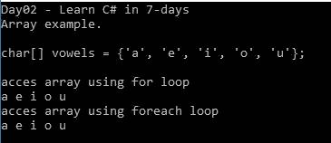

在前面的例子中，我们初始化了数组并为一个语句分配了数据，相当于`char[] vowels = newchar[5];`。在这里，我们告诉 CLR，我们正在创建一个名为 vowels 的 char 类型数组，最多有五个元素。或者，我们也可以声明相同的`char[] vowels = newchar[5] { 'a', 'e', 'i', 'o', 'u' };`

在本节中，我们将讨论不同类型的数组，并看看如何在不同的情况下使用数组。

# 数组类型

早些时候，我们讨论了数组是什么，以及如何声明数组。到目前为止，我们已经讨论了单维数组。考虑一个矩阵，我们有行和列。数组是数据以矩阵的形式排列的表示。然而，数组有更多类型，如此处所述。

# 单维数组

单维数组可以通过初始化数组类并设置大小来简单声明。以下是一个单维数组：

```cs
string[] cardinalDirections = {"North","East","South","West"}; 
```

# 多维数组

数组可以声明为多维的，这意味着你可以创建一个行和列的矩阵。多维数组可以是二维数组、三维数组或更多。创建一个典型的 2x2 大小的二维数组有不同的方法，意味着有两行和两列：

```cs
int[,] numbers = new int[2,2]; 
int[,] numbers = new int[2, 2] {{1,2},{3,4} }; 
```

以下是访问二维数组的代码片段：

```cs
int[,] numbers = new int[2, 2] {{1,2},{3,4} }; 
for (introwsIndex = 0; rowsIndex< 2; rowsIndex++) 
{ 
for (intcolIndex = 0; colIndex< 2; colIndex++) 
    { 
        WriteLine($"numbers[{rowsIndex},{colIndex}] = {numbers[rowsIndex, colIndex]}"); 
    } 
} 
for loops; the outer loop will work on rows and the inner loop will work on columns, and finally, we can get the element value using number[rowIndex][colIndex].
```

方阵是行和列相同的矩阵。通常被称为*n*乘以*n*矩阵。

这段代码产生以下结果：


# 交错数组

交错数组是数组的数组或数组中的数组。在交错数组中，数组的元素是一个数组。你也可以设置不同大小/维度的数组元素。交错数组的任何元素都可以有另一个数组。

典型的交错数组声明如下：

```cs
string[][,] collaborators = new string[5][,]; 
```

考虑以下代码片段：

```cs
WriteLine("Jagged array.\n"); 
string[][,] collaborators = new string[3][,] 
{ 
new[,] {{"Name", "ShivprasadKoirala"}, {"Age", "40"}}, 
new[,] {{"Name", "Gaurav Aroraa" }, {"Age", "43"}}, 
new[,] {{"Name", "Vikas Tiwari"}, {"Age", "28"}} 
}; 

for (int index = 0; index <collaborators.Length; index++) 
{ 
     for (introwIndex = 0; rowIndex< 2; rowIndex++) 
    { 
         for (intcolIndex = 0; colIndex< 2; colIndex++) 
        { 
            WriteLine($"collaborators[{index}][{rowIndex},
            {colIndex}] = {collaborators[index]  
            [rowIndex,colIndex]}"); 
        } 
    } 
} 
```

在前面的代码中，我们声明了一个包含两维数组的三个元素的交错数组。执行后，产生以下结果：

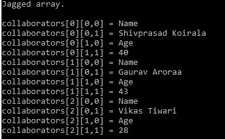

你也可以声明更复杂的数组以与更复杂的情况交互。你可以通过参考[`docs.microsoft.com/en-us/dotnet/api/system.array?view=netcore-2.0`](https://docs.microsoft.com/en-us/dotnet/api/system.array?view=netcore-2.0)获取更多信息。

也可以创建隐式类型的数组。在隐式类型的数组中，数组类型是在数组初始化期间从元素中推断出来的，例如，`var charArray = new[] {'a', 'e', 'i', 'o', 'u'};`在这里我们声明了一个 char 数组。有关隐式类型数组的更多信息，请参阅[`docs.microsoft.com/en-us/dotnet/csharp/programming-guide/arrays/implicitly-typed-arrays`](https://docs.microsoft.com/en-us/dotnet/csharp/programming-guide/arrays/implicitly-typed-arrays)。

# 字符串

在 C#中，字符串只是表示 UTF-16 代码单元的字符数组，用于表示文本。

内存中字符串的最大大小为 2GB。

字符串对象的声明就像你声明任何变量一样简单，最常用的语句是：`string authorName = "Gaurav Aroraa";`。

字符串对象被称为不可变，这意味着它是只读的。字符串对象的值在创建后无法修改。对字符串对象执行的每个操作都会返回一个新的字符串。由于字符串是不可变的，它们会导致巨大的性能损失，因为对字符串的每个操作都需要创建一个新的字符串。为了克服这一点，`System.Text`类中提供了`StringBuilder`对象。

有关字符串的更多信息，请参阅[`docs.microsoft.com/en-us/dotnet/api/system.string?view=netcore-2.0#Immutability`](https://docs.microsoft.com/en-us/dotnet/api/system.string?view=netcore-2.0#Immutability)。

这些是声明字符串对象的替代方法：

```cs
private static void StringExample() 
{ 
WriteLine("String object creation"); 
string authorName = "Gaurav Aroraa"; //string literal assignment 
WriteLine($"{authorName}"); 
string property = "Name: "; 
string person = "Gaurav"; 
string personName = property + person; //string concatenation 
WriteLine($"{personName}"); 

char[] language = {'c', 's', 'h', 'a', 'r', 'p'}; 
stringstr Language = new string(language); //initializing the constructor 
WriteLine($"{strLanguage}"); 
string repeatMe = new string('*', 5); 
WriteLine($"{repeatMe}"); 
string[] members = {"Shivprasad", "Denim", "Vikas", "Gaurav"}; 
string name = string.Join(" ", members); 
WriteLine($"{name}"); 
} 
```

前面的代码片段告诉我们，声明可以如下进行：

+   在声明字符串变量时进行字符串文字赋值

+   在连接字符串时

+   使用`new`进行构造函数初始化

+   返回字符串的方法

有大量的字符串方法和格式化操作可用于字符串操作；请参考[`docs.microsoft.com/en-us/dotnet/api/system.string?view=netcore-2.0`](https://docs.microsoft.com/en-us/dotnet/api/system.string?view=netcore-2.0)获取更多详细信息。

# 结构与类

与 C#中的类一样，结构也是由成员、函数等组成的数据结构。类是引用类型，但结构是值类型；因此，它们不需要堆分配，而是需要在堆栈上分配。

值类型数据将分配在堆栈上，引用类型数据将分配在堆上。在结构中使用的值类型存储在堆栈上，但当相同的值类型在数组中使用时，它存储在堆中。

有关堆和栈内存分配的更多详细信息，请参考[`www-ee.eng.hawaii.edu/~tep/EE160/Book/chap14/subsection2.1.1.8.html`](http://www-ee.eng.hawaii.edu/~tep/EE160/Book/chap14/subsection2.1.1.8.html)和[`www.codeproject.com/Articles/1058126/Memory-allocation-in-Net-Value-type-Reference-type`](https://www.codeproject.com/Articles/1058126/Memory-allocation-in-Net-Value-type-Reference-type)。

因此，当您创建`struct`类型的变量时，该变量直接存储数据，而不是引用，这与类的情况相同。在 C#中，`struct`关键字（请参阅 C#关键字部分以获取更多详细信息）有助于声明结构。结构有助于表示记录或当您需要呈现一些数据时。

看下面的例子：

```cs
public struct BookAuthor 
{ 
public string Name; 
public string BookTitle; 
public int Age; 
public string City; 
public string State; 
public string Country; 

   //Code omitted 
} 
```

在这里，我们有一个名为`BookAuthor`的结构，它表示书籍作者的数据。看一下正在使用这个结构的下面的代码：

```cs
private static void StructureExample() 
{ 
WriteLine("Structure example\n"); 
Write("Author name:"); 
var name = ReadLine(); 
Write("Book Title:"); 
var bookTitle = ReadLine(); 
Write("Author age:"); 
var age = ReadLine(); 
Write("Author city:"); 
var city = ReadLine(); 
Write("Author state:"); 
var state = ReadLine(); 
Write("Author country:"); 
var country = ReadLine(); 

BookAuthor author = new BookAuthor(name,bookTitle,Convert.ToInt32(age),city,state,country); 
WriteLine($"{author.ToString()}"); 
BookAuthor author1 = author; //copy structure, it will copy only data as this is //not a class 

Write("Change author name:"); 
var name1 = ReadLine(); 
author.Name = name1; 

WriteLine("Author1"); 
WriteLine($"{author.ToString()}"); 
WriteLine("Author2"); 
WriteLine($"{author1.ToString()}"); 
} 
```

这只是显示作者的详细信息。这里的重要一点是，一旦我们复制了结构，改变结构的任何字段都不会影响复制的内容；这是因为当我们复制时，只有数据被复制。如果您在类上执行相同的操作，那么会复制引用而不是复制数据。这个复制过程称为深复制和浅复制。请参考[`www.codeproject.com/Articles/28952/Shallow-Copy-vs-Deep-Copy-in-NET`](https://www.codeproject.com/Articles/28952/Shallow-Copy-vs-Deep-Copy-in-NET)以了解有关浅复制与深复制的更多信息。

这是前面代码的结果：

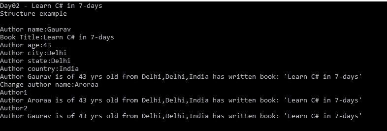

现在，让我们尝试使用相同的操作来操作类；看一下下面消耗我们的类的代码：

```cs
private static void StructureExample() 
{ 
WriteLine("Structure example\n"); 
Write("Author name:"); 
var name = ReadLine(); 
Write("Book Title:"); 
var bookTitle = ReadLine(); 
Write("Author age:"); 
var age = ReadLine(); 
Write("Author city:"); 
var city = ReadLine(); 
Write("Author state:"); 
var state = ReadLine(); 
Write("Author country:"); 
var country = ReadLine(); 

ClassBookAuthor author = new ClassBookAuthor(name,bookTitle,Convert.ToInt32(age),city,state,country); 
WriteLine($"{author.ToString()}"); 
ClassBookAuthor author1 = author; //copy class, it will copy reference 

Write("Change author name:"); 
var name1 = ReadLine(); 
author.Name = name1; 

WriteLine("Author1"); 
WriteLine($"{author.ToString()}"); 
WriteLine("Author2"); 
WriteLine($"{author1.ToString()}"); 
} 
```

现在我们的类变量都将具有相同的值。下面的屏幕截图显示了结果：

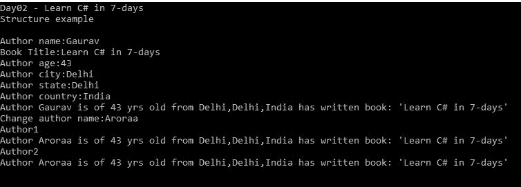

结构和类是不同的：

+   结构是值类型，而类是引用类型。

+   类支持单继承（可以使用接口实现多继承），但结构不支持继承。

+   类有一个隐式默认构造函数，但结构没有默认构造函数。

结构的更多功能我们在这里没有讨论。请参考[`docs.microsoft.com/en-us/dotnet/csharp/tour-of-csharp/structs`](https://docs.microsoft.com/en-us/dotnet/csharp/tour-of-csharp/structs)获取有关结构的更多内部信息。

# 动手练习

让我们通过解决以下问题来回顾今天的学习 - 也就是第二天：

1.  编写一个简短的程序来演示我们可以在不同的命名空间中使用相同的类名。

1.  定义`console`类。通过修改书中讨论的代码示例，编写一个`console`程序来显示所有可用的颜色，以便所有元音显示为绿色，所有辅音显示为蓝色。

1.  详细说明 C#保留关键字。

1.  用示例描述 C#关键字的不同类别。

1.  创建一个小程序来演示`is`和`as`运算符。

1.  编写一个简短的程序，使用上下文关键字展示查询表达式。

1.  编写一个简短的程序来展示`this`和`base`关键字的重要性。

1.  用一个简短的程序来定义装箱和拆箱。

1.  编写一个简短的程序来证明指针类型变量存储的是另一个变量的内存而不是数据。

1.  编写一个简短的程序来展示运算符优先级顺序。

1.  什么是运算符重载？编写一个简短的程序来展示运算符重载的实际应用。

1.  哪些运算符不能被重载，为什么？

1.  用一个简短的程序来定义类型转换。

1.  编写一个简短的程序，使用所有可用的内置 C#类型，并使用转换方法进行转换（可以使用`var result = Convert.ToInt32(5689.25);`实现从十进制到整数的转换）。

1.  定义 C#语句。

1.  编写一个程序来详细说明每个语句类别。

1.  什么是`jump`语句？编写一个小程序来展示所有`jump`语句。

1.  在 C#中什么是数组？

1.  编写一个程序来证明数组是一块连续的内存块。

1.  参考`System.Array`类（[`docs.microsoft.com/en-us/dotnet/api/system.array?view=netcore-2.0`](https://docs.microsoft.com/en-us/dotnet/api/system.array?view=netcore-2.0)）并编写一个简短的程序。

1.  将数组作为参数传递给一个方法。

1.  对数组进行排序。

1.  复制数组。

1.  参考`System.String`类，并通过一个简短的程序探索它的所有方法和属性。

1.  字符串对象是如何不可变的？写一个简短的程序来展示这一点。

1.  什么是字符串构建器？

1.  什么是类？

1.  什么是结构？

1.  编写一个小程序，展示`struct`和`class`之间的区别。

1.  解释编译时类型和运行时类型。

1.  编写一个程序来展示编译时类型和运行时类型的区别。

1.  编写一个简短的程序来证明，显式类型转换会导致数据丢失。

# 重温第二天

因此，我们结束了我们七天学习系列的第二天。今天，我们从一个非常简单的 C#程序开始，然后通过了它的所有部分（一个典型的 C#程序）。然后，我们讨论了关于 C#保留关键字和访问器的一切，我们也了解了什么是上下文关键字。

我们讨论了 C#中各种可用数据类型的类型转换和类型转换。您学会了装箱和拆箱的过程，以及如何使用内置方法进行转换。

我们还了解了各种语句，并学习了各种语句的用法和流程，比如`for`、`foreach`、`while`、`do`。我们通过代码示例了解了条件语句，比如`if`、`if...else`、`if...elseif...else`以及`switch`。

然后，我们通过代码示例了解了数组，并了解了它们，包括字符串操作。

最后，我们通过讨论结构和类来结束了今天的学习。我们看了这两者的不同之处。

明天，第三天，我们将讨论 C#语言的所有新特性，并通过代码示例讨论它们的用法和功能。
