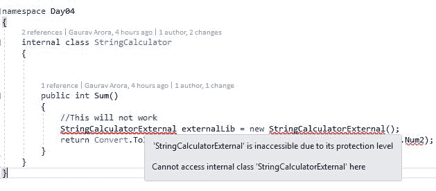
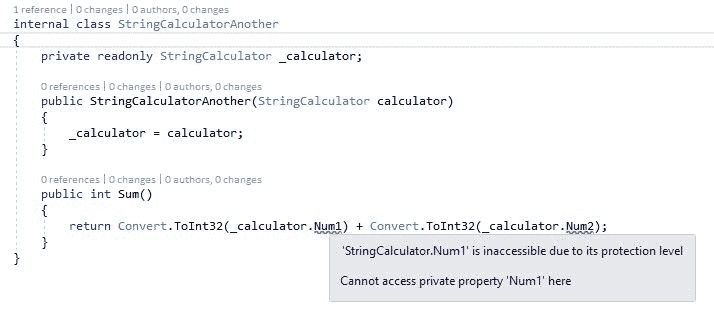
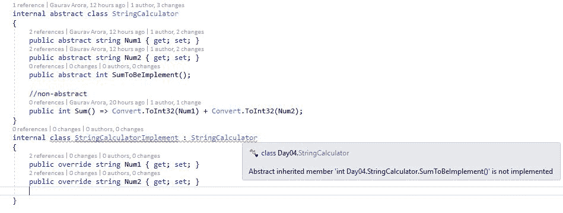
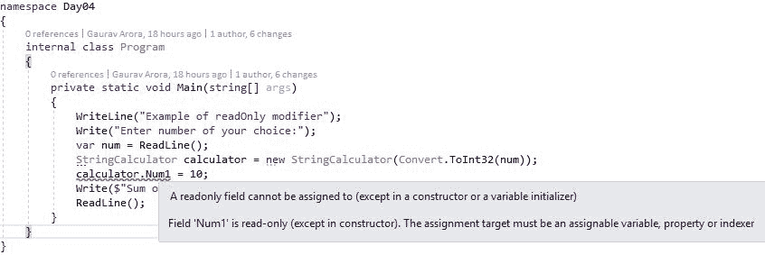
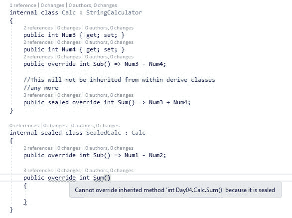
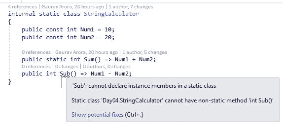
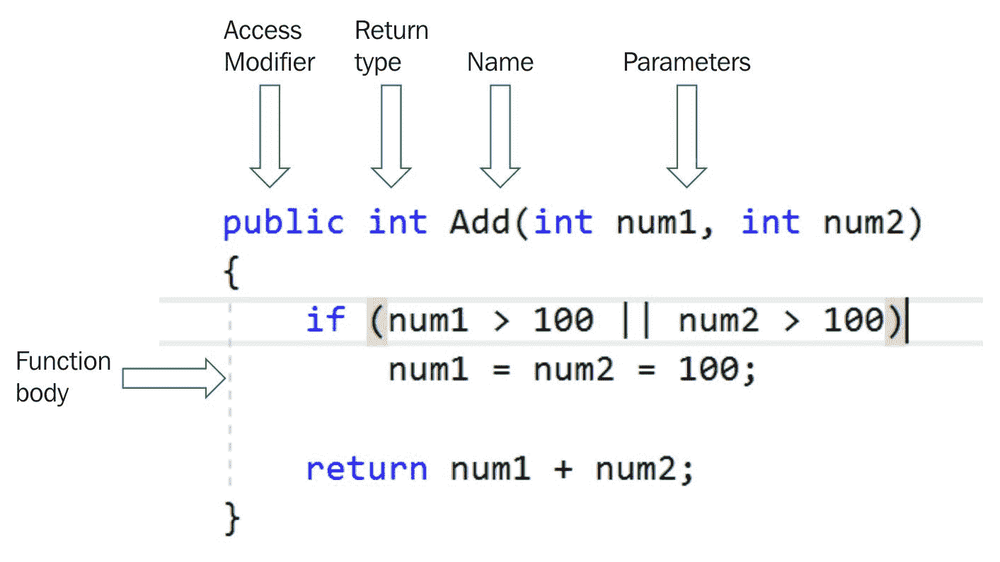
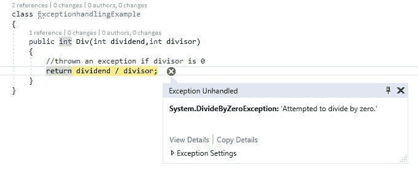
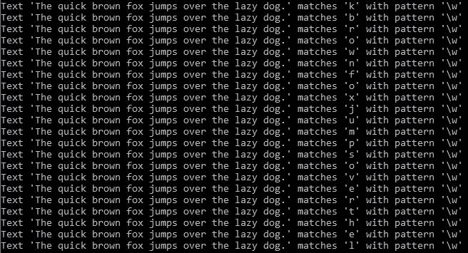

# 第四章：第 04 天 - 讨论 C#类成员

我们正在进行为期七天的学习系列的第四天。在第二天，我们讨论了典型的 C#程序，并了解了如何编译和执行程序。我们讨论了`Main`方法及其用途。我们还讨论了语言 C#的保留关键字，然后我们对 C#中的类和结构进行了概述。在第三天，我们讨论了 C#7.0 中引入的所有新功能。

在本章中，将解释 C#方法和属性的基础知识，我们还将涵盖 C#中索引器的概念。在第二天讨论的字符串操作将通过 RegEx 进行扩展，并解释为什么它很强大。文件管理将与一些中级文件系统观察者一起讨论。

今天，我们将更深入地讨论 C#类。本章将涵盖以下主题：

+   修饰符

+   方法

+   属性

+   索引器

+   文件 I/O

+   异常处理

+   讨论正则表达式及其重要性

在第二天，我们讨论了一个典型的 C#程序，并讨论了程序如何编译和执行。`Main`方法的用途/重要性是什么？我们将继续讨论并开始我们的第四天。

在开始之前，让我们通过字符串计算器程序的步骤（[`github.com/garora/TDD-Katas/tree/develop/Src/cs/StringCalculator`](https://github.com/garora/TDD-Katas/tree/develop/Src/cs/StringCalculator)）进行一下。有一个简单的要求，即将作为字符串提供的数字相加。以下是一个简单的代码片段，基于这个一句要求，它没有提到需要在字符串中提供多少个数字：

```cs
namespace Day04
{
    class Program
    {
        static void Main(string[] args)
        {
            Write("Enter number1:");
            var num1 = ReadLine();
            Write("Enter number2:");
            var num2 = ReadLine();
            var sum = Convert.ToInt32(num1) +
            Convert.ToInt32(num2);
            Write($"Sum of {num1} and {num2} is {sum}");
            ReadLine();
        }
    }
}
```

当我们运行上述代码时，我们将获得以下输出：


上述代码运行良好，并给出了预期的结果。我们之前讨论的要求非常有限和模糊。让我们详细说明最初的要求：

+   使用`Add`操作创建一个简单的字符串计算器：

+   此操作应仅接受字符串数据类型的输入。

+   `Add`操作可以接受零个、一个或两个逗号分隔的数字，并返回它们的总和，例如*1*或*1,2*。

+   `Add`操作应接受空字符串，但对于空字符串，它将返回零。

上述要求在我们之前的代码片段中没有得到解答。为了实现这些要求，我们应该调整我们的代码片段，我们将在接下来的部分中讨论。

# 修饰符

修饰符只是 C#中用于声明特定方法、属性或变量如何可访问的特殊关键字。在本节中，我们将讨论修饰符，并使用代码示例讨论它们的用法。

修饰符的整个目的是封装。这是关于对象如何通过封装变得简化的，修饰符就像旋钮一样，告诉客户想要展示多少，不想展示多少。要理解封装，请参考第七天，“封装”。

# 访问修饰符和可访问级别

访问修饰符告诉我们成员、声明类型等如何以及在哪里可以被访问或可用。以下讨论将为您提供对所有访问修饰符和可访问级别的更广泛理解。

# public

`public`修饰符帮助我们定义成员的范围，没有任何限制。这意味着如果我们使用公共访问修饰符定义任何类、方法、属性或变量，该成员可以在其他成员中无限制地访问。

使用公共访问修饰符声明的派生类型的类型或成员的可访问性级别是不受限制的，这意味着它可以在任何地方访问。

要理解无限制的可访问级别，让我们考虑以下代码示例：

```cs
namespace Day04
{
    internal class StringCalculator
    {
        public string Num1 { get; set; }
        public string Num2 { get; set; }

        public int Sum() => Convert.ToInt32(Num1) + Convert.ToInt32(Num2);
     }
}
Num1 and Num2, and one method Sum(), with the access modifier public. This means these properties and the method is accessible to other classes as well. Here is the code snippet that consumes the preceding class:
```

```cs
namespace Day04
{
    class Program
    {
        static void Main(string[] args)
        {
            StringCalculator calculator = new
            StringCalculator();
            Write("Enter number1:");
            calculator.Num1 = ReadLine();
            Write("Enter number2:");
            calculator.Num2 = ReadLine();
            Write($"Sum of {calculator.Num1} and
            {calculator.Num2} is {calculator.Sum()}");
            ReadLine();
        }
    }
}
```

上述代码片段将完美运行并产生预期的结果。当您运行上述代码时，它将显示结果，如下图所示：


# 受保护的

`protected`修饰符帮助我们定义成员的范围，而不是从定义/创建成员的类中定义的类型。换句话说，当我们使用`protected`访问修饰符定义变量、属性或方法时，这意味着这些成员的可用范围在定义了所有这些成员的类内部。

使用受保护访问修饰符声明的派生类型的类型或成员的可访问性级别是受限制的，这意味着它只能在类内部或从成员类创建的派生类型中访问。受保护修饰符在面向对象编程中的 C#中非常重要和活跃。您应该对继承有所了解。请参考第七天，*继承*。

为了理解受保护的可访问性级别，让我们考虑以下代码示例：

```cs
namespace Day04
{
    class StringCalculator
    {

        protected string Num1 { get; set; }
        protected string Num2 { get; set; }

    }

    class StringCalculatorImplementation : StringCalculator
    {
        public void Sum()
        {
            StringCalculatorImplementation calculator =
            new StringCalculatorImplementation();

            Write("Enter number1:");

            calculator.Num1 = ReadLine();

            Write("Enter number2:");

            calculator.Num2 = ReadLine();

            int sum = Convert.ToInt32(calculator.Num1) +
            Convert.ToInt32(calculator.Num2);

            Write($"Sum of {calculator.Num1} and
            {calculator.Num2} is {sum}");
        }
    }
}
```

在前面的代码中，我们有两个类：`StringCalculator`和`StringCalculatorImplementation`。在`StringCalculator`类中，属性使用`protected`访问修饰符进行定义。这意味着这些属性只能从`StringCalculator`类或`StringCalculatorImplementation`（这是`StringCalculator`类的派生类型）中访问。前面的代码将产生以下输出：


以下代码将不起作用，并将产生编译时错误：

```cs
class StringCalculatorImplementation : StringCalculator
{
    readonly StringCalculator _stringCalculator = new
    StringCalculator();
    public int Sum()
    {
        var num=_stringCalculator.Num1; //will not work
        var number=_stringCalculator.Num2; //will not work

        //other stuff
    }
}
```

在前面的代码中，我们尝试通过创建`StringCalculator`类的实例来从`StringCalculatorImplementation`类中访问`Num1`和`Num2`。这是不可能的，也不会起作用。请参考以下截图：


# 内部

内部修饰符帮助我们定义成员在同一程序集中的范围。使用内部访问修饰符定义的成员不能在定义它们的程序集之外访问。

使用内部访问修饰符声明的类型或成员的可访问性级别对于程序集外部是受限制的。这意味着这些成员不允许从外部程序集访问。

为了理解内部的可访问性级别，让我们考虑以下代码示例：

```cs
namespace ExternalLib
{
    internal class StringCalculatorExternal
    {
        public string Num1 { get; set; }
        public string Num2 { get; set; }
    }
}
```

该代码属于包含`StringCalculatorExternal`类的`ExternalLib`程序集，该类具有内部访问修饰符和两个属性`Num1`和`Num2`，使用了`public`访问修饰符。如果我们从其他程序集调用此代码，它将无法工作。让我们考虑以下代码片段：

```cs
namespace Day04
{
    internal class StringCalculator
    {
        public int Sum()
        {
            //This will not work
            StringCalculatorExternal externalLib = new StringCalculatorExternal();
            return Convert.ToInt32(externalLib.Num1) + Convert.ToInt32(externalLib.Num2);
        }
    }
}
```

前面的代码是一个单独的第四天的程序集，并且我们试图调用`ExternalLib`程序集的`StringCalculatorExternal`类，这是不可能的，因为我们已将此类定义为`internal`。这段代码将抛出以下错误：



# 复合

当我们联合使用受保护和内部访问修饰符，即`protected internal`，这些修饰符的组合称为复合修饰符。

`protected internal`表示受保护或内部，而不是受保护和内部。这意味着成员可以从同一程序集中的任何类中访问。

为了理解受保护的内部可访问性级别，让我们考虑以下代码示例：

```cs
namespace Day04
{
    internal class StringCalculator
    {
        protected internal string Num1 { get; set; }
        protected internal string Num2 { get; set; }
    }

    internal class StringCalculatorImplement :
    StringCalculator
    {
        public int Sum() => Convert.ToInt32(Num1) + Convert.ToInt32(Num2);
    }
}
```

前面的代码是第四天的程序集，其中有一个`StringCalculatorImplement`类，即继承了`StringCalculator`类（这个类有两个属性，使用了`protected internal`访问修饰符）。让我们考虑一下来自同一程序集的代码：

```cs
namespace Day04
{
    internal class Program
    {
        private static void Main(string[] args)
        {
            var calculator = new
            StringCalculatorImplement();
            Write("Enter number1:");
            calculator.Num1 = ReadLine();
            Write("Enter number2:");
            calculator.Num2 = ReadLine();

            Write($"Sum of {calculator.Num1} and
            {calculator.Num2} is {calculator.Sum()}");
            ReadLine();
        }
    }
}
```

前面的代码将产生以下输出：


# private

`private`修饰符是成员的最低范围。这意味着只有在定义了`private`修饰符的类内部才能访问该成员。

`private`表示受限制的访问，成员只能从类内部或其嵌套类型中访问，如果定义了的话。

为了理解私有的可访问性级别，让我们考虑以下代码示例：

```cs
internal class StringCalculator
{
    private string Num1 { get; set; }
    private string Num2 { get; set; }

    public int Sum() => Convert.ToInt32(Num1) + Convert.ToInt32(Num2);
}
```

在前面的代码中，属性`Num1`和`Num2`对于`StringCalculator`类外部是不可访问的。下面的代码将无法工作：

```cs
internal class StringCalculatorAnother
{
    private readonly StringCalculator _calculator;

    public StringCalculatorAnother(StringCalculator
    calculator)
    {
        _calculator = calculator;
    }

    public int Sum() => Convert.ToInt32(_calculator.Num1) +        Convert.ToInt32(_calculator.Num2);

}
```

前面的代码将会抛出编译时错误，如下截图所示：



# 访问修饰符的规则

我们已经讨论了访问修饰符和使用这些访问修饰符的可访问性。现在，我们应该遵循在使用这些访问修饰符时应该遵循的一些规则，这些规则在这里讨论：

+   **组合限制**：在使用访问修饰符时有一个限制。除非使用了访问修饰符`protected internal`，否则不应该组合使用这些修饰符。考虑前一节中讨论的代码示例。

+   **命名空间限制**：这些访问修饰符不应该与命名空间一起使用。

+   **默认可访问性限制**：当成员声明时，如果没有使用访问修饰符，则使用默认可访问性。所有类都是隐式内部的，其成员是私有的。

+   **顶层类型限制**：顶层类型是具有直接父类型对象的父类型。父类型或顶层类型不能使用除了`internal`或`public`可访问性之外的任何可访问性。如果没有应用访问修饰符，则默认可访问性将是内部的。

+   **嵌套类型限制**：嵌套类型是其他类型的成员，或者具有除了通用类型（即对象）以外的直接父类型。这些类型的可访问性可以根据以下表格中讨论的方式进行声明（[`docs.microsoft.com/en-us/dotnet/csharp/language-reference/keywords/accessibility-levels`](https://docs.microsoft.com/en-us/dotnet/csharp/language-reference/keywords/accessibility-levels)）：

| **嵌套类型** | **成员的默认可访问性** | **允许声明的可访问性** | **描述** |
| --- | --- | --- | --- |
| 枚举 | `public` | 无 | `enum`具有公共可访问性，其成员只有`public`可访问性。这些是为其他类型使用的，因此它们不允许显式设置任何可访问性。 |
| 类 | `private` | `public`、`internal`、`protected`、`private`、`protected internal` | 类默认是内部的，成员是`private`。有关访问修饰符的规则的更多细节，请参考前一节。 |
| 接口 | `public` | 无 | 接口默认是内部的，其成员是`public`。接口的成员是为了被继承类型使用的，因此接口不允许显式设置可访问性。 |
| 结构体 | `private` | `public`、`internal`、`private` | 与`class`相同，结构体默认是内部的，其成员是`private`。我们可以显式应用`public`、`internal`和`private`的可访问性。 |

# 抽象

简而言之，我们可以说抽象修饰符表示事物尚未完成。当使用抽象修饰符创建一个`class`时，该`class`只能作为其他类的基类。在这个`class`中标记为抽象的成员应该在派生类中实现。

抽象修饰符表示不完整的事物，可以用于类、方法、属性、索引器和/或事件。标记为抽象的成员不允许定义除`public`、`protected`、`internal`和`protected internal`之外的可访问性。

抽象类是半定义的。这意味着这些类提供了一种方式来覆盖子类的成员。我们应该在项目中使用基类，其中我们需要所有子类都具有相同的成员，并且具有自己的实现或需要覆盖。例如，让我们考虑一个抽象类 car，其中有一个抽象方法 color，并且有子类 Honda car，Ford car，Maruti car 等。在这种情况下，所有子类都会有颜色成员，但具有不同的实现，因为颜色方法将在子类中被覆盖，具有自己的实现。这里需要注意的一点是，抽象类代表 is-a 关系。

为了理解这个修饰符的能力，让我们考虑以下例子：

```cs
namespace Day04
{
    internal abstract class StringCalculator
    {
        public abstract string Num1 { get; set; }
        protected abstract string Num2 { get; set; }
        internal abstract string Num3 { get; set; }
        protected internal abstract string Num4 { get;
        set; }

        public int Sum() => Convert.ToInt32(Num1) +            Convert.ToInt32(Num2);
    }
}
```

前面的代码片段是一个包含抽象属性和非抽象方法的抽象类。其他类只能实现这个类。请参考以下代码片段：

```cs
internal class StringCalculatorImplement : StringCalculator
{
    public override string Num1 { get; set; }
    protected override string Num2 { get; set; }
    internal override string Num3 { get; set; }
    protected internal override string Num4 { get; set; }

    //other stuffs here
}
StringCalculatorImplement is implementing the abstract class StringCalculator, and all members are marked as abstract.
```

# 抽象修饰符的规则

在使用抽象修饰符时，我们需要遵循一些规则，这些规则如下所述：

+   **实例化**：如果一个类被标记为抽象，我们不能创建它的实例。换句话说，抽象类不允许对象初始化。如果我们尝试显式地这样做，将会得到一个编译时错误。请参考以下截图，我们在尝试实例化一个抽象类：


+   **非抽象**：一个类可能包含或不包含被标记为抽象的抽象方法或成员。这意味着当我们必须为抽象类创建所有抽象成员和方法时，没有限制。以下代码遵守了这个规则：

```cs
internal abstract class StringCalculator
{
    public abstract string Num1 { get; set; }
    public abstract string Num2 { get; set; }
    public abstract int SumToBeImplement();

    //non-abstract
    public int Sum() => Convert.ToInt32(Num1) + Convert.ToInt32(Num2);
}

internal class StringCalculatorImplement : StringCalculator
{
    public override string Num1 { get; set; }
    public override string Num2 { get; set; }
    public override int SumToBeImplement() => Convert.ToInt32(Num1) + Convert.ToInt32(Num2);
}
```

+   **限制-继承性质**：正如我们讨论的，抽象类是用来被其他类继承的。如果我们不想将抽象类从其他类继承，我们应该使用 sealed 修饰符。我们将在接下来的章节中详细讨论这一点。

有关更多信息，请参阅[`docs.microsoft.com/en-us/dotnet/csharp/programming-guide/classes-and-structs/abstract-and-sealed-classes-and-class-members.`](https://docs.microsoft.com/en-us/dotnet/csharp/programming-guide/classes-and-structs/abstract-and-sealed-classes-and-class-members)

+   **实现性质**：抽象类的所有成员应该在继承抽象类的子类中实现，只有当子类是非抽象的时候。为了理解这一点，让我们考虑以下例子：

```cs
internal abstract class StringCalculator
{
    public abstract string Num1 { get; set; }
    public abstract string Num2 { get; set; }
    public abstract int SumToBeImplement();

    //non-abstract
    public int Sum() => Convert.ToInt32(Num1) + Convert.ToInt32(Num2);
}
internal abstract class AnotherAbstractStringCalculator: StringCalculator
{
    //no need to implement members of StringCalculator class  
}
AnotherAbstractString, is inheriting another abstract class, StringCalculator. As both the classes are abstract, there's no need to implement members of the inherited abstract class that is StringCalculator.
```

现在，考虑另一个例子，其中继承的类是非抽象的。在这种情况下，子类应该实现抽象类的所有抽象成员；否则，它将抛出编译时错误。请参阅以下截图：



+   **虚拟性质**：对于`abstract`类标记为抽象的方法和属性，默认情况下是虚拟的。这些方法和属性将在继承类中被重写。

以下是抽象类实现的完整示例：

```cs
internal abstract class StringCalculator
{
    public  string Num1 { get; set; }
    public  string Num2 { get; set; }
    public abstract int Sum();

}

internal class StringCalculatorImplement : StringCalculator
{
    public override int Sum() => Convert.ToInt32(Num1) +     Convert.ToInt32(Num2);
}
```

# async

`async`修饰符提供了一种将匿名类型或 lambda 表达式的方法作为异步方法的方式。当它与一个方法一起使用时，该方法被称为`async`方法。

`async` 将在第六天详细讨论。

考虑以下代码示例：

```cs
internal class StringCalculator
{
    public string Num1 { get; set; }
    public string Num2 { get; set; }
    public async Task<int> Sum() => await Task.Run(()=>Convert.ToInt32(Num1) +
        Convert.ToInt32(Num2));
}
```

前面的代码将提供与前几节中讨论的代码示例相同的结果；唯一的区别是这个方法调用是异步的。

# const

`const`修饰符允许定义一个常量字段或常量局部变量。当我们使用`const`定义字段或变量时，这些字段不再被称为变量，因为`const`不允许改变，而变量允许。常量字段是类级常量，在类内外都可以访问（取决于它们的修饰符），而常量局部变量是在方法内定义的。

作为`const`定义的字段和变量不是变量，不能被修改。这些常量可以是数字、bool、字符串或空引用。在声明常量时不允许使用静态修饰符。

以下是显示有效常量声明的代码片段：

```cs
internal class StringCalculator
{
    private const int Num1 = 70;
    public const double Pi = 3.14;
    public const string Book = "Learn C# in 7-days";

    public int Sum()
    {
        const int num2 = Num1 + 85;
        return  Convert.ToInt32(Num1) + Convert.ToInt32(num2);
    }
}
```

# event

`event`修饰符帮助声明`publisher`类的事件。我们将在第五天详细讨论这一修饰符。有关此修饰符的更多信息，请参阅[`docs.microsoft.com/en-us/dotnet/csharp/language-reference/keywords/event.`](https://docs.microsoft.com/en-us/dotnet/csharp/language-reference/keywords/event)

# extern

`extern`修饰符帮助声明一个使用外部库或 dll 的方法。当你想要使用外部不受管控的库时，这一点非常重要。

使用`extern`关键字实现外部不受管控库的方法必须声明为静态的。有关更多信息，请参阅[`docs.microsoft.com/en-us/dotnet/csharp/language-reference/keywords/extern.`](https://docs.microsoft.com/en-us/dotnet/csharp/language-reference/keywords/extern)

# new

`new`操作符可以是一个修饰符、一个操作符或修饰符。让我们详细讨论一下：

+   **操作符**：`new` 作为一个操作符，帮助我们创建一个`class`的对象实例，并调用它们的构造函数。例如，以下行展示了`new`作为一个操作符的使用：

```cs
StringCalculator calculator = new StringCalculator();
```

+   **修饰符**：`new`修饰符帮助隐藏从基类继承的成员：

```cs
internal class StringCalculator
{
    private const int Num1 = 70;
    private const int Num2 = 89;

    public int Sum() => Num1 + Num2;
}

internal class StingCalculatorImplement : StringCalculator
{
    public int Num1 { get; set; }
    public int Num2 { get; set; }

    public new int Sum() => Num1 + Num2;
}
```

这在 C#中也被称为隐藏。

+   **约束**：`new`操作符作为约束确保在每个泛型类的声明中，必须有一个公共的无参数构造函数。这将在第五天详细讨论。

# override

`override`修饰符帮助扩展继承成员（即方法、属性、索引器或事件）的抽象或虚拟实现。这将在第七天详细讨论。

# partial

通过`partial`修饰符，我们可以将一个类、一个接口或一个结构分割成多个文件。看下面的代码示例：

```cs
namespace Day04
{
    public partial class Calculator
    {
        public int Add(int num1, int num2) => num1 + num2;
    }
}
namespace Day04
{
    public partial class Calculator
    {
        public int Sub(int num1, int num2) => num1 - num2;
    }
}
```

这里有两个文件，`Calculator.cs`和`Calculator1.cs`。这两个文件都将`Calculator`作为它们的部分类。

# readonly

`readonly`修饰符帮助我们创建一个字段声明为`readonly`。`readonly`字段只能在声明时或作为声明的一部分被赋值。为了更好地理解这一点，请考虑以下代码片段：

```cs
internal class StringCalculator
{
    private readonly int _num2;
    public readonly int Num1 = 179;

    public StringCalculator(int num2)
    {
        _num2 = num2;
    }

    public int Sum() => Num1 + _num2; 
}
Num1 and _num2 are readonly .Here is the code snippet that tells us how to use these fields:
```

```cs
namespace Day04
{
    internal class Program
    {
        private static void Main(string[] args)
        {
            WriteLine("Example of readOnly modifier");
            Write("Enter number of your choice:");
            var num = ReadLine();
            StringCalculator calculator =
            newStringCalculator(Convert.ToInt32(num));
            Write($"Sum of {calculator.Num1} and {num} is
            {calculator.Sum()}");
            ReadLine();
        }
    }
}
_num2 is initialized from the constructor and Num1 is initialized at the time of its declaration. When you run the preceding code, it generates output as shown in following screenshot:
```


如果我们明确尝试给`Num1 readonly`字段赋值，将会抛出编译时错误。请参阅以下截图：



```cs
Num1 to the readonly field. This is not allowed, so it throws an error.
```

# sealed

`sealed`修饰符是当应用于一个`class`时，表示“我不会再被其他类继承。现在不要继承我。” 简单来说，这个修饰符限制了类被其他类继承。

当应用于派生或继承类的抽象方法（默认情况下是虚拟的）时，`sealed`修饰符与`override`一起使用。

为了更好地理解这一点，让我们考虑以下代码示例：

```cs
internal abstract class StringCalculator
{
    public int Num1 { get; set; }
    public int Num2 { get; set; }

    public abstract int Sum();
    public virtual int Sub() => Num1 -Num2;
}
internal class Calc : StringCalculator
{
    public int Num3 { get; set; }
    public int Num4 { get; set; }
    public override int Sub() => Num3 - Num4;
    //This will not be inherited from within derive classes
    //any more
    public sealed override int Sum() => Num3 + Num4;
}
calc, both the methods Sum() and Sub() are overridden. From here, method Sub() is available for further overriding, but Sum() is a sealed method, so we can't override this method anymore in derived classes. If we explicitly try to do this, it throws a compile-time error as shown in the following screenshot:
```



你不能在抽象类上应用`sealed`修饰符。如果我们明确尝试这样做，最终会抛出编译时错误。请参阅以下截图：


# 静态的

`static`修饰符帮助我们声明静态成员。这些成员实际上也被称为类级成员，而不是对象级成员。这意味着不需要创建对象实例来使用这些成员。

# 静态修饰符的规则

在使用`static`修饰符时需要遵循一些规则：

+   **限制**：你只能在类、字段、方法、属性、操作符、事件和构造函数中使用`static`修饰符。这个修饰符不能用于索引器和除`class`之外的类型。

+   **静态的性质**：当我们声明一个常量时，它本质上是静态的。考虑以下代码片段：

```cs
internal class StringCalculator
{
   public const int Num1 = 10;
   public const int Num2 = 20;
}
```

前面的`StringCalculator`类有两个常量，`Num1`和`Num2`。这些可以被`class`访问，不需要创建`class`的实例。请参考以下代码片段：

```cs
internal class Program
{
    private static void Main(string[] args)
    {
        WriteLine("Example of static modifier");
        Write($"Sum of {StringCalculator.Num1} and
        {StringCalculator.Num2} is{StringCalculator.Num1 +
        StringCalculator.Num2}");
        ReadLine();
    }
}
```

+   **完全静态**：如果类使用`static`修饰符定义，那么这个`static`类的所有成员都应该是`static`的。如果一个`static`类明确定义为创建非静态成员，将会有一个编译时错误。请参考以下截图：



+   **可用性**：不需要创建类的实例来访问`static`成员。

关键字`this`不能应用于`static`方法或属性。我们已经在第二天讨论过这一点，以及`base`关键字。

# 不安全

这个修饰符帮助我们使用不安全的代码块。我们将在第六天详细讨论这个问题。

# 虚拟

这个修饰符帮助我们定义虚拟方法，这些方法是为了在继承类中被重写。请看以下代码：

```cs
internal class StringCalculator
{
    private const int Num1 = 70;
    private const int Num2 = 89;

    public virtual int Sum() => Num1 + Num2;
}

internal class StingCalculatorImplement : StringCalculator
{
    public int Num1 { get; set; }
    public int Num2 { get; set; }

    public override int Sum() => Num1 + Num2;
}
```

有关更多信息，请参阅[`docs.microsoft.com/en-us/dotnet/csharp/language-reference/keywords/virtual.`](https://docs.microsoft.com/en-us/dotnet/csharp/language-reference/keywords/virtual)

# 方法

具有访问修饰符、名称、返回类型和参数（可能有也可能没有）的一组语句仅仅是一个方法。方法的目的是执行一些任务。

方法的目的是被另一个方法或另一个程序调用。

# 如何使用方法？

如前所述，方法的目的是执行一些操作。因此，任何需要利用这些操作的方法或程序都可以调用/使用定义的方法。

方法有各种元素，如下所述：

+   **访问修饰符**：方法应该有一个访问修饰符（有关修饰符的更多细节，请参考前一节）。这个修饰符帮助我们定义方法的范围或方法的可用性，例如。使用`private`修饰符定义的方法只能对其自己的类可见。

+   **返回类型**：执行操作后，方法可能会返回或不返回任何东西。方法的返回类型基于数据类型（有关数据类型的信息，请参考第二天）。例如，如果方法返回一个数字，它的数据类型将是 int，如果方法不返回任何东西，它的返回类型是`void`。

+   **名称**：名称在`class`内是唯一的。名称区分大小写。在`StringCalculator`类中，我们不能定义两个名称为`Sum()`的方法。

+   **参数**：对于任何方法来说都是可选的。这意味着一个方法可能有也可能没有参数。参数是基于数据类型定义的。

+   **功能体**：方法要执行的一部分指令就是方法的功能。

以下截图显示了一个典型的方法：



在继续之前，让我们回顾一下我们在第四天开始时讨论的要求，我们在那里创建了一个方法来计算字符串参数列表的总和。以下是满足这些要求的程序：

```cs
namespace Day04
{
    class StringCalculatorUpdated
    {
        public int Add(string numbers)
        {
            int result=0;
            if (string.IsNullOrEmpty(numbers))
                return result;
            foreach (var n in numbers.Split(','))
            {
                result +=
                Convert.ToInt32(string.IsNullOrEmpty(n) ? "0" : n);
            }
            return result;
        }
    }
}
namespace Day04
{
    internal class Program
    {
        private static void Main(string[] args)
        {
            WriteLine("Example of method");
            StringCalculatorUpdated calculator = new
            StringCalculatorUpdated();
            Write("Enter numbers comma separated:");
            var num = ReadLine();
            Write($"Sum of {num} is
            {calculator.Add(num)}");
            ReadLine();
        }
    }
}
```

前面的代码产生了预期的输出。请参考以下截图：


前面的代码完全正常工作，但需要重构，所以让我们将代码拆分成小方法：

```cs
namespace Day04
{
    internal class StringCalculatorUpdated
   {
        public int Add(string numbers) =>
        IsNullOrEmpty(numbers) ? 0 :
        AddStringNumbers(numbers);

        private bool IsNullOrEmpty(string numbers) =>
        string.IsNullOrEmpty(numbers);

        private int AddStringNumbers(string numbers) =>
        GetSplittedStrings(numbers).Sum(StringToInt32);

        private IEnumerable<string>
        GetSplittedStrings(string numbers) =>
        numbers.Split(',');
        private int StringToInt32(string n) =>
        Convert.ToInt32(string.IsNullOrEmpty(n) ? "0" : n);
    }
}
```

代码重构超出了本书的范围。有关代码重构的更多详细信息，请参阅[`www.packtpub.com/application-development/refactoring-microsoft-visual-studio-2010.`](https://www.packtpub.com/application-development/refactoring-microsoft-visual-studio-2010)

现在，我们的代码看起来更好，更易读。这将产生相同的输出。

# 属性

属性是类、结构或接口的成员，通常称为命名成员。属性的预期行为类似于字段，不同之处在于可以使用访问器来实现属性。

属性是字段的扩展。访问器 get 和 set 帮助检索和分配属性的值。

以下是类的典型属性（也称为具有自动属性语法的属性）：

```cs
public int Number { get; set; }
```

对于自动属性，编译器会生成后备字段，这只是一个存储字段。因此，前面的属性将显示如下，带有后备字段：

```cs
private int _number;

public int Number
{
    get { return _number; }
    set { _number = value; }
}
```

具有表达式主体的前面属性如下：

```cs
private int _number;
public int Number
{
    get => _number;
    set => _number = value;
}
```

有关表达式主体属性的更多详细信息，请参阅[`visualstudiomagazine.com/articles/2015/06/03/c-sharp-6-expression-bodied-properties-dictionary-initializer.aspx.`](https://visualstudiomagazine.com/articles/2015/06/03/c-sharp-6-expression-bodied-properties-dictionary-initializer.aspx)

# 属性类型

我们可以声明或使用多种属性。我们刚刚讨论了自动属性，并讨论了编译器如何将其转换为备份存储字段。在本节中，我们将讨论其他可用的属性类型。

# 读写属性

允许我们存储和检索值的属性就是读写属性。具有后备存储字段的典型读写属性将具有`set`和`get`访问器。`set`访问器存储属性的数据类型的数据。请注意，对于 set 访问器，始终有一个参数，即 value，并且这与属性的存储数据或数据类型匹配。

自动属性会被编译器自动转换为带有后备存储字段的属性。

请查看以下代码片段以了解详情：

```cs
internal class ProeprtyExample
{
    private int _num1;
    //with backing field
    public int Num1
    {
        get => _num1;
        set => _num1 = value;
    }
    //auto property
    public int Num2 { get; set; }
}
```

以前，我们有两个属性：一个是使用后备字段定义的，另一个是使用自动属性定义的。访问器`set`负责使用参数值存储数据，并且与数据类型 int 匹配，`get`负责检索数据，数据类型为 int。

# 只读属性

只有`get`访问器或私有`set`访问器的属性称为只读属性。

只读和`const`之间有细微差别。有关更多详细信息，请参阅[`stackoverflow.com/questions/55984/what-is-the-difference-between-const-and-readonly`](https://stackoverflow.com/questions/55984/what-is-the-difference-between-const-and-readonly)。

顾名思义，只读属性只能检索值。您不能在只读属性中存储数据。有关更多详细信息，请参阅以下代码片段：

```cs
internal class PropertyExample
{
    public PropertyExample(int num1)
    {
        Num1 = num1;
    }
    //constructor restricted property
    public int Num1 { get; }
    //read-only auto proeprty
    public int Num2 { get; private set; }
    //read-only collection initialized property
    public IEnumerable<string> Numbers { get; } = new List<string>();
}
```

在上面的代码中，我们有三个属性；所有都是只读的。`Num1`是一个只读属性，并且受构造函数限制。这意味着您只能在构造函数中设置属性。`Num2`是一个纯只读属性；这意味着它用于检索数据。Numbers 是自动初始化的只读属性；它对集合属性进行了默认初始化。

# 计算属性

返回表达式结果的属性称为计算属性。该表达式可以基于同一类的其他属性或基于任何有效的 CLR 兼容数据类型的表达式（有关数据类型，请参考第二天），其应与属性数据类型相同。

计算属性返回表达式的结果，并且不允许设置数据，因此这些是某种只读属性。

要详细了解，请考虑以下内容：

# 块主体成员

在块主体计算属性中，计算结果在 get 访问器中返回。请参考以下示例：

```cs
internal class ProeprtyExample
{
    //other stuff removed
    public int Num3 { get; set; }
    public int Num4 { get; set; }
    public int Sum {
        get
        {
            return Num3 + Num4;
        }
    }
}
```

在上面的代码中，我们有三个属性：`Num3`，`Num4`和`Sum`。属性`Sum`是一个计算属性，它从 get 访问器中返回表达式结果。

# 表达式主体成员

在表达式主体中，使用 lambda 表达式返回计算属性计算结果，这是由表达式主体成员使用的。请参考以下示例：

```cs
internal class ProeprtyExample
{
    public int Num3 { get; set; }
    public int Num4 { get; set; }
    public int Add => Num3 + Num4;
}
```

在上面的代码中，我们的`Add`属性返回了另外两个属性的`Sum`表达式。

# 使用验证的属性

可能会有一些情况，我们想要验证某些属性的数据。然后，我们会在属性上使用一些验证。这些不是特殊类型的属性，而是带有验证的完整属性。

数据注释是一种验证各种属性并添加自定义验证的方法。有关更多信息，请参阅[`www.codeproject.com/Articles/826304/Basic-Introduction-to-Data-Annotation-in-NET-Frame.`](https://www.codeproject.com/Articles/826304/Basic-Introduction-to-Data-Annotation-in-NET-Frame)

在需要使用属性验证输入时，这些属性非常重要。考虑以下代码片段：

```cs
internal class ProeprtyExample
{
    private int _number;
    public int Number
    {
        get => _number;
        set
        {
            if (value < 0)
            {
                //log for records or take action
                //Log("Number is negative.");
                throw new ArgumentException("Number can't be -ve.");
            }
            _number = value;
        }
    }
}
```

在上述代码中，对于前面的属性，客户端代码不需要应用任何显式验证。每当调用存储数据时，属性`Number`会自我验证。在以前的代码中，每当客户端代码尝试输入任何负数时，它会隐式抛出一个异常，即数字不能为负数。在这种情况下，客户端代码只输入正数。在同一节点上，您可以应用尽可能多的验证。

# 索引器

索引器提供了一种通过索引访问对象的方式，就像数组一样。例如，如果我们为一个类定义了索引器，那么该类的工作方式类似于数组。这意味着可以通过索引访问该类的集合。

关键字`this`用于定义索引器。索引器的主要好处是我们可以在不显式指定类型的情况下设置或检索索引值。

考虑以下代码片段：

```cs
public class PersonCollection
{
    private readonly string[] _persons = Persons();
    public bool this[string name] => IsValidPerson(name);
    private bool IsValidPerson(string name) =>
    _persons.Any(person => person == name);

    private static string[] Persons() => new[]
    {"Shivprasad","Denim","Vikas","Merint","Gaurav"};
}
```

上述代码是一个简单的表示索引器强大的示例。我们有一个`PersonCollection`类，其中有一个索引器，使得该类可以通过索引器访问。请参考以下代码：

```cs
private static void IndexerExample()
{
    WriteLine("Indexer example.");
    Write("Enter person name to search from collection:");
    var name = ReadLine();
    var person = new PersonCollection();
    var result = person[name] ? "exists." : "does not
    exist.";
    WriteLine($"Person name {name} {result}");
}
```

执行上述代码后，我们可以看到以下输出：


有关索引器的更多信息，请参阅[`docs.microsoft.com/en-us/dotnet/csharp/programming-guide/indexers/.`](https://docs.microsoft.com/en-us/dotnet/csharp/programming-guide/indexers/)

# 文件 I/O

文件只是在系统目录中物理存储的数据集合。文件包含的数据可以是任何信息。在 C#中，每当文件可供程序检索信息（读取）或更新信息（写入）时，那就是一个流。

流就是一系列字节。

在 C#文件中，I/O 只是调用输入流或输出流的一种方式：

+   **输入流**：这只是一个读取操作。每当我们以编程方式从文件读取数据时，它被称为输入流或读取操作。

+   **输出流**：这只是一个更新操作。每当我们以编程方式向文件添加数据时，它被称为输出流或写操作。

文件 I/O 是`System.IO`命名空间的一部分，其中包含各种类。在本节中，我们将讨论我们将在代码示例中使用的 FileStream。

完整的 System.IO 类列表可在[`docs.microsoft.com/en-us/dotnet/api/system.io?view=netcore-2.0.`](https://docs.microsoft.com/en-us/dotnet/api/system.io?view=netcore-2.0)找到。

# 文件流

如前所述，在`System.IO`命名空间下有几个有用的类可用。FileStream 是其中之一，它帮助我们读取/写入文件中的数据。在讨论这个`class`之前，让我们考虑一个简短的示例，我们将在其中创建一个文件：

```cs
private static void FileInputOutputOperation()
{
    const string textLine = "This file is created during
    practice of C#";
    Write("Enter file name (without extension):");
    var fileName = ReadLine();
    var fileNameWithPath = $"D:/{fileName}.txt";
    using (var fileStream = File.Create(fileNameWithPath))
    {
        var iBytes = new
        UTF8Encoding(true).GetBytes(textLine);
        fileStream.Write(iBytes, 0, iBytes.Length);
    }
    WriteLine("Write operation is completed.");
    ReadLine();
    using (var fileStream =
    File.OpenRead(fileNameWithPath))
    {
        var bytes = new byte[1024];
        var encoding = new UTF8Encoding(true);
        while (fileStream.Read(bytes, 0, bytes.Length) >
        0)
        WriteLine(encoding.GetString(bytes));
    }
}
```

上述代码首先创建一个具有特定文本/数据的文件，然后显示相同的内容。以下是上述代码的输出。请参考以下截图：


完整的 FileStream 参考可在[`docs.microsoft.com/en-us/dotnet/api/system.io.filestream?view=netcore-2.0.`](https://docs.microsoft.com/en-us/dotnet/api/system.io.filestream?view=netcore-2.0)找到。

# 异常处理

异常是一种错误，当方法不按预期工作或无法处理预期的情况时出现。有时会出现未知情况导致异常；例如，一个方法可能在除法运算中出现除以零的问题，这种情况在编写方法时从未预料到，这是一种不可预测的情况错误。为了处理这种情况以及可能导致此类异常或错误的其他未知情况，C#提供了一种称为异常处理的方法。在本节中，我们将详细讨论使用 C#处理异常和异常处理。

可以使用`try`...`catch`...`finally`块来处理异常。`try`块应该有 catch 块或 finally 块来处理异常。

考虑以下代码：

```cs
class ExceptionhandlingExample
    {
        public int Div(int dividend,int divisor)
        {
            //thrown an exception if divisor is 0
            return dividend / divisor;
        }
    }
```

如果使用以下代码调用时除数为零，上述代码将抛出未处理的除零异常：

```cs
private static void ExceptionExample()
{
    WriteLine("Exaception handling example.");
    ExceptionhandlingExample example = new ExceptionhandlingExample();
    Write("Enter dividen:");
    var dividend = ReadLine();
    Write("Enter divisor:");
    var divisor = ReadLine();
    var quotient = example.Div(Convert.ToInt32(dividend), Convert.ToInt32(divisor));
    WriteLine($"Quotient of dividend:{dividend}, divisio:{divisor} is {quotient}");
}
```

请参考以下屏幕截图以查看异常：



为了处理类似于之前情况的情况，我们可以使用异常处理。在 C#中，异常处理具有共同的组件，这里进行讨论。

# try 块

`try`块是异常源的代码块。`try`块可以有多个`catch`块和/或一个最终块。这意味着`try`块应该至少有一个 catch 块或一个 final 块。

# catch block

`catch`块是一个代码块，用于处理特定或一般异常。`catch`有一个`Exception`参数，告诉我们发生了什么异常。

# finally block

`finally`块是一个无论如何都会执行（如果提供）的块。通常，`finally`块用于在异常后执行一些清理任务。

`throw`关键字有助于抛出系统或自定义异常。

现在，让我们重新访问之前抛出异常的代码：

```cs
class ExceptionhandlingExample
{
    public int Div(int dividend,int divisor)
    {
        int quotient = 0;
        try
        {
            quotient = dividend / divisor;
        }
        catch (Exception exception)
        {
            Console.WriteLine($"Exception occuered
            '{exception.Message}'");
        }
        finally
        {
            Console.WriteLine("Exception occured and cleaned.");
        }
        return quotient;
    }
}
```

在这里，我们通过添加`try`...`catch`...`finally`块修改了代码。现在，每当发生异常时，首先进入`catch`块，然后进入`finally`块。在放置了`finally`块之后，每当我们除以零时都会发生异常，这将产生以下结果：


# catch 块中的不同编译生成的异常

正如我们之前讨论的，`try`块内可能有多个`catch`块。这意味着我们可以捕获多个异常。不同的`catch`块可以编写来处理特定的异常类。例如，除零异常的`exception`类是`System.DivideByZeroException`。本书不涵盖所有这些类的完整讨论。有关这些异常类的进一步研究，请参阅[`docs.microsoft.com/en-us/dotnet/csharp/programming-guide/exceptions/compiler-generated-exceptions.`](https://docs.microsoft.com/en-us/dotnet/csharp/programming-guide/exceptions/compiler-generated-exceptions)

# 用户定义的异常

根据要求创建的自定义异常是用户异常，当我们创建一个`exception`类来处理特定情况时，它被称为用户定义的异常。所有用户定义的`exception`类都派生自`Exception`类。

让我们创建一个用户定义的`exception`。回想一下`StringCalculatorUpdated`类（在**方法**部分讨论），它负责计算字符串数字的总和。在现有要求中添加一个场景，即如果任何数字大于 1,000，则抛出`NumberIsExceded`异常：

```cs
internal class NumberIsExcededException : Exception
{
    public NumberIsExcededException(string message) :
    base(message)
    {
    }
    public NumberIsExcededException(string message,
    Exception innerException):base(message,innerException)
    {
    }
    protected NumberIsExcededException(SerializationInfo
    serializationInfo, StreamingContext streamingContext)
    : base(serializationInfo, streamingContext) {}
}
NumberIsExcededException class. We have three constructors and all are self-explanatory. The third constructor is for serialization. If required here, we can do the serialization. So, when the exception goes to client from the remote server, it should be serialized.
```

以下是处理我们新创建的异常的代码片段：

```cs
internal class StringCalculatorUpdated
{
    public int Add(string numbers)
    {
        var result = 0;
        try
        {
            return IsNullOrEmpty(numbers) ? result :
            AddStringNumbers(numbers);
        }
        catch (NumberIsExcededException excededException)
        {
            Console.WriteLine($"Exception
            occurred:'{excededException.Message}'");
        }

        return result;
    }
    //other stuffs omitted

    private int StringToInt32(string n)
    {
        var number = 
        Convert.ToInt32(string.IsNullOrEmpty(n) ? "0" : n);
        if(number>1000)
            throw new NumberIsExcededException($"Number
            :{number} excedes the limit of 1000.");
        return number;
    }
}
```

现在，每当数字超过 1,000 时，它都会抛出异常。让我们编写一个客户端代码来抛出异常，考虑上述代码被调用： 

```cs
private static void CallStringCalculatorUpdated()
{
    WriteLine("Rules for operation:");
    WriteLine("o This operation should only accept input
    in a string data type\n" +
              "o Add operation can take 0, 1, or 2 comma -
              separated numbers, and will return their sum
              for example \"1\" or \"1, 2\"\n" +
              "o Add operation should accept empty string
              but for an empty string it will return 0.\n"
              +
              "o Throw an exception if number > 1000\n");
              StringCalculatorUpdated calculator = new
              StringCalculatorUpdated();
    Write("Enter numbers comma separated:");
    var num = ReadLine();

    Write($"Sum of {num} is {calculator.Add(num)}"); 
}
```

上述代码将生成以下输出：


# 讨论正则表达式及其重要性

正则表达式或模式匹配只是一种我们可以检查输入字符串是否正确的方式。这是通过`System.Text.RegularExpressions`命名空间的`Regex`类实现的。

# 正则表达式的重要性

在验证文本输入时，模式匹配非常重要。在这里，正则表达式发挥着重要作用。

# 灵活

模式非常灵活，为我们提供了一种制定自己的模式来验证输入的方法。

# 构造

有各种构造帮助我们定义正则表达式。因此，在需要验证输入的编程中，我们需要使它们变得重要。这些构造包括字符类、字符转义、量词等。

# 特殊字符

在我们日常编程中，正则表达式的使用非常广泛，这就是为什么正则表达式很重要。根据它们的使用情况，特殊字符的正则表达式在验证输入时帮助我们。

# 句号符（.）

这是一个通配符，匹配除换行符之外的任何字符。

# 单词符号（w）

反斜杠和小写*w*是一个字符类，将匹配任何单词字符。

# 空格符（s）

可以使用*s*（反斜杠和*s*）来匹配空格。

# 数字符号（d）

可以使用*d*（反斜杠和小写*d*）来匹配零到九的数字。

# 连字符（-）

可以使用连字符（*-*）来匹配字符范围。

# 指定匹配的次数

可以使用大括号（*{n}*）指定字符、组或字符类所需的最小匹配次数。

以下是显示先前特殊字符的代码片段：

```cs
private static void ValidateInputText(string inputText, string regExp,bool isCllection=false,RegexOptions option=RegexOptions.IgnoreCase)
{
    var regularExp = new Regex(regExp,option);

    if (isCllection)
    {
        var matches = regularExp.Matches(inputText);
        foreach (var match in matches)
        {
            WriteLine($"Text '{inputText}' matches
            '{match}' with pattern'{regExp}'");
        }
    }
    var singleMatch = Regex.Match(inputText, regExp,
    option);
    WriteLine($"Text '{inputText}' matches '{singleMatch}'
    with pattern '{regExp}'");
    ReadLine();

}
```

前面的代码允许对`inputText`和`Regexpression`进行操作。以下是调用代码：

```cs
private static void RegularExpressionExample()
{
    WriteLine("Regular expression example.\n");
    Write("Enter input text to match:");
    var inpuText = ReadLine();
    if (string.IsNullOrEmpty(inpuText))
        inpuText = @"The quick brown fox jumps over the lazy dog.";
    WriteLine("Following is the match based on different pattern:\n");
    const string theDot = @"\.";
    WriteLine("The Period sign [.]");
    ValidateInputText(inpuText,theDot,true);
    const string theword = @"\w";
    WriteLine("The Word sign [w]");
    ValidateInputText(inpuText, theword, true);
    const string theSpace = @"\s";
    WriteLine("The Space sign [s]");
    ValidateInputText(inpuText, theSpace, true);
    const string theSquareBracket = @"\[The]";
    WriteLine("The Square-Brackets sign [( )]");
    ValidateInputText(inpuText, theSquareBracket, true);
    const string theHyphen = @"\[a-z0-9]ww";
    WriteLine("The Hyphen sign [-]");
    ValidateInputText(inpuText, theHyphen, true);
    const string theStar = @"\[a*]";
    WriteLine("The Star sign [*] ");
    ValidateInputText(inpuText, theStar, true);
    const string thePlus = @"\[a+]";
    WriteLine("The Plus sign [+] ");
    ValidateInputText(inpuText, thePlus, true);
}
```

前面的代码生成以下输出：



正则表达式是一个广泛的主题。有关更多详细信息，请参阅[`docs.microsoft.com/en-us/dotnet/api/system.text.regularexpressions?view=netcore-2.0.`](https://docs.microsoft.com/en-us/dotnet/api/system.text.regularexpressions?view=netcore-2.0)

# 动手练习

以下是直到第四天学到的未解决问题：

1.  访问修饰符及其可访问性是什么？

1.  编写一个程序使用`protected internal`。

1.  什么是抽象类？通过一个程序详细阐述。

1.  抽象类有构造函数吗？如果有，为什么我们不能实例化抽象类？（参考[`stackoverflow.com/questions/2700256/why-cant-an-object-of-abstract-class-be-created`](https://stackoverflow.com/questions/2700256/why-cant-an-object-of-abstract-class-be-created)）

1.  通过一个小程序，解释如何阻止抽象类被继承。

1.  区分`sync`和`async`方法。

1.  通过一个小程序区分`const`和`readOnly`修饰符。

1.  编写一个程序，计算字符串数字，以及我们的`StringCalcuatorUpdated`示例的以下规则：

+   如果数字大于 1,000，则抛出异常。

+   通过用零替换负数来忽略负数。

+   如果输入的字符串不是数字，则抛出异常。

1.  编写一个小程序详细说明属性类型。

1.  创建一个属性，使用验证来满足*问题 8*中讨论的所有规则。

1.  什么是异常？

1.  我们如何在 C#中处理异常？通过一个小程序详细阐述。

1.  如果一个字符串包含除了定界符之外的特殊字符，根据我们的`StringCalculatorUpdated`类的要求，编写一个用户定义的异常。

1.  编写一个程序，使用`System.IO`命名空间的各种类动态创建文件（参考[`docs.microsoft.com/en-us/dotnet/api/system.io.filestream?view=netcore-2.0`](https://docs.microsoft.com/en-us/dotnet/api/system.io.filestream?view=netcore-2.0)）。

1.  什么是索引器？编写一个简短的程序来创建一个分页列表的集合。

1.  正则表达式是什么，它们如何在字符串操作中有帮助。使用一个小程序进行详细说明。

# 回顾第 04 天

我们结束了第四天的学习。今天，我们讨论了所有可用的修饰符，并通过这些修饰符的代码示例进行了讨论；我们还讨论了访问修饰符，即`public`，`private`，`internal`，`protected`等等。

然后，我们来到了方法和属性，我们讨论了各种场景并处理了程序。我们还讨论了索引器和文件 I/O，并通过学习正则表达式结束了我们的一天。我们讨论了常量，并讨论了常量字段和常量局部。

明天，也就是第五天，我们将讨论一些高级概念，涵盖反射，并了解如何动态创建和执行代码。
