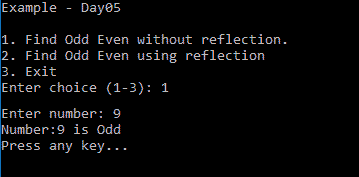
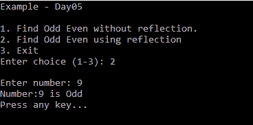
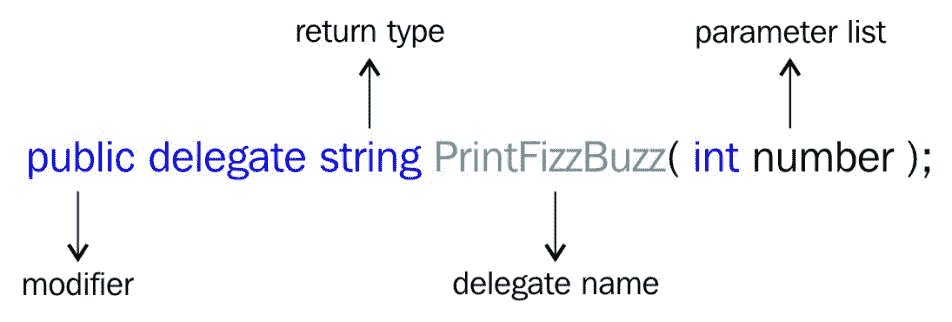
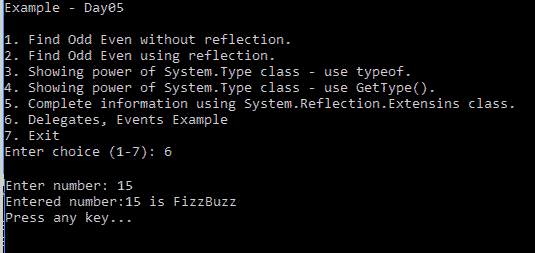
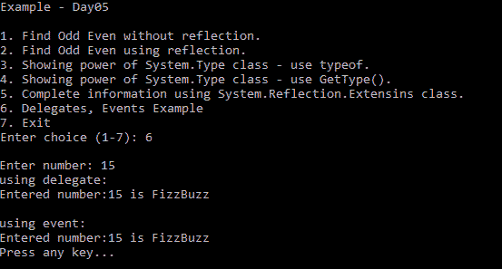
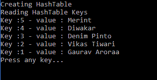
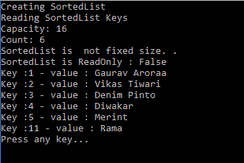
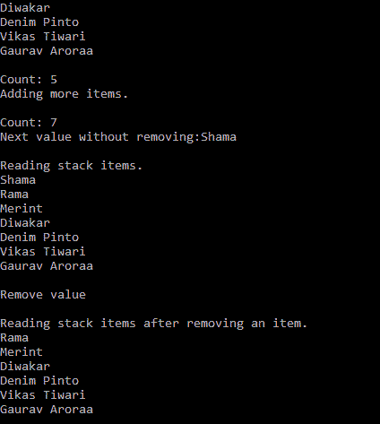
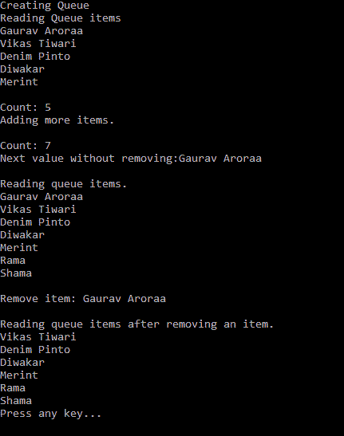

# 第五章：第 05 天 - 反射和集合概述

今天是我们七天学习系列的第五天。到目前为止，我们已经深入了解了 C#语言，并了解了如何处理语句、循环、方法等。今天，我们将学习在编写代码时动态工作的最佳方法。

我们有很多方法可以动态实现代码更改并生成整个编程类。今天，我们将涵盖以下主题：

+   什么是反射？

+   委托和事件概述

+   集合和非泛型

# 什么是反射？

简而言之，反射是一种进入程序内部的方法，收集程序/代码的对象信息和/或在运行时调用这些信息。因此，借助反射，我们可以通过在 C#中编写代码来分析和评估我们的代码。要详细了解反射，让我们以`class` `OddEven`的例子来说明。这是这个类的部分代码：

```cs
public class OddEven
{
   public string PrintOddEven(int startNumber, int
   lastNumber)
   {
     return GetOddEvenWithinRange(startNumber,
     lastNumber);
   }
   public string PrintSingleOddEven(int number) => CheckSingleNumberOddEvenPrimeResult(number);
   private string CheckSingleNumberOddEvenPrimeResult(int
   number)
   {
      var result = string.Empty;
      result = CheckSingleNumberOddEvenPrimeResult(result,
      number);
      return result;
   }
   //Rest code is omitted
}
```

通过查看代码，我们可以说这段代码有一些公共方法和私有方法。公共方法利用私有方法来满足各种功能需求，并执行任务以解决我们需要识别奇数或偶数的实际问题。

当我们需要利用前面的类时，我们必须实例化这个类，然后调用它们的方法来获取结果。以下是我们如何利用这个简单类来获取结果：

```cs
class Program
{
   static void Main(string[] args)
   {
      int userInput;
      do
      {
         userInput = DisplayMenu();
         switch (userInput)
         {
            case 1:
            Console.Clear();
            Console.Write("Enter number: ");
            var number = Console.ReadLine();
            var objectOddEven = new OddEven();
            var result =           
            objectOddEven.PrintSingleOddEven
            (Convert.ToInt32(number));
            Console.WriteLine
            ($"Number:{number} is {result}");
            PressAnyKey();
            break;
            //Rest code is omitted
         } while (userInput != 3);
       }
    //Rest code is ommitted
}
PrintSingleOddEven to check whether an entered number is odd or even. The following screenshot shows the output of our implementation:
```



前面的代码显示了我们可以实现代码的一种方式。同样，我们可以使用相同的解决方案来分析代码。我们已经说过反射是分析我们的代码的一种方法。在接下来的部分，我们将实现和讨论类似实现的代码，但使用反射。

您需要添加以下 NuGet 包来使用反射，使用包管理器控制台：install-`Package System.Reflection`。

```cs
Reflection to solve the same problem and achieve the same results:
```

```cs
class Program
{
   private static void Main(string[] args)
   {
      int userInput;
      do
      {
         userInput = DisplayMenu();
         switch (userInput)
         {
            //Code omitted
            case 2:
            Console.Clear();
            Console.Write("Enter number: ");
            var num = Console.ReadLine();
            Object objInstance = 
            Activator.CreateInstance(typeof(OddEven));
            MethodInfo method = 
            typeof(OddEven).GetMethod
            ("PrintSingleOddEven");
            object res = method.Invoke
            (objInstance, new object[] 
            { Convert.ToInt32(num) });
            Console.WriteLine($"Number:{num} is {res}");
            PressAnyKey();
            break;
         }
      } while (userInput != 3);
    }
   //code omitted
}
MethodInfo with the use of System.Reflection and thereafter invoking the method by passing the required parameters. The preceding example is the simplest one to showcase the power of Reflection; we can do more things with the use of Reflection.
```

在前面的代码中，我们可以使用`Assembly.CreateInstance("OddEven")`来代替`Activator.CreateInstance(typeof(OddEven))`。`Assembly.CreateInstance`查看程序集的类型，并使用`Activator.CreateInstance`创建实例。有关`Assembly`，`CreateInstance`的更多信息，请参阅：[`docs.microsoft.com/en-us/dotnet/api/system.reflection.assembly.createinstance?view=netstandard-2.0#System_Reflection_Assembly_CreateInstance_System_String_`](https://docs.microsoft.com/en-us/dotnet/api/system.reflection.assembly.createinstance?view=netstandard-2.0#System_Reflection_Assembly_CreateInstance_System_String_)。

以下是前面代码的输出：



# 反射的应用

在前一节中，我们了解了反射以及如何利用`Reflection`的能力来分析代码。在本节中，我们将看到更复杂的场景，我们可以在其中使用`Reflection`并更详细地讨论`System.Type`和`System.Reflection`。

# 获取类型信息

有一个`System.Type`类可用，它为我们提供了关于我们对象类型的完整信息：我们可以使用`typeof`来获取关于我们类的所有信息。让我们看下面的代码片段：

```cs
class Program
{
   private static void Main(string[] args)
   {
      int userInput;
      do
      {
         userInput = DisplayMenu();
         switch (userInput)
         {
            // code omitted
            case 3:
            Console.Clear();
            Console.WriteLine
            ("Getting information using 'typeof' operator
            for class 'Day05.Program");
            var typeInfo = typeof(Program);
            Console.WriteLine();
            Console.WriteLine("Analysis result(s):");
            Console.WriteLine
            ("=========================");
            Console.WriteLine($"Assembly:
            {typeInfo.AssemblyQualifiedName}");
            Console.WriteLine($"Name:{typeInfo.Name}");
            Console.WriteLine($"Full Name:
            {typeInfo.FullName}");
            Console.WriteLine($"Namespace:
            {typeInfo.Namespace}");
            Console.WriteLine
            ("=========================");
            PressAnyKey();
            break;
            code omitted
          }
       } while (userInput != 5);
   }
      //code omitted
}
typeof to gather the information on our class Program. The typeof operator represents a type declaration here; in our case, it is a type declaration of class Program. Here is the result of the preceding code:
```


在同一个节点上，我们可以使用`System.Type`类的`GetType()`方法，该方法获取类型并提供信息。让我们分析和讨论以下代码片段：

```cs
internal class Program
{
   private static void Main(string[] args)
   {
      int userInput;
      do
      {
         userInput = DisplayMenu();
         switch (userInput)
         {
            //code omitted
            case 4:
            Console.Clear();
            Console.WriteLine("Getting information using 
            'GetType()' method for class
            'Day05.Program'");
            var info = Type.GetType("Day05.Program");
            Console.WriteLine();
            Console.WriteLine("Analysis result(s):");
            Console.WriteLine
            ("=========================");
            Console.WriteLine($"Assembly:
            {info.AssemblyQualifiedName}");
            Console.WriteLine($"Name:{info.Name}");
            Console.WriteLine($"Full Name:
            {info.FullName}");
            Console.WriteLine($"Namespace: 
            {info.Namespace}");
            Console.WriteLine
            ("=========================");
            PressAnyKey();
            break;
         }
      } while (userInput != 5);
   }
 //code omitted
}
class Program with the use of GetMethod(), and it results in the following:
```


在前面的部分讨论的代码片段中，有一个代表`System.Type`类的类型，然后我们使用属性收集信息。这些属性在下表中解释：

| **属性名称** | **描述** |
| --- | --- |
| **名称** | 返回类型的名称，例如，`Program` |
| **完整名称** | 返回类型的完全限定名称，不包括程序集名称，例如，`Day05.Program` |
| **命名空间** | 返回类型的命名空间，例如，`Day05`。如果没有命名空间，则此属性返回 null |

这些属性是只读的（属于抽象类`System.Type`）；这意味着我们只能读取或获取结果，但不能设置值。

`System.Reflection.TypeExtensions`类具有我们分析和动态编写代码所需的一切。完整的源代码可在[`github.com/dotnet/corefx/blob/master/src/System.Reflection.TypeExtensions/src/System/Reflection/TypeExtensions.cs`](https://github.com/dotnet/corefx/blob/master/src/System.Reflection.TypeExtensions/src/System/Reflection/TypeExtensions.cs)上找到。

本书不涵盖所有扩展方法的实现，因此我们添加了以下表格，其中包含所有重要扩展方法的详细信息：

| **方法名** | **描述** | **来源 (** [`github.com/dotnet/corefx/blob/master/src`](https://github.com/dotnet/corefx/blob/master/src) ) |
| --- | --- | --- |
| `GetConstructor(Type type, Type[] types)` | 在提供的类型上执行，并返回`System.Reflection.ConstructorInfo`类型的输出 | `/System.Reflection.Emit/ref/System.Reflection.Emit.cs` |
| `ConstructorInfo[] GetConstructors(Type type)` | 返回提供的类型的所有构造函数信息和`System.Reflection.ConstructorInfo`数组输出 | `/System.Reflection.Emit/ref/System.Reflection.Emit.cs` |
| `ConstructorInfo[] GetConstructors(Type type, BindingFlags bindingAttr)` | 返回提供的类型和属性的所有构造函数信息 | `/System.Reflection.Emit/ref/System.Reflection.Emit.cs` |
| `MemberInfo[] GetDefaultMembers(Type type)` | 获取提供的属性的访问权限，对于成员，对于给定类型，并输出`System.Reflection.MemberInfo`数组 | `/System.Reflection.Emit/ref/System.Reflection.Emit.cs` |
| `EventInfo` `GetEvent(Type type, string name)` | 提供对`System.Reflection.MemberInfo`的`EventMetadata`输出的访问 | `/System.Reflection.Emit/ref/System.Reflection.Emit.cs` |
| `FieldInfo GetField(Type type, string name)` | 获取指定类型的字段信息，并返回提供的字段名称的`System.Reflection.FieldInfo`输出 | `/System.Reflection.Emit/ref/System.Reflection.Emit.cs` |
| `MemberInfo[] GetMember(Type type, string name)` | 通过成员名称获取指定类型的成员信息，此方法输出`System.Reflection.MemberInfo`数组 | `/System.Reflection.Emit/ref/System.Reflection.Emit.cs` |
| `PropertyInfo[] GetProperties(Type type)` | 为指定类型提供所有属性，并输出为`System.Reflection.PropertyInfo`数组 | `/System.Reflection.Emit/ref/System.Reflection.Emit.cs` |

尝试使用一个简单的程序来实现所有扩展方法。

在之前的章节中，我们学习了如何使用`Reflection`来分析我们的已编译代码/应用程序。当我们有现有的代码时，`Reflection`可以很好地工作。想象一种情况，我们需要一些动态代码生成逻辑。假设我们需要生成一个简单的类，如下面的代码片段中所述：

```cs
public class MathClass
{
   private readonly int _num1;
   private readonly int _num2;
   public MathClass(int num1, int num2)
   {
      _num1 = num1;
      _num2 = num2;
   }
     public int Sum() => _num1 + _num2;
     public int Substract() => _num1 - _num2;
     public int Division() => _num1 / _num2;
     public int Mod() => _num1 % _num2;
}
```

仅使用`Reflection`无法创建或编写纯动态代码或即时代码。借助`Reflection`，我们可以分析我们的`MathClass`，但是我们可以使用`Reflection.Emit`来即时创建这个类。

动态代码生成超出了本书的范围。您可以参考以下主题获取更多信息：[`stackoverflow.com/questions/41784393/how-to-emit-a-type-in-net-core`](https://stackoverflow.com/questions/41784393/how-to-emit-a-type-in-net-core)

# 委托和事件概述

在本节中，我们将讨论委托和事件的基础知识。委托和事件都是 C#语言最先进的特性。我们将在接下来的章节中详细了解这些内容。

# 委托

在 C#中，委托是类似于 C 和 C++中的函数指针的概念。委托只是一个引用类型的变量，它保存了一个方法的引用，并触发该方法。

我们可以使用委托实现后期绑定。在第七章，*使用 C#理解面向对象编程*中，我们将详细讨论后期绑定。

`System.Delegate`是所有委托派生的类。我们使用委托来实现事件。

# 声明委托类型

声明委托类型类似于方法签名类。我们只需要声明一个类型 public delegate string: `PrintFizzBuzz(int number);`。在前面的代码中，我们声明了一个委托类型。这个声明类似于一个抽象方法，不同之处在于委托声明有一个委托类型。我们只声明了一个委托类型`PrintFizzBuzz`，它接受一个 int 类型的参数并返回字符串的结果。我们只能声明 public 或 internal 可访问的委托。

默认情况下，委托的可访问性是 internal。



在前面的图中，我们可以分析委托声明的语法。如果我们看到这个图，我们会注意到它以 public 开头，然后是关键字 delegate，这告诉我们这是一个委托类型，字符串，它是一个返回类型，我们的语法以名称和传递参数结束。以下表定义了声明的主要部分：

| **语法部分** | **描述** |
| --- | --- |
| 修饰符 | 修饰符是委托类型的定义可访问性。这些修饰符只能是 public 或 internal，默认情况下委托类型的修饰符是 internal。 |
| 返回类型 | 委托可以返回或不返回结果；可以是任何类型或 void。 |
| 名称 | 声明的委托的名称。委托类型的名称遵循与典型类相同的规则，如第二天所讨论的。 |
| 参数列表 | 典型的参数列表；参数可以是任何类型。 |

# 委托的实例

在前一节中，我们创建了一个名为`PrintFizzBuzz`的委托类型。现在我们需要声明这种类型的一个实例，这样我们就可以在我们的代码中使用它。这类似于我们声明变量的方式-请参考第二天了解更多关于变量声明的内容。以下代码片段告诉我们如何声明我们委托类型的一个实例：

`PrintFizzBuzz printFizzBuzz;`

# 委托的使用

我们可以直接通过调用匹配方法来使用委托类型，这意味着委托类型调用相关方法。在下面的代码片段中，我们只是调用一个方法：

```cs
internal class Program
{
   private static PrintFizzBuzz _printFizzBuzz;
   private static void Main(string[] args)
   {
      int userInput;
      do
      {
         userInput = DisplayMenu();
         switch (userInput)
         {
            //code omitted
            case 6:
            Clear();
            Write("Enter number: ");
            var inputNum = ReadLine();
            _printFizzBuzz = FizzBuzz.PrintFizzBuzz;
            WriteLine($"Entered number:{inputNum} is
            {_printFizzBuzz(Convert.ToInt32(inputNum))}");
            PressAnyKey();
            break;
         }
      } while (userInput != 7);
   }
```

在前一节中编写的代码片段中，我们从用户那里获取输入，然后借助委托获得预期的结果。以下屏幕截图显示了前面代码的完整输出：



更高级的委托，即多播和强类型的委托将在第六天讨论。

# 事件

一般来说，每当事件出现时，我们可以考虑用户的行为或用户行为。我们日常生活中有一些例子；比如我们检查邮件，发送邮件等。像点击邮件客户端中的发送按钮或接收按钮这样的操作只是事件。

事件是类型的成员，而这个类型是委托类型。这些成员在触发时通知其他类型。

事件使用发布者-订阅者模型。发布者只是一个具有事件和委托定义的对象。另一方面，订阅者是接受事件并提供事件处理程序的对象（事件处理程序只是由发布者类中的委托调用的方法）。

# 声明事件

在声明事件之前，我们应该有一个委托类型，所以我们应该首先声明一个委托。以下代码片段显示了委托类型：

```cs
public delegate string FizzBuzzDelegate(int num);
The following code snippet shows event declaration:
public event FizzBuzzDelegate FizzBuzzEvent;
The following code snippet shows a complete implementation of an event to find FizzBuzz numbers:
public delegate string FizzBuzzDelegate(int num);
public class FizzBuzzImpl
{
   public FizzBuzzImpl()
   {
      FizzBuzzEvent += PrintFizzBuzz;
   }
      public event FizzBuzzDelegate FizzBuzzEvent;
      private string PrintFizzBuzz(int num) => FizzBuzz.PrintFizzBuzz(num);
      public string EventImplementation(int num)
   {
      var fizzBuzImpl = new FizzBuzzImpl();
      return fizzBuzImpl.FizzBuzzEvent(num);
   }
}
FizzBuzzEvent that is attached to a delegate type named FizzBuzzDelegate, which called a method PrintFizzBuzz on instantiation of our class named FizzBuzzImpl. Hence, whenever we call our event FizzBuzzEvent, it automatically calls a method PrintFizzBuzz and returns the expected results:
```



# 集合和非泛型

在第二天，我们学习了数组，它们是固定大小的，并且您可以使用它们来进行强类型列表对象。但是，如果我们想要将这些对象使用或组织到其他数据结构中，例如队列、列表、堆栈等，怎么办？所有这些都可以通过使用集合（`System.Collections`）来实现。

有多种方法可以使用集合来玩耍数据（存储和检索）。以下是我们可以使用的主要集合类。

`System.Collections.NonGeneric` ([`www.nuget.org/packages/System.Collections.NonGeneric/`](https://www.nuget.org/packages/System.Collections.NonGeneric/) )是一个 NuGet 包，它提供了所有非泛型类型，如`ArrayList`、`HashTable`、`Stack`、`SortedList`、`Queue`等。

# ArrayList

由于它是一个数组，它包含一个有序的对象集合，并且可以单独进行索引。由于这是一个非泛型类，因此它在`System.Collections.NonGeneric`的单独 NuGet 包中可用。要使用示例代码，您首先应安装此 NuGet 包。

# 声明 ArrayList

```cs
ArrayList:
```

```cs
ArrayList arrayList = new ArrayList();
ArrayList arrayList1 = new ArrayList(capacity);
ArrayList arrayList2 = new ArrayList(collection);
arrayList is initialized using the default constructor. arrayList1 is initialized for a specific initial capacity. arrayList2 is initialized using an element of another collection.
```

`ArrayList`的属性和方法对于向集合中添加、存储或移除数据项非常重要。`ArrayList`类有许多属性和方法可用。在接下来的部分中，我们将讨论常用的方法和属性。

# 属性

`ArrayList`的属性在分析现有的`ArrayList`时起着至关重要的作用；以下是常用的属性：

| **属性** | **描述** |
| --- | --- |

| `Capacity` | 一个 getter setter 属性；通过使用它，我们可以设置或获取`ArrayList`的元素数量。例如：

```cs
ArrayList arrayList = new ArrayList {Capacity = 50};
```

|

| `Count` | `ArrayList`包含的实际元素总数。请注意，此计数可能与容量不同。例如：

```cs
ArrayList arrayList = new ArrayList {Capacity = 50};
var numRandom = new Random(50);
for (var countIndex = 0; countIndex < 50; countIndex++)
arrayList.Add(numRandom.Next(50));
```

|

| `IsFixedSize` | 一个 getter 属性，根据`ArrayList`是否为固定大小返回 true/false。例如：

```cs
ArrayList arrayList = new ArrayList();
var arrayListIsFixedSize = arrayList.IsFixedSize;
```

|

# 方法

正如我们在前一节中讨论的，属性在我们使用`ArrayList`时起着重要作用。在同一节点上，方法为我们提供了一种在使用非泛型集合时添加、删除或执行其他操作的方式：

| **方法** | **描述** |
| --- | --- |

| `Add (object value)` | 将对象添加到`ArrayList`的末尾。例如：

```cs
ArrayList arrayList = new ArrayList {Capacity = 50};
var numRandom = new Random(50);
for (var countIndex = 0; countIndex < 50; countIndex++)
arrayList.Add(numRandom.Next(50));
```

|

| `Void Clear()` | 从`ArrayList`中移除所有元素。例如：

```cs
arrayList.Clear();
```

|

| `Void Remove(object obj)` | 从集合中移除第一次出现的元素。例如：

```cs
arrayList.Remove(15);
```

|

| `Void Sort()` | 对`ArrayList`中的所有元素进行排序。 |
| --- | --- |

```cs
ArrayList:
```

```cs
public void ArrayListExample(int count)
{
var arrayList = new ArrayList();
var numRandom = new Random(count);
WriteLine($"Creating an ArrayList with capacity: {count}");
for (var countIndex = 0; countIndex < count; countIndex++)
arrayList.Add(numRandom.Next(count));
WriteLine($"Capacity: {arrayList.Capacity}");
WriteLine($"Count: {arrayList.Count}");
Write("ArrayList original contents: ");
PrintArrayListContents(arrayList);
WriteLine();
arrayList.Reverse();
Write("ArrayList reversed contents: ");
PrintArrayListContents(arrayList);
WriteLine();
Write("ArrayList sorted Content: ");
arrayList.Sort();
PrintArrayListContents(arrayList);
WriteLine();
ReadKey();
}
```

以下是前面程序的输出：


您将在第六天学习所有集合和泛型的高级概念。

# HashTable

`hashTable`是一种非泛型类型，它只是键/值对集合的表示，并且是根据键（即哈希码）组织的。当我们需要根据键访问数据时，建议使用`hashTable`。

# 声明 HashTable

`Hashtable`可以通过初始化`Hashtable`类来声明；以下代码片段显示了相同的内容：

```cs
Hashtable hashtable = new Hashtable();
```

接下来我们将讨论`HashTable`的常用方法和属性。

# 属性

`hashTable`的属性在分析现有的`HashTable`时起着至关重要的作用；以下是常用的属性：

| **属性** | **描述** |
| --- | --- |

| `Count` | 一个 getter 属性；返回`HashTable`中键/值对的数量。例如：

```cs
var hashtable = new Hashtable
{
{1, "Gaurav Aroraa"},
{2, "Vikas Tiwari"},
{3, "Denim Pinto"},
{4, "Diwakar"},
{5, "Merint"}
};
var count = hashtable.Count;
```

|

| `IsFixedSize` | 一个 getter 属性；根据`HashTable`是否为固定大小返回 true/false。例如：

```cs
var hashtable = new Hashtable
{
{1, "Gaurav Aroraa"},
{2, "Vikas Tiwari"},
{3, "Denim Pinto"},
{4, "Diwakar"},
{5, "Merint"}
};
var fixedSize = hashtable.IsFixedSize ? " fixed size." : " not fixed size.";
WriteLine($"HashTable is {fixedSize} .");
```

|

| `IsReadOnly` | 一个 getter 属性；告诉我们`HashTable`是否是只读的。例如：

```cs
WriteLine($"HashTable is ReadOnly : {hashtable.IsReadOnly} ");
```

|

# 方法

`HashTable`的方法通过提供更多操作的方式来添加、删除和分析集合，如下表所述：

| **方法** | **描述** |
| --- | --- |

| `Add (object key, object value)` | 向`HashTable`添加特定键和值的元素。例如：

```cs
var hashtable = new Hashtable
hashtable.Add(11,"Rama");
```

|

| `Void Clear()` | 从`HashTable`中移除所有元素。例如：

```cs
hashtable.Clear();
```

|

| `Void Remove (object key)` | 从 HashTable 中移除指定键的元素。例如：

```cs
hashtable.Remove(15);
```

|

```cs
HashTable collection, and will try to reiterate its keys:
```

```cs
public void HashTableExample()
{
   WriteLine("Creating HashTable");
   var hashtable = new Hashtable
   {
      {1, "Gaurav Aroraa"},
      {2, "Vikas Tiwari"},
      {3, "Denim Pinto"},
      {4, "Diwakar"},
      {5, "Merint"}
   };
      WriteLine("Reading HashTable Keys");
      foreach (var hashtableKey in hashtable.Keys)
   {
      WriteLine($"Key :{hashtableKey} - value :
      {hashtable[hashtableKey]}");
   }
}
```

以下是前面代码的输出：



# SortedList

`SortedList`类是一个非泛型类型，它只是一个基于键的键/值对集合的表示，按键排序。`SortedList`是`ArrayList`和`HashTable`的组合。因此，我们可以通过键或索引访问元素。

# SortedList 的声明

`SortedList`可以通过初始化`SortedList`类来声明；以下代码片段显示了相同的方式：

```cs
SortedList sortedList = new SortedList();
```

接下来我们将讨论`SortedList`的常用方法和属性。

# 属性

`SortedList`的属性在分析现有的`SortedList`时起着至关重要的作用；以下是常用的属性：

| **属性** | **描述** |
| --- | --- |

| `Capacity` | 一个 getter setter 属性；通过使用这个属性，我们可以设置或获取`SortedList`的容量。例如：

```cs
var sortedList = new SortedList
{
{1, "Gaurav Aroraa"},
{2, "Vikas Tiwari"},
{3, "Denim Pinto"},
{4, "Diwakar"},
{5, "Merint"},
{11, "Rama"}
};
WriteLine($"Capacity: {sortedList.Capacity}");
```

|

| `Count` | 一个 getter 属性；返回`HashTable`中键/值对的数量。例如：

```cs
var sortedList = new SortedList
{
{1, "Gaurav Aroraa"},
{2, "Vikas Tiwari"},
{3, "Denim Pinto"},
{4, "Diwakar"},
{5, "Merint"},
{11, "Rama"}
};
WriteLine($"Capacity: {sortedList.Count}");
```

|

| `IsFixedSize` | 一个 getter 属性；根据`SortedList`是否是固定大小返回 true/false。例如：

```cs
var sortedList = new SortedList
{
{1, "Gaurav Aroraa"},
{2, "Vikas Tiwari"},
{3, "Denim Pinto"},
{4, "Diwakar"},
{5, "Merint"},
{11, "Rama"}
};
ar fixedSize = sortedList.IsFixedSize ? " fixed size." : " not fixed size.";
WriteLine($"SortedList is {fixedSize} .");
```

|

| `IsReadOnly` | 一个 getter 属性；告诉我们`SortedList`是否是只读的。例如：

```cs
WriteLine($"SortedList is ReadOnly : {sortedList.IsReadOnly} ");
```

|

# 方法

以下是常用的方法：

| **方法** | **描述** |
| --- | --- |

| `Add (object key, object value)` | 向`SortedList`添加特定键和值的元素。例如：

```cs
var sortedList = new SortedList
sortedList.Add(11,"Rama");
```

|

| `Void Clear()` | 从`SortedList`中移除所有元素。例如：

```cs
sortedList.Clear();
```

|

| `Void Remove (object key)` | 从`SortedList`中移除指定键的元素。例如：

```cs
sortedList.Remove(15);
```

|

在接下来的部分中，我们将使用前面部分提到的属性和方法来实现代码。让我们使用`SortedList`收集《7 天学会 C#》一书的所有利益相关者列表：

```cs
public void SortedListExample()
{
   WriteLine("Creating SortedList");
   var sortedList = new SortedList
   {
      {1, "Gaurav Aroraa"},
      {2, "Vikas Tiwari"},
      {3, "Denim Pinto"},
      {4, "Diwakar"},
      {5, "Merint"},
      {11, "Rama"}
   };
   WriteLine("Reading SortedList Keys");
   WriteLine($"Capacity: {sortedList.Capacity}");
   WriteLine($"Count: {sortedList.Count}");
   var fixedSize = sortedList.IsFixedSize ? " fixed
   size." :" not fixed size.";
   WriteLine($"SortedList is {fixedSize} .");
   WriteLine($"SortedList is ReadOnly :
   {sortedList.IsReadOnly} ");
   foreach (var key in sortedList.Keys)
   {
      WriteLine($"Key :{key} - value :
      {sortedList[key]}");
   }
}
```

以下是前面代码的输出：



# 栈

一个非泛型类型，表示对象的**后进先出（LIFO）**集合。它包含两个主要的操作：`Push`和`Pop`。当我们向列表中插入一个项目时，称为推入，当我们从列表中提取/移除一个项目时，称为弹出。当我们在不移除列表中的项目的情况下获取一个对象时，称为查看。

# 栈的声明

`Stack`的声明与我们声明其他非泛型类型的方式非常相似。以下代码片段显示了相同的方式：

```cs
Stack stackList = new Stack();
```

我们将讨论`Stack`的常用方法和属性。

# 属性

`Stack`类只有一个属性，用于告诉计数：

| **属性** | **描述** |
| --- | --- |

| `Count` | 一个 getter 属性；返回栈包含的元素数量。例如：

```cs
var stackList = new Stack();
stackList.Push("Gaurav Aroraa");
stackList.Push("Vikas Tiwari");
stackList.Push("Denim Pinto");
stackList.Push("Diwakar");
stackList.Push("Merint");
WriteLine($"Count: {stackList.Count}");
```

|

# 方法

以下是常用的方法：

| **方法** | **描述** |
| --- | --- |

| `Object Peek()` | 返回栈顶的对象，但不移除它。例如：

```cs
WriteLine($"Next value without removing:{stackList.Peek()}");
```

|

| `Object Pop()` | 移除并返回栈顶的对象。例如：

```cs
WriteLine($"Remove item: {stackList.Pop()}");
```

|

| `Void Push(object obj)` | 在栈顶插入一个对象。例如：

```cs
WriteLine("Adding more items.");
stackList.Push("Rama");
stackList.Push("Shama");
```

|

| `Void Clear()` | 从栈中移除所有元素。例如：

```cs
var stackList = new Stack();
stackList.Push("Gaurav Aroraa");
stackList.Push("Vikas Tiwari");
stackList.Push("Denim Pinto");
stackList.Push("Diwakar");
stackList.Push("Merint");
stackList.Clear();
```

|

以下是栈的完整示例：

```cs
public void StackExample()
{
   WriteLine("Creating Stack");
   var stackList = new Stack();
   stackList.Push("Gaurav Aroraa");
   stackList.Push("Vikas Tiwari");
   stackList.Push("Denim Pinto");
   stackList.Push("Diwakar");
   stackList.Push("Merint");
   WriteLine("Reading stack items");
   ReadingStack(stackList);
   WriteLine();
   WriteLine($"Count: {stackList.Count}");
   WriteLine("Adding more items.");
   stackList.Push("Rama");
   stackList.Push("Shama");
   WriteLine();
   WriteLine($"Count: {stackList.Count}");
   WriteLine($"Next value without removing:
   {stackList.Peek()}");
   WriteLine();
   WriteLine("Reading stack items.");
   ReadingStack(stackList);
   WriteLine();
   WriteLine("Remove value");
   stackList.Pop();
   WriteLine();
   WriteLine("Reading stack items after removing an
   item.");
   ReadingStack(stackList);
   ReadLine();
}
```

前面的代码使用`Stack`捕获了《7 天学会 C#》一书的利益相关者列表，并展示了前几节讨论的属性和方法的用法。这段代码产生了以下截图中显示的输出：



# Queue

队列只是一个表示对象的 FIFO 集合的非泛型类型。`queue`有两个主要操作：添加项目时称为 enqueuer，移除项目时称为`dequeue`。

# 队列的声明

`Queue`的声明与我们声明其他非泛型类型的方式非常相似。以下代码片段显示了相同的方式：

```cs
Queue queue = new Queue();
```

我们将讨论`Queue`的常用方法和属性。

# 属性

`Queue`类只有一个属性，用于告诉计数：

| **属性** | **描述** |
| --- | --- |

| `Count` | 一个 getter 属性；返回`queue`包含的元素数量。例如：

```cs
Queue queue = new Queue();
queue.Enqueue("Gaurav Aroraa");
queue.Enqueue("Vikas Tiwari");
queue.Enqueue("Denim Pinto");
queue.Enqueue("Diwakar");
queue.Enqueue("Merint");
WriteLine($"Count: {queue.Count}");
```

|

# 方法

以下是常用的方法：

| **方法** | **描述** |
| --- | --- |

| `Object Peek()` | 返回`queue`顶部的对象，但不移除它。例如：

```cs
WriteLine($"Next value without removing:{stackList.Peek()}");
```

|

| `Object Dequeue()` | 移除并返回`queue`开头的对象。例如：

```cs
WriteLine($"Remove item: {queue.Dequeue()}");
```

|

| `Void Enqueue (object obj)` | 在`queue`的末尾插入一个对象。例如：

```cs
WriteLine("Adding more items.");
queue.Enqueue("Rama");
```

|

| `Void Clear()` | 从`Queue`中移除所有元素。例如：

```cs
Queue queue = new Queue();
queue.Enqueue("Gaurav Aroraa");
queue.Enqueue("Vikas Tiwari");
queue.Enqueue("Denim Pinto");
queue.Enqueue("Diwakar");
queue.Enqueue("Merint");
queue.Clear();
```

|

```cs
Enqueue and Dequeue methods to add and remove the items from the collections stored using queue:
```

```cs
public void QueueExample()
{
   WriteLine("Creating Queue");
   var queue = new Queue();
   queue.Enqueue("Gaurav Aroraa");
   queue.Enqueue("Vikas Tiwari");
   queue.Enqueue("Denim Pinto");
   queue.Enqueue("Diwakar");
   queue.Enqueue("Merint");
   WriteLine("Reading Queue items");
   ReadingQueue(queue);
   WriteLine();
   WriteLine($"Count: {queue.Count}");
   WriteLine("Adding more items.");
   queue.Enqueue("Rama");
   queue.Enqueue("Shama");
   WriteLine();
   WriteLine($"Count: {queue.Count}");
   WriteLine($"Next value without removing:
   {queue.Peek()}");
   WriteLine();
   WriteLine("Reading queue items.");
   ReadingQueue(queue);
   WriteLine();
   WriteLine($"Remove item: {queue.Dequeue()}");
   WriteLine();
   WriteLine("Reading queue items after removing an
   item.");
   ReadingQueue(queue);
}
```

以下是前述代码的输出：



# BitArray

BitArray 实际上是一个管理位值数组的数组。这些值被表示为布尔值。True 表示位是*ON*（1），false 表示位是*OFF*（0）。当我们需要存储位时，这个非泛型集合类是很重要的。

BitArray 的实现没有涵盖。请参考本章末尾的练习来实现 BitArray。

我们在本章讨论了非泛型集合。泛型集合超出了本章的范围；我们将在第六天讨论它们。要比较不同的集合，请参考[`www.codeproject.com/Articles/832189/List-vs-IEnumerable-vs-IQueryable-vs-ICollection-v`](https://www.codeproject.com/Articles/832189/List-vs-IEnumerable-vs-IQueryable-vs-ICollection-v)。

# 动手练习

解决以下问题，涵盖了今天学习的概念：

1.  什么是反射？编写一个使用`System.Type`的简短程序。

1.  创建一个包含至少三个属性、两个构造函数、两个公共方法和三个私有方法的类，并实现至少一个接口。

1.  编写一个程序，使用`System.Reflection.Extensins`来评估问题二中创建的类。

1.  学习 NuGet 包`System.Reflection.TypeExtensions`，并编写一个程序来实现它的所有功能。

1.  学习 NuGet 包`System.Reflection. Primitives`，并编写一个程序来实现它的所有功能。

1.  委托类型是什么，如何定义多播委托？

1.  什么是事件？事件是基于发布者-订阅者模型的吗？用一个现实世界的例子来展示这一点。

1.  编写一个使用委托和事件的程序，以获得类似于[`github.com/garora/TDD-Katas#string-sum-kata`](https://github.com/garora/TDD-Katas#string-sum-kata)的输出。

1.  定义集合并实现非泛型类型。

参考我们从第一天开始的问题，元音计数问题，并使用所有非泛型集合类型来实现它。

# 重温第 05 天

今天，我们讨论了 C#的非常重要的概念，涵盖了反射、集合、委托和事件。

我们在代码分析方法中讨论了反射的重要性。在讨论过程中，我们实现了展示反射的强大之处的代码，分析了完整的代码。

然后我们讨论了委托和事件，以及委托和事件在 C#中的工作原理。我们还实现了委托和事件。

我们详细讨论了 C#语言的一个重要特性，即非泛型类型，即`ArrayList`、`HashTable`、`SortedList`、`Queue`、`Stack`等。我们使用 C# 7.0 代码实现了所有这些。
