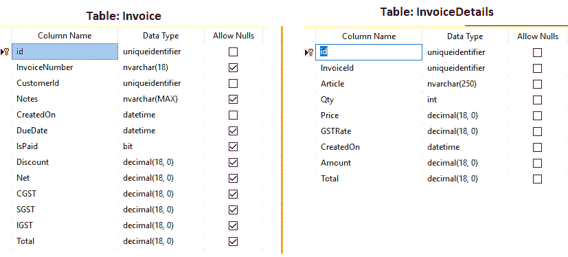

# 第八章：第 08 天-测试你的技能-构建一个真实世界的应用程序

在第七天，我们学习了 C# 7.0 中的面向对象编程概念。通过对面向对象编程概念的理解，我们这个学习系列的旅程需要一个实际的、实践的、真实世界的应用程序，这就是我们在这里的原因。今天是我们七天学习系列的复习日。在过去的七天里，我们学到了很多东西，包括以下内容：

+   .NET Framework 和.NET Core

+   基本的 C#概念，包括语句，循环，类，结构等

+   包括委托，泛型，集合，文件处理，属性等在内的高级 C#概念

+   C# 7.0 和 C# 7.1 的新功能

在过去的七天里，我们通过代码片段详细讨论了上述主题，并详细讨论了代码。我们从第一天开始涵盖了非常基本的概念，第二天和第三天涵盖了中级内容，然后逐渐通过代码解释讨论了高级主题。

今天，我们将重新审视一切，并在 C# 7.0 中构建一个真实世界的应用程序。以下是我们将遵循的步骤来完成应用程序：

1.  讨论我们应用程序的要求。

1.  为什么我们要开发这个应用程序？

1.  开始应用程序开发：

+   先决条件

+   数据库设计

+   讨论基本架构

# 为什么我们要开发这个应用程序？

我们的应用程序将基于印度的 GST 税收系统（[`www.gstn.org/`](http://www.gstn.org/)）。在印度，这个系统最近宣布，行业内急需尽快采用。现在是创建一个实际应用程序，让我们获得实际经验的正确时机。

讨论我们应用程序的要求：

在本节中，我们将讨论我们的应用程序并制定它。首先，让我们为我们的应用程序决定一个名称；让我们称之为*FlixOneInvoicing*—一个生成发票的系统。如前所述，今天的行业需要一个系统，可以满足其需求，以满足我们通过我们的基于 GST 的应用程序示例所展示的 GST 的所有部分。以下是系统的主要要求：

+   系统应该是公司特定的，并且公司应该是可配置的

+   公司可以有多个地址（注册和送货地址可能不同）

+   公司可以是个人或注册实体

+   系统应该具有客户功能

+   系统应该支持服务和商品行业

+   系统应该遵循印度的 GST 规定

+   系统应该具有报告功能

+   系统应该有基本操作，如添加，更新，删除等

上述高级要求让我们了解了我们将要开发的系统的类型。在接下来的章节中，我们将根据这些要求开发一个应用程序。

# 开始应用程序开发

在之前的章节中，我们讨论了为什么我们要开发这个应用程序以及为什么它是必需的，根据行业需求。我们还讨论了基本的系统要求，并在理论上制定了系统，以便在我们开始实际编码时，我们可以遵循所有这些规则/要求。在本节中，我们将开始实际开发。

# 先决条件

要开始开发这个应用程序，我们需要以下先决条件：

+   Visual Studio 2017 更新 3 或更高版本

+   SQL Server 2008 R2 或更高版本

+   C# 7.0 或更高版本

+   ASP.NET Core

+   Entity Framework Core

# 数据库设计

要执行数据库设计，您应该对 SQL Server 和数据库的核心概念有基本的了解。如果您想学习数据库概念，以下资源可能有所帮助：

+   [`www.codeproject.com/Articles/359654/important-database-designing-rules-which-I-fo`](https://www.codeproject.com/Articles/359654/important-database-designing-rules-which-I-fo)

+   [`www.packtpub.com/big-data-and-business-intelligence/sql-server-2016-developer-guide`](https://www.packtpub.com/big-data-and-business-intelligence/sql-server-2016-developer-guide)

+   [`www.studytonight.com/dbms/database-normalization.php`](http://www.studytonight.com/dbms/database-normalization.php)

根据我们在上一节讨论的基本业务需求，让我们设计一个完整的数据库，以便保存重要的应用程序数据。

# 概述

我们需要以*单一系统，多个公司*的方式开发我们的数据库。*单一系统，多个公司*功能将使我们的系统能够在公司结构内运行，其中公司有多个分支机构，一个总部和单独的用户来维护其他分支机构的系统。

在本节中，我们将讨论以下数据库图：

根据我们的要求，我们的系统适用于多个公司，这意味着每个公司都将有自己的配置、用户、客户和发票。例如，如果两个不同的公司（*abc*和*xyz*）使用相同的系统，那么*abc*的用户只能访问*abc*的信息。

当前系统不遵循 B2B 或 B2C 类别。

让我们分析以前的数据库图以了解关系层次结构的运作方式。**公司**表由**用户**表引用，以便用户仅适用于特定公司。**地址**表突出显示**公司**和**客户**表之外，并且被两个表引用。使**地址**表引用**公司**和**客户**表使我们能够为它们每个人拥有多个地址。

国家和州的主数据分别存储在**国家**和**州**表中。州只能属于特定国家，因此相应地参考**国家**表。

我们以这种方式安排我们的表以实现规范化。请参考[`searchsqlserver.techtarget.com/definition/normalization`](http://searchsqlserver.techtarget.com/definition/normalization)以了解数据库中规范化概念。

讨论模式和表：

在上一节中，我们概述了我们的数据库设计。让我们讨论系统中重要的表及其用途：

+   **用户**：此表包含跨公司的*用户*相关的所有数据。这些用户可以在系统上操作。此表保存用户信息；**companyid**是与**公司**表的外键，并且它在**用户**和**公司**表之间提供关系，指示系统特定用户适用于特定公司：

+   公司：此表包含与公司相关的所有信息，并存储**名称**和**GSTN**字段。如果公司未注册 GSTN，则**GSTN**字段为空。与**地址**表存在外键关系，因为一个公司可能有多个地址。因此，**公司**和**地址**表展示一对多的关系：

+   **客户**：此表包含与客户相关的所有信息，包括**名称**和**GSTN**。**GSTN**字段为空，因为个人不会注册**GSTN**。此表还与**地址**表有关：

+   **地址**：此表包含与公司或客户地址相关的所有信息，可能有多个：

+   **发票和发票明细**：这些表是事务性表。**发票**表包含创建发票所需的所有细节，而**发票明细**表包含特定发票的项目/交易的完整细节：

+   **国家和州**: 这些表存储主记录数据。这些数据不会改变，也不会受到系统事务的影响。目前，这两个表包含了特定于印度的主数据：

根据我们最初的要求，前述表格是可以的；我们可以根据需要添加/更新表格。该系统是用于更新的。

您可以参考`Database_FlixOneInvoice.sql`，其中包含了完整的数据库架构和主数据，可在 GitHub 存储库[<url>]的 Day-08 中找到。

在下一节中，我们将讨论系统架构和我们将要编写的实际代码。

# 讨论基本架构

在本节中，我们将讨论我们应用程序的基本架构；我们不会讨论设计模式和其他与架构相关的内容，这超出了本书的范围。

要了解设计模式，请参考[`www.questpond.com/demo.html#designpattern`](https://www.questpond.com/demo.html#designpattern)。

如先决条件中所述，我们的应用程序将基于 ASP.NET Core，它消耗 RESTful API。这只是一个基本版本，所以我们不会展示太多设计模式的实现。以下图片给出了我们的 Visual Studio 解决方案的概要。我们有一个表示和领域，您可以将这些层拆分为更多层来定义业务工作流程。

我使用 C# 7.0 编写了实际的代码；该应用程序涵盖了我们在第 7 天讨论的内容。

完整的应用程序已随本章一起在 GitHub 上发布：<<Link>>

在本节中，我们将涵盖我们在第 7 天学到的所有主要代码片段。下载完整的应用程序，在 Visual Studio 中打开解决方案，然后查看代码。将代码与您在这七天旅程中学到的所有内容联系起来。例如，看看我们在哪里使用了继承、封装等。尝试将我们在本书中讨论的概念可视化。您将能够连接我们为应用程序编写的每一条代码声明。

# 重温第 08 天

这是我们书的复习日。当然，这是书的最后一章，但这只是您开始探索更多与 C#相关内容的开始。在这一天，我们开发了一个基于印度 GST 系统的应用程序。借助这个应用程序，我们重新访问了您在这七天学习系列中学到的所有内容，包括属性、反射、C# 7.0 特性等。
