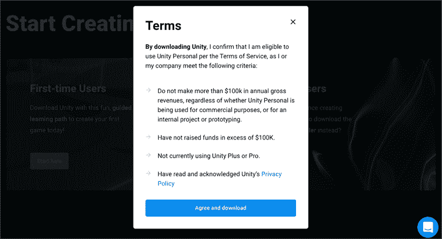
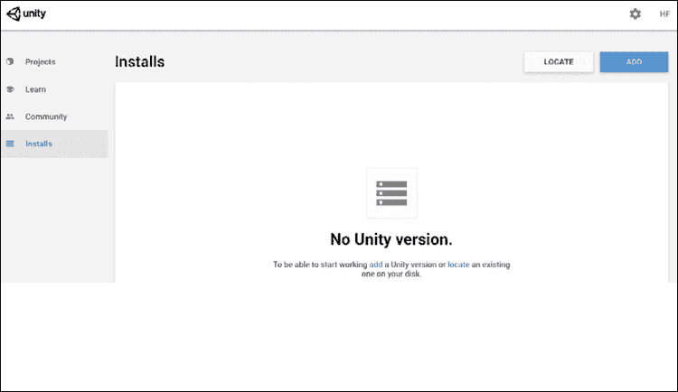
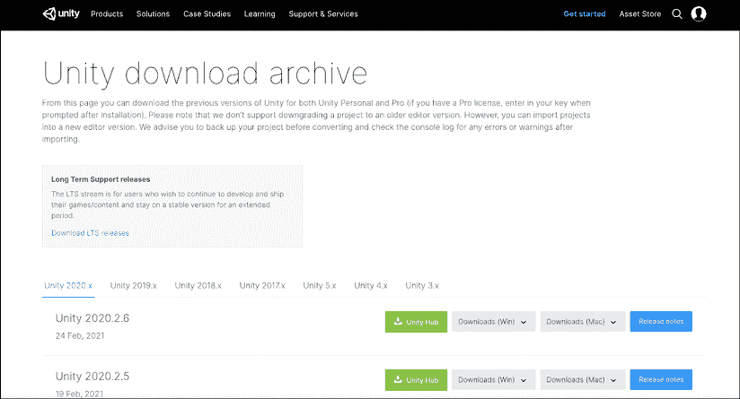
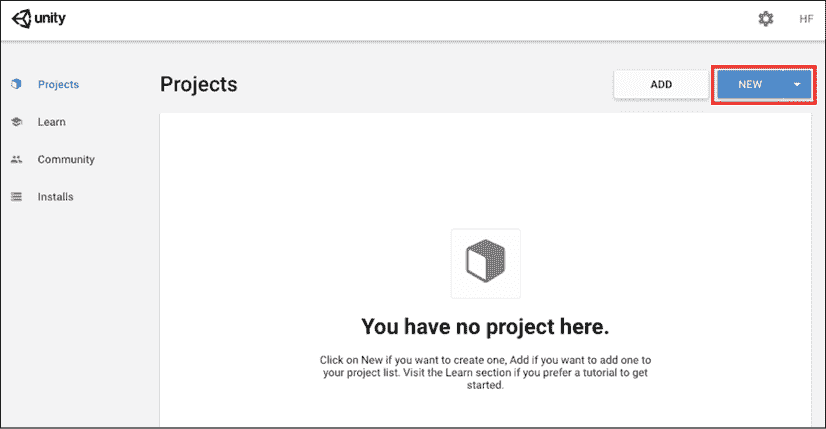
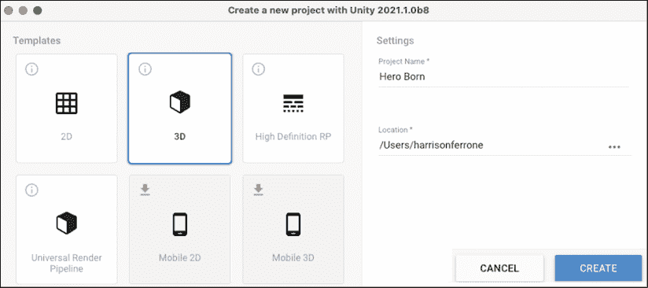
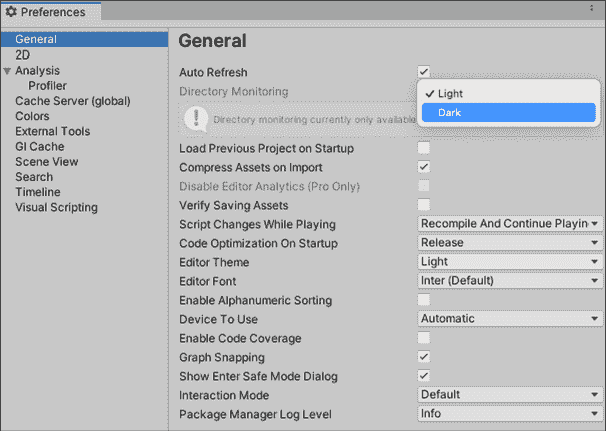
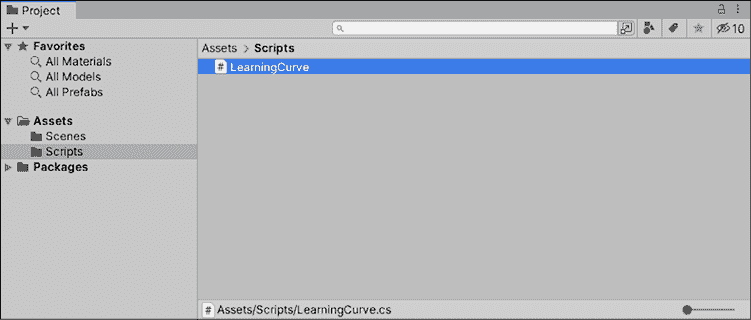
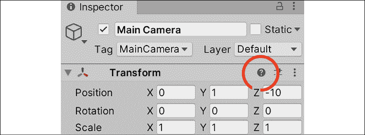
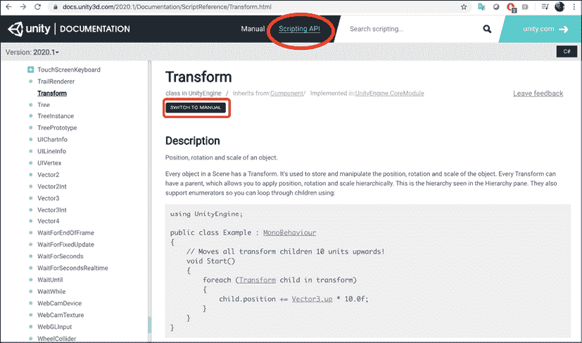
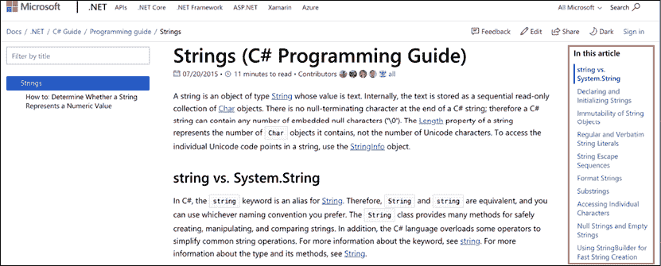

# 第一章：1

# 了解您的环境

流行文化经常将计算机程序员宣传为局外人、独行侠或怪异的黑客。他们拥有非凡的算法思维能力，社交智商低，有点反叛。虽然事实并非如此，但学习编程的确会从根本上改变您看待世界的方式。好消息是，您天生的好奇心已经希望在世界中看到这些模式，您甚至可能会喜欢这种新的思维方式。

从早上睁开眼睛到晚上睡觉前看到天花板风扇的最后一眼，您无意识地使用分析技能，这些技能可以转化为编程 - 您只是缺少正确的语言和语法将这些生活技能映射到代码中。您知道自己的年龄，对吧？那是一个变量。当您过马路时，我假设您会像我们其他人一样在踏上路边之前向两个方向看一眼。这是评估不同条件，更为程序术语中的控制流。当您看着一罐汽水时，您本能地识别出它具有形状、重量和内容等特定属性。那就是一个类对象！您明白了吧。

凭借您掌握的丰富实际经验，您已经准备好进入编程的领域了。为了开始您的旅程，您需要知道如何设置您的开发环境，使用涉及的应用程序，并确切地知道在需要帮助时该去哪里。

为此，我们将首先深入以下 C#主题：

+   开始使用 Unity 2021

+   使用 C#与 Unity

+   探索文档

让我们开始吧！

# 技术要求

有时候，从一件事物不是什么开始，比从它是什么开始更容易。本书的目标*不是*教会您关于 Unity 游戏引擎或游戏开发的所有知识。出于必要，我们将在旅程开始时以基本水平涵盖这些主题，并在*第六章*，*与 Unity 一起动手*中进行更详细的讨论。然而，这些主题包括在内，是为了以一种有趣、易于理解的方式从零开始学习 C#编程语言。

由于本书面向完全没有编程经验的初学者，如果您之前没有接触过 C#或 Unity，那么您来对地方了！如果您之前有一些 Unity Editor 的经验，但没有编程经验，猜猜怎么着？这依然是您应该来的地方。即使您之前尝试过一些 C#混合 Unity，但想要探索一些中级或高级主题，本书的后几章也可以为您提供所需的内容。

如果您是其他语言的有经验的程序员，可以随意跳过初学者理论，直接进入您感兴趣的部分，或者留下来复习您的基础知识。

除了运行 Unity 2021，您还将使用 C# 8.0 和 Visual Studio 来编写游戏代码。

# 开始使用 Unity 2021

如果您尚未安装 Unity，或者正在运行早期版本，请按照以下步骤设置您的环境：

1.  前往[`www.unity.com/`](https://www.unity.com/)。

1.  选择**开始**（如下图所示）：

图 1.1：Unity 首页

这将带您到 Unity 商店页面。不要感到不知所措 - 您可以完全免费获得 Unity！

如果 Unity 首页对您来说与*图 1.1*中所见不同，您可以直接前往[`store.unity.com`](https://store.unity.com)。

1.  选择**个人**选项。其他付费选项提供更高级的功能和服务，但您可以自行查看：

图 1.2：Unity 计划和定价

1.  选择**个人**计划后，将询问您是否是第一次或返回用户。在**第一次用户**下选择**从这里开始**：

图 1.3：使用 Unity 门户开始创建

1.  选择**同意并下载**以获取您的 Unity Hub 副本：

图 1.4：Unity 条款和条件

下载完成后，请按照以下步骤操作：

1.  打开安装程序（双击打开）

1.  接受用户协议

1.  按照安装说明操作

当您得到绿灯时，继续启动 Unity Hub 应用程序！

最新版本的 Unity Hub 在您首次打开应用程序时将提供安装向导。如果您想要跟随，可以随意选择。

以下步骤向您展示如何在不借助应用程序的帮助下开始一个新项目：

1.  在左下角选择**跳过安装向导**，然后确认**跳过向导**：

图 1.5：安装向导

1.  从左侧菜单切换到**安装**选项卡，然后选择**添加**以选择您的 Unity 版本：

图 1.6：Unity Hub 安装面板

1.  选择您想要的 Unity 版本，然后单击**下一步**。在撰写本文时，Unity 2021 仍处于预发布阶段，但在您阅读本文时，您应该能够从**官方发布**列表中选择 2021 版本：

图 1.7：添加 Unity 版本弹出窗口

1.  然后，您将有选择将各种模块添加到您的安装中。确保选择了 Visual Studio 模块，然后单击**下一步**：

图 1.8：添加安装模块

如果您想以后添加任何模块，可以单击**更多**按钮（**安装**窗口右上角的三点图标）。

安装完成后，您将在**安装**面板中看到一个新版本，如下所示：


图 1.9：带有 Unity 版本的安装选项卡

您可以在[`docs.unity3d.com/Manual/GettingStartedInstallingHub.html`](https://docs.unity3d.com/Manual/GettingStartedInstallingHub.html)找到有关 Unity Hub 应用程序的其他信息和资源。

事情总会出错的可能性，所以如果您使用的是 macOS Catalina 或更高版本，可能会出现问题，请务必查看以下部分。

## 使用 macOS

如果您在使用某些版本的 Unity Hub 安装 Unity 时在 Mac 上遇到 OS Catalina 或更高版本的问题，那么请深呼吸，转到**Unity 下载存档**，并获取您需要的 2021 版本（[`unity3d.com/get-unity/download/archive`](https://unity3d.com/get-unity/download/archive)）。记住使用**下载（Mac）**选项而不是 Unity Hub 下载：



图 1.10：Unity 下载存档

如果您在 Windows 上工作并遇到类似的安装问题，下载 Unity 的存档副本也可以正常工作。

由于它是一个`.dmg`文件，下载是一个普通的应用程序安装程序。打开它，按照说明操作，您将很快就可以开始了！


图 1.11：从下载管理器成功安装 Unity

本书的所有示例和截图都是使用 Unity 2021.1.0b8 创建和捕获的。如果您使用的是更新版本，Unity 编辑器中的外观可能会略有不同，但这不应影响您的跟进。

现在 Unity Hub 和 Unity 2021 已安装完成，是时候创建一个新项目了！

## 创建一个新项目

启动 Unity Hub 应用程序以开始一个新项目。如果您有 Unity 帐户，请继续登录；如果没有，您可以创建一个或在屏幕底部单击**跳过**。

现在，让我们通过在右上角的**新建**按钮旁边选择箭头图标来设置一个新项目：



图 1.12：Unity Hub 项目面板

选择您的 2021 版本并设置以下字段：

+   **模板**：项目将默认为**3D**

+   **项目名称**：我将称我的为`Hero Born`

+   **位置**：您希望项目保存在哪里

设置完成后，点击**创建**：



图 1.13：带有新项目配置弹出窗口的 Unity Hub

创建项目后，您可以随时从 Unity Hub 的**项目**面板中重新打开项目。

## 导航编辑器

当新项目完成初始化时，您将看到美妙的 Unity 编辑器！我在以下截图中标记了重要的标签（或面板，如果您喜欢的话）：


图 1.14：Unity 界面

这是很多内容，所以我们将更详细地查看每个面板：

1.  **工具栏**面板是 Unity 编辑器的最顶部部分。从这里，您可以操作对象（最左边的按钮组）并播放和暂停游戏（中间按钮）。最右边的按钮组包含 Unity 服务、**LayerMasks**和布局方案功能，这本书中我们不会使用，因为它们与学习 C#无关。

1.  **层次结构**窗口显示当前游戏**场景**中的每个项目。在起始项目中，这只是默认摄像机和定向光，但当我们创建原型环境时，这个窗口将开始填充。

1.  **游戏**和**场景**窗口是编辑器最直观的部分。将**场景**窗口视为舞台，您可以在其中移动和排列 2D 和 3D 对象。当您点击**播放**按钮时，**游戏**窗口将接管，渲染**场景**视图和任何编程交互。

1.  **检查器**窗口是查看和编辑场景中对象属性的一站式商店。如果您在**层次结构**中选择**主摄像机** **游戏对象**，您将看到显示了几个部分（Unity 称其为组件）—所有这些都可以从这里访问。

1.  **项目**窗口包含当前项目中的每个资产。将其视为项目文件夹和文件的表示。 

1.  **控制台**窗口是我们希望脚本打印的任何输出都会显示的地方。从现在开始，如果我们谈论控制台或调试输出，这个面板就是显示的地方。

如果意外关闭了任何这些窗口，您可以随时从**Unity** | **窗口** | **常规**重新打开它们。您可以在 Unity 文档中找到关于每个窗口功能的更深入的分析[`docs.unity3d.com/Manual/UsingTheEditor.html`](https://docs.unity3d.com/Manual/UsingTheEditor.html)。

在继续之前，重要的是将 Visual Studio 设置为项目的脚本编辑器。转到**Unity 菜单** | **首选项** | **外部工具**，检查**外部脚本编辑器**是否设置为 Visual Studio for Mac 或 Windows：


图 1.15：将外部脚本编辑器更改为 Visual Studio

最后的提示，如果您想在浅色和深色模式之间切换，转到**Unity 菜单** | **首选项** | **常规**，更改**编辑器主题**：



图 1.16：Unity 常规首选项面板

我知道如果您是新手，这可能需要一些时间来理解，但请放心，以后的任何说明都会提到必要的步骤。我不会让您猜测要按哪个按钮。说了这些，让我们开始创建一些实际的 C#脚本。

# 在 Unity 中使用 C#

未来，将 Unity 和 C#视为共生实体是很重要的。Unity 是您将创建脚本和游戏对象的引擎，但实际的编程发生在另一个名为 Visual Studio 的程序中。现在不用担心这个问题，我们马上就会解决。

## 使用 C#脚本

尽管我们还没有涵盖任何基本的编程概念，但在我们知道如何在 Unity 中创建实际的 C#脚本之前，它们将没有用武之地。C#脚本是一种特殊类型的 C#文件，在其中您将编写 C#代码。这些脚本可以在 Unity 中用于几乎任何事情，从响应玩家输入到创建游戏机制。

有几种从编辑器创建 C#脚本的方法：

+   选择**Assets** | **Create** | **C# Script**

+   在**Project**选项卡下方，选择**+**图标并选择**C# Script**

+   在**Project**选项卡中的**Assets**文件夹上右键单击，然后从弹出菜单中选择**Create** | **C# Script**

+   在**Hierarchy**窗口中选择任何 GameObject，然后单击**Add Component** | **New Script**

今后，每当您被指示创建 C#脚本时，请使用您喜欢的任何方法。

除了使用上述方法在编辑器中创建 C#脚本之外，还可以创建资源和其他对象。我不会每次创建新内容时都提到这些变化，所以请将选项记在心中。

为了组织起见，我们将把各种资产和脚本存储在它们标记的文件夹内。这不仅仅是一个与 Unity 相关的任务 - 这是您应该始终执行的任务，您的同事会感谢您（我保证）：

1.  从**Project**选项卡中，选择**+** | **Folder**（或您最喜欢的任何方法 - 在*图 1.17*中，我们选择了**Assets** | **Create** | **Folder**）并将其命名为`Scripts`：

图 1.17：创建 C#脚本

1.  双击**Scripts**文件夹并创建一个新的 C#脚本。默认情况下，脚本将被命名为`NewBehaviourScript`，但您会看到文件名被突出显示，因此您可以立即重命名它。键入`LearningCurve`并按`Enter`：

图 1.18：选择 Scripts 文件夹的项目窗口

您可以使用**Project**选项卡底部右侧的小滑块来更改文件的显示方式。

所以，您刚刚创建了一个名为`Scripts`的子文件夹，如前面的屏幕截图所示。在该父文件夹中，您创建了一个名为`LearningCurve.cs`的 C#脚本（文件类型为`.cs`代表 C-Sharp，以防您想知道），现在它作为我们*Hero Born*项目资产的一部分保存了下来。现在只需在 Visual Studio 中打开它！

## 介绍 Visual Studio 编辑器

Unity 可以创建和存储 C#脚本，但需要使用 Visual Studio 进行编辑。Unity 预先打包了 Visual Studio 的副本，并且当您从编辑器内部双击任何 C#脚本时，它将自动打开。

### 打开 C#文件

Unity 将在您第一次打开文件时与 Visual Studio 同步。最简单的方法是从**Project**选项卡中选择脚本。

双击`LearningCurve.cs`，这将在 Visual Studio 中打开 C#文件：


图 1.19：Visual Studio 中的 LearningCurve C#脚本

您可以随时从**Visual Studio** | **View** | **Layout**更改 Visual Studio 选项卡。我将在本书的其余部分中使用**Design**布局，这样我们就可以在编辑器的左侧看到项目文件。

您将在界面的左侧看到一个与 Unity 中的文件夹结构相同的文件夹结构，您可以像访问其他文件夹一样访问它。右侧是实际的代码编辑器，其中发生了魔术。Visual Studio 应用程序有更多功能，但这是我们开始所需的全部。

Visual Studio 界面在 Windows 和 Mac 环境下有所不同，但本书中将使用的代码在两者上都能很好地工作。本书中的所有屏幕截图都是在 Mac 环境中拍摄的，因此如果您的计算机上看起来不同，那就没必要担心。

### 注意命名不匹配

一个常见的陷阱是文件命名 - 更具体地说是命名不匹配，我们可以使用 Visual Studio 中 C#文件的*图 1.19*第 5 行来说明：

```cs
public class LearningCurve : MonoBehaviour 
```

`LearningCurve`类名与`LearningCurve.cs`文件名相同。**这是一个基本要求**。如果你现在不知道类是什么，没关系。重要的是要记住，在 Unity 中，文件名和类名需要相同。如果你在 Unity 之外使用 C#，文件名和类名不需要匹配。

当你在 Unity 中创建一个 C#脚本文件时，**项目**选项卡中的文件名已经处于**编辑**模式，准备重命名。养成当时就重命名的好习惯。如果以后重命名脚本，文件名和类名将不匹配。

如果以后重命名文件，文件名会改变，但第 5 行将如下所示：

```cs
public class NewBehaviourScript : MonoBehaviour 
```

如果你不小心这样做了，也不是世界末日。你只需要进入 Visual Studio，将`NewBehaviourScript`更改为你的 C#脚本的名称，以及桌面上`.meta`文件的名称。你可以在**Assets** | **Scripts**文件夹下的项目文件夹中找到`.meta`文件：


图 1.20：查找 META 文件

## 同步 C#文件

作为它们共生关系的一部分，Unity 和 Visual Studio 会相互通信以同步它们的内容。这意味着，如果你在一个应用程序中添加、删除或更改脚本文件，另一个应用程序会自动看到这些更改。

那么，当墨菲定律（它规定“任何可能出错的事情都会出错”）发生，同步似乎不正常时会发生什么？如果你遇到这种情况，深呼吸，选择 Unity 中的有问题的脚本，右键单击，然后选择**刷新**。

现在你已经掌握了脚本创建的基础知识，所以是时候谈谈如何找到并有效地使用有用的资源了。

# 探索文档

我们在这次对 Unity 和 C#脚本的初次尝试中要谈到的最后一个主题是文档。我知道这不够吸引人，但在处理新的编程语言或开发环境时，养成良好的习惯是很重要的。

## 访问 Unity 的文档

一旦你开始认真地编写脚本，你会经常使用 Unity 的文档，所以早点知道如何访问它是有益的。*参考手册*会给你一个组件或主题的概述，而具体的编程示例可以在*脚本参考*中找到。

场景中的每个游戏对象（**Hierarchy**窗口中的一个项目）都有一个控制其**位置**、**旋转**和**缩放**的**Transform**组件。为了简单起见，我们只查找参考手册中相机的**Transform**组件：

1.  在**Hierarchy**选项卡中，选择**Main Camera**游戏对象

1.  切换到**Inspector**选项卡，然后点击**Transform**组件右上角的信息图标（问号）：

图 1.21：在检查器中选择了主摄像机游戏对象

你会看到一个网页浏览器打开到参考手册的**Transforms**页面：


图 1.22：Unity 参考手册

Unity 中的所有组件都有这个功能，所以如果你想了解更多关于某个东西如何工作的信息，你知道该怎么做。

所以，我们已经打开了参考手册，但如果我们想要与**Transform**组件相关的具体编码示例怎么办？很简单——我们只需要查看脚本参考。

点击组件或类名（在这种情况下是**Transform**）下方的**切换到脚本**链接：


图 1.23：突出显示了切换到脚本的 Unity 参考手册按钮

通过这样做，参考手册会自动切换到脚本参考：



图 1.24：突出显示了切换到手册的 Unity 脚本文档

如你所见，除了编码帮助，还有一个选项可以在必要时切换回参考手册。

脚本参考是一份庞大的文件，因为它必须是。然而，这并不意味着你必须记住它，甚至熟悉它的所有信息才能开始编写脚本。正如其名称所示，它是一个参考，而不是一份测试。

如果你在文档中迷失了，或者对于在哪里查找想法耗尽了，你也可以在以下地方找到丰富的 Unity 开发社区中的解决方案：

+   Unity 论坛：[`forum.unity.com/`](https://forum.unity.com/)

+   Unity Answers: [`answers.unity.com/index.html`](https://answers.unity.com/index.html)

+   Unity Discord：[`discord.com/invite/unity`](https://discord.com/invite/unity)

另一方面，你需要知道在任何 C#问题上找到资源的位置，我们将在下面介绍。

## 寻找 C#资源

既然我们已经处理了 Unity 资源，让我们来看看微软的 C#资源。首先，微软学习文档[`docs.microsoft.com/en-us/dotnet/csharp`](https://docs.microsoft.com/en-us/dotnet/csharp)中有大量的教程、快速入门指南和操作文章。你还可以在[`docs.microsoft.com/en-us/dotnet/csharp/programming-guide/index`](https://docs.microsoft.com/en-us/dotnet/csharp/programming-guide/index)找到有关 C#主题的概述。

然而，如果你想要关于特定 C#语言特性的详细信息，参考指南是去的地方。这些参考指南对于任何 C#程序员来说都是重要的资源，但由于它们并不总是最容易导航，让我们花几分钟时间学习如何找到我们要找的内容。

让我们加载编程指南链接，查找 C#的`String`类。执行以下操作之一：

+   在网页左上角的搜索栏中输入`Strings`

+   向下滚动到**语言部分**，直接点击**Strings**链接：

图 1.25：浏览微软的 C#参考指南

对于类描述页面，你应该看到类似以下内容：



图 1.26：微软的字符串（C#编程指南）页面

与 Unity 的文档不同，C#参考和脚本信息都被捆绑在一起，但它的救星是右侧的子主题列表。好好利用它！当你陷入困境或有问题时，知道在哪里寻求帮助是非常重要的，所以确保在遇到障碍时回到这一部分。

# 总结

在本章中，我们涵盖了相当多的后勤信息，所以我可以理解如果你渴望编写一些代码。开始新项目、创建文件夹和脚本以及访问文档是在新冒险的兴奋中很容易被遗忘的主题。只要记住，本章有很多你可能在接下来的页面中需要的资源，所以不要害怕回来查看。像程序员一样思考是一种能力：你越多地使用它，它就会变得越强大。

在下一章中，我们将开始阐述你需要准备编码大脑的理论、词汇和主要概念。即使材料是概念性的，我们仍将在`LearningCurve`脚本中编写我们的第一行代码。准备好！

# 小测验-处理脚本

1.  Unity 和 Visual Studio 之间有什么样的关系？

1.  脚本参考提供了关于使用特定 Unity 组件或功能的示例代码。你在哪里可以找到更详细的（非代码相关）关于 Unity 组件的信息？

1.  脚本参考是一份庞大的文件。在尝试编写脚本之前，你需要记住多少内容？

1.  什么时候是给 C#脚本命名的最佳时机？

# 加入我们的 Discord！

与其他用户、Unity/C#专家和 Harrison Ferrone 一起阅读本书。提出问题，为其他读者提供解决方案，通过*问我任何事*与作者交谈等等。

立即加入！

[`packt.link/csharpunity2021`](https://packt.link/csharpunity2021)


