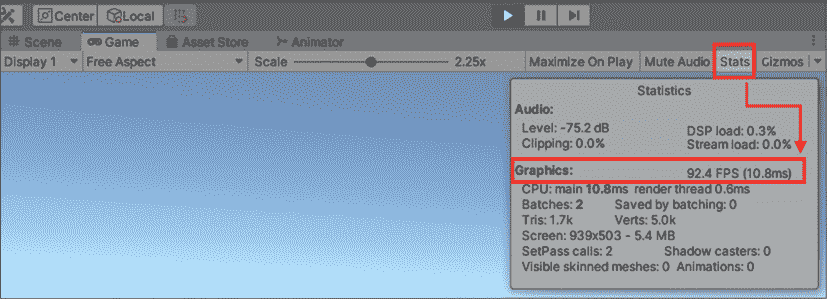

# 第三章：深入变量、类型和方法

进入任何编程语言的初始步骤都会受到一个基本问题的困扰——你可以理解打出的字，但不知道它们背后的含义。通常情况下，这会导致悖论，但编程是一个特殊情况。

C#并不是一种独立的语言；它是用英语编写的。你每天使用的词语和在 Visual Studio 中的代码之间的差异来自于缺少上下文，这是需要重新学习的东西。你知道如何说和拼写 C#中使用的词语，但你不知道的是它们在语言的语法中是如何组成的，以及最重要的是如何组成的。

这一章标志着我们离开了编程理论，开始了我们进入实际编码的旅程。我们将讨论接受的格式化、调试技术，并组合更复杂的变量和方法示例。有很多内容要涵盖，但当你达到最后的测验时，你将对以下高级主题感到舒适：

+   写正确的 C#

+   调试你的代码

+   理解变量

+   引入运算符

+   定义方法

让我们开始吧！

# 写正确的 C#

代码行就像句子一样，意味着它们需要有某种分隔或结束字符。每一行 C#代码，称为语句，*必须*以分号结尾，以便编译器对其进行处理。

然而，你需要注意一个问题。与我们熟悉的书面语言不同，C#语句在技术上不一定要在一行上；空格和换行符会被代码编译器忽略。例如，一个简单的变量可以这样写：

```cs
public int FirstName = "Harrison"; 
```

或者，它也可以这样写：

```cs
public
int
FirstName
= 
"Harrison"; 
```

这两个代码片段对 Visual Studio 来说都是完全可以接受的，但第二个选项在软件社区中是极为不鼓励的，因为它使得代码极其难以阅读。理念是尽可能高效和清晰地编写你的程序。

有时候一条语句会太长，无法合理地放在一行上，但这种情况很少。只要确保它的格式能让别人理解，并且不要忘记分号。

你需要牢记的第二个格式化规则是使用花括号：`{}`。方法、类和接口在声明后都需要一对花括号。我们稍后会详细讨论这些内容，但是早点把标准格式化记在脑海中是很重要的。

C#的传统做法是将每个括号放在新的一行，就像下面的方法所示：

```cs
public void MethodName() 
{
} 
```

然而，你可能会看到第一个花括号与声明在同一行的情况。这完全取决于个人偏好：

```cs
public void MethodName() {
} 
```

虽然这不是什么让你抓狂的事情，但重要的是要保持一致。在本书中，我们将坚持使用“纯粹”的 C#代码，它总是将每个括号放在新的一行，而与 Unity 和游戏开发有关的 C#示例通常会遵循第二个例子。

良好、一致的格式化风格在编程初学者中至关重要，但能够看到你的工作成果也同样重要。在下一节中，我们将讨论如何将变量和信息直接打印到 Unity 控制台。

# 调试你的代码

当我们通过实际示例进行工作时，我们需要一种方法将信息和反馈打印到 Unity 编辑器中的**控制台**窗口。这个程序术语称为调试，C#和 Unity 都提供了辅助方法，使开发人员更容易进行这个过程。你已经从上一章调试了你的代码，但我们并没有详细讨论它是如何工作的。让我们来解决这个问题。

每当我要求你调试或打印出某些东西时，使用以下方法之一：

+   对于简单的文本或单个变量，使用标准的`Debug.Log()`方法。文本需要放在一对括号内，变量可以直接使用，不需要添加其他字符；例如：

```cs
Debug.Log("Text goes here.");
Debug.Log(CurrentAge); 
```

这将在**控制台**面板中产生以下结果：


图 3.1：观察 Debug.Log 输出

+   对于更复杂的调试，使用`Debug.LogFormat()`。这将允许您在打印的文本中使用占位符来放置变量。这些占位符用一对花括号标记，每个花括号包含一个索引。索引是一个常规数字，从 0 开始，依次递增 1。在下面的示例中，`{0}`占位符被`CurrentAge`的值替换，`{1}`被`FirstName`替换，依此类推：

```cs
Debug.LogFormat("Text goes here, add {0} and {1} as variable
   placeholders", CurrentAge, FirstName); 
```

这将在**控制台**面板中产生以下结果：


图 3.2：观察 Debug.LogFormat 输出

您可能已经注意到我们在调试技术中使用了**点符号**，没错！Debug 是我们使用的类，`Log()`和`LogFormat()`是我们可以从该类中使用的不同方法。本章末尾将详细介绍这一点。

有了调试的能力，我们可以安全地继续深入了解变量声明的方式，以及语法可以如何发挥作用。

# 理解变量

在上一章中，我们看到了变量的写法，并简要介绍了它们提供的高级功能。然而，我们仍然缺少使所有这些成为可能的语法。

## 声明变量

变量不会只是出现在 C#脚本的顶部；它们必须根据特定的规则和要求进行声明。在最基本的层面上，变量声明需要满足以下要求：

+   需要指定变量将存储的数据类型

+   变量必须有一个唯一的名称

+   如果有一个赋值，它必须与指定的类型匹配

+   变量声明需要以分号结束

遵守这些规则的结果是以下语法：

```cs
dataType UniqueName = value; 
```

变量需要唯一的名称，以避免与 C#已经使用的关键字发生冲突。您可以在[`docs.microsoft.com/en-us/dotnet/csharp/language-reference/keywords/index`](https://docs.microsoft.com/en-us/dotnet/csharp/language-reference/keywords/index)找到受保护关键字的完整列表。

这很简单，整洁，高效。然而，如果只有一种方式创建如此普遍的变量，那么编程语言在长期内将毫无用处。复杂的应用程序和游戏有不同的用例和场景，所有这些都有独特的 C#语法。

### 类型和值的声明

创建变量最常见的情况是在声明时已经有了所有必需的信息。例如，如果我们知道玩家的年龄，存储它就像这样简单：

```cs
int CurrentAge = 32; 
```

在这里，所有基本要求都得到了满足：

+   指定了数据类型，即`int`（整数的缩写）

+   使用了一个唯一的名称，即`CurrentAge`

+   `32`是一个整数，与指定的数据类型匹配

+   该语句以分号结束

然而，有时候你会想要声明一个变量，但并不知道它的值。我们将在接下来的部分讨论这个话题。

### 仅类型声明

考虑另一种情况——你知道你想要一个变量存储的数据类型和它的名称，但不知道它的值。值将在其他地方计算和赋值，但你仍然需要在脚本的顶部声明变量。这种情况非常适合仅类型声明：

```cs
int CurrentAge; 
```

只有类型（`int`）和唯一名称（`CurrentAge`）被定义，但语句仍然有效，因为我们遵循了规则。没有分配的值，将根据变量的类型分配默认值。在这种情况下，`CurrentAge`将被设置为`0`，这与`int`类型匹配。一旦变量的实际值变得可用，就可以通过引用变量名并为其分配一个值来轻松地在单独的语句中设置它：

```cs
CurrentAge = 32; 
```

您可以在[`docs.microsoft.com/en-us/dotnet/csharp/language-reference/builtin-types/default-values`](https://docs.microsoft.com/en-us/dotnet/csharp/language-reference/builtin-types/default-values)找到所有 C#类型及其默认值的完整列表。

此时，您可能会问为什么到目前为止，我们的变量还没有包括`public`关键字，即*访问修饰符*，这是我们在早期脚本示例中看到的。答案是我们没有必要的基础来清楚地谈论它们。现在我们有了这个基础，是时候详细讨论它们了。

## 使用访问修饰符

现在基本语法不再是一个谜，让我们深入了解变量语句的细节。由于我们从左到右阅读代码，因此从传统上来说，从关键字开始进行变量深入研究是有意义的。

快速回顾一下我们在前一章中在`LearningCurve`中使用的变量，您会发现它们在语句的开头有一个额外的关键字：`public`。这就是变量的访问修饰符。将其视为安全设置，确定谁和什么可以访问变量的信息。

任何没有标记为`public`的变量都默认为`private`，并且不会显示在 Unity Inspector 面板中。

如果包括一个修饰符，我们在本章开头组合的更新语法配方将如下所示：

```cs
accessModifier dataType UniqueName = value; 
```

在声明变量时，明确的访问修饰符并不是必需的，但作为新程序员，养成这样的习惯是很好的。这个额外的词在代码的可读性和专业性方面有很大帮助。

C#中有四种主要的访问修饰符，但作为初学者，您最常使用的两种是以下两种：

+   **Public**：对任何脚本都是可用的，没有限制。

+   **Private**：仅在创建它们的类中可用（称为包含类）。任何没有访问修饰符的变量默认为私有。

两个高级修饰符具有以下特点：

+   **Protected**：可从包含类或从中派生的类型访问

+   **Internal**：仅在当前程序集中可用

每个修饰符都有特定的用例，但在我们进入高级章节之前，不要担心**protected**和**internal**。

两种组合修饰符也存在，但在本书中我们不会使用它们。您可以在[`docs.microsoft.com/en-us/dotnet/csharp/language-reference/keywords/access-modifiers`](https://docs.microsoft.com/en-us/dotnet/csharp/language-reference/keywords/access-modifiers)找到更多关于它们的信息。

让我们尝试一些自己的访问修饰符！就像现实生活中的信息一样，有些数据需要受到保护或与特定人分享。如果变量在**Inspector**窗口中不需要更改或从其他脚本中访问，那么它就是私有访问修饰符的一个很好的选择。

执行以下步骤来更新`LearningCurve`：

1.  将`CurrentAge`前面的访问修饰符从`public`更改为`private`并保存文件。

1.  返回 Unity，选择主摄像机，并查看`LearningCurve`部分中的更改！[](img/B17573_03_03.png)

图 3.3：附加到主摄像机的 LearningCurve 脚本组件

由于`CurrentAge`现在是私有的，它不再在**检视器**窗口中可见，只能在`LearningCurve`脚本中的代码中访问。如果我们点击播放，脚本仍然会像以前一样正常工作。

这是我们进入变量的旅程的一个良好开端，但我们仍然需要了解它们可以存储什么类型的数据。这就是数据类型的作用，我们将在下一节中进行讨论。

## 使用类型

将特定类型分配给变量是一个重要的选择，它会影响变量在整个生命周期中的每次交互。由于 C#是所谓的*强类型*或*类型安全*语言，每个变量都必须有一个数据类型，没有例外。这意味着在执行特定类型的操作时有特定的规则，并且在将给定变量类型转换为另一个类型时有规定。

### 常见的内置类型

C#中的所有数据类型都从一个共同的祖先`System.Object`（在编程术语中称为*派生*）派生下来。这个层次结构称为**公共类型系统**（**CTS**），意味着不同类型有很多共享功能。下表列出了一些最常见的数据类型选项以及它们存储的值：


图 3.4：变量的常见数据类型

除了指定变量可以存储的值的类型之外，类型还包含有关自身的其他信息，包括以下内容：

+   所需的存储空间

+   最小和最大值

+   允许的操作

+   内存中的位置

+   可访问的方法

+   基本（派生）类型

如果这看起来令人不知所措，请深呼吸。使用 C#提供的所有类型是使用文档而不是记忆的完美示例。很快，即使是最复杂的自定义类型的使用也会变得轻而易举。

您可以在[`docs.microsoft.com/en-us/dotnet/csharp/programming-guide/types/index`](https://docs.microsoft.com/en-us/dotnet/csharp/programming-guide/types/index)找到所有 C#内置类型及其规格的完整列表。

在类型列表成为难点之前，最好先尝试它们。毕竟，学习新东西的最佳方式是使用它，打破它，然后学会修复它。

打开`LearningCurve`并根据前面图表中*常见内置类型*部分的每种类型添加一个新变量。您使用的名称和值由您决定；只需确保它们标记为公共，以便我们可以在检视器窗口中看到它们。如果需要灵感，可以看看我的代码：

```cs
public class LearningCurve : MonoBehaviour
{
    private int CurrentAge = 30;
    public int AddedAge = 1;

**public****float** **Pi =** **3.14f****;**
**public****string** **FirstName =** **"Harrison"****;**
**public****bool** **IsAuthor =** **true****;**

    // Start is called before the first frame update
    void Start()
    {
        ComputeAge(); 
    }

    /// <summary>
    /// Time for action - adding comments
    /// Computes a modified age integer
    /// </summary>
    void ComputeAge()
    {
        Debug.Log(CurrentAge + AddedAge);
    }
} 
```

在处理字符串类型时，实际文本值需要放在一对双引号中，而浮点值需要以小写`f`结尾，就像`FirstName`和`Pi`一样。

我们的不同变量类型现在都是可见的。请注意 Unity 显示为复选框的`bool`变量（选中为 true，未选中为 false）。


图 3.5：带有常见变量类型的 LearningCurve 脚本组件

请记住，您声明为私有的任何变量都不会显示在检视器窗口中。在我们继续进行转换之前，我们需要提及字符串数据类型的一个常见且强大的应用，即创建随意插入变量的字符串。

虽然数字类型的行为与小学数学中的预期相同，但字符串则是另一回事。可以通过以`$`字符开头直接在文本中插入变量和文字值，这称为字符串插值。您已经在`LogFormat()`调试中使用了插值字符串；添加`$`字符可以让您随时使用它们！

让我们在`LearningCurve`中创建一个简单的插值字符串，以便看到它的效果。在`ComputeAge()`之后直接在`Start()`方法中打印插值字符串：

```cs
void Start()
{
    ComputeAge();
    **Debug.Log(****$"A string can have variables like** **{FirstName}** **inserted directly!"****);**
} 
```

由于`$`字符和花括号，`FirstName`的值被视为一个值，并在插值字符串中打印出来。如果没有这种特殊格式，字符串将只包括`FirstName`作为文本，而不是变量值。


图 3.6：控制台显示调试日志输出

还可以使用`+`运算符创建插值字符串，我们将在*介绍运算符*部分讨论。

### 类型转换

我们已经看到变量只能保存其声明类型的值，但会有情况需要组合不同类型的变量。在编程术语中，这些称为转换，有两种主要类型：

+   **隐式**转换通常在较小的值适合到另一个变量类型中时自动进行，通常不需要四舍五入。例如，任何整数都可以隐式转换为`double`或`float`值而无需额外的代码：

```cs
int MyInteger = 3;
float MyFloat = MyInteger;

Debug.Log(MyInteger);
Debug.Log(MyFloat); 
```

**控制台**窗格中的输出可以在以下截图中看到：


图 3.7：隐式类型转换调试日志输出

+   **显式**转换是在转换过程中存在丢失变量信息风险时需要的。例如，如果我们想要将`double`值转换为`int`值，我们必须通过在要转换的值之前加上目标类型的括号来显式地进行转换。

+   这告诉编译器，我们知道数据（或精度）可能会丢失：

```cs
int ExplicitConversion = (int)3.14; 
```

在这个显式转换中，`3.14`将被四舍五入为`3`，丢失小数值：


图 3.8：显式类型转换调试日志输出

C#提供了用于显式转换值为常见类型的内置方法。例如，任何类型都可以使用`ToString()`方法转换为字符串值，而`Convert`类可以处理更复杂的转换。您可以在[`docs.microsoft.com/en-us/dotnet/api/system.convert?view=netframework-4.7.2`](https://docs.microsoft.com/en-us/dotnet/api/system.convert?view=netframework-4.7.2)的*方法*部分找到有关这些功能的更多信息。

到目前为止，我们已经了解到类型在交互、操作和转换方面有规则，但是当我们需要存储未知类型的变量时，我们该如何处理呢？这听起来很疯狂，但想想数据下载的情景——你知道信息正在进入你的游戏，但不确定它将采取什么形式。我们将在接下来的部分讨论如何处理这种情况。

### 推断声明

幸运的是，C#可以从分配的值中*推断*出变量的类型。例如，`var`关键字可以让程序知道数据`CurrentAge`的类型需要根据其值`32`来确定，这是一个整数：

```cs
**var** CurrentAge = 32; 
```

虽然在某些情况下这很方便，但不要被懒惰的编程习惯所迷惑，使用推断变量声明来处理所有事情。这会给你的代码增加很多猜测，而应该是清晰明了的。

在我们结束关于数据类型和转换的讨论之前，我们确实需要简要涉及创建自定义类型的想法，我们将在下一步中进行。

### 自定义类型

当我们谈论数据类型时，早期理解数字和单词（称为*文字值*）不是变量可以存储的唯一种类的值是很重要的。例如，类、结构或枚举可以存储为变量。我们将在*第五章*，*使用类、结构和面向对象编程*中介绍这些主题，并在*第十章*，*重新审视类型、方法和类*中更详细地探讨它们。

类型很复杂，唯一熟悉它们的方法是使用它们。然而，这里有一些重要的事情需要记住：

+   所有变量都需要指定类型（无论是显式还是推断）

+   变量只能保存其分配类型的值（`string`值不能分配给`int`变量）

+   如果需要将变量分配或与不同类型的变量组合，需要进行转换（隐式或显式）

+   C#编译器可以使用`var`关键字从其值推断变量的类型，但应该仅在创建时类型未知时使用

我们刚刚在几个部分中塞入了很多细节，但我们还没有完成。我们还需要了解 C#中命名约定的工作方式，以及变量在我们的脚本中的位置。

## 变量命名

为变量选择名称可能看起来像是在考虑访问修饰符和类型之后的事情，但它不应该是一个简单的选择。在代码中清晰一致的命名约定不仅会使其更易读，而且还会确保团队中的其他开发人员了解您的意图，而无需询问。

在命名变量时的第一个规则是，您给出的名称应该是有意义的；第二个规则是使用帕斯卡命名法。让我们以游戏中常见的一个例子来看，声明一个变量来存储玩家的健康：

```cs
public int Health = 100; 
```

如果发现自己声明变量像这样，你的脑中应该响起警报。谁的健康？它是存储最大值还是最小值？当此值更改时，将受到影响的其他代码是什么？这些都是有意义的变量名称应该很容易回答的问题；你不希望在一周或一个月后被自己的代码搞糊涂。

说到这一点，让我们尝试使用帕斯卡命名法使其更好一些：

```cs
public int MaxPlayerHealth = 100; 
```

记住，帕斯卡命名法将变量名称中的每个单词的首字母大写。

这样好多了。经过一点思考，我们已经更新了变量名称并赋予了意义和上下文。由于在变量名称的长度方面没有技术限制，您可能会发现自己过度并写出过于描述性的名称，这将给您带来问题，就像短的、不描述性的名称一样。

一般规则是，将变量名称描述得尽可能清楚——不多也不少。找到您的风格并坚持下去。

## 理解变量范围

我们已经深入了解了变量，但还有一个重要的主题需要讨论：范围。类似于访问修饰符，确定外部类可以获取变量信息的方式，变量范围是用来描述给定变量存在的位置及其在其包含类中的访问点的术语。

C#中有三个主要的变量范围级别：

+   **全局**范围指的是整个程序（在本例中是游戏）都可以访问的变量。C#不直接支持全局变量，但这个概念在某些情况下是有用的，我们将在*第十章*“重新审视类型、方法和类”中介绍。

+   **类**或**成员**范围指的是可以在其包含类中的任何地方访问的变量。

+   **局部**范围指的是只能在其创建的特定代码块内部访问的变量。

看一下以下的屏幕截图。如果你不想把它放到`LearningCurve`中，你不需要；目前它只是用于可视化目的：


图 3.9：LearningCurve 脚本中不同范围的图表

当我们谈论代码块时，我们指的是任何一组花括号内部的区域。这些括号在编程中充当一种视觉层次结构；它们向右缩进得越多，它们在类中嵌套得越深。

让我们来分解一下前面屏幕截图中的类和局部范围变量：

+   `CharacterClass`在类的顶部声明，这意味着我们可以在`LearningCurve`的任何地方通过名称引用它。您可能会听到这个概念被称为变量可见性，这是一个很好的思考方式。

+   `CharacterHealth`在`Start()`方法中声明，这意味着它只能在该代码块内部可见。我们仍然可以毫无问题地从`Start()`中访问`CharacterClass`，但如果我们试图从`Start()`之外的任何地方访问`CharacterHealth`，我们将会收到一个错误。

+   `CharacterName`和`CharacterHealth`处于相同的境地；它们只能从`CreateCharacter()`方法中访问。这只是为了说明在单个类中可以有多个，甚至是嵌套的本地作用域。

如果你在程序员周围花足够的时间，你会听到关于声明变量的最佳位置的讨论（或争论，取决于一天中的时间）。答案比你想象的要简单：变量应该根据它们的使用情况进行声明。如果你有一个需要在整个类中访问的变量，那就把它作为类变量。如果你只需要一个变量在特定的代码段中，那就声明它为局部变量。

请注意，只有类变量可以在检查器窗口中查看，这对于局部或全局变量来说不是一个选项。

有了命名和作用域的工具，让我们把自己带回到中学数学课堂，重新学习算术运算是如何工作的！

# 介绍操作符

编程语言中的操作符符号代表类型可以执行的*算术*、*赋值*、*关系*和*逻辑*功能。算术运算符代表基本的数学函数，而赋值运算符在给定值上执行数学和赋值功能。关系和逻辑运算符评估多个值之间的条件，例如*大于*、*小于*和*等于*。

C#还提供了位和杂项运算符，但这些对你来说只有在你开始创建更复杂的应用程序时才会发挥作用。

在这一点上，只有涵盖算术和赋值运算符才有意义，但当它在下一章变得相关时，我们将介绍关系和逻辑功能。

## 算术和赋值

您已经熟悉了学校中的算术运算符符号：

+   `+`表示加法

+   `-`表示减法

+   `/`表示除法

+   `*`表示乘法

C#操作符遵循常规的运算顺序，即首先计算括号，然后是指数，然后是乘法，然后是除法，然后是加法，最后是减法。例如，以下方程将提供不同的结果，即使它们包含相同的值和运算符：

```cs
5 + 4 - 3 / 2 * 1 = 8
5 + (4 - 3) / 2 * 1 = 5 
```

当应用于变量时，操作符的工作方式与应用于文字值时相同。

赋值运算符可以作为任何数学运算的简写替代，方法是将任何算术和等号符号结合在一起。例如，如果我们想要对一个变量进行乘法运算，可以使用以下代码：

```cs
int CurrentAge = 32;
CurrentAge = CurrentAge * 2; 
```

第二种替代方法如下所示：

```cs
int CurrentAge = 32;
CurrentAge *= 2; 
```

等号符号在 C#中也被认为是一个赋值运算符。其他赋值符号遵循与我们之前的乘法示例相同的语法模式：`+=`，`-=`和`/=`分别用于加和赋值，减和赋值，以及除和赋值。

在操作符方面，字符串是一个特殊情况，因为它们可以使用加号来创建拼接文本，如下所示：

```cs
string FullName = "Harrison " + "Ferrone"; 
```

当登录到**控制台**面板时，将产生以下结果：


图 3.10：在字符串上使用操作符

这种方法往往会产生笨拙的代码，使得字符串插值成为大多数情况下拼接不同文本的首选方法。

请注意，算术运算符不适用于所有数据类型。例如，`*`和`/`运算符不适用于字符串值，而这些运算符都不适用于布尔值。在了解了类型有规则来规定它们可以进行的操作和交互之后，让我们在下一节的实践中试一试。

让我们做一个小实验：我们将尝试将我们的`string`和`float`变量相乘，就像我们之前对数字做的那样：


图 3.11：Visual Studio 不正确的类型操作错误消息

看看 Visual Studio，您会看到我们收到了一个错误消息，告诉我们`string`类型和`float`类型不能相乘。这个错误也会显示在 Unity **控制台**中，并且不会让项目构建。


图 3.12：控制台显示不兼容数据类型的运算符错误

每当您看到这种类型的错误时，回去检查变量类型是否不兼容。

我们必须清理这个示例，因为编译器现在不允许我们运行游戏。在`Debug.Log(FirstName*Pi)`行的开头选择一对反斜杠(`//`)，或者将其完全删除。

这就是我们在变量和类型方面需要了解的全部内容。在继续之前，请务必在本章的测验中进行测试！

# 定义方法

在上一章中，我们简要介绍了方法在我们的程序中扮演的角色；即，它们存储和执行指令，就像变量存储值一样。现在，我们需要理解方法声明的语法以及它们如何在我们的类中驱动行为和动作。

与变量一样，方法声明具有其基本要求，如下所示：

+   方法将返回的数据类型

+   一个以大写字母开头的唯一名称

+   方法名后面跟着一对括号

+   一对花括号标记方法体（其中存储指令）

将所有这些规则放在一起，我们得到一个简单的方法蓝图：

```cs
returnType UniqueName() 
{ 
    method body 
} 
```

让我们分解`LearningCurve`中的默认`Start()`方法作为一个实际示例：

```cs
void Start() 
{
} 
```

在前面的输出中，我们可以看到以下内容：

+   方法以`void`关键字开头，如果它不返回任何数据，则用作方法的返回类型。

+   方法在类中具有唯一的名称。您可以在不同的类中使用相同的名称，但无论如何，您都应该始终使您的名称唯一。

+   方法在其名称后面有一对括号，用于保存任何潜在的参数。

+   方法体由一组花括号定义。

一般来说，如果一个方法有一个空的方法体，最好将其从类中删除。您总是希望修剪您的脚本中未使用的代码。

与变量一样，方法也可以具有安全级别。但是，它们也可以有输入参数，我们将在下一节讨论这两个方面！

## 声明方法

方法也可以有与变量相同的四个访问修饰符，以及输入参数。参数是可以传递到方法中并在其中访问的变量占位符。您可以使用的输入参数数量没有限制，但每个参数都需要用逗号分隔，显示其数据类型，并具有唯一的名称。

将方法参数视为变量占位符，其值可以在方法体内使用。

如果我们应用这些选项，我们的更新后的蓝图将如下所示：

```cs
**accessModifier** returnType UniqueName(**parameterType parameterName**) 
{ 
    method body 
} 
```

如果没有显式的访问修饰符，方法默认为私有。私有方法，就像私有变量一样，不能从其他脚本中调用。

要调用方法（即运行或执行其指令），我们只需使用其名称，后面跟一对括号，带有或不带有参数，并以分号结束：

```cs
// Without parameters
UniqueName();
// With parameters
UniqueName(parameterVariable); 
```

与变量一样，每个方法都有一个指纹，描述其访问级别、返回类型和参数。这称为方法签名。基本上，方法的签名将其标记为编译器的唯一标识，因此 Visual Studio 知道如何处理它。

现在我们了解了方法的结构，让我们创建一个自己的方法。

上一章的*方法也是占位符*部分让你盲目地将一个名为`ComputeAge()`的方法复制到`LearningCurve`中，而你并不知道你在做什么。这一次，让我们有意识地创建一个方法：

1.  声明一个带有 void 返回类型的`public`方法，名为`GenerateCharacter()`：

```cs
public void GenerateCharacter() 
{
} 
```

1.  在新方法中添加一个简单的`Debug.Log()`，并打印出你最喜欢的游戏或电影中的角色名：

```cs
Debug.Log("Character: Spike"); 
```

1.  在`Start()`方法中调用`GenerateCharacter()`并点击播放：

```cs
void Start()
{
    **GenerateCharacter();**
} 
```

当游戏启动时，Unity 会自动调用`Start()`，然后调用我们的`GenerateCharacter()`方法，并将结果打印到控制台窗口。

如果你已经阅读了足够的文档，你会看到与方法相关的不同术语。在本书的其余部分中，当一个方法被创建或声明时，我会称之为**定义**一个方法。同样，我会称运行或执行一个方法为**调用**该方法。

命名的力量对整个编程领域至关重要，所以在继续之前，我们将重新审视方法的命名约定。

## 命名约定

像变量一样，方法需要独特而有意义的名称，以在代码中加以区分。方法驱动操作，因此最好的做法是以此为考量来命名它们。例如，`GenerateCharacter()`听起来像一个命令，在脚本中调用时读起来很好，而`Summary()`这样的名称很平淡，不太清楚方法将实现什么。像变量一样，方法名称采用帕斯卡命名法。

## 方法作为逻辑的绕道

我们已经看到代码行按照它们编写的顺序依次执行，但是引入方法会引入一种独特的情况。调用一个方法告诉程序进入方法指令，逐个运行它们，然后在调用方法的地方恢复顺序执行。

看一下以下的截图，看看你能否弄清楚调试日志将以什么顺序打印到控制台：


图 3.13：考虑调试日志的顺序

以下是发生的步骤：

1.  `选择一个角色`首先打印出来，因为它是代码的第一行。

1.  当调用`GenerateCharacter()`时，程序跳转到第 23 行，打印出`Character: Spike`，然后在第 17 行恢复执行。

1.  `A fine choice`在`GenerateCharacter()`中的所有行都运行完毕后打印出来。


图 3.14：控制台显示角色构建代码的输出

如果我们不能给方法添加参数值，那么方法本身就不会比这些简单的示例更有用。

## 指定参数

你的方法可能并不总是像`GenerateCharacter()`这样简单。为了传入额外的信息，我们需要定义方法可以接受和处理的参数。每个方法参数都是一条指令，需要具备两个要素：

+   一个明确的类型

+   一个独特的名称

这听起来很熟悉吗？方法参数本质上是简化的变量声明，具有相同的功能。每个参数都像一个局部变量，只能在其特定方法内部访问。

你可以拥有任意数量的参数。无论你是编写自定义方法还是使用内置方法，定义的参数是方法执行其指定任务所需的。

如果参数是方法可以接受的值类型的蓝图，那么参数就是这些值本身。为了进一步解释这一点，考虑以下内容：

+   传入方法的参数需要与参数类型匹配，就像变量类型和它的值一样

+   参数可以是字面值（例如数字 2）或在类中其他地方声明的变量

参数名和参数名不需要匹配就能编译。

现在，让我们继续并添加一些方法参数，使`GenerateCharacter()`变得更有趣一些。

让我们更新`GenerateCharacter()`，使其可以接受两个参数：

1.  添加两个方法参数：一个是`string`类型的角色名称，另一个是`int`类型的角色等级：

```cs
public void GenerateCharacter(string name, int level) 
```

1.  更新`Debug.Log()`，使其使用这些新参数：

```cs
Debug.LogFormat("Character: {0} - Level: {1}", name, level); 
```

1.  在`Start()`中更新`GenerateCharacter()`方法调用，使用你的参数，可以是文字值或已声明的变量：

```cs
int CharacterLevel = 32;
GenerateCharacter("Spike", CharacterLevel); 
```

你的代码应该如下所示：


图 3.15：更新 GenerateCharacter()方法

在这里，我们定义了两个参数，`name`（字符串）和`level`（整数），并在`GenerateCharacter()`方法中使用它们，就像本地变量一样。当我们在`Start()`中调用方法时，我们为每个参数添加了相应类型的参数值。在前面的截图中，你可以看到使用引号中的文字字符串值产生了与使用`characterLevel`相同的结果。


图 3.16：控制台显示方法参数输出

在方法中传递值并再次传递出来，你可能会想知道我们如何做到这一点。这将引出我们下一节关于返回值的内容。

## 指定返回值

除了接受参数，方法可以返回任何 C#类型的值。我们之前的所有示例都使用了`void`类型，它不返回任何东西，但能够编写指令并传回计算结果是方法的亮点所在。

根据我们的蓝图，方法返回类型在访问修饰符之后指定。除了类型之外，方法需要包含`return`关键字，后面跟着返回值。返回值可以是变量、文字值，甚至是表达式，只要它与声明的返回类型匹配即可。

具有返回类型为`void`的方法仍然可以使用没有值或表达式分配的 return 关键字。一旦到达带有 return 关键字的行，方法将停止执行。这在你想要避免某些行为或防止程序崩溃的情况下非常有用。

接下来，给`GenerateCharacter()`添加一个返回类型，并学习如何将其捕获到一个变量中。让我们更新`GenerateCharacter()`方法，使其返回一个整数：

1.  将方法声明中的返回类型从`void`更改为`int`，并使用`return`关键字将返回值设置为`level += 5`：

```cs
public **int** GenerateCharacter(string name, int level)
{
        Debug.LogFormat("Character: {0} - Level: {1}", name, level);

        **return** **level +=** **5****;**
} 
```

`GenerateCharacter()`现在将返回一个整数。这是通过将`5`添加到 level 参数来计算的。我们还没有指定如何或是否要使用这个返回值，这意味着现在脚本不会做任何新的事情。

现在，问题是：我们如何捕获和使用新添加的返回值？嗯，我们将在下一节中讨论这个话题。

## 使用返回值

在使用返回值时，有两种可用的方法：

+   创建一个本地变量来捕获（存储）返回的值。

+   使用调用方法本身作为返回值的替代，就像使用变量一样。调用方法是实际触发指令的代码行，在我们的示例中，就是`GenerateCharacter("Spike", CharacterLevel)`。如果需要，甚至可以将调用方法作为参数传递给另一个方法。

大多数编程圈子更喜欢第一种选项，因为它更易读。随意使用方法调用作为变量可能会很快变得混乱，特别是当我们将它们用作其他方法的参数时。

让我们在代码中尝试一下，捕获和调试`GenerateCharacter()`返回的返回值。

我们将使用两种捕获和使用返回变量的方法来进行简单的调试日志：

1.  在`Start`方法中创建一个新的本地变量，类型为`int`，名为`NextSkillLevel`，并将其分配给我们已经放置的`GenerateCharacter()`方法调用的返回值：

```cs
int NextSkillLevel = GenerateCharacter("Spike", CharacterLevel); 
```

1.  添加两个调试日志，第一个打印出`NextSkillLevel`，第二个打印出一个新的调用方法，参数值由你选择：

```cs
Debug.Log(NextSkillLevel);
Debug.Log(GenerateCharacter("Faye", CharacterLevel)); 
```

1.  用两个斜杠(`//`)注释掉`GenerateCharacter()`内部的调试日志，以减少控制台输出的混乱。你的代码应该如下所示：

```cs
//  Start is called before the first frame update
void Start()
{
    int CharacterLevel = 32;
    int NextSkillLevel = GenerateCharacter("Spike", CharacterLevel);
    Debug.Log(NextSkillLevel);
    Debug.Log(GenerateCharacter("Faye", CharacterLevel));
}
public int GenerateCharacter(string name, int level)
{
    // Debug.LogFormat("Character: {0} – Level: {1}", name, level);
    return level += 5;
} 
```

1.  保存文件并在 Unity 中点击播放。对于编译器来说，`NextSkillLevel`变量和`GenerateCharacter()`方法调用者代表相同的信息，即一个整数，这就是为什么两个日志都显示数字`37`的原因：

图 3.17：角色生成代码的控制台输出

这是很多内容，特别是考虑到带有参数和返回值的方法的指数可能性。然而，我们将在这里放慢节奏一分钟，考虑一下 Unity 最常用的一些方法，给自己喘口气。

但首先，看看你是否能在下一个*英雄的试炼*中应对一个挑战！

### 英雄的试炼-方法作为参数

如果你感到勇敢，为什么不尝试创建一个接受`int`参数并简单打印到控制台的新方法？不需要返回类型。当你做到这一点时，在`Start`中调用该方法，将`GenerateCharacter`方法调用作为其参数传入，并查看输出。

## 解剖常见的 Unity 方法

我们现在已经到了一个可以真实讨论任何新的 Unity C#脚本都带有的最常见默认方法的地步：`Start()`和`Update()`。与我们自己定义的方法不同，属于`MonoBehaviour`类的方法根据其各自的规则由 Unity 引擎自动调用。在大多数情况下，至少需要在脚本中有一个`MonoBehaviour`方法来启动你的代码。

你可以在[`docs.unity3d.com/ScriptReference/MonoBehaviour.html`](https://docs.unity3d.com/ScriptReference/MonoBehaviour.html)找到所有可用的 MonoBehaviour 方法及其描述的完整列表。你还可以在[`docs.unity3d.com/Manual/ExecutionOrder.html`](https://docs.unity3d.com/Manual/ExecutionOrder.html)找到每个方法执行的顺序。

就像故事一样，从头开始总是一个好主意。因此，自然而然地，我们应该看一下每个 Unity 脚本的第一个默认方法——`Start()`。

### 开始方法

Unity 在脚本第一次启用时的第一帧调用`Start()`方法。由于`MonoBehaviour`脚本几乎总是附加到场景中的*GameObjects*上，它们的附加脚本在加载时同时启用。在我们的项目中，`LearningCurve`附加到**Main Camera** *GameObject*上，这意味着它的`Start()`方法在主摄像机加载到场景时运行。`Start()`主要用于设置变量或执行需要在`Update()`第一次运行之前发生的逻辑。

到目前为止，我们所做的示例都使用了`Start()`，即使它们并没有执行设置操作，这并不是通常的使用方式。然而，它只会执行一次，使其成为在控制台上显示一次性信息的绝佳工具。

除了`Start()`，默认情况下你会遇到另一个重要的 Unity 方法：`Update()`。在我们完成本章之前，让我们在下一节中熟悉一下它的工作原理。

### 更新方法

如果你花足够的时间查看 Unity 脚本参考中的示例代码（[`docs.unity3d.com/ScriptReference/`](https://docs.unity3d.com/ScriptReference/)），你会注意到绝大多数代码都是使用`Update()`方法执行的。当你的游戏运行时，场景窗口会以每秒多次的频率显示，这被称为帧率或**每秒帧数**（**FPS**）。

每帧显示后，Unity 都会调用`Update()`方法，使其成为游戏中执行次数最多的方法之一。这使其非常适合检测鼠标和键盘输入或运行游戏逻辑。

如果你对你的机器的 FPS 评级感到好奇，那就在 Unity 中点击**Stats**选项卡，并在**Game**视图的右上角点击播放：



图 3.18：Unity 编辑器显示带有图形 FPS 计数的 Stats 面板

在你最初的 C#脚本中，你将会大量使用`Start()`和`Update()`方法，所以要熟悉它们。话虽如此，你已经掌握了本章提供的 C#编程中最基本的构建模块。

# 摘要

这一章从编程的基本理论和构建模块迅速下降到了真实代码和 C#语法的层面。我们看到了代码格式的好坏形式，学会了如何在 Unity 控制台中调试信息，并创建了我们的第一个变量。

C#类型、访问修饰符和变量作用域紧随其后，当我们在检视器窗口中使用成员变量并开始涉足方法和操作领域时。

方法帮助我们理解代码中的书面指令，但更重要的是，如何正确地利用它们的力量来实现有用的行为。输入参数、返回类型和方法签名都是重要的主题，但它们真正提供的是执行新类型行为的潜力。

你现在掌握了编程的两个基本构建模块；从现在开始，你所做的几乎都是这两个概念的延伸或应用。

在下一章中，我们将看一下 C#类型的一个特殊子集，称为集合，它可以存储相关数据组，并学习如何编写基于决策的代码。

# 小测验-变量和方法

1.  在 C#中正确书写变量名的方法是什么？

1.  如何使一个变量出现在 Unity 的检视器窗口中？

1.  C#中有哪四种访问修饰符？

1.  在类型之间何时需要显式转换？

1.  定义方法的最低要求是什么？

1.  方法名后面的括号的目的是什么？

1.  方法定义中`void`的返回类型意味着什么？

1.  Unity 中`Update()`方法被调用的频率是多少？

# 加入我们的 Discord！

与其他用户一起阅读本书，与 Unity/C#专家和 Harrison Ferrone 一起阅读。提问，为其他读者提供解决方案，通过*Ask Me Anything sessions*与作者交流等等。

立即加入！

[`packt.link/csharpunity2021`](https://packt.link/csharpunity2021)


