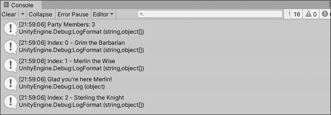
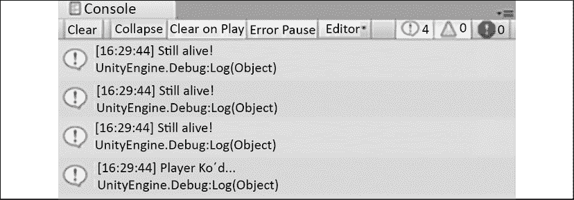

# 第四章：控制流和集合类型

计算机的一个核心职责是在满足预定条件时控制发生的事情。当你点击一个文件夹时，你期望它会打开；当你在键盘上输入时，你期望文本会反映你的击键。为应用程序或游戏编写代码也是一样的——它们在一种状态下需要以某种方式行为，而在条件改变时则需要另一种方式。在编程术语中，这被称为控制流，这很合适，因为它控制了代码在不同情况下的执行流程。

除了使用控制语句，我们还将亲自了解集合数据类型。集合是一类允许在单个变量中存储多个值和值组合的类型。我们将把本章分解为以下主题：

+   选择语句

+   使用数组、字典和列表集合

+   使用`for`、`foreach`和`while`循环的迭代语句

+   修复无限循环

# 选择语句

最复杂的编程问题通常可以归结为一系列简单选择，游戏或程序会评估并执行。由于 Visual Studio 和 Unity 不能自己做出这些选择，编写这些决策就取决于我们。

`if-else`和`switch`选择语句允许您根据一个或多个条件指定分支路径，以及在每种情况下要执行的操作。传统上，这些条件包括以下内容：

+   检测用户输入

+   评估表达式和布尔逻辑

+   比较变量或文字值

你将从最简单的条件语句`if-else`开始，在下一节中。

## if-else 语句

`if-else`语句是代码中做出决策的最常见方式。当剥离所有语法时，基本思想是，“如果我的条件满足，执行这一段代码；如果不满足，执行另一段代码”。把这些语句想象成门，或者说是门，条件就是它们的钥匙。要通过，钥匙必须有效。否则，入口将被拒绝，代码将被发送到下一个可能的门。让我们来看看声明这些门的语法。

有效的`if-else`语句需要以下内容：

+   在行首的`if`关键字

+   一对括号来保存条件

+   花括号内的语句体

它看起来像这样：

```cs
if(condition is true)
{
    Execute code of code 
} 
```

可选地，可以添加一个`else`语句来存储当`if`语句条件失败时要采取的操作。`else`语句也适用相同的规则：

```cs
else 
    Execute single line of code
// OR
else 
{
    Execute multiple lines
    of code
} 
```

以蓝图形式，语法几乎读起来像一句话，这就是为什么这是推荐的方法：

```cs
if(condition is true)
{
    Execute this code
    block
}
else 
{
    Execute this code 
    block
} 
```

由于这些是逻辑思维的很好入门，至少在编程中，我们将更详细地解释三种不同的`if-else`变体：

1.  单个`if`语句可以独立存在，如果不关心条件不满足时会发生什么。在下面的例子中，如果`hasDungeonKey`设置为`true`，那么会打印出一个调试日志；如果设置为`false`，则不会执行任何代码：

```cs
public class LearningCurve: MonoBehaviour 
{
    public bool hasDungeonKey = true;
    Void Start() 
    {
        if(hasDungeonKey) 
        {
            Debug.Log("You possess the sacred key – enter.");
        }
    }
} 
```

当提到条件被满足时，我的意思是它评估为 true，这通常被称为通过条件。

1.  在需要无论条件是否为真都需要采取行动的情况下，可以添加一个`else`语句。如果`hasDungeonKey`为`false`，`if`语句将失败，代码执行将跳转到`else`语句：

```cs
public class LearningCurve: MonoBehaviour 
{
    public bool hasDungeonKey = true;
    void Start() 
    {
        if(hasDungeonKey) 
        {
            Debug.Log("You possess the sacred key – enter.");
        } 
        else 
        {
            Debug.Log("You have not proved yourself yet.");
        }
    }
} 
```

1.  对于需要有两个以上可能结果的情况，可以添加一个`else-if`语句，其中包括括号、条件和花括号。这最好通过示例来展示，而不是解释，我们将在下一节中做。

请记住，`if`语句可以单独使用，但其他语句不能单独存在。您还可以使用基本的数学运算符创建更复杂的条件，例如`>`（大于），`<`（小于），`>=`（大于或等于），`<=`（小于或等于）和`==`（等于）。例如，条件（2>3）将返回`false`并失败，而条件（2<3）将返回`true`并通过。

现在不要太担心任何其他事情；你很快就会接触到这些东西。

让我们写一个`if-else`语句来检查角色口袋里的钱数，对三种不同情况返回不同的调试日志——大于`50`，小于`15`，以及其他任何情况：

1.  打开`LearningCurve`并添加一个新的公共`int`变量，名为`CurrentGold`。将其值设置在 1 到 100 之间：

```cs
public int CurrentGold = 32; 
```

1.  创建一个没有返回值的`public`方法，名为`Thievery`，并在`Start`中调用它。

1.  在新函数中，添加一个`if`语句来检查`CurrentGold`是否大于`50`，如果是，则向控制台打印一条消息：

```cs
if(CurrentGold > 50)
{
    Debug.Log("You're rolling in it!");
} 
```

1.  添加一个`else-if`语句来检查`CurrentGold`是否小于`15`，并添加一个不同的调试日志：

```cs
else if (CurrentGold < 15)
{
    Debug.Log("Not much there to steal...");
} 
```

1.  添加一个没有条件的`else`语句和一个最终的默认日志：

```cs
else
{
    Debug.Log("Looks like your purse is in the sweet spot.");
} 
```

1.  保存文件，检查您的方法是否与下面的代码匹配，并点击播放：

```cs
public void Thievery()
{
    if(CurrentGold > 50)
    {
        Debug.Log("You're rolling in it!");
    } else if (CurrentGold < 15)
    {
        Debug.Log("Not much there to steal...");
    } else
    {
        Debug.Log("Looks like your purse is in the sweet spot.");
    }
} 
```

在我的示例中，将`CurrentGold`设置为`32`，我们可以将代码序列分解如下：

1.  `if`语句和调试日志被跳过，因为`CurrentGold`不大于`50`。

1.  `else-if`语句和调试日志也被跳过，因为`CurrentGold`不小于`15`。

1.  由于 32 既不小于 15 也不大于 50，之前的条件都没有满足。`else`语句执行并显示第三个调试日志：

图 4.1：控制台截图显示调试输出

在自己尝试一些其他`CurrentGold`值之后，让我们讨论一下如果我们想测试一个失败的条件会发生什么。

### 使用 NOT 运算符

用例并不总是需要检查正条件或`true`条件，这就是`NOT`运算符发挥作用的地方。用一个感叹号写成的`NOT`运算符允许`if`或`else-if`语句满足负条件或 false 条件。这意味着以下条件是相同的：

```cs
if(variable == false)
// AND
if(!variable) 
```

正如您已经知道的那样，您可以在`if`条件中检查布尔值、文字值或表达式。因此，`NOT`运算符必须是可适应的。

看一下以下两个不同负值`hasDungeonKey`和`weaponType`在`if`语句中的使用示例：

```cs
public class LearningCurve : MonoBehaviour
{
    public bool hasDungeonKey = false;
    public string weaponType = "Arcane Staff";
    void Start()
    {
        if(!hasDungeonKey)
        {
            Debug.Log("You may not enter without the sacred key.");
        }
        if(weaponType != "Longsword")
{
            Debug.Log("You don't appear to have the right type of weapon...");
}
    }
} 
```

我们可以对每个语句进行评估：

+   第一条语句可以翻译为，“如果`hasDungeonKey`为`false`，`if`语句评估为 true 并执行其代码块。”

如果你在想一个 false 值怎么能评估为 true，可以这样想：`if`语句并不是检查值是否为 true，而是检查表达式本身是否为 true。`hasDungeonKey`可能被设置为 false，但这就是我们要检查的，所以在`if`条件的上下文中是 true。

+   第二条语句可以翻译为，“如果`weaponType`的字符串值`不等于` `Longsword`，则执行此代码块。”

您可以在以下截图中看到调试结果：


图 4.2：控制台截图显示 NOT 运算符的输出

但是，如果你还是感到困惑，可以将我们在本节中看到的代码复制到`LearningCurve`中，并尝试改变变量的值，直到弄明白为止。

到目前为止，我们的分支条件相当简单，但 C#也允许条件语句嵌套在彼此内部，以处理更复杂的情况。

### 嵌套语句

`if-else` 语句最有价值的功能之一是它们可以嵌套在彼此内部，从而在代码中创建复杂的逻辑路线。在编程中，我们称它们为决策树。就像真正的走廊一样，后面可能有门，从而创造出一系列可能性的迷宫：

```cs
public class LearningCurve : MonoBehaviour 
{
    public bool weaponEquipped = true;
    public string weaponType = "Longsword";
    void Start()
    {
        if(weaponEquipped)
        {
            if(weaponType == "Longsword")
            {
                Debug.Log("For the Queen!");
            }
        }
        else 
        {
            Debug.Log("Fists aren't going to work against armor...");
        }
    }
} 
```

让我们分解前面的例子：

+   首先，一个 `if` 语句检查我们是否装备了武器。此时，代码只关心它是否为 `true`，而不关心它是什么类型的武器。

+   第二个 `if` 语句检查 `weaponType` 并打印出相关的调试日志。

+   如果第一个 `if` 语句评估为 `false`，代码将跳转到 `else` 语句及其调试日志。如果第二个 `if` 语句评估为 `false`，则不会打印任何内容，因为没有 `else` 语句。

处理逻辑结果的责任完全在程序员身上。你需要确定代码可能走的分支或结果。

到目前为止，你学到的东西将让你轻松应对简单的用例。然而，你很快会发现自己需要更复杂的语句，这就是评估多个条件的地方。

### 评估多个条件

除了嵌套语句，还可以将多个条件检查组合成单个 `if` 或 `else-if` 语句，使用 `AND` `OR` 逻辑运算符：

+   `AND` 用两个和字符 `&&` 写成。使用 `AND` 运算符的任何条件都意味着所有条件都需要为 `if` 语句评估为真才能执行。

+   `OR` 用两个竖线字符 `||` 写成。使用 `OR` 运算符的 `if` 语句将在其条件中的一个或多个为真时执行。

+   条件总是从左到右进行评估。

在下面的示例中，`if` 语句已更新为检查 `weaponEquipped` 和 `weaponType`，两者都需要为真才能执行代码块：

```cs
if(weaponEquipped && weaponType == "Longsword")
{
    Debug.Log("For the Queen!");
} 
```

`AND` `OR` 运算符可以组合在一起以任意顺序检查多个条件。你可以组合的运算符数量也没有限制。只是当一起使用它们时要小心，不要创建永远不会执行的逻辑条件。

现在是时候将到目前为止学到的关于 `if` 语句的一切付诸实践了。所以，如果需要的话，请复习本节，然后继续下一节。

让我们通过一个小宝箱实验来巩固这个主题：

1.  在 `LearningCurve` 的顶部声明三个变量：`PureOfHeart` 是一个 `bool`，应该为 `true`，`HasSecretIncantation` 也是一个 `bool`，应该为 `false`，`RareItem` 是一个字符串，其值由你决定：

```cs
public bool PureOfHeart = true;
public bool HasSecretIncantation = false;
public string RareItem = "Relic Stone"; 
```

1.  创建一个没有返回值的 `public` 方法，名为 `OpenTreasureChamber`，并从 `Start()` 中调用它。

1.  在 `OpenTreasureChamber` 中，声明一个 `if-else` 语句来检查 `PureOfHeart` 是否为 `true` *并且* `RareItem` 是否与你分配给它的字符串值匹配：

```cs
if(PureOfHeart && RareItem == "Relic Stone")
{
} 
```

1.  在第一个内部创建一个嵌套的 `if-else` 语句，检查 `HasSecretIncantation` 是否为 `false`：

```cs
if(!HasSecretIncantation)
{
    Debug.Log("You have the spirit, but not the knowledge.");
} 
```

1.  为每个 `if-else` 情况添加调试日志。

1.  保存，检查你的代码是否与下面的代码匹配，然后点击播放：

```cs
public class LearningCurve : MonoBehaviour
{
    public bool PureOfHeart = true;
    public bool HasSecretIncantation  = false;
    public string RareItem = "Relic Stone";
    // Use this for initialization
    void Start()
    {
        OpenTreasureChamber();
    }
    public void OpenTreasureChamber()
    {
        if(PureOfHeart && RareItem == "Relic Stone")
        {
            if(!HasSecretIncantation)
            {
                Debug.Log("You have the spirit, but not the knowledge.");
            }
            else
            {
                Debug.Log("The treasure is yours, worthy hero!");
            }
        }
        else
        {
            Debug.Log("Come back when you have what it takes.");
        }
    }
} 
```

如果你将变量值与前面的截图匹配，嵌套的 `if` 语句调试日志将被打印出来。这意味着我们的代码通过了检查两个条件的第一个 `if` 语句，但未通过第三个条件：


图 4.3：控制台中的调试输出截图

现在，你可以停在这里，甚至为你所有的条件需求使用更大的 `if-else` 语句，但从长远来看这并不高效。良好的编程是关于使用正确的工具来完成正确的工作，这就是 `switch` 语句的用武之地。

## `switch` 语句

`if-else` 语句是编写决策逻辑的好方法。然而，当你有三四个以上的分支动作时，它们就不可行了。在你意识到之前，你的代码可能会变得像一个难以理解的纠结，更新起来也会很头疼。

`switch`语句接受表达式，并让我们为每种可能的结果编写操作，但格式比`if-else`更简洁。

`switch`语句需要以下元素：

+   `switch`关键字后面跟着一对括号，括号中是条件

+   一对大括号

+   每个可能路径的`case`语句以冒号结尾：单行代码或方法，后跟`break`关键字和分号

+   以冒号结尾的默认`case`语句：单行代码或方法，后跟`break`关键字和分号

以蓝图形式，它看起来像这样：

```cs
switch(matchExpression)
{
    **case** matchValue1:
        Executing code block
        **break****;**
    **case** matchValue2:
        Executing code block
        **break****;**
    **default****:**
        Executing code block
        **break****;**
} 
```

在前面的蓝图中，突出显示的关键字是重要的部分。当定义一个`case`语句时，在其冒号和`break`关键字之间的任何内容都像`if-else`语句的代码块一样。`break`关键字只是告诉程序在选择的`case`触发后完全退出`switch`语句。现在，让我们讨论语句如何确定执行哪个`case`，这被称为模式匹配。

### 模式匹配

在`switch`语句中，模式匹配指的是如何将匹配表达式与多个`case`语句进行验证。匹配表达式可以是任何非空或非空的类型；所有`case`语句的值都需要与匹配表达式的类型匹配。

例如，如果我们有一个`switch`语句，正在评估一个整数变量，那么每个`case`语句都需要指定一个整数值来检查。

具有与表达式匹配的值的`case`语句将被执行。如果没有匹配的`case`，则默认的`case`将被执行。让我们自己试一试！

这是很多新的语法和信息，但看到它在实际中运行会有所帮助。让我们为角色可能采取的不同行动创建一个简单的`switch`语句：

1.  创建一个新的字符串变量（成员或本地），名为`CharacterAction`，并将其设置为`Attack:`

```cs
string CharacterAction = "Attack"; 
```

1.  创建一个没有返回值的`public`方法，名为`PrintCharacterAction`，并在`Start`内调用它。

1.  声明一个`switch`语句，并使用`CharacterAction`作为匹配表达式：

```cs
switch(CharacterAction)
{
} 
```

1.  为`Heal`和`Attack`创建两个`case`语句，其中包含不同的调试日志。不要忘记在每个末尾包括`break`关键字：

```cs
case "Heal":
    Debug.Log("Potion sent.");
    break;
case "Attack":
    Debug.Log("To arms!");
    break; 
```

1.  添加一个带有调试日志和`break`的默认情况：

```cs
default:
    Debug.Log("Shields up.");
    break; 
```

1.  保存文件，确保您的代码与下面的截图匹配，然后点击播放：

```cs
string CharacterAction = "Attack";
// Start is called before the first frame update
void Start()
{
    PrintCharacterAction();
}
public void PrintCharacterAction()
{
    switch(CharacterAction)
    {
        case "Heal":
            Debug.Log("Potion sent.");
            break;
        case "Attack":
            Debug.Log("To arms!");
            break;
        default:
            Debug.Log("Shields up.");
            break;
    }
} 
```

由于`CharacterAction`设置为`Attack`，`switch`语句执行第二个`case`并打印其调试日志：


图 4.4：控制台中`switch`语句输出的截图

将`CharacterAction`更改为`Heal`或未定义的动作，以查看第一个和默认情况的执行情况。

有时您需要几个，但不是所有的`switch`情况都执行相同的操作。这些被称为贯穿案例，是我们下一节的主题。

### 贯穿案例

`switch`语句可以为多个情况执行相同的操作，类似于我们在单个`if`语句中指定多个条件。这个术语叫做贯穿，有时也叫贯穿案例。贯穿案例允许您为多个情况定义一组操作。如果一个`case`块为空或者有没有`break`关键字的代码，它将贯穿到直接下面的`case`。这有助于保持`switch`代码的清晰和高效，避免重复的`case`块。

`case`可以以任何顺序编写，因此创建贯穿案例大大增加了代码的可读性和效率。

让我们模拟一个桌面游戏场景，使用`switch`语句和贯穿案例，其中骰子的点数决定了特定动作的结果：

1.  创建一个`int`变量，名为`DiceRoll`，并将其赋值为`7`：

```cs
int DiceRoll = 7; 
```

1.  创建一个没有返回值的`public`方法，名为`RollDice`，并在`Start`内调用它。

1.  添加一个`switch`语句，使用`DiceRoll`作为匹配表达式：

```cs
switch(DiceRoll)
{
} 
```

1.  为可能的骰子点数`7`、`15`和`20`添加三种情况，并在最后添加一个默认的`case`语句。

1.  `15`和`20`的情况应该有它们自己的调试日志和`break`语句，而情况`7`应该通过到情况`15`：

```cs
case 7:
case 15:
    Debug.Log("Mediocre damage, not bad.");
    break;
case 20:
    Debug.Log("Critical hit, the creature goes down!");
    break;
default:
    Debug.Log("You completely missed and fell on your face.");
    break; 
```

1.  保存文件并在 Unity 中运行它。

如果要查看穿透情况的情况，请尝试在情况 7 中添加调试日志，但不使用`break`关键字。

将`DiceRoll`设置为`7`，`switch`语句将与第一个`case`匹配，然后通过并执行`case 15`，因为它缺少代码块和`break`语句。如果将`DiceRoll`更改为`15`或`20`，控制台将显示它们各自的消息，而任何其他值都将触发语句末尾的默认情况：


图 4.5：穿透 switch 语句代码的屏幕截图

`switch`语句非常强大，甚至可以简化最复杂的决策逻辑。如果您想深入了解 switch 模式匹配，请参考[`docs.microsoft.com/en-us/dotnet/csharp/language-reference/keywords/switch`](https://docs.microsoft.com/en-us/dotnet/csharp/language-reference/keywords/switch)。

这就是我们目前需要了解的有关条件逻辑的全部内容。因此，在继续学习集合之前，请复习本节内容，然后在进行下一步之前进行以下测验！

## 快速测验 1 - if，and，or but

通过以下问题测试您的知识：

1.  用于评估`if`语句的值是什么？

1.  哪个运算符可以将真条件变为假，假条件变为真？

1.  如果`if`语句的代码需要两个条件都为真才能执行，您会使用什么逻辑运算符来连接这些条件？

1.  如果`if`语句的代码只需要两个条件中的一个为真才能执行，您会使用什么逻辑运算符来连接这两个条件？

完成后，您就可以进入集合数据类型的世界了。这些类型将为您的游戏和 C#程序打开全新的编程功能子集！

# 一览集合

到目前为止，我们只需要变量来存储单个值，但有许多情况需要一组值。C#中的集合类型包括数组、字典和列表，每种类型都有其优势和劣势，我们将在接下来的部分讨论。

## 数组

**数组**是 C#提供的最基本的集合。将它们视为一组值的容器，在编程术语中称为*元素*，每个元素都可以单独访问或修改：

+   数组可以存储任何类型的值；所有元素都需要是相同的类型。

+   数组的长度或元素数量在创建时确定，之后不能修改。

+   如果在创建数组时未分配初始值，则每个元素将被赋予默认值。存储数字类型的数组默认为零，而任何其他类型都设置为 null 或 nothing。

数组是 C#中最不灵活的集合类型。这主要是因为元素在创建后无法添加或删除。然而，当存储不太可能改变的信息时，它们特别有用。这种缺乏灵活性使它们与其他集合类型相比更快。

声明数组与我们之前使用的其他变量类型类似，但有一些修改：

+   数组变量需要指定的元素类型、一对方括号和一个唯一的名称。

+   `new`关键字用于在内存中创建数组，后跟值类型和另一对方括号。保留的内存区域的大小与您打算存储在新数组中的数据的确切大小相同。

+   数组将存储的元素数量放在第二对方括号中。

在蓝图形式中，它看起来像这样：

```cs
elementType[] name = new elementType[numberOfElements]; 
```

让我们举一个例子，我们需要存储游戏中的前三个最高分：

```cs
int[] topPlayerScores = new int[3]; 
```

`topPlayerScores`被分解为一个将存储三个整数元素的整数数组。由于我们没有添加任何初始值，`topPlayerScores`中的三个值都是`0`。但是，如果更改数组大小，则原始数组的内容将丢失，因此要小心。

您可以在变量声明的末尾将值直接赋给数组，方法是将它们添加到一对花括号中。C#有一种长格式和短格式的做法，但两者都是有效的：

```cs
// Longhand initializer
int[] topPlayerScores = new int[] {713, 549, 984};
// Shortcut initializer
int[] topPlayerScores = { 713, 549, 984 }; 
```

使用简写语法初始化数组非常常见，因此我将在本书的其余部分中使用它。但是，如果您想提醒自己有关细节，可以随时使用显式措辞。

现在声明语法不再是一个谜了，让我们来谈谈数组元素是如何存储和访问的。

### 索引和下标

每个数组元素都按分配顺序存储，这称为它的索引。数组是从零开始索引的，这意味着元素顺序从零开始而不是从一开始。将元素的索引视为其引用或位置。

在`topPlayerScores`中，第一个整数`452`位于索引`0`，`713`位于索引`1`，`984`位于索引`2`：


图 4.6：数组索引映射到它们的值

使用下标运算符，可以通过其索引找到各个值，下标运算符是一对包含元素索引的方括号。例如，要检索并存储`topPlayerScores`中的第二个数组元素，我们将使用数组名称，后跟下标括号和索引`1`：

```cs
// The value of score is set to 713
int score = topPlayerScores[1]; 
```

下标运算符也可以用于直接修改数组值，就像任何其他变量一样，甚至可以作为表达式传递：

```cs
topPlayerScores[1] = 1001; 
```

`topPlayerScores`中的值将是`452`，`1001`和`984`。

### 范围异常

创建数组时，元素的数量是固定的，无法更改，这意味着我们无法访问不存在的元素。在`topPlayerScores`示例中，数组长度为 3，因此有效索引的范围是从`0`到`2`。任何`3`或更高的索引都超出了数组的范围，并将在控制台中生成一个名为`IndexOutOfRangeException`的错误：


图 4.7：索引超出范围异常的屏幕截图

良好的编程习惯要求我们通过检查我们想要的值是否在数组的索引范围内来避免范围异常，这将在*迭代语句*部分中介绍。

您可以使用`Length`属性始终检查数组的长度，即它包含多少项：

```cs
topPlayerScores.Length; 
```

在我们的例子中，`topPlayerScores`的长度为 4。

数组并不是 C#提供的唯一集合类型。在下一节中，我们将处理列表，它们在编程领域中更加灵活和常见。

## 列表

**列表**与数组密切相关，可以在单个变量中收集相同类型的多个值。在添加、删除和更新元素时，它们要处理起来更加容易，但它们的元素并不是按顺序存储的。它们也是可变的，这意味着您可以更改正在存储的项目的长度或数量，而不必覆盖整个变量。这有时可能会导致与数组相比更高的性能成本。

性能成本是指给定操作占用计算机时间和能量的多少。如今，计算机速度很快，但仍然可能因大型游戏或应用程序而过载。

列表类型变量需要满足以下要求：

+   `List`关键字，其元素类型在左右箭头字符内，以及一个唯一的名称

+   使用`new`关键字在内存中初始化列表，使用`List`关键字和箭头字符之间的元素类型

+   由分号结束的一对括号

在蓝图形式中，它的读法如下：

```cs
List<elementType> name = new List<elementType>(); 
```

列表长度总是可以修改的，因此在创建时不需要指定它最终将容纳多少元素。

与数组一样，列表可以在变量声明中初始化，方法是在一对花括号中添加元素值：

```cs
List<elementType> name = new List<elementType>() { value1, value2 }; 
```

元素按添加顺序存储（而不是值本身的顺序），从零开始索引，并且可以使用下标运算符进行访问。

让我们开始设置自己的列表，以测试该类提供的基本功能。

让我们通过创建一个虚构角色扮演游戏中的成员列表来进行热身练习：

1.  在`Start`内部创建一个名为`QuestPartyMembers`的`string`类型的新`List`，并用三个角色的名称初始化它：

```cs
List<string> QuestPartyMembers = new List<string>()
    {
        "Grim the Barbarian",
        "Merlin the Wise",
        "Sterling the Knight"
    }; 
```

1.  添加一个调试日志，使用`Count`方法打印出列表中的成员数量：

```cs
Debug.LogFormat("Party Members: {0}", QuestPartyMembers.Count); 
```

1.  保存文件并在 Unity 中播放它。

我们初始化了一个名为`QuestPartyMembers`的新列表，其中现在包含三个字符串值，并使用`List`类的`Count`方法打印出元素的数量。请注意，您对列表使用`Count`，但对数组使用`Length`。


图 4.8：控制台中列表项输出的屏幕截图

知道列表中有多少元素非常有用；但是，在大多数情况下，这些信息是不够的。我们希望能够根据需要修改我们的列表，接下来我们将讨论这一点。

### 访问和修改列表

列表元素可以像数组一样使用下标运算符和索引进行访问和修改，只要索引在`List`类的范围内。但是，`List`类具有各种方法来扩展其功能，例如添加、插入和删除元素。

继续使用`QuestPartyMembers`列表，让我们向团队添加一个新成员：

```cs
 QuestPartyMembers.Add("Craven the Necromancer"); 
```

`Add()`方法将新元素附加到列表末尾，这将使`QuestPartyMembers`计数为四，并且元素顺序如下：

```cs
{ "Grim the Barbarian", "Merlin the Wise", "Sterling the Knight",
    "Craven the Necromancer"}; 
```

要将元素添加到列表中的特定位置，我们可以将索引和要添加到`Insert()`方法的值传递：

```cs
 QuestPartyMembers.Insert(1, "Tanis the Thief"); 
```

当元素插入到先前占用的索引时，列表中的所有元素的索引都增加了`1`。在我们的例子中，``"Tanis the Thief"``现在位于索引`1`，这意味着``"Merlin the Wise"``现在位于索引`2`而不是`1`，依此类推：

```cs
{ "Grim the Barbarian", "Tanis the Thief", "Merlin the Wise", "Sterling
    the Knight", "Craven the Necromancer"}; 
```

删除元素同样简单；我们只需要索引或文字值，`List`类就会完成工作：

```cs
// Both of these methods would remove the required element
QuestPartyMembers.RemoveAt(0); 
QuestPartyMembers.Remove("Grim the Barbarian"); 
```

在我们的编辑结束时，`QuestPartyMembers`现在包含以下从`0`到`3`的元素：

```cs
{ "Tanis the Thief", "Merlin the Wise", "Sterling the Knight", "Craven
    the Necromancer"}; 
```

`List`类有许多其他方法，允许进行值检查、查找和排序元素，并处理范围。可以在此处找到完整的方法列表和描述：[`docs.microsoft.com/en-us/dotnet/api/system.collections.generic.list-1?view=netframework-4.7.2`](https://docs.microsoft.com/en-us/dotnet/api/system.collections.generic.list-1?view=netframework-4.7.2)。

虽然列表非常适合单个值元素，但有些情况下，您需要存储包含多个值的信息或数据。这就是字典发挥作用的地方。

## 字典

**字典**类型通过在每个元素中存储值对而不是单个值，而不是数组和列表。这些元素被称为键值对：键充当其对应值的索引或查找值。与数组和列表不同，字典是无序的。但是，它们可以在创建后以各种配置进行排序和排序。

声明字典几乎与声明列表相同，但有一个额外的细节——需要在箭头符号内指定键和值类型：

```cs
Dictionary<keyType, valueType> name = new Dictionary<keyType,
  valueType>(); 
```

要使用键值对初始化字典，请执行以下操作：

+   在声明的末尾使用一对花括号。

+   将每个元素添加到其花括号对中，键和值用逗号分隔。

+   用逗号分隔元素，最后一个元素的逗号是可选的。

它看起来像这样：

```cs
Dictionary<keyType, valueType> name = new Dictionary<keyType,
  valueType>()
{
    {key1, value1},
    {key2, value2}
}; 
```

在选择键值时需要考虑的一个重要注意事项是，每个键必须是唯一的，且不能更改。如果需要更新键，则需要在变量声明中更改其值，或者在代码中删除整个键值对并添加另一个，我们将在下面看到。

就像数组和列表一样，字典可以在一行上初始化，而不会受到来自 Visual Studio 的问题。然而，像前面的例子中那样在每一行上写出每个键值对，是一个良好的习惯——无论是为了可读性还是为了你的理智。

让我们创建一个字典来存储角色可能携带的物品：

1.  在`Start`方法中声明一个`key`类型为`string`，`value`类型为`int`的`Dictionary`，名为`ItemInventory`。

1.  将其初始化为`new Dictionary<string, int>()`，并添加三个自己选择的键值对。确保每个元素都在其花括号对中：

```cs
Dictionary<string, int> `I`temInventory = new Dictionary<string, int>()
    {
        { "Potion", 5 },
        { "Antidote", 7 },
        { "Aspirin", 1 }
    }; 
```

1.  添加一个调试日志以打印出`ItemInventory.Count`属性，以便我们可以看到物品是如何存储的：

```cs
Debug.LogFormat("Items: {0}", `I`temInventory.Count); 
```

1.  保存文件并播放。

在这里，创建了一个名为`ItemInventory`的新字典，并用三个键值对进行了初始化。我们将键指定为字符串，对应的值为整数，并打印出`ItemInventory`当前持有的元素数量：


图 4.9：控制台中字典计数的截图

与列表一样，我们需要能够做的不仅仅是打印出给定字典中键值对的数量。我们将在下一节中探讨添加、删除和更新这些值。

### 处理字典对

键值对可以使用下标和类方法从字典中添加、删除和访问。使用下标运算符和元素的键来检索元素的值，在下面的例子中，`numberOfPotions`将被赋予`5`的值：

```cs
int numberOfPotions = `I`temInventory["Potion"]; 
```

可以使用相同的方法更新元素的值——与`"Potion"`相关联的值现在将是`10`：

```cs
`I`temInventory["Potion"] = 10; 
```

可以通过`Add`方法和下标运算符的两种方式向字典中添加元素。`Add`方法接受一个键和一个值，并创建一个新的键值元素，只要它们的类型与字典声明相对应：

```cs
`I`temInventory.Add("Throwing Knife", 3); 
```

如果使用下标运算符为字典中不存在的键分配一个值，编译器将自动将其添加为新的键值对。例如，如果我们想要为`"Bandage"`添加一个新元素，我们可以使用以下代码：

```cs
`I`temInventory["Bandage"] = 5; 
```

这带来了一个关键的问题，关于引用键值对：最好在尝试访问之前确定元素是否存在，以避免错误地添加新的键值对。将`ContainsKey`方法与`if`语句配对是一个简单的解决方案，因为`ContainsKey`根据键是否存在返回一个布尔值。在下面的例子中，我们确保在修改其值之前使用`if`语句检查`"Aspirin"`键是否存在：

```cs
if(`I`temInventory.ContainsKey("Aspirin"))
{
    `I`temInventory["Aspirin"] = 3;
} 
```

最后，可以使用`Remove()`方法从字典中删除一个键值对，该方法接受一个键参数：

```cs
`I`temInventory.Remove("Antidote"); 
```

与列表一样，字典提供了各种方法和功能，使开发更加容易，但我们无法在这里覆盖它们所有。如果你感兴趣，官方文档可以在[`docs.microsoft.com/en-us/dotnet/api/system.collections.generic.dictionary-2?view=netframework-4.7.2`](https://docs.microsoft.com/en-us/dotnet/api/system.collections.generic.dictionary-2?view=netframework-4.7.2)找到。

集合已经安全地放在我们的工具包中，所以现在是时候进行另一个测验，以确保你已经准备好转向下一个重要主题：迭代语句。

## 快速测验 2——关于集合的一切

+   数组或列表中的元素是什么？

+   数组或列表中第一个元素的索引号是多少？

+   单个数组或列表可以存储不同类型的数据吗？

+   如何向数组中添加更多元素以为更多数据腾出空间？

由于集合是项目的组或列表，它们需要以有效的方式访问。幸运的是，C#有几个迭代语句，我们将在下一节中讨论。

# 迭代语句

我们通过下标运算符访问了单个集合元素，以及集合类型的方法，但是当我们需要逐个遍历整个集合元素时该怎么办呢？在编程中，这称为迭代，C#提供了几种语句类型，让我们可以循环遍历（或者如果你想要更严谨一些，可以说迭代）集合元素。迭代语句就像方法一样，它们存储要执行的代码块；与方法不同的是，它们可以根据条件重复执行它们的代码块。

## for 循环

`for`循环在程序在继续之前需要执行一定次数的代码块时最常用。语句本身包含三个表达式，每个表达式在循环执行之前执行特定的功能。由于`for`循环跟踪当前迭代，因此最适合于数组和列表。

看一下以下循环语句的蓝图：

```cs
for (initializer; condition; iterator)
{
    code block;
} 
```

让我们来分解一下：

1.  `for`关键字开始语句，后面跟着一对括号。

1.  括号内是守门人：`initializer`、`condition`和`iterator`表达式。

1.  循环从`initializer`表达式开始，这是一个本地变量，用于跟踪循环执行的次数——通常设置为 0，因为集合类型是从零开始索引的。

1.  接下来，将检查`condition`表达式，如果为真，则继续进行迭代。

1.  `iterator`表达式用于增加或减少（递增或递减）`initializer`，这意味着下次循环评估其条件时，`initializer`将不同。

通过增加和减少 1 来增加和减少一个值分别称为递增和递减（`--`将一个值减少 1，`++`将一个值增加 1）。

这听起来很复杂，让我们用我们之前创建的`QuestPartyMembers`列表来看一个实际的例子：

```cs
List<string> QuestPartyMembers = new List<string>()
{ "Grim the Barbarian", "Merlin the Wise", "Sterling the Knight"}; 
for (int i = 0; i < QuestPartyMembers.Count; i++)
{
    Debug.LogFormat("Index: {0} - {1}", i, QuestPartyMembers[i]);
} 
```

让我们再次通过循环并看看它是如何工作的：

1.  首先，在`for`循环中的`initializer`被设置为一个名为`i`的本地`int`变量，初始值为`0`。

1.  为了确保我们永远不会得到超出范围的异常，`for`循环确保只有在`i`小于`QuestPartyMembers`中元素的数量时才运行另一次：

+   对于数组，我们使用`Length`属性来确定它有多少项。

+   对于列表，我们使用`Count`属性

1.  最后，`i`每次循环运行时都会增加 1，使用`++`运算符。

1.  在`for`循环内部，我们刚刚使用`i`打印出了该索引和该索引处的列表元素。

1.  注意，`i`与集合元素的索引保持一致，因为两者都从 0 开始！

图 4.10：使用 for 循环打印出列表值的屏幕截图

传统上，字母`i`通常用作初始化变量名。如果你碰巧有嵌套的`for`循环，那么使用的变量名应该是字母 j、k、l 等。

让我们在我们现有的集合中尝试一下我们的新迭代语句。

当我们循环遍历`QuestPartyMembers`时，让我们看看是否能够确定何时迭代某个元素，并为该情况添加一个特殊的调试日志：

1.  将`QuestPartyMembers`列表和`for`循环移动到名为`FindPartyMember`的公共函数中，并在`Start`中调用它。

1.  在`for`循环中的调试日志下面添加一个`if`语句，以检查当前的`questPartyMember`列表是否与`"Merlin the Wise"`匹配：

```cs
if(QuestPartyMembers[i] == "Merlin the Wise")
{
    Debug.Log("Glad you're here Merlin!");
} 
```

1.  如果是，添加一个你选择的调试日志，检查你的代码是否与下面的屏幕截图匹配，然后点击播放：

```cs
// Start is called before the first frame update
void Start()
{
    FindPartyMember();
}
public void FindPartyMember()
{
    List<string> QuestPartyMembers = new List<string>()
    {
        "Grim the Barbarian",
        "Merlin the Wise",
        "Sterling the Knight"
    };
    Debug.LogFormat("Party Members: {0}", QuestPartyMembers.Count);
    for(int i = 0; i < QuestPartyMembers.Count; i++)
    {
        Debug.LogFormat("Index: {0} - {1}", i, QuestPartyMembers[i]);
        if(QuestPartyMembers[i] == "Merlin the Wise")
        {
            Debug.Log("Glad you're here Merlin!");
        }
    }
} 
```

控制台输出应该几乎相同，只是现在有一个额外的调试日志——当 Merlin 轮到他通过循环时，这个日志只打印了一次。更具体地说，当`i`在第二次循环时等于`1`时，`if`语句触发了，打印出了两个日志而不是一个：



图 4.11：打印列表值和匹配 if 语句的 for 循环的屏幕截图

在适当的情况下，使用标准的`for`循环可能非常有用，但在编程中很少只有一种方法，这就是`foreach`语句发挥作用的地方。

## foreach 循环

`foreach`循环获取集合中的每个元素，并将每个元素存储在本地变量中，使其在语句内可访问。本地变量类型必须与集合元素类型匹配才能正常工作。`foreach`循环可以与数组和列表一起使用，但与字典一起使用尤其有用，因为字典是键值对而不是数字索引。

以蓝图形式，`foreach`循环看起来像这样：

```cs
foreach(elementType localName in collectionVariable)
{
    code block;
} 
```

让我们继续使用`QuestPartyMembers`列表示例，并为其每个元素进行点名：

```cs
List<string> QuestPartyMembers = new List<string>()
{ "Grim the Barbarian", "Merlin the Wise", "Sterling the Knight"};

foreach(string partyMember in QuestPartyMembers)
{
    Debug.LogFormat("{0} - Here!", partyMember);
} 
```

我们可以将其分解如下：

+   元素类型声明为`string`，与`QuestPartyMembers`中的值匹配。

+   创建一个名为`partyMember`的本地变量，以便在循环重复时保存每个元素。

+   `in`关键字，后跟我们想要循环遍历的集合，这种情况下是`QuestPartyMembers`，完成了一切！[](img/B17573_04_12.png)

图 4.12：打印列表值的 foreach 循环的屏幕截图

这比`for`循环简单得多。但是，在处理字典时，有一些重要的区别需要提到，即如何处理键值对作为本地变量。

### 循环遍历键值对

要在本地变量中捕获键值对，我们需要使用名为`KeyValuePair`的类型，将键和值类型分配为与字典对应类型相匹配。由于`KeyValuePair`是其类型，它就像任何其他元素类型一样，作为本地变量。

例如，让我们循环遍历我们在*字典*部分中创建的`ItemInventory`字典，并调试每个键值对，就像商店物品描述一样：

```cs
Dictionary<string, int> `I`temInventory = new Dictionary<string, int>()
{
    { "Potion", 5},
    { "Antidote", 7},
    { "Aspirin", 1}
};

foreach(KeyValuePair<string, int> kvp in `I`temInventory)
{
     Debug.LogFormat("Item: {0} - {1}g", kvp.Key, kvp.Value);
} 
```

我们指定了一个名为`KeyValuePair`的本地变量`kvp`，这是编程中的一种常见命名惯例，就像将`for`循环初始化器称为`i`，并将`key`和`value`类型设置为`string`和`int`以匹配`ItemInventory`。

要访问本地`kvp`变量的键和值，我们分别使用`KeyValuePair`的`Key`和`Value`属性。

在这个例子中，键是`字符串`，`值`是整数，我们可以将其打印出来作为项目名称和项目价格：


图 4.13：打印字典键值对的 foreach 循环的屏幕截图

如果你感到特别有冒险精神，可以尝试以下可选挑战，以加深你刚刚学到的知识。

#### 英雄的试炼-寻找实惠的物品

使用前面的脚本，创建一个变量来存储你虚构角色拥有的金币数量，并查看是否可以在`foreach`循环内添加一个`if`语句来检查你能负担得起的物品。

提示：使用`kvp.Value`来比较你的钱包中的价格。

## while 循环

`while`循环类似于`if`语句，因为它们只要单个表达式或条件为真就会运行。

值比较和布尔变量可以用作`while`条件，并且可以用`NOT`运算符进行修改。

`while`循环语法是这样说的，*只要我的条件为真，就无限运行我的代码块*：

```cs
Initializer
while (condition)
{
    code block;
    iterator;
} 
```

使用`while`循环时，通常会声明一个初始化变量，就像`for`循环一样，并在循环代码块的末尾手动增加或减少它。我们这样做是为了避免无限循环，我们将在本章末讨论这个问题。根据您的情况，初始化变量通常是循环条件的一部分。

在 C#编程中，`while`循环非常有用，但在 Unity 中并不被认为是良好的实践，因为它们可能会对性能产生负面影响，并且通常需要手动管理。

让我们来看一个常见的用例，我们需要在玩家还活着时执行代码，然后在不再是这种情况时进行调试：

1.  创建一个名为`PlayerLives`的`int`类型的初始化变量，并将其设置为`3`：

```cs
int PlayerLives = 3; 
```

1.  创建一个名为`HealthStatus`的新公共函数，并在`Start`中调用它。

1.  声明一个`while`循环，检查`PlayerLives`是否大于`0`（也就是玩家还活着）：

```cs
while(PlayerLives > 0)
{
} 
```

1.  在`while`循环内，调试一些内容，让我们知道角色仍然活着，然后使用`--`运算符将`PlayerLives`减 1：

```cs
Debug.Log("Still alive!");
PlayerLives--; 
```

1.  在`while`循环的大括号后添加一个调试日志，以便在生命耗尽时打印一些内容：

```cs
Debug.Log("Player KO'd..."); 
```

您的代码应该如下所示：

```cs
int PlayerLives = 3;
// Start is called before the first frame update
void Start()
{
    HealthStatus();
}
public void HealthStatus()
{
    while(PlayerLives > 0)
    {
        Debug.Log("Still alive!");
        PlayerLives--;
    }
    Debug.Log("Player KO'd...");
} 
```

当`PlayerLives`从`3`开始时，`while`循环将执行三次。在每次循环中，调试日志`"Still alive!"`会触发，并且会从`PlayerLives`中减去一条生命。当`while`循环要执行第四次时，我们的条件失败了，因为`PlayerLives`为`0`，所以代码块被跳过，最终的调试日志打印出来：



图 4.14：控制台中 while 循环输出的屏幕截图

如果您没有看到多个"Still alive!"的调试日志，请确保**控制台**工具栏中的**折叠**按钮没有被选中。

现在的问题是，如果循环永远不停止执行会发生什么？我们将在下一节讨论这个问题。

## 到无穷大和更远

在完成本章之前，我们需要了解一个非常重要的概念，即迭代语句：*无限循环*。这正是它们的名字：当循环的条件使得它无法停止运行并继续在程序中执行时。无限循环通常发生在`for`和`while`循环中，当迭代器没有增加或减少时；如果在`while`循环示例中省略了`PlayerLives`代码行，Unity 将会冻结和/或崩溃，因为`PlayerLives`将永远是 3，并且循环会一直执行下去。

迭代器并不是唯一需要注意的问题；在`for`循环中设置永远不会失败或评估为 false 的条件也会导致无限循环。在*遍历键值对*部分的团队成员示例中，如果我们将`for`循环的条件设置为`i < 0`而不是`i < QuestPartyMembers.Count`，`i`将永远小于`0`，循环直到 Unity 崩溃。

# 总结

随着本章的结束，我们应该反思我们取得了多少成就，以及我们可以用这些新知识构建什么。我们知道如何使用简单的`if-else`检查和更复杂的`switch`语句，在代码中进行决策。我们可以使用数组和列表存储值的集合，或者使用字典存储键值对。这样可以高效地存储复杂和分组的数据。我们甚至可以为每种集合类型选择合适的循环语句，同时小心避免无限循环崩溃。

如果您感到不知所措，那完全没问题——逻辑、顺序思维都是锻炼您编程大脑的一部分。

下一章将完成 C#编程的基础知识，介绍类、结构体和**面向对象编程**（**OOP**）。我们将把迄今为止学到的所有内容都应用到这些主题中，为我们第一次真正深入理解和控制 Unity 引擎中的对象做准备。

# 加入我们的 Discord！

与其他用户、Unity/C#专家和 Harrison Ferrone 一起阅读本书。提出问题，为其他读者提供解决方案，通过*问我任何事*与作者交流，以及更多。

立即加入！

[`packt.link/csharpunity2021`](https://packt.link/csharpunity2021)


