# 第六章：在 Unity 中动手实践

创建游戏涉及的远不止在代码中模拟动作。设计、故事、环境、灯光和动画都在为玩家设定舞台中扮演着重要的角色。游戏首先是一种体验，单靠代码是无法实现的。

在过去的十年里，Unity 通过为程序员和非程序员带来先进的工具，将自己置于游戏开发的最前沿。动画和特效、音频、环境设计等等，所有这些都可以直接从 Unity 编辑器中获得，而不需要一行代码。我们将在定义我们的游戏的需求、环境和游戏机制时讨论这些话题。然而，首先，我们需要一个游戏设计的主题介绍。

游戏设计理论是一个庞大的研究领域，学习它的所有秘密可能需要整个职业生涯。然而，我们只会动手实践基础知识；其他一切都取决于你去探索！这一章将为我们打下基础，并涵盖以下话题：

+   游戏设计入门

+   建造一个关卡

+   灯光基础

+   在 Unity 中制作动画

# 游戏设计入门

在着手任何游戏项目之前，重要的是要有一个你想要构建的蓝图。有时，想法会在你的脑海中变得清晰明了，但一旦你开始创建角色类别或环境，事情似乎会偏离你最初的意图。这就是游戏设计允许你规划以下接触点的地方：

+   **概念**：游戏的大局观念和设计，包括它的类型和玩法风格。

+   **核心机制**：角色在游戏中可以进行的可玩特性或互动。常见的游戏机制包括跳跃、射击、解谜或驾驶。

+   **控制方案**：给玩家控制他们的角色、环境互动和其他可执行动作的按钮和/或键的地图。

+   **故事**：推动游戏的潜在叙事，创造玩家和他们所玩的游戏世界之间的共鸣和连接。

+   **艺术风格**：游戏的整体外观和感觉，从角色和菜单艺术到关卡和环境都保持一致。

+   **胜利和失败条件**：规定游戏如何获胜或失败的规则，通常包括潜在失败的目标或目标。

这些话题绝不是游戏设计所涉及的全部内容的详尽列表。然而，它们是开始构思所谓的游戏设计文件的好地方，这是你下一个任务！

## 游戏设计文件

谷歌游戏设计文件会得到一大堆模板、格式规则和内容指南，这可能会让新程序员准备放弃。事实上，设计文件是根据创建它们的团队或公司量身定制的，比互联网上的想象要容易得多。

一般来说，有三种类型的设计文档，如下：

+   **游戏设计文件**（**GDD**）：GDD 包含了游戏的玩法、氛围、故事以及它试图创造的体验。根据游戏的不同，这个文件可能只有几页长，也可能有几百页。

+   **技术设计文件**（**TDD**）：这个文件关注游戏的所有技术方面，从它将在哪种硬件上运行到类别和程序架构需要如何构建。和 GDD 一样，长度会根据项目的不同而变化。

+   **一页纸**：通常用于营销或推广情况，一页纸本质上是你游戏的快照。顾名思义，它应该只占据一页纸。

没有一种正确或错误的方式来格式化 GDD，所以这是一个让你的创造力茁壮成长的好地方。加入一些启发你的参考材料的图片；在布局上发挥创意——这是你定义你的愿景的地方。

我们将在本书的其余部分中一直致力于开发的游戏相当简单，不需要像 GDD 或 TDD 那样详细的东西。相反，我们将创建一个一页来跟踪我们的项目目标和一些背景信息。

## Hero Born 一页

为了使我们在前进时保持在正确的轨道上，我已经准备了一个简单的文档，概述了游戏原型的基础知识。在继续之前，请仔细阅读一遍，并尝试想象我们迄今学到的一些编程概念如何付诸实践：


图 6.1：Hero Born 一页文档

现在你已经对我们游戏的骨架有了一个高层次的了解，你可以开始建立一个原型关卡来容纳游戏体验。

# 建立一个关卡

在构建游戏关卡时，尝试从玩家的角度看事物总是一个好主意。你希望他们如何看待环境，如何与之交互，以及在其中行走时的感受？你实际上正在构建你的游戏存在的世界，所以要保持一致。

使用 Unity，你可以选择使用地形工具创建室外环境，用基本形状和几何图形来阻挡室内设置，或者两者的混合。你甚至可以从其他程序（如 Blender）导入 3D 模型，用作场景中的对象。

Unity 在[`docs.unity3d.com/Manual/script-Terrain.html`](https://docs.unity3d.com/Manual/script-Terrain.html)上有一个很好的地形工具介绍。如果你选择这条路线，Unity Asset Store 上还有一个名为 Terrain Toolkit 2017 的免费资产，可以在[`assetstore.unity.com/packages/tools/terrain/terrain-toolkit-2017-83490`](https://assetstore.unity.com/packages/tools/terrain/terrain-toolkit-2017-83490)找到。你也可以使用 Blender 等工具来创建你的游戏资产，可以在[`www.blender.org/features/modeling/`](https://www.blender.org/features/modeling/)找到。

对于*Hero Born*，我们将坚持简单的室内竞技场设置，这样可以轻松移动，但也有一些角落可以藏身。你将使用**primitives**——Unity 提供的基本对象形状——将所有这些组合在一起，因为它们在场景中创建、缩放和定位起来非常容易。

## 创建 primitives

看着你经常玩的游戏，你可能会想知道如何才能创建看起来如此逼真，以至于似乎可以伸手进屏幕抓住它们的模型和物体。幸运的是，Unity 有一组基本的 GameObject 可以供你选择，以便更快地创建原型。这些可能不会很华丽或高清，但当你在学习或开发团队中没有 3D 艺术家时，它们是救命稻草。

如果你打开 Unity，你可以进入**Hierarchy**面板，点击**+** | **3D Object**，你会看到所有可用的选项，但其中只有大约一半是 primitives 或常见形状，如下面的截图所示，用红色标出：

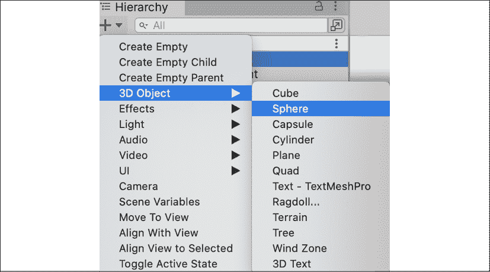

图 6.2：Unity Hierarchy 窗口，选择 Create 选项

其他 3D 对象选项，如**Terrain**，**Wind Zone**和**Tree**，对我们的需求来说有点太高级了，但如果你感兴趣，可以随意尝试它们。

你可以在[`docs.unity3d.com/Manual/CreatingEnvironments.html`](https://docs.unity3d.com/Manual/CreatingEnvironments.html)找到更多关于构建 Unity 环境的信息。

在我们跳得太远之前，当你脚下有地板时，四处走动通常更容易，所以让我们从以下步骤开始为我们的竞技场创建一个地面平面：

1.  在**Hierarchy**面板中，点击**+** | **3D Object** | **Plane**

1.  确保在**Hierarchy**选项卡中选择了新对象，在**Inspector**选项卡中将 GameObject 重命名为`Ground`

1.  在**Transform**下拉菜单中，将**Scale**更改为`3`，在**X**，**Y**和**Z**轴上：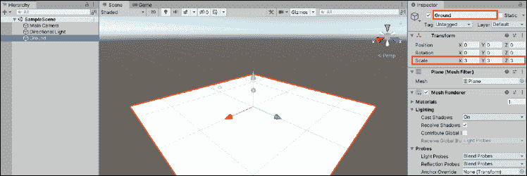

图 6.3：Unity 编辑器中的地面平面

1.  如果你的场景中的光线看起来比之前的截图暗或不同，选择**层次**面板中的**定向光**，并将**定向光**组件的**强度**值设置为 1：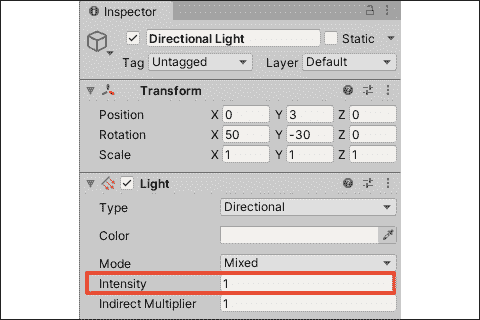

图 6.4：在检视器窗格中选择定向光对象

我们创建了一个平面 GameObject，并增加了它的大小，以便为我们未来的角色提供更多活动空间。这个平面将像一个受现实物理约束的 3D 对象一样，意味着其他物体不能穿过它。我们将在*第七章*“移动、摄像机控制和碰撞”中更多地讨论 Unity 物理系统及其工作原理。现在，我们需要开始以 3D 思维。

## 以 3D 思考

现在我们在场景中有了第一个对象，我们可以谈论 3D 空间——具体来说，一个对象的位置、旋转和比例在三维空间中的行为。如果你回想一下高中几何学，应该对具有*x*和*y*坐标系的图表很熟悉。要在图表上标出一个点，你必须有一个*x*值和一个*y*值。

Unity 支持 2D 和 3D 游戏开发，如果我们制作 2D 游戏，我们可以在这里结束解释。然而，在 Unity 编辑器中处理 3D 空间时，我们有一个额外的轴，称为*z*轴。*z*轴映射深度或透视，赋予了我们的空间和其中的物体 3D 的特性。

这可能一开始会让人困惑，但 Unity 有一些很好的视觉辅助工具，可以帮助你理清思路。在**场景**面板的右上方，你会看到一个几何图标，上面标有红色、绿色和蓝色的*x*、*y*和*z*轴。当在**层次**窗口中选择 GameObject 时，场景中的所有 GameObject 都会显示它们的轴箭头：


图 6.5：带有定向图标的场景视图

这将始终显示场景的当前方向和放置在其中的对象的方向。单击任何这些彩色轴将切换场景方向到所选轴。自己尝试一下，以便熟悉切换视角。

如果你在**检视器**窗格中查看**Ground**对象的**Transform**组件，你会看到位置、旋转和比例都由这三个轴决定。

位置决定了物体在场景中的放置位置，旋转决定了它的角度，而比例则决定了它的大小。这些值可以随时在**检视器**窗格或 C#脚本中进行更改：


图 6.6：在层次中选择的地面对象

现在，地面看起来有点无聊。让我们用材质来改变它。

## 材质

我们的地面平面现在并不是很有趣，但我们可以使用**材质**为关卡注入一些生气。材质控制着 GameObject 在场景中的渲染方式，这由材质的着色器决定。将**着色器**视为负责将光照和纹理数据组合成材质外观的部分。

每个 GameObject 都以默认的**材质**和**着色器**开始（在此处从**检视器**窗格中显示），将其颜色设置为标准白色：

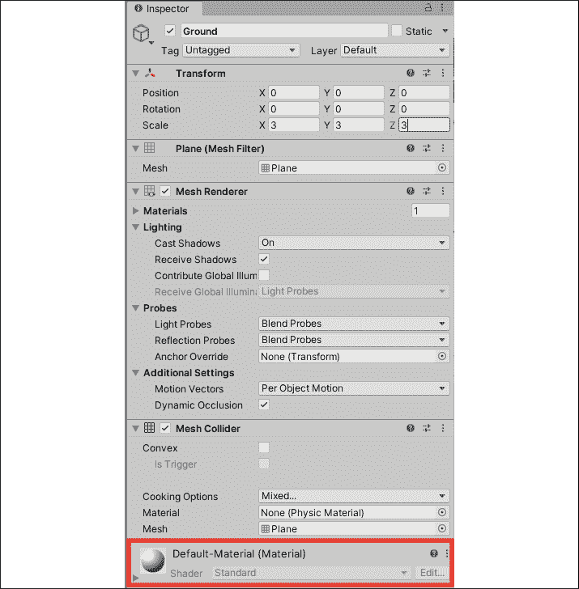

图 6.7：对象上的默认材质

要改变对象的颜色，我们需要创建一个材质并将其拖到我们想要修改的对象上。记住，在 Unity 中一切都是对象——材质也不例外。材质可以在需要时重复使用在许多 GameObject 上，但对材质的任何更改也会传递到附加了该材质的任何对象上。如果我们在场景中有几个敌人对象，它们都使用一个将它们都设置为红色的材质，然后我们将基础材质颜色更改为蓝色，那么所有的敌人都会变成蓝色。

蓝色很吸引人；让我们将地面平面的颜色改成蓝色，并创建一个新的材质，将地面平面从沉闷的白色变成深沉而充满活力的蓝色：

1.  在**项目**面板中创建一个新文件夹，并将其命名为`Materials`。

1.  在**材质**文件夹中，右键单击**+** | **材质**，并将其命名为`Ground_Mat`。

1.  点击**反照率**属性旁边的颜色框，从弹出的颜色选择窗口中选择您的颜色，然后关闭它。

1.  从**项目**面板中拖动`Ground_Mat`对象，并将其放到**层次结构**面板中的`Ground`游戏对象上：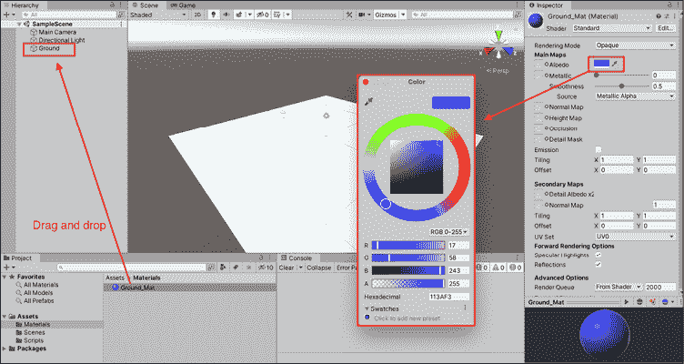

图 6.8：材质颜色选择器

您创建的新材质现在是一个项目资产。将`Ground_Mat`拖放到`Ground`游戏对象中改变了平面的颜色，这意味着对`Ground_Mat`的任何更改都将反映在`Ground`中。

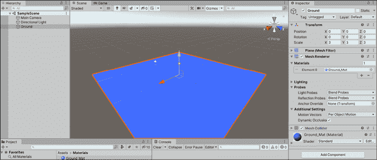

图 6.9：更新颜色材质的地面平面

地面是我们的画布；然而，在 3D 空间中，它可以支持其表面上的其他 3D 对象。将由您来用有趣的障碍物来填充它，以供未来的玩家使用。

## 白盒设计

白盒设计是一个设计术语，用于使用占位符布置想法，通常是为了在以后用成品替换它们。在关卡设计中，白盒设计的做法是用原始游戏对象来阻挡环境，以便了解你想要它看起来的感觉。这是一个很好的开始方式，特别是在游戏原型阶段。

在深入研究 Unity 之前，我想先用简单的草图来描述我的关卡的基本布局和位置。这给了我们一点方向，并将有助于更快地布置我们的环境。

在下面的图中，您将能够看到我心目中的竞技场，中间有一个可以通过坡道进入的高台，每个角落都有小炮塔：

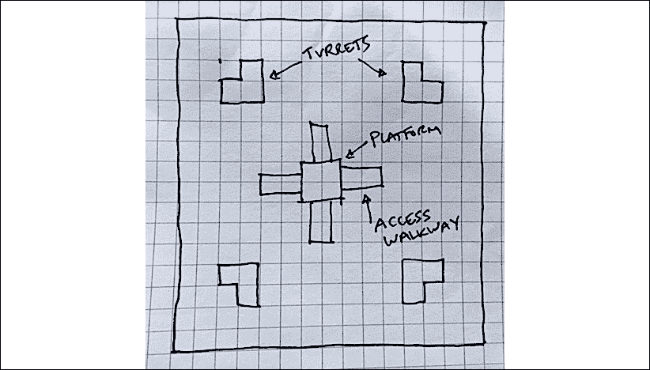

图 6.10：《英雄诞生》关卡竞技场的草图

不用担心如果你不是一个艺术家——我也不是。重要的是把你的想法写下来，巩固在你的脑海中，并在忙于在 Unity 中工作之前解决任何问题。

在全力以赴之前，您需要熟悉一些 Unity 编辑器的快捷方式，以使白盒设计更容易。

### 编辑器工具

当我们在*第一章*中讨论 Unity 界面时，我们略过了一些工具栏功能，现在我们需要重新讨论一下，以便知道如何有效地操作游戏对象。你可以在 Unity 编辑器的左上角找到它们：


图 6.11：Unity 编辑器工具栏

让我们分解一下在前面截图中从工具栏中可以使用的不同工具：

1.  **手**: 这允许您通过单击和拖动鼠标来平移和改变场景中的位置。

1.  **移动**：这让你通过拖动它们的相应箭头来沿着*x*、*y*和*z*轴移动物体。

1.  **旋转**：这让你通过转动或拖动其相应的标记来调整物体的旋转。

1.  **缩放**：这让你通过将其拖动到特定轴来修改物体的比例。

1.  **矩形变换**：这将移动、旋转和缩放工具功能合并为一个包。

1.  **变换**：这让你一次性访问物体的位置、旋转和缩放。

1.  **自定义编辑器工具**：这允许您访问您为编辑器构建的任何自定义工具。不用担心这个，因为它远远超出了我们的范围。如果您想了解更多，请参阅[`docs.unity3d.com/2020.1/Documentation/ScriptReference/EditorTools.EditorTool.html`](https://docs.unity3d.com/2020.1/Documentation/ScriptReference/EditorTools.EditorTool.html)中的文档。

你可以在**场景**面板中找到有关导航和定位游戏对象的更多信息，网址是[`docs.unity3d.com/Manual/PositioningGameObjects.html`](https://docs.unity3d.com/Manual/PositioningGameObjects.html)。值得注意的是，你可以使用**Transform**组件来移动、定位和缩放对象，就像我们在本章前面讨论的那样。

在场景中进行平移和导航可以使用类似的工具，尽管不是来自 Unity 编辑器本身：

+   要四处看，按住鼠标右键并拖动以使相机移动。

+   在使用相机时移动，继续按住鼠标右键，使用*W*、*A*、*S*和*D*键分别向前、向后、向左和向右移动。

+   按下*F*键，可以放大并聚焦在**层次**面板中已选择的游戏对象上。

这种场景导航更常被称为飞行模式，所以当我要求你专注于或导航到特定对象或视点时，请使用这些功能的组合。

在场景视图中移动有时可能是一项任务，但这一切都归结于反复练习。有关场景导航功能的更详细列表，请访问[`docs.unity3d.com/Manual/SceneViewNavigation.html`](https://docs.unity3d.com/Manual/SceneViewNavigation.html)。

尽管地面平面不会让我们的角色穿过它，但在这一点上我们仍然可以走到边缘。你的任务是将竞技场围起来，这样玩家就有了一个有限的移动区域。

### 英雄的试炼——安装石膏板

使用基本立方体和工具栏，使用**移动**、**旋转**和**缩放**工具将四面墙围绕主竞技场分隔开：

1.  在**层次**面板中，选择**+** | **3D 对象** | **立方体**来创建第一面墙，并将其命名为`Wall_01`。

1.  将其比例值设置为*x*轴 30，*y*轴 1.5，*z*轴 0.2。

请注意，平面的操作比对象大 10 倍——所以我们的长度为 3 的平面与长度为 30 的对象长度相同。

1.  在**层次**面板中选择`Wall_01`对象，切换到左上角的位置工具，并使用红色、绿色和蓝色箭头将墙定位在地面平面的边缘。

1.  重复*步骤 1-3*，直到你的区域周围有四面墙为止：

图 6.12：四面墙和地面平面的竞技场

从本章开始，我将给出一些墙的位置、旋转和缩放的基本值，但请随意尝试并发挥你的创造力。我希望你能尝试使用 Unity 编辑器工具，这样你就能更快地熟悉它们。

这有点施工，但竞技场开始成形了！在继续添加障碍和平台之前，你需要养成整理对象层次结构的习惯。我们将在下一节讨论这是如何工作的。

### 保持层次结构清晰

通常，我会把这种建议放在部分的结尾，但确保你的项目层次结构尽可能有条理是非常重要的，所以它需要有自己的小节。理想情况下，你会希望所有相关的游戏对象都在一个**父对象**下面。现在，这并不是一个风险，因为我们场景中只有几个对象；然而，在一个大型项目中，当数量增加到几百个时，你会很吃力。

保持层次结构清晰的最简单方法是将相关对象存储在一个父对象中，就像你在桌面上的文件夹中一样。我们的场景有一些需要组织的对象，Unity 通过让我们创建空的游戏对象来使这变得容易。空对象是一个完美的容器（或文件夹），用于保存相关的对象组，因为它不附带任何组件——它只是一个外壳。

让我们把我们的地面平面和四面墙都放在一个共同的空游戏对象下：

1.  在**层次结构**面板中选择**+** | **创建空对象**，并将新对象命名为`环境`

1.  将地面和四面墙拖放到**环境**中，使它们成为子对象

1.  选择**环境**空对象，并检查其**X**、**Y**和**Z**位置是否都设置为 0：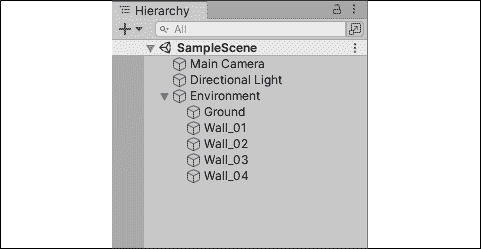

图 6.13：显示空 GameObject 父对象的层次结构面板

环境在**层次结构**选项卡中作为父对象存在，其子对象是竞技场对象。现在我们可以通过箭头图标展开或关闭**环境**对象的下拉列表，使**层次结构**面板变得不那么凌乱。

将**环境**对象的**X**、**Y**和**Z**位置设置为 0 是很重要的，因为子对象的位置现在是相对于父对象位置的。这带来了一个有趣的问题：我们设置的这些位置、旋转和缩放的原点是什么？答案是它们取决于我们使用的相对空间，而在 Unity 中，这些空间要么是**世界**空间，要么是**本地**空间：

+   **世界空间**使用场景中的一个固定原点作为所有 GameObject 的恒定参考。在 Unity 中，这个原点是 (0, 0, 0)，或者 *x*、*y* 和 *z* 轴上的 0。

+   **本地空间**使用对象的父级`Transform`组件作为其原点，从本质上改变了场景的透视。Unity 还将本地原点设置为 (0, 0, 0)。可以将其视为父级变换是宇宙的中心，其他所有东西都围绕它而轨道运行。

这两种方向在不同情况下都很有用，但是现在，在这一点上重置它会让每个人都从同一起跑线开始。

### 使用 Prefabs

Prefabs 是 Unity 中最强大的组件之一。它们不仅在关卡构建中很有用，而且在脚本编写中也很有用。将 Prefabs 视为 GameObject，可以保存并重复使用每个子对象、组件、C#脚本和属性设置。创建后，Prefab 就像一个类蓝图；在场景中使用的每个副本都是该 Prefab 的单独实例。因此，对基本 Prefab 的任何更改也会更改场景中所有活动实例。

竞技场看起来有点太简单，完全是敞开的，这使得它成为测试创建和编辑 Prefabs 的完美场所。由于我们希望在竞技场的每个角落都有四个相同的炮塔，它们是 Prefab 的完美案例，我们可以通过以下步骤创建：

我没有包含任何精确的屏障位置、旋转或缩放值，因为我希望你能亲自接触 Unity 编辑器工具。

未来，当你看到一个任务在你面前时，不包括特定的位置、旋转或缩放值，我希望你能通过实践学习。

1.  通过选择**+** | **创建空对象**在**环境**父对象内创建一个空的父对象，并将其命名为`屏障 _01`。

1.  使用**+** | **3D 对象** | **立方体**选择创建两个立方体，并将它们定位和缩放成 V 形的底座。

1.  创建两个更多的立方体原语，并将它们放在炮塔底座的两端：

图 6.14：由立方体组成的炮塔的屏幕截图

1.  在**项目**面板下的**资产**下创建一个名为`Prefabs`的新文件夹。然后，将**层次结构**面板中的**屏障 _01** GameObject 拖到项目视图中的**Prefabs**文件夹中：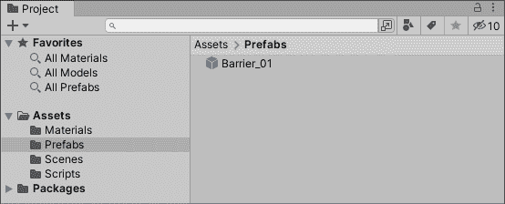

图 6.15：Prefabs 文件夹中的屏障 Prefab

**屏障 _01** 及其所有子对象现在都是 Prefabs，这意味着我们可以通过从`Prefabs`文件夹中拖动副本或复制场景中的副本来重复使用它。**屏障 _01** 在**层次结构**选项卡中变成蓝色，表示其状态发生了变化，并在**检查器**选项卡中其名称下方添加了一排 Prefab 功能按钮：

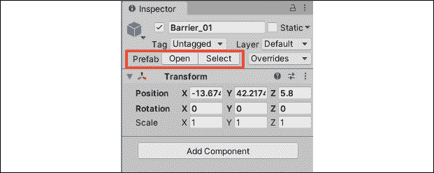

图 6.16：在检查器窗格中突出显示的屏障 _01 Prefab

对原始预制件对象**Barrier_01**的任何编辑现在都会影响场景中的任何副本。由于我们需要第五个立方体来完成屏障，让我们更新并保存预制件，看看它的效果。

现在我们的炮塔中间有一个巨大的缺口，这对于保护我们的角色来说并不理想，所以让我们通过添加另一个立方体并应用更改来更新**Barrier_01**预制件：

1.  创建一个**立方体**原始对象，并将其放置在炮塔底座的交叉点处。

1.  新的**立方体**原始对象将在**层次结构**选项卡中以灰色标记，并在其名称旁边有一个小**+**图标。这意味着它还没有正式成为预制件的一部分！[](img/B17573_06_17.png)

图 6.17：层次结构窗口中标记的新预制件更新

1.  在**层次结构**面板中右键单击新的立方体原始对象，然后选择**添加** **游戏对象** | **应用于预制件'Barrier_01'**：

图 6.18：将预制件更改应用到基本预制件的选项

**Barrier_01**预制件现在已更新，包括新的立方体，并且整个预制件层次结构应该再次变为蓝色。现在你有一个看起来像前面截图的炮塔预制件，或者如果你感到有冒险精神，也可以是更有创意的东西。然而，我们希望这些在竞技场的每个角落都有。你的任务是添加它们！

现在我们有了一个可重复使用的屏障预制件，让我们构建出与本节开头的草图相匹配的关卡的其余部分：

1.  通过复制**Barrier_01**预制件三次，并将每个预制件放置在竞技场的不同角落。你可以通过将多个**Barrier_01**对象从**预制件**文件夹拖放到场景中，或者在**层次结构**中右键单击**Barrier_01**并选择复制来完成这个操作。

1.  在**环境**父对象内创建一个新的空游戏对象，并将其命名为`Raised_Platform`。

1.  创建一个**立方体**，并按下面的*图 6.19*所示进行缩放，形成一个平台。

1.  创建一个**平面**，并将其缩放成一个斜坡：

+   提示：围绕*x*或*y*轴旋转平面，可以创建一个倾斜的平面

+   然后，将其位置调整，使其连接平台和地面。

1.  通过在 Mac 上使用`Cmd` + `D`，或在 Windows 上使用`Ctrl` + `D`，复制斜坡对象。然后，重复旋转和定位步骤。

1.  重复上一步骤两次，直到总共有四个斜坡通向平台！[](img/B17573_06_19.png)

图 6.19：提升平台父游戏对象

你现在已经成功地创建了你的第一个游戏关卡的白盒模型！不过，不要太沉迷其中——我们只是刚刚开始。所有好的游戏都有玩家可以拾取或与之交互的物品。在接下来的挑战中，你的任务是创建一个生命值道具并将其制作成预制件。

#### 英雄的试炼-创建一个生命值道具

将我们在本章中学到的一切放在一起可能需要你花费几分钟的时间，但这是非常值得的。按照以下步骤创建拾取物品：

1.  通过选择**+** | **3D 对象** | **胶囊体**，创建一个名为`Health_Pickup`的**胶囊体**游戏对象。

1.  将*x*、*y*和*z*轴的比例设置为 0.3，然后切换到**移动**工具，并将其位置放置在你的屏障之一附近。

1.  为**Health_Pickup**对象创建并附加一个新的黄色**材质**。

1.  将**Health_Pickup**对象从**层次结构**面板拖动到**预制件**文件夹中。

参考以下截图，了解最终产品的样子：


图 6.20：场景中的拾取物品和屏障预制件

这就暂时结束了我们对关卡设计和布局的工作。接下来，你将在 Unity 中快速学习灯光，并且我们将在本章后面学习如何为我们的物品添加动画。

# 灯光基础知识

Unity 中的照明是一个广泛的主题，但可以归结为两类：实时和预计算。这两种类型的光都考虑了光的颜色和强度等属性，以及它在场景中的方向，这些都可以在**检视器**窗格中配置。区别在于 Unity 引擎计算光的方式。

*实时照明*是每帧计算的，这意味着任何通过其路径的物体都会投射出逼真的阴影，并且通常会像真实世界的光源一样行为。然而，这可能会显著减慢游戏速度，并且根据场景中的光源数量，会消耗大量的计算资源。另一方面，*预计算照明*将场景的照明存储在称为**光照贴图**的纹理中，然后将其应用或烘烤到场景中。虽然这节省了计算资源，但烘烤的照明是静态的。这意味着当物体在场景中移动时，它不会实时反应或改变。

还有一种混合类型的照明称为预计算实时全局照明，它弥合了实时和预计算过程之间的差距。这是一个高级的 Unity 特定主题，所以我们不会在本书中涵盖它，但可以随时查看[`docs.unity3d.com/Manual/GIIntro.html`](https://docs.unity3d.com/Manual/GIIntro.html)上的文档。

现在让我们看看如何在 Unity 场景中创建光对象。

## 创建光

默认情况下，每个场景都带有一个定向光组件，用作主要的照明源，但光可以像其他游戏对象一样在层次结构中创建。尽管控制光源的概念可能对您来说是新的，但它们是 Unity 中的对象，这意味着它们可以被定位，缩放和旋转以适应您的需求。

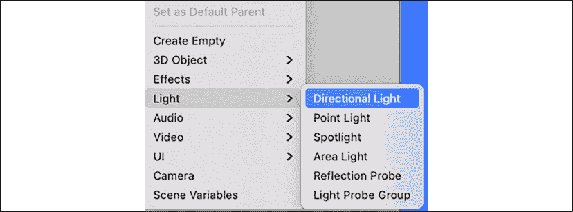

图 6.21：光照创建菜单选项

让我们看一些实时光对象及其性能的例子：

+   **定向光**非常适合模拟自然光，比如阳光。它们在场景中没有实际位置，但它们的光会像永远指向同一个方向一样照射到所有物体上。

+   **点光源**本质上是浮动的球体，从球体的中心点向所有方向发出光线。它们在场景中有定义的位置和强度。

+   **聚光灯**向特定方向发出光线，但它们受其角度的限制，并专注于场景的特定区域。可以将其视为现实世界中的聚光灯或泛光灯。

+   **区域光**的形状类似矩形，从矩形的一侧表面发出光线。

**反射探针**和**光探针组**超出了我们在*英雄诞生*中所需的范围；但是，如果您感兴趣，可以在[`docs.unity3d.com/Manual/ReflectionProbes.html`](https://docs.unity3d.com/Manual/ReflectionProbes.html)和[`docs.unity3d.com/Manual/LightProbes.html`](https://docs.unity3d.com/Manual/LightProbes.html)上了解更多。

像 Unity 中的所有游戏对象一样，光具有可以调整的属性，以赋予场景特定的氛围或主题。

## 光组件属性

以下截图显示了我们场景中定向光的**光**组件。所有这些属性都可以配置，以创建沉浸式环境，但我们需要注意的基本属性是**颜色**，**模式**和**强度**。这些属性控制光的色调，实时或计算效果以及一般强度：


图 6.22：检视器窗口中的光组件

与其他 Unity 组件一样，这些属性可以通过脚本和`Light`类访问，该类可以在[`docs.unity3d.com/ScriptReference/Light.html`](https://docs.unity3d.com/ScriptReference/Light.html)找到。

通过选择**+** | **Light** | **Point Light**来尝试一下，看看它对区域照明有什么影响。在调整了设置之后，通过在**Hierarchy**面板中右键单击它并选择**Delete**来删除点光源。

现在我们对如何点亮游戏场景有了更多了解，让我们把注意力转向添加一些动画！

# 在 Unity 中制作动画

在 Unity 中对对象进行动画处理可以从简单的旋转效果到复杂的角色移动和动作。你可以在代码中创建动画，也可以使用 Animation 和 Animator 窗口：

+   **动画**窗口是动画片段（称为片段）使用时间轴创建和管理的地方。对象属性沿着这个时间轴记录，然后播放回来创建动画效果。

+   **Animator**窗口使用叫做动画控制器的对象来管理这些片段及其转换。

你可以在[`docs.unity3d.com/Manual/AnimatorControllers.html`](https://docs.unity3d.com/Manual/AnimatorControllers.html)找到有关 Animator 窗口及其控制器的更多信息。

在片段中创建和操作目标对象将使你的游戏很快就动起来。对于我们在 Unity 动画中的短暂旅程，我们将在代码中和使用 Animator 创建相同的旋转效果。

## 在代码中创建动画

首先，我们将在代码中创建一个动画来旋转我们的生命物品拾取。由于所有的 GameObject 都有一个`Transform`组件，我们可以获取我们物品的`Transform`组件并无限旋转它。

要在代码中创建动画，需要执行以下步骤：

1.  在`Scripts`文件夹中创建一个新的脚本，命名为`ItemRotation`，并在 Visual Studio Code 中打开它。

1.  在新脚本的顶部和类内部，添加一个包含值`100`的`int`变量，名为`RotationSpeed`，和一个名为`ItemTransform`的`Transform`变量：

```cs
public int RotationSpeed = 100;
Transform ItemTransform; 
```

1.  在`Start()`方法体内，获取 GameObject 的`Transform`组件并将其分配给`ItemTransform`：

```cs
ItemTransform = this.GetComponent<Transform>(); 
```

1.  在`Update()`方法体内，调用`ItemTransform.Rotate`。这个`Transform`类方法接受三个轴，分别是*X*、*Y*和*Z*旋转，你想要执行。由于我们希望物品绕着末端旋转，我们将使用*x*轴，其他轴设置为`0`：

```cs
ItemTransform.Rotate(RotationSpeed * Time.deltaTime, 0, 0); 
```

您会注意到我们将`RotationSpeed`乘以一个叫做`Time.deltaTime`的东西。这是在 Unity 中标准化移动效果的方法，这样无论玩家的电脑运行速度快慢，效果都会看起来很平滑。一般来说，你应该总是将你的移动或旋转速度乘以`Time.deltaTime`。

1.  回到 Unity，在**项目**面板的`Prefabs`文件夹中选择`Health_Pickup`对象，滚动到**检视**窗口的底部。点击**添加组件**，搜索`ItemRotation`脚本，然后按`Enter`：

图 6.23：检视面板中的添加组件按钮

1.  现在我们的预制已经更新，移动**Main Camera**，这样你就可以看到`Health_Pickup`对象并点击播放！[](img/B17573_06_24.png)

图 6.24：焦点在生命物品上的相机截图

如你所见，生命物品现在围绕其*x*轴连续而平滑地旋转！现在你已经在代码中为物品添加了动画，我们将使用 Unity 内置的动画系统来复制我们的动画。

## 在 Unity 动画窗口中创建动画

任何你想要应用动画片段的 GameObject 都需要附加到一个设置了**动画控制器**的 Animator 组件上。如果在创建新片段时项目中没有控制器，Unity 将创建一个并保存在项目面板中，然后你可以用它来管理你的片段。你的下一个挑战是为拾取物品创建一个新的动画片段。

我们将开始通过创建一个新的动画片段来为`Health_Pickup`Prefab 添加动画，该动画将使对象无限循环旋转。要创建一个新的动画片段，我们需要执行以下步骤：

1.  导航到**窗口** | **动画** | **动画**，打开**动画**面板，并将**动画**选项卡拖放到**控制台**旁边。

1.  确保在**Hierarchy**中选择了`Health_Pickup`项目，然后在**Animation**面板中单击**Create**：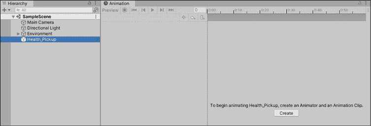

图 6.25：Unity 动画窗口的屏幕截图

1.  从下拉列表中创建一个名为`Animations`的新文件夹，然后将新片段命名为`Pickup_Spin`：

图 6.26：创建新动画窗口的屏幕截图

1.  确保新片段出现在**Animation**面板中：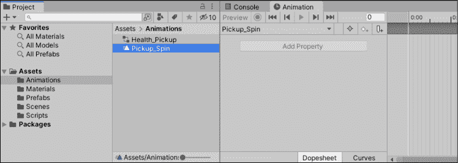

图 6.27：动画窗口的屏幕截图，选择了一个片段

1.  由于我们没有任何**Animator**控制器，Unity 为我们在`Animation`文件夹中创建了一个名为**Health_Pickup**的控制器。选择**Health_Pickup**后，在**检查器**窗格中注意到，当我们创建了片段时，**Animator**组件也被添加到了 Prefab 中，但尚未使用**Health_Pickup**控制器正式保存到 Prefab 中。

1.  注意，**+**图标显示在**Animator**组件的左上角，这意味着它还没有成为**Health_Pickup**Prefab 的一部分：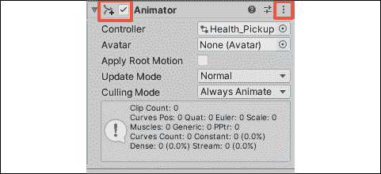

图 6.28：检查器面板中的 Animator 组件

1.  选择右上角的三个垂直点图标，选择**添加组件** | **应用于 Prefab 'Health_Pickup'**：

图 6.29：应用于 Prefab 的新组件的屏幕截图

现在，您已经创建并添加了一个 Animator 组件到**Health_Pickup**Prefab，是时候开始记录一些动画帧了。当您想到动作片段时，就像电影一样，您可能会想到帧。当片段通过其帧移动时，动画会前进，产生移动的效果。在 Unity 中也是一样的；我们需要在不同的帧中记录我们的目标对象在不同的位置，这样 Unity 才能播放片段。

## 记录关键帧

现在我们有了一个可以使用的片段，您将在**Animation**窗口中看到一个空白的时间轴。基本上，当我们修改**Health_Pickup**Prefab 的*z*旋转，或者任何其他可以被动画化的属性时，时间轴将记录这些更改作为关键帧。然后 Unity 将这些关键帧组合成完整的动画，类似于模拟电影中的单个帧一起播放成为移动图片。

看一下以下的屏幕截图，并记住记录按钮和时间轴的位置：


图 6.30：动画窗口和关键帧时间轴的屏幕截图

现在，让我们让我们的物品旋转起来。对于旋转动画，我们希望**Health_Pickup**Prefab 在其*z*轴上每秒完成 360 度的旋转，这可以通过设置三个关键帧并让 Unity 处理其余部分来完成：

1.  在**Hierarchy**窗口中选择**Health_Pickup**对象，选择**添加属性** | **变换**，然后单击**旋转**旁边的**+**号：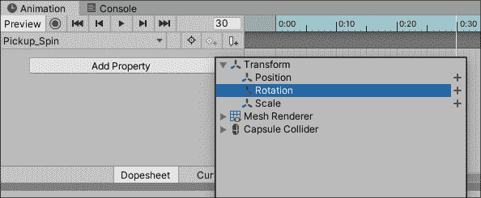

图 6.31：添加用于动画的变换属性的屏幕截图

1.  单击记录按钮开始动画：

+   将光标放在时间轴上的**0:00**处，但将**Health_Pickup**Prefab 的*z*旋转保持在 0

+   将光标放在时间轴上的**0:30**处，并将*z*旋转设置为**180**

+   将光标放在时间轴上的**1:00**处，并将*z*旋转设置为**360**

图 6.32：记录动画关键帧的屏幕截图

1.  单击记录按钮完成动画

1.  点击记录按钮右侧的播放按钮，查看动画循环

您会注意到我们的**Animator**动画覆盖了我们之前在代码中编写的动画。不用担心，这是预期的行为。您可以单击**Inspector**面板中任何组件右侧的小复选框来激活或停用它。如果停用**Animator**组件，**Health_Pickup**将再次使用我们的代码围绕*x*轴旋转。

**Health_Pickup**对象现在在*z*轴上每秒在 0、180 和 360 度之间旋转，创建循环旋转动画。如果您现在播放游戏，动画将无限期地运行，直到游戏停止：

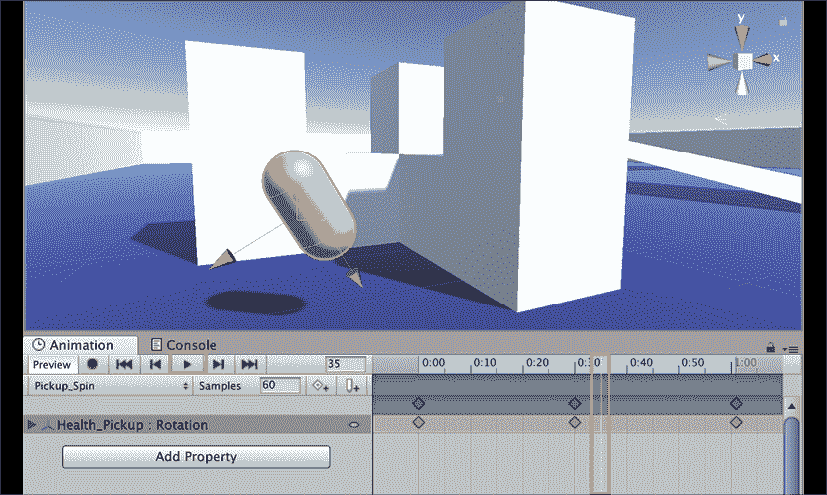

图 6.33：在动画窗口中播放动画的屏幕截图

所有动画都有曲线，这些曲线决定了动画执行的特定属性。我们不会对这些做太多处理，但了解基础知识很重要。我们将在下一节中深入了解它们。

## 曲线和切线

除了对对象属性进行动画处理外，Unity 还允许我们使用动画曲线管理动画随时间的播放方式。到目前为止，我们一直处于**Dopesheet**模式，您可以在动画窗口底部进行更改。如果您点击**Curves**视图（如下屏幕截图所示），您将看到一个不同的图形，其中有重点放置在我们记录的关键帧的位置。

我们希望旋转动画是平滑的，也就是我们所说的线性，所以我们会保持一切不变。然而，可以通过拖动或调整曲线图上的点来加快、减慢或改变动画的运行过程中的任何时点的动画：

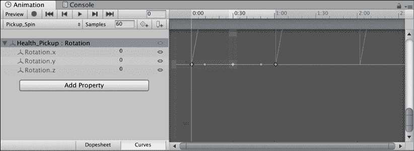

图 6.34：动画窗口中曲线时间轴的屏幕截图

虽然动画曲线处理了属性随时间的变化，但我们仍然需要一种方法来解决每次**Health_Pickup**动画重复时出现的停滞。为此，我们需要更改动画的切线，这会管理关键帧之间的平滑过渡。

这些选项可以通过在**Dopesheet**模式下右键单击时间轴上的任何关键帧来访问，您可以在这里看到：


图 6.35：关键帧平滑选项的屏幕截图

曲线和切线都是中级/高级内容，所以我们不会深入研究它们。如果您感兴趣，可以查看有关动画曲线和切线选项的文档：[`docs.unity3d.com/Manual/animeditor-AnimationCurves.html`](https://docs.unity3d.com/Manual/animeditor-AnimationCurves.html)。

如果您按照现在的旋转动画播放，物品完成完整旋转并开始新旋转之间会有轻微的暂停。您的任务是使其平滑，这是下一个挑战的主题。

让我们调整动画的第一帧和最后一帧的切线，使得旋转动画在重复时能无缝衔接：

1.  右键单击动画时间轴上第一个和最后一个关键帧的菱形图标，然后选择**Auto**：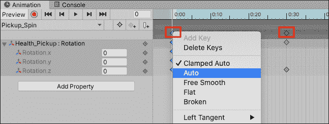

图 6.36：更改关键帧平滑选项的屏幕截图

1.  如果您还没有这样做，请移动**Main Camera**，以便您可以看到`Health_Pickup`对象并点击播放：

图 6.37：最终平滑动画播放的屏幕截图

将第一个和最后一个关键帧的切线更改为**Auto**告诉 Unity 使它们的过渡平滑，从而消除动画循环时的突然停止/开始运动。

这就是本书中您需要的所有动画，但我鼓励您查看 Unity 在这个领域提供的全部工具。您的游戏将更具吸引力，您的玩家会感谢您！

# 总结

我们已经完成了另一个章节，其中有很多组成部分，对于那些对 Unity 还不太熟悉的人来说可能会有很多内容。

尽管这本书侧重于 C#语言及其在 Unity 中的实现，我们仍然需要花时间来了解游戏开发、文档和引擎的非脚本功能。虽然我们没有时间深入涉及照明和动画，但如果您打算继续创建 Unity 项目，了解它们是值得的。

在下一章中，我们将把重点转回到编程《英雄诞生》的核心机制，从设置可移动的玩家对象、控制摄像机，以及理解 Unity 的物理系统如何管理游戏世界开始。

# 弹出测验-基本 Unity 功能

1.  立方体、胶囊体和球体是什么类型的 GameObject 的例子？

1.  Unity 使用哪个轴来表示深度，从而赋予场景其 3D 外观？

1.  如何将 GameObject 转换为可重用的 Prefab？

1.  Unity 动画系统使用什么单位来记录对象动画？

# 加入我们的 Discord！

与其他用户、Unity/C#专家和 Harrison Ferrone 一起阅读本书。通过*问我任何事*会话与作者交流，提出问题，为其他读者提供解决方案，等等。

立即加入！

[`packt.link/csharpunity2021`](https://packt.link/csharpunity2021)


