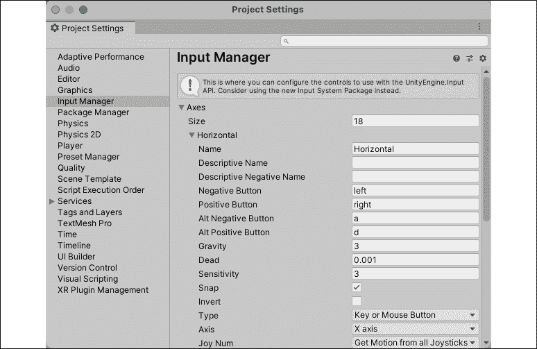
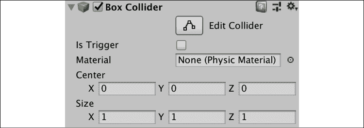
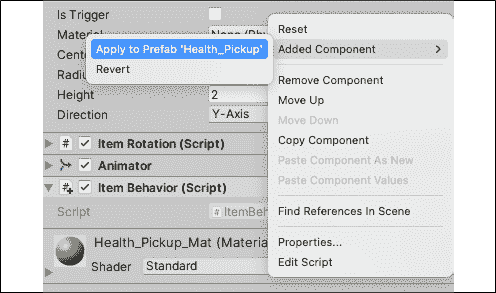

# 第七章：7

# 移动、摄像机控制和碰撞

当玩家开始新游戏时，首先要做的事情之一就是尝试角色移动（当然，如果游戏有可移动的角色），以及摄像机控制。这不仅令人兴奋，而且让你的玩家知道他们可以期待什么样的游戏玩法。*Hero Born*中的角色将是一个可以使用`W`、`A`、`S`、`D`或箭头键分别移动和旋转的胶囊体对象。

我们将首先学习如何操作玩家对象的`Transform`组件，然后使用施加的力复制相同的玩家控制方案。这会产生更真实的移动效果。当我们移动玩家时，摄像机将从稍微在玩家后面和上方的位置跟随，这样在实现射击机制时瞄准会更容易。最后，我们将通过使用物品拾取预制件来探索 Unity 物理系统如何处理碰撞和物理交互。

所有这些将在可玩的水平上汇聚在一起，尽管目前还没有任何射击机制。这也将让我们初次尝试使用 C#来编写游戏功能，将以下主题联系在一起：

+   管理玩家移动

+   使用`Transform`组件移动玩家

+   编写摄像机行为

+   使用 Unity 物理系统。

# 管理玩家移动

当你决定如何最好地在虚拟世界中移动你的玩家角色时，请考虑什么看起来最真实，而不会因昂贵的计算而使游戏陷入困境。在大多数情况下，这在某种程度上是一种权衡，Unity 也不例外。

移动`GameObject`的三种最常见方式及其结果如下：

+   **选项 A**：使用`GameObject`的`Transform`组件进行移动和旋转。这是最简单的解决方案，也是我们首先要使用的解决方案。

+   **选项 B**：通过在`GameObject`上附加`Rigidbody`组件并在代码中施加力来使用真实世界的物理。`Rigidbody`组件为其附加的任何`GameObject`添加了模拟的真实世界物理。这种解决方案依赖于 Unity 的物理系统来进行繁重的工作，从而产生更真实的效果。我们将在本章后面更新我们的代码以使用这种方法，以便了解两种方法的感觉。

Unity 建议在移动或旋转`GameObject`时坚持一致的方法；要么操作对象的`Transform`组件，要么操作`Rigidbody`组件，但不能同时操作两者。

+   **选项 C**：附加一个现成的 Unity 组件或预制件，如 Character Controller 或 First Person Controller。这样可以减少样板代码，同时在加快原型设计时间的同时仍提供逼真的效果。

你可以在[`docs.unity3d.com/ScriptReference/CharacterController.html`](https://docs.unity3d.com/ScriptReference/CharacterController.html)找到有关 Character Controller 组件及其用途的更多信息。

第一人称控制器预制件可从标准资产包中获得，你可以从[`assetstore.unity.com/packages/essentials/asset-packs/standard-assets-32351`](https://assetstore.unity.com/packages/essentials/asset-packs/standard-assets-32351)下载。

由于你刚刚开始在 Unity 中进行玩家移动，你将在下一节开始使用玩家 Transform 组件，然后在本章后面转移到`Rigidbody`物理。

# 使用 Transform 组件移动玩家

我们希望为*Hero Born*创建一个第三人称冒险设置，因此我们将从一个可以通过键盘输入控制的胶囊体和一个可以跟随胶囊体移动的摄像机开始。尽管这两个 GameObject 将在游戏中一起工作，但我们将它们及其脚本分开以获得更好的控制。

在我们进行任何脚本编写之前，你需要在场景中添加一个玩家胶囊体，这是你的下一个任务。

我们可以在几个步骤中创建一个漂亮的玩家胶囊体：

1.  在**层次结构**面板中单击**+** | **3D 对象** | **胶囊**，然后命名为`Player`。

1.  选择`Player` GameObject，然后在**检视器**选项卡底部单击**添加组件**。搜索**Rigidbody**并按`Enter`添加。我们暂时不会使用这个组件，但是在开始时正确设置东西是很好的。

1.  展开**Rigidbody**组件底部的**约束**属性：

+   勾选**X**、**Y**和**Z**轴上的**冻结旋转**复选框，以便玩家除了通过我们稍后编写的代码之外不能以任何其他方式旋转：

图 7.1：刚体组件

1.  在**项目**面板中选择`Materials`文件夹，然后单击**创建** | **材质**。命名为`Player_Mat`。

1.  在**层次结构**中选择`Player_Mat`，然后在**检视器**中更改**反照率**属性为明亮绿色，并将材质拖动到**层次结构**面板中的**Player**对象上：

图 7.2：附加到胶囊的玩家材质

您已经使用胶囊原语、刚体组件和新的明亮绿色材质创建了**Player**对象。现在暂时不用担心刚体组件是什么——您现在需要知道的是它允许我们的胶囊与物理系统互动。在本章末尾讨论 Unity 的物理系统工作原理时，我们将详细介绍更多内容。在进行这些讨论之前，我们需要谈论 3D 空间中一个非常重要的主题：向量。

## 理解向量

现在我们有了一个玩家胶囊和摄像机设置，我们可以开始看如何使用其`Transform`组件移动和旋转 GameObject。`Translate`和`Rotate`方法是 Unity 提供的`Transform`类的一部分，每个方法都需要一个向量参数来执行其给定的功能。

在 Unity 中，向量用于在 2D 和 3D 空间中保存位置和方向数据，这就是为什么它们有两种类型——`Vector2`和`Vector3`。这些可以像我们见过的任何其他变量类型一样使用；它们只是保存不同的信息。由于我们的游戏是 3D 的，我们将使用`Vector3`对象，这意味着我们需要使用*x*、*y*和*z*值来构造它们。

对于 2D 向量，只需要*x*和*y*位置。请记住，您的 3D 场景中最新的方向将显示在我们在上一章*第六章*中讨论的右上方图形中：


图 7.3：Unity 编辑器中的向量图标

如果您想了解有关 Unity 中向量的更多信息，请参阅文档和脚本参考[`docs.unity3d.com/ScriptReference/Vector3.html`](https://docs.unity3d.com/ScriptReference/Vector3.html)。

例如，如果我们想要创建一个新的向量来保存场景原点的位置，我们可以使用以下代码：

```cs
Vector3 Origin = new Vector(0f, 0f, 0f); 
```

我们所做的只是创建了一个新的`Vector3`变量，并用* x *位置为`0`，* y *位置为`0`，* z *位置为`0`进行了初始化，按顺序排列。这将使玩家生成在游戏竞技场的原点。`Float`值可以带有或不带有小数点，但它们总是需要以小写`f`结尾。

我们还可以使用`Vector2`或`Vector3`类属性创建方向向量：

```cs
Vector3 ForwardDirection = Vector3.forward; 
```

`ForwardDirection`不是保存位置，而是引用我们场景中沿着 3D 空间中*z*轴的前进方向。使用 Vector3 方向的好处是，无论我们让玩家朝向哪个方向，我们的代码始终知道前进的方向。我们将在本章后面讨论使用向量，但现在只需习惯以*x*、*y*和*z*位置和方向来思考 3D 移动。

如果向量的概念对你来说是新的，不要担心——这是一个复杂的主题。Unity 的向量手册是一个很好的起点：[`docs.unity3d.com/Manual/VectorCookbook.html`](https://docs.unity3d.com/Manual/VectorCookbook.html)。

现在你对向量有了一些了解，你可以开始实现移动玩家胶囊的基本功能。为此，你需要从键盘上获取玩家输入，这是下一节的主题。

## 获取玩家输入

位置和方向本身是有用的，但没有玩家的输入，它们无法产生移动。这就是`Input`类的作用，它处理从按键和鼠标位置到加速度和陀螺仪数据的一切。

在*Hero Born*中，我们将使用`W`、`A`、`S`、`D`和箭头键进行移动，同时使用一个允许摄像机跟随玩家鼠标指向的脚本。为此，我们需要了解输入轴的工作原理。

首先，转到**Edit** | **Project Settings** | **Input Manager**，打开如下截图所示的**Input Manager**选项卡：



图 7.4：输入管理器窗口

Unity 2021 有一个新的输入系统，可以减少很多编码工作，使得在编辑器中设置输入动作更容易。由于这是一本编程书，我们将从头开始做事情。但是，如果你想了解新的输入系统是如何工作的，请查看这个很棒的教程：[`learn.unity.com/project/using-the-input-system-in-unity`](https://learn.unity.com/project/using-the-input-system-in-unity)。

你会看到一个很长的 Unity 默认输入已经配置好的列表，但让我们以**Horizontal**轴为例。你可以看到**Horizontal**输入轴的**Positive**和**Negative**按钮设置为`left`和`right`，而**Alt Negative**和**Alt Positive**按钮设置为`a`和`d`键。

每当从代码中查询输入轴时，它的值将在-1 和 1 之间。例如，当按下左箭头或`A`键时，水平轴会注册一个-1 的值。当释放这些键时，值返回到 0。同样，当使用右箭头或`D`键时，水平轴会注册一个值为 1 的值。这使我们能够使用一行代码捕获单个轴的四个不同输入，而不是为每个输入写出一个长长的`if-else`语句链。

捕获输入轴就像调用`Input.GetAxis()`并通过名称指定我们想要的轴一样，这就是我们将在接下来的部分中对`Horizontal`和`Vertical`输入所做的事情。作为一个附带的好处，Unity 应用了一个平滑滤波器，这使得输入与帧率无关。

默认输入可以按照需要进行修改，但你也可以通过增加输入管理器中的`Size`属性并重命名为你创建的副本来创建自定义轴。你必须增加`Size`属性才能添加自定义输入。

让我们开始使用 Unity 的输入系统和自定义的运动脚本让我们的玩家移动起来。

## 移动玩家

在让玩家移动之前，你需要将一个脚本附加到玩家胶囊上：

1.  在`Scripts`文件夹中创建一个新的 C#脚本，命名为`PlayerBehavior`，并将其拖放到**Hierarchy**面板中的**Player**胶囊上。

1.  添加以下代码并保存：

```cs
using System.Collections;
using System.Collections.Generic;
using UnityEngine; 
public class PlayerBehavior : MonoBehaviour 
{
    **// 1**
    public float MoveSpeed = 10f;
    public float RotateSpeed = 75f;
    **// 2**
    private float _vInput;
    private float _hInput;
    void Update()
    {
        **// 3**
        _vInput = Input.GetAxis("Vertical") * MoveSpeed;
        **// 4**
        _hInput = Input.GetAxis("Horizontal") * RotateSpeed;
        **// 5**
        this.transform.Translate(Vector3.forward * _vInput * 
        Time.deltaTime);
        **// 6**
        this.transform.Rotate(Vector3.up * _hInput * 
        Time.deltaTime);
    }
} 
```

使用`this`关键字是可选的。Visual Studio 2019 可能会建议你删除它以简化代码，但我更喜欢保留它以增加清晰度。当你有空的方法，比如`Start`，在这种情况下，删除它们是为了清晰度。

以下是上述代码的详细说明：

1.  声明两个公共变量用作乘数：

+   `MoveSpeed` 用于控制玩家前后移动的速度

+   `RotateSpeed` 用于控制玩家左右旋转的速度

1.  声明两个私有变量来保存玩家的输入；最初没有值：

+   `_vInput`将存储垂直轴输入。

+   `_hInput`将存储水平轴输入。

1.  `Input.GetAxis("Vertical")`检测上箭头、下箭头、`W`或`S`键被按下时，并将该值乘以`MoveSpeed`：

+   上箭头和`W`键返回值 1，这将使玩家向前（正方向）移动。

+   下箭头和`S`键返回-1，这会使玩家向负方向后退。

1.  `Input.GetAxis("Horizontal")`检测左箭头、右箭头、`A`和`D`键被按下时，并将该值乘以`RotateSpeed`：

+   右箭头和`D`键返回值 1，这将使胶囊向右旋转。

+   左箭头和`A`键返回-1，将胶囊向左旋转。

如果您想知道是否可能在一行上进行所有的移动计算，简单的答案是肯定的。然而，最好将您的代码分解，即使只有您自己在阅读它。

1.  使用`Translate`方法，它接受一个`Vector3`参数，来移动胶囊的 Transform 组件：

+   请记住，`this`关键字指定了当前脚本所附加的 GameObject，这种情况下是玩家胶囊。

+   `Vector3.forward`乘以`_vInput`和`Time.deltaTime`提供了胶囊需要沿着*z*轴向前/向后移动的方向和速度，速度是我们计算出来的。

+   `Time.deltaTime`将始终返回自游戏上一帧执行以来的秒数。它通常用于平滑值，这些值在`Update`方法中捕获或运行，而不是由设备的帧速率确定。

1.  使用`Rotate`方法来旋转相对于我们传递的向量的胶囊的 Transform 组件：

+   `Vector3.up`乘以`_hInput`和`Time.deltaTime`给我们想要的左/右旋转轴。

+   我们在这里使用`this`关键字和`Time.deltaTime`是出于同样的原因。

正如我们之前讨论的，使用`Translate`和`Rotate`函数中的方向向量只是其中一种方法。我们可以从我们的轴输入创建新的 Vector3 变量，并且像参数一样使用它们，同样容易。

当您点击播放时，您将能够使用上/下箭头键和`W`/`S`键向前/向后移动胶囊，并使用左/右箭头键和`A`/`D`键旋转或转向。

通过这几行代码，您已经设置了两个独立的控件，它们与帧速率无关，并且易于修改。然而，我们的摄像机不会随着胶囊的移动而移动，所以让我们在下一节中修复这个问题。

# 脚本化摄像机行为

让一个 GameObject 跟随另一个 GameObject 的最简单方法是将它们中的一个设置为另一个的子对象。当一个对象是另一个对象的子对象时，子对象的位置和旋转是相对于父对象的。这意味着任何子对象都会随着父对象的移动和旋转而移动和旋转。

然而，这种方法意味着发生在玩家胶囊上的任何移动或旋转也会影响摄像机，这并不是我们一定想要的。我们始终希望摄像机位于玩家的后方一定距离，并始终旋转以朝向玩家，无论发生什么。幸运的是，我们可以很容易地使用`Transform`类的方法相对于胶囊设置摄像机的位置和旋转。您的任务是在下一个挑战中编写摄像机逻辑。

由于我们希望摄像机行为与玩家移动完全分离，我们将控制摄像机相对于可以从“检视器”选项卡中设置的目标的位置：

1.  在`Scripts`文件夹中创建一个新的 C#脚本，命名为`CameraBehavior`，并将其拖放到“层次结构”面板中的“主摄像机”中。

1.  添加以下代码并保存：

```cs
using System.Collections;
using System.Collections.Generic;
using UnityEngine; 
public class CameraBehavior : MonoBehaviour 
{
    **// 1**
    public Vector3 CamOffset= new Vector3(0f, 1.2f, -2.6f);
    **// 2**
    private Transform _target;
    void Start()
    {
        **// 3**
        _target = GameObject.Find("Player").transform;
    }
    **// 4**
    void LateUpdate()
    {
        **// 5**
        this.transform.position = _target.TransformPoint(CamOffset);
        **// 6**
        this.transform.LookAt(_target);
    } 
} 
```

以下是前面代码的分解：

1.  声明一个`Vector3`变量来存储**主摄像机**和**玩家**胶囊之间的距离：

+   我们将能够在**检视器**中手动设置摄像头偏移的*x*、*y*和*z*位置，因为它是`public`的。

+   这些默认值是我认为看起来最好的，但请随意尝试。

1.  创建一个变量来保存玩家胶囊体的 Transform 信息：

+   这将使我们能够访问其位置、旋转和比例。

+   我们不希望任何其他脚本能够更改摄像头的目标，这就是为什么它是“私有”的原因。

1.  使用`GameObject.Find`按名称定位胶囊体并从场景中检索其 Transform 属性：

+   这意味着胶囊体的*x*、*y*和*z*位置在每一帧都会更新并存储在`_target`变量中。

+   在场景中查找对象是一项计算密集型的任务，因此最好的做法是只在`Start`方法中执行一次并存储引用。永远不要在`Update`方法中使用`GameObject.Find`，因为那样会不断地尝试找到你要找的对象，并有可能导致游戏崩溃。

1.  `LateUpdate`是一个`MonoBehavior`方法，就像`Start`或`Update`一样，在`Update`之后执行：

+   由于我们的`PlayerBehavior`脚本在其`Update`方法中移动胶囊体，我们希望`CameraBehavior`中的代码在移动发生后运行；这确保了`_target`具有最新的位置以供参考。

1.  为每一帧设置摄像头的位置为`_target.TransformPoint(CamOffset)`，从而产生以下效果：

+   `TransformPoint`方法计算并返回世界空间中的相对位置。

+   在这种情况下，它返回`target`（我们的胶囊体）的位置，偏移了*x*轴上的`0`，*y*轴上的`1.2`（将摄像头放在胶囊体上方），以及*z*轴上的`-2.6`（将摄像头略微放在胶囊体后方）。

1.  `LookAt`方法每一帧更新胶囊体的旋转，聚焦于我们传入的 Transform 参数，这种情况下是`_target`：

图 7.5：在播放模式下的胶囊体和跟随摄像头

这是很多内容，但如果你把它分解成按时间顺序的步骤，就会更容易处理：

1.  我们为摄像头创建了一个偏移位置。

1.  我们找到并存储了玩家胶囊体的位置。

1.  我们手动更新它的位置和旋转，以便它始终以固定距离跟随并注视玩家。

在使用提供特定平台功能的类方法时，始终记得将事情分解为最基本的步骤。这将帮助你在新的编程环境中保持头脑清醒。

虽然你编写的代码可以很好地管理玩家移动，但你可能已经注意到它在某些地方有点抖动。为了创建更平滑、更逼真的移动效果，你需要了解 Unity 物理系统的基础知识，接下来你将深入研究。

# 使用 Unity 物理系统

到目前为止，我们还没有讨论 Unity 引擎的工作原理，或者它如何在虚拟空间中创建逼真的交互和移动。我们将在本章的其余部分学习 Unity 物理系统的基础知识。

驱动 Unity 的 NVIDIA PhysX 引擎的两个主要组件如下：

+   **刚体**组件，允许游戏对象受到重力的影响，并添加**质量**和**阻力**等属性。如果刚体组件附加了碰撞器组件，它还可以受到施加的力的影响，从而产生更逼真的移动：

图 7.6：检视器窗格中的刚体组件

+   **碰撞器**组件，确定游戏对象如何以及何时进入和退出彼此的物理空间，或者简单地碰撞并弹开。虽然给定游戏对象只能附加一个刚体组件，但如果需要不同的形状或交互，可以附加多个碰撞器组件。这通常被称为复合碰撞器设置：

图 7.7：检视器窗格中的盒碰撞器组件

当两个 Collider 组件相互作用时，Rigidbody 属性决定了结果的互动。例如，如果一个 GameObject 的质量比另一个高，较轻的 GameObject 将以更大的力量弹开，就像在现实生活中一样。这两个组件负责 Unity 中的所有物理交互和模拟运动。

使用这些组件有一些注意事项，最好从 Unity 允许的运动类型的角度来理解：

+   *运动学*运动发生在一个 GameObject 上附加了 Rigidbody 组件，但它不会在场景中注册到物理系统。换句话说，运动学物体有物理交互，但不会对其做出反应，就像现实生活中的墙壁一样。这只在某些情况下使用，并且可以通过检查 Rigidbody 组件的**Is Kinematic**属性来启用。由于我们希望我们的胶囊与物理系统互动，我们不会使用这种运动。

+   *非运动学*运动是指通过施加力来移动或旋转 Rigidbody 组件，而不是手动更改 GameObject 的 Transform 属性。本节的目标是更新`PlayerBehavior`脚本以实现这种类型的运动。

我们现在的设置，也就是在使用 Rigidbody 组件与物理系统交互的同时操纵胶囊的 Transform 组件，是为了让你思考在 3D 空间中的移动和旋转。然而，这并不适用于生产，Unity 建议避免在代码中混合使用运动学和非运动学运动。

你的下一个任务是使用施加的力将当前的运动系统转换为更真实的运动体验。

## 运动中的 Rigidbody 组件

由于我们的玩家已经附加了 Rigidbody 组件，我们应该让物理引擎控制我们的运动，而不是手动平移和旋转 Transform。在应用力时有两个选项：

+   你可以直接使用 Rigidbody 类的方法，比如`AddForce`和`AddTorque`来分别移动和旋转一个物体。这种方法有它的缺点，通常需要额外的代码来补偿意外的物理行为，比如在碰撞期间产生的不需要的扭矩或施加的力。

+   或者，你可以使用其他 Rigidbody 类的方法，比如`MovePosition`和`MoveRotation`，它们仍然使用施加的力。

在下一节中，我们将采用第二种方法，让 Unity 为我们处理施加的物理效果，但如果你对手动施加力和扭矩到你的 GameObject 感兴趣，那么从这里开始：[`docs.unity3d.com/ScriptReference/Rigidbody.AddForce.html`](https://docs.unity3d.com/ScriptReference/Rigidbody.AddForce.html)。

这两种方法都会让玩家感觉更真实，并且允许我们在*第八章* *脚本游戏机制*中添加跳跃和冲刺机制。

如果你好奇一个没有 Rigidbody 组件的移动物体与装备了 Rigidbody 组件的环境物体互动时会发生什么，可以从玩家身上移除该组件并在竞技场周围跑一圈。恭喜你——你是一个鬼魂，可以穿墙走了！不过别忘了重新添加 Rigidbody 组件！

玩家胶囊已经附加了 Rigidbody 组件，这意味着你可以访问和修改它的属性。不过，首先你需要找到并存储该组件，这是你下一个挑战。

在修改之前，你需要访问并存储玩家胶囊上的 Rigidbody 组件。更新`PlayerBehavior`如下更改：

```cs
using System.Collections;
using System.Collections.Generic;
using UnityEngine;
public class PlayerBehavior : MonoBehaviour 
{
    public float MoveSpeed = 10f;
    public float RotateSpeed = 75f;
    private float _vInput;
    private float _hInput;
    **// 1**
    **private** **Rigidbody _rb;**
    **// 2**
    **void****Start****()**
    **{**
        **// 3**
        **_rb = GetComponent<Rigidbody>();**
    **}**
    void Update()
    {
      _vInput = Input.GetAxis("Vertical") * MoveSpeed;
      _hInput = Input.GetAxis("Horizontal") * RotateSpeed;
      **/***
      this.transform.Translate(Vector3.forward * _vInput * 
      Time.deltaTime);
      this.transform.Rotate(Vector3.up * _hInput * Time.deltaTime);
      ***/**
    }
} 
```

以下是前面代码的详细说明：

1.  添加一个私有变量，类型为`Rigidbody`，它将包含对胶囊 Rigidbody 组件的引用。

1.  `Start`方法在脚本在场景中初始化时触发，这发生在你点击播放时，并且应该在类的开始时使用任何需要设置的变量。

1.  `GetComponent`方法检查我们正在查找的组件类型（在本例中为`Rigidbody`）是否存在于脚本所附加的游戏对象上，并返回它：

+   如果组件没有附加到游戏对象上，该方法将返回`null`，但由于我们知道玩家上有一个组件，所以我们现在不用担心错误检查。

1.  在`Update`函数中注释掉`Transform`和`Rotate`方法的调用，这样我们就不会运行两种不同的玩家控制：

+   我们希望保留捕捉玩家输入的代码，以便以后仍然可以使用它。

您已经初始化并存储了玩家胶囊上的刚体组件，并注释掉了过时的`Transform`代码，为基于物理的运动做好了准备。角色现在已经准备好迎接下一个挑战，即添加力。

使用以下步骤移动和旋转刚体组件。在`Update`方法下面的`PlayerBehavior`中添加以下代码，然后保存文件：

```cs
// 1
void FixedUpdate()
{
    // 2
    Vector3 rotation = Vector3.up * _hInput;
    // 3
    Quaternion angleRot = Quaternion.Euler(rotation *
        Time.fixedDeltaTime);
    // 4
    _rb.MovePosition(this.transform.position +
        this.transform.forward * _vInput * Time.fixedDeltaTime);
     // 5
     _rb.MoveRotation(_rb.rotation * angleRot);
} 
```

以下是前面代码的详细说明：

1.  任何与物理或刚体相关的代码都应该放在`FixedUpdate`方法中，而不是`Update`或其他`MonoBehavior`方法中：

+   `FixedUpdate`是与帧率无关的，用于所有物理代码。

1.  创建一个新的`Vector3`变量来存储我们的左右旋转：

+   `Vector3.up * _hInput`是我们在上一个示例中使用`Rotate`方法的相同旋转向量。

1.  `Quaternion.Euler`接受一个`Vector3`参数并返回欧拉角中的旋转值：

+   我们需要一个`Quaternion`值而不是`Vector3`参数来使用`MoveRotation`方法。这只是一种转换为 Unity 所偏爱的旋转类型。

+   我们乘以`Time.fixedDeltaTime`的原因与我们在`Update`中使用`Time.deltaTime`的原因相同。

1.  在我们的`_rb`组件上调用`MovePosition`，它接受一个`Vector3`参数并相应地施加力：

+   使用的向量可以分解如下：胶囊在前进方向上的`Transform`位置，乘以垂直输入和`Time.fixedDeltaTime`。

+   刚体组件负责施加移动力以满足我们的向量参数。

1.  在`_rb`组件上调用`MoveRotation`方法，该方法还接受一个`Vector3`参数，并在幕后应用相应的力：

+   `angleRot`已经具有来自键盘的水平输入，因此我们所需要做的就是将当前的刚体旋转乘以`angleRot`，以获得相同的左右旋转。

请注意，对于非运动学游戏对象，`MovePosition`和`MoveRotation`的工作方式是不同的。您可以在刚体脚本参考中找到更多信息[`docs.unity3d.com/ScriptReference/Rigidbody.html`](https://docs.unity3d.com/ScriptReference/Rigidbody.html)。

如果现在点击播放，您将能够向前和向后移动，以及围绕*y*轴旋转。

施加的力产生的效果比转换和旋转 Transform 组件更强，因此您可能需要微调**Inspector**窗格中的`MoveSpeed`和`RotateSpeed`变量。现在，您已经重新创建了与之前相同类型的运动方案，只是使用了更真实的物理。

如果您跑上斜坡或从中央平台掉下来，您可能会看到玩家跳入空中，或者缓慢落到地面上。即使刚体组件设置为使用重力，它也相当弱。当我们实现跳跃机制时，我们将在下一章中处理将重力应用于玩家。现在，您的工作是熟悉 Unity 中 Collider 组件如何处理碰撞。

## 碰撞体和碰撞

碰撞体组件不仅允许 Unity 的物理系统识别游戏对象，还使交互和碰撞成为可能。将碰撞体想象成围绕游戏对象的无形力场；它们可以根据其设置被穿过或撞击，并且在不同的交互过程中会执行一系列方法。

Unity 的物理系统对 2D 和 3D 游戏有不同的工作方式，因此我们只会在本书中涵盖 3D 主题。如果你对制作 2D 游戏感兴趣，请参考[`docs.unity3d.com/Manual/class-Rigidbody2D.html`](https://docs.unity3d.com/Manual/class-Rigidbody2D.html)中的`Rigidbody2D`组件以及[`docs.unity3d.com/Manual/Collider2D.html`](https://docs.unity3d.com/Manual/Collider2D.html)中可用的 2D 碰撞体列表。

看一下**Health_Pickup**对象中**Capsule**的以下屏幕截图。如果你想更清楚地看到**胶囊碰撞体**，增加**半径**属性：


图 7.8：附加到拾取物品的胶囊碰撞体组件

对象周围的绿色形状是**胶囊碰撞体**，可以使用**中心**、**半径**和**高度**属性进行移动和缩放。

创建一个原始对象时，默认情况下，碰撞体与原始对象的形状匹配；因为我们创建了一个胶囊原始对象，它带有一个胶囊碰撞体。

碰撞体还有**盒形**、**球形**和**网格**形状，并且可以从**组件** | **物理**菜单或**检视器**中的**添加组件**按钮手动添加。

当碰撞体与其他组件接触时，它会发送所谓的消息或广播。任何添加了这些方法中的一个或多个的脚本都会在碰撞体发送消息时收到通知。这被称为*事件*，我们将在*第十四章* *旅程继续*中更详细地讨论这个主题。

例如，当两个带有碰撞体的游戏对象接触时，两个对象都会注册一个`OnCollisionEnter`事件，并附带对它们碰到的对象的引用。想象一下事件就像发送出的消息-如果你选择监听它，你会在这种情况下得到碰撞发生时的通知。这些信息可以用来跟踪各种交互事件，但最简单的是拾取物品。对于希望对象能够穿过其他对象的情况，可以使用碰撞触发器，我们将在下一节讨论。

可以在[`docs.unity3d.com/ScriptReference/Collider.html`](https://docs.unity3d.com/ScriptReference/Collider.html)的**消息**标题下找到碰撞体通知的完整列表。

只有当碰撞的对象属于特定的碰撞体、触发器和刚体组件的组合以及动力学或非动力学运动时，才会发送碰撞和触发事件。你可以在[`docs.unity3d.com/Manual/CollidersOverview.html`](https://docs.unity3d.com/Manual/CollidersOverview.html)的**碰撞动作矩阵**部分找到详细信息。

你之前创建的生命值物品是一个测试碰撞如何工作的完美场所。你将在下一个挑战中解决这个问题。

### 拾取物品

要使用碰撞逻辑更新`Health_Pickup`对象，需要执行以下操作：

1.  在`Scripts`文件夹中创建一个新的 C#脚本，命名为`ItemBehavior`，然后将其拖放到**层次结构**面板中的`Health_Pickup`对象上：

+   任何使用碰撞检测的脚本*必须*附加到带有碰撞体组件的游戏对象上，即使它是预制体的子对象。

1.  在**层次结构面板**中选择`Health_Pickup`，点击**检视器**右侧**项目行为（脚本）**组件旁边的三个垂直点图标，并选择**添加组件** | **应用于预制体'Health_Pickup'**：

图 7.9：将预制体更改应用到拾取物品

1.  将`ItemBehavior`中的默认代码替换为以下内容，然后保存：

```cs
using System.Collections;
using System.Collections.Generic;
using UnityEngine;
public class ItemBehavior : MonoBehaviour 
{
    **// 1**
    void OnCollisionEnter(Collision collision)
    {
        **// 2**
        if(collision.gameObject.name == "Player")
        {
            **// 3**
            Destroy(this.transform.gameObject);
            **// 4**
            Debug.Log("Item collected!");
        }
    }
} 
```

1.  点击播放并将玩家移动到胶囊体上以拾取它！

以下是前面代码的详细说明：

1.  当另一个对象碰到`Item`预制件时，Unity 会自动调用`OnCollisionEnter`方法：

+   `OnCollisionEnter`带有一个参数，用于存储撞到它的碰撞体的引用。

+   注意，碰撞的类型是`Collision`，而不是`Collider`。

1.  `Collision`类有一个名为`gameObject`的属性，它保存着与碰撞的游戏对象的碰撞体的引用：

+   我们可以使用这个属性来获取游戏对象的名称，并使用`if`语句来检查碰撞对象是否为玩家。

1.  如果碰撞对象是玩家，我们将调用`Destroy()`方法，该方法接受一个游戏对象参数并从场景中移除该对象。

1.  然后，它会在控制台上打印出一个简单的日志，说明我们已经收集了一个物品：

图 7.10：游戏对象被从场景中删除的示例

我们已经设置了`ItemBehavior`来监听与`Health_Pickup`对象预制件的任何碰撞。每当发生碰撞时，`ItemBehavior`使用`OnCollisionEnter()`并检查碰撞对象是否为玩家，如果是，则销毁（或收集）该物品。

如果你感到迷茫，可以将我们编写的碰撞代码视为`Health_Pickup`的通知接收器；每当它被击中时，代码就会触发。

还需要理解的是，我们可以创建一个类似的脚本，其中包含一个`OnCollisionEnter()`方法，将其附加到玩家上，然后检查碰撞对象是否为`Health_Pickup`预制件。碰撞逻辑取决于被碰撞对象的视角。

现在的问题是，如何设置碰撞而不会阻止碰撞对象相互穿过？我们将在下一节中解决这个问题。

## 使用碰撞体触发器

默认情况下，碰撞体的`isTrigger`属性未选中，这意味着物理系统将其视为实体对象，并在碰撞时触发碰撞事件。然而，在某些情况下，你可能希望能够通过碰撞体组件而不会停止你的游戏对象。这就是触发器的作用。勾选`isTrigger`后，游戏对象可以穿过它，但碰撞体将发送`OnTriggerEnter`、`OnTriggerExit`和`OnTriggerStay`通知。

当你需要检测游戏对象进入特定区域或通过特定点时，触发器是最有用的。我们将使用它来设置围绕我们敌人的区域；如果玩家走进触发区域，敌人将受到警报，并且稍后会攻击玩家。现在，你将专注于以下挑战中的敌人逻辑。

### 创建一个敌人

使用以下步骤创建一个敌人：

1.  在**层次结构**面板中使用**+** | **3D 对象** | **胶囊体**创建一个新的原语，并将其命名为`Enemy`。

1.  在`Materials`文件夹中，使用**+** | **Material**，命名为`Enemy_Mat`，并将其**Albedo**属性设置为鲜艳的红色：

+   将`Enemy_Mat`拖放到`Enemy`游戏对象中。

1.  选择`Enemy`，点击**添加组件**，搜索**Sphere Collider**，然后按`Enter`添加：

+   勾选**isTrigger**属性框，并将**Radius**更改为`8`：

图 7.11：附加到敌人对象的球体碰撞器组件

我们的新**Enemy**原语现在被一个 8 单位的球形触发半径所包围。每当另一个对象进入、停留在内部或离开该区域时，Unity 都会发送通知，我们可以捕获，就像我们处理碰撞时那样。你下一个挑战将是捕获该通知并在代码中对其进行操作。

要捕获触发器事件，需要按照以下步骤创建一个新的脚本：

1.  在`Scripts`文件夹中创建一个新的 C#脚本，命名为`EnemyBehavior`，然后将其拖放到**Enemy**中。

1.  添加以下代码并保存文件：

```cs
using System.Collections;
using System.Collections.Generic;
using UnityEngine;

public class EnemyBehavior : MonoBehaviour 
{
    **// 1**
    void OnTriggerEnter(Collider other)
    {
        **//2** 
        if(other.name == "Player")
        {
            Debug.Log("Player detected - attack!");
        }
    }
    **// 3**
    void OnTriggerExit(Collider other)
    {
        **// 4**
        if(other.name == "Player")
        {
            Debug.Log("Player out of range, resume patrol");
        }
    }
} 
```

1.  点击播放并走到敌人旁边以触发第一个通知，然后走开以触发第二个通知。

以下是前面代码的详细说明：

1.  当一个对象进入敌人球形碰撞体半径时，会触发`OnTriggerEnter()`：

+   与`OnCollisionEnter()`类似，`OnTriggerEnter()`存储了侵入对象的碰撞体组件的引用。

+   请注意，`other`是`Collider`类型，而不是`Collision`类型。

1.  我们可以使用`other`来访问碰撞游戏对象的名称，并使用`if`语句检查它是否是`Player`。如果是，控制台会打印出一个日志，说明`Player`处于危险区域。

图 7.12：玩家和敌人对象之间的碰撞检测

1.  当一个对象离开敌人球形碰撞体半径时，会触发`OnTriggerExit()`：

+   这种方法还有一个引用到碰撞对象的碰撞体组件：

1.  我们使用另一个`if`语句通过名称检查离开球形碰撞体半径的对象：

+   如果是`Player`，我们会在控制台打印出另一个日志，说明他们是安全的！[](img/B17573_07_13.png)

图 7.13：碰撞触发器的示例

我们敌人的球形碰撞体在其区域被入侵时发送通知，而`EnemyBehavior`脚本捕获了其中的两个事件。每当玩家进入或离开碰撞半径时，控制台中会出现调试日志，以告诉我们代码正在运行。我们将在*第九章*“基本 AI 和敌人行为”中继续构建这一点。

Unity 使用了一种叫做组件设计模式的东西。不详细讨论，这是一种说对象（以及其类）应该负责其行为而不是将所有代码放在一个巨大文件中的花哨方式。这就是为什么我们在拾取物品和敌人上分别放置了单独的碰撞脚本，而不是让一个类处理所有事情。我们将在*第十四章*“旅程继续”中进一步讨论这个问题。

由于本书的目标是尽可能灌输良好的编程习惯，本章的最后一个任务是确保所有核心对象都转换为预制体。

### 英雄的试炼-所有的预制体！

为了让项目准备好迎接下一章，继续将`Player`和`Enemy`对象拖入**Prefabs**文件夹中。请记住，从现在开始，您总是需要右键单击**Hierarchy**面板中的预制体，然后选择**Added Component** | **Apply to Prefab**来巩固对这些游戏对象所做更改。

完成后，继续到*物理学总结*部分，确保在继续之前已经内化了我们所涵盖的所有主要主题。

## 物理学总结

在我们结束本章之前，这里有一些高层概念，以巩固我们到目前为止所学到的内容：

+   刚体组件为附加到其上的游戏对象添加了模拟真实世界的物理效果。

+   碰撞体组件与刚体组件以及对象进行交互：

+   如果碰撞体组件不是一个触发器，它就会作为一个实体对象。

+   如果碰撞体组件是一个触发器，它可以被穿过。

+   如果一个对象使用了刚体组件并且勾选了“Is Kinematic”，告诉物理系统忽略它，那么它就是*运动学*的。

+   如果一个对象使用了刚体组件并施加了力或扭矩来驱动其运动和旋转，那么它就是*非运动学*的。

+   碰撞体根据它们的交互发送通知。这些通知取决于碰撞体组件是否设置为触发器。通知可以从任一碰撞方接收，并且它们带有引用变量，保存了对象的碰撞信息。

请记住，像 Unity 物理系统这样广泛而复杂的主题不是一天就能学会的。将您在这里学到的知识作为一个跳板，让自己进入更复杂的主题！

# 总结

这结束了你第一次创建独立游戏行为并将它们整合成一个连贯但简单的游戏原型的经历。你已经使用向量和基本的向量数学来确定 3D 空间中的位置和角度，并且你熟悉玩家输入以及移动和旋转游戏对象的两种主要方法。你甚至深入了解了 Unity 物理系统的刚体物理、碰撞、触发器和事件通知。总的来说，《英雄诞生》有了一个很好的开端。

在下一章中，我们将开始解决更多的游戏机制，包括跳跃、冲刺、发射抛射物以及与环境的交互。这将让你更多地实践使用刚体组件的力量、收集玩家输入，并根据所需的情景执行逻辑。

# 小测验 - 玩家控制和物理

1.  你会使用什么数据类型来存储 3D 移动和旋转信息？

1.  Unity 内置的哪个组件允许你跟踪和修改玩家控制？

1.  哪个组件可以给游戏对象添加真实世界的物理效果？

1.  Unity 建议使用什么方法来执行游戏对象上与物理相关的代码？

# 加入我们的 Discord！

与其他用户、Unity/C#专家和 Harrison Ferrone 一起阅读本书。提出问题，为其他读者提供解决方案，通过“问我任何事”会话与作者交流等等。

立即加入！

[`packt.link/csharpunity2021`](https://packt.link/csharpunity2021)


