# 第八章：脚本化游戏机制

在上一章中，我们专注于使用代码移动玩家和摄像机，并在旁边进行了 Unity 物理的探索。然而，控制可玩角色并不足以制作一个引人入胜的游戏；事实上，这可能是在不同游戏中保持相对恒定的一个领域。

游戏的独特魅力来自其核心机制，以及这些机制赋予玩家的力量和代理感。如果没有有趣和引人入胜的方式来影响你所创建的虚拟环境，你的游戏就没有重复玩的机会，更不用说有趣了。当我们着手实现游戏机制时，我们也将提升我们对 C#及其中级特性的了解。

本章将在*英雄诞生*原型的基础上，重点关注单独实现的游戏机制，以及系统设计和用户界面（UI）。你将深入以下主题：

+   添加跳跃

+   射击抛射物

+   创建游戏管理器

+   创建 GUI

# 添加跳跃

还记得上一章中 Rigidbody 组件为游戏对象添加了模拟真实世界物理，Collider 组件使用 Rigidbody 对象相互交互的内容。

我们在上一章没有讨论的另一个很棒的事情是，使用 Rigidbody 组件来控制玩家移动，我们可以很容易地添加依赖于施加力的不同机制，比如跳跃。在本节中，我们将让玩家跳跃，并编写我们的第一个实用函数。

实用函数是执行某种繁重工作的类方法，这样我们就不会在游戏代码中弄乱了——比如，想要检查玩家胶囊是否接触地面以进行跳跃。

在此之前，你需要熟悉一种称为枚举的新数据类型，你将在下一节中进行。

## 引入枚举

根据定义，枚举类型是属于同一变量的一组或集合命名常量。当你想要一组不同值的集合，但又希望它们都属于相同的父类型时，这些是很有用的。

枚举更容易通过展示而不是告诉来理解，所以让我们看一下以下代码片段中它们的语法。

```cs
enum PlayerAction { Attack, Defend, Flee }; 
```

让我们来分解一下它是如何工作的，如下所示：

+   `enum`关键字声明了类型，后面跟着变量名。

+   枚举可以具有的不同值写在花括号内，用逗号分隔（最后一项除外）。

+   `enum`必须以分号结尾，就像我们处理过的所有其他数据类型一样。

在这种情况下，我们声明了一个名为`PlayerAction`的变量，类型为`enum`，可以设置为三个值之一——`Attack`、`Defend`或`Flee`。

要声明一个枚举变量，我们使用以下语法：

```cs
PlayerAction CurrentAction = PlayerAction.Defend; 
```

同样，我们可以将其分解如下：

+   类型设置为`PlayerAction`，因为我们的枚举就像任何其他类型一样，比如字符串或整数。

+   变量名为`currentAction`，设置为`PlayerAction`值。

+   每个枚举常量都可以使用点表示法访问。

我们的`currentAction`变量现在设置为`Defend`，但随时可以更改为`Attack`或`Flee`。

枚举乍看起来可能很简单，但在适当的情况下它们非常强大。它们最有用的特性之一是能够存储底层类型，这也是你将要学习的下一个主题。

### 底层类型

枚举带有*底层类型*，意味着花括号内的每个常量都有一个关联值。默认的底层类型是`int`，从 0 开始，就像数组一样，每个连续的常量都得到下一个最高的数字。

并非所有类型都是平等的——枚举的底层类型限制为`byte`、`sbyte`、`short`、`ushort`、`int`、`uint`、`long`和`ulong`。这些被称为整数类型，用于指定变量可以存储的数值的大小。

这对于本书来说有点高级，但在大多数情况下，您将使用`int`。有关这些类型的更多信息可以在这里找到：[`docs.microsoft.com/en-us/dotnet/csharp/language-reference/keywords/enum`](https://docs.microsoft.com/en-us/dotnet/csharp/language-reference/keywords/enum)。

例如，我们的`PlayerAction`枚举值现在列出如下，尽管它们没有明确写出：

```cs
enum PlayerAction { Attack = 0, Defend = 1, Flee = 2 }; 
```

没有规定基础值需要从`0`开始；实际上，您只需要指定第一个值，然后 C#会为我们递增其余的值，如下面的代码片段所示：

```cs
enum PlayerAction { Attack = 5, Defend, Flee }; 
```

在上面的示例中，`Defend`等于`6`，`Flee`等于`7`。但是，如果我们希望`PlayerAction`枚举包含非连续的值，我们可以显式添加它们，就像这样：

```cs
enum PlayerAction { Attack = 10, Defend = 5, Flee = 0}; 
```

我们甚至可以通过在枚举名称后添加冒号来将`PlayerAction`的基础类型更改为任何经批准的类型，如下所示：

```cs
enum PlayerAction :  **byte** { Attack, Defend, Flee }; 
```

检索枚举的基础类型需要显式转换，但我们已经涵盖了这些内容，所以下面的语法不应该让人感到意外：

```cs
enum PlayerAction { Attack = 10, Defend = 5, Flee = 0};
PlayerAction CurrentAction = PlayerAction.Attack;
**int** ActionCost = **(****int****)**CurrentAction; 
```

由于`CurrentAction`设置为`Attack`，在上面的示例代码中，`ActionCost`将是`10`。

枚举是您编程工具中非常强大的工具。您下一个挑战是利用您对枚举的了解，从键盘上收集更具体的用户输入。

现在我们已经基本掌握了枚举类型，我们可以使用`KeyCode`枚举来捕获键盘输入。更新`PlayerBehavior`脚本，添加以下突出显示的代码，保存并点击播放：

```cs
public class PlayerBehavior : MonoBehaviour 
{
    // ... No other variable changes needed ...

    **// 1**
    **public****float** **JumpVelocity =** **5f****;**
    **private****bool** **_isJumping;**

    void Start()
    {
        _rb = GetComponent<Rigidbody>();
    }

    void Update()
    {
        **// 2**
        **_isJumping |= Input.GetKeyDown(KeyCode.Space);**
        // ... No other changes needed ...
    }

    void FixedUpdate()
    {
        **// 3**
        **if****(_isJumping)**
        **{**
            **// 4**
            **_rb.AddForce(Vector3.up * JumpVelocity, ForceMode.Impulse);**
        **}**
        **// 5**
        **_isJumping =** **false****;**
        // ... No other changes needed ...
    }
} 
```

让我们来分解这段代码：

1.  首先，我们创建两个新变量——一个公共变量来保存我们想要应用的跳跃力量的数量，一个私有布尔变量来检查我们的玩家是否应该跳跃。

1.  我们将`_isJumping`的值设置为`Input.GetKeyDown()`方法，根据指定的键是否被按下返回一个`bool`值。

+   我们使用`|=`运算符来设置`_isJumping`，这是逻辑`或`条件。该运算符确保当玩家跳跃时，连续的输入检查不会互相覆盖。

+   该方法接受一个键参数，可以是`string`或`KeyCode`，它是一个枚举类型。我们指定要检查`KeyCode.Space`。

在`FixedUpdate`中检查输入有时会导致输入丢失，甚至会导致双重输入，因为它不是每帧运行一次。这就是为什么我们在`Update`中检查输入，然后在`FixedUpdate`中应用力或设置速度。

1.  我们使用`if`语句来检查`_isJumping`是否为真，并在其为真时触发跳跃机制。

1.  由于我们已经存储了 Rigidbody 组件，我们可以将`Vector3`和`ForceMode`参数传递给`RigidBody.AddForce()`，使玩家跳跃。

+   我们指定向量（或应用的力）应该是“上”方向，乘以`JumpVelocity`。

+   `ForceMode`参数确定了如何应用力，并且也是一个枚举类型。`Impulse`会立即对物体施加力，同时考虑其质量，这非常适合跳跃机制。

其他`ForceMode`选择在不同情况下可能会有用，所有这些都在这里详细说明：[`docs.unity3d.com/ScriptReference/ForceMode.html`](https://docs.unity3d.com/ScriptReference/ForceMode.html)。

1.  在每个`FixedUpdate`帧的末尾，我们将`_isJumping`重置为 false，以便输入检查知道完成了一次跳跃和着陆循环。

如果您现在玩游戏，您将能够在按下空格键时移动和跳跃。但是，该机制允许您无限跳跃，这不是我们想要的。在下一节中，我们将通过使用称为层蒙版的东西来限制我们的跳跃机制一次跳跃。

## 使用层蒙版

将图层蒙版视为游戏对象可以属于的不可见组，由物理系统用于确定从导航到相交碰撞器组件的任何内容。虽然图层蒙版的更高级用法超出了本书的范围，但我们将创建并使用一个来执行一个简单的检查——玩家胶囊是否接触地面，以限制玩家一次只能跳一次。

在我们检查玩家胶囊是否接触地面之前，我们需要将我们级别中的所有环境对象添加到一个自定义图层蒙版中。这将让我们执行与已经附加到玩家的胶囊碰撞体组件的实际碰撞计算。操作如下：

1.  在**层次结构**中选择任何环境游戏对象，并在相应的**检视器**窗格中，单击**层** | **添加图层...**，如下截图所示：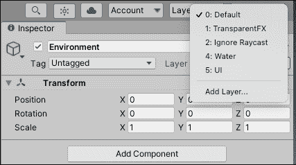

图 8.1：在检视器窗格中选择图层

1.  通过在第一个可用的槽中输入名称来添加一个名为`Ground`的新图层，该槽是第 6 层。尽管第 3 层为空，但层 0-5 保留给 Unity 的默认层，如下截图所示：

图 8.2：在检视器窗格中添加图层

1.  在“层次结构”中选择**环境**父游戏对象，单击**层**下拉菜单，然后选择**Ground**。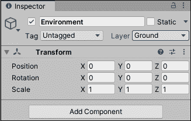

图 8.3：设置自定义图层

在选择了下图中显示的**Ground**选项后，当出现对话框询问是否要更改所有子对象时，单击**是，更改子对象**。在这里，您已经定义了一个名为**Ground**的新图层，并将**环境**的每个子对象分配到该图层。

从现在开始，所有**Ground**图层上的对象都可以被检查是否与特定对象相交。您将在接下来的挑战中使用这个功能，以确保玩家只能在地面上执行跳跃；这里没有无限跳跃的作弊。

由于我们不希望代码混乱`Update()`方法，我们将在实用函数中进行图层蒙版计算，并根据结果返回`true`或`false`值。操作如下：

1.  将以下突出显示的代码添加到`PlayerBehavior`中，然后再次播放场景：

```cs
public class PlayerBehavior : MonoBehaviour 
{
    **// 1**
    **public****float** **DistanceToGround =** **0.1f****;**
    **// 2** 
    **public** **LayerMask GroundLayer;**
    **// 3**
    **private** **CapsuleCollider _col;**
    // ... No other variable changes needed ...

    void Start()
    {
        _rb = GetComponent<Rigidbody>();

        **// 4**
        **_col = GetComponent<CapsuleCollider>();**
    }

    void Update()
    {
        // ... No changes needed ...
    }

    void FixedUpdate()
    {
        **// 5**
        if(**IsGrounded() &&** _isJumping)
        {
            _rb.AddForce(Vector3.up * JumpVelocity,
                 ForceMode.Impulse);
         }
         // ... No other changes needed ...
    }

    **// 6**
    **private****bool****IsGrounded****()**
    **{**
        **// 7**
        **Vector3 capsuleBottom =** **new** **Vector3(_col.bounds.center.x,**
             **_col.bounds.min.y, _col.bounds.center.z);**

        **// 8**
        **bool** **grounded = Physics.CheckCapsule(_col.bounds.center,**
            **capsuleBottom, DistanceToGround, GroundLayer,**
               **QueryTriggerInteraction.Ignore);**

        **// 9**
        **return** **grounded;**
    **}**
**}** 
```

1.  选择`PlayerBehavior`脚本，将**检视器**窗格中的**Ground Layer**设置为**Ground**，从**Ground Layer**下拉菜单中选择，如下截图所示：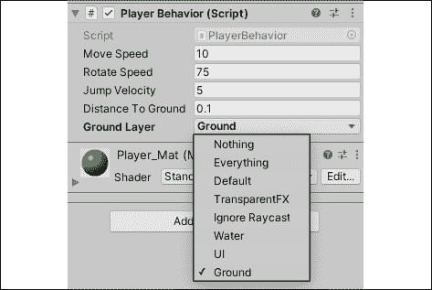

图 8.4：设置地面图层

让我们按照以下方式分解前面的代码：

1.  我们为将检查玩家胶囊碰撞体与任何**Ground Layer**对象之间的距离创建一个新变量。

1.  我们创建一个`LayerMask`变量，可以在**检视器**中设置，并用于碰撞体检测。

1.  我们创建一个变量来存储玩家的胶囊碰撞体组件。

1.  我们使用`GetComponent()`来查找并返回附加到玩家的胶囊碰撞体。

1.  我们更新`if`语句，以检查`IsGrounded`是否返回`true`并且在执行跳跃代码之前按下了空格键。

1.  我们声明了`IsGrounded()`方法，返回类型为`bool`。

1.  我们创建一个本地的`Vector3`变量来存储玩家胶囊碰撞体底部的位置，我们将用它来检查与**Ground**图层上的任何对象的碰撞。

+   所有碰撞体组件都有一个`bounds`属性，它使我们可以访问其*x*、*y*和*z*轴的最小、最大和中心位置。

+   碰撞体的底部是 3D 点，在中心*x*，最小*y*和中心*z*。

1.  我们创建一个本地的`bool`来存储我们从`Physics`类中调用的`CheckCapsule()`方法的结果，该方法接受以下五个参数：

+   胶囊的开始，我们将其设置为胶囊碰撞体的中间，因为我们只关心底部是否接触地面。

+   胶囊的末端，即我们已经计算过的`capsuleBottom`位置。

+   胶囊体的半径，即已设置的`DistanceToGround`。

+   我们要检查碰撞的图层蒙版，设置为**检视器**中的`GroundLayer`。

+   查询触发交互，确定方法是否应忽略设置为触发器的碰撞体。由于我们想要忽略所有触发器，我们使用了`QueryTriggerInteraction.Ignore`枚举。

我们还可以使用`Vector3`类的`Distance`方法来确定我们离地面有多远，因为我们知道玩家胶囊的高度。然而，我们将继续使用`Physics`类，因为这是本章的重点。

1.  我们在计算结束时返回存储在`grounded`中的值。

我们本可以手动进行碰撞计算，但那将需要比我们在这里有时间涵盖的更复杂的 3D 数学。然而，使用内置方法总是一个好主意。

我们刚刚在`PlayerBehavior`中添加的代码是一个复杂的代码片段，但是当你分解它时，我们做的唯一新的事情就是使用了`Physics`类的一个方法。简单来说，我们向`CheckCapsule()`提供了起始点和终点、碰撞半径和图层蒙版。如果终点距离图层蒙版上的对象的碰撞半径更近，该方法将返回`true`——这意味着玩家正在接触地面。如果玩家处于跳跃中的位置，`CheckCapsule()`将返回`false`。

由于我们在`Update()`中的`if`语句中每帧检查`IsGround`，所以我们的玩家的跳跃技能只有在接触地面时才允许。

这就是你要用跳跃机制做的一切，但玩家仍然需要一种方式来与并最终占领竞技场的敌人进行互动和自卫。在接下来的部分，你将通过实现一个简单的射击机制来填补这个空白。

# 发射抛射物

射击机制是如此普遍，以至于很难想象一个没有某种变化的第一人称游戏，*Hero Born*也不例外。在本节中，我们将讨论如何在游戏运行时从预制件中实例化游戏对象，并使用我们学到的技能来利用 Unity 物理学将它们向前推进。

## 实例化对象

在游戏中实例化一个游戏对象的概念类似于实例化一个类的实例——都需要起始值，以便 C#知道我们要创建什么类型的对象以及需要在哪里创建它。为了在运行时在场景中创建对象，我们使用`Instantiate()`方法，并提供一个预制对象、一个起始位置和一个起始旋转。

基本上，我们可以告诉 Unity 在这个位置创建一个给定的对象，带有所有的组件和脚本，朝着这个方向，然后一旦它在 3D 空间中诞生，就可以根据需要对其进行操作。在我们实例化一个对象之前，你需要创建对象的预制本身，这是你的下一个任务。

在我们射击任何抛射物之前，我们需要一个预制件作为参考，所以现在让我们创建它，如下所示：

1.  在**层次结构**面板中选择**+** | **3D** **对象** | **球体**，并将其命名为`Bullet`。

+   在**Transform**组件中将其**比例**在*x*、*y*和*z*轴上更改为 0.15。

1.  在**检视器**中选择**Bullet**，并在底部使用**添加组件**按钮搜索并添加一个**刚体**组件，将所有默认属性保持不变。

1.  在`材质`文件夹中使用**创建** | **材质**创建一个新的材质，并将其命名为`Bullet_Mat`：

+   将**Albedo**属性更改为深黄色。

+   在**层次结构**面板中，将**材质**文件夹中的材质拖放到`Bullet`游戏对象上。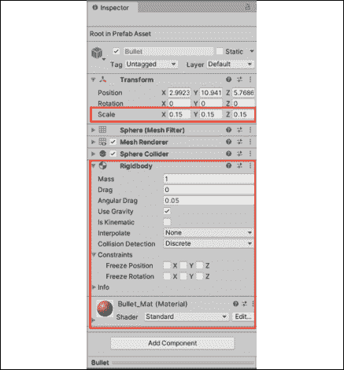

图 8.5：设置抛射物属性

1.  在**层次结构**面板中选择**Bullet**，并将其拖放到**项目**面板中的`预制件`文件夹中。然后，从**层次结构**中删除它以清理场景: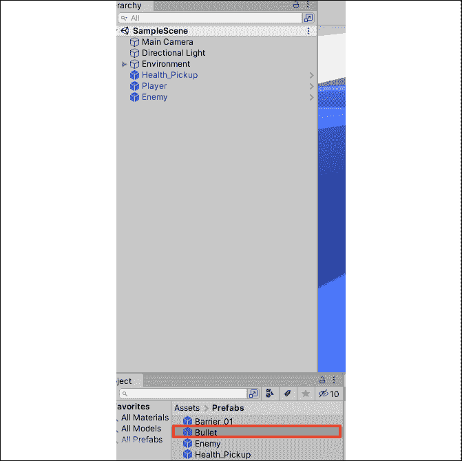

图 8.6：创建一个抛射物预制件

您创建并配置了一个可以根据需要在游戏中实例化多次并根据需要更新的**Bullet**预制体游戏对象。这意味着您已经准备好迎接下一个挑战——射击抛射物。

## 添加射击机制

现在我们有一个预制体对象可以使用，我们可以在按下鼠标左键时实例化并移动预制体的副本，以创建射击机制，如下所示：

1.  使用以下代码更新`PlayerBehavior`脚本：

```cs
public class PlayerBehavior : MonoBehaviour 
{
    **// 1**
    **public** **GameObject Bullet;**
    **public****float** **BulletSpeed =** **100f****;**

    **// 2**
    **private****bool** **_isShooting**;

    // ... No other variable changes needed ...

    void Start()
    {
        // ... No changes needed ...
    }

    void Update()
    {
        **// 3**
        **_isShooting |= Input.GetMouseButtonDown(****0****);**
        // ... No other changes needed ...
    }

    void FixedUpdate()
    {
        // ... No other changes needed ...

        **// 4**
        **if** **(_isShooting)**
        **{**
            **// 5**
            **GameObject newBullet = Instantiate(Bullet,**
                **this****.transform.position +** **new** **Vector3(****1****,** **0****,** **0****),**
                   **this****.transform.rotation);**
            **// 6**
            **Rigidbody BulletRB =** 
                 **newBullet.GetComponent<Rigidbody>();**

            **// 7**
            **BulletRB.velocity =** **this****.transform.forward *** 
                                            **BulletSpeed;**
        **}**
        **// 8**
        **_isShooting =** **false****;**
    }

    private bool IsGrounded()
    {
        // ... No changes needed ...
    }
} 
```

1.  在**检查器**中，将**Bullet**预制体从**项目**面板拖放到`PlayerBehavior`的**Bullet**属性中，如下截图所示：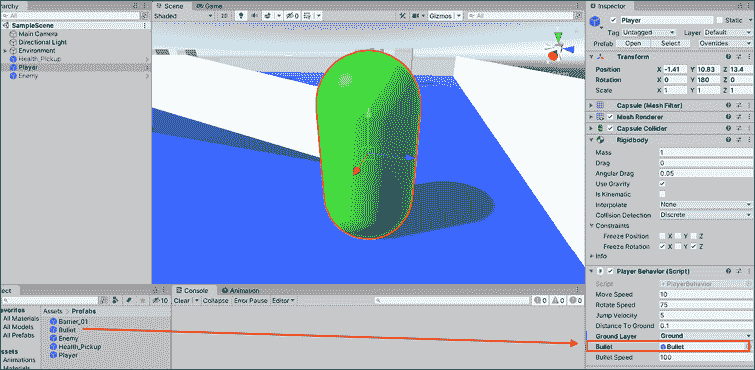

图 8.7：设置子弹预制体

1.  玩游戏，并使用鼠标左键向玩家面对的方向发射抛射物！

让我们来分解这段代码，如下所示：

1.  我们创建了两个变量：一个用于存储子弹预制体，另一个用于保存子弹速度。

1.  像我们的跳跃机制一样，我们在`Update`方法中使用布尔值来检查我们的玩家是否应该射击。

1.  我们使用`or`逻辑运算符和`Input.GetMouseButtonDown()`来设置`_isShooting`的值，如果我们按下指定的按钮，则返回`true`，就像使用`Input.GetKeyDown()`一样。

+   `GetMouseButtonDown()`接受一个`int`参数来确定我们要检查哪个鼠标按钮；`0`是左键，`1`是右键，`2`是中间按钮或滚轮。

1.  然后我们检查我们的玩家是否应该使用`_isShooting`输入检查变量进行射击。

1.  每次按下鼠标左键时，我们创建一个本地的 GameObject 变量：

+   我们使用`Instantiate()`方法通过传入`Bullet`预制体来为`newBullet`分配一个 GameObject。我们还使用玩家胶囊体的位置将新的`Bullet`预制体放在玩家前面，以避免任何碰撞。

+   我们将其附加为`GameObject`，以将返回的对象显式转换为与`newBullet`相同类型的对象，这种情况下是一个 GameObject。

1.  我们调用`GetComponent()`来返回并存储`newBullet`上的 Rigidbody 组件。

1.  我们将 Rigidbody 组件的`velocity`属性设置为玩家的`transform.forward`方向乘以`BulletSpeed`：

+   改变`velocity`而不是使用`AddForce()`确保我们的子弹在被射出时不会被重力拉成弧线。

1.  最后，我们将`_isShooting`的值设置为`false`，这样我们的射击输入就会为下一个输入事件重置。

再次，您显著升级了玩家脚本正在使用的逻辑。现在，您应该能够使用鼠标射击抛射物，这些抛射物直线飞出玩家的位置。

然而，现在的问题是，您的游戏场景和层次结构中充斥着已使用的子弹对象。您的下一个任务是在它们被发射后清理这些对象，以避免任何性能问题。

## 管理对象的积累

无论您是编写完全基于代码的应用程序还是 3D 游戏，都很重要确保定期删除未使用的对象，以避免过载程序。我们的子弹在被射出后并不起重要作用；它们只是继续存在于靠近它们碰撞的墙壁或物体附近的地板上。

对于这样的射击机制，这可能导致成百上千甚至数千颗子弹，这是我们不想要的。你的下一个挑战是在设定延迟时间后销毁每颗子弹。

对于这个任务，我们可以利用已经学到的技能，让子弹自己负责其自毁行为，如下所示：

1.  在`Scripts`文件夹中创建一个新的 C#脚本，命名为`BulletBehavior`。

1.  将`BulletBehavior`脚本拖放到`Prefabs`文件夹中的`Bullet`预制体上，并添加以下代码：

```cs
using System.Collections;
using System.Collections.Generic;
using UnityEngine;
public class BulletBehavior : MonoBehaviour 
{
    // 1
    public float OnscreenDelay = 3f;

    void Start () 
    {
        // 2
        Destroy(this.gameObject, OnscreenDelay);
    }
} 
```

让我们来分解这段代码，如下所示：

1.  我们声明一个`float`变量来存储我们希望子弹预制体在被实例化后场景中保留多长时间。

1.  我们使用`Destroy()`方法来删除 GameObject。

+   `Destroy()`总是需要一个对象作为参数。在这种情况下，我们使用`this`关键字来指定脚本所附加的对象。

+   `Destroy()`可以选择以额外的`float`参数作为延迟，我们用它来让子弹在屏幕上停留一小段时间。

再次玩游戏，射击一些子弹，观察它们在特定延迟后自动从**层次结构**中删除。这意味着子弹执行了其定义的行为，而不需要另一个脚本告诉它该做什么，这是*组件*设计模式的理想应用。

现在我们的清理工作已经完成，你将学习到任何精心设计和组织的项目中的一个关键组件——管理器类。

# 创建游戏管理器

在学习编程时一个常见的误解是所有变量都应该自动设为公共的，但一般来说，这不是一个好主意。根据我的经验，变量应该从一开始就被视为受保护和私有的，只有在必要时才设为公共的。你会看到有经验的程序员通过管理器类来保护他们的数据，因为我们想养成良好的习惯，所以我们也会这样做。把管理器类看作一个漏斗，重要的变量和方法可以安全地被访问。

当我说安全时，我的意思就是这样，这在编程环境中可能看起来不熟悉。然而，当你有不同的类相互通信和更新数据时，情况可能会变得混乱。这就是为什么有一个单一的联系点，比如一个管理器类，可以将这种情况降到最低。我们将在下一节中学习如何有效地做到这一点。

## 跟踪玩家属性

*英雄诞生*是一个简单的游戏，所以我们需要跟踪的唯一两个数据点是玩家收集了多少物品和剩余多少生命值。我们希望这些变量是私有的，这样它们只能从管理器类中修改，给我们控制和安全性。你的下一个挑战是为*英雄诞生*创建一个游戏管理器，并为其添加有用的功能。

游戏管理器类将是你未来开发的任何项目中的一个不变的组成部分，所以让我们学习如何正确地创建一个，如下所示：

1.  在`Scripts`文件夹中创建一个新的 C#脚本，并命名为`GameBehavior`。

通常这个脚本会被命名为`GameManager`，但 Unity 保留了这个名称用于自己的脚本。如果你创建了一个脚本，而其名称旁边出现了齿轮图标而不是 C#文件图标，那就表示它是受限制的。

1.  使用**+** | **创建空对象**在**层次结构**中创建一个新的空游戏对象，并命名为`Game_Manager`。

1.  从**Scripts**文件夹中将`GameBehavior.cs`脚本拖放到`Game_Manager`对象上，如下截图所示：

图 8.8：附加游戏管理器脚本

管理器脚本和其他非游戏文件被设置在空对象上，尽管它们不与实际的 3D 空间交互。

1.  将以下代码添加到`GameBehavior.cs`中：

```cs
public class GameBehavior : MonoBehaviour 
{
    private int _itemsCollected = 0;
    private int _playerHP = 10;
} 
```

让我们来分解这段代码。我们添加了两个新的`private`变量来保存捡起的物品数量和玩家剩余的生命值；这些是`private`的，因为它们只能在这个类中被修改。如果它们被设为`public`，其他类可以随意改变它们，这可能导致变量存储不正确或并发数据。

将这些变量声明为`private`意味着你有责任控制它们的访问。下一个关于`get`和`set`属性的主题将向你介绍一种标准、安全的方法来完成这项任务。

## 获取和设置属性

我们已经设置好了管理器脚本和私有变量，但如果它们是私有的，我们如何从其他类中访问它们呢？虽然我们可以在`GameBehavior`中编写单独的公共方法来处理将新值传递给私有变量，但让我们看看是否有更好的方法来做这些事情。

在这种情况下，C#为所有变量提供了`get`和`set`属性，这非常适合我们的任务。将这些视为方法，无论我们是否显式调用它们，C#编译器都会自动触发它们，类似于 Unity 在场景启动时执行`Start()`和`Update()`。

`get`和`set`属性可以添加到任何变量中，无论是否有初始值，如下面的代码片段所示：

```cs
public string FirstName { get; set; };
// OR
public string LastName { get; set; } = "Smith"; 
```

然而，像这样使用它们并没有添加任何额外的好处；为此，您需要为每个属性包括一个代码块，如下面的代码片段所示：

```cs
public string FirstName
{
    get {
        // Code block executes when variable is accessed
    }
    set {
        // Code block executes when variable is updated
    }
} 
```

现在，`get`和`set`属性已经设置好，可以根据需要执行额外的逻辑。然而，我们还没有完成，因为我们仍然需要处理新逻辑。

每个`get`代码块都需要返回一个值，而每个`set`代码块都需要

分配一个值；这就是拥有一个私有变量（称为支持变量）和具有`get`和`set`属性的公共变量的组合发挥作用的地方。私有变量保持受保护状态，而公共变量允许从其他类进行受控访问，如下面的代码片段所示：

```cs
private string _firstName
public string FirstName {
    get { 
        **return** _firstName;
    }
    set {
        _firstName = **value**;
    }
} 
```

让我们来分解一下，如下所示：

+   我们可以使用`get`属性随时从私有变量中`return`值，而不实际给予外部类直接访问。

+   每当外部类分配新值给公共变量时，我们可以随时更新私有变量，使它们保持同步。

+   `value`关键字是被分配的任何新值的替代品。

如果没有实际应用，这可能看起来有点晦涩，所以让我们使用具有 getter 和 setter 属性的公共变量来更新`GameBehavior`中的私有变量。

现在我们了解了`get`和`set`属性访问器的语法，我们可以在我们的管理器类中实现它们，以提高效率和代码可读性。

根据以下方式更新`GameBehavior`中的代码：

```cs
public class GameBehavior : MonoBehaviour 
{
    private int _itemsCollected = 0; 
    private int _playerHP = 10;

    **// 1**
    **public****int** **Items**
    **{**
        **// 2**
        **get** **{** **return** **_itemsCollected; }**
        **// 3**
        **set** **{** 
               **_itemsCollected =** **value****;** 
               **Debug.LogFormat(****"Items: {0}"****, _itemsCollected);**
        **}**
    **}**
    **// 4**
    **public****int** **HP** 
    **{**
        **get** **{** **return** **_playerHP; }**
        **set** **{** 
               **_playerHP =** **value****;** 
               **Debug.LogFormat(****"Lives: {0}"****, _playerHP);**
         **}**
    **}**
} 
```

让我们来分解一下代码，如下所示：

1.  我们声明了一个名为`Items`的新`public`变量，带有`get`和`set`属性。

1.  每当从外部类访问`Items`时，我们使用`get`属性来`return`存储在`_itemsCollected`中的值。

1.  我们使用`set`属性将`_itemsCollected`分配给`Items`的新`value`，每当它更新时，还添加了`Debug.LogFormat()`调用以打印出`_itemsCollected`的修改值。

1.  我们设置了一个名为`HP`的`public`变量，带有`get`和`set`属性，以补充私有的`_playerHP`支持变量。

现在，两个私有变量都是可读的，但只能通过它们的公共对应变量进行访问；它们只能在`GameBehavior`中进行更改。通过这种设置，我们确保我们的私有数据只能从特定的接触点进行访问和修改。这使得我们更容易从其他机械脚本与`GameBehavior`进行通信，以及在本章末尾创建的简单 UI 中显示实时数据。

让我们通过在竞技场成功与物品拾取交互时更新`Items`属性来测试一下。

## 更新物品集合

现在我们在`GameBehavior`中设置了变量，我们可以在场景中每次收集一个`Item`时更新`Items`，如下所示：

1.  将以下突出显示的代码添加到`ItemBehavior`脚本中：

```cs
public class ItemBehavior : MonoBehaviour 
{
    **// 1**
    **public** **GameBehavior GameManager;**
    **void****Start****()**
    **{**
          **// 2**
          **GameManager = GameObject.Find(****"Game_Manager"****).GetComponent<GameBehavior>();**
    **}**
    void OnCollisionEnter(Collision collision)
    {
        if (collision.gameObject.name == "Player")
        {
            Destroy(this.transform.parent.gameObject);
            Debug.Log("Item collected!");
            **// 3**
            **GameManager.Items +=** **1****;**
        }
    }
} 
```

1.  点击播放并收集拾取物品，以查看经理脚本中的新控制台日志打印输出，如下面的屏幕截图所示：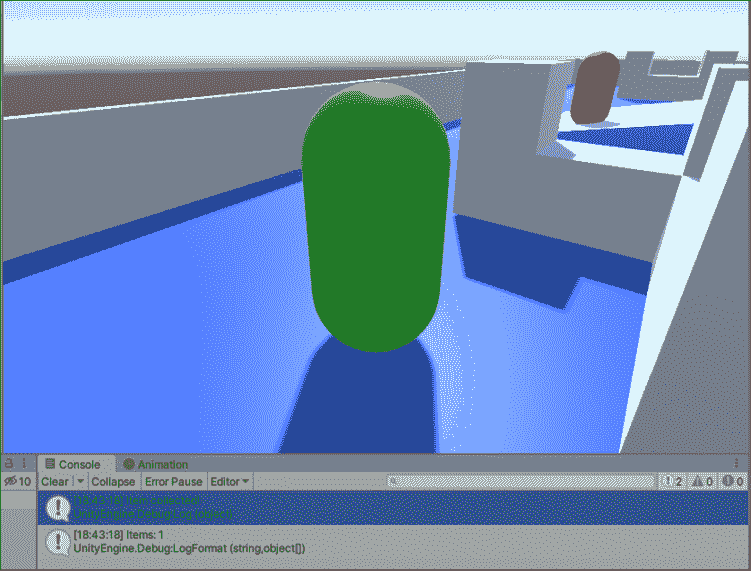

图 8.9：收集拾取物品

让我们来分解一下代码，如下所示：

1.  我们创建一个新的`GameBehavior`类型变量来存储对附加脚本的引用。

1.  我们使用`Start()`来通过`Find()`在场景中查找`GameManager`并添加一个`GetComponent()`调用来初始化它。

你会经常在 Unity 文档和社区项目中看到这种代码以一行的形式完成。这是为了简单起见，但如果你更喜欢单独编写`Find()`和`GetComponent()`调用，那就尽管去做吧；清晰、明确的格式没有错。

1.  在`OnCollisionEnter()`中，在 Item Prefab 被销毁后，我们会在`GameManager`类中递增`Items`属性。

由于我们已经设置了`ItemBehavior`来处理碰撞逻辑，修改`OnCollisionEnter()`以在玩家拾取物品时与我们的管理类通信变得很容易。请记住，像这样分离功能是使代码更灵活，并且在开发过程中进行更改时不太可能出错的原因。

*英雄诞生*缺少的最后一部分是一种向玩家显示游戏数据的接口。在编程和游戏开发中，这被称为 UI。本章的最后一个任务是熟悉 Unity 如何创建和处理 UI 代码。

# 创建 GUI

在这一点上，我们有几个脚本一起工作，让玩家可以移动、跳跃、收集和射击。然而，我们仍然缺少任何一种显示或视觉提示，来显示我们玩家的统计数据，以及赢得和输掉游戏的方法。在我们结束这一节时，我们将专注于这两个主题。

## 显示玩家统计数据

UI 是任何计算机系统的视觉组件。鼠标光标、文件夹图标和笔记本电脑上的程序都是 UI 元素。对于我们的游戏，我们希望有一个简单的显示，让我们的玩家知道他们收集了多少物品，他们当前的生命值，并且在某些事件发生时给他们更新的文本框。

Unity 中的 UI 元素可以通过以下两种方式添加：

+   直接从**层次结构**面板中的**+**菜单中，就像任何其他 GameObject 一样

+   使用代码中内置的 GUI 类

我们将坚持第一种选择，因为内置的 GUI 类是 Unity 传统 UI 系统的一部分，我们希望保持最新，对吧？这并不是说你不能通过编程的方式做任何事情，但对于我们的原型来说，更新的 UI 系统更合适。

如果你对 Unity 中的程序化 UI 感兴趣，请自行查看文档：[`docs.unity3d.com/ScriptReference/GUI.html`](https://docs.unity3d.com/ScriptReference/GUI.html)。

你的下一个任务是在游戏场景中添加一个简单的 UI，显示存储在`GameBehavior.cs`中的已收集物品、玩家生命和进度信息变量。

首先，在我们的场景中创建三个文本对象。Unity 中的用户界面是基于画布的，这正是它的名字。把画布想象成一块空白的画布，你可以在上面绘画，Unity 会在游戏世界的顶部渲染它。每当你在**层次结构**面板中创建你的第一个 UI 元素时，一个**Canvas**父对象会与之一起创建。

1.  在**层次结构**面板中右键单击，选择**UI** | **Text**，并将新对象命名为**Health**。这将同时创建一个**Canvas**父对象和新的**Text**对象：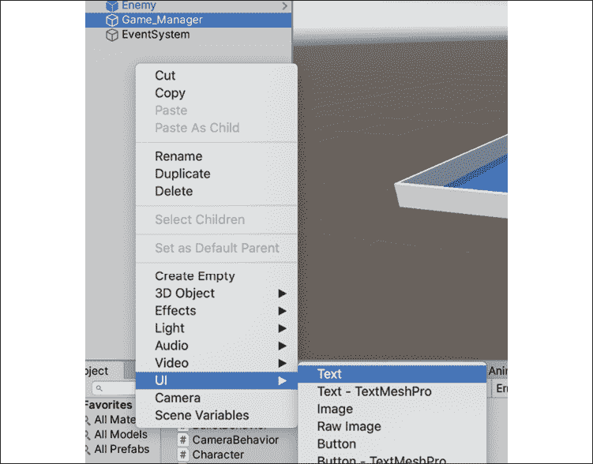

图 8.10：创建一个文本元素

1.  为了正确查看画布，请在“场景”选项卡顶部选择**2D**模式。从这个视图中，我们整个级别就是左下角的那条微小的白线。

+   即使**Canvas**和级别在场景中不重叠，当游戏运行时 Unity 会自动正确地叠加它们。

图 8.11：Unity 编辑器中的 Canvas

1.  如果你在“层次结构”中选择**Health**对象，你会看到默认情况下新的文本对象被创建在画布的左下角，并且它有一整套可定制的属性，比如文本和颜色，在**检视器**窗格中：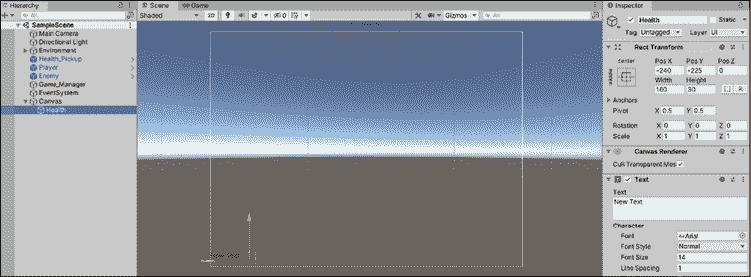

图 8.12：Unity 画布上的文本元素

1.  在**Hierarchy**窗格中选择**Health**对象，单击**检视器**中**Rect Transform**组件的**Anchor**预设，选择**左上角**。

+   锚点设置了 UI 元素在画布上的参考点，这意味着无论设备屏幕的大小如何，我们的健康点始终锚定在屏幕的左上角！[](img/B17573_08_13.png)

图 8.13：设置锚点预设

1.  在**检视器**窗格中，将**Rect Transform**位置更改为**X**轴上的**100**和**Y**轴上的**-30**，以将文本定位在右上角。还将**Text**属性更改为**Player Health:**。我们将在以后的步骤中在代码中设置实际值！[](img/B17573_08_14.png)

图 8.14：设置文本属性

1.  重复步骤 1-5 以创建一个新的 UI **Text**对象，并命名为**Items**：

+   将锚点预设设置为**左上角**，**Pos X**设置为**100**，**Pos Y**设置为**-60**

+   将**Text**设置为**Items Collected:**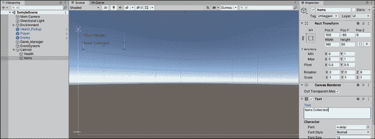

图 8.15：创建另一个文本元素

1.  重复*步骤 1-5*以创建一个新的 UI **Text**对象，并命名为**Progress**：

+   将锚点预设设置为**底部中心**，**Pos X**设置为**0**，**Pos Y**设置为**15**，**Width**设置为**280**

+   将**Text**设置为**收集所有物品并赢得你的自由！**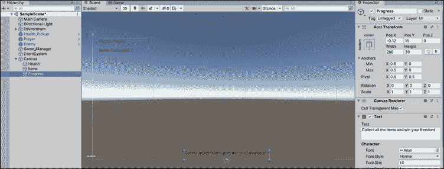

图 8.16：创建进度文本元素

现在我们的 UI 已经设置好了，让我们连接已经在游戏管理器脚本中拥有的变量。请按照以下步骤进行：

1.  使用以下代码更新`GameBehavior`以收集物品并在屏幕上显示文本：

```cs
// 1
using UnityEngine.UI; 
public class GameBehavior : MonoBehaviour 
{
    // 2
    public int MaxItems = 4;
    // 3
    public Text HealthText;     
    public Text ItemText;
    public Text ProgressText;
    // 4
    void Start()
    { 
        ItemText.text += _itemsCollected;
        HealthText.text += _playerHP;
    }
    private int _itemsCollected = 0;
    public int Items
    {
        get { return _itemsCollected; }
        set { 
            _itemsCollected = value; 
            **// 5**
            ItemText.text = "Items Collected: " + Items;
            // 6
            if(_itemsCollected >= MaxItems)
            {
                ProgressText.text = "You've found all the items!";
            } 
            else
            {
                ProgressText.text = "Item found, only " + (MaxItems - _itemsCollected) + " more to go!";
            }
        }
    }

    private int _playerHP = 10;
    public int HP 
    {
        get { return _playerHP; }
        set { 
            _playerHP = value;
            // 7
            HealthText.text = "Player Health: " + HP;
            Debug.LogFormat("Lives: {0}", _playerHP);
        }
    }
} 
```

1.  在**Hierarchy**中选择**Game_Manager**，并将我们的三个文本对象依次拖到**检视器**中的相应`GameBehavior`脚本字段中：

图 8.17：将文本元素拖到脚本组件

1.  运行游戏，看看我们新的屏幕 GUI 框，如下截图所示：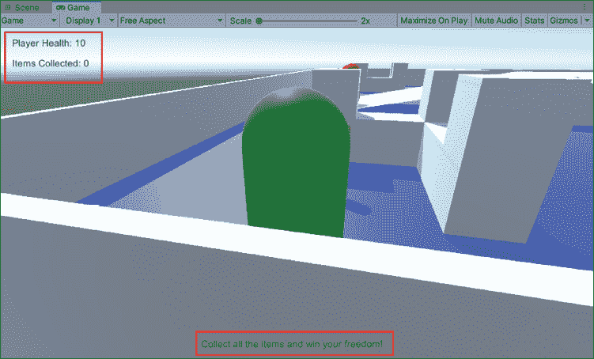

图 8.18：在播放模式中测试 UI 元素

让我们来分解代码，如下所示：

1.  我们添加了`UnityEngine.UI`命名空间，以便可以访问**Text**变量类型。

1.  我们为关卡中物品的最大数量创建了一个新的公共变量。

1.  我们创建了三个新的**Text**变量，将它们连接到**检视器**面板中。

1.  然后，我们使用`Start`方法使用**+=**运算符设置我们的健康和物品文本的初始值。

1.  每次收集一个物品，我们都会更新**ItemText**的`text`属性，显示更新后的`items`计数。

1.  我们在`_itemsCollected`的设置属性中声明了一个`if`语句。

+   如果玩家收集的物品数量大于或等于`MaxItems`，他们就赢了，`ProgressText.text`会更新。

+   否则，`ProgressText.text`显示还有多少物品可以收集。

1.  每当玩家的健康受到损害时，我们将在下一章中介绍，我们都会更新`HealthText`的`text`属性，显示新值。

现在玩游戏时，我们的三个 UI 元素显示出了正确的值；当收集一个物品时，`ProgressText`和`_itemsCollected`计数会更新，如下截图所示：


图 8.19：更新 UI 文本

每个游戏都可以赢得或输掉。在本章的最后一节，您的任务是实现这些条件以及与之相关的 UI。

## 胜利和失败条件

我们已经实现了核心游戏机制和简单的 UI，但是*Hero Born*仍然缺少一个重要的游戏设计元素：胜利和失败条件。这些条件将管理玩家如何赢得或输掉游戏，并根据情况执行不同的代码。

回到*第六章*的游戏文档，*使用 Unity 忙碌起来*，我们将我们的胜利和失败条件设置如下：

+   在剩余至少 1 个健康点的情况下收集所有物品以获胜

+   从敌人那里受到伤害，直到健康点数为 0 为止

这些条件将影响我们的 UI 和游戏机制，但我们已经设置了`GameBehavior`来有效处理这一点。我们的`get`和`set`属性将处理任何与游戏相关的逻辑和 UI 更改，当玩家赢得或输掉游戏时。

我们将在本节中实现赢得游戏的逻辑，因为我们已经有了拾取系统。当我们在下一章中处理敌人 AI 行为时，我们将添加失败条件逻辑。您的下一个任务是在代码中确定游戏何时赢得。

我们始终希望给玩家清晰和即时的反馈，因此我们将首先添加赢得游戏的逻辑，如下所示：

1.  更新`GameBehavior`以匹配以下代码：

```cs
public class GameBehavior : MonoBehaviour 
{ 
    **// 1**
    **public** **Button WinButton;**
    private int _itemsCollected = 0;
    public int Items
    {
        get { return _itemsCollected; }
        set
        {
            _itemsCollected = value;
            ItemText.text = "Items Collected: " + Items;

            if (_itemsCollected >= MaxItems)
            {
                ProgressText.text = "You've found all the items!";

                **// 2**
                **WinButton.gameObject.SetActive(****true****);**
            }
            else
            {
                ProgressText.text = "Item found, only " + (MaxItems - _itemsCollected) + " more to go!";
            }
        }
    }
} 
```

1.  右键单击**Hierarchy**，然后选择**UI** | **Button**，然后将其命名为**Win Condition**：

+   选择**Win Condition**，将**Pos X**和**Pos Y**设置为**0**，将**Width**设置为**225**，将**Height**设置为**115**。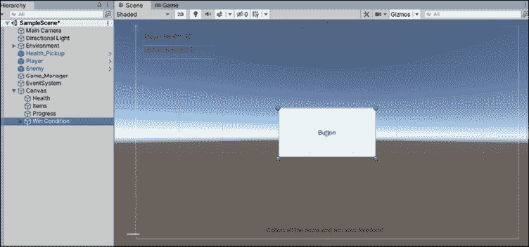

图 8.20：创建 UI 按钮

1.  单击**Win Condition**按钮右侧的箭头以展开其文本子对象，然后更改文本为**You won!**：

图 8.21：更新按钮文本

1.  再次选择**Win Condition**父对象，然后单击**Inspector**右上角的复选标志。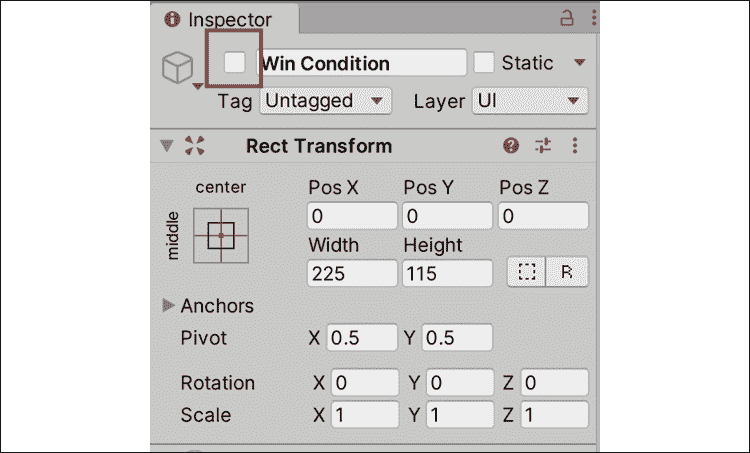

图 8.22：停用游戏对象

这将在我们赢得游戏之前隐藏按钮：

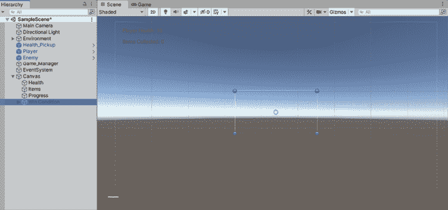

图 8.23：测试隐藏的 UI 按钮

1.  在**Hierarchy**中选择**Game_Manager**，然后将**Win Condition**按钮从**Hierarchy**拖动到**Inspector**中的**Game Behavior (Script)**，就像我们在文本对象中所做的那样！[](img/B17573_08_24.png)

图 8.24：将 UI 按钮拖动到脚本组件上

1.  在**Inspector**中将**Max Items**更改为`1`，以测试新屏幕，如下截图所示：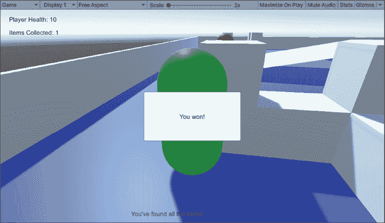

图 8.25：显示赢得游戏的屏幕

让我们来分解代码，如下所示：

1.  我们创建了一个 UI 按钮变量，以连接到**Hierarchy**中的**Win Condition**按钮。

1.  由于我们在游戏开始时将 Win Condition 按钮设置为**隐藏**，因此当游戏赢得时，我们会重新激活它。

将**Max Items**设置为`1`，**Win**按钮将在收集场景中唯一的`Pickup_Item`时显示出来。目前单击按钮不会产生任何效果，但我们将在下一节中解决这个问题。

## 使用指令和命名空间暂停和重新开始游戏

目前，我们的赢得条件按预期工作，但玩家仍然可以控制胶囊，并且在游戏结束后没有重新开始游戏的方法。Unity 在`Time`类中提供了一个名为`timeScale`的属性，当设置为`0`时，会冻结游戏场景。但是，要重新开始游戏，我们需要访问一个名为`SceneManagement`的**命名空间**，这在默认情况下无法从我们的类中访问。

命名空间收集并将一组类分组到特定名称下，以组织大型项目并避免可能共享相同名称的脚本之间的冲突。需要向类中添加`using`指令才能访问命名空间的类。

从 Unity 创建的所有 C#脚本都带有三个默认的`using`指令，如下面的代码片段所示：

```cs
using System.Collections;
using System.Collections.Generic;
using UnityEngine; 
```

这些允许访问常见的命名空间，但 Unity 和 C#还提供了许多其他可以使用`using`关键字后跟命名空间名称添加的命名空间。

由于我们的游戏在玩家赢或输时需要暂停和重新开始，这是一个很好的时机来使用默认情况下新的 C#脚本中不包括的命名空间。

1.  将以下代码添加到`GameBehavior`并播放：

```cs
using System.Collections;
using System.Collections.Generic;
using UnityEngine;
using UnityEngine.UI;
**// 1**
**using** **UnityEngine.SceneManagement;**
public class GameBehavior : MonoBehaviour 
{
    // ... No changes needed ...
    private int _itemsCollected = 0;
    public int Items
    {
        get { return _itemsCollected; }
        set { 
            _itemsCollected = value;

            if (_itemsCollected >= MaxItems)
            {
                ProgressText.text = "You've found all the items!";
                WinButton.gameObject.SetActive(true);

                **// 2**
                **Time.timeScale =** **0f****;**
            }
            else
            {
                ProgressText.text= "Item found, only " + (MaxItems – _itemsCollected) + " more to go!";
            }
        }
    }
    **public****void****RestartScene****()**
    **{**
        **// 3**
        **SceneManager.LoadScene(****0****);**
        **// 4**
        **Time.timeScale =** **1f****;**
    **}**

    // ... No other changes needed ...
} 
```

1.  从**Hierarchy**中选择**Win Condition**，在**Inspector**中向下滚动到**Button**组件的**OnClick**部分，然后单击加号图标：

+   每个 UI 按钮都有一个**OnClick**事件，这意味着您可以将来自脚本的方法分配给在按钮被按下时执行。

+   您可以在单击按钮时触发多个方法，但在这种情况下我们只需要一个！[](img/B17573_08_26.png)

图 8.26：按钮的 OnClick 部分

1.  从**Hierarchy**中，将**Game_Manager**拖放到**Runtime**下方的插槽中，告诉按钮我们要选择一个来自我们管理器脚本的方法在按钮被按下时触发！[](img/B17573_08_27.png)

图 8.27：在点击时设置游戏管理器对象

1.  选择**No Function**下拉菜单，选择**GameBehavior** | **RestartScene ()**来设置我们希望按钮执行的方法！[](img/B17573_08_28.png)

图 8.28：选择按钮点击的重新启动方法

1.  转到**Window** | **Rendering** | **Lighting**，并在底部选择**Generate Lighting**。确保未选择**Auto Generate**：

这一步是必要的，以解决 Unity 重新加载场景时没有任何照明的问题。

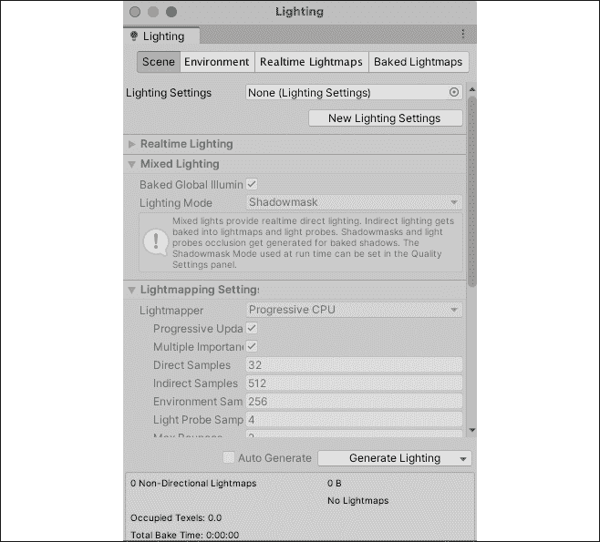

图 8.29：Unity 编辑器中的照明面板

让我们来分解代码，如下所示：

1.  我们使用`using`关键字添加了`SceneManagement`命名空间，该命名空间处理所有与场景相关的逻辑，如创建加载场景。

1.  当显示胜利屏幕时，我们将`Time.timeScale`设置为`0`，这将暂停游戏，禁用任何输入或移动。

1.  我们创建了一个名为`RestartScene`的新方法，并在单击胜利屏幕按钮时调用`LoadScene()`：

+   `LoadScene()`以`int`参数形式接受场景索引。

+   因为我们的项目中只有一个场景，所以我们使用索引`0`从头开始重新启动游戏。

1.  我们将`Time.timeScale`重置为默认值`1`，以便在场景重新启动时，所有控件和行为都能够再次执行。

现在，当您收集物品并单击胜利屏幕按钮时，关卡将重新开始，所有脚本和组件都将恢复到其原始值，并准备好进行另一轮！

# 摘要

恭喜！*英雄诞生*现在是一个可玩的原型。我们实现了跳跃和射击机制，管理了物理碰撞和生成对象，并添加了一些基本的 UI 元素来显示反馈。我们甚至已经实现了玩家赢得比赛时重置关卡的功能。

本章介绍了许多新主题，重要的是要回过头去确保您理解了我们编写的代码中包含了什么。特别注意我们对枚举、`get`和`set`属性以及命名空间的讨论。从现在开始，随着我们进一步深入 C#语言的可能性，代码将变得更加复杂。

在下一章中，我们将开始着手让我们的敌人游戏对象在我们离得太近时注意到我们的玩家，从而导致一种跟随和射击协议，这将提高我们玩家的赌注。

# 快速测验-与机械一起工作

1.  枚举类型的数据存储什么类型的数据？

1.  您将如何在活动场景中创建预制游戏对象的副本？

1.  哪些变量属性允许您在引用或修改它们的值时添加功能？

1.  哪个 Unity 方法显示场景中的所有 UI 对象？

# 加入我们的 Discord！

与其他用户一起阅读本书，与 Unity/C#专家和 Harrison Ferrone 一起阅读，通过*问我任何事*会话与作者交流，提出问题，为其他读者提供解决方案，等等。

立即加入！

[`packt.link/csharpunity2021`](https://packt.link/csharpunity2021)


